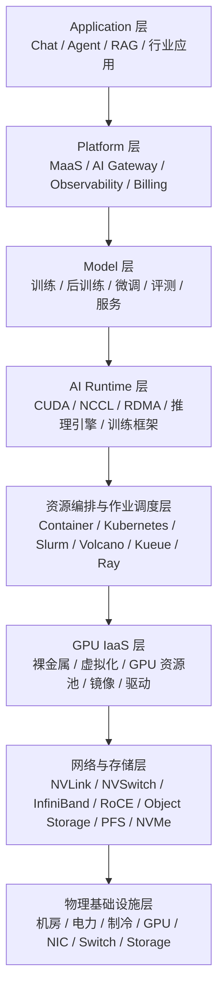

# AI Factory Engineering

《AI Factory 工程：从应用到 GPU 基础设施》

## 这本书解决什么问题

AI Factory 不是单一 GPU 集群，也不是一个 MaaS API。它是一套把 AI 应用需求持续转化为 token、模型能力和业务价值的生产系统。本书试图回答三个工程问题：

- 一个推理请求如何穿过网关、模型服务、运行时、GPU 和计费系统，最终变成可观测、可计量的 token？
- 一个训练任务如何从队列、配额、gang scheduling、GPU 分配、数据读取、NCCL 通信一路变成可注册、可评测、可服务的模型？
- 这些链路背后的容量、可靠性、成本和验收标准如何被设计，而不是靠经验临场处理？

## 一张图理解 AI Factory

## 两条主线

推理请求路径：

训练任务路径：

## 适合谁读

本书面向具备云计算、Kubernetes、后端工程或基础设施经验，但还没有系统理解 AI Infra 的工程师、架构师、SRE、平台团队和技术管理者。

## 如何阅读

如果你从应用侧进入，建议从第 1 章到第 8 章读起，再回到 Runtime 和调度层。如果你负责 GPU 集群或平台建设，建议从第 20 章开始读调度、GPU on Kubernetes、准入验收，再向上补 Platform 和模型服务。若你关心商业化和成本，应把第 41 章作为第二入口。

如果你已经带着一个具体问题进入，例如“为什么 GPU 空闲但任务 pending”“为什么容器里看不到 GPU”“为什么 RAG 引用错”“为什么推理毛利下降”，建议先看 [系统地图与工程索引](system-map.md)。它按角色、故障症状、工程对象和主题链路整理了全书入口。

## 当前状态

当前阶段已经完成 Material for MkDocs 项目骨架、全书目录、术语表、写作规范，以及第 0-44 章的系统化初稿。后续重点是补充官方引用、经典论文、工程案例、跨章节索引、图表精修和更多可执行 runbook。
