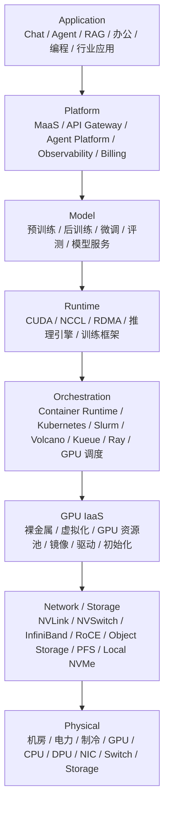

# 第 0 章：从 Data Center 到 AI Factory

## 本章回答的问题

- 为什么大模型时代需要用 AI Factory 重新理解基础设施？
- AI Factory 和传统 Data Center、GPU 集群、MaaS 平台分别是什么关系？
- 推理请求和训练任务如何贯穿从应用到物理基础设施的所有层次？

## 0.1 云计算时代的数据中心

云计算时代的数据中心主要生产通用计算资源。用户关心的是虚拟机、容器、负载均衡、数据库、对象存储和网络连通性。平台团队关心的是资源池化、弹性伸缩、故障隔离、自动化运维和成本摊销。这个时代的核心抽象是“通用工作负载”：Web 服务、批处理任务、数据库、缓存、消息队列和数据分析作业都可以被放进相对统一的云资源模型里。

这种模型仍然重要。AI Factory 依然需要机房、电力、网络、存储、裸金属、Kubernetes、监控和权限系统。但大模型 workload 改变了约束条件：训练任务可能一次占用数百到数千张 GPU，要求同步启动、长期稳定运行和高带宽集合通信；推理服务不只是返回 HTTP 响应，而是以 token streaming 的方式持续生产输出，并且每个 token 都会影响体验、容量和账单。

传统数据中心偏向“资源交付”，AI Factory 更接近“生产系统”。它不仅交付 GPU，还要保证 GPU 能通过模型、运行时、调度、网络、存储和平台能力转化为可用的 AI 产品。

## 0.2 大模型时代的根本变化

大模型带来的变化不只是算力更贵，而是系统瓶颈变得更加耦合。一个 Chat 请求的慢，可能来自 API Gateway 排队、模型路由错误、prefill 太长、KV Cache 不足、batching 策略不合适、CUDA kernel 效率低、GPU HBM 带宽压力大，或者 token streaming 链路被阻塞。一个训练任务失败，可能来自镜像版本、CUDA/NCCL/Driver 兼容性、RDMA 配置、数据读取、checkpoint 写入、节点健康或某条网络链路抖动。

这意味着 AI Infra 不能只靠单层优化。应用层的上下文长度会向下影响显存容量；Agent 的多轮工具调用会放大 token 消耗并改变限流策略；模型并行策略会要求调度器理解 GPU 拓扑；checkpoint 策略会改变存储带宽和故障恢复时间；机房电力和制冷会限制可交付 GPU 密度。

## 0.3 AI Factory 的定义

本书中的 AI Factory 指一套从应用到 GPU 基础设施的完整生产系统。它把业务请求、模型能力、运行时、资源调度、GPU IaaS、网络存储和物理设施组织起来，持续生产模型能力和 token。

AI Factory 至少包含四类输入：业务需求、模型与数据、算力资源、工程约束。它的输出也不只是模型文件，还包括在线 token、离线生成结果、微调模型、评测报告、可计费用量、可靠性指标和容量计划。

因此，AI Factory 不能等同于 GPU 集群。GPU 集群只是生产资料的一部分。没有模型服务、调度、监控、准入、计量、成本核算和故障处理，GPU 很容易变成昂贵但不可预测的资源池。

## 0.4 Token Factory 视角

Token Factory 是观察 AI Factory 产出的经济性视角。对在线推理来说，token 是最容易被度量和计费的产出单元。tokens/s 描述产能，tokens/W 描述能效，cost per token 描述单位成本，revenue per token 描述商业化收入。

这个视角的价值在于把技术指标和经营指标连接起来。TTFT 影响用户体验，TPOT 影响输出速度，GPU 利用率影响成本，模型质量影响付费意愿，限流和排队影响 SLA。最终这些都会落到单位 token 的成本、收入和毛利上。

但 Token Factory 不是 AI Factory 的同义词。AI Factory 是完整系统，Token Factory 是一种度量和经营视角。训练、评测、模型注册、数据处理、准入测试等环节不直接售卖 token，却会决定未来 token 的质量、成本和可靠性。

## 0.5 AI Factory 的七层模型

本书采用从上到下的分层模型：Application、Platform、Model、AI Runtime、资源编排与作业调度、GPU IaaS、网络与存储、物理基础设施。严格说这是八个层次；其中网络与存储常作为基础设施横向支撑层，也会和 GPU IaaS、物理层交叉讨论。

这里特别强调：Kubernetes、Slurm、容器和 GPU 调度不应被简单归到 IaaS 或 PaaS。它们承担的是资源编排与作业调度职责。MaaS、模型 API、Agent 平台、API Gateway、计费和平台可观测性更接近 Platform 层。GPU IaaS 则关注裸金属、虚拟化、资源池、镜像、驱动、租户、网络和存储资源交付。

## 0.6 一次推理请求的完整路径

一次推理请求通常从应用发起。用户输入消息后，请求进入 AI Gateway，经过认证鉴权、租户限流、配额检查和模型路由，再进入具体模型服务。模型服务把请求加入队列，推理引擎执行 prefill 构建 KV Cache，然后进入 decode 阶段逐 token 生成输出。每个 token 通过 streaming 返回给用户，同时被计量、记录、计费和观测。

```mermaid
flowchart LR
  User["用户请求"] --> Gateway["AI Gateway"] --> Auth["认证鉴权"] --> Rate["租户限流"] --> Router["模型路由"]
  Router --> Server["推理服务"] --> Queue["请求队列 / batching"] --> Prefill["prefill"] --> Decode["decode"]
  Decode --> KV["KV Cache"] --> Kernel["CUDA kernel"] --> GPU["GPU / HBM"]
  GPU --> Stream["token streaming"] --> Meter["token 计量"] --> Obs["billing / observability"]
```

这条链路说明应用体验会反向决定基础设施设计。长上下文提升能力，但增加 prefill 延迟和 HBM 占用；更快的首 token 要求更短队列和更合理的 prefill 调度；更低 cost per token 要求更高 GPU 利用率和更好的 batching；更强租户隔离会带来资源碎片和调度复杂度。

## 0.7 一次训练任务的完整路径

训练任务的路径更接近 HPC 和云原生调度的结合。用户提交训练任务后，平台需要进入队列，检查项目配额、优先级、镜像、数据权限和作业规格。分布式训练通常需要 gang scheduling，所有 worker 获得资源后才启动。任务启动后读取数据，初始化 NCCL，执行 forward/backward，进行 gradient communication，周期性写 checkpoint，完成后进入 evaluation、model registry 和 model serving。

```mermaid
flowchart LR
  Submit["训练任务提交"] --> Queue["队列"] --> Quota["配额"] --> Gang["gang scheduling"] --> Alloc["GPU 分配"]
  Alloc --> Image["镜像启动"] --> Data["数据读取"] --> Init["NCCL 初始化"] --> FB["forward / backward"]
  FB --> Comm["gradient communication"] --> Ckpt["checkpoint"] --> Eval["evaluation"] --> Registry["model registry"] --> Serving["model serving"]
```

训练任务对基础设施的要求不是“能跑容器”这么简单。它要求调度器理解多副本同步启动，要求网络提供稳定低延迟 RDMA，要求存储承受数据读取和 checkpoint 写入，要求节点健康状态能被持续检测，要求失败后可以定位是模型、数据、通信、硬件还是环境问题。

## 0.8 为什么 AI Factory 是系统工程

AI Factory 的难点在于局部正确不等于整体可用。模型可以在单机上正确生成，但上线后可能被长上下文和并发压垮；Kubernetes 集群可以正常调度 Pod，但分布式训练可能因为缺少 gang scheduling 而半启动；GPU 节点可以通过基础健康检查，但 NCCL test 暴露跨节点带宽异常；对象存储可用，但 checkpoint 高峰期写入抖动会导致训练暂停。

系统工程要求统一输入输出、依赖关系、故障域和度量口径。每一层都要回答四个问题：它向上提供什么能力，向下依赖什么资源，如何被观测，如何被验收。只有这样，AI Factory 才能从“堆组件”变成可持续运行的生产系统。

## 0.9 本书阅读路径

如果你从应用或平台进入，可以先读 Part 1 和 Part 2，理解 token、请求治理、计量和平台可观测性，再读模型服务和推理引擎。如果你负责调度或 GPU 集群，可以从 Part 5、Part 6 和 Part 9 开始，建立 workload、GPU on Kubernetes、准入验收和故障诊断框架。如果你负责技术战略或商业化，应重点阅读第 0 章、第 41 章和第 44 章，把系统能力和经济性连接起来。

## 小结

- AI Factory 是从应用到物理基础设施的端到端生产系统，不等同于 GPU 集群。
- Token Factory 是 AI Factory 的产出度量和经济性视角，不是完整技术栈。
- 推理请求和训练任务是理解 AI Factory 的两条主线。
- Kubernetes、Slurm、容器和 GPU 调度属于资源编排与作业调度层。
- AI Factory 的工程质量取决于跨层设计、观测、验收和成本闭环。

## 延伸阅读

- TODO: 官方文档
- TODO: 经典论文
- TODO: 工程案例
