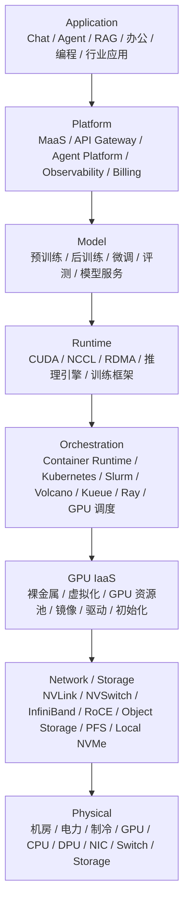

```mermaid
flowchart LR
  User["用户请求"] --> Gateway["AI Gateway"] --> Auth["认证鉴权"] --> Rate["租户限流"] --> Router["模型路由"]
  Router --> Server["推理服务"] --> Queue["请求队列 / batching"] --> Prefill["prefill"] --> Decode["decode"]
  Decode --> KV["KV Cache"] --> Kernel["CUDA kernel"] --> GPU["GPU / HBM"]
  GPU --> Stream["token streaming"] --> Meter["token 计量"] --> Obs["billing / observability"]
```

```mermaid
flowchart LR
  Submit["训练任务提交"] --> Queue["队列"] --> Quota["配额"] --> Gang["gang scheduling"] --> Alloc["GPU 分配"]
  Alloc --> Image["镜像启动"] --> Data["数据读取"] --> Init["NCCL 初始化"] --> FB["forward / backward"]
  FB --> Comm["gradient communication"] --> Ckpt["checkpoint"] --> Eval["evaluation"] --> Registry["model registry"] --> Serving["model serving"]
```

# 第 0 章：从 Data Center 到 AI Factory

## 0.1 本章回答的问题

- 为什么大模型时代需要用 AI Factory 重新理解基础设施？
- AI Factory 和传统 Data Center、GPU 集群、MaaS 平台分别是什么关系？
- 推理请求和训练任务如何贯穿从应用到物理基础设施的所有层次？

## 0.2 本章上下文

- 层级定位：本章属于 `导论`，重点讨论AI Factory 总体定义、分层模型、推理请求链路和训练任务链路。
- 前置依赖：建议先理解 全书导论和首页的 AI Factory 分层模型 中的核心对象和路径。
- 后续关联：本章内容会继续连接到 第 1 章：从一个 Chat 请求开始，并在系统地图、深度标准和读者测试中被交叉引用。
- 读完能力：读完本章后，读者应能把《从 Data Center 到 AI Factory》中的概念映射到 AI Factory 的生产路径、工程对象、观测证据和设计取舍。

## 0.3 读者测试

- 机制题：读者能否解释 云计算时代的数据中心、大模型时代的根本变化、AI Factory 的定义、Token Factory 视角 的核心机制，以及它们如何共同支撑《从 Data Center 到 AI Factory》？
- 边界题：读者能否区分 传统 Data Center、GPU 集群、MaaS、AI Factory 与 Token Factory 的责任边界，并说明哪些问题不能简单归因到本章组件？
- 路径题：读者能否从业务问题追到 AI Factory 分层、推理请求链路、训练任务链路和 Token Factory 经济视角，并指出本章对象在路径中的位置？
- 排障题：当《从 Data Center 到 AI Factory》相关生产症状出现时，读者能否列出第一层证据、下一跳证据、可能 owner 和止血动作？


## 0.4 一个真实场景

一个团队采购了一批 GPU 服务器，机房、电力、网络、存储和 Kubernetes 集群都已经准备好。第一批业务很快接入 Chat API，但用户反馈首 token 很慢；训练团队提交 64 卡任务后长期 pending；SRE 看到 GPU 利用率并不低，财务却无法解释每个业务线到底消耗了多少成本。硬件已经到位，平台也能启动容器，但系统还没有形成稳定、可计量、可诊断的 AI 生产能力。

继续排查会发现，问题不在单个组件。Chat 请求慢，可能是长上下文进入同一 prefill 队列，也可能是模型权重冷启动、KV Cache 紧张或网关路由不合理。训练任务 pending，可能是 quota 不足、gang scheduling 不满足、GPU 拓扑不匹配，也可能是某批节点没有通过 NCCL 基线。成本不可解释，通常是因为只记录了 GPU 分配时间，没有记录 input token、output token、失败重试、空闲容量和租户标签。

这个场景说明，AI Factory 不是“有 GPU 的数据中心”，也不是“部署了 MaaS API 的平台”。它要求应用、平台、模型、运行时、调度、GPU IaaS、网络存储和物理设施形成闭环。用户看到的是 token，模型团队看到的是训练任务和评测指标，平台团队看到的是队列、配额和服务实例，基础设施团队看到的是节点、链路和故障域。AI Factory 的工程价值，就是让这些视角用同一套对象、指标和验收标准对齐。

如果把这个问题继续追到组织层，会发现每个团队的话都“局部正确”。应用团队说 API 可用但体验慢，平台团队说请求都进了队列，基础设施团队说 GPU 没坏，财务团队说账单无法分摊。真正缺失的是端到端生产语义：一次请求从租户、模型、上下文长度到 GPU、HBM 和 token 计量的关联；一次训练从队列、配额、拓扑到 checkpoint 和 model registry 的关联；一次故障从用户体验、运行时日志、节点健康到物理故障域的关联。没有这些关联，系统只能靠会议和经验运行。AI Factory 的起点，就是把这些关联显式建模。

## 0.5 核心概念

AI Factory 是把 AI 应用需求持续转化为模型能力、在线 token 和业务价值的生产系统。它不是一个单独产品，也不是某个基础设施层的别名。Data Center 提供空间、电力、制冷、网络和通用计算资源；GPU 集群提供加速计算资源；MaaS 提供模型 API 和平台化入口；AI Factory 则把这些资源组织成可运行、可计量、可诊断、可迭代、可商业化的端到端系统。

理解这个概念时，最容易犯两个错误。第一个错误是把 AI Factory 等同于 GPU 集群，认为只要 GPU 数量足够、驱动安装正确、Kubernetes 能调度 Pod，系统就已经完成。事实上，没有模型生命周期、推理服务、作业队列、准入测试、故障诊断、计量计费和成本治理，GPU 只能算昂贵库存。第二个错误是把 AI Factory 等同于 MaaS，忽略模型 API 背后的运行时、调度、网络、存储和物理故障域。MaaS 是上层产品形态，AI Factory 是支撑它长期运行的生产系统。

Token Factory 是本书引入的经济性视角，用 token 衡量在线推理产出，用 tokens/s 衡量产能，用 tokens/W 衡量能效，用 cost per token 和 revenue per token 衡量经营质量。它不能替代 AI Factory，因为训练、评测、数据处理、准入验收和 SRE 不一定直接产出可售 token，却决定 token 的质量、成本和可靠性。把二者区分清楚，才能既避免“只买 GPU”的工程短视，也避免“只看 API”的平台短视。

在工程讨论中，AI Factory 还应具备三个可验证特征。第一，它有生产对象：request、token、model、job、checkpoint、node、GPU、tenant 和 cost center 都能被唯一标识和追踪。第二，它有生产流程：推理、训练、评测、发布、计量、验收和故障处理不是临时脚本，而是有状态、有指标、有责任人的流程。第三，它有反馈闭环：SLO、成本、质量、故障和容量数据能反向影响模型选择、调度策略、硬件规划和商业定价。缺少这些特征时，即使系统规模很大，也更像资源堆叠，而不是工厂。

## 0.6 系统架构

本书采用自上而下的分层模型理解 AI Factory：Application 层定义业务交互，Platform 层提供 API、治理和计量，Model 层管理训练、评测和服务化，Runtime 层把模型计算映射到 CUDA、NCCL、推理引擎和训练框架，资源编排与作业调度层决定任务何时、何地、以何种拓扑运行，GPU IaaS 层交付可用 GPU 节点，网络与存储层提供通信和数据路径，物理基础设施层提供机房、电力、制冷和硬件。

这个分层不是为了画组织架构，而是为了定位工程责任。一个用户请求 TTFT 变差，可能在 Application 层表现为体验问题，在 Platform 层表现为队列和路由问题，在 Runtime 层表现为 prefill 过载，在 GPU 层表现为 HBM 紧张，在网络存储层表现为权重加载慢。一个训练任务失败，也可能从模型代码一路追到 NCCL、RDMA、交换机端口、存储延迟和节点健康。分层的价值，是让排查有路径，让指标有归属，让设计取舍能被讨论。

还要注意，Kubernetes、Slurm、容器和 GPU 调度不应被简单归类为 PaaS 或 IaaS。它们承担的是资源编排与作业调度职责：理解 workload、队列、配额、拓扑、gang scheduling、抢占和多集群策略。MaaS、Agent Platform、API Gateway、Observability 和 Billing 更接近 Platform 层。GPU IaaS 则关注裸金属、虚拟化、资源池、镜像、驱动和节点初始化。把层次放错，会导致组织边界和技术责任都混乱。

用这张图读全书时，可以采用“向下追因、向上验收”的方法。向下追因，是从一个用户可见问题出发，逐层寻找真正约束：延迟问题可能追到 prefill，也可能追到 HBM 或权重缓存；训练失败可能追到 NCCL，也可能追到某个 rack 的网络配置。向上验收，是从一个底层能力出发，确认它是否真的转化为业务能力：GPU 通过 burn-in 只是第一步，还要看 NCCL、存储、调度和模型服务；网络带宽达标也只是第一步，还要看训练 step time 和推理冷启动。分层架构只有和这两种动作结合，才不是静态图。



## 0.7 云计算时代的数据中心

云计算时代的数据中心主要生产通用计算资源。用户购买虚拟机、容器、负载均衡、数据库、对象存储和网络能力；平台团队把服务器、交换机、存储和机房能力抽象成资源池；SRE 关注可用区、故障隔离、弹性伸缩、自动化运维和成本摊销。这个阶段的核心抽象是“通用 workload”：Web 服务、批处理任务、数据库、缓存、消息队列和数据分析作业，都可以被放进相对统一的 CPU、内存、磁盘和网络模型中。

这种模型仍然是 AI Factory 的基础。AI Factory 依然需要机房、电力、制冷、资产系统、裸金属交付、虚拟化、Kubernetes、监控、权限、网络隔离、对象存储和日志系统。没有这些能力，GPU 集群无法规模化运行。区别在于，大模型 workload 改变了资源之间的耦合强度。通用 Web 服务可以通过更多副本水平扩展，单个副本故障通常可以快速替换；大模型训练可能一次占用数百张 GPU，任何一个 rank 慢都会拖住整个 step；在线推理副本启动不仅要拉镜像，还要加载权重、分配 KV Cache，并满足 token streaming 的体验要求。

传统数据中心偏向“资源交付”，AI Factory 更接近“生产系统”。资源交付回答“用户能否拿到一台机器或一个容器”，生产系统回答“这个请求能否稳定产出 token，这个训练任务能否形成可服务模型，这些过程能否被计量、诊断和优化”。前者强调供给，后者强调产出。大模型时代的基础设施团队如果只停留在资源交付，就会在业务上线后被延迟、成本、训练失败和不可观测性反复追问。

这种差异也改变了验收方式。传统数据中心可以用节点可用率、虚拟机创建成功率、网络连通性和存储容量作为主要交付指标；AI Factory 还必须验证 GPU burn-in、NVLink/PCIe、NCCL、RDMA、数据读取、checkpoint、模型加载和推理 token 指标。一个节点能启动容器，并不意味着它适合加入训练资源池；一个对象存储桶可访问，也不意味着它能支撑多节点 checkpoint；一个负载均衡器转发正常，也不意味着它能稳定承载长连接 streaming。AI Factory 继承云计算自动化，但必须增加 AI workload 的验收语义。

## 0.8 大模型时代的根本变化

大模型带来的根本变化，不只是 GPU 更贵、模型更大，而是系统瓶颈从单层问题变成跨层耦合问题。一个 Chat 请求的慢，可能来自 API Gateway 排队、模型路由错误、prompt 过长、prefill 被大请求阻塞、decode batch 策略不合适、KV Cache 碎片化、CUDA kernel 效率低、GPU HBM 带宽不足，或者 token streaming 链路超时。任何一层都可能只看到局部现象，却无法独立解释用户体验。

训练链路也一样。一个训练任务失败，可能来自镜像中 PyTorch、CUDA、NCCL 版本不匹配，可能来自 RDMA 设备没有注入容器，可能来自对象存储或并行文件系统在 checkpoint 高峰抖动，也可能来自某张 GPU 的 ECC/Xid 异常。更复杂的是，很多故障不是立即失败，而是表现为 step time 变长、GPU 利用率周期性下降、loss spike 或 NCCL hang。没有跨层时间线，很难判断根因。

这种变化要求 AI Infra 不能只做单点优化。应用层的上下文长度会向下影响 prefill、HBM 和 KV Cache；Agent 的多轮工具调用会放大 token 消耗并改变限流与计费；模型并行策略会要求调度器理解 NVLink、NUMA 和 RDMA rail；checkpoint 策略会改变存储带宽和恢复时间；机房电力和制冷会限制 GPU 密度。AI Factory 的设计必须从这些因果关系出发，而不是把每层当成互不相干的组件清单。

更重要的是，大模型 workload 的成本暴露速度更快。普通 Web 服务的低效可能表现为多几台 CPU 机器，大模型推理的低效会直接反映为更高 cost per token；一次训练失败可能浪费数百或数千 GPU 小时；一次网络抖动可能让整组 GPU 等待最慢 rank。过去可以被平均值掩盖的问题，在 AI Factory 中会以尾延迟、失败重试、显存碎片和集体通信等待的形式放大。因此，AI Factory 的设计语言必须同时包含性能、可靠性和经济性，而不能只停留在功能可用。

## 0.9 AI Factory 的定义

本书中的 AI Factory，是一套从应用到 GPU 基础设施的完整 AI 生产系统。它把业务请求、数据、模型、运行时、资源调度、GPU IaaS、网络存储和物理设施组织起来，持续生产在线 token、模型能力、评测结果和业务价值。它既包含在线推理，也包含训练、后训练、微调、评测、模型注册、准入验收、故障诊断、计量计费和容量运营。

AI Factory 至少有四类输入：业务需求、模型与数据、算力资源、工程约束。业务需求决定延迟、质量、安全和商业目标；模型与数据决定训练和推理路径；算力资源决定 GPU、网络、存储和机房边界；工程约束决定可靠性、成本、合规和团队能力。它的输出也不只是模型文件，还包括可计量 token、可复现评测、可上线模型、可追溯账单、可解释成本和可执行 runbook。

这个定义有一个重要边界：AI Factory 不承诺所有问题都在一个平台内解决，而是要求关键链路有清晰责任和接口。企业可以使用公有云 GPU、私有裸金属、托管 MaaS、开源推理引擎或自研平台，组合方式不同，但只要目标是稳定生产 AI 能力，就必须回答同一组问题：请求如何路由，任务如何调度，模型如何评测，GPU 如何验收，故障如何定位，成本如何归因，容量如何扩展。

因此，判断一个组织是否真正拥有 AI Factory，不应看宣传口径，而应看运行事实。是否能按租户和模型解释 token 成本？是否能在训练任务 pending 时给出明确原因？是否能在节点维修回池前自动跑准入测试？是否能把模型版本、数据版本、推理引擎版本和评测结果绑定？是否能在推理延迟尖刺时区分网关、队列、prefill、decode、GPU、网络和存储？如果这些问题没有答案，系统仍处于组件堆叠阶段。AI Factory 的定义必须落到这些可验证能力上。

## 0.10 Token Factory 视角

Token Factory 是观察 AI Factory 在线推理产出的经济性视角。对 MaaS 和推理服务来说，token 是最容易计量的产出单元。用户请求进入 AI Gateway，经过认证、限流、路由、推理服务、prefill、decode、GPU 计算和 streaming，最终形成 input token、output token、reasoning token、缓存命中和计费记录。tokens/s 描述产能，tokens/W 描述能效，cost per token 描述单位成本，revenue per token 描述商业化收入。

这个视角的价值，是把技术指标和经营指标连接起来。TTFT 影响用户愿不愿意等，TPOT 影响输出节奏，模型质量影响付费意愿和风险，GPU 利用率影响成本，batching 影响吞吐与延迟，机房能效影响长期毛利。过去基础设施团队可能只看 CPU 利用率、QPS 和错误率；在 Token Factory 视角下，必须进一步追问：每个 token 花了多少钱，带来多少收入，消耗多少能耗，是否满足质量和 SLO。

但 Token Factory 不是 AI Factory 的同义词。训练、评测、数据治理、模型注册、准入测试、故障诊断、SRE 和容量规划并不总是直接产生可售 token，却决定未来 token 的质量、成本和可靠性。只追求 token 产量，容易牺牲安全、质量和长期能力；只讨论 AI Factory 而不讨论 token 经济性，又容易建成成本不可控的平台。因此本书把 Token Factory 作为经济视角，而不是完整技术分层。

一个健康的 Token Factory 指标体系至少要有边界条件。首先，token 必须是合格产出：通过质量、安全和合规约束的 token 才有商业意义。其次，token 指标必须按模型、租户、场景和上下文长度分组，否则不同 workload 混在一起会误导决策。最后，成本必须包含 GPU、能耗、网络、存储、平台运维、失败重试和保留容量。只有这样，tokens/s 才不是虚高吞吐，tokens/W 才不是孤立能效，cost per token 才不是低估成本，revenue per token 才能真正支撑扩容、优化和定价。

## 0.11 AI Factory 的七层模型

本书采用从上到下的分层模型：Application、Platform、Model、AI Runtime、资源编排与作业调度、GPU IaaS、网络与存储、物理基础设施。严格说这是八个层次；标题中的“七层”延续很多工程团队对平台分层的习惯表达，其中网络与存储常作为跨 GPU IaaS 和物理层的基础支撑层处理。重要的不是层数本身，而是每一层的责任边界和上下游依赖。

Application 层定义用户交互方式，例如 Chat、RAG、Agent、办公、编程和行业应用。Platform 层提供 MaaS、API Gateway、租户、配额、观测和计费。Model 层管理预训练、后训练、微调、评测和服务化。Runtime 层把模型执行映射到 CUDA、NCCL、RDMA、推理引擎和训练框架。资源编排层处理容器、Kubernetes、Slurm、Volcano、Kueue、Ray、GPU 调度和拓扑。GPU IaaS 交付裸金属、虚拟化、驱动、镜像和资源池。网络存储与物理层提供通信、数据、电力、制冷和硬件基础。

这个模型的工程用途，是帮助团队判断一个问题应该在哪里解决。例如模型路由、API Key 和计费不应下沉到 GPU IaaS；裸金属驱动、BMC 和 PXE 不应放到 MaaS；Kubernetes、Slurm 和 GPU 调度不应被笼统说成 PaaS，因为它们负责资源编排与作业调度。分层清晰，才能避免平台团队、基础设施团队和模型团队在故障与需求面前互相推诿。

分层模型还可以帮助制定建设顺序。早期团队不一定要一次性建设所有层的完整能力，但必须知道哪些能力缺失会成为下一阶段瓶颈。只有 Chat 应用时，可以先做 MaaS、网关、推理服务和基础观测；要做微调时，就必须补数据权限、作业队列、模型 registry 和评测；要做大规模训练时，NCCL、RDMA、checkpoint、准入和拓扑调度就变成硬门槛；要商业化时，计量、账单、SLA 和成本模型不能再后补。层次不是静态分类，而是路线图。

## 0.12 一次推理请求的完整路径

一次推理请求通常从应用侧发起。用户输入 message 后，请求进入 AI Gateway，经过认证鉴权、租户限流、配额检查、内容安全和模型路由，再进入具体模型服务。模型服务会进行 tokenizer、请求入队和 batching，推理引擎先执行 prefill，处理完整输入上下文并建立 KV Cache，然后进入 decode 阶段逐 token 生成。生成的 token 通过 streaming 返回，同时被计量、记录、追踪、计费和用于 SLO 统计。

这条路径里，每个节点都有明确工程含义。Gateway 不是简单反向代理，它承载租户治理、路由策略和失败隔离。Prefill 不是普通函数调用，它会消耗大量计算并影响 TTFT。Decode 不是一次性响应，它持续占用 GPU、HBM 和 KV Cache。Streaming 不是附加功能，它改变连接保持、取消、重试和计费语义。Metering 也不是财务后处理，而是平台运营和成本归因的基础。

从这条路径可以看出，应用体验会反向决定基础设施设计。长上下文提升模型能力，但增加 prefill 延迟和显存压力；更快首 token 要求更短队列、更合理路由和可能的 prefill/decode 分离；更低 cost per token 要求更高 GPU 利用率、更好的 batching 和更稳定缓存；更强租户隔离会带来资源碎片。推理系统不是“模型服务加 GPU”，而是一条从用户体验到物理资源的生产线。

推理链路还要求每个阶段都能被观测。只记录总延迟没有诊断价值，因为同样的 E2E latency 可能来自完全不同原因。AI Gateway 要记录认证、限流、路由和上游耗时；模型服务要记录排队、batch、prefill、decode 和 streaming；运行时要记录 KV Cache、GPU 利用率、显存、kernel 和错误；平台要记录 token、租户、模型版本和费用。只有这些指标按 request id 串起来，团队才能判断是扩容、优化 prompt、调整路由、拆分资源池，还是修复底层节点。



## 0.13 一次训练任务的完整路径

训练任务的路径更接近云原生调度、HPC 批处理和机器学习流水线的组合。用户提交训练任务后，平台需要检查项目、租户、镜像、数据权限、模型配置、资源规格、队列、配额和优先级。分布式训练通常需要 gang scheduling，所有 worker、launcher 或 parameter server 在满足资源和拓扑条件后才应一起启动。否则部分 worker 占住 GPU，却无法进入训练循环。

任务启动后，容器会加载镜像和依赖，读取数据集，初始化 NCCL 或其他通信库，执行 forward/backward，进行 gradient communication，周期性写 checkpoint，并在中断后从 checkpoint 恢复。训练完成或达到里程碑后，模型进入 evaluation，评测通过后进入 model registry，再通过模型服务系统上线。任何一步失败，都可能浪费大量 GPU 小时，因此训练链路比普通批任务更需要准入、观测和恢复能力。

训练任务对基础设施的要求不是“能跑容器”这么简单。它要求调度器理解多副本同步启动、GPU 型号、NVLink、NUMA、RDMA rail 和机架拓扑；要求网络提供稳定低延迟通信；要求存储支撑数据读取和 checkpoint 高峰；要求节点健康状态能持续进入调度决策；要求失败后能定位是模型、数据、通信、硬件还是环境问题。训练链路最终产出模型，但它消耗的是整个 AI Factory 的系统能力。

训练链路的另一个特点是反馈周期长、失败成本高。一个推理请求失败，影响可能是一次用户体验；一个训练任务在运行数小时后失败，损失的是大量 GPU 小时、排队时间和实验窗口。因此训练平台必须强调前置检查：镜像版本、数据可读性、配额、拓扑、NCCL、存储和 checkpoint 策略都应在任务真正占用大规模 GPU 前尽量验证。训练完成后也不能只保存模型文件，还要保存评测、数据版本、训练配置和运行环境，否则模型无法复现，也无法进入可靠服务化。



## 0.14 为什么 AI Factory 是系统工程

AI Factory 的难点在于局部正确不等于整体可用。模型可以在单机 notebook 中正确生成，但上线后可能被长上下文、并发、KV Cache 和 streaming 压垮。Kubernetes 集群可以正常调度 Pod，但分布式训练可能因为缺少 gang scheduling 而半启动。GPU 节点可以通过基础健康检查，但 NCCL test 暴露跨节点带宽异常。对象存储可用，但 checkpoint 高峰期写入抖动会让训练 step 周期性停顿。

系统工程要求统一输入输出、依赖关系、故障域和度量口径。每一层都要回答四个问题：向上提供什么能力，向下依赖什么资源，如何被观测，如何被验收。Application 层要说明上下文和交互形态；Platform 层要说明租户、路由、限流和计量；Runtime 层要说明 prefill、decode、通信和 kernel；调度层要说明队列、配额、拓扑和抢占；基础设施层要说明 GPU、网络、存储、电力和制冷的真实状态。

系统工程还意味着取舍必须跨层讨论。提高 batch 可以降低成本，但可能损害 TTFT；严格拓扑调度可以提升训练性能，但可能增加排队；更高 GPU 密度可以提升机房产能，但会增加电力和冷却风险；更强隔离可以保障租户安全，但会降低资源利用率。AI Factory 的成熟度，体现在这些取舍是否有数据、基线、SLO、成本模型和复盘机制支撑，而不是体现在组件数量。

从治理角度看，系统工程还要求明确所有权。没有人对端到端 token 体验负责时，网关、模型服务、GPU 和网络团队都会只优化自己的局部指标。没有人对训练成功率负责时，调度、存储、NCCL 和模型代码之间的问题会长期游离。成熟的 AI Factory 应为关键链路定义 owner、SLO、error budget 和复盘机制。系统不是因为组件先进而可靠，而是因为责任、指标和反馈闭环能推动组件一起演进。

## 0.15 本书阅读路径

如果你从应用或平台进入，建议先读 Part 1 和 Part 2，理解 Chat、RAG、Agent、MaaS、AI Gateway、计量计费和平台可观测性。这样能先建立“请求如何变成 token”的视角，再向下理解模型服务、推理引擎、GPU 和成本。应用团队尤其应关注上下文长度、streaming、工具调用和 token 放大，因为这些设计会直接传导到基础设施。

如果你负责模型、训练或推理运行时，建议从 Part 3 和 Part 4 进入，重点理解 Transformer、预训练、后训练、微调、评测、模型服务、推理引擎、训练框架、分布式并行和 NCCL 通信。读这部分时不要只看算法概念，要持续追问它们如何影响 HBM、KV Cache、通信、checkpoint、batching 和 GPU 利用率。

如果你负责 GPU 集群、平台建设或 SRE，可以从 Part 5、Part 6、Part 7、Part 8 和 Part 9 开始，建立 workload、Kubernetes、Slurm、GPU IaaS、网络存储、物理机房、准入验收和故障诊断框架。若你负责技术战略、商业化或容量预算，应重点阅读第 0 章、第 41 章和第 44 章，把系统能力、建设路线和 Token Factory 经济性放在同一个闭环里。

更实际的读法是带着问题读。如果你的问题是“为什么 GPU 空闲但任务启动不了”，先读第 20-25 章；如果问题是“为什么 NCCL all_reduce 卡住”，先读第 18、30、32、38、39 章；如果问题是“为什么推理成本降不下来”，先读第 1、7、15、37、41 章；如果问题是“从 0 到 1 怎么建”，先读第 0、20-22、26、30、33、38、40、44 章。AI Factory 是系统工程，阅读也应按问题路径穿透，而不是只按目录顺序线性阅读。

阅读过程中建议维护自己的问题索引。每读完一章，不只记录概念定义，还要记录它能解释哪些故障、哪些指标和哪些设计取舍。比如 KV Cache 不只是模型概念，还连接 HBM、并发、长上下文和成本；gang scheduling 不只是调度术语，还连接训练启动、GPU 浪费和队列公平；准入测试不只是运维流程，还连接采购验收、故障隔离和容量可信度。这样读，才能把本书从知识清单转化为工程判断框架。

## 0.16 工程实现

建设 AI Factory 的第一步，不是采购某个组件，而是建立端到端对象模型。这个模型要把 request、tenant、model、endpoint、job、queue、node、gpu、nic、storage path、rack 和 cost center 连接起来。没有对象模型，就无法把用户体验、作业状态、GPU 健康、网络拓扑和账单归因放到同一条证据链上。很多平台早期失败，不是因为没有工具，而是因为每个工具用不同对象描述同一个系统。

落地时，可以先从两条主线建模：推理请求路径和训练任务路径。推理路径要记录网关、路由、模型服务、prefill、decode、KV Cache、token streaming、计量和 billing。训练路径要记录队列、配额、gang scheduling、镜像、数据、NCCL、checkpoint、评测和模型注册。再把两条路径共享的能力抽出来：身份权限、可观测性、准入基线、成本分摊、故障诊断和变更管理。

这个模型不需要一次性做成复杂 CMDB，但必须能被工程流程使用。任务提交时应写入 workload 类型和资源需求；节点入池时应写入硬件、驱动、拓扑和验收结果；推理请求应写入模型、租户、token 和延迟；事故复盘应能按时间线串起应用、平台、运行时和基础设施事件。只有这些数据可追溯，AI Factory 才能从经验运行走向工程运行。

落地时可以从三个最小闭环开始。第一是推理闭环：API Gateway、模型服务、token 计量、延迟指标和错误归因必须贯通。第二是训练闭环：作业提交、队列、配额、GPU 分配、NCCL、checkpoint、评测和模型注册必须贯通。第三是资源闭环：节点交付、准入测试、健康状态、调度标签、故障隔离和回池必须贯通。这三个闭环不要求一开始完美，但每个闭环都要能产生可审计数据，并能支撑一次真实事故复盘。

```yaml
ai_factory:
  request_path:
    - gateway
    - model_routing
    - inference_runtime
    - gpu
    - metering
  training_path:
    - queue
    - quota
    - gang_scheduling
    - data_loading
    - nccl
    - checkpoint
    - model_registry
  shared_capabilities:
    - observability
    - acceptance
    - cost_accounting
    - sre
```

## 0.17 常见故障

第一类故障是把 AI Factory 简化为 GPU 集群。机器能开机、驱动能加载、容器能启动，但没有模型服务、队列、配额、准入、计量和故障诊断。结果是用户只能拿到零散算力，平台无法保证服务等级。表现通常是训练任务互相抢资源，推理服务缺少灰度和回滚，GPU 看似忙碌却不知道产生了多少有效 token。

第二类故障是只建设 MaaS API，而忽略底层资源约束。API 兼容 OpenAI 风格接口，但模型路由、限流、batching、KV Cache、冷启动、GPU 拓扑、网络和存储都没有进入设计。上线初期流量不大时看起来可用，一旦出现长上下文、Agent 多轮调用或大客户并发，TTFT、TPOT、错误率和成本就会同时恶化。

第三类故障是缺少统一证据链。应用日志、推理引擎指标、GPU 指标、NCCL 日志、交换机 counters、存储延迟和账单数据彼此割裂。事故发生时，每个团队都有局部事实，却无法形成根因判断。解决这类故障的关键不是增加更多 dashboard，而是统一标签、时间线、资源画像和验收基线，让每一次请求和任务都能被端到端追踪。

第四类故障是把一次性压测当成生产能力。很多系统在演示阶段可以跑通 benchmark，却没有覆盖灰度、回滚、变更、故障隔离、容量突增和客户级 SLA。第五类故障是忽略经济性：平台看起来稳定，但 cost per token 高于收入，训练任务成功率低导致 GPU 小时浪费，或者长上下文场景没有差异化定价。AI Factory 的故障不只包括系统不可用，也包括系统虽然可用但不可持续。

还有一类更隐蔽的故障是术语对齐失败。业务说“模型慢”，可能指首 token 慢；平台说“延迟正常”，可能看的是平均 E2E；推理团队说“GPU 没满”，可能忽略了 HBM 和 KV Cache；网络团队说“带宽达标”，可能没有看 NCCL 有效带宽。术语不一致会让会议变长、修复变慢、责任变模糊。AI Factory 需要把这些术语落到可测指标和固定口径，避免同一个词在不同团队中指向不同事实。

## 0.18 性能指标

AI Factory 的指标应覆盖产出、体验、资源、可靠性和经济性。推理侧要看 TTFT、TPOT、E2E latency、input tokens/s、output tokens/s、错误率、取消率、限流率和 token streaming 中断。训练侧要看队列等待时间、作业准入时间、step time、communication time、data loading time、checkpoint 时长、恢复成功率和非用户原因失败率。这些指标描述用户和模型团队真正感知到的系统质量。

资源侧要看 GPU utilization、HBM 使用、HBM bandwidth、KV Cache 使用、功耗、温度、Xid、ECC、NVLink error、RDMA error、端口丢包、存储吞吐、metadata ops 和本地 NVMe 使用。它们不是最终目标，但能解释产出和体验为什么变化。一个 tokens/s 下降的问题，如果没有 GPU、网络、存储和运行时指标，很难判断是计算瓶颈、通信瓶颈还是数据瓶颈。

经济侧要看 tokens/W、cost per token、revenue per token、GPU 小时成本、失败重试成本、空闲容量、训练 ROI 和毛利。可靠性侧要看 SLO 达成率、error budget、MTTR、MTTD、准入通过率、变更成功率和故障复发率。成熟的 AI Factory 不会只看某一类指标，而会把它们组合成决策视图：是否该扩容，是否该优化模型，是否该调整价格，是否该隔离某类 workload。

指标设计还必须避免两个陷阱。第一个陷阱是平均值陷阱：平均延迟、平均 GPU 利用率和平均吞吐可能掩盖 P95/P99、热点租户、异常节点和特定模型问题。第二个陷阱是孤立指标陷阱：GPU 利用率高但 token 产出低，可能说明通信或数据路径有问题；tokens/s 高但错误率和质量下降，可能说明系统在生产无效 token；cost per token 低但 TTFT 失控，可能说明吞吐优化牺牲了体验。指标必须成组解释，不能单独崇拜。

更好的做法是把指标组织成“问题面板”。排查推理体验时，把 TTFT、队列、prefill、decode、KV Cache、GPU 和 token 指标放在一起；排查训练效率时，把 step time、data loading、communication、checkpoint、NCCL 和网络 counters 放在一起；排查成本时，把 token、GPU 小时、功耗、失败重试和空闲容量放在一起。指标不是为了展示系统复杂，而是为了让每个关键问题都有最短证据路径。

## 0.19 设计取舍

从应用向下设计，优点是能把技术建设和业务价值对齐，缺点是容易低估基础设施交付周期和硬件约束。从硬件向上设计，优点是采购和交付路径清晰，缺点是容易建成 GPU 孤岛。更稳妥的方式是先定义高优先级 workload 和 SLO，再反推模型、推理、训练、调度、网络、存储和机房能力，用分阶段上线避免一次性过度设计。

在资源策略上，强隔离能提高安全和可预测性，但会带来碎片和较低利用率；混部能提高利用率，但要求抢占、限流、恢复和观测足够成熟。训练集群和推理集群完全分开，故障域清晰，但成本可能较高；共享资源池，利用率高，但排障和 SLO 管理更复杂。没有绝对正确的选择，只有与业务阶段和组织能力匹配的选择。

在经济性上，追求最低 cost per token 可能牺牲 TTFT、质量和可靠性；追求最高模型质量可能导致推理成本不可承受；追求最高 GPU 利用率可能耗尽错误预算。AI Factory 的设计取舍必须用数据表达，并允许随着业务阶段演进。早期可以优先可用性和学习速度，中期强调标准化和观测，规模化后再系统优化成本和毛利。

一个实用原则是：早期避免不可逆选择，中期避免不可观测系统，后期避免不可解释成本。不可逆选择包括过早绑定单一硬件形态、单一调度系统或难以升级的私有化分支；不可观测系统会让规模增长后所有故障都靠专家经验；不可解释成本会让平台在商业化阶段失去定价和扩容依据。AI Factory 的取舍不是一次性架构评审，而是随规模、业务和组织能力不断校准的过程。

## 0.20 小结

- AI Factory 是从应用到物理基础设施的端到端生产系统，不等同于 GPU 集群。
- Token Factory 是 AI Factory 的产出度量和经济性视角，不是完整技术栈。
- 推理请求和训练任务是理解 AI Factory 的两条主线。
- Kubernetes、Slurm、容器和 GPU 调度属于资源编排与作业调度层。
- AI Factory 的工程质量取决于跨层设计、观测、验收和成本闭环。

## 0.21 延伸阅读

- [NVIDIA Glossary: AI Factory](https://www.nvidia.com/en-us/glossary/ai-factory/)
- [The Datacenter as a Computer, 2nd Edition](https://research.google/pubs/the-datacenter-as-a-computer-an-introduction-to-the-design-of-warehouse-scale-machines-second-edition/)
- [NVIDIA DGX SuperPOD reference architecture](https://docs.nvidia.com/dgx-superpod/reference-architecture-scalable-infrastructure-b200/latest/index.html)
