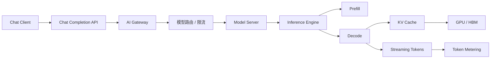
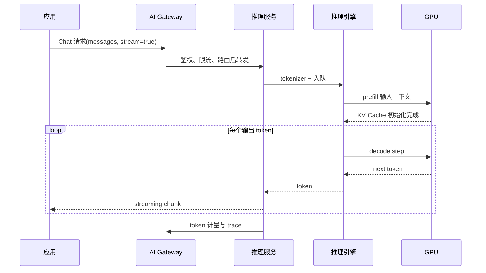
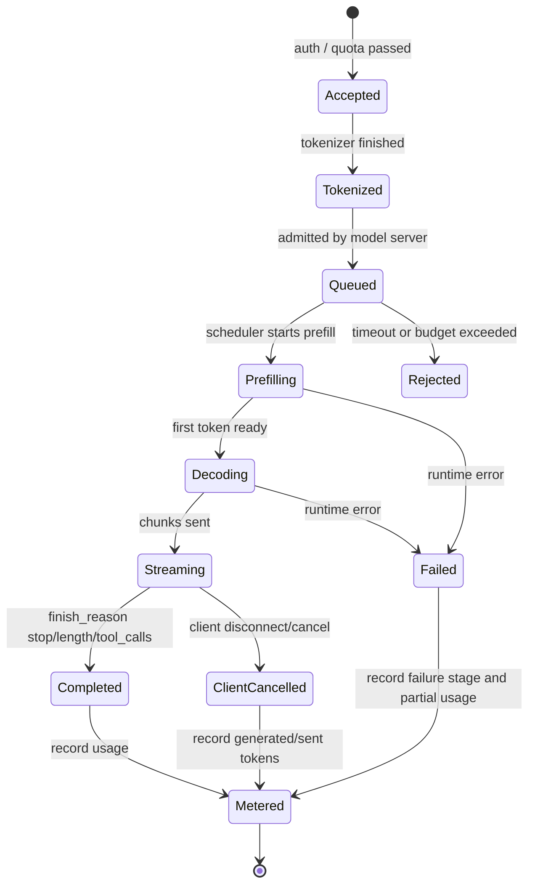
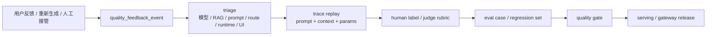
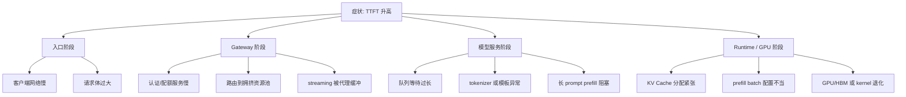

# 第 1 章：从一个 Chat 请求开始

## 1.1 导读

### 1.1.1 本章回答的问题

- 一个 Chat 请求如何从 HTTP API 变成模型内部的 token 计算？
- TTFT、TPOT、TPOP、prefill、decode 和 KV Cache 分别影响什么？
- 为什么应用体验会反向决定 GPU、推理引擎和平台设计？


### 1.1.2 本章上下文

- 层级定位：本章属于 `Application 层`，重点讨论应用如何形成 token、工具调用、RAG context 和业务 workload。
- 前置依赖：建议先理解 第 0 章：从 Data Center 到 AI Factory 中的核心对象和路径。
- 后续关联：本章内容会继续连接到 第 2 章：RAG 应用，并在系统地图、深度标准和读者测试中被交叉引用。
- 读完能力：读完本章后，读者应能把《从一个 Chat 请求开始》中的概念映射到 AI Factory 的生产路径、工程对象、观测证据和设计取舍。


### 1.1.3 读者测试

- 机制题：读者能否解释 Chat Completion API、message、prompt 与 context、input token 与 output token、streaming 的核心机制，以及它们如何共同支撑《从一个 Chat 请求开始》？
- 边界题：读者能否区分 应用层、Platform 层、Model 层和 Runtime 层 的责任边界，并说明哪些问题不能简单归因到本章组件？
- 路径题：读者能否从一次应用交互追到 prompt/context、模型调用、token 放大、质量反馈和平台治理，并指出本章对象在路径中的位置？
- 排障题：当《从一个 Chat 请求开始》相关生产症状出现时，读者能否列出第一层证据、下一跳证据、可能 owner 和止血动作？


### 1.1.4 一个真实场景

一个客服 Chatbot 上线后，用户反馈“页面一直转，第一句话出来很慢”。应用日志显示 HTTP 请求已经进入后端，网关没有明显错误，GPU dashboard 上的 compute utilization 也没有长时间打满。团队最初怀疑模型太大，于是增加副本，但问题只缓解了一小部分。继续拆解 trace 后发现，高峰期很多请求都携带长历史对话、RAG 片段和格式化指令，input token 分布出现长尾；这些长上下文请求进入同一个推理队列，占用了 prefill 计算和 KV Cache 分配，短问题也被排在后面等待。

这个场景说明 Chat 延迟不是普通 Web API 延迟。普通服务的请求通常在业务逻辑和数据库之间排查，Chat 请求还要经过 tokenizer、batching、prefill、decode、KV Cache、GPU kernel 和 streaming。QPS 不高不代表负载低，因为每个请求的 input token、output token、上下文窗口和并发序列都可能不同。两个用户都只点击了一次发送按钮，但一个请求可能只有几十个 token，另一个可能携带上万 token 的知识库片段，它们对 GPU 和 HBM 的压力完全不同。

工程上要把“用户等得久”翻译成可诊断问题：是请求没有进入模型服务，还是进入后排队；是排队等待长，还是 prefill 长；是首 token 慢，还是后续 token 慢；是某个模型实例的 KV Cache 接近上限，还是 streaming 链路被客户端或网关背压影响。没有这种拆解，团队容易用错误手段解决问题：盲目扩容、缩短超时、调大 batch，甚至更换模型。正确的入口，是从一个 Chat 请求开始，把应用字段一路追到 token 计算和资源消耗。

更进一步，排查结果往往会反过来要求应用改设计。比如客服系统如果把所有历史会话和知识库片段都塞进 prompt，基础设施再强也会被长尾拖住；如果客户端没有正确处理 streaming 取消，服务端就可能继续生成用户已经不需要的 token；如果产品不区分“立即答复”和“长报告生成”，平台就无法为两类请求设置不同队列。Chat 请求是应用和基础设施之间的共同接口，任何一侧把复杂性隐藏起来，另一侧最终都会以延迟、成本或故障的形式重新遇到它。


## 1.2 基础模型

### 1.2.1 核心概念

Chat 请求是 AI Factory 中最常见的在线推理入口，也是理解 token 生产链路的最小样本。应用侧看到的是 `messages`、`model`、`stream`、`temperature` 和工具定义；平台侧看到的是租户、配额、路由、限流、trace 和账单；模型服务看到的是 tokenizer 后的 token 序列、batch、prefill、decode、KV Cache 和结束原因；基础设施看到的是 GPU、HBM、kernel、网络连接和实例生命周期。一个字段在应用层只是参数，在底层可能变成资源约束。

本章需要区分几组容易混淆的概念。`message` 是 Chat API 的结构化输入，`prompt` 是模型实际接收的完整文本或多模态上下文，`context` 是模型当前可见的窗口。`input token` 主要影响 prefill，`output token` 主要影响 decode。`streaming` 改变用户感知和连接语义，但不会消除计算成本。`TTFT` 表示首 token 时间，`TPOT` 表示输出阶段 token 节奏，`TPOP` 的口径在团队之间可能不同，必须先定义再比较。`KV Cache` 则把历史 token 的 Key/Value 保存在显存中，使 decode 不必重复计算完整上下文。

这些概念之所以重要，是因为它们把产品体验和系统设计连接起来。产品要求“秒回”，平台就要控制队列、prefill 和首 token；产品要求“长文档问答”，系统就要承受更大的 input token 和 KV Cache；产品要求“边生成边显示”，网关和客户端就要正确处理长连接、中断和部分输出。Chat 请求不是 AI 应用的薄薄入口，而是向下牵引运行时、调度和 GPU 资源设计的契约。

还有一个容易忽视的概念是“请求生命周期”。一个 Chat 请求不是收到 HTTP 响应就结束，它还包括生成是否被取消、输出是否写入历史、token 是否完成计量、trace 是否闭合、KV Cache 是否释放、账单事件是否落库。很多线上问题发生在生命周期尾部：用户取消后继续计费、服务端错误被客户端吞掉、模型实例重启导致最后一段输出丢失、账单系统只拿到 input token 没拿到 output token。把生命周期建模清楚，才能让 Chat 成为可运营的生产对象。


### 1.2.2 系统架构

一个生产级 Chat 请求通常从客户端进入 API Gateway，再经过认证鉴权、租户限流、模型路由和内容策略，转发到模型服务。模型服务会把 `messages` 渲染成模型模板可接受的 prompt，并通过 tokenizer 转成 token ids；推理引擎根据当前队列、batch 策略和资源状态安排执行。prefill 阶段处理完整输入上下文，生成初始 KV Cache；decode 阶段逐 token 预测，把新 token 追加到缓存并通过 streaming 返回。与此同时，平台记录延迟、token 数、结束原因、错误码和账单事件。

这条链路有两个关键边界。第一个边界在 Platform 与 Model Serving 之间：Platform 负责租户治理、路由、限流、审计和计量，模型服务负责 tokenizer、队列、batching 和推理执行。两者不能互相缺位。网关不知道 input token 和输出长度，就无法做细粒度限流；模型服务不知道租户和业务优先级，就无法解释为什么某类请求应该被隔离。第二个边界在推理引擎与 GPU 之间：引擎用 continuous batching、paged attention、prefix cache 或 PD 分离等策略组织计算，GPU 只执行具体 kernel 和内存访问。

架构图中每个节点都应成为观测点，而不只是流程框。Client 到 Gateway 的耗时解释网络和客户端体感；Gateway 到 Server 的耗时解释治理和路由；Server 内部队列解释排队；Prefill、Decode 和 KV Cache 解释模型计算；GPU/HBM 解释底层资源；Metering 解释账单和成本。缺少任一节点，事故复盘都会出现断点。

部署形态可以不同，但责任链不能缺失。小规模团队可能把 Gateway、模型服务和计量放在同一个进程或同一套服务中；大规模平台会把它们拆成独立控制面和数据面。无论实现多简单，都应保留同样的逻辑阶段，否则系统扩展时会重新补课。一个常见反模式是直接把应用请求打到推理引擎暴露的 API，短期可以跑通 Demo，长期会缺少租户治理、限流、审计、账单和统一错误语义。AI Factory 需要的不是更多层，而是关键责任不能被绕过。




## 1.3 关键技术

### 1.3.1 Chat Completion API

Chat Completion API 是大模型应用最常见的接口形态。应用提交模型名、消息列表、生成参数和可选工具定义，服务端返回一段生成结果或一串 streaming chunk。OpenAI-compatible API 的价值在于降低应用迁移成本，让 MaaS、私有模型服务和开源推理平台可以用相近结构承接请求。但“接口兼容”不等于“行为完全一致”：不同平台在 tokenizer、上下文模板、工具调用格式、错误码、streaming 事件、计费字段和安全策略上可能存在差异，工程接入时必须显式验证。

从 AI Factory 的角度看，Chat API 不是普通 HTTP JSON。它携带的字段会一路影响底层资源。`model` 决定路由到哪个权重、哪个推理引擎和哪个资源池；`messages` 决定 input token 和 prefill 成本；`max_tokens` 或等价参数决定潜在 decode 长度；`stream` 决定响应路径和连接保持；`temperature`、`top_p` 等采样参数影响输出分布和缓存复用可能性；工具定义会让模型输出结构化调用而不是普通文本。平台如果只把这些字段当透传参数，就无法做准确限流、成本预测和故障定位。

生产环境接入 Chat API 时，应把请求语义标准化为内部对象。这个对象至少包含租户、项目、用户、模型、输入 token、最大输出 token、streaming 标志、工具集合、路由目标、trace id 和预算。这样做不是为了增加抽象，而是为了让 API Gateway、推理服务、计量、审计和账单使用同一套事实。没有内部对象，应用日志里只有 `messages`，账单系统只看到 token，推理服务只看到 batch，事故复盘时很难证明哪个字段导致了哪类资源消耗。

接口层还要处理兼容性边界。模型版本升级可能改变 tokenizer 或模板，导致同样的 message 产生不同 token 数；平台新增安全策略可能改变错误码和重试语义；工具调用从文本协议迁移到结构化协议后，旧客户端可能无法解析。生产 API 因此需要版本、能力发现、错误码规范和回归测试。应用只关心“能不能返回答案”是不够的，平台必须保证请求语义在升级中可解释、可回滚、可审计。


### 1.3.2 message、prompt 与 context

`message` 是 Chat API 中面向应用的结构化输入，通常由 role 和 content 组成。`prompt` 是经过模板渲染后真正送入模型的完整输入，可能包含 system 指令、用户消息、历史对话、工具结果、RAG 片段、输出格式约束和特殊控制 token。`context` 强调模型当前可见的全部上下文窗口，包括本轮输入和历史状态。三者在简单 Demo 中看起来相同，但在生产系统中差异很大：应用维护 message，模型服务生成 prompt，运行时消耗 tokenized context。

这种区分直接影响可观测性。用户说“我只问了一句话”，应用层可能确实只有一条新 message；但 prompt 中还可能包含系统模板、几十轮历史、检索片段和工具输出。若平台只记录用户新输入长度，就会低估 input token；若只记录最终 token 数，又无法判断膨胀来自历史对话、RAG、工具输出还是模板。正确做法是把上下文拆成来源维度：system、user、assistant history、retrieved chunks、tool observations 和 formatting instructions，并记录每类 token 占比。

工程上还要处理 context window 的预算。模型能接受的最大上下文不是应用可以随意填满的空间，因为长 context 会增加 prefill 时间、KV Cache 占用和排队风险。常见策略是为系统指令、当前用户问题、必要历史、检索证据和输出预算分别预留 token；当预算不足时，按策略压缩历史、减少检索片段或拒绝超长请求。好的 Chat 平台不会等 tokenizer 报错才处理超限，而是在应用层和网关层就给出可解释的上下文管理。

上下文管理还涉及事实边界。系统指令应该稳定而短，用户消息应该保持原意，历史对话应该保留与当前问题相关的状态，RAG 片段应该带来源和时间，工具输出应该被裁剪成模型需要的结构。把这些内容无差别拼接，既浪费 token，也会引入冲突证据。工程团队应把 prompt 渲染当成可测试逻辑：给定 message、历史和检索结果，应能复现最终 prompt，并能解释哪些内容被保留、压缩或丢弃。


### 1.3.3 input token 与 output token

Input token 是最终 prompt 经 tokenizer 编码后的 token 数，主要决定 prefill 阶段的计算量和初始 KV Cache 规模。Output token 是模型实际生成的 token 数，主要决定 decode 循环持续多久、连接保持多久以及后续 KV Cache 增长多少。二者都叫 token，但资源画像不同：input token 更像一次性读入和初始化，output token 更像持续占用 GPU 进行逐步生产。计费系统通常也会区分二者，因为生成 token 的边际资源和用户价值不同。

容量规划不能用 QPS 替代 token 指标。假设两个租户都是 10 QPS，一个租户每次请求 200 input token、100 output token，另一个租户每次请求 6000 input token、800 output token，它们对 prefill、decode、HBM 和队列的压力完全不同。若平台按请求数限流，长上下文租户可能压垮短请求体验；若只看 GPU 利用率，又可能忽略某个租户在消耗大量 input token 但输出很少。更稳妥的口径是同时观察 input tokens/s、output tokens/s、平均上下文、P95 上下文、平均输出长度和并发序列数。

Input/output token 还决定成本归因。RAG 会显著增加 input token，长文本生成会增加 output token，Agent 会把多轮 input 和 output 叠加成任务成本。平台应把 token 计量与模型、租户、应用、路由目标和缓存命中关联起来。否则当财务询问“为什么这个业务线成本上升”时，团队只能回答 GPU 用得多，却无法说明是上下文变长、输出变长、调用次数增加，还是模型路由到了更昂贵的资源池。

计量还要处理不完整请求。请求被限流时通常没有模型 token；请求在 prefill 后失败时可能只有 input token；streaming 中途取消时已经产生部分 output token；工具调用失败后重试可能生成多段中间 token。若平台只在成功结束时计量，就会低估成本并污染训练数据；若对失败请求一律按最大 token 估算，又会引发账单争议。生产系统应记录实际 tokenizer 结果、实际生成 token、失败阶段和取消原因，让成本与体验都能被复盘。


### 1.3.4 streaming

Streaming 是让服务端在生成过程中分块返回 token 或增量文本。它改善的是用户感知延迟：用户不必等完整回复结束才看到结果，而是在首 token 之后持续看到输出。对长回答、代码生成、文档总结和 Agent 任务汇报来说，streaming 是体验的一部分。但它并不会让模型计算更少，也不会减少 token 计量。服务端仍要执行 prefill 和 decode，仍要占用 GPU、KV Cache 和网络连接，只是把输出以更细粒度交给客户端。

Streaming 带来的工程复杂度主要在边界语义。客户端可能主动取消，浏览器可能断开，网关可能超时，模型服务可能在中途报错，用户可能只看了一半就发起新请求。平台必须定义这些情况如何计费、如何记录 finish reason、是否继续生成、如何释放 KV Cache、是否写入对话历史。若没有明确语义，账单会缺失已生成 token，trace 会看起来像成功但用户没有收到完整结果，模型服务也可能在客户端断开后继续浪费 GPU。

网关和模型服务还需要处理背压。Streaming 连接是长连接，高并发时会占用连接池、代理缓冲和服务端协程。某些客户端读取慢，会让服务端输出堆积；某些代理默认缓冲响应，会破坏“边生成边返回”的体验。生产平台应在 trace 中记录首 chunk 时间、chunk 间隔、客户端取消、服务端取消、streaming 错误和最终 token 数。这样才能判断用户看到的慢，是模型 decode 慢，还是流式传输链路慢。

Streaming 的另一个设计点是重试。普通 HTTP 请求失败后可以重试，但生成式输出重试可能产生不同文本，甚至重复执行工具调用。对于只读 Chat，可以让客户端重新发起请求，并在界面上标注重新生成；对于 Agent 或有副作用的任务，必须使用幂等 id、步骤状态和确认机制，避免重复发送邮件、重复提交工单或重复扣费。也就是说，streaming 不是一个传输选项，而是请求语义的一部分。


### 1.3.5 TTFT、TPOT、TPOP

TTFT 即 Time To First Token，表示从请求进入系统到第一个输出 token 被返回的时间。它通常包含网关处理、路由、排队、tokenizer、batch 等待、prefill 和首步 decode。TTFT 与用户“有没有响应”的感受强相关，因此在线 Chat 系统往往把它作为核心 SLO。TTFT 差并不一定说明 GPU 慢，常见原因包括长 prompt、队列拥塞、冷启动、权重加载、prefix cache 未命中、租户被限流或网关缓冲配置不当。

TPOT 即 Time Per Output Token，通常表示 decode 阶段每个输出 token 的平均耗时或输出间隔。它更能反映生成阶段节奏，受 batch 大小、模型大小、KV Cache 访问、采样策略、GPU 效率和系统负载影响。用户看到回复开始后，如果后续一个字一个字地慢慢出，往往是 TPOT 或 streaming 链路出了问题。优化 TPOT 的手段与优化 TTFT 不完全相同：前者关注 decode 吞吐、batching 和缓存，后者还要关注 prefill、队列和路由。

TPOP 在不同团队中口径不统一。有的团队用它表示 Time Per Output Prediction，有的用来表示 token 输出周期，也有团队把它作为某种聚合的 per-output 指标。因此在设计 dashboard 或对外承诺 SLA 时，必须先写清楚定义、起止时间、统计粒度和是否包含网络传输。更重要的是，不要只看一个延迟指标。完整诊断至少要同时展示 E2E latency、queue time、prefill time、decode time、TTFT、TPOT、输出 token 数和上下文长度。指标组合才能支持行动。

这些指标还应与用户场景绑定。客服场景更关心首 token 和稳定完成，代码补全更关心极短响应和取消率，长文档生成更关心总时长与单位 token 成本。若平台只定义全局 P95 TTFT，可能无法保护关键业务；若只看平均 TPOT，可能忽略少数长输出占用大量资源。实践中可以为不同 workload 设定不同 SLO，并在路由层选择合适资源池。指标不是为了排名模型，而是为了把用户体验映射到可执行的工程动作。


### 1.3.6 prefill 与 decode

Prefill 是处理输入上下文的阶段。模型把 prompt 的所有 token 一次性送入前向计算，生成每层 attention 所需的 Key/Value，并建立 KV Cache。这个阶段的计算量随 input token 增长，长文档、长历史、RAG 片段和工具输出都会显著增加 prefill 时间。Prefill 通常具有较高并行度，但会消耗大量计算和显存带宽；当长请求进入队列时，它们可能阻塞短请求的首 token，形成明显的 TTFT 长尾。

Decode 是逐 token 生成输出的阶段。每一步模型根据当前 token 和已有 KV Cache 预测下一个 token，再把新 token 的 Key/Value 追加到缓存。Decode 的特点是迭代次数等于输出 token 数，单步计算相对小，但需要频繁访问 KV Cache。并发序列越多、上下文越长，KV Cache 访问和管理越关键。现代推理引擎围绕 continuous batching、paged attention、prefix cache、speculative decoding 和 PD 分离做优化，本质都是在 prefill、decode、吞吐、延迟和显存之间寻找平衡。

理解 prefill 与 decode，有助于避免错误优化。若 TTFT 高是因为 prefill 长，盲目提高 decode batch 可能没有帮助；若 TPOT 高是因为 decode 拥塞，减少 prompt 长度也只能改善首 token，不能解决后续输出慢；若 KV Cache 紧张，扩更多副本可能缓解并发，但也可能被同样的长上下文快速填满。平台应在请求 trace 中分离 queue、prefill 和 decode，并按 input/output token 分桶分析。

Prefill 和 decode 还会影响资源池设计。长上下文问答、短对话、代码补全和批量生成可以使用不同队列，避免在同一 batch 中互相拖累。部分系统会探索 PD 分离，即把 prefill 和 decode 放到不同资源或实例上，以提高调度灵活性；这种方案能改善某些长上下文场景，但也引入 KV 传输、路由复杂度和故障面。是否采用这类设计，要基于真实负载分布，而不是因为架构听起来先进。




### 1.3.7 KV Cache

KV Cache 保存历史 token 在每层 attention 中对应的 Key 和 Value 张量，使 decode 阶段不必每次重新计算完整上下文。没有 KV Cache，生成第 N 个 token 时需要反复处理前面所有 token，推理成本会不可接受。使用 KV Cache 后，模型每步只需要处理新 token，并读取已有缓存完成 attention。它是 LLM 在线推理能够持续生成的关键机制，也是显存容量规划中最容易被低估的部分之一。

KV Cache 的规模与模型层数、隐藏维度、并发序列、上下文长度、数据类型和输出长度相关。应用层看起来只是“允许更长上下文”或“提高并发”，底层可能意味着 HBM 中缓存占用快速增长。一个服务实例 compute utilization 不高，却可能因为 KV Cache 没有足够空间而无法接收更多请求；一个长上下文请求即使输出很短，也会在 prefill 后占用较大缓存；一个长输出请求则会在 decode 中持续增长缓存。普通微服务很少有这种“请求历史状态占用加速器显存”的问题。

推理引擎通常会用 block 或 page 管理 KV Cache，以减少碎片并提高复用。Prefix cache 则利用相同前缀复用已有 KV，例如系统 prompt、固定模板或相同文档片段。工程上要同时关注 KV Cache 使用率、分配失败、碎片、每请求 cache 占用、prefix 命中率和回收时延。若只看 GPU 利用率，团队可能误判为算力不足；若只看显存总量，又可能看不到 cache 管理导致的尾延迟。KV Cache 是连接应用上下文、推理引擎和 HBM 的核心对象。

KV Cache 还决定了多租户隔离的细节。不同租户共享同一模型实例时，缓存空间实际上也是共享资源；某个租户的大量长上下文请求可能挤压其他租户，即使请求数不高。平台可以通过最大上下文、最大并发序列、租户级 token 预算、资源池隔离或调度权重来控制这种影响。对高安全要求场景，还要确认缓存生命周期和实例复用策略不会造成数据残留风险。KV Cache 不是用户可见对象，但必须被平台当成一等资源治理。

在工程记录上，KV Cache 不应只是一条 `kv_cache_usage` 曲线。更可复盘的做法是维护请求级 `kv_block_ledger`，记录一次请求在 prefill、decode、取消和结束阶段占用了多少 KV block、是否命中 prefix cache、是否按时释放，以及这些 block 归属哪个租户和 endpoint。这样当用户取消 streaming 后 GPU 仍然繁忙，或者某个租户把其它请求挤出缓存时，平台能找到事实，而不是只看到 HBM 高水位。

```yaml
kv_block_ledger:
  request_id: req-20260620-001
  tenant: enterprise-a
  endpoint: af-chat-large-prod
  engine_profile: vllm-prod-h100-v7
  context:
    input_tokens: 8192
    max_output_tokens: 1024
    context_bucket: long_context
  allocation:
    prefill_blocks_reserved: measured
    decode_blocks_growth: measured
    peak_blocks: measured
    prefix_cache_blocks_reused: measured
  lifecycle:
    allocated_at: prefill_start
    released_at: request_closed_or_cancelled
    close_reason: client_cancelled
    release_latency_ms: measured
  governance:
    tenant_kv_quota_hit: false
    cache_isolation_domain: tenant_or_endpoint
```

这个 ledger 对应用也有反馈价值。若一个应用的 prompt 模板经常造成高 `prefill_blocks_reserved`，说明上下文预算需要重做；若 prefix cache 命中很低，说明系统提示、工具 schema 或 RAG 模板中有过多动态字段；若取消后释放延迟高，说明 streaming 生命周期没有打通。KV Cache 的治理不是只靠底层引擎，应用的上下文结构同样决定缓存效率。

对 Chat 请求来说，最危险的 KV 问题不是“显存使用率高”，而是请求生命周期已经结束，KV block 仍然被 allocator、prefix cache、decode worker 或异常恢复路径持有。用户取消 streaming、网关超时、客户端断网、engine worker 重启、PD transfer 失败，都可能让业务侧认为请求结束，而 runtime 侧仍保留状态。生产系统应把这类问题沉淀为 `kv_block_leak_forensic_record`，而不是等到整池 HBM 压力升高后才从聚合指标倒推。

```yaml
kv_block_leak_forensic_record:
  forensic_id: kv-leak-20260620-001
  request_id: req-20260620-001
  tenant: enterprise-a
  endpoint: af-chat-large-prod
  engine_profile: vllm-prod-h100-v7
  close_event:
    close_reason: client_cancelled
    close_seen_by_gateway: true
    close_seen_by_model_server: true
    close_seen_by_engine: true_or_false
  allocation_snapshot:
    blocks_at_prefill_end: measured
    peak_blocks: measured
    blocks_expected_after_close: 0
    blocks_observed_after_close: measured
    release_latency_ms: measured
  suspected_owner:
    allocator_state: active_or_orphaned
    decode_worker: worker_id_if_known
    prefix_cache_ref: cache_key_if_retained
    pd_transfer_session: transfer_id_if_enabled
  impact:
    leaked_block_seconds: calculated
    affected_admission_decisions: [endpoint_admission_decision_ids]
    tenant_quota_impact: calculated
  remediation:
    action: force_release_or_restart_or_disable_cache_path
    regression_test: cancel_timeout_disconnect_restart_cases
```

这份记录把“取消后 GPU 还忙”拆成可验证事实。首先看 close event 是否在 Gateway、model server 和 engine 三处闭合；其次看 allocator 是否仍有 orphaned block；再看 prefix cache 或 PD transfer 是否持有引用；最后把泄漏 block 秒折算到 admission 失败和成本。没有这份记录，团队很容易把泄漏误判为流量增长、长上下文变多或 GPU 不够，结果用扩容掩盖 lifecycle bug。


### 1.3.8 应用体验如何反向决定基础设施设计

应用体验目标会一路向下传导。产品要求首 token 很快出现，平台就要减少网关排队、控制长 prompt、优化 prefill 调度，必要时把长上下文请求和短对话请求拆到不同资源池。产品要求低成本生成长报告，推理服务就要更重视吞吐、batching、异步任务和取消策略。产品要求稳定的工具调用和引用，平台就要记录每次模型调用、检索、工具结果和 token 成本。用户界面的一项体验要求，最终会变成运行时和基础设施的设计约束。

这种传导在 RAG 和 Agent 中更加明显。RAG 把检索片段放进 context，提升事实性但增加 input token 和 prefill；Agent 把一个用户目标拆成多轮模型调用和工具调用，放大 token、trace、权限和计费复杂度；代码补全要求极低延迟，因此可能需要小模型、专用资源池和更 aggressive 的缓存；客服场景要求稳定和审计，因此宁愿牺牲一部分开放性，也要强化知识引用、人工接管和输出策略。不同应用不能简单共享同一套“平均最优”的推理配置。

因此 AI Factory 的设计应从 workload profile 开始，而不是从 GPU 型号开始。每个应用接入前都应说明交互模式、上下文分布、输出长度、SLO、并发、数据敏感度、工具副作用和成本预算。平台据此决定模型、路由、资源池、限流、观测和计费。如果没有这一步，基础设施团队只能对平均负载做优化，结果往往是短请求被长请求拖慢，高价值租户和低价值流量混在一起，成本上升却没有清晰归因。

这种方法还能改善组织协作。应用团队不再只说“需要更快”，而是说明目标 TTFT、输出长度和峰值流量；平台团队不再只说“GPU 不够”，而是说明哪类 token、哪类队列和哪类缓存成为瓶颈；财务团队不再只看 GPU 小时，而是看到每个应用的 cost per token 和成功请求成本。Chat 请求虽然小，却是训练工程判断的入口：从一个请求出发，团队可以学习如何描述负载、如何设置指标、如何做取舍。


## 1.4 工程落地

### 1.4.1 工程实现

工程落地的第一步，是为每个 Chat 请求建立统一观测记录。记录不能只停留在 HTTP 状态码和总耗时，而要覆盖租户、模型、路由、上下文、token、队列、prefill、decode、streaming 和结束原因。字段应尽量由平台统一采集，避免每个应用自行拼日志。统一字段让容量规划、故障诊断和账单使用同一套事实，也让模型服务升级、推理引擎切换和资源池迁移之后仍能比较前后效果。

一个可执行的实现流程是：Gateway 生成 request id 和 trace id，完成鉴权、限流和路由后把租户与模型信息传给模型服务；模型服务在 tokenizer 后记录 input token 和上下文来源；推理引擎记录 queue、prefill、decode、KV Cache 和 batch 信息；streaming 层记录首 chunk、最后 chunk、取消和错误；计量系统最终写入 input/output token、finish reason、模型版本和费用。所有事件都应带同一 trace id，并能按时间线重建。

更严格的做法，是在 Platform 与 Model Serving 之间定义内部 `InferenceRequest` 契约。外部 Chat API 可以保持 OpenAI-compatible，但进入平台后不能继续只传一段 JSON。内部契约应把“应用语义”和“资源语义”拆开：应用语义包括 messages、tools、response format 和采样参数；资源语义包括 tenant、project、service tier、token budget、deadline、routing intent、idempotency key 和 trace context。这样 Gateway、模型服务、推理引擎、计量和账单才不会各自解释同一个请求。

```yaml
inference_request:
  identity:
    tenant: enterprise-a
    project: support-copilot
    api_key_id: key_123
    user_subject: user_456
  model:
    requested: af-chat-large
    capabilities_required: [chat, streaming, tool_calling]
    routing_intent: low_ttft
  budget:
    max_input_tokens: 12000
    max_output_tokens: 1024
    max_total_cost: optional
    deadline_ms: 30000
  payload:
    messages_ref: object_or_inline
    tools_ref: object_or_inline
    response_format: json_or_text
  control:
    stream: true
    idempotency_key: req-business-001
    trace_id: trace-abc
```

这个契约的工程价值在边界场景中最明显。请求进入 Gateway 时，可能还不知道精确 input token，但可以先用字符数、历史轮数和 RAG 片段数做粗估；模型服务完成 tokenizer 后，再写入准确 token 并回传给计量。若准确 token 超过预算，服务端应在 prefill 前拒绝，而不是消耗 GPU 后失败。若客户端取消，streaming 层应把 cancel event 写回同一 trace，并通知引擎释放 KV Cache。若 Gateway fallback，新的 served model 必须写入同一请求上下文，避免账单只知道 requested model。

上线前可以用三类请求验证实现是否完整：短 prompt 短输出，用来验证基础延迟和 streaming；长 prompt 短输出，用来验证 prefill、context 预算和 KV 分配；短 prompt 长输出，用来验证 decode、取消和计量。每类请求都应能在日志和 trace 中看到相同 request id，并能解释 token 数与延迟。若某类请求无法闭环，就不要急着扩大流量，因为后续故障会缺少证据。

实际团队还应把这些字段纳入发布门禁。模型服务升级、prompt 模板变更、tokenizer 变更、网关路由变更和推理引擎参数调整，都可能改变 token 数、延迟分布或错误语义。变更前后应对固定样本集跑回归：确认 token 计数没有异常漂移，streaming 事件顺序稳定，取消请求能释放资源，失败请求能写入完整错误阶段。这样做可以把很多线上事故提前暴露在灰度阶段。

下面的 YAML 只是字段示例，不代表某个产品规范。实际实现可以写入日志、metrics、trace span 或账单事件，但字段语义应稳定。

```yaml
chat_request_observation:
  request_id: req-20260618-001
  tenant: team-a
  model: example-llm
  route: inference-pool-a
  stream: true
  input_tokens: 2048
  output_tokens: 512
  context_breakdown:
    system: 180
    history: 640
    rag: 960
    user: 268
  latency:
    queue_ms: measured
    prefill_ms: measured
    ttft_ms: measured
    tpot_ms: measured
    e2e_ms: measured
  cache:
    kv_blocks: measured
    prefix_cache_hit: false
  finish_reason: stop
```

对 streaming 请求，还应维护一个明确状态机。没有状态机，取消、超时和部分输出会在应用、网关、模型服务和计量系统之间产生歧义。



状态机还要区分 generated tokens 和 delivered tokens。Generated token 是模型已经算出的 token，delivered token 是客户端实际收到的 token；网络中断、代理缓冲和客户端取消会让二者不同。账单是否按 generated、delivered 或 successful delivered token 计算，是产品和合同问题，但系统必须能记录事实。若事实字段不存在，后续只能靠争论决定。

Chat 质量闭环的入口是 `quality_feedback_event`。用户点踩、重新生成、人工接管、投诉、客服转单、开发者标记“格式错误”、安全系统标记“疑似越权”，都不应只停留在前端埋点或客服系统里。它们应被归一成质量事实事件，并与 `trace_id`、`request_id`、模型版本、prompt 模板版本、路由策略、token 计量和用户可见 outcome 绑定。否则一次真实差评无法回放，也无法进入第 13 章的评测集和第 40 章的质量事故流程。

`quality_feedback_event` 不等于把原始 prompt 和 response 全量复制到质量库。生产系统应先保存可回放引用和结构化摘要：请求属于哪个租户、哪个应用、哪个任务类型，用户看到的结果是什么，反馈类型是什么，严重程度如何，是否涉及安全或隐私，是否已有人类标注，是否允许作为评测样本。原文内容可以留在受权限控制的对象存储或 trace 系统中，用 `prompt_ref`、`response_ref`、`context_snapshot_ref` 引用，并按数据分级决定保留周期和可见范围。

```yaml
quality_feedback_event:
  event_id: qfe-20260619-0001
  trace_id: trace-abc
  request_id: req-123
  source: user_thumb_down
  subject:
    tenant_id: enterprise-a
    application: support-chat
    user_segment: premium_customer
  served_artifacts:
    model_version: af-chat-large-202606
    prompt_template_version: support-v18
    gateway_policy_version: gw-20260619.4
    route_pool: inference-premium-a
  outcome:
    finish_reason: stop
    input_tokens: measured
    output_tokens: measured
    delivered_tokens: measured
    user_visible_status: completed
  feedback:
    category: incorrect_answer
    severity: high
    user_comment_ref: object://redacted-comment
    requires_human_review: true
  replay:
    prompt_ref: object://redacted-prompt
    response_ref: object://redacted-response
    context_snapshot_ref: object://redacted-context
    privacy_classification: internal_sensitive
```

一次差评进入闭环后，通常要经历 triage、replay、label、regression 四步。Triage 判断它是模型质量、RAG 证据、prompt 模板、路由、runtime、客户端展示还是用户误用；replay 使用当时的模型版本、模板、sampling 参数和上下文快照复现；label 由人工或校准后的 judge 标注期望行为；regression 把稳定样本沉淀到评测集，并在后续模型、prompt、网关或 runtime 变更中作为门禁。这样，Chat 体验问题才会从“用户说不好”变成“系统可复现、可修复、可防回归”的工程对象。



还需要 `prompt_context_snapshot`。它是质量回放的最小上下文证据，记录最终 prompt 的结构化来源，而不是只保存一段大文本。对于 Chat，快照应包含 system 指令版本、历史裁剪策略、RAG 片段 id、工具 observation id、采样参数、tokenizer 版本和 context 截断结果。没有这个快照，团队可能复现不出当时错误，只能用当前模板和当前索引猜测过去发生了什么。质量闭环的难点不在收集差评，而在用同样条件复现差评。

```yaml
prompt_context_snapshot:
  snapshot_id: pcs-20260619-0001
  request_id: req-123
  tokenizer_version: tokenizer-202606
  chat_template_version: support-v18
  sampling:
    temperature: recorded
    top_p: recorded
  context_parts:
    - type: system
      version: sys-support-202606
      token_count: measured
    - type: history_summary
      strategy: last_n_plus_summary
      token_count: measured
    - type: retrieved_evidence
      refs: [chunk-123-05, chunk-456-02]
      token_count: measured
    - type: user_message
      token_count: measured
  truncation:
    applied: true
    dropped_parts: [old_history]
    reason: max_context_budget
```


### 1.4.2 常见故障

第一类故障是只看 QPS，不看 token。平台看到请求数平稳，却没有发现 input token P95 翻倍，导致 prefill 队列变长、TTFT 变差。解决方法不是简单扩容，而是按 token 分桶观察请求，并对长上下文、短对话、Agent 中间调用和批量任务做不同路由。第二类故障是把长请求和短请求放在同一队列。长 prompt 的 prefill 会阻塞短请求首 token，用户体感非常差，尤其在客服、代码补全和交互式 Chat 中明显。

第三类故障是 streaming 语义不完整。客户端断开后，服务端继续 decode，GPU 被无效占用；或者服务端取消了生成，却没有记录已生成 token，导致计费、审计和用户历史不一致。第四类故障是 KV Cache 接近上限但 dashboard 没有展示。团队看到 GPU compute utilization 不高，以为还有容量，实际上请求被 cache 分配失败或频繁回收拖慢。第五类故障是指标口径不统一：应用说 TTFT，网关看上游响应时间，模型服务看 decode 首步，三者起止点不同，结论自然冲突。

还有一类故障来自 prompt 构造。RAG 片段重复、历史对话没有裁剪、工具输出原样塞回上下文，都会让 input token 悄悄膨胀。模型质量看起来下降，根因可能不是模型变差，而是上下文噪声增加或关键证据被截断。排查这类问题时，应把最终 prompt 的结构化摘要纳入 trace：每类内容多少 token、哪些片段进入、哪些被截断、是否命中缓存。没有 prompt 证据，很多 Chat 故障只能停留在猜测。

故障复盘时要特别警惕“单指标解释”。看到 TTFT 高就说模型慢，看到 GPU 利用率低就说资源空闲，看到错误率低就说系统健康，都是不完整判断。Chat 故障通常需要把用户反馈、网关日志、模型服务队列、token 分布、推理引擎指标和 GPU 状态放到同一时间线。复盘的产出也不应只是“增加副本”，而应包括上下文限制、路由规则、指标补点、客户端取消语义和容量预算的调整。

第五类故障是反馈与请求脱钩。用户在前端点踩，客服系统记录了一条投诉，但质量平台找不到对应 trace；开发者发现 JSON 格式错误，只在工单里贴了一段输出；SRE 回滚了模型版本，却没有把失败样本加入回归集。这会导致同类问题反复出现。解决方法是把 `quality_feedback_event` 作为应用埋点、客服工单、人工质检和模型评测之间的统一入口，并强制要求反馈事件带可追溯的 request 或 run 标识。

第六类故障是回放条件漂移。团队尝试复现线上差评时，当前 prompt 模板、RAG 索引、模型权重、网关路由和采样参数都已经变了，于是复现结果正常，问题被误判为偶发。Chat 质量问题必须保留 `prompt_context_snapshot` 和 served artifact 版本。对于无法保存原文的敏感场景，也至少要保存受控引用、哈希、token 结构和版本信息，保证授权人员能在合规边界内回放。

下面的故障树可以作为 TTFT 升高时的第一张排查图。它不是替代专家判断，而是让团队先按阶段排除，避免直接跳到“加 GPU”。




### 1.4.3 性能指标

Chat 请求的指标应分成体验、负载、运行时和可靠性四组。体验指标包括 TTFT、TPOT、E2E latency、streaming chunk 间隔、取消率和用户侧超时率。负载指标包括 request/s、input tokens/s、output tokens/s、平均与 P95 context length、平均输出长度、并发序列数和每租户 token 消耗。运行时指标包括 queue time、prefill time、decode time、batch size、KV Cache 使用率、prefix cache 命中率、GPU utilization、HBM 使用和显存分配失败。可靠性指标包括错误率、限流率、fallback 率、模型实例重启和 finish reason 分布。

这些指标必须按维度切开才有价值。按模型切分可以发现某个模型配置不合理；按租户切分可以发现成本和流量长尾；按上下文长度切分可以发现长 prompt 对 TTFT 的影响；按输出长度切分可以解释 TPOT 和连接保持；按路由池切分可以判断资源隔离是否有效。单一全局平均值容易掩盖问题：平均 TTFT 正常时，长上下文请求可能已经不可用；平均 GPU 利用率正常时，某个实例可能被 KV Cache 挤满；平均错误率低时，某个租户可能持续被限流。

指标还应服务于决策。若 TTFT 高但 prefill 正常，重点看队列、路由和冷启动；若 prefill 高，重点看 input token、prompt 模板和 prefix cache；若 TPOT 高，重点看 decode batch、KV Cache 和 GPU 状态；若 cost per token 高，重点看 batch、实例利用率、模型选择和失败重试。好的指标体系不是把所有数据堆在 dashboard 上，而是让每个常见问题都有明确的下一步排查路径。

验收指标应与指标体系一致。一个模型服务上线，不应只验证“能回答”，还应验证固定输入下的 token 计数、首 token 时间、输出速率、streaming 取消、长上下文拒绝或降级、账单落库和 trace 完整性。容量压测也应使用 token 分布，而不是只发相同短 prompt。只有验收样本接近真实 workload，平台才不会在生产流量到来时突然发现 prefill、KV Cache 或连接数成为瓶颈。

质量闭环指标需要单独成组。建议至少记录 `quality_feedback_event` 数量、每千请求反馈率、人工接管率、重新生成率、低分反馈复现率、反馈到标注的时间、标注到回归集的转化率、回归样本再次失败率和质量门禁阻断次数。它们回答的是“系统能否从真实用户问题中学习”，而不是模型一次性表现如何。若反馈很多但进入回归集很少，平台只是收集抱怨；若回归集很多但门禁不使用，质量闭环仍然断裂。

还要区分质量失败的成本口径。一个低质量回答可能没有 5xx，却会引发用户追问、重新生成、人工转接或退款；这些都会增加 token 和人力成本。Chat 指标应把 `quality_feedback_event` 与第 41 章的 `quality_cost_ledger` 连接起来，统计低质量 token、无效重试 token 和人工接管成本。这样平台在优化 cost per token 时，才不会把便宜但错误的回答误判为经济性提升。

可执行的指标表应同时写出口径、标签和用途：

| 指标 | 口径 | 关键标签 | 主要用途 |
| --- | --- | --- | --- |
| `chat.ttft_ms` | Gateway 接收请求到首个 chunk 写出 | tenant、model、endpoint、route_policy | 交互体验 SLO、长尾排查 |
| `chat.queue_ms` | 模型服务 admission 到进入 prefill | endpoint、replica、priority、service_tier | 判断是否需要隔离队列或扩容 |
| `chat.prefill_ms` | 输入 token 前向计算和 KV 初始化 | input_bucket、model_version、engine_version | 定位长上下文和 prefix cache 问题 |
| `chat.tpot_ms` | decode 阶段每输出 token 平均耗时 | output_bucket、batch_size、kv_cache_state | 判断 decode、KV 和 GPU 瓶颈 |
| `chat.generated_tokens` | 模型实际生成 token | finish_reason、cancel_state、served_model | 计量、成本和失败浪费 |
| `chat.delivered_tokens` | 已写给客户端的 token | stream_state、client_type | 账单争议和客户端体验 |
| `chat.kv_cache_bytes` | 请求占用或实例总 KV Cache | replica、tenant、context_bucket | HBM 容量和隔离治理 |


### 1.4.4 设计取舍

Chat 系统的核心取舍之一是延迟与吞吐。更大的 batch 往往能提高 GPU 利用率、降低 cost per token，但会增加单个请求等待，尤其影响 TTFT。更小的 batch 能改善交互体验，却可能让 GPU 利用率下降。不同应用的最优点不同：代码补全和客服更偏低延迟，批量摘要和离线生成更偏吞吐。平台应支持按 workload 配置队列和资源池，而不是用同一参数服务所有请求。

第二个取舍是上下文能力与成本。长 context 可以支持长文档、复杂历史和更强 RAG，但它会增加 prefill、KV Cache 和尾延迟。缩短 context 能降低成本，却可能损失质量和连续性。成熟做法不是一刀切限制长度，而是使用 context budget、历史压缩、检索去重、prefix cache 和分级模型，把 token 用在最有证据价值的位置。应用团队也要承担责任，不能把所有上下文都交给基础设施兜底。

第三个取舍是平台通用性与场景隔离。统一 Chat API 降低接入成本，但不同场景的 SLO、风险和成本差异很大。强隔离可以保证高价值场景体验，却会降低资源利用率；完全共享可以提高利用率，却容易互相干扰。AI Factory 的实践通常是从统一入口开始，在路由、队列、模型、缓存和资源池层面逐步分化。设计目标不是追求某个单点最优，而是在体验、成本、可靠性和可运营性之间建立可解释的平衡。

取舍还包括开放能力与安全边界。允许应用自定义系统 prompt、长上下文和工具调用，可以提升灵活性，但也会增加越权、提示注入、成本失控和不稳定输出。平台可以通过模板审核、上下文预算、工具权限、模型路由白名单和计费预估来降低风险。好的设计不是把能力全部关闭，而是让每项能力都有边界、有指标、有失败处理。这样 Chat 平台才能同时服务探索性应用和生产级业务。

第四个取舍是反馈采集深度与隐私边界。保存完整 prompt 和 response 最利于回放，但可能包含个人信息、商业机密或客户数据；只保存计数指标最安全，却无法诊断质量问题。实践中应按数据分级保存：默认保存结构化摘要、版本、token 分布和对象引用；对高权限质量团队开放受控回放；对外部评测和长期回归集使用脱敏、裁剪和重新标注后的样本。质量闭环不能以牺牲数据边界为代价。


## 1.5 小结与延伸阅读

### 1.5.1 小结

- Chat API 的 `messages` 最终会变成 tokenizer、prefill、decode 和 KV Cache 的资源消耗。
- input token 和 output token 对应不同计算阶段，不能只用 QPS 做容量规划。
- TTFT、TPOT、TPOP 需要明确口径，并分别定位不同瓶颈。
- Streaming 改善感知体验，但增加连接、取消、计量和 trace 复杂度。
- 应用的上下文、输出长度和交互模式会反向决定推理基础设施设计。
- `quality_feedback_event` 和 `prompt_context_snapshot` 把用户差评、人工接管和线上质量问题转成可回放、可标注、可进入门禁的工程事实。


### 1.5.2 延伸阅读

- [OpenAI API Reference: Chat](https://platform.openai.com/docs/api-reference/chat)
- [Attention Is All You Need](https://arxiv.org/abs/1706.03762)
- [vLLM Documentation](https://docs.vllm.ai/)
