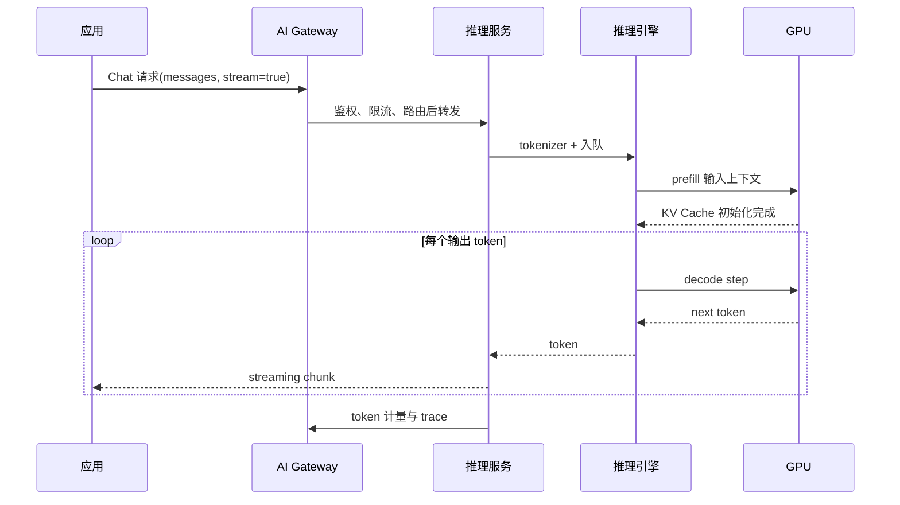

# 第 1 章：从一个 Chat 请求开始

## 本章回答的问题

- 一个 Chat 请求如何从 HTTP API 变成模型内部的 token 计算？
- TTFT、TPOT、TPOP、prefill、decode 和 KV Cache 分别影响什么？
- 为什么应用体验会反向决定 GPU、推理引擎和平台设计？

## 1.1 Chat Completion API

Chat Completion API 是大模型应用最常见的入口。应用把用户消息、系统指令、历史上下文和生成参数提交给模型服务，模型服务返回一个或多个候选回复。OpenAI-compatible API 让不同 MaaS 平台和模型服务可以使用相似的请求结构，但兼容接口并不意味着后端能力完全相同。

从 AI Factory 视角看，API 请求不是普通 HTTP 调用。它携带了模型名、租户、项目、上下文长度、生成长度、temperature、streaming、工具调用等信息。这些字段会影响路由、限流、batching、GPU 显存、计费和可观测性。一个看似简单的 `messages` 数组，最终会变成 tokenizer 输入、prefill 计算、KV Cache 分配和 decode 循环。

## 1.2 message、prompt 与 context

`message` 是 Chat API 的结构化输入，通常包含 role 和 content。`prompt` 是最终喂给模型的完整输入，可以由系统指令、用户消息、历史对话、工具结果、RAG 片段和格式约束拼接而成。`context` 则强调模型当前可见的全部上下文窗口。

工程上需要区分这三个概念。应用看到的是 message，模型服务处理的是 prompt，运行时消耗的是 tokenized context。上下文越长，prefill 计算越重，KV Cache 初始分配越大，TTFT 越容易变差。RAG 和 Agent 让 prompt 变得动态，平台必须记录最终上下文长度，否则很难解释延迟和成本波动。

## 1.3 input token 与 output token

Input token 是输入上下文经过 tokenizer 后得到的 token 数。Output token 是模型生成的 token 数。二者的资源特征不同：input token 主要影响 prefill 阶段，output token 主要影响 decode 阶段。计费模型也常把 input token 和 output token 分开，因为生成 token 通常需要持续占用推理资源。

容量规划不能只看请求数 QPS。两个请求的 QPS 相同，但一个是短 prompt、短回复，另一个是长 RAG context、长输出，它们对 GPU 的压力可能完全不同。AI Factory 更应该用 token 维度描述负载，例如 input tokens/s、output tokens/s、平均上下文长度、P95 输出长度和并发序列数。

## 1.4 streaming

Streaming 让模型边生成边返回 token。对用户来说，它降低了感知等待时间；对平台来说，它增加了连接保持、背压、计量和 trace 的复杂度。网关、模型服务和客户端都要正确处理中断、超时、取消、重试和部分输出。

Streaming 不会消除计算成本。它只是让输出以更细粒度返回。平台仍然需要记录完整 token 数、结束原因、错误码、请求耗时、首 token 时间和每 token 输出节奏。如果客户端断开连接，服务端还需要决定是否取消生成，以及如何计费和记录已生成 token。

## 1.5 TTFT、TPOT、TPOP

TTFT 即 Time To First Token，表示从请求进入系统到第一个 token 返回的时间。它主要受网关排队、路由、推理服务队列、prefill 和首步 decode 影响。TPOT 即 Time Per Output Token，表示生成阶段每个输出 token 的平均耗时，更能反映 decode 阶段的节奏。TPOP 的口径在不同团队中可能不同，使用前必须明确它表示单 token 输出预测时间、输出间隔，还是某种聚合指标。

这三个指标不能混在一起看。TTFT 差可能是长 prompt 或队列问题，TPOT 差可能是 batch 过大、KV Cache 访问慢或 GPU 利用不均。端到端延迟则还包含网络传输、客户端渲染和工具调用时间。好的 dashboard 应该同时展示请求级、token 级和模型实例级指标。

## 1.6 prefill 与 decode

Prefill 阶段处理完整输入上下文，计算 attention 并建立 KV Cache。这个阶段通常是并行度较高的大块计算，长上下文会显著增加计算量。Decode 阶段逐 token 生成输出，每一步都要读取已有 KV Cache，并把新 token 的 KV 写入缓存。

Prefill 和 decode 的资源画像不同，因此现代推理系统会围绕 continuous batching、paged attention、prefix cache、speculative decoding 或 PD 分离做优化。应用团队不需要掌握每个 kernel 细节，但必须知道上下文长度和输出长度会落到这两个阶段。

## 1.7 KV Cache

KV Cache 保存历史 token 的 Key 和 Value 张量，避免 decode 时重复计算完整上下文。它是 LLM 推理能够高效生成的关键机制，也是显存压力的主要来源之一。上下文越长、并发序列越多、模型层数越深，KV Cache 越大。

KV Cache 让推理服务的容量问题不同于普通微服务。普通 HTTP 服务通常关注 CPU、内存和连接数；LLM 服务必须关注 HBM、KV block 分配、碎片、并发序列、最大上下文和输出长度。一个服务实例看起来 GPU compute 利用率不高，却可能因为 KV Cache 占满而无法接收更多请求。

## 1.8 应用体验如何反向决定基础设施设计

应用体验目标会一路向下传导。如果产品要求第一个 token 很快出现，平台就要控制队列等待、限制极长 prompt、优化 prefill 调度，甚至把长上下文请求路由到独立资源池。如果产品要求低成本长文本生成，推理引擎需要更高吞吐，网关要支持批量和异步模式，计费要准确区分 input 和 output token。

Agent 和 RAG 进一步放大这种传导。Agent 会产生多轮模型调用和工具调用，RAG 会引入 embedding、检索、rerank 和 context 拼接。最终表现为 token 数、请求链路、错误模式和可观测性维度的变化。AI Factory 设计必须从应用模式开始，而不是从 GPU 型号开始。

## 小结

- Chat API 的 `messages` 最终会变成 tokenizer、prefill、decode 和 KV Cache 的资源消耗。
- input token 和 output token 对应不同计算阶段，不能只用 QPS 做容量规划。
- TTFT、TPOT、TPOP 需要明确口径，并分别定位不同瓶颈。
- Streaming 改善感知体验，但增加连接、取消、计量和 trace 复杂度。
- 应用的上下文、输出长度和交互模式会反向决定推理基础设施设计。

## 延伸阅读

- TODO: 官方文档
- TODO: 经典论文
- TODO: 工程案例
