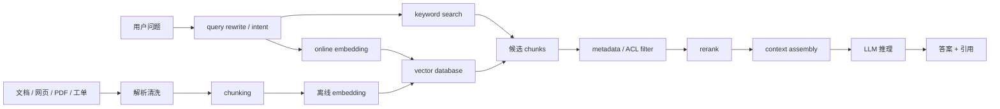
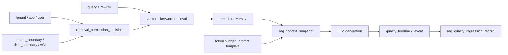
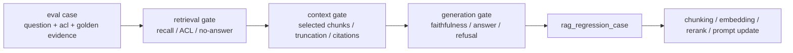
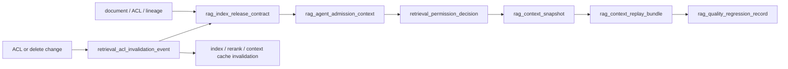

# 第 2 章：RAG 应用

## 2.1 导读

### 2.1.1 本章回答的问题

- RAG 为什么不是“把向量数据库接到模型前面”这么简单？
- embedding、chunking、向量检索、rerank 和 context 拼接如何共同影响质量、延迟和成本？
- RAG 应用会怎样改变 AI Gateway、模型服务、存储和可观测性的设计？


### 2.1.2 本章上下文

- 层级定位：本章属于 `Application 层`，重点讨论应用如何形成 token、工具调用、RAG context 和业务 workload。
- 前置依赖：建议先理解 第 1 章：从一个 Chat 请求开始 中的核心对象和路径。
- 后续关联：本章内容会继续连接到 第 3 章：Agent 应用，并在系统地图、深度标准和读者测试中被交叉引用。
- 读完能力：读完本章后，读者应能把《RAG 应用》中的概念映射到 AI Factory 的生产路径、工程对象、观测证据和设计取舍。


### 2.1.3 读者测试

- 机制题：读者能否解释 RAG 的基本流程、embedding、chunking、向量数据库 的核心机制，以及它们如何共同支撑《RAG 应用》？
- 边界题：读者能否区分 应用层、Platform 层、Model 层和 Runtime 层 的责任边界，并说明哪些问题不能简单归因到本章组件？
- 路径题：读者能否从一次应用交互追到 prompt/context、模型调用、token 放大、质量反馈和平台治理，并指出本章对象在路径中的位置？
- 排障题：当《RAG 应用》相关生产症状出现时，读者能否列出第一层证据、下一跳证据、可能 owner 和止血动作？


### 2.1.4 一个真实场景

一个企业知识库问答系统上线后，用户反馈“有时回答很慢，有时答非所问”。应用团队先怀疑模型能力不足，尝试把问答模型换成更大的版本，但效果并不稳定；平台团队看到推理服务 GPU utilization 不高，认为瓶颈不在模型；存储团队发现向量库和对象存储在高峰期有尾延迟；安全团队又指出部分文档权限没有被完整带入检索过滤。最后把 trace 拉通后才发现，问题不是单点：文档解析丢失标题层级，chunk 切得过大且重复，向量召回返回大量相似但无关片段，rerank 服务排队，context 拼接没有 token 预算，最终进入 LLM 的 prompt 既长又嘈杂。

这个场景揭示了 RAG 的真实复杂度。RAG 不是在模型前面加一个向量数据库，而是把数据治理、索引构建、在线检索、重排序、prompt 组装、权限控制、引用追踪和 LLM 推理串成一条生产链路。任一环节都可能影响答案质量、TTFT、input token、存储成本和审计能力。用户看到的是一个回答，系统实际执行了多次模型或服务调用，并在多个数据系统之间穿梭。

排查 RAG 问题时，最危险的做法是只看最终答案。答非所问可能是 query rewrite 错了，可能是 embedding 模型不适合领域术语，可能是 chunk 缺少上下文，可能是 metadata filter 过滤过度，也可能是模型没有正确使用已召回证据。回答慢也不一定是 LLM 慢，可能是文档存储、向量库、rerank 或 context assembly 慢。工程化 RAG 的第一原则，是把“检索到了什么、为什么选它、如何拼进 prompt、模型如何使用它”全部变成可观测事实。

这类系统最需要避免“演示可用、生产不可解释”。演示阶段只要问几个文档里有答案的问题，RAG 很容易显得有效；生产阶段用户会问过期政策、跨部门权限、模糊简称、表格里的限制条件、多个文档互相冲突的问题。若系统没有记录文档版本、权限、chunk 来源和引用位置，就无法判断回答来自哪份资料，也无法在资料更新后解释答案为何变化。RAG 的工程质量，最终体现在回答错误时能否追溯证据链。


## 2.2 基础模型

### 2.2.1 核心概念

RAG 即 Retrieval-Augmented Generation，中文通常称为检索增强生成。它的基本思想是让模型在生成答案前，从外部知识库检索相关证据，再把证据放入上下文，使模型基于可更新、可追溯的资料回答问题。RAG 解决的是模型参数知识无法及时更新、企业私有数据不在训练语料中、答案需要引用来源等问题。它不是替代模型能力，而是给模型提供任务相关证据。

RAG 至少包含五类对象。`document` 是原始文档或业务记录，可能来自网页、PDF、Wiki、工单、数据库或代码仓库。`chunk` 是为了检索而切分出的片段。`embedding` 是文本在向量空间中的表示。`metadata` 保存来源、标题、权限、时间、版本和业务标签。`context` 是最终拼入 prompt 的证据集合。只有这些对象都被建模，RAG 才能做到可更新、可审计和可诊断。

RAG 的价值和代价要同时看。价值在于知识可更新、引用可追踪、企业数据可接入、模型微调需求可能降低；代价在于链路变长、延迟增加、input token 放大、质量依赖数据治理、权限边界更复杂。一个做得好的 RAG 系统像“带资料来源的开卷考试”；一个做得差的 RAG 系统只是把未经整理的噪声塞进 context window，让模型在更长上下文中更难找到答案。

因此，RAG 的核心不是“召回更多文本”，而是“把合适证据以合适形式交给模型”。合适证据要求相关、完整、当前有效、用户有权访问；合适形式要求结构清楚、引用可保留、token 预算可控、与问题有明确关系。这个判断贯穿全链路：文档接入时要保留结构，chunking 时要保留语义边界，检索时要兼顾召回和精确匹配，rerank 时要减少噪声，拼接时要让模型知道哪些内容是证据、哪些内容是指令。


### 2.2.2 系统架构

RAG 架构通常分为离线链路和在线链路。离线链路负责把原始文档变成可检索索引，包括数据接入、解析、清洗、去重、chunking、metadata 标注、embedding 生成和索引构建。在线链路负责处理用户请求，包括 query rewrite、embedding、关键词或向量检索、metadata filter、rerank、context assembly、LLM 推理和答案引用。两条链路共享文档版本、权限模型和观测标签。

这套架构的关键不是组件数量，而是数据语义能否保真。文档解析如果丢失标题、表格、代码块和页面结构，后续 chunk 再合理也只能处理残缺文本；metadata 如果没有记录 ACL、更新时间和来源，检索结果就无法做权限过滤和引用审计；索引如果没有版本，embedding 模型升级后就无法判断新旧向量是否混用；在线 trace 如果没有记录召回候选和最终 context，就无法解释答案质量。RAG 的系统架构首先是证据链架构。

部署时还要避免把所有能力压进同一个服务。文档处理和索引构建适合离线或准实时流水线；在线检索和 rerank 需要低延迟和稳定容量；context assembly 需要懂 token 预算和 prompt 模板；LLM 服务需要控制 prefill、decode 和 KV Cache。把这些职责拆清楚，才能分别扩容、验收和排障。小规模系统可以合并部署，但逻辑边界仍应保留。

RAG 架构还要处理“证据变化速度”和“服务稳定性”的矛盾。企业文档随时可能更新，但索引重建、embedding 生成和缓存刷新需要时间；如果每次更新立即影响线上，系统可能不稳定；如果更新太慢，答案又会过期。常见做法是使用索引版本、灰度发布和回滚机制：新索引先在评测集和小流量上验证，再切换线上查询；出现质量回退时，可以回到旧索引。索引也应像模型版本一样被管理。




## 2.3 关键技术

### 2.3.1 RAG 的基本流程

RAG 的基本流程可以从数据接入开始。系统首先把文档、网页、PDF、数据库记录、工单、知识库页面和代码文件导入，解析成统一文本与结构化 metadata。随后进行清洗、去重、权限标注和版本记录，再把长文档切成 chunk。每个 chunk 会生成 embedding，并写入向量索引；关键词索引、对象存储和元数据存储也可能同时更新。这个阶段决定了 RAG 是否有高质量、可追溯、可权限过滤的知识底座。

在线请求进入后，系统先理解用户问题，必要时做 query rewrite、意图识别或多查询扩展。然后使用 embedding 检索语义相近片段，也可以并行使用关键词检索补足精确匹配。候选片段经过权限过滤、去重和 rerank 后，进入 context assembly。最后系统按 token 预算把证据、历史对话、系统指令和输出格式拼成 prompt，调用 LLM 生成答案，并返回引用和置信信息。

流程看似直线，生产中却是闭环。用户反馈、人工标注、线上失败样本和检索日志会反向影响 chunk 策略、召回参数、rerank 模型和 prompt 模板。文档删除或权限变更也必须更新索引，否则会出现过期答案或越权召回。RAG 因此需要数据生命周期管理：创建、更新、删除、重建索引、回滚版本和审计访问。没有生命周期管理，系统越运行越难解释。

实践中可以把 RAG 流程拆成三个验收点。第一是索引验收：给定文档版本和权限，系统能否生成预期 chunk、metadata 和向量。第二是检索验收：给定一组问题，正确证据是否能在 top-k 候选中出现，并且没有越权结果。第三是生成验收：给定最终 context，模型是否基于证据回答，能否在证据不足时说不知道。把这三个验收点分开，才能判断问题到底发生在数据、检索还是生成阶段。


### 2.3.2 embedding

Embedding 是把文本映射到向量空间的过程。相似语义的文本在向量空间中距离更近，因此可以用向量相似度找到与问题相关的 chunk。在 RAG 中，通常离线为文档 chunk 生成 embedding，在线为用户 query 生成 embedding，再在向量数据库中检索近邻。Embedding 模型的选择会影响语义召回效果，尤其在专业术语、代码、表格、缩写和多语言场景中差异明显。

Embedding 的工程问题首先是版本管理。不同 embedding 模型的向量维度、训练语料和相似度分布不同，通常不能把新旧向量混在同一个索引里直接比较。模型升级时，要么重建索引，要么维护多版本索引并在查询时明确路由。系统必须记录 embedding model、版本、维度、归一化方式、生成时间、chunk id 和索引 id。否则线上召回波动时，很难判断是模型变化、索引变化还是数据变化。

Embedding 也有成本和延迟。离线生成大量文档向量会消耗计算资源，在线 query embedding 会增加请求前置时延。高峰期如果 embedding 服务排队，用户会误以为 LLM 慢。缓存可以降低重复 query 的成本，但要注意权限和上下文：同一个 query 在不同租户、语言或业务域下可能需要不同检索范围。Embedding 是 RAG 的入口信号，入口信号质量不稳定，后面的 rerank 和 LLM 都只能有限补救。

选择 embedding 模型时，应使用领域评测而不是只看通用榜单。企业内部术语、产品代号、错误码、命令行参数和代码符号，往往在通用语义空间中表现不佳。评测样本应包含同义表达、精确编号、跨语言查询、短 query、长 query 和否定条件。若 embedding 对关键术语召回差，可以引入关键词检索、领域词表、query rewrite 或专门模型。Embedding 的目标不是“向量相似度高”，而是让正确证据进入候选集。


### 2.3.3 chunking

Chunking 是把长文档切成适合检索和拼接的片段。切得太大，召回片段包含大量无关内容，input token 增加，模型容易被噪声干扰；切得太小，片段缺少上下文，模型看不到完整定义、前提和结论。固定字符数切分容易实现，但会破坏标题层级、表格和代码；按语义结构切分更准确，但需要更好的解析器和文档规范。好的 chunking 是数据工程问题，不只是字符串处理。

生产 RAG 的 chunk 应保留上下文 metadata。标题路径、文档来源、更新时间、作者、权限标签、页码、段落号、表格编号、代码语言和相邻片段关系都可能影响检索、引用和审计。比如用户问“准入测试的失败处理”，只召回正文一句话可能不够，还需要知道它属于哪个产品、哪个版本、哪条流程。metadata 也能支持多样性选择，避免最终 context 全部来自同一段重复内容。

Chunking 需要通过评测迭代，而不是一次性拍脑袋决定。可以构建一组真实问题，检查正确答案所在文档是否被召回、召回片段是否包含完整证据、拼入 prompt 后是否超预算。常见改进包括滑动窗口、父子 chunk、标题增强、表格专用解析、代码块整体保留和重复片段去重。目标不是让 chunk 看起来整齐，而是让检索出来的证据足以支持模型回答。

一个实用判断是：chunk 应该能被人单独阅读并理解其最小语义。如果一个 chunk 只有“如下所示”或“该配置需要开启”，却没有标题和对象，它就很难支撑答案；如果一个 chunk 包含整章内容，模型又会被无关信息淹没。对于表格，往往要把表头、行列含义和单位一起保留；对于代码，要保留函数名、文件路径和注释；对于流程文档，要保留步骤编号和前置条件。Chunking 的质量上限，取决于文档结构被保留的程度。


### 2.3.4 向量数据库

向量数据库负责存储 embedding、chunk id、metadata 和索引，并支持近似最近邻检索。它解决的是“从大量片段中快速找到语义相近候选”的问题。生产系统选择向量数据库时，不应只看单次查询速度，还要看索引构建时间、增量更新、metadata filter 性能、多租户隔离、备份恢复、版本回滚、冷热分层和监控能力。RAG 的知识库会持续变化，静态 benchmark 无法覆盖这些运维要求。

向量检索擅长语义相似，但不擅长所有问题。错误码、产品型号、函数名、配置项、订单号和专有名词往往更适合关键词检索或结构化过滤。许多 RAG 系统因此采用 hybrid search，把 dense retrieval、BM25、metadata filter 和业务规则组合起来。向量数据库在这里不是唯一真相，而是召回候选的一种机制。把所有检索问题都交给向量相似度，容易在精确查询场景下失败。

向量库还必须处理权限和版本。企业知识库中，不同用户能看到的文档不同；如果先召回再在应用层粗略过滤，可能会在日志、缓存或 rerank 输入中泄露敏感片段。更稳妥的做法是让 ACL、租户、项目和文档状态进入 metadata filter，并把过滤结果纳入 trace。文档更新后，旧 chunk 是否仍可被召回、索引重建期间如何双写、失败后如何回滚，都需要明确策略。

向量数据库的性能问题也常被误读。一次查询慢，可能是索引参数不合适，可能是 metadata filter 选择性太低，可能是多租户热点，可能是后台构建索引抢资源，也可能是对象存储读取原文慢。容量规划时要同时看向量规模、维度、索引类型、过滤字段、top-k、并发查询和更新频率。RAG 平台不应只暴露“vector search latency”，还要暴露候选数量、过滤数量、索引版本和查询命中的分片或集合。


### 2.3.5 rerank

Rerank 是对召回候选进行重排序的步骤。第一阶段检索通常追求召回率，会返回较多候选；rerank 使用更精细的模型或规则判断 query 与 chunk 的相关性，从中选择少量高质量片段进入 context。它的价值在于弥补粗召回的误差，尤其当向量检索召回了语义相近但事实无关的片段时，rerank 可以把真正支持答案的证据排到前面。

Rerank 的代价是在线延迟和计算成本。候选数越多，rerank 输入越大；rerank 模型越强，单次排序越慢。高峰期 rerank 服务排队，会直接推高 TTFT，但用户和应用日志可能只看到 LLM 返回慢。平台应记录 top-k 召回数、rerank 输入数、rerank 延迟、最终入选 chunk 数、被丢弃原因和分数分布。没有这些字段，就无法判断“回答不准”是召回问题、排序问题还是生成问题。

Rerank 还要处理多样性和证据覆盖。分数最高的多个 chunk 可能来自同一文档相邻段落，重复表达同一事实；真正需要的答案可能要求定义、步骤、限制条件和示例来自不同位置。工程上可以在 rerank 后做去重、来源多样性约束、时间优先级和业务规则提升。Rerank 不应被视为一个黑盒分数排序器，而应是把候选证据转成可用上下文的质量控制层。

Rerank 的失败也要能被复盘。系统应保存候选列表、分数、过滤规则和最终选择，但要注意敏感内容的脱敏与权限。对于离线评测，可以比较“正确证据是否被召回”和“正确证据是否被 rerank 到前列”；如果前者失败，问题在召回；如果前者成功而后者失败，问题在排序；如果排序成功但答案错误，问题可能在 context 拼接或生成。这个分层诊断比笼统评价“RAG 不准”更有工程价值。


### 2.3.6 context 拼接

Context 拼接是把系统指令、用户问题、历史对话、检索片段、引用信息和输出格式要求组合成最终 prompt。它直接决定 input token、模型可见证据和回答风格。很多 RAG 系统失败，不是没检索到正确片段，而是在拼接时把证据截断、顺序混乱、引用丢失，或把过多低质量片段塞进 prompt，让模型难以分辨主次。Context assembly 是 RAG 的关键执行层。

拼接必须有 token 预算。系统指令、当前问题、对话历史、检索证据和输出空间都要占用 context window。一个实用策略是先保留当前问题和必要系统指令，再为输出预留预算，然后按 rerank 分数、来源多样性和证据完整性选择 chunk。长对话 RAG 还要压缩或摘要历史，否则旧对话会挤占新证据。平台应记录最终 prompt token、每类内容占比、被截断片段和截断原因。

引用也是拼接的一部分。若 prompt 中只放文本，不保留 chunk id、文档标题、段落位置和 URL，模型即使回答正确也难以提供可审计引用。更稳妥的做法是把证据以结构化格式提供给模型，并要求回答时引用证据编号。这样既能让用户检查来源，也能让平台在答案质量评估中判断模型是否使用了正确证据。RAG 的目标不是让回答看起来像知道，而是让答案能被追溯。

Context 拼接还要处理证据冲突。企业文档中常会存在旧流程和新流程、不同区域政策、草稿和正式版本。系统不能简单按相似度把它们并列放进 prompt，而应使用更新时间、发布状态、适用范围和业务优先级决定证据顺序。必要时，模型应被要求指出冲突并给出来源，而不是强行合成一个看似确定的答案。拼接层是模型看到世界的窗口，窗口整理不好，模型就会把混乱当事实。


### 2.3.7 RAG 对推理成本和延迟的影响

RAG 通常会增加端到端延迟。Embedding、检索、metadata filter、rerank 和 context assembly 都发生在 LLM 推理之前，会直接影响 TTFT。即使这些前置步骤很快，最终 prompt 变长也会增加 prefill 计算、KV Cache 占用和 HBM 压力。一个纯 Chat 请求可能只有几百 input token，RAG 请求可能因为加入多个片段变成数千甚至更多 input token。成本上升首先体现在 input token 和 prefill 资源上。

但 RAG 也可能降低整体成本。它可以让较小模型借助外部知识完成任务，减少对大模型或频繁微调的依赖；它可以避免把大量企业私有知识放入训练流程，降低数据治理风险；它还能通过引用和无答案策略减少错误回答带来的业务成本。关键是不能只看单次 LLM 成本，而要用端到端口径比较：答案成功率、人工转接率、引用准确率、input/output token、前置服务成本、GPU 时间和用户任务完成率。

RAG 的容量规划也要分层。向量库和 rerank 服务需要按 query/s、候选数和索引规模规划；LLM 服务需要按最终 prompt token、输出 token 和并发规划；存储系统需要按原始文档、解析产物、embedding、索引和日志规划。若只扩 LLM GPU，可能无法改善向量库尾延迟；若只优化检索速度，可能仍被过长 prompt 拖慢。RAG 的成本和延迟是多组件叠加结果，必须用一条 trace 解释。

优化成本时要避免把 token 省在错误位置。盲目减少 chunk 数可以降低 input token，但可能让答案缺少证据，导致用户追问或转人工，整体成本反而上升。盲目使用更小模型可以降低单次推理费用，但若模型不能正确使用证据，失败率会提高。更合理的方法是先按端到端成功率分解成本：哪些问题无需 RAG，哪些需要轻量检索，哪些需要 rerank，哪些需要更强模型。分层路由通常比单点压缩更可靠。


## 2.4 工程落地

### 2.4.1 工程实现

一个可维护的 RAG 系统应先定义数据模型。`document` 保存原始资料的身份、来源、版本、权限和生命周期；`chunk` 保存可检索文本、位置、标题路径和解析结果；`embedding` 保存模型版本、向量维度和索引归属；`retrieval_trace` 保存每次请求的查询、候选、过滤、排序和拼接结果。数据模型不是文档数据库的细节，而是排障和审计的基础。没有这些对象，系统无法回答“为什么这段证据被选中”。

在线请求实现可以按固定阶段记录 trace：query rewrite、online embedding、vector search、keyword search、metadata filter、rerank、context assembly、LLM prefill、decode 和 streaming。每一步都应有耗时、输入规模、输出规模、错误码和版本信息。对于权限敏感场景，trace 中可以记录 chunk id 和过滤统计，而不记录明文内容。关键是让工程师能根据同一个 request id 重建证据流。

上线流程应包含索引发布和服务发布两类变更。索引发布要验证文档数量、chunk 数、embedding 版本、过滤字段、评测集召回率和回滚路径；服务发布要验证在线延迟、rerank 容量、prompt 模板、引用格式和账单字段。两类变更最好不要无控制地同时进行，否则质量波动时很难定位原因。对于高风险知识库，可以让新索引先服务内部用户或 shadow traffic，再逐步放量。

工程实现还要明确降级策略。向量库不可用时，是返回无答案、退化到关键词检索，还是直接失败；rerank 超时时，是使用粗召回结果，还是拒绝请求；检索结果过多时，是截断、摘要，还是转为异步任务。这些策略应按应用风险配置，并写入 trace。没有降级语义，RAG 在依赖服务抖动时会表现成随机慢、随机错，很难被用户和平台接受。

下面的 YAML 是简化示例，说明需要保留哪些语义。实际系统可把原文放在对象存储，把 metadata 放在数据库，把向量放在向量库，把 trace 写入可观测平台。

```yaml
document:
  id: doc-123
  source: confluence
  title: GPU 集群准入流程
  version: 2026-06-18
  acl: [team-ai-infra]

chunk:
  id: chunk-123-05
  document_id: doc-123
  heading_path: ["运维", "准入", "NCCL test"]
  text_hash: sha256-example
  embedding_model: text-embedding-example
  metadata:
    page: 4
    source_id: doc-123

retrieval_trace:
  query_id: q-001
  vector_candidates: 50
  keyword_candidates: 20
  filtered_by_acl: 12
  rerank_input: 30
  context_chunks: [chunk-123-05, chunk-456-02]
```

企业 RAG 必须把权限过滤从“代码里做了”提升为 `retrieval_permission_decision`。它记录本次检索使用了谁的身份、哪些权限策略版本、哪些索引和数据域、候选证据为何被允许或拒绝、缓存是否可用、结果是否允许进入日志和 prompt。这个对象不应保存明文文档，但要保存 chunk id、策略版本、ACL snapshot、过滤统计和拒绝原因。没有它，RAG 权限事故通常只能靠重放线上请求，而重放时权限、索引和文档状态往往已经变化。

```yaml
retrieval_permission_decision:
  decision_id: rpd-20260620-0001
  request_id: req-support-0001
  tenant_id: enterprise-a
  effective_principal:
    application: support-copilot
    user: user-42
    delegation_mode: user_context_required
  policy_versions:
    tenant_boundary: tb-enterprise-a-202606
    data_boundary_policy: dbp-20260610.3
    document_acl_policy: acl-v8
  retrieval_scope:
    knowledge_base: support-kb
    index_version: kb-index-20260618.3
    allowed_domains: [published_policy, troubleshooting]
    denied_domains: [draft, legal_hold]
  candidate_summary:
    vector_candidates: 50
    keyword_candidates: 20
    allowed_after_acl: 37
    denied_by_acl: 12
    denied_by_data_boundary: 1
  cache_and_logging:
    cache_key_includes_acl_snapshot: true
    prompt_logging: redacted
    chunk_text_logging: disabled
  decision:
    result: allow_with_filtered_candidates
    deny_reasons_sampled: [document_not_visible_to_user, draft_domain_blocked]
```

`retrieval_permission_decision` 的关键价值是让权限成为可回放的检索事实。RAG 的危险不只在最终答案泄露，还在中间链路泄露：向量库候选、rerank 输入、debug trace、缓存、告警通知和评测样本都可能携带无权限片段。权限决策记录应贯穿这些阶段，说明哪些片段可以进入模型，哪些只能进入计数指标，哪些连中间服务都不应看到。这样第 5 章的 `tenant_boundary`、第 6 章的 Gateway 策略、第 37 章的观测脱敏和第 40 章的安全事故复盘才能使用同一证据。

最终进入模型的证据还应冻结成 `rag_context_snapshot`。它不是完整 prompt 备份，而是上下文构造的可审计摘要：用户问题引用、权限快照、索引版本、检索与 rerank 版本、入选 chunk、证据角色、token 预算、截断原因、引用映射、冲突处理和无答案策略。线上用户投诉“引用不对”时，团队不应猜测模型当时看到了什么；应能直接打开 snapshot，看到哪些证据被放入 prompt、哪些证据被截断、哪些旧文档或冲突文档参与了生成。

```yaml
rag_context_snapshot:
  snapshot_id: rcs-20260620-0001
  request_id: req-support-0001
  query_ref: object://redacted-query/sha256:example
  permission_decision: rpd-20260620-0001
  retrieval_pipeline:
    query_rewrite_version: qr-v5
    embedding_model: embed-domain-202606
    rerank_model: rerank-support-202606
    index_version: kb-index-20260618.3
  token_budget:
    max_context_tokens: policy_defined
    reserved_output_tokens: policy_defined
    selected_evidence_tokens: measured
    truncated_evidence_tokens: measured
  selected_evidence:
    - chunk_id: chunk-123-05
      document_version: doc-123@20260618
      evidence_role: primary_answer
      citation_id: C1
      token_count: measured
    - chunk_id: chunk-456-02
      document_version: doc-456@20260617
      evidence_role: constraint_or_exception
      citation_id: C2
      token_count: measured
  excluded_after_rerank:
    - reason: duplicate_semantic_evidence
    - reason: lower_freshness_than_selected
  answer_policy:
    require_citation: true
    no_answer_when_no_primary_evidence: true
    conflict_behavior: cite_conflict_and_refuse_if_unresolved
```

这个 snapshot 会改变 RAG 排障方式。若正确证据没有出现在 snapshot，问题在召回、权限、rerank 或 token budget；若正确证据在 snapshot 中但答案仍错，问题可能在 prompt、模型或引用格式；若 snapshot 引用了用户无权访问的 chunk，问题在权限链路；若 snapshot 中只剩约束片段而缺少主证据，问题在 context assembly。它把“RAG 不准”拆成一组可定位的工程事实，也让线上失败样本可以稳定进入第 13 章的评测门禁。



RAG 质量要用专门的 `eval_dataset_manifest` 管理，而不是把几百个问答样本放进表格。Manifest 需要说明样本来源、知识库版本、任务切片、证据标注、权限边界、无答案样本、污染控制、标注规则和评测方式。RAG 的评测样本不只是 question/answer pair，至少还应包含 `golden_evidence`：哪些文档、chunk、段落或表格单元支持答案；哪些相似文档是干扰项；用户在什么权限下应该看到哪些证据。没有证据级标注，就无法区分“模型不会答”和“系统没检到”。

```yaml
eval_dataset_manifest:
  dataset_id: rag-support-202606
  owner: knowledge-platform
  task_family: enterprise_rag_qa
  source:
    online_feedback_events: [qfe-20260619-0001]
    human_curated_cases: object://rag-cases-202606
    synthetic_cases: disabled_for_gate
  corpus_binding:
    knowledge_base: support-kb
    index_version: kb-index-20260618.3
    embedding_model: embed-domain-202606
    chunking_policy: heading-aware-v12
  slices:
    - policy_lookup
    - table_fact
    - multi_document_conflict
    - no_answer
    - permission_denied
    - stale_document
  labels:
    golden_evidence_required: true
    answer_rubric_version: rag-rubric-v4
    citation_required: true
    acl_context_required: true
  contamination_control:
    blind_split: holdout-202606
    exclude_from_prompt_examples: true
    reviewer_separation: required
```

RAG 的质量门禁应分层计算。第一层是 retrieval gate：正确证据是否进入 top-k，越权证据是否被过滤，无答案问题是否没有强行召回。第二层是 context gate：正确证据是否进入最终 prompt，证据是否被截断，引用 id 是否保留。第三层是 generation gate：答案是否与证据一致，是否引用正确来源，证据不足时是否拒答。把三层混成一个“回答正确率”，会隐藏根因：召回失败要修索引或 query，context 失败要修拼接和 token budget，generation 失败才更可能需要换模型或 prompt。



线上 `quality_feedback_event` 进入 RAG 后，也要变成可复现的 `rag_quality_regression_record`。这个对象需要保存当时的 query 引用、用户权限决策、索引版本、召回候选摘要、被过滤候选统计、rerank 排序、最终 context 快照和答案引用。它还要记录修复层级：是文档缺失、ACL 错误、chunk 破碎、embedding 召回差、rerank 误排、context 截断、prompt 指令弱，还是模型没有遵守证据。只有修复层级明确，回归样本才不会每次都被推给模型团队。

```yaml
rag_quality_regression_record:
  regression_id: rqr-20260619-0007
  discovered_by: quality_feedback_event
  feedback_event: qfe-20260619-0001
  replay_binding:
    query_ref: object://redacted-query
    permission_decision: rpd-20260620-0001
    context_snapshot: rcs-20260620-0001
    index_version: kb-index-20260618.3
    prompt_template_version: rag-answer-v9
  failure:
    type: citation_incorrect
    expected_evidence: [chunk-123-05]
    actual_context: [chunk-789-01, chunk-456-02]
    user_impact: wrong_policy_answer
  owner:
    layer: rerank
    team: knowledge-platform
  retest:
    status: pending
    target_gate: rag_retrieval_context_generation
    added_to_eval_dataset_lineage: edl-rag-support-20260620
```

`rag_quality_regression_record` 是 RAG 质量闭环的最小工作单元。它不是客服投诉原文，也不是模型团队的 bug 单，而是把失败样本、权限、证据、上下文、生成结果和修复层级固定下来。关闭条件应至少包括：能在相同 snapshot 或重建环境中复现，owner layer 明确，修复方案执行，回归评测通过，权限和引用没有引入新风险，必要时进入 `eval_dataset_lineage_record`。若只在知识库里改一段文档而不补 regression record，下一次索引、prompt 或 rerank 变更仍可能复发。

RAG 索引也应像模型 release 一样发布，而不是把向量库更新当成后台任务。`rag_index_release_contract` 把知识库版本、embedding 模型、chunking 策略、rerank 配置、ACL snapshot、数据 lineage、context assembly 策略、引用格式和服务路由绑定在一起。只有这个契约通过评测和权限检查后，Gateway、RAG 服务和缓存层才能把它作为可服务索引。否则一次看似普通的文档重建，可能同时改变召回、权限、引用、token 预算和质量门禁，事故发生后无法定位是哪个维度变了。

```yaml
rag_index_release_contract:
  contract_id: rirc-support-kb-20260620
  knowledge_base: support-kb
  release_state: canary
  source_binding:
    document_collection: support-docs
    dataset_lineage_record: dlr-support-docs-20260620
    document_versions_ref: object://kb-release/support-docs-20260620
    delete_tombstone_watermark: 2026-06-20T09:00Z
  indexing_pipeline:
    parser_version: doc-parser-v18
    chunking_policy: heading-aware-v12
    embedding_model: embed-domain-202606
    embedding_dimension: recorded
    vector_index_version: kb-index-20260620.1
    keyword_index_version: kb-keyword-20260620.1
  retrieval_policy:
    hybrid_search: true
    metadata_filter_schema: kb-filter-v7
    rerank_model: rerank-support-202606
    rerank_config: rerank-support-v5
    context_template: rag-answer-v9
    citation_schema: citation-v4
  access_control:
    acl_snapshot: acl-support-20260620.2
    tenant_boundary: tb-enterprise-a-202606
    cache_key_requires_acl_snapshot: true
    stale_acl_behavior: block_not_warn
  quality_and_release:
    eval_dataset_manifest: rag-support-202606
    retrieval_gate: pass
    context_gate: pass
    generation_gate: pass
    rollback_index: kb-index-20260618.3
    allowed_routes: [support-chat-prod, support-agent-prod]
```

这个契约的重点是把“能查”和“能上线”分开。向量库里有新索引，只说明数据结构存在；`rag_index_release_contract` 通过，才说明这个索引在目标租户、目标权限、目标 prompt、目标引用格式和目标质量门禁下可用。契约还应能被 PRR、故障树和成本账本消费：PRR 用它判断是否允许上线，故障树用它判断事故时索引和 ACL 是否一致，成本账本用它归因索引重建、cache rewarm、rerank 回归和低质量 token。

索引和权限变化必须产生 `retrieval_acl_invalidation_event`。RAG 最危险的事故之一，是文档权限已经变化，但旧向量、旧 rerank cache、旧 context cache 或旧评测样本仍然可达。失效事件要说明变化来自 ACL、文档删除、数据边界、索引重建、embedding 模型升级还是租户策略变化，并要求检索、缓存、观测、评测和账单路径同时处理。只更新数据库里的 ACL 字段，不等于生产链路已经失效旧证据。

```yaml
retrieval_acl_invalidation_event:
  event_id: raie-20260620-001
  trigger:
    type: acl_snapshot_changed
    source: document_acl_policy_update
    changed_at: recorded
  scope:
    tenant: enterprise-a
    knowledge_base: support-kb
    old_acl_snapshot: acl-support-20260618.7
    new_acl_snapshot: acl-support-20260620.2
    affected_index_versions: [kb-index-20260618.3, kb-index-20260620.1]
    affected_cache_namespaces: [retrieval-result-cache, rerank-cache, context-cache]
  required_actions:
    retrieval_service: reject_old_acl_snapshot
    vector_database: mark_old_index_acl_stale
    cache_layer: purge_or_namespace_by_acl_snapshot
    evaluation_platform: invalidate_cases_with_old_acl
    observability: block_plain_chunk_export_for_affected_scope
    billing: mark_affected_window_for_replay_if_leak_suspected
  completion_evidence:
    stale_index_unreachable: true_or_false
    stale_cache_unreachable: true_or_false
    replay_sampling_passed: true_or_false
    rag_index_release_contract_updated: true_or_false
```

RAG 失败样本还需要 `rag_context_replay_bundle`。`rag_context_snapshot` 说明某次请求最终给模型看到了什么，replay bundle 则冻结“如何重新构造这个请求”的完整环境：入口 admission、用户身份、ACL snapshot、索引版本、query rewrite、召回候选、过滤结果、rerank 分数、context 拼接、截断、prompt 模板、模型 release、答案和引用。它的目标不是保存用户隐私明文，而是让质量团队在脱敏引用下稳定复现“当时系统为什么这样回答”。

```yaml
rag_context_replay_bundle:
  bundle_id: rcrb-20260620-0007
  source:
    quality_feedback_event: qfe-20260620-0007
    request_id: req-support-0007
    rag_context_snapshot: rcs-20260620-0007
  replay_inputs:
    rag_agent_admission_context: raac-20260620-0007
    retrieval_permission_decision: rpd-20260620-0007
    rag_index_release_contract: rirc-support-kb-20260620
    query_rewrite_version: qr-v5
    prompt_template_version: rag-answer-v9
    serving_release_bundle: srb-af-chat-large-20260619-r3
  evidence:
    query_ref: object://redacted-query/sha256:example
    candidate_chunk_ids: [chunk-123-05, chunk-789-01]
    denied_chunk_summary: counted_by_reason
    rerank_scores_ref: object://redacted-rerank-scores
    selected_context_ref: object://redacted-context
    citation_map_ref: object://citation-map
    truncation_report: present
  replay_controls:
    raw_text_access: requires_break_glass
    deterministic_sampling: required_if_model_supports
    allow_current_acl_substitution: false
    output_comparison: answer_and_citation_and_refusal_policy
```



这条链路把 RAG 从“线上检索逻辑”升级成“可发布、可失效、可回放”的生产系统。读者应注意对象之间的边界：release contract 证明索引可上线，permission decision 证明本次检索可访问，context snapshot 证明模型看到了什么，replay bundle 证明事故可以复现，invalidation event 证明旧证据已不可达。缺少任一环，RAG 都会在规模化后变成不可审计的黑盒。


### 2.4.2 常见故障

第一类故障是权限没有进入检索链路。文档本身有 ACL，但 chunk、向量或缓存没有携带权限，导致越权召回或审计缺失。第二类故障是 chunk 策略不适合文档结构：切得太大，prompt 长且噪声多；切得太小，证据不完整；表格和代码被按普通段落切碎，答案失去关键上下文。第三类故障是 embedding 模型或索引版本混乱，新旧向量混用，召回质量时好时坏。

第四类故障是 rerank 和 LLM 边界不清。召回阶段返回了正确文档，但 rerank 没有选中；rerank 选中了正确片段，但 context 拼接时被截断；context 中有正确证据，但 prompt 指令没有要求基于证据回答，模型凭常识编造。第五类故障是链路尾延迟被误判。应用侧看到回答慢，平台只看 LLM latency，忽略了 embedding、向量库、关键词检索、rerank 和对象存储的排队时间。

还有一类故障来自数据生命周期。文档删除后索引没有删除，过期政策仍被召回；文档更新后 chunk id 改变，引用链接失效；权限变更后缓存仍返回旧结果；索引重建失败后系统静默使用旧版本。这些问题不会在功能测试中轻易暴露，但会在合规、审计和用户信任上造成严重后果。RAG 的运维重点不是“索引能不能查”，而是“索引是否代表当前、正确、可访问的知识”。

故障处理时应先分层，而不是直接调参数。先判断正确文档是否在索引中，再判断是否被召回，再判断是否通过权限过滤，再判断是否被 rerank 选中，再判断是否进入 prompt，最后判断模型是否基于证据回答。每一步都有不同修复手段：补文档、改 chunk、调检索、改过滤、换 rerank、改模板或换模型。没有分层诊断，团队常会在 top-k、temperature 和模型大小之间反复试错。

第六类故障是评测集污染和样本漂移。开发者把线上失败样本加入 prompt few-shot，又用同一批样本报告 RAG 成功率提升；索引版本变化后，旧样本的 golden evidence 已经不存在；人工标注没有记录用户 ACL，导致评测默认能看到所有文档。RAG 评测必须用 `eval_dataset_manifest` 固定语料版本、盲测切分和证据标签，并规定样本何时过期、何时重新标注。

第七类故障是把用户差评直接归因到生成模型。RAG 答错时，模型只是最后一步；如果正确证据没有进入 context，再强的模型也只能猜。故障复盘应强制填写 `rag_regression_case.owner.layer`，把问题归到 document、chunking、embedding、search、ACL、rerank、context、prompt 或 model。这个字段会改变组织行为：长期统计 owner layer 后，团队才能知道质量投资应该投向数据治理、检索模型还是 LLM。

第八类故障是索引发布没有契约。团队重建了向量索引，却没有同步 rerank 配置、prompt 模板、引用 schema 和评测门禁；线上质量下降后，只知道“昨天重建过索引”，不知道到底是 chunk、embedding、ACL、rerank 还是 context 变了。解决方向是所有生产索引都必须有 `rag_index_release_contract`，并在 Gateway route、RAG 服务和评测系统中引用同一个 contract id。

第九类故障是 ACL 或删除事件没有传播到缓存和评测。文档被撤销后，向量库不再返回它，但 rerank cache、context cache、线上失败样本或离线评测仍然保存旧 chunk。解决方向是把权限和删除变化转成 `retrieval_acl_invalidation_event`，并要求 cache、observability、evaluation 和 billing 给出完成证据。对敏感知识库，失效事件未完成时，应阻止新索引进入生产路由。


### 2.4.3 性能指标

RAG 指标应覆盖检索、延迟、token、质量、权限和成本。检索指标包括 recall@k、命中文档数、候选 chunk 数、metadata filter 命中率、rerank 后保留率、来源多样性和无结果率。延迟指标包括 query rewrite latency、embedding latency、vector search latency、keyword search latency、rerank latency、context assembly latency、LLM TTFT 和 E2E latency。只有分阶段延迟，才能定位瓶颈。

Token 指标包括检索片段 token、最终 prompt token、历史对话 token、输出 token、被截断 token 和每类内容占比。质量指标包括引用准确率、答案命中率、无答案识别率、人工满意度、线上反馈率和低置信度转人工率。权限指标包括 ACL filter 命中、越权拦截、无权限结果占比和敏感文档访问审计。成本指标包括 embedding 成本、rerank 成本、向量库成本、LLM input/output token 成本和每成功答案成本。

这些指标要与评测集结合。离线评测可以用带标准答案和证据文档的问题集，检查是否召回正确 chunk、是否排到前列、是否进入最终 context、模型是否正确引用。线上指标则关注真实用户分布、尾延迟、失败率和反馈。没有评测集，调 top-k、chunk 大小和 rerank 模型只能凭感觉；没有线上指标，离线优化又可能无法反映真实 workload。

指标也要注意分组。按知识库、租户、文档类型、语言、问题类型和权限范围分组，能发现平均值掩盖的问题。比如全局引用准确率看起来正常，但某类 PDF 表格问题可能长期失败；整体延迟正常，但某个租户因为索引过大出现向量检索尾延迟；召回率正常，但高权限用户和低权限用户的结果质量差异很大。RAG 指标如果不分组，很容易把数据治理问题误判成模型能力问题。

质量闭环指标应覆盖样本生命周期。包括 feedback 到 regression case 的转化率、regression case 复现率、每层 owner 的故障占比、修复后回归通过率、评测集过期样本比例、无答案识别准确率、越权召回阻断率、引用正确率和证据覆盖率。对企业 RAG 来说，“引用正确且用户有权访问”比“回答看起来合理”更重要。指标要奖励证据忠实，而不是奖励模型自信。

发布与失效指标也要纳入 RAG 平台。建议记录 `rag.index_release_gate_pass_rate`、`rag.index_contract_to_route_lag`、`rag.acl_invalidation_completion_seconds`、`rag.stale_cache_block_total`、`rag.context_replay_success_rate`、`rag.replay_bundle_completeness`、`rag.old_acl_snapshot_usage_total` 和 `rag.citation_replay_match_rate`。这些指标回答的不是“检索快不快”，而是“索引发布是否受控、权限变化是否真的生效、事故是否能复现”。资深工程师会更关心这些长期治理指标，因为它们决定 RAG 是否能承载企业知识边界。


### 2.4.4 设计取舍

RAG 的核心取舍是“更多上下文”与“更少噪声、更低延迟”。提高 top-k 可以增加召回概率，但会增加 rerank 和 prompt 成本；使用更大的 chunk 可以保留上下文，但会带入无关内容；使用更强 rerank 模型可以改善排序，但会增加在线链路延迟；把更多历史对话放入 prompt 可以改善连续性，但会挤占检索证据空间。每个参数都应通过评测和线上指标校准。

第二个取舍是集中索引与隔离索引。集中索引便于统一运维、共享知识和降低重复存储，但权限过滤必须严格，且一个租户的索引更新可能影响整体性能。按租户或业务域独立索引，隔离更强、回滚更简单，但成本更高，跨域问答更复杂。企业场景常见折中是按安全域或知识域分索引，再在查询时根据用户权限和业务上下文选择检索范围。

第三个取舍是 RAG 与微调。RAG 适合补充可变知识和私有资料，微调适合改变模型行为、风格和稳定能力。把事实知识全部微调进模型，会带来更新和遗忘问题；把所有行为约束都交给 RAG，又可能让 prompt 复杂且不稳定。成熟系统通常同时使用二者：用 RAG 提供证据，用指令调优或后训练改善模型使用证据的能力。设计时要问的不是“用不用 RAG”，而是哪类知识、哪类行为、哪类成本适合放在哪一层。

最后还有“自动回答”与“人工接管”的取舍。高风险领域不应让 RAG 在证据不足时强行生成答案，而应返回无答案、展示候选资料或转人工。这样短期看会降低自动化率，但能保护用户信任和合规边界。RAG 的设计目标不是每问必答，而是在可验证证据内回答；超出证据边界时，系统要诚实地暴露不确定性。


## 2.5 小结与延伸阅读

### 2.5.1 小结

- RAG 是数据、检索、重排序、prompt 和模型服务的端到端系统，不是单个向量数据库功能。
- Chunking 和 metadata 决定了 RAG 的可检索性、可引用性和权限边界。
- RAG 会增加 TTFT 和 input token，但可能降低微调和大模型依赖成本。
- 线上排障必须把 embedding、检索、rerank、context 拼接和 LLM 推理放到同一条 trace 中。
- `eval_dataset_manifest` 和 `rag_regression_case` 让 RAG 质量从“感觉答得准”变成证据级、权限级、可回放的工程门禁。
- `rag_index_release_contract`、`retrieval_acl_invalidation_event` 和 `rag_context_replay_bundle` 让 RAG 索引具备发布、失效和事故复现能力。


### 2.5.2 延伸阅读

- [Milvus Documentation](https://milvus.io/docs)
- [Retrieval-Augmented Generation for Knowledge-Intensive NLP Tasks](https://arxiv.org/abs/2005.11401)
- [Azure AI Search: Retrieval Augmented Generation overview](https://learn.microsoft.com/en-us/azure/search/retrieval-augmented-generation-overview)
