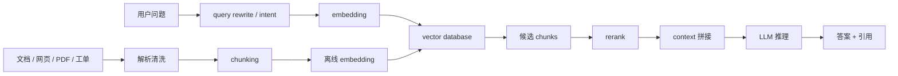

# 第 2 章：RAG 应用

## 本章回答的问题

- RAG 为什么不是“把向量数据库接到模型前面”这么简单？
- embedding、chunking、向量检索、rerank 和 context 拼接如何共同影响质量、延迟和成本？
- RAG 应用会怎样改变 AI Gateway、模型服务、存储和可观测性的设计？

## 一个真实场景

一个企业知识库问答系统上线后，用户反馈“有时回答很慢，有时答非所问”。应用团队先怀疑模型能力不够，平台团队看到推理服务 GPU 利用率并不高，存储团队发现向量库和对象存储访问存在尾延迟。最后排查发现，问题不是单一组件：文档切分过粗导致 context 太长，检索召回包含大量相似但无关片段，rerank 服务在高峰期排队，最终 prompt 超过了预期长度，推理阶段 TTFT 明显上升。

这个场景说明 RAG 的工程难点在于链路变长。它引入了数据处理、索引构建、在线检索、重排序、prompt 构造和引用追踪。每一个环节都可能影响最终回答质量和 cost per token。

## 核心概念

RAG 即 Retrieval-Augmented Generation，检索增强生成。它把模型参数中已经学习到的知识，与外部知识库中可更新、可追溯的内容结合起来。典型流程是：用户问题进入系统，先生成查询向量或检索表达，从知识库召回候选片段，再通过 rerank 选择更相关内容，最后把片段拼入 prompt，让 LLM 生成回答。

RAG 的优势是知识可更新、来源可追溯、私有数据可接入。它的代价是链路复杂、延迟增加、质量依赖数据治理，并且会放大 input token。RAG 做得好，模型像是在“开卷考试”；做得不好，只是把噪声塞进上下文窗口。

## 系统架构



这张图分成离线链路和在线链路。离线链路负责把文档转成可检索索引；在线链路负责从用户问题到答案生成。生产系统必须同时观察这两条链路，否则线上质量问题很难定位。

## 2.1 RAG 的基本流程

RAG 的基本流程可以分为六步。第一步是数据接入，把 PDF、网页、Markdown、数据库记录、工单和知识库页面导入系统。第二步是解析和清洗，处理格式、表格、图片、标题层级、重复内容和权限信息。第三步是 chunking，把文档切成适合检索和拼接的片段。第四步是 embedding，把文本映射成向量。第五步是在线检索和 rerank。第六步是把选中的片段拼入 prompt 并调用模型生成回答。

这些步骤不是线性完成后就结束。RAG 系统需要持续更新索引、删除过期文档、处理权限变更、记录引用来源，并把用户反馈反向用于 chunk 策略、召回策略和 prompt 模板优化。

## 2.2 embedding

Embedding 是把文本映射到向量空间的过程。相似语义的文本在向量空间中距离更近，因此可以用向量相似度做语义检索。RAG 中常见做法是离线为文档 chunk 生成 embedding，在线为用户 query 生成 embedding，再到向量数据库中检索相近 chunk。

Embedding 不是免费能力。它会带来离线计算成本、在线请求延迟、模型版本管理和索引重建问题。更换 embedding 模型后，历史向量通常不能直接混用，需要重新生成或建立多版本索引。工程上应记录 embedding model、维度、归一化方式、索引参数和生成时间。

## 2.3 chunking

Chunking 是把长文档切成较小片段。切得太大，召回片段包含大量无关内容，input token 增加，模型容易被噪声干扰。切得太小，语义不完整，答案缺少上下文。常见策略包括按标题层级切分、按段落切分、固定 token 窗口切分、滑动窗口切分，以及对表格和代码使用专门解析策略。

好的 chunking 应保留文档结构。标题、路径、章节、更新时间、权限标签和来源 URL 都应作为 metadata 保存。在线拼接 context 时，这些 metadata 可以帮助模型生成引用，也可以帮助平台做权限过滤和审计。

## 2.4 向量数据库

向量数据库负责存储向量、metadata 和索引，并支持近似最近邻检索。它解决的是“从大量 chunk 中快速找到候选片段”的问题。生产场景下，向量数据库不仅要看召回效果，还要看索引构建时间、在线查询延迟、过滤性能、多租户隔离、备份恢复和版本回滚。

RAG 中经常需要混合检索。向量检索擅长语义相似，关键词检索擅长精确匹配术语、编号、错误码和产品名。工程上常见做法是把 dense retrieval、BM25、metadata filter 和 rerank 组合起来，而不是只依赖一种检索方式。

## 2.5 rerank

Rerank 是对召回候选进行重排序的步骤。第一阶段检索通常追求召回率，会返回较多候选；rerank 则用更精细的模型判断 query 与 chunk 的相关性，选择少量高质量片段进入 prompt。

Rerank 可以显著改善答案质量，但会增加在线延迟和推理成本。高并发场景下，rerank 服务本身可能成为瓶颈。平台需要记录召回数量、rerank 输入数量、rerank 延迟、最终入 prompt 的 chunk 数和命中来源。否则当用户说“回答不准”时，很难判断是没召回、召回了没排上、还是模型没有正确使用上下文。

## 2.6 context 拼接

Context 拼接是把系统指令、用户问题、历史对话、检索片段、引用信息和输出格式要求组合成最终 prompt。这个步骤直接决定 input token、模型可见信息和回答风格。

拼接策略需要控制预算。一个典型做法是先为系统指令、用户问题和历史对话预留 token，再按 rerank 分数和来源多样性选择 chunk。对于长对话 RAG，还要考虑历史消息压缩，否则旧对话和新检索内容会争抢 context window。平台应记录最终 prompt token 数和每类内容占比。

## 2.7 RAG 对推理成本和延迟的影响

RAG 通常会增加 input token 和链路延迟。Embedding、检索、rerank 和 prompt 拼接发生在 LLM 推理之前，直接影响 TTFT。更长的 context 会增加 prefill 计算，消耗更多 HBM，并降低单位时间可服务的请求数。

但 RAG 也可能降低整体成本。如果它减少了大模型微调需求，或让较小模型在外部知识帮助下达到可接受质量，就可能降低训练和推理成本。关键是用同一口径比较：端到端延迟、回答质量、引用准确率、input/output token、GPU 时间和用户成功率。

## 工程实现

一个最小可用 RAG 系统至少需要以下数据结构：

```yaml
document:
  id: doc-123
  source: confluence
  title: GPU 集群准入流程
  updated_at: 2026-06-18
  acl: [team-ai-infra]

chunk:
  id: chunk-123-05
  document_id: doc-123
  text: "..."
  heading_path: ["运维", "准入", "NCCL test"]
  embedding_model: text-embedding-example
  metadata:
    page: 4
    url: https://example.invalid/doc-123
```

在线请求的 trace 应覆盖：query rewrite、embedding、vector search、keyword search、rerank、context assembly、LLM prefill、decode 和 streaming。每一步都应有耗时、输入规模、输出规模和错误码。

## 常见故障

- 文档权限没有进入 metadata filter，导致越权召回。
- chunk 太大，TTFT 上升且答案被噪声干扰。
- chunk 太小，模型拿不到完整论证链。
- embedding 模型升级后新旧索引混用，召回质量不稳定。
- rerank 服务排队，应用侧误以为是 LLM 慢。
- context 拼接没有预算控制，长对话下频繁截断关键证据。
- 引用只显示文档名，不显示 chunk 或段落，无法审计答案来源。

## 性能指标

- 检索指标：recall@k、命中文档数、候选 chunk 数、metadata filter 命中率。
- 延迟指标：embedding latency、vector search latency、rerank latency、context assembly latency、TTFT。
- token 指标：检索片段 token 数、最终 prompt token 数、answer token 数。
- 质量指标：引用准确率、无答案识别率、人工满意度、线上反馈率。
- 成本指标：每次 RAG 请求的 embedding 成本、rerank 成本、LLM input/output token 成本。

## 设计取舍

RAG 的核心取舍是“更多上下文”与“更少噪声、更低延迟”之间的平衡。提高 top-k 可以增加召回，但也会增加 rerank 和 prompt 成本。使用更强 rerank 模型可以改善相关性，但会增加在线链路复杂度。把更多历史对话放入 prompt 可以改善连续性，但会挤占检索内容空间。

企业场景还要在集中索引和租户隔离之间取舍。集中索引便于共享和运维，但权限过滤必须严格；按租户独立索引隔离更强，但成本和运维复杂度更高。

## 小结

- RAG 是数据、检索、重排序、prompt 和模型服务的端到端系统，不是单个向量数据库功能。
- Chunking 和 metadata 决定了 RAG 的可检索性、可引用性和权限边界。
- RAG 会增加 TTFT 和 input token，但可能降低微调和大模型依赖成本。
- 线上排障必须把 embedding、检索、rerank、context 拼接和 LLM 推理放到同一条 trace 中。

## 延伸阅读

- TODO: 向量数据库官方文档
- TODO: RAG 经典论文
- TODO: 企业知识库工程案例
