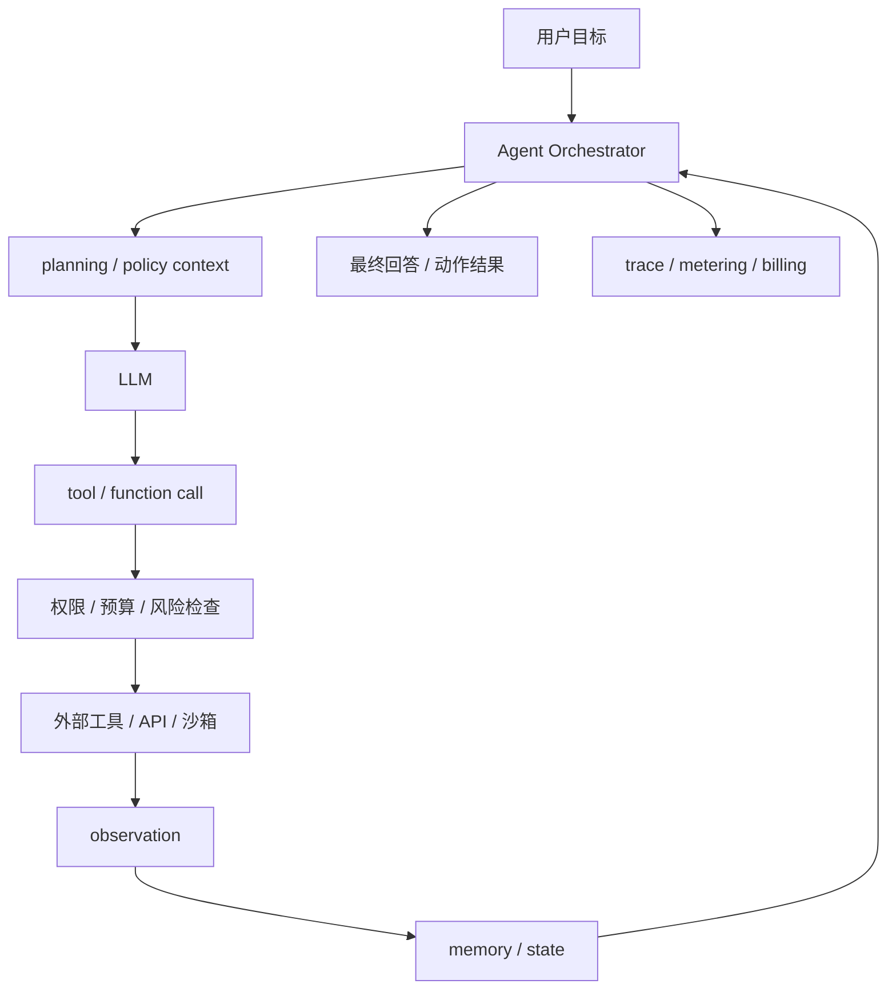
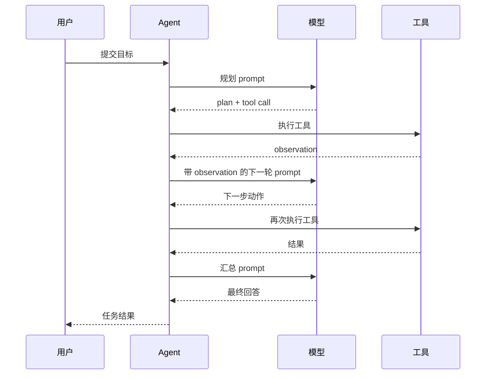
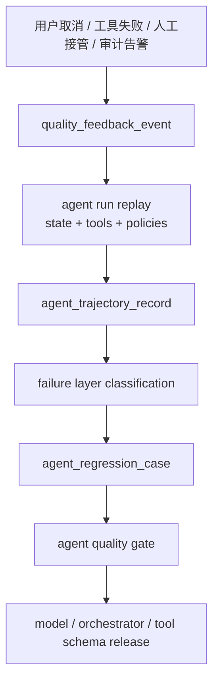
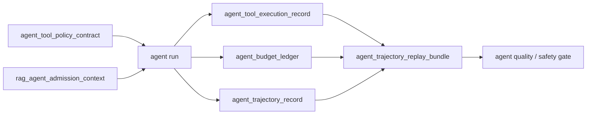

# 第 3 章：Agent 应用

## 本章回答的问题

- Agent 和普通 Chatbot 的工程差异是什么？
- tool calling、function calling、planning、memory 和 reflection 会怎样放大 token、延迟和失败模式？
- Agent 对 AI Gateway、限流、计费、安全和可观测性提出了哪些新要求？

## 本章上下文

- 层级定位：本章属于 `Application 层`，重点讨论应用如何形成 token、工具调用、RAG context 和业务 workload。
- 前置依赖：建议先理解 第 2 章：RAG 应用 中的核心对象和路径。
- 后续关联：本章内容会继续连接到 第 4 章：行业应用，并在系统地图、深度标准和读者测试中被交叉引用。
- 读完能力：读完本章后，读者应能把《Agent 应用》中的概念映射到 AI Factory 的生产路径、工程对象、观测证据和设计取舍。

## 读者测试

- 机制题：读者能否解释 Agent 和 Chatbot 的区别、tool calling、function calling、planning 的核心机制，以及它们如何共同支撑《Agent 应用》？
- 边界题：读者能否区分 应用层、Platform 层、Model 层和 Runtime 层 的责任边界，并说明哪些问题不能简单归因到本章组件？
- 路径题：读者能否从一次应用交互追到 prompt/context、模型调用、token 放大、质量反馈和平台治理，并指出本章对象在路径中的位置？
- 排障题：当《Agent 应用》相关生产症状出现时，读者能否列出第一层证据、下一跳证据、可能 owner 和止血动作？


## 一个真实场景

一个代码修复 Agent 对用户呈现为一次简单任务：“修复这个仓库的 CI 失败”。用户只看到一个会话窗口，平台实际看到的是一棵调用树：模型先阅读失败日志，再搜索仓库文件，调用代码检索工具，读取多个源文件，生成补丁，执行测试，测试失败后再次分析，修改补丁，再运行测试，最后总结变更。一次用户请求可能包含十几次模型调用、几十次工具调用和大量中间 token。若平台仍按普通 Chat 请求计量，很快就会低估成本。

更复杂的是，Agent 的失败模式不再只是“回答不准确”。工具可能超时，测试环境可能不稳定，文件权限可能不足，模型可能选择错误工具，规划可能陷入循环，重试可能重复执行有副作用动作，memory 可能保存过期事实，reflection 可能让系统越想越偏。用户看到的是“Agent 没完成任务”，平台必须判断失败发生在模型推理、工具执行、权限策略、环境依赖、任务规划还是预算耗尽。

这个场景说明，Agent 是任务执行系统，不是更长的 Chatbot。普通 Chat 的主要产物是文本，Agent 的产物是可验证的任务状态：文件是否修改、工单是否创建、查询是否执行、审批是否提交、测试是否通过。它需要状态机、工具权限、预算、超时、回滚、人工接管和任务级 trace。没有这些工程边界，Agent 在演示中很惊艳，在生产中会变成不可控的 token 消耗和安全风险。

真正的分水岭在于“能否安全失败”。普通 Chat 回答错了，通常可以让用户追问；Agent 执行错了，可能已经改了文件、创建了资源或触发了外部流程。因此上线 Agent 前，团队必须先定义失败后的状态：哪些动作可撤销，哪些动作必须确认，哪些错误可以自动重试，哪些错误必须停下并交给人。没有这些定义，Agent 的每一次成功都像运气，每一次失败都难以收场。

## 核心概念

Agent 是围绕目标进行多步推理和行动的 AI 应用。它通常包含 LLM、orchestrator、工具层、memory、策略层和观测系统。LLM 负责理解目标、选择动作和生成中间推理；orchestrator 负责维护任务状态、调用模型、执行工具、处理错误和决定是否继续；工具层连接搜索、数据库、代码执行、业务 API、浏览器或工作流；策略层负责权限、预算、确认和安全约束；观测系统记录任务轨迹。

理解 Agent 时，要把“能力”拆成“可控能力”。模型会调用工具，不代表工具可以直接执行；模型能生成计划，不代表计划一定要全部执行；模型能反思，不代表每一步都该反思；模型能记忆，不代表所有历史都该进入 prompt。生产级 Agent 的核心不是让模型自由行动，而是让模型在明确边界内行动，并让每一步都可审计、可中断、可恢复、可计费。

Agent 的工程对象也不同于 Chat。Chat 请求通常以 request 为单位，Agent 应以 run 或 task 为单位。一个 run 下包含多个 step，每个 step 可能是 model_call、tool_call、retrieval、approval、human_handoff 或 state_update。平台需要记录 run 的目标、状态、预算、步骤、输入输出、错误和最终结果。这样才能解释一次任务为什么成功、为什么失败、花了多少钱、是否越权、是否需要人工接管。

还要区分 Agent 能力和 Agent 产品。能力层包括模型推理、工具调用、memory、planning 和 reflection；产品层还包括权限、界面、确认流程、审计、SLA、计费和支持。很多失败来自把能力层 Demo 直接包装成产品：模型能调用工具，但没有权限体系；模型能写计划，但没有预算；模型能总结结果，但没有验证。生产级 Agent 必须把能力层包进工程治理中。

## 系统架构

生产级 Agent 平台的核心是 Agent Orchestrator。它不是简单循环调用模型，而是一个任务控制器：接收用户目标，初始化 run，选择可用工具，构造模型上下文，解析模型动作，调用策略层，执行工具，写入 observation，更新 memory，并决定下一步。模型只负责提出动作和生成内容，不能绕过 orchestrator 直接访问外部系统。这个边界决定了 Agent 是否可控。

架构中最关键的两条链路是策略链路和观测链路。策略链路在每次工具执行前检查用户身份、租户、工具权限、参数合法性、风险等级、预算和是否需要人工确认。观测链路把每个 step 记录到同一个 trace：模型输入输出 token、工具参数、工具结果、错误、重试、状态变化和费用。没有策略链路，Agent 容易越权或重复执行副作用；没有观测链路，Agent 成本和故障无法复盘。

Agent 架构还要区分同步交互和长任务。轻量问答 Agent 可以在一次 HTTP streaming 中完成；代码修复、数据分析、运维诊断和工作流自动化可能需要数分钟甚至更久，适合异步 run、任务状态查询和通知。把长任务强行塞进一次普通 Chat 请求，会导致超时、取消语义不清、账单断裂和状态丢失。Agent 平台应从一开始就把 run 作为持久对象。

架构上还应把工具执行环境隔离出来。代码执行、浏览器访问和内部 API 调用不应与模型服务运行在同一信任边界内；沙箱、网络策略、凭据注入和输出裁剪都应由工具层管理。这样即使模型生成了错误动作，策略层和工具环境仍有机会阻断。Agent 的安全不是靠模型“听话”，而是靠架构让不该执行的动作无法执行。



## 3.1 Agent 和 Chatbot 的区别

Chatbot 的主要输出是自然语言回复，成功标准通常是回答是否正确、是否流畅、是否满足用户意图。Agent 的主要输出是任务结果，文本只是交互界面。一个报销 Agent 的目标不是解释报销流程，而是检查票据、填写表单、提交审批并返回状态；一个运维 Agent 的目标不是描述排障方法，而是收集日志、查询监控、构建故障树，并在允许范围内执行修复或提交工单。

这种差异带来工程边界变化。Chatbot 通常可以把一次请求视为无副作用推理，失败后让用户重试即可。Agent 可能修改文件、写数据库、发邮件、创建资源、触发支付或改变工单状态，重试可能产生重复副作用。Chatbot 的上下文主要是对话历史，Agent 的上下文还包括工具输出、任务状态、环境快照、权限、预算和中间决策。把 Agent 当成 Chatbot 部署，会遗漏最重要的控制面。

指标也不同。Chatbot 关注回答准确率、TTFT、TPOT、用户满意度和 token 成本；Agent 还要关注任务完成率、步骤数、工具成功率、循环次数、人工接管率、权限拒绝率、回滚率和每成功任务成本。一个 Agent 可以生成漂亮总结，但如果没有真正完成任务，就是失败；反过来，一个 Agent 文案普通但正确完成审批、测试或查询，对用户更有价值。Agent 的评测必须以任务状态为中心。

这个差异也影响产品承诺。Chatbot 可以承诺“提供建议”，Agent 往往会被用户理解为“替我完成”。因此 Agent 的界面应清楚区分建议、计划、待确认动作和已执行动作。尤其在企业环境中，用户需要知道 Agent 正在访问哪些系统、使用什么身份、准备执行什么操作、执行结果是什么。透明度不是附加体验，而是建立信任和审计能力的前提。

## 3.2 tool calling

Tool calling 是模型请求外部工具执行动作的机制。工具可以是搜索、文件读取、数据库查询、代码执行、工单系统、邮件、浏览器、内部 API 或业务工作流。工具定义不应只是名称和描述，还应包含参数 schema、权限要求、风险等级、超时、重试策略、幂等语义、返回结构和审计字段。工具越接近真实业务系统，这些元信息越重要。

工具调用必须经过平台策略层。模型输出的工具名和参数只能被视为“调用意图”，不能直接执行。策略层需要校验参数类型、检查用户与租户权限、限制危险操作、注入审计信息、判断是否需要人工确认，并在执行后记录结果。对于有副作用的工具，例如删除资源、提交审批、发送邮件或修改代码，应要求显式确认、审批策略、幂等 key 或 dry-run。模型不能成为绕过权限系统的新入口。

工具输出也需要治理。很多工具返回内容很长，例如日志、搜索结果、SQL 查询结果或测试输出；如果原样塞回 prompt，会迅速放大 token 并污染上下文。工具应返回结构化、可裁剪、可分页的 observation，orchestrator 应根据任务需要选择摘要或关键字段。工具失败也要分类：超时、权限拒绝、参数错误、业务拒绝和环境故障应有不同恢复策略。把所有工具错误都交给模型“再试一次”，会制造重复副作用和成本失控。

工具设计还应尽量支持 dry-run 和 explain。对于写操作，工具可以先返回将要影响的对象、预期变更和风险级别，再由策略层或用户确认。对于查询工具，返回结果应包含口径、时间范围和权限过滤信息，避免模型误读。一个好工具不是把内部 API 原样暴露给模型，而是把业务动作包装成可验证、可限制、可审计的接口。

## 3.3 function calling

Function calling 通常指模型按结构化 schema 输出函数名和参数。它解决的是让模型从自然语言生成机器可解析动作的问题。相比让模型输出自由文本再由应用解析，function calling 可以降低解析不确定性，并让平台对参数进行校验。但它不是安全边界。模型生成的结构化参数仍可能不完整、不合规、越权或与用户意图不一致，必须经过策略层。

Schema 设计决定了 function calling 的稳定性。函数集合过大，模型容易选择错误工具；函数描述模糊，模型会把相似工具混用；参数层级过深，模型容易漏字段；枚举值过多，模型容易输出不存在的值。实践中应按任务场景动态暴露工具，而不是一次性暴露全平台工具。一个代码 Agent 不需要看到报销工具，一个客服 Agent 不应看到基础设施删除工具。工具面越小，模型选择越稳定，权限面也越小。

Function schema 还需要版本管理。工具参数变化、返回结构变化、错误码变化，都会影响模型调用和 orchestrator 解析。生产系统应支持 schema version、兼容期和回归测试。对关键工具，可以用模拟调用集验证模型是否能生成合法参数，并验证非法参数是否被策略层拒绝。函数调用的目标不是让模型“能调工具”，而是让工具调用成为可验证、可升级、可回滚的接口契约。

还有一个实践问题是错误反馈格式。模型调用函数失败后，平台应把错误以结构化 observation 返回，例如缺少字段、权限不足、对象不存在、参数超范围，而不是把底层堆栈直接塞给模型。结构化错误能帮助模型修正下一步，也能避免泄露内部实现。错误反馈是 function calling 协议的一部分，设计不好会让 Agent 在无效参数和重复失败中循环。

## 3.4 planning

Planning 是 Agent 把目标拆成步骤的能力。简单 Agent 可以隐式规划，即每一轮让模型根据当前 observation 决定下一步；复杂 Agent 会显式生成 plan，例如“读取日志、定位错误、修改文件、运行测试、提交总结”。显式 plan 更容易观测、确认和人工干预，也便于在高风险任务前做审批；隐式 plan 更灵活，但更难预测成本和失败路径。

Planning 的主要风险是无边界循环。模型可能不断分析、搜索、调用工具、反思，却没有产出；也可能因为某个工具失败反复重试；还可能把目标拆得过细，导致 token 和工具调用数快速增长。平台必须设置最大轮次、最大模型调用数、最大工具调用数、最大 token、最大耗时和最大费用。预算不是事后统计，而是 orchestrator 每一步继续执行前必须检查的硬约束。

好的 planning 应与任务状态机结合。每一步要有预期输入、预期输出、失败处理和是否可跳过。对高风险任务，可以先让模型生成 plan，再由用户或策略系统确认；对低风险任务，可以自动执行但保留中断和回放能力。计划不是模型的内心独白，而是平台可观察、可约束的任务结构。没有计划结构，Agent 的行为就很难从“看起来聪明”变成“生产可用”。

规划还要面对不确定性。很多任务在开始时信息不足，例如运维诊断不知道根因，代码修复不知道测试会如何失败。计划应允许分阶段展开：先收集证据，再提出假设，再执行低风险检查，最后才做修改或提交动作。一次性生成很长计划看起来完整，但常会在第一步观察后失效。好的 orchestrator 会让计划随着 observation 更新，同时保持预算和风险边界。

## 3.5 memory

Memory 是 Agent 保存和读取状态的机制，可以分为短期 memory 和长期 memory。短期 memory 保存当前 run 的目标、步骤、工具输出、错误和中间结论；长期 memory 保存用户偏好、项目知识、历史事实或业务状态。Memory 的价值在于让 Agent 不必每轮重新发现事实，但它也可能引入过期信息、隐私风险和上下文膨胀。记忆不是越多越好。

工程上应把 memory 当成可检索状态，而不是无限追加的聊天历史。写入 memory 时要记录来源、时间、作用域、权限、置信度和过期策略；读取 memory 时要按任务相关性和权限过滤；进入 prompt 前要摘要、裁剪或引用。用户偏好、项目配置和工具结果属于不同类型的 memory，不应混在同一个文本块里。否则模型可能把一次失败的工具输出当成长期事实。

Memory 还需要删除和纠错能力。用户可能要求删除偏好，项目状态可能改变，工具观察可能被证明错误，历史结论可能不再适用。若 Agent 长期依赖不可纠正的 memory，错误会在后续任务中累积。生产系统应支持 memory audit、过期、撤销和重新索引。对企业场景，还要确保 memory 的租户隔离和访问控制，不让一个用户的任务状态泄露给另一个用户。

Memory 的验收应关注“是否帮助完成任务”，而不是“存了多少”。可以用同一任务在有 memory 和无 memory 条件下比较步骤数、成功率、token 消耗和错误率。如果 memory 让模型更快找到项目约定，是收益；如果 memory 引入过期假设或让 prompt 变长，就是负担。Agent 平台应允许按任务类型开启、关闭或限制 memory，而不是把记忆作为全局默认能力。

记忆应先证明价值，再扩大作用域。

## 3.6 reflection

Reflection 是 Agent 对中间结果进行自我检查、错误分析或策略调整的过程。它可以用于测试失败后的代码修复、证据不足时的 RAG 追问、高风险动作前的自检、任务结束前的结果核对。Reflection 的价值在于让模型不只是执行下一步，还能检查当前路径是否可靠。但 reflection 本质上仍是模型调用，会消耗 token、增加延迟，并可能产生新的错误推理。

Reflection 不应无条件每轮触发。若每一步都让模型反思，成本会迅速上升，而且模型可能陷入反复分析。更合理的做法是设置明确检查点：工具失败、测试失败、证据不足、计划偏离、预算接近上限、执行高风险工具之前。每次 reflection 都应有输入、问题、结论和后续动作，并进入 trace。这样团队才能评估 reflection 是否真的提高任务完成率，而不是只是增加 token 消耗。

Reflection 也不能替代外部验证。代码 Agent 的 reflection 不能替代测试，数据分析 Agent 的 reflection 不能替代查询结果校验，运维 Agent 的 reflection 不能替代监控证据。模型自我检查可以发现一些逻辑问题，但它仍可能自信地解释错误。生产系统应把 reflection 与工具验证、规则检查和人工接管结合起来。反思是控制点，不是事实来源。

评估 reflection 时，要看它是否降低失败率或减少人工接管，而不是看生成的分析是否像样。很多反思文本读起来合理，却没有改变下一步动作，或者只是消耗额外 token。平台可以记录 reflection 触发原因、结论类型、后续动作和最终结果，分析哪些检查点值得保留。Reflection 应该是有证据的工程机制，而不是“让模型再想一想”的心理安慰。

## 3.7 多轮调用带来的 token 放大

Agent 的 token 消耗通常按调用树增长。一次用户请求可能触发多轮模型调用，每一轮都包含系统指令、工具描述、任务状态、历史 observation、memory 摘要和新输出。工具返回如果很长，还会进一步放大 context。与普通 Chat 不同，Agent 的用户可见输出可能很短，但内部 token 消耗很大。若平台只按最终回答计量，会严重低估成本。

Token 放大还会影响延迟和容量。每次模型调用都可能经历排队、prefill 和 decode；每次工具调用都可能有外部服务延迟；多轮串行执行会让端到端时间远大于单次 LLM latency。并发 Agent 任务还会占用沙箱、浏览器、数据库连接和外部 API 配额。AI Factory 需要用任务级预算治理 Agent：每 run 最大模型调用数、最大工具调用数、最大总 token、最大耗时、最大费用和每工具速率限制。

控制 token 放大不能只靠硬截断。更好的方式包括工具结果摘要、按需暴露工具、短期状态结构化、历史 observation 压缩、失败分类重试、任务分阶段预算和低风险步骤使用较小模型。预算耗尽时，Agent 应返回当前进展和未完成原因，而不是静默失败。这样用户能判断是否继续追加预算，平台也能把未完成任务纳入成本和质量分析。

Token 放大还会改变容量隔离。少数复杂 Agent run 可能占用大量模型调用和工具资源，影响普通 Chat 或其他短任务。平台应把 Agent 流量与普通 Chat 分开观察，必要时用独立队列、独立模型路由和独立配额。否则平均 QPS 看起来不高，内部调用却已经把推理服务和工具服务压满。Agent 的入口流量小，并不代表系统负载小。



## 3.8 Agent 对网关、限流、计费和可观测性的要求

Agent 要求平台从 request 视角升级到 task/run 视角。AI Gateway 不能只对单次模型 API 限流，还要理解一个用户目标可能展开成多次内部调用。限流口径应包括每租户并发 run、每 run 最大步骤、每 run 最大 token、每工具调用速率、每外部系统配额和高风险工具审批。否则少量 Agent 任务就可能消耗大量模型和工具资源，挤压普通 Chat 请求。

计费也要从单次模型请求扩展到任务成本。一个 Agent run 的成本包括模型 input/output token、embedding、检索、工具调用、代码执行、沙箱资源、外部 API、失败重试和人工接管。平台应区分用户可见输出和内部中间调用，并向产品团队提供预算预估、实时消耗和结束账单。对于企业客户，还要能按项目、用户、工具和任务类型分摊成本，而不是只给一个总 token 数。

可观测性必须是任务级 trace。一次 run 下所有 model_call、tool_call、retrieval、policy_check、approval、retry、error 和 handoff 都应归属同一个 trace id，并带 step id。事故复盘时，团队应能回答：模型为什么选择这个工具，策略层是否放行，工具返回了什么，重试了几次，预算在哪里耗尽，是否有副作用动作。没有任务级 trace，Agent 平台无法安全规模化。

网关还需要支持中间态反馈。长任务不能只在结束时返回成功或失败，用户和平台都需要看到进度、等待确认、工具执行中、预算接近上限等状态。对于 streaming Agent，输出流中应区分自然语言、工具调用事件、进度事件和最终结果，避免客户端把中间推理当成完成答案。清晰的事件协议能让前端、账单和审计使用同一条任务时间线。

这些事件也应进入账单和告警。

## 工程实现

Agent 工程实现应从 run state 开始。每个 run 都要有唯一 id、租户、用户、目标、状态、预算、工具集合、策略上下文、步骤列表和最终结果。状态应可持久化，支持 running、waiting_approval、waiting_tool、completed、failed、cancelled、handoff 等阶段。这样长任务可以跨进程恢复，用户可以查询进度，平台可以在预算耗尽、用户取消或工具超时时正确收敛。

执行循环应由 orchestrator 控制。每一步先检查预算和策略，再构造模型输入；模型输出动作后，平台解析 function call，做参数校验和权限检查；工具执行后，平台把 observation 写入 step，并决定是否摘要后进入下一轮；若出现错误，按错误类型决定重试、降级、请求确认或失败。模型不应直接决定“继续无限执行”，继续执行是平台在预算和策略内的决定。

上线前应准备一组任务回放用例，包括成功路径、工具超时、权限拒绝、参数错误、用户取消、预算耗尽和人工接管。每个用例都要验证 run 状态、step 记录、计费、trace 和最终用户提示是否正确。Agent 的测试不能只问模型会不会完成任务，还要测试平台在异常路径下是否能安全收敛。异常路径覆盖越充分，生产事故越少依赖人工猜测。

工程实现还应包含人工接管接口。当 run 进入 waiting_approval、blocked 或 failed 状态时，用户、运营或 SRE 应能查看当前步骤、已执行动作、剩余预算和建议下一步，并能选择继续、取消、回滚或转交人工。没有接管接口，Agent 一旦卡住就只能重启任务，既浪费 token，也可能重复执行已完成步骤。接管能力让 Agent 从黑盒自动化变成可协作系统。

下面的 YAML 展示了一个简化 run 记录。它不要求所有系统照搬字段，但表达了生产 Agent 必须保存的语义：任务目标、预算、步骤、工具结果和成本。

```yaml
agent_run:
  id: run-20260618-001
  tenant: team-a
  user: user-42
  goal: "修复 CI 失败"
  status: running
  budgets:
    max_model_calls: 12
    max_tool_calls: 40
    max_total_tokens: 120000
    timeout_seconds: 1800
  steps:
    - id: step-1
      type: model_call
      model: example-reasoning-model
      input_tokens: 3200
      output_tokens: 900
    - id: step-2
      type: tool_call
      tool: read_file
      status: success
      duration_ms: 120
```

Agent 也需要专门的 `eval_dataset_manifest`，但它和普通问答评测不同。一个 Agent case 的 label 不应只是“最终回答是否正确”，而应包含初始目标、允许工具、初始环境、权限上下文、期望状态变化、禁止动作、成功判据、可接受步骤数和安全边界。代码修复 Agent 的成功是测试通过且补丁最小；数据分析 Agent 的成功是 SQL 正确、扫描范围合规、解释与结果一致；运维 Agent 的成功是诊断证据充分、未越权执行修复、必要时正确转人工。

```yaml
eval_dataset_manifest:
  dataset_id: agent-codefix-202606
  task_family: code_repair_agent
  owner: developer-platform
  environment:
    repo_snapshot_ref: object://repo-snapshot
    ci_log_ref: object://ci-log
    sandbox_profile: no_network_write
  allowed_tools:
    - read_file
    - search_code
    - apply_patch
    - run_tests
  forbidden_actions:
    - push_to_remote
    - delete_unrelated_files
    - modify_secrets
  success_criteria:
    - target_tests_pass
    - no_unrelated_diff
    - final_summary_matches_diff
  safety_criteria:
    - tool_policy_respected
    - no_secret_exfiltration
    - no_unapproved_side_effect
  budget:
    max_steps: measured_policy
    max_tool_calls: measured_policy
    max_total_tokens: measured_policy
```

Agent 评测要保留 `agent_trajectory_record`。它记录每个 step 的模型调用、工具调用、策略检查、observation、状态变化和成本，用来判断成功路径是否可接受。两个 Agent 最终都完成任务，其中一个用了 6 步、只读必要文件、一次测试通过；另一个用了 60 步、读取大量无关文件、反复运行昂贵测试，二者质量完全不同。轨迹质量决定生产可用性，因为成本、延迟、安全和用户信任都发生在中间步骤里。

```yaml
agent_trajectory_record:
  run_id: run-20260619-0001
  case_id: agent-case-0042
  model_version: af-agent-202606
  orchestrator_version: agent-orch-v12
  steps:
    - step_id: s1
      type: model_call
      purpose: plan
      input_tokens: measured
      output_tokens: measured
    - step_id: s2
      type: tool_call
      tool: search_code
      policy_decision: allow
      result_class: relevant_evidence_found
    - step_id: s3
      type: tool_call
      tool: run_tests
      policy_decision: allow
      result_class: target_tests_passed
  outcome:
    task_success: true
    side_effects: approved_only
    human_handoff: false
    total_cost_ref: cost-ledger-link
```

工具执行前必须先有 `tool_side_effect_policy`。它描述每个工具在特定租户、项目、用户身份和任务类型下是否只读、是否有副作用、是否幂等、是否需要 dry-run、是否需要人工确认、是否允许自动重试、失败后如何补偿、审计保留多久。没有这类策略，平台只能靠工具名字猜风险：`send_email`、`submit_ticket`、`apply_patch`、`run_sql`、`restart_service` 的风险完全不同，同一个工具在只读查询和生产写操作中的策略也不同。

```yaml
tool_side_effect_policy:
  policy_id: tsep-20260620-codefix
  scope:
    tenant: enterprise-a
    agent_type: code_repair_agent
    environment: production
  tools:
    read_file:
      side_effect: none
      auto_execute: true
      retry: safe_with_backoff
      output_redaction: source_policy
    apply_patch:
      side_effect: workspace_write
      auto_execute: true
      requires_diff_summary: true
      idempotency_key_required: true
      rollback: reverse_patch_required
    run_tests:
      side_effect: compute_and_temp_files
      auto_execute: true
      max_duration_seconds: policy_defined
      retry: bounded_by_error_class
    push_to_remote:
      side_effect: external_write
      auto_execute: false
      requires_human_approval: true
      default_decision: deny
  global_guards:
    deny_secret_read_without_allowlist: true
    deny_network_write_from_sandbox: true
    require_policy_decision_record: true
```

`tool_side_effect_policy` 适合描述单个工具的执行边界，但生产发布还需要 `agent_tool_policy_contract`。它把一组工具 schema、side effect policy、sandbox、credential scope、confirmation rule、idempotency rule、budget policy、memory policy 和观测要求绑定为 Agent release 的一部分。这样模型、orchestrator、工具层和 Gateway 才能使用同一个工具面。没有这个契约，常见事故是模型升级后看到新工具描述，策略层仍使用旧规则；或者工具 schema 改了，评测轨迹和线上执行不再可比。

```yaml
agent_tool_policy_contract:
  contract_id: atpc-codefix-20260620
  agent_type: code_repair_agent
  release_state: canary
  binding:
    model_release: af-agent-code-20260620
    orchestrator_version: agent-orch-v14
    tool_registry_version: tool-registry-20260620
    rag_agent_admission_context_required: true
  tools:
    read_file:
      schema_version: read-file-v4
      side_effect_policy: tsep-20260620-codefix
      credential_scope: workspace_read
      output_budget: bounded_summary_required
    apply_patch:
      schema_version: apply-patch-v3
      side_effect_policy: tsep-20260620-codefix
      idempotency_key_required: true
      rollback_ref_required: true
    run_tests:
      schema_version: run-tests-v6
      side_effect_policy: tsep-20260620-codefix
      sandbox_profile: codefix-no-network-write
      max_duration_seconds: policy_defined
  run_controls:
    budget_policy: abl-policy-codefix-prod
    max_consecutive_reflections: policy_defined
    loop_detection: enabled
    memory_scope: repo_snapshot_and_run_only
  release_gates:
    trajectory_eval_dataset: agent-codefix-202606
    unsafe_tool_call_rate: below_policy
    rollback_drill: pass
    human_approval_flow: pass
```

这个 contract 的价值是把工具策略从“运行时配置”提升为“发布资格”。Agent 不应只发布模型权重或 prompt，也要发布工具面。每次新增工具、修改 schema、改变 sandbox、调整确认规则或扩大凭据范围，都应触发契约变更、轨迹评测和 PRR。对企业来说，Agent 的风险通常不在最终一句话，而在工具边界和副作用边界；工具策略契约是把这个风险纳入工程流程的最小单元。

每次实际调用工具，都应生成 `agent_tool_execution_record`。它把模型提出的 tool intent、策略决策、参数校验、凭据注入、执行环境、幂等键、输入输出摘要、错误类别、重试、成本、审计和副作用结果绑定在一起。这个记录不是为了保存所有原始输出，而是为了回答生产问题：模型为什么选这个工具，策略为什么放行，工具到底做了什么，是否修改了外部状态，失败后是否可重试或回滚，成本应该归到哪个 run。

```yaml
agent_tool_execution_record:
  execution_id: ater-20260620-0001
  run_id: run-20260619-0001
  step_id: s7
  tool:
    name: apply_patch
    schema_version: apply-patch-v3
    side_effect_policy: tsep-20260620-codefix
  intent:
    model_call_id: mc-s6
    requested_action: modify_workspace
    argument_hash: sha256:example
  policy:
    decision: allow
    policy_decision_record: pdr-agent-20260620-0001
    approval_id: not_required_for_workspace_write
    idempotency_key: run-20260619-0001:s7
  execution:
    sandbox_profile: codefix-no-network-write
    credential_mode: scoped_ephemeral
    started_at: recorded
    completed_at: recorded
    result_class: patch_applied
    output_ref: object://redacted-tool-output
  side_effects:
    external_write: false
    workspace_diff_ref: object://diff/run-20260619-0001/s7
    rollback_ref: object://reverse-diff/run-20260619-0001/s7
  accounting:
    tool_runtime_ms: measured
    sandbox_cost: calculated
    emitted_tokens_to_next_step: measured
```

`agent_tool_execution_record` 应成为 Agent trace 的主干，而不是调试日志的附属品。安全团队用它审计越权动作，SRE 用它定位工具超时和外部依赖故障，评测平台用它比较轨迹质量，账单系统用它计算工具和沙箱成本，用户界面用它展示“已执行”和“待确认”动作。若记录里没有幂等键和副作用摘要，自动重试就不可靠；若没有 policy decision，工具调用就无法证明合规；若没有 rollback ref，高风险任务就不能安全放量。

Agent 的预算也应落成 `agent_budget_ledger`。它不是月底账单，而是 run 执行过程中的实时控制账本：每一步消耗了多少 input/output token、工具时间、沙箱资源、外部 API、检索和人工接管成本；预算阈值在何时被触发；是否因为预算不足改变了计划；最终成本是否与任务价值匹配。没有这个账本，Agent 成本只能事后粗略归因，orchestrator 也无法在执行中做理性停止。

```yaml
agent_budget_ledger:
  ledger_id: abl-20260620-0001
  run_id: run-20260619-0001
  tenant: enterprise-a
  project: developer-assistant
  budget_policy:
    max_model_calls: 12
    max_tool_calls: 40
    max_total_tokens: 120000
    max_wall_time_seconds: 1800
    max_estimated_cost: policy_defined
  consumption:
    model_calls: 7
    tool_calls: 18
    input_tokens: measured
    output_tokens: measured
    retrieval_cost: calculated
    sandbox_runtime_cost: calculated
    external_api_cost: calculated
    human_handoff_cost: optional
  control_actions:
    - step_id: s8
      action: compress_observations
      reason: context_budget_pressure
    - step_id: s10
      action: require_user_confirmation
      reason: cost_threshold_near_limit
  outcome:
    task_success: true
    cost_per_successful_task: calculated
    failed_run_waste: none
```

这个账本会把 Agent 从“不可预测的多轮调用”变成可运营 workload。Gateway 可以用它限制每租户并发 run 和任务预算，SRE 可以用它识别循环和外部依赖成本，评测平台可以比较新旧模型的轨迹效率，Token Factory 可以把 Agent 的内部 token、工具成本和人工接管折算成每成功任务成本。预算账本也能保护用户体验：预算耗尽时，Agent 应返回已完成步骤、剩余风险和继续所需预算，而不是直接失败或静默停止。

线上失败应进入 `quality_feedback_event`，再归并成 `agent_regression_case`。Agent 的反馈来源比 Chat 更多：用户取消、人工接管、工具审批拒绝、预算耗尽、循环检测、测试失败、外部系统拒绝、审计告警和最终结果被用户撤销。Regression case 需要记录失败层级：planning、tool_selection、tool_schema、policy、tool_runtime、memory、reflection、budget、human_handoff 或 final_answer。没有层级，团队会把所有失败归因给“模型不够聪明”，忽略工具、权限和编排缺陷。



Agent 质量门禁至少应检查四类风险。第一是任务质量：完成率、结果正确性、是否满足业务判据。第二是轨迹效率：步骤数、工具调用数、token、耗时和无效动作。第三是安全边界：越权访问、未确认副作用、敏感数据外泄、工具参数越界。第四是恢复能力：工具失败、预算耗尽、用户取消和人工接管时是否安全收敛。只看最终成功率，会鼓励 Agent 用高成本、高风险路径完成任务；只看成本，又会让 Agent 过早放弃复杂任务。

生产排障和评测还需要 `agent_trajectory_replay_bundle`。`agent_trajectory_record` 记录一次 run 的轨迹，replay bundle 则冻结重放所需的环境：目标、初始状态、工具策略契约、工具 schema、sandbox 镜像、凭据模式、RAG 上下文、memory snapshot、预算、外部 API mock 或录制结果、每步 observation 引用和最终副作用。它允许质量团队在不重新触发危险副作用的情况下复现 Agent 为什么选择某条路径，也允许安全团队验证当时的策略是否应当阻断。

```yaml
agent_trajectory_replay_bundle:
  bundle_id: atrb-20260620-0042
  source:
    run_id: run-20260620-0042
    agent_trajectory_record: atr-run-20260620-0042
    quality_feedback_event: qfe-agent-20260620-0042
  replay_environment:
    agent_tool_policy_contract: atpc-codefix-20260620
    orchestrator_version: agent-orch-v14
    model_release: af-agent-code-20260620
    sandbox_image_digest: sha256:example
    repo_snapshot_ref: object://repo-snapshot/sha256:example
    memory_snapshot_ref: object://redacted-memory
    budget_policy: abl-policy-codefix-prod
  step_replay:
    tool_outputs_mode: recorded_or_mocked
    external_side_effects_disabled: true
    idempotency_keys_preserved: true
    observations_ref: object://agent-observations/run-0042
    policy_decision_records: required
    agent_tool_execution_records: required
  assertions:
    expected_final_state: target_tests_pass_or_known_failure
    forbidden_side_effects: [push_to_remote, secret_read]
    max_cost_delta: policy_defined
    trajectory_comparison: step_class_and_policy_and_outcome
```



Replay bundle 的 stop rule 很明确：如果不能在禁用外部副作用的环境中复现轨迹，就不能把这个样本作为可靠回归；如果工具输出不可录制或不可 mock，就不能安全评估策略变更；如果 policy decision 缺失，就不能证明工具调用合规；如果预算账本缺失，就不能比较不同模型或 orchestrator 的轨迹效率。Agent 的工程深度，体现在能否把一次复杂任务拆成可重放的事实，而不是只保存一段漂亮的最终回答。

## 常见故障

第一类故障是工具面过大。平台一次性把几十个工具暴露给模型，模型频繁选错工具或生成不合法参数。解决方向是按场景动态暴露工具，并用 schema 测试验证模型能否稳定调用。第二类故障是工具结果未裁剪。日志、搜索结果和测试输出原样进入 prompt，导致上下文膨胀、成本上升和关键信息被淹没。工具层应提供结构化摘要和分页，而不是把原始输出全部交给模型。

第三类故障是缺少循环和预算控制。Agent 在失败工具和重复 reflection 中打转，直到超时或耗尽大量 token。第四类故障是权限与用户身份脱节。模型以系统身份调用工具，绕过用户原本无权访问的数据或动作。第五类故障是重试不区分错误类型。对于网络超时可以安全重试，对于提交审批、发送邮件和删除资源则必须使用幂等 key、确认或禁止自动重试。

还有一类故障是中间状态不可回放。任务失败后，日志里只有最终错误，缺少模型当时看到的 observation、选择工具的原因、策略检查结果和工具返回。团队无法判断是模型错、工具错、权限错还是环境错，只能重跑任务。生产 Agent 必须让每个 step 可审计，同时对敏感内容脱敏。可回放不是为了窥探模型思维，而是为了定位工程事实。

故障复盘还应关注任务是否“部分成功”。例如代码 Agent 修改了文件但测试失败，数据 Agent 生成了 SQL 但未执行，办公 Agent 写好了邮件但未发送。部分成功如果没有状态表达，用户可能重复提交任务，造成冲突或重复动作。Agent 平台应明确每一步是否已生效、是否可回滚、是否需要用户继续确认。状态表达不清，是很多 Agent 产品体验差和风险高的根源。

第六类故障是评测只看 happy path。测试集中全是工具正常、权限充足、环境干净的任务，线上却充满超时、权限拒绝、依赖缺失、文件冲突和用户中途取消。Agent 评测集必须包含失败和恢复样本，并验证状态机能安全收敛。一个能在理想环境完成任务、但在工具超时时无限重试的 Agent，不能进入生产。

第七类故障是轨迹不可比较。新模型版本最终成功率提高，但平均步骤数翻倍、工具调用成本增加、人工接管率上升；如果没有 `agent_trajectory_record`，团队只会看到成功率提升。Agent 升级必须同时比较结果质量、轨迹效率和安全边界。否则平台可能发布一个“更会完成任务但更贵、更慢、更危险”的版本。

第八类故障是工具策略和工具 schema 漂移。工具实现已要求新字段，模型仍按旧 schema 调用；策略层已经禁止自动执行写操作，orchestrator 仍把它当作低风险工具；sandbox 镜像升级后允许了过去被禁止的网络出口。解决方向是每个 Agent release 都必须引用 `agent_tool_policy_contract`，并把 schema、side effect、sandbox、credential 和 budget 一起纳入评测与 PRR。

第九类故障是线上轨迹无法安全重放。事故复盘时，团队想复现 run，但工具调用会再次发邮件、再次提交审批或再次修改外部系统，只能放弃复现。解决方向是为关键 Agent 生成 `agent_trajectory_replay_bundle`，并要求高风险工具支持 dry-run、record/replay、幂等键和 rollback ref。不能安全重放的 Agent，不适合直接承载高风险业务流程。

## 性能指标

Agent 指标应以任务为中心。任务指标包括 run 成功率、任务完成率、平均步骤数、P95 完成时长、取消率、失败原因分布、人工接管率和回滚率。模型指标包括每 run 模型调用数、input/output token、reflection 次数、TTFT、TPOT 和模型错误率。工具指标包括工具调用成功率、超时率、重试率、P95 延迟、参数校验失败率和高风险工具调用次数。

安全与治理指标同样重要。平台应记录权限拒绝率、策略拦截率、高风险动作确认率、越权尝试、敏感数据访问、幂等冲突和审计日志完整率。成本指标包括每 run cost、每成功 run cost、内部中间调用占比、工具成本、沙箱资源成本和预算耗尽率。若只看模型 token，Agent 的真实经营质量会被严重低估。

这些指标应按任务类型分组。代码修复、数据分析、客服工单、运维诊断和办公自动化的步骤数、工具集和成功标准都不同。统一平均值容易误导：某类高价值任务成本高但合理，某类低价值任务循环过多则应限制。Agent 平台还应观察“无效努力”，即最终失败任务消耗的 token 和工具调用。这部分成本越高，越说明规划、工具或失败收敛机制需要改进。

验收指标也要包含安全边界。高风险工具的确认率、被拒绝动作、越权尝试、重复副作用拦截和审计日志完整性，都应进入上线评估。一个任务完成率很高但经常绕过确认的 Agent 不能上线；一个成本很低但频繁给出不可验证结果的 Agent 也不可靠。Agent 的性能不是单纯快和便宜，而是在边界内稳定完成任务。

指标应服务于是否继续放量。

质量闭环还应记录每成功任务成本和每失败任务浪费。建议指标包括 `agent.task_success_rate`、`agent.trajectory_efficiency_score`、`agent.invalid_tool_call_rate`、`agent.policy_block_rate`、`agent.loop_detected_total`、`agent.handoff_rate`、`agent.cost_per_successful_task`、`agent.failed_run_wasted_tokens` 和 `agent.regression_reopen_rate`。这些指标能把 Agent 质量连接到第 6 章的网关预算、第 37 章的质量观测和第 41 章的 Token Factory 经济账本。

发布治理指标还应覆盖工具策略契约。建议记录 `agent.tool_policy_contract_coverage`、`agent.schema_policy_mismatch_total`、`agent.replay_bundle_success_rate`、`agent.high_risk_tool_dry_run_coverage`、`agent.idempotency_key_missing_total`、`agent.rollback_ref_missing_total` 和 `agent.policy_replay_disagreement_total`。这些指标比“工具调用成功率”更接近生产风险，因为 Agent 的失败常常不是工具没返回，而是工具在错误边界内成功执行了错误动作。

## 设计取舍

Agent 平台的核心取舍是自主性与可控性。给模型更多工具、更长上下文和更少限制，可能提高复杂任务完成率，也会增加误调用、越权、循环和成本失控风险。把流程写死成工作流更稳定、更易审计，但灵活性下降，难以覆盖开放问题。实践中常见折中是：高风险领域使用工作流和审批约束，低风险探索任务允许更开放的 Agent 循环。

第二个取舍是通用 Agent 与领域 Agent。通用 Agent 接入成本低，工具覆盖广，但提示词、权限和评测很难做到精细；领域 Agent 能围绕特定任务优化工具、memory、评测集和失败处理，但需要更多产品和工程投入。生产系统通常先从高频、高价值、边界清楚的领域任务开始，例如代码修复、知识库问答、工单分流或数据查询，而不是先追求一个无所不能的 Agent。

第三个取舍是自动化率与可信度。让 Agent 尽可能自动完成任务，可以减少人工操作，但错误副作用更难接受；引入人工确认会降低自动化率，却能保护关键动作。设计时应按风险分层：只读工具可以自动执行，低风险写操作可以带撤销，高风险动作需要确认或审批。Agent 的目标不是消灭人，而是在清晰边界内把可自动化的步骤稳定自动化。

还有一个取舍是实时执行与异步执行。实时 Agent 交互感好，但容易受超时、连接和用户等待影响；异步 Agent 更适合长任务、重试和人工确认，但需要状态通知和任务管理界面。代码修复、数据分析和运维诊断通常更适合异步 run；即时客服和轻量办公助手更适合同步 streaming。选择执行模式时，应看任务时长、风险、是否需要人工确认和是否可中断，而不是只追求对话式体验。

## 小结

- Agent 是多步任务执行系统，不是更长的 Chatbot。
- tool calling 必须经过权限、参数校验、审计和超时控制。
- Agent 的 token 和成本按调用树放大，需要任务级预算和 trace。
- 生产级 Agent 平台的核心是 orchestrator、策略层、工具层和可观测性闭环。
- Agent 评测必须覆盖目标、环境、工具、轨迹、安全边界和恢复能力，`agent_trajectory_record` 是判断生产可用性的核心证据。
- `agent_tool_policy_contract` 和 `agent_trajectory_replay_bundle` 把工具策略、sandbox、预算和轨迹重放纳入发布门禁。

## 延伸阅读

- [OpenAI Function Calling guide](https://platform.openai.com/docs/guides/function-calling)；[Anthropic Tool use guide](https://docs.anthropic.com/en/docs/agents-and-tools/tool-use/overview)
- [OpenAI Agents SDK: Tracing](https://openai.github.io/openai-agents-python/tracing/)
- [LangGraph documentation](https://langchain-ai.github.io/langgraph/)
