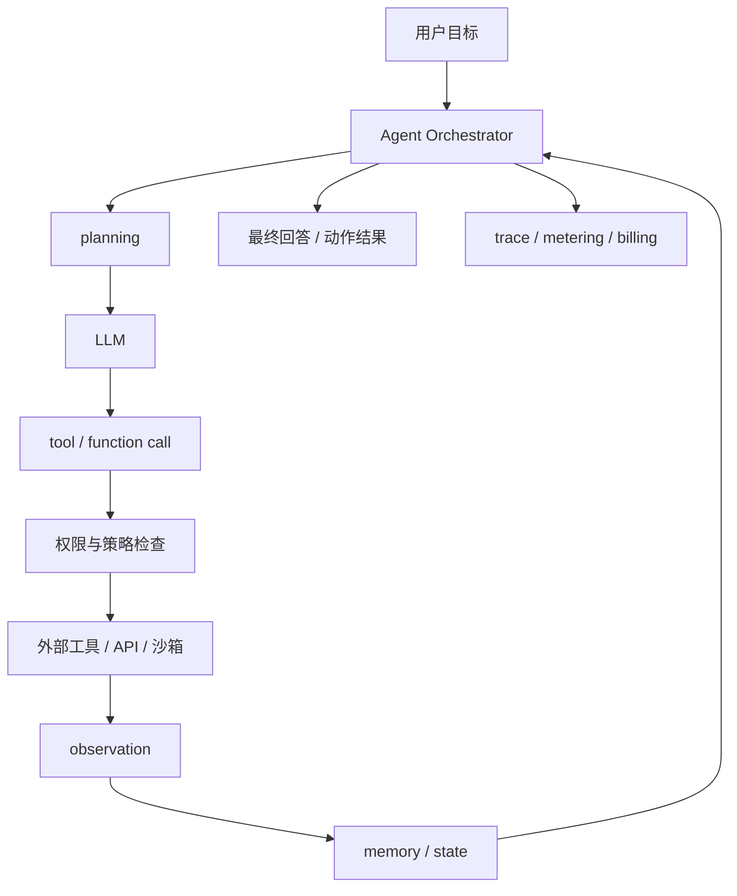
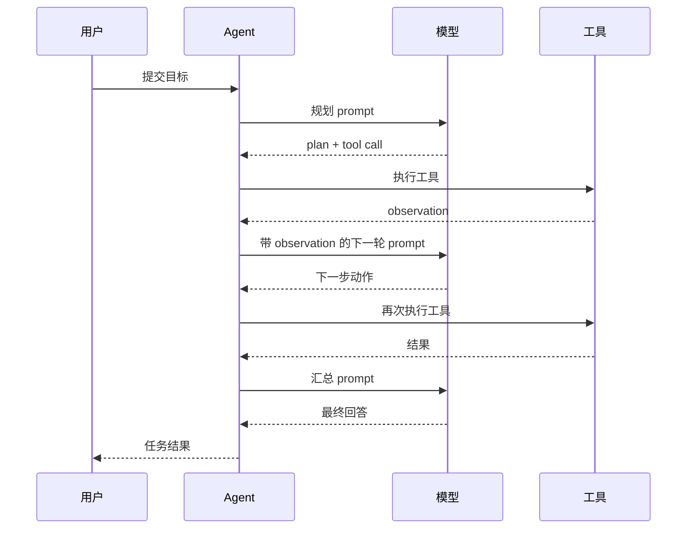

# 第 3 章：Agent 应用

## 本章回答的问题

- Agent 和普通 Chatbot 的工程差异是什么？
- tool calling、function calling、planning、memory 和 reflection 会怎样放大 token、延迟和失败模式？
- Agent 对 AI Gateway、限流、计费、安全和可观测性提出了哪些新要求？

## 一个真实场景

一个代码修复 Agent 看起来只是“多轮调用模型”。上线后平台发现它的成本远高于普通 Chat：一次用户请求会触发规划、代码搜索、文件读取、补丁生成、测试执行、失败反思和二次修复。用户只看到一次会话，平台却看到十几次模型调用、几十次工具调用和大量中间 token。

更麻烦的是，失败不再只有“模型回答错”。工具可能超时，权限可能不足，规划可能陷入循环，测试可能因为环境问题失败，模型可能把工具输出误解为事实。Agent 系统必须把一次用户任务拆解成可追踪、可限制、可计费、可回放的执行轨迹。

## 核心概念

Agent 是围绕目标进行多步推理和行动的 AI 应用。它通常具备模型调用、工具调用、状态管理、计划生成、结果观察和下一步决策能力。普通 Chatbot 主要生成文本，Agent 则会改变外部世界：查文件、调 API、发工单、执行命令、写数据库或触发工作流。

这带来两个工程后果。第一，Agent 的单次用户请求会变成一棵调用树，而不是一次模型调用。第二，Agent 的安全边界必须覆盖模型输出、工具权限、数据访问和执行副作用。

## 系统架构



Agent 平台的核心是 orchestrator。它负责维护状态、调用模型、选择工具、执行策略、处理错误和记录 trace。模型只是其中一个组件，不应让模型直接绕过平台调用工具。

## 3.1 Agent 和 Chatbot 的区别

Chatbot 的主要输出是自然语言回复。Agent 的主要输出是任务结果，文本只是交互界面。一个报销 Agent 的目标不是解释如何报销，而是检查票据、填写表单、提交审批并告诉用户结果。一个运维 Agent 的目标不是描述故障树，而是收集日志、执行诊断、生成建议并可能触发修复流程。

因此 Agent 的质量指标也不同。Chatbot 关注回答准确性、流畅度和延迟；Agent 还要关注任务完成率、工具成功率、循环次数、人工接管率、权限拒绝率和副作用安全性。

## 3.2 tool calling

Tool calling 是模型请求外部工具执行动作的机制。工具可以是搜索、数据库查询、代码执行、工单系统、浏览器、内部 API 或业务工作流。工具定义应包含名称、参数 schema、权限要求、超时、重试策略和返回结构。

工具调用必须经过平台策略层。模型输出的工具参数不能直接执行。平台需要校验参数、检查租户权限、限制危险操作、注入审计信息，并记录输入输出。对于有副作用的工具，例如删除资源、发送邮件、提交审批，应要求显式确认或策略白名单。

## 3.3 function calling

Function calling 通常指模型按结构化 schema 输出函数名和参数。它解决的是“让模型输出机器可解析的调用意图”。工程上，function calling 的难点不在 schema 本身，而在 schema 版本、参数校验、错误恢复和模型输出不完整时的处理。

函数 schema 应保持小而稳定。过大的工具集合会增加模型选择难度，工具描述不清会导致误调用。常见做法是按任务场景动态暴露工具，而不是把所有工具一次性交给模型。

## 3.4 planning

Planning 是 Agent 把目标拆成步骤的能力。简单 Agent 可以隐式规划，即每轮让模型决定下一步；复杂 Agent 会显式生成 plan，并在执行过程中更新。显式 plan 更容易观测和控制，但也可能让系统变慢。

工程上要限制 plan 的深度和循环次数。没有边界的 planning 容易产生 token runaway：模型不断分析、调用工具、反思，却没有产出。平台应设置最大轮次、最大工具调用数、最大 token 预算和超时策略。

## 3.5 memory

Memory 是 Agent 保存状态的机制，可以分为短期 memory 和长期 memory。短期 memory 保存当前任务的上下文、工具输出和中间结果。长期 memory 保存用户偏好、历史事实、项目知识或工作流状态。

Memory 不是越多越好。把所有历史都塞进 prompt 会增加成本并引入过期信息。更稳妥的方式是把 memory 当成可检索状态：写入时结构化，读取时按任务相关性检索，并记录来源和更新时间。

## 3.6 reflection

Reflection 是 Agent 对中间结果进行自我检查或修正的过程。它可以改善复杂任务表现，例如发现工具调用失败、测试失败或答案证据不足。但 reflection 会增加模型调用次数和 token 消耗。

Reflection 应被用于明确的检查点，而不是每一步都自动触发。比如代码 Agent 可以在测试失败后 reflection，RAG Agent 可以在证据不足时 reflection，运维 Agent 可以在高风险动作前 reflection。平台需要记录 reflection 的输入、结论和后续动作。

## 3.7 多轮调用带来的 token 放大

Agent 的 token 消耗通常按调用树增长。一次用户请求可能触发多轮模型调用，每一轮都包含系统指令、任务状态、工具描述、历史观察和新输出。工具返回如果很长，还会进一步放大 context。



平台不能只按“用户请求数”限流 Agent。更合理的口径包括每任务最大 token、每任务最大模型调用数、每任务最大工具调用数、每租户并发任务数和每工具调用速率。

## 3.8 Agent 对网关、限流、计费和可观测性的要求

Agent 需要任务级 trace。一次用户请求下的所有模型调用、工具调用、检索、错误、重试和人工接管都应归属到同一个 trace id。否则账单和排障会断裂。

计费也要从单次模型请求扩展到任务成本。一个 Agent 任务的成本包括模型 input/output token、工具调用、检索、代码执行、沙箱资源和外部 API 成本。平台应区分用户可见调用和内部中间调用，并给产品团队提供成本预算和熔断策略。

## 工程实现

Agent 任务记录可以采用如下结构：

```yaml
agent_run:
  id: run-20260618-001
  tenant: team-a
  goal: "修复 CI 失败"
  status: running
  budgets:
    max_model_calls: 12
    max_tool_calls: 40
    max_total_tokens: 120000
    timeout_seconds: 1800
  steps:
    - type: model_call
      model: example-reasoning-model
      input_tokens: 3200
      output_tokens: 900
    - type: tool_call
      tool: read_file
      status: success
      duration_ms: 120
```

这个结构让平台能在任务未完成时做中断、重试、接管和账单预估。

## 常见故障

- 工具 schema 太多，模型频繁选择错误工具。
- 工具返回未裁剪，导致 context 快速膨胀。
- 没有最大轮次限制，Agent 陷入循环。
- 工具权限和用户权限没有绑定，产生越权风险。
- 中间调用没有 trace，账单和排障无法还原。
- 重试策略不区分模型错误、工具错误和业务拒绝，导致重复副作用。

## 性能指标

- 任务指标：任务完成率、平均步骤数、人工接管率、取消率。
- 模型指标：每任务模型调用数、input/output token、TTFT、TPOT。
- 工具指标：工具调用成功率、超时率、重试率、P95 延迟。
- 安全指标：权限拒绝率、高风险动作确认率、策略拦截率。
- 成本指标：每任务 cost、每成功任务 cost、内部中间调用占比。

## 设计取舍

Agent 平台要在自主性和可控性之间取舍。给模型更多工具和更长上下文，可能提升任务能力，也会增加误调用、成本和安全风险。把流程写死成工作流更稳定，但灵活性下降。实践中常见做法是：高风险领域使用工作流约束，低风险探索性任务允许更开放的 Agent 循环。

## 小结

- Agent 是多步任务执行系统，不是更长的 Chatbot。
- tool calling 必须经过权限、参数校验、审计和超时控制。
- Agent 的 token 和成本按调用树放大，需要任务级预算和 trace。
- 生产级 Agent 平台的核心是 orchestrator、策略层、工具层和可观测性闭环。

## 延伸阅读

- TODO: OpenAI / Anthropic tool calling 官方文档
- TODO: Agent tracing 工程案例
- TODO: 工作流与 Agent 混合架构案例
