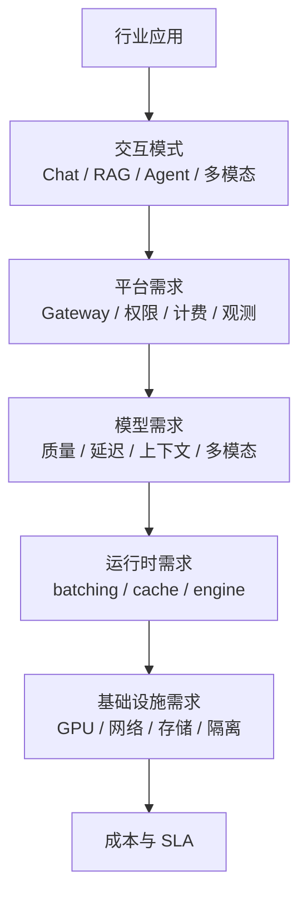

# 第 4 章：行业应用

## 本章回答的问题

- 不同行业 AI 应用为什么会形成不同的 token、延迟、隐私和部署模式？
- 办公 Copilot、代码助手、客服、数据分析 Agent、多模态应用和私有化部署分别怎样影响 AI Factory？
- 如何从应用形态反推模型、平台和基础设施设计？

## 一个真实场景

同一套 MaaS 平台同时服务办公助手、代码助手和智能客服。办公助手请求量不稳定，但上下文经常包含长文档；代码助手要求低延迟和 IDE 内流式补全；客服要求高可用、稳定话术、审计和知识库引用。平台如果只按统一 QPS 和统一模型部署，很快会遇到互相干扰：客服高峰挤占代码补全资源，长文档请求拖慢短请求，私有知识检索和审计日志又增加了平台复杂度。

行业应用的核心问题是：应用不是“模型的外壳”。应用形态决定 token 分布、上下文结构、SLO、安全边界和计费方式。

## 核心概念

行业应用是把通用模型能力嵌入具体业务流程的系统。它通常包括用户界面、权限体系、业务数据、工具/API、RAG、Agent、审计和人工反馈。判断一个行业应用的基础设施需求，不能只看模型大小，还要看任务频率、响应时间、上下文长度、数据敏感度、失败后果和上线节奏。

## 系统架构



这条链路体现了本书的主线：从应用到 GPU 基础设施。行业需求越具体，越需要向下拆解，而不是只问“用哪个模型”。

## 4.1 办公 Copilot

办公 Copilot 常见场景包括邮件总结、会议纪要、文档问答、PPT 生成、表格分析和企业知识检索。它的上下文通常来自办公文档、聊天记录、日程、组织架构和权限系统。工程重点是权限、引用、长上下文和低摩擦体验。

办公场景的请求峰值可能跟工作时间、会议结束时间和协作工具使用习惯相关。它不一定要求极低 TPOT，但很关注 TTFT 和结果可信度。RAG 和文档解析质量通常比模型参数规模更影响体验。

## 4.2 代码助手

代码助手包括代码补全、解释、重构、测试生成、代码审查和修复 Agent。它对延迟非常敏感，尤其是 IDE 内补全。用户在输入代码时，几百毫秒级差异就会影响体验。代码助手还需要理解仓库上下文、语言服务、依赖、构建系统和测试结果。

代码场景有明显的上下文选择问题。把整个仓库塞进 prompt 不现实，系统需要根据当前文件、光标位置、符号引用、最近编辑和检索结果选择上下文。Agent 型代码助手还会执行工具，因此必须有沙箱、权限和回滚机制。

## 4.3 智能客服

智能客服关注稳定、可控、可审计。它通常接入 CRM、工单、知识库、订单系统和用户画像。错误回答可能直接影响客户权益，因此需要更严格的检索引用、话术控制、升级人工和审计记录。

客服系统常见模式是 RAG + 规则 + 人工接管。模型负责理解问题和生成自然语言，知识库提供事实依据，规则系统处理强约束，人工处理高风险或低置信度场景。平台指标应包括自助解决率、转人工率、错误回答率、引用命中率和平均处理时长。

## 4.4 数据分析 Agent

数据分析 Agent 需要把自然语言转成查询、图表、解释和洞察。它会访问数据库、指标平台、BI 系统和 Notebook。核心难点是语义层：用户说“收入”时，系统必须知道对应哪个指标、口径、时间范围和权限。

这类 Agent 的风险在于生成错误 SQL、误读指标或泄露数据。工程上应使用语义层、查询权限、只读账户、SQL 审计、结果采样和执行前解释。对于高风险查询，Agent 应先生成计划和 SQL，让用户确认后执行。

## 4.5 多模态应用

多模态应用处理文本、图像、语音、视频或文档版面。它对存储、预处理、模型路由和成本影响很大。图像和视频输入通常需要专门的编码、抽帧、OCR、视觉模型或多模态模型，延迟和成本结构不同于纯文本。

多模态场景要特别关注数据管线。原始文件、预处理结果、embedding、OCR 文本、缩略图和模型输出都需要可追溯。隐私和版权也更复杂，尤其是医疗影像、金融文件和企业内部截图。

## 4.6 企业私有化部署

企业私有化部署通常出于数据安全、合规、网络隔离或成本控制。它可能部署在企业数据中心、专属云、边缘集群或混合云。私有化不只是“把模型搬进去”，还包括身份集成、审计、密钥、日志、监控、升级、容量规划和故障支持。

私有化场景的挑战是规模差异。一个客户可能只有几张 GPU，另一个客户可能需要完整 AI Factory。产品架构应区分轻量部署、标准部署和大规模部署，避免用同一套复杂控制面压垮小客户，也避免用简化方案支撑不了大客户。

## 4.7 应用形态如何影响模型和基础设施

应用形态可以从五个维度反推基础设施。第一是交互模式：补全、问答、长文档、Agent 和批处理对延迟和吞吐要求不同。第二是上下文：RAG、长对话和代码仓库会增加 input token。第三是安全：工具调用、私有数据和副作用决定权限与审计。第四是稳定性：客服和生产运维比创意写作需要更强可控性。第五是经济性：免费高频应用和付费低频应用的 cost per token 容忍度不同。

## 工程实现

应用接入 AI Factory 前，应填写一份 workload profile：

```yaml
application: code-assistant
interaction: streaming_completion
slo:
  ttft: low
  tpot: low
context:
  average_input_tokens: medium
  max_input_tokens: high
risk:
  data_sensitivity: source_code
  side_effects: possible_via_agent_tools
platform_requirements:
  rate_limit: per_user_and_per_repo
  tracing: task_level
  billing: token_and_tool_cost
```

这份 profile 帮助平台决定模型路由、资源池、限流、观测和账单口径。

## 常见故障

- 用统一模型和统一限流服务所有应用，导致高峰期互相影响。
- 忽略应用上下文长度，低估 prefill 和 KV Cache 压力。
- 行业数据权限没有进入检索和工具调用链路。
- 私有化部署只交付模型，不交付监控、升级和验收流程。
- 多模态应用没有管理原始文件和中间产物，导致审计困难。

## 性能指标

- 办公：文档处理时延、引用准确率、用户采纳率。
- 代码：补全延迟、采纳率、生成代码通过测试比例。
- 客服：自助解决率、转人工率、错误回答率、平均处理时长。
- 数据分析：查询成功率、SQL 拒绝率、指标口径命中率。
- 多模态：预处理耗时、文件处理成功率、单位任务成本。

## 设计取舍

行业应用设计要在通用平台和领域定制之间取舍。通用平台降低重复建设，但行业质量往往依赖数据、权限、工具和流程细节。好的 AI Factory 应提供可复用底座，同时允许应用在 prompt、RAG、工具、安全策略和评测集上做领域定制。

## 小结

- 行业应用决定 token 分布、上下文结构、SLO、安全和计费口径。
- 办公、代码、客服、数据分析和多模态应用对基础设施的压力不同。
- 私有化部署必须包含运维、监控、升级和验收，不只是模型部署。
- 应用接入前应形成 workload profile，用于反推平台和资源设计。

## 延伸阅读

- TODO: 企业 AI 应用架构案例
- TODO: 代码助手系统论文和工程实践
- TODO: 多模态模型服务官方文档
