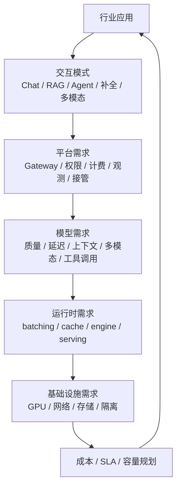
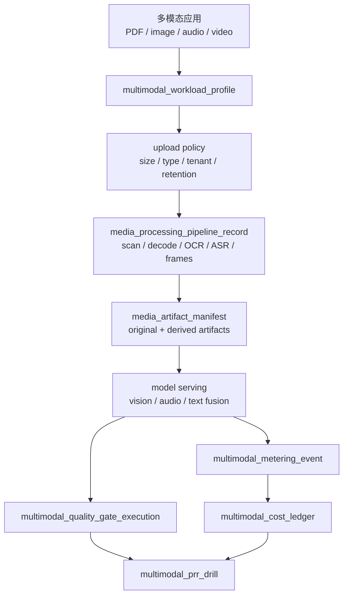
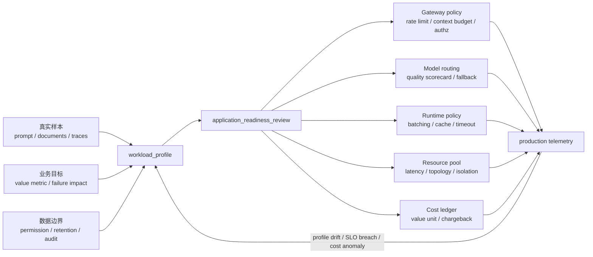

# 第 4 章：行业应用

## 本章回答的问题

- 不同行业 AI 应用为什么会形成不同的 token、延迟、隐私和部署模式？
- 办公 Copilot、代码助手、客服、数据分析 Agent、多模态应用和私有化部署分别怎样影响 AI Factory？
- 如何从应用形态反推模型、平台和基础设施设计？

## 一个真实场景

同一套 MaaS 平台同时服务办公助手、代码助手和智能客服。办公助手请求量随工作时间波动，会议结束后会出现文档总结高峰，上下文经常包含长文档、聊天记录和组织权限；代码助手要求 IDE 内低延迟补全，用户输入几百毫秒后没有响应就会打断思路；客服要求稳定话术、知识库引用、人工接管和审计，错误回答可能影响客户权益。平台最初用同一模型、同一队列和同一限流策略承载三类应用，很快出现互相干扰。

问题不是资源总量不足，而是 workload 画像不同。办公助手的瓶颈可能是文档解析、RAG 和长上下文 prefill；代码助手的瓶颈是首 token、补全吞吐和仓库上下文选择；客服的瓶颈是知识库质量、稳定输出、权限审计和高可用。若平台只按统一 QPS 规划容量，会低估 token 分布和延迟 SLO 差异；若只按统一模型部署，会让低延迟任务被长文档任务拖慢，让高风险任务缺少必要审计。

这个场景说明，行业应用不是模型的外壳。应用形态决定上下文结构、调用频率、输出长度、工具副作用、数据敏感度、失败后果和商业价值。AI Factory 不是先采购 GPU 再让所有应用排队使用，而是要从应用画像反推平台能力、模型选择、运行时策略、资源池隔离、观测指标和成本模型。越靠近真实业务，越不能只问“用哪个大模型”，而要问“这个任务如何安全、稳定、可计量地完成”。

如果不做应用分型，平台会在增长后迅速失控。一个资源池里同时存在短补全、长文档总结、客服高峰和 Agent 长任务，平均延迟看似可接受，关键用户却体验很差；账单里只有总 token，业务线无法判断哪些功能值得继续投入；故障复盘时每个团队都能证明自己组件没坏，却没人能解释端到端价值。行业应用章节的目的，就是把这些差异提前显性化。

## 核心概念

行业应用是把通用模型能力嵌入具体业务流程的系统。它通常包含用户界面、身份权限、业务数据、RAG、Agent、工具/API、审计、人工反馈和运营指标。判断一个行业应用的基础设施需求，不能只看模型参数量或调用次数，还要看任务频率、响应时间、上下文长度、数据敏感度、失败后果、是否有副作用、是否需要引用、是否允许人工接管和是否需要私有化部署。

本章使用 workload profile 描述应用画像。一个完整画像至少包括交互模式、输入来源、上下文分布、输出形态、延迟 SLO、吞吐需求、数据权限、工具副作用、质量评测、计费口径和部署约束。交互模式决定同步还是异步，输入来源决定数据管线，上下文分布决定 prefill 和 KV Cache，工具副作用决定策略层和审计，部署约束决定 GPU IaaS、网络、存储和运维方式。

行业应用还要区分“模型能力”和“业务闭环”。办公 Copilot 不是只会总结文档，还要尊重权限和引用；代码助手不是只会生成代码，还要理解仓库和测试；客服不是只会回答问题，还要知道何时转人工；数据分析 Agent 不是只会写 SQL，还要遵守指标口径和权限；多模态应用不是只会看图，还要处理文件生命周期。业务闭环决定 AI Factory 的真实复杂度。

因此，行业应用的质量不能只用通用 benchmark 衡量。一个模型在通用问答上得分高，不代表它能遵守企业权限；一个模型会写 SQL，不代表它理解公司的指标口径；一个多模态模型能描述图片，不代表它能处理合同扫描件的版面和表格。行业应用需要领域评测集、真实用户反馈、人工质检和线上指标共同判断。模型能力只是起点，业务闭环才是终点。

## 系统架构

从行业应用到基础设施，可以按一条反推链路理解。应用先定义交互模式，例如 Chat、RAG、Agent、补全、批处理或多模态；交互模式决定平台需求，例如 Gateway、权限、计费、观测、任务状态和人工接管；平台需求决定模型需求，例如上下文长度、推理延迟、多模态能力、工具调用能力和稳定输出；模型需求再决定运行时策略，例如 batching、cache、推理引擎、模型副本和 PD 分离；最终落到 GPU、网络、存储、隔离和成本。

这条链路的价值，是避免把所有应用压成同一种服务形态。代码补全可能需要小模型、低延迟资源池和更短上下文；长文档办公助手可能需要强文档解析、RAG 和更长 prefill 容忍度；客服可能需要稳定模型、引用约束、灰度发布和严格 SLO；数据分析 Agent 可能需要工具沙箱、SQL 审计和异步任务；多模态应用可能需要对象存储、预处理队列和多模型路由。架构应允许这些差异存在。

行业应用架构还必须包含反馈闭环。用户采纳率、转人工率、任务完成率、错误回答、引用准确率、成本和延迟，都应回到应用画像和资源策略中。没有反馈，平台只能按静态假设配置模型和资源；有反馈，团队可以判断哪些应用值得使用更强模型，哪些应用需要更严格 RAG，哪些应用应转异步，哪些应用成本高但业务价值也高。

在组织上，这条链路也能减少沟通误差。应用团队用业务指标描述需求，平台团队用 SLO、token 和资源池承接，基础设施团队用 GPU、网络、存储和隔离实现，财务团队用成本和收入判断可持续性。若缺少共同架构，行业应用会把复杂性分散到各团队的口头约定里；若架构明确，差异就能转化为配置、指标和验收。



## 4.1 办公 Copilot

办公 Copilot 常见场景包括邮件总结、会议纪要、文档问答、PPT 生成、表格分析、组织知识检索和写作辅助。它的输入通常来自办公文档、日程、聊天记录、组织架构、权限系统和知识库。工程重点不是单纯生成流畅文字，而是正确处理企业数据权限、文档结构、引用来源、长上下文和用户低摩擦体验。用户希望它像办公工具的一部分，而不是一个需要反复调 prompt 的模型控制台。

办公场景的负载有明显时间规律。会议结束、工作日上午和文档协作高峰会带来请求集中；单次请求 token 分布差异很大，短邮件润色和长文档总结对 prefill、RAG 和存储的压力完全不同。办公 Copilot 不一定要求极低 TPOT，但通常要求可接受的 TTFT、稳定引用和可解释结果。文档解析质量、权限过滤和 context 预算，常常比更换更大模型更影响用户体验。

平台设计上，办公 Copilot 需要与企业身份系统和文档权限集成。RAG 检索必须尊重用户可见范围，引用应指向用户有权限访问的文档，日志与训练数据使用要符合企业策略。对于长文档任务，可以采用异步摘要、分段处理和结果通知；对于短写作任务，应保持低延迟 streaming。基础设施上，应区分短交互和长文档资源池，避免长 prefill 任务拖慢日常办公问答。

办公 Copilot 的验收应围绕“可信办公”而不是“能生成文字”。测试集应包含用户无权访问的文档、过期文档、长表格、会议转写噪声和多文档冲突，检查系统是否正确引用、拒绝越权、说明不确定性。指标上，应同时看采纳率、引用点击率、文档处理成功率、权限拒绝率和长任务完成时长。办公应用一旦被用户认为不可信，后续再提高模型质量也很难恢复使用习惯。

## 4.2 代码助手

代码助手包括代码补全、解释、重构、测试生成、代码审查、漏洞提示和修复 Agent。它的最大特点是延迟敏感和上下文选择困难。IDE 内补全发生在用户输入过程中，几百毫秒级差异就会影响手感；而代码修复和审查又需要理解仓库结构、依赖、构建系统、测试输出和历史变更。代码助手同时包含短请求高频补全和长任务 Agent 两种 workload。

代码上下文不能简单等同于“整个仓库”。把仓库全部塞进 prompt 不现实，也会造成成本和噪声。系统需要根据当前文件、光标位置、符号引用、最近编辑、相关文件、语言服务、检索结果和测试日志选择上下文。对于补全，模型应尽快返回少量候选；对于修复 Agent，系统应允许读取文件、运行测试和生成 patch，但这些工具必须在沙箱中执行，并记录变更与回滚路径。

代码助手对 AI Factory 的影响很具体。低延迟补全可能需要专用小模型、低排队资源池、prefix cache 和靠近用户的服务部署；代码审查和修复 Agent 则需要任务级 trace、工具权限、代码执行沙箱、测试资源和成本预算。安全上，源代码属于高敏感数据，日志、prompt、缓存和训练数据都要严格治理。一个合格代码助手平台，不只是模型会写代码，而是能安全理解、修改和验证代码。

代码助手的验收不能只看生成代码是否像样。补全要看接受率、撤销率、延迟和是否引入语法错误；修复 Agent 要看补丁是否最小、测试是否通过、是否修改无关文件、是否能解释变更；代码审查要看误报率和漏报率。基础设施也要支持高频短请求和低频长任务并存。否则 IDE 补全会被长时间修复任务拖慢，或者 Agent 工具执行会挤占模型服务资源。

## 4.3 智能客服

智能客服关注稳定、可控、可审计和可接管。它通常接入 CRM、工单、知识库、订单系统、用户画像和会话系统。错误回答可能影响用户权益、合规承诺或品牌信任，因此客服场景不能只追求生成能力。系统需要明确哪些问题可自动回答，哪些必须基于知识库引用，哪些需要转人工，哪些必须调用业务系统查询状态，哪些不能由模型回答。

客服系统常见架构是 RAG + 规则 + 人工接管。模型负责理解问题、组织语言和生成回复，知识库提供事实依据，规则系统处理强约束，人工处理高风险、低置信度或情绪复杂场景。工程重点是知识库版本、引用准确率、话术模板、敏感词、安全策略、工单上下文和会话状态。若模型没有证据，系统应允许回答“不确定”或转人工，而不是编造答案。

客服对平台的要求是高可用和强观测。指标不仅包括 TTFT、E2E latency 和错误率，还包括自助解决率、转人工率、首次解决率、引用命中率、错误回答率、投诉率和人工质检结果。推理资源上，客服高峰可能与业务活动、节假日和突发事件相关，需要容量预案和降级策略。成本上，客服通常按会话或问题解决衡量价值，仅看 token 成本不足以判断业务效果。

客服还需要严格的发布治理。知识库更新、prompt 变更、模型升级和规则调整，都可能改变用户权益相关回答。上线前应使用历史会话和质检样本回归，灰度期间按问题类型和渠道观察错误率。高风险问题可以先只提供建议给人工坐席，而不是直接回复用户。客服系统的目标不是最大化自动回复比例，而是在可控风险下提高解决效率。

## 4.4 数据分析 Agent

数据分析 Agent 需要把自然语言转成指标查询、SQL、图表、解释和洞察。它连接数据库、指标平台、BI 系统、Notebook、数据目录和权限系统。核心难点不是让模型“会写 SQL”，而是让模型理解语义层：用户说“收入”“活跃用户”“留存”时，系统必须知道对应指标定义、时间范围、过滤条件、权限和口径版本。否则答案看似专业，实际可能完全错误。

这类 Agent 风险很高。错误 SQL 可能查询巨量数据，拖慢数据库；错误口径可能误导经营决策；越权查询可能泄露敏感数据；模型解释图表时可能把相关性说成因果。工程上应使用语义层、指标目录、只读账户、SQL 审计、查询限额、结果采样和执行前解释。对于高风险查询，Agent 应先生成计划和 SQL，让用户确认后执行；对于大查询，应转异步任务并设置资源预算。

数据分析 Agent 对基础设施的影响不只在 LLM。它需要连接数据仓库、计算引擎、缓存、Notebook 和权限系统，端到端延迟可能由数据查询决定，而不是模型推理决定。平台应记录模型调用、生成 SQL、执行耗时、扫描数据量、结果行数、图表生成和解释 token。计费也应包含数据计算成本，而不只是 LLM token。否则成本归因会严重失真。

验收数据分析 Agent 时，要把“答案是否正确”拆成多层。第一层是指标识别是否正确，第二层是 SQL 或查询计划是否符合权限和性能限制，第三层是查询结果是否与基准系统一致，第四层是图表和解释是否忠实于结果。任何一层出错，都可能生成看似专业但误导决策的输出。数据分析 Agent 应优先服务有明确语义层和可验证数据的场景。

## 4.5 多模态应用

多模态应用处理文本、图像、语音、视频、文档版面、表格或传感器数据。它的复杂度来自输入形态多样和预处理链路长。图像可能需要缩放、OCR、视觉编码；语音需要 ASR、分段和说话人识别；视频需要抽帧、字幕、镜头切分和内容索引；扫描 PDF 需要版面分析、表格抽取和图片识别。LLM 只是链路的一部分。

多模态场景会显著改变存储和成本结构。原始文件、预处理产物、embedding、OCR 文本、缩略图、帧索引、模型输出和审计记录都需要可追溯。大文件上传、对象存储、异步处理队列和结果缓存会成为平台核心能力。与纯文本相比，多模态请求的 token 口径也更复杂，可能包含图像 token、音频时长、视频帧数、OCR 文本 token 和最终输出 token。计费和容量规划必须明确这些单位。

安全和合规也更复杂。医疗影像、金融文件、合同扫描件、企业截图和客户录音都可能包含敏感信息。平台需要处理文件权限、脱敏、保留周期、下载审计和模型训练使用边界。对于高价值场景，多模态模型能力固然重要，但更关键的是文件生命周期、预处理准确率、引用位置和人工复核流程。不能只验证模型“看懂图片”，还要验证系统是否能安全管理图片。

多模态应用的基础设施应天然支持异步和分阶段处理。大文件上传、转码、抽帧、OCR、embedding 和推理可能耗时较长，用户需要任务状态而不是单次 HTTP 等待。失败也要定位到具体阶段：文件损坏、OCR 失败、帧提取失败、模型推理失败或权限拒绝。没有阶段化 trace，多模态故障会被笼统归为“模型没看懂”，实际根因可能在数据管线。

多模态应用必须先建立 `multimodal_workload_profile`。纯文本 Chat 的 workload profile 主要描述 token、上下文、工具和 SLO；多模态 profile 还要描述媒体类型、文件大小、页数、音频时长、视频帧率、同步或异步边界、预处理链路、人工复核、保留策略和计量单位。没有这个对象，平台会把“上传一个 PDF 问问题”“上传一段会议录音生成纪要”“上传视频找违规片段”都看成普通 Chat 请求，最终在文件处理、成本、延迟和安全上全部失真。

```yaml
multimodal_workload_profile:
  id: mwp-claims-document-review-202606
  owner:
    application: insurance-claims-ai
    platform: ai-platform
    data: document-ai-platform
  interaction:
    mode: async_then_streaming_answer
    user_surface: claims_console
    user_wait_boundary: upload_ack_and_task_status
    final_answer: streaming_after_preprocess_ready
  media_inputs:
    - type: scanned_pdf
      expected_pages: policy_defined
      max_file_size: policy_defined
      preprocessing:
        - virus_scan
        - page_render
        - ocr
        - layout_analysis
        - table_extraction
    - type: image
      preprocessing:
        - exif_strip
        - resize_or_tile
        - visual_embedding
  derived_artifacts:
    required:
      - media_artifact_manifest
      - ocr_text
      - page_images
      - layout_blocks
      - citations_to_page_region
    retention: policy_defined_by_data_classification
  quality:
    task_slices:
      - ocr_fidelity
      - table_extraction
      - visual_grounding
      - citation_to_source_region
      - sensitive_information_redaction
    human_review_required_for:
      - claim_denial_recommendation
      - low_ocr_confidence
      - conflicting_document_evidence
  economics:
    value_metric: reviewed_claim_with_cited_evidence
    metering_units:
      - text_tokens
      - document_pages
      - image_tiles
      - ocr_tokens
      - preprocessing_cpu_seconds
      - preprocessing_gpu_seconds
      - artifact_storage_gb_days
  platform_bindings:
    gateway_policy: gwp-claims-doc-v2
    media_pipeline: mpp-claims-doc-v3
    quality_gate: mm-qge-claims-202606
    cost_ledger: mm-cost-claims-202606
```

这个 profile 的关键不是字段多，而是把媒体链路从“前端上传文件”提升为生产契约。`media_inputs` 决定对象存储、上传网关、病毒扫描、解码服务和预处理队列；`derived_artifacts` 决定第 33 章的 `media_artifact_manifest`；`quality.task_slices` 决定第 13 章的多模态门禁；`metering_units` 决定第 41 章的多模态成本账本。若某个业务后续从扫描 PDF 扩展到视频，profile 必须失效并重审，而不是在原有 Chat endpoint 上直接加一个上传按钮。



多模态应用最容易被低估的是失败语义。文本请求失败，通常可以返回错误或重试；媒体请求失败，可能已经上传了原始文件、生成了部分 OCR、写入了 embedding、产生了临时帧、触发了人工复核，还可能已经被下游模型消费。工程上应把每个阶段的幂等键、输出 manifest、清理策略和计量状态定义清楚。否则一次 OCR 失败重试可能重复扣费，视频抽帧失败可能留下孤儿对象，扫描合同的中间图像可能越过保留策略长期留存。

多模态应用还要避免把模型能力和证据能力混淆。模型能够描述图片，不代表系统能证明答案来自哪一页、哪一块表格或哪一段音频；模型能总结视频，不代表平台能按帧回放、定位违规片段、脱敏人脸或删除派生产物。面向企业和行业场景，多模态输出最好默认带 source region、time range、page number、confidence 和 preprocessing lineage。没有这些证据，用户只能相信模型文字，无法把结果用于审计、理赔、医疗、质检或合规流程。

## 4.6 企业私有化部署

企业私有化部署通常出于数据安全、合规、网络隔离、延迟、成本控制或供应链要求。它可能部署在企业数据中心、专属云、边缘集群或混合云。私有化不是把模型镜像搬进去，也不是交付一套离线 API 文档；它包括身份集成、权限、密钥、审计、日志、监控、升级、容量规划、模型更新、故障支持和验收基线。客户买的是可运行系统，而不是一组容器。

私有化的挑战是规模差异和环境差异。一个客户可能只有几张 GPU，只需要轻量 RAG 和小模型服务；另一个客户可能需要完整 AI Factory，包括多租户、作业调度、GPU 资源池、网络存储和 SRE 体系。企业网络、DNS、证书、代理、对象存储、LDAP/OIDC、日志平台和安全策略也各不相同。产品架构应区分轻量部署、标准部署和大规模部署，避免用同一套复杂控制面压垮小客户，也避免简化方案支撑不了大客户。

私有化交付还要有验收和运维模型。上线前要验证 GPU、驱动、CUDA、NCCL、模型加载、推理延迟、RAG 权限、备份恢复、日志审计和升级回滚。上线后要明确谁负责监控、告警、模型更新、漏洞修复和容量扩展。很多私有化失败不是模型效果差，而是后续升级困难、问题无法远程诊断、客户环境不可复现。AI Factory 的私有化能力，本质上是产品化运维能力。

私有化还会改变商业和技术取舍。公有平台可以集中优化 GPU 利用率，私有化环境往往资源较小、峰谷明显、升级窗口受限。为了降低交付复杂度，产品应尽量使用可观测、可备份、可升级的标准组件，并提供离线包、版本矩阵和诊断工具。客户不一定有 AI Infra 团队，因此运维文档和自动化检查本身就是产品能力。

## 4.7 应用形态如何影响模型和基础设施

应用形态可以从六个维度反推基础设施。第一是交互模式：补全、问答、长文档、Agent、批处理和多模态对同步/异步、streaming、队列和资源池要求不同。第二是上下文结构：RAG、长对话、代码仓库和多模态文件会增加 input token、预处理和 KV Cache 压力。第三是输出形态：短补全、长报告、结构化 JSON、图表和工具动作需要不同验证和计费方式。

第四是安全边界。只读问答、业务查询、写操作、代码执行和审批提交的风险完全不同，决定是否需要工具策略、人工确认、沙箱和审计。第五是可靠性目标。客服、生产运维和经营分析比创意写作需要更强 SLO、回滚和人工接管。第六是经济性。免费高频补全、付费低频分析、高价值客服会话和内部办公提效，对 cost per token 和每成功任务成本的容忍度不同。

反推的结果应落到平台配置，而不是停留在文档。不同应用应有不同模型路由、限流策略、队列、资源池、context budget、trace 字段、计费口径和评测集。AI Factory 的成熟度，体现在它能让应用画像转化为可执行策略：哪些请求走低延迟池，哪些走长上下文池，哪些必须引用证据，哪些需要人工确认，哪些可以批处理，哪些需要私有部署。

这个过程也能帮助团队判断是否应该接入某个应用。若应用没有清晰成功标准、没有数据权限边界、无法提供评测样本，也无法接受成本约束，直接上线只会把风险转嫁给平台。AI Factory 应允许试验，但试验也要有隔离、预算和退出标准。应用形态反推基础设施，不只是优化资源，也是筛选成熟需求。

## 工程实现

应用接入 AI Factory 前，应填写 workload profile。它不是流程表格，而是平台配置和容量规划的输入。Profile 至少要回答：用户是谁，任务是什么，输入来自哪里，平均和峰值 token 如何，是否需要 RAG 或 Agent，是否有工具副作用，延迟 SLO 是什么，数据敏感度如何，失败后果是什么，如何计费，是否需要私有化或专属资源池。缺少这些信息，平台只能用默认策略接入，后续问题会变成紧急救火。

接入流程可以分三步。第一步是应用画像评审，确认 workload、风险和成功指标。第二步是灰度接入，给应用配置模型、路由、限流、观测、计费和评测集，并用真实样本验证 token、延迟和质量。第三步是运行复盘，按周或按版本检查成本、SLO、错误、用户反馈和资源利用率，并调整模型或平台策略。行业应用不是一次性上线，而是持续运营。

工程实现应把 profile 绑定到配置系统。应用画像确定后，应生成或更新网关策略、模型路由、资源池、限流、trace 字段、账单标签和告警规则。这样应用变更不会停留在文档中，而会影响真实运行。每次重大版本发布，也应重新审查 profile：功能增加了工具调用、上下文变长或转为多模态，都可能要求新的资源和安全策略。

平台还应保留 profile 的历史版本。应用上线前、灰度中和规模化后，画像可能发生变化，例如从单轮 Chat 演进到 Agent，或从文本输入扩展到多模态文件。版本化 profile 可以解释策略为何变化，也能在事故复盘时对比“当初假设”和“真实流量”。这能把应用治理从口头协调变成可审计工程流程。

下面的 YAML 是 workload profile 示例。字段值不追求精确数值，但必须能让平台团队做资源和风险判断。

```yaml
application: code-assistant
interaction: streaming_completion
slo:
  ttft: low
  tpot: low
context:
  average_input_tokens: medium
  max_input_tokens: high
risk:
  data_sensitivity: source_code
  side_effects: possible_via_agent_tools
platform_requirements:
  rate_limit: per_user_and_per_repo
  tracing: task_level
  billing: token_and_tool_cost
  resource_pool: low_latency
```

生产环境中的 `workload_profile` 应被当作一等对象，而不是接入表单。它需要有 owner、版本、证据来源、审批状态和失效条件。一个 profile 只有在绑定了真实样本、流量假设、权限边界、评测集和成本口径后，才足以驱动模型路由和资源池配置。若 profile 只是业务方口头描述，平台会把不确定性转嫁到默认策略中，最终在延迟、账单或安全事故中暴露。

更完整的对象可以写成如下结构：

```yaml
workload_profile:
  id: wp-code-assistant-ide-completion-v3
  owner:
    business: developer-product
    platform: ai-platform
    sre: ai-sre
  lifecycle:
    state: production
    version: 3
    effective_from: "2026-06-01"
    review_cycle: monthly
    invalidation_triggers:
      - new_agent_write_tool
      - context_window_expansion
      - model_family_change
      - p95_input_tokens_exceeds_profile
  interaction:
    mode: streaming_completion
    user_surface: ide
    sync_boundary: first_token_required
    cancellation_expected: true
  traffic:
    peak_pattern: workday_diurnal
    burst_source:
      - repository_index_refresh
      - release_week
    representative_samples:
      source: production_shadow_logs
      retention: redacted_30d
  context:
    sources:
      - current_file
      - related_symbols
      - recent_edits
      - retrieval_snippets
    budget_policy:
      hard_cap: configured_by_gateway
      truncation_order:
        - low_score_retrieval
        - old_chat_turns
        - non_imported_files
  risk:
    data_classification: source_code
    tool_side_effect: none_for_completion
    audit_required: true
  slo:
    ttft_class: interactive
    availability_class: production_internal
    degradation_policy: fallback_to_short_context_model
  economics:
    value_metric: accepted_completion
    cost_metric: cost_per_accepted_completion
    chargeback: project_cost_center
  platform_bindings:
    gateway_policy: gwp-code-assistant-v3
    routing_scorecard: route-code-low-latency-v2
    eval_manifest: eval-code-completion-v5
    resource_pool: gpu-inference-low-latency
    telemetry_schema: trace-ai-code-v2
```

这个对象把应用、平台、模型、资源和经济性连接起来。`invalidation_triggers` 很关键，因为行业应用会演进：代码助手增加写文件工具后，风险边界从只读补全变成可修改仓库；办公 Copilot 增加长文档批处理后，资源池从低延迟交互变成混合同步/异步；客服增加自动退款工具后，必须引入人工确认和审计。profile 一旦失效，平台应要求重新评审，而不是继续使用旧限流和旧评测。

`workload_profile` 到生产策略的链路可以画成下面的控制流。它的核心思想是：应用画像先进入评审和证据层，再生成平台策略；运行数据反过来更新画像。不要让业务需求直接改模型路由或资源池。



应用进入生产前应通过 `application_readiness_review`。它不是一次会议纪要，而是上线门禁记录。门禁至少检查八类证据：真实样本是否覆盖主路径和长尾，评测集是否覆盖业务失败，权限和数据保留是否清楚，模型路由和 fallback 是否可回滚，观测字段是否能串起 request、tenant、model、tool 和 cost，人工接管是否存在，成本是否有预算，退出条件是否可执行。

```yaml
application_readiness_review:
  id: arr-customer-service-rag-2026-06
  workload_profile: wp-customer-service-rag-v4
  decision: conditional_approve
  scope:
    users: vip_customer_service_team
    channels:
      - web_chat
      - agent_console_assist
    excluded:
      - automatic_refund
      - legal_dispute_response
  evidence:
    eval_manifest: eval-cs-rag-v7
    red_team_report: safety-cs-v2
    permission_test: rag-acl-regression-v4
    cost_simulation: cost-cs-peak-week-v3
    rollback_plan: rb-cs-rag-v4
  required_controls:
    - cite_knowledge_article
    - confidence_threshold_for_auto_answer
    - human_handoff_on_low_confidence
    - deny_when_acl_ambiguous
    - append_only_metering
  guardrail_metrics:
    - wrong_answer_rate
    - unsupported_claim_rate
    - handoff_rate
    - acl_denied_retrieval
    - cost_per_resolved_session
  stop_conditions:
    - high_risk_wrong_answer_incident
    - cost_per_resolved_session_exceeds_budget
    - permission_regression_detected
```

当应用准备进入商业客户、内部关键业务或私有化交付时，`application_readiness_review` 还应生成 `customer_onboarding_evidence` 的输入。前者回答“这个应用能不能进入生产”，后者回答“这个客户或租户是否已经具备被承诺服务的条件”。两者不能混用：应用准备好了，不代表客户的租户、密钥、合同边界、预算、支持入口和数据授权都准备好了；客户合同签了，也不代表应用已通过权限、质量、成本和回滚门禁。

```yaml
customer_onboarding_evidence:
  onboarding_id: coe-enterprise-a-support-rag-202606
  source_application_readiness_review: arr-customer-service-rag-2026-06
  tenant_scope:
    tenant_id: enterprise-a
    projects: [support-rag-prod]
    environments: [production]
    customer_owner: enterprise-a-ai-owner
    platform_owner: ai-platform-customer-success
  contractual_boundary:
    business_model_profile: bmp-enterprise-maas-standard-v2
    service_boundary: hosted_rag_model_api
    excluded_responsibilities:
      - customer_knowledge_base_correctness
      - customer_network_failure
      - unapproved_prompt_or_tool_change
  platform_readiness:
    tenant_boundary: pass
    api_key_lifecycle: issued_and_rotation_policy_defined
    quota_and_budget: configured
    model_access: approved
    data_boundary_policy: approved
    billing_account: mapped
    support_channel: active
  launch_controls:
    initial_traffic: limited_canary
    guardrail_metrics:
      - wrong_answer_rate
      - acl_denied_retrieval
      - ttft_p99
      - cost_per_resolved_session
    stop_conditions:
      - application_readiness_review_invalidated
      - customer_budget_exceeded_without_approval
      - unresolved_security_or_quality_incident
```

这个对象的价值在于把客户上线从“开通一个 key”提升为“交付一组可被证明的生产承诺”。例如客服 RAG 应用已经通过权限回归，但客户尚未确认知识库 owner 和数据保留策略，就不能承诺生产 SLA；代码助手已经通过补全延迟门禁，但客户没有配置成本中心和预算，就不能进入商业计费；Agent 应用已经完成工具策略，但客户没有指定人工审批责任人，就不能开放写操作。客户接入证据把这些缺口提前暴露，避免上线后在 SLA、账单或事故中争论责任。

行业应用还应有接入矩阵。矩阵用于快速判断某类应用是否已经具备生产条件，而不是把所有应用都塞进同一个审批流程。

| 应用类型 | 必备画像字段 | 必备门禁 | 关键资源策略 | 失败时优先动作 |
| --- | --- | --- | --- | --- |
| 办公 Copilot | 文档来源、ACL、长上下文分布、引用策略 | 权限回归、引用准确率、数据保留 | 长上下文池与异步文档队列分离 | 降级到短上下文问答或只返回引用摘要 |
| 代码助手 | 仓库敏感级别、IDE 延迟、上下文选择、工具权限 | 代码执行沙箱、补全采纳率、最小补丁检查 | 低延迟推理池与 Agent 工具池分离 | 禁用写操作工具，保留只读解释和补全 |
| 智能客服 | 问题类型、知识库版本、人工接管、权益风险 | 质检样本、转人工策略、话术和合规审计 | 生产高可用池，RAG 索引独立准入 | 转人工，冻结高风险自动回复 |
| 数据分析 Agent | 指标语义层、SQL 权限、扫描预算、确认流程 | SQL 审计、只读账户、结果一致性回归 | LLM 与数据计算成本分账 | 停止执行 SQL，只返回查询计划 |
| 多模态应用 | 文件类型、预处理链路、对象存储、保留期 | 文件权限、OCR/ASR 回归、人工复核 | 异步预处理队列和对象存储容量隔离 | 保留上传和任务状态，停止自动决策 |
| 私有化部署 | 客户环境、离线包、版本矩阵、运维责任 | 安装验收、升级回滚、诊断包 | 客户级资源池和现场可观测性 | 回滚到前一离线版本，导出脱敏诊断包 |

## 常见故障

第一类故障是用统一模型和统一限流服务所有应用。短补全、长文档、客服和 Agent 被放进同一队列，导致高峰期互相影响。第二类故障是忽略上下文长度，只按请求数规划容量，结果 prefill、KV Cache 和 RAG 前置链路成为瓶颈。第三类故障是权限没有进入检索和工具链路，行业数据在 prompt、日志、缓存或工具输出中泄露。

第四类故障是只交付模型，不交付业务闭环。办公应用没有引用和权限，代码助手没有沙箱和测试，客服没有人工接管，数据分析没有指标口径，多模态应用没有文件生命周期，私有化部署没有监控和升级。模型能回答一两个问题，不代表应用能长期运行。第五类故障是成本口径错误，把所有成本归到 LLM token，忽略 RAG、工具、数据查询、预处理、存储和人工接管。

故障复盘时应回到 workload profile。若延迟差，先看应用是否被放入正确资源池；若成本高，先看 token 和工具调用是否符合画像；若质量差，先看评测集和业务数据是否覆盖真实问题；若安全风险高，先看权限和审计是否进入链路。行业应用的问题往往不是某个组件坏了，而是画像、策略和实际流量不匹配。

还有一类常见故障是灰度缺失。行业应用直接全量上线，真实用户问题、长尾文档、峰值流量和权限组合一次性暴露，平台只能被动救火。更稳妥的做法是按用户、部门、渠道、问题类型或文档域逐步放量，并在每个阶段检查质量、成本和安全指标。行业应用越接近核心业务，越需要灰度和回滚。

## 性能指标

行业应用指标应同时包含通用指标和领域指标。通用指标包括 TTFT、TPOT、E2E latency、input/output token、错误率、限流率、成本、GPU 利用率和队列等待。领域指标则按应用定义：办公看文档处理时延、引用准确率、用户采纳率和权限拒绝；代码看补全延迟、采纳率、测试通过率和回滚率；客服看自助解决率、转人工率、错误回答率和平均处理时长。

数据分析 Agent 应看查询成功率、SQL 拒绝率、指标口径命中率、扫描数据量、查询耗时和解释准确性。多模态应用应看文件处理成功率、预处理耗时、OCR/ASR 质量、单位任务成本和人工复核率。私有化部署应看安装成功率、升级成功率、节点健康、模型服务可用性、告警响应和客户环境差异。只有领域指标，才能判断 AI 是否真的改善业务。

指标还要能支撑资源决策。若某应用高频低价值，应优化模型和成本；若某应用低频高价值，应优先质量和审计；若某应用延迟敏感，应使用低延迟资源池；若某应用长上下文明显，应限制共享队列影响。行业指标不是业务团队自己的报表，而是 AI Factory 容量、路由、成本和可靠性策略的输入。

指标体系还应关注“单位成功结果”。对于办公，可以看每次被采纳摘要成本；对于代码，可以看每个通过测试补丁成本；对于客服，可以看每个自助解决会话成本；对于数据分析，可以看每个被用户确认的查询成本。这样能避免只优化 token 单价而忽视业务结果。AI Factory 的经济性最终要落到有效产出，而不是原始调用量。

指标门槛应在灰度前定义。

## 设计取舍

行业应用设计要在通用平台和领域定制之间取舍。通用平台降低重复建设，统一 API、网关、计量、模型服务和观测；领域定制提升质量、安全和用户体验，例如专属 prompt、RAG、工具、评测集、资源池和权限策略。平台过度通用，会让行业应用只能适配最低公共能力；平台过度定制，又会造成维护成本和碎片化。好的 AI Factory 应提供统一底座和可配置差异。

第二个取舍是同步体验与异步可靠性。用户喜欢即时反馈，但长文档、多模态、数据分析和 Agent 任务常常需要更长处理时间。同步执行容易超时，也难以处理人工确认和重试；异步执行更可靠，但需要任务状态、通知和结果管理。设计时应按任务时长和风险选择模式：短补全走同步，长报告和数据查询走异步，重要动作需要确认。

第三个取舍是集中平台与私有隔离。集中平台便于运营、模型升级和成本优化；私有部署或专属资源池能满足数据隔离、合规和确定性 SLO。不同阶段选择不同：早期试点可用集中平台快速验证，核心业务和敏感数据可能需要专属部署。取舍的关键不是绝对选哪边，而是让应用画像、风险和成本透明，避免用默认架构承载所有行业需求。

还要在“快速试错”和“生产治理”之间取舍。早期应用需要低门槛实验，否则无法发现真实场景；生产应用需要评测、权限、SLO、成本和支持，否则规模化后不可控。平台可以提供沙箱、试验配额和默认小模型支持探索，同时要求进入生产前完成 workload profile、评测集和灰度计划。速度和治理不应互相否定，而应对应不同阶段。

## 小结

- 行业应用决定 token 分布、上下文结构、SLO、安全和计费口径。
- 办公、代码、客服、数据分析和多模态应用对基础设施的压力不同。
- 私有化部署必须包含运维、监控、升级和验收，不只是模型部署。
- 应用接入前应形成 workload profile，用于反推平台和资源设计。

## 延伸阅读

- [Microsoft Azure Architecture Center: Build generative AI applications](https://learn.microsoft.com/en-us/azure/architecture/ai-ml/)
- [GitHub Copilot documentation](https://docs.github.com/en/copilot)
- [OpenAI Vision guide](https://platform.openai.com/docs/guides/vision)
