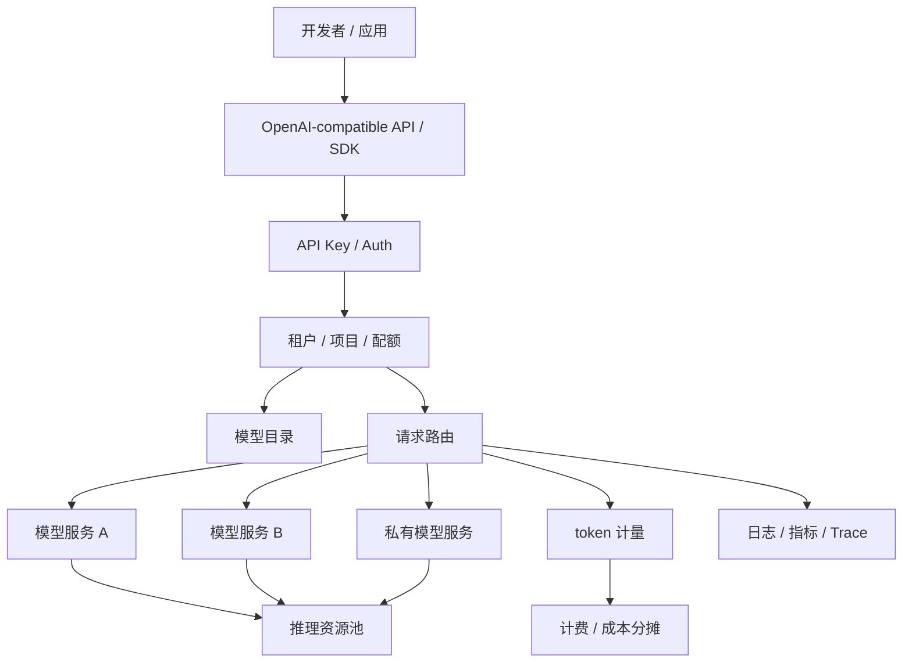

# 第 5 章：MaaS 平台

## 本章回答的问题

- MaaS 为什么是 Platform 层能力，而不是模型服务本身？
- OpenAI-compatible API、模型目录、API Key、租户、配额、路由和 SLA 如何组成一个可运营平台？
- MaaS 平台如何把应用需求连接到模型、推理服务、计量计费和基础设施？

## 一个真实场景

一个公司内部同时有多个团队接入大模型。客服团队需要稳定问答和知识库引用，研发团队需要代码助手，数据团队需要批量分析，业务团队希望试用不同模型。最初每个团队直接调用模型服务：有的调用自研模型 endpoint，有的调用第三方 API，有的绕过平台访问测试模型。几周后问题集中爆发：API Key 分散在脚本和仓库里，模型版本没有统一命名，限流口径不一致，账单无法分摊，故障时不知道哪些租户受影响，模型下线也没有迁移计划。

这些问题不是模型服务本身能解决的。模型服务负责把请求变成 token，但 MaaS 平台要回答“谁可以调用、调用哪个模型、使用多少、是否超额、成本归谁、是否满足服务等级、出现故障如何隔离”。没有 MaaS，模型能力会变成一组散落的 endpoint；有 MaaS，模型能力才被包装成可治理、可运营、可计量的产品。MaaS 的价值不在于多了一层入口，而在于把模型消费纳入平台控制面。

从 AI Factory 视角看，MaaS 是应用和模型服务之间的契约层。它向上给开发者稳定 API、SDK、模型目录和账单；向下连接模型服务、推理资源池、评测、路由、计量和 GPU 基础设施。它既不是 GPU IaaS，也不是单个推理引擎。它承担的是 Platform 层职责：让多租户、多模型、多应用在同一套生产规则下使用模型能力。

如果没有这层契约，平台会在规模化时同时失去安全、成本和质量控制。应用为了绕过限流会直接保存后端地址，模型团队无法安全下线旧版本，SRE 无法按租户隔离故障，财务只能按 GPU 总账粗略分摊。MaaS 的存在，是为了让模型能力像云服务一样被申请、使用、度量、支持和退出，而不是靠群消息和临时 endpoint 维持。

## 核心概念

MaaS 即 Model as a Service，把模型能力以服务方式交付给应用、开发者和业务团队。它通常包括控制台、API、SDK、模型目录、API Key、租户、项目、配额、限流、路由、计量、计费、SLA、可观测性和支持流程。一个成熟 MaaS 平台的核心不是“能调用模型”，而是“能稳定、可控、可计量、可演进地交付模型能力”。调用只是入口，治理才是平台。

MaaS 属于 Platform 层，而不是 GPU IaaS 或资源编排层。GPU IaaS 交付裸金属、虚拟化、驱动、网络、存储和资源池；资源编排层处理 Kubernetes、Slurm、队列、配额和 GPU 调度；MaaS 则把这些底层能力抽象为模型 API、模型目录、租户配额和服务等级。MaaS 需要理解 token、模型版本、能力差异和账单，但不应该直接管理 BMC、PXE 或物理网络。

MaaS 的关键对象包括 `model`、`endpoint`、`tenant`、`project`、`api_key`、`quota`、`route`、`usage` 和 `service_level`。这些对象必须可追踪、可审计、可配置。比如一个请求进入平台后，应能关联到租户、项目、API Key、模型、路由目标、token 用量、SLA 和成本中心。没有这些对象，MaaS 只是反向代理；有了这些对象，平台才能运营模型能力。

这些对象还要形成一致生命周期。模型从 preview 到 available 再到 deprecated，API Key 从创建到轮换再到禁用，配额从默认到审批提升，路由从灰度到全量，账单从实时用量到月度结算，都应有状态和审计。MaaS 的复杂度不在单次请求，而在这些对象长期演进时仍能保持一致。对象模型越清楚，平台越容易自动化。

对象模型也是跨团队接口。

它决定应用、平台、模型、SRE 和财务是否在讨论同一件事。

这也是平台自动化的基础。

没有共同对象，就没有共同责任。

## 系统架构

MaaS 平台位于应用和模型服务之间。应用通过 OpenAI-compatible API、SDK 或控制台提交请求，平台先完成认证、租户识别、配额检查和模型能力校验，再根据模型目录、路由策略、SLA、健康状态和成本策略选择后端 endpoint。响应过程中，平台记录 token、延迟、错误、streaming 状态和账单事件。控制面负责管理模型目录、租户、配额、密钥、服务等级和路由策略；数据面负责处理实际请求。

这套架构的重点是把开发者体验和平台治理放在同一条链路。开发者希望一个稳定 API 能访问多个模型，平台团队希望知道每个请求的身份、用量、成本和风险。模型团队希望灰度新版本不破坏业务，SRE 希望故障能按租户和模型隔离，财务希望成本能分摊到业务线。MaaS 架构要让这些诉求都能落到对象和指标中。

MaaS 不应把所有逻辑都堆在网关里。模型目录、租户、配额、账单和评测属于控制面；请求鉴权、限流和路由属于数据面入口；推理队列、batching、KV Cache 和模型实例健康属于模型服务和运行时。边界清楚，平台才能演进：可以替换推理引擎，可以增加模型供应商，可以调整计费口径，而不需要应用重写。

架构验收时，应检查控制面配置是否真的影响数据面行为。模型目录标记某模型 deprecated 后，调用是否告警或拒绝；租户配额调整后，网关是否立即生效；服务等级变更后，路由是否进入正确资源池；账单价格变更后，usage 是否按版本生效。若控制面只是管理页面，数据面仍靠手工配置，MaaS 很快会出现目录、路由和账单不一致。



## 5.1 MaaS 是什么

MaaS 是模型能力的服务化交付层。对应用团队来说，它提供统一 API、SDK、模型目录、密钥和文档，让应用不必直接理解每个推理服务的部署细节。对平台团队来说，它提供租户、配额、路由、计量、计费、SLA 和可观测性，让模型消费可治理。对模型团队来说，它提供发布、灰度、下线和评测入口，让模型从实验能力变成可运营产品。三种视角合在一起，才构成 MaaS。

MaaS 的成熟度可以分阶段理解。第一阶段是统一 API，解决接入分散问题；第二阶段是统一模型目录和权限，解决“谁能用哪个模型”的治理问题；第三阶段是计量计费和 SLA，解决运营和成本问题；第四阶段是多模型路由、灰度、fallback、成本优化和质量反馈，解决规模化问题。很多平台卡在第一阶段，以为 API 统一就是 MaaS，实际还缺少运营能力。

判断 MaaS 是否成熟，可以看它能否回答几个问题：某个租户昨天用了多少 input/output token？某个模型版本影响哪些应用？某个 API Key 泄露后能否快速禁用并追溯调用？某个模型下线前有哪些项目需要迁移？高峰期哪些租户触发限流？若这些问题没有明确答案，平台还只是模型入口，不是 MaaS。MaaS 的本质，是把模型服务从技术资源变成可管理产品。

因此 MaaS 团队的职责也不同于单纯模型服务团队。它要维护开发者体验、服务等级、成本透明度、问题支持和变更通知。模型服务团队优化的是 token 生成效率，MaaS 团队优化的是模型能力消费体验。两者必须协作，但不能混为一谈。若 MaaS 只关注接口转发，平台会缺少产品运营；若 MaaS 试图直接管理所有底层资源，又会越过资源编排和 IaaS 边界。

## 5.2 OpenAI-compatible API

OpenAI-compatible API 已经成为许多模型平台的事实接口风格。它降低应用接入和迁移成本，让开发者可以用相似的 chat completions、embeddings、models、streaming 和 tool calling 结构访问不同后端。对于企业 MaaS，这种兼容性非常有价值：应用可以先接入统一接口，再逐步在平台内部切换自研模型、开源模型、第三方 API 或租户私有模型。

但兼容 API 不等于兼容行为。不同模型的 tokenizer、上下文模板、tool calling 格式、JSON 输出稳定性、streaming chunk、错误码、最大上下文、参数支持和安全策略都可能不同。一个应用在模型 A 上能正常解析工具调用，切到模型 B 后可能字段顺序、函数名选择或结束原因不同。MaaS 平台必须明确兼容范围：哪些字段完全支持，哪些字段按模型能力支持，哪些字段会被忽略或拒绝。

工程上，OpenAI-compatible API 应与 capability metadata 配合使用。应用可以使用统一接口，但在调用前应能查询模型是否支持 streaming、tool calling、JSON mode、vision、embedding、最大上下文和服务等级。平台也应在网关层做能力校验，而不是把不支持的参数透传到底层失败。统一 API 解决入口一致性，能力元数据解决行为差异可见性，两者缺一不可。

兼容性还需要回归测试。平台每次升级模型、tokenizer、网关适配器或第三方 provider，都应使用固定请求集验证 streaming 格式、错误码、tool calling、token 计量和 finish reason。否则应用可能在没有编译错误的情况下产生运行时行为变化。API 兼容的真正标准，不是字段名相同，而是应用依赖的语义可预测、可测试、可迁移。

兼容边界应写入模型目录和发布说明。

否则兼容性只能靠用户踩坑发现。

## 5.3 模型目录

模型目录是 MaaS 的产品入口和控制面对象。它应描述模型名称、版本、能力、上下文长度、支持的输入输出类型、适用场景、价格、SLA、状态、访问权限、评测结果和迁移建议。模型目录不是网页上的静态列表，而是连接模型评测、发布、灰度、下线、路由和计费的系统。应用选择模型时，依赖的就是目录中的能力承诺。

目录应区分公开模型、租户私有模型、实验模型和即将废弃模型。公开模型面向广泛应用，私有模型只对特定租户可见，实验模型可能只允许白名单调用，废弃模型需要迁移窗口和替代建议。模型状态应至少包含 available、preview、deprecated、maintenance、unavailable 等。状态变化应进入通知和审计，不能让应用在没有预警的情况下调用失败。

模型目录还应与评测和成本数据连接。一个模型是否适合客服、代码、长文档或 Agent，不应只由名称判断，而应由领域评测、延迟、上下文能力、工具调用稳定性和 cost per token 共同决定。目录中展示“能力边界”比展示宣传语更重要。好的模型目录帮助应用做工程选择：什么时候用大模型，什么时候用小模型，什么时候需要专属资源池或更高 SLA。

模型目录也是变更管理入口。模型升级、prompt 模板变化、推理引擎切换、价格调整和服务等级变化，都应在目录中留下版本和通知。应用可以订阅模型状态，提前处理 deprecated 和 maintenance。没有目录治理，模型平台常见的失败是“模型还在，但行为变了”；有目录治理，变化至少能被发现、灰度和回滚。

目录越准确，应用迁移成本越低。

## 5.4 API Key

API Key 是应用访问 MaaS 的身份凭证。它应该绑定租户、项目、环境、权限、配额和审计信息，而不是只是一串静态字符串。生产平台应支持 key 创建、命名、作用域、过期、轮换、禁用、泄露检测和调用审计。一个 key 应该能回答：属于哪个租户，服务哪个项目，可以调用哪些模型，有什么配额，最近从哪里调用，是否出现异常模式。

API Key 的风险在于传播简单。它可能被写入代码仓库、CI 日志、浏览器、移动端、Notebook 或第三方工具。一旦泄露，攻击者可以消耗大量 token，访问不该访问的模型，甚至触发工具调用。MaaS 平台应提供最小权限 key、按环境区分 key、来源限制、异常调用告警和快速吊销机制。对高安全场景，可以结合 OAuth、短期 token、服务账户或 mTLS。

密钥治理还要服务成本归因。若多个应用共享一个 key，账单只能归到粗粒度租户，无法定位成本异常；若个人 key 被生产服务长期使用，人员离职或权限变化会带来风险。实践中应要求生产应用使用项目级或服务账户 key，开发调试使用个人或短期 key，并通过标签把 key 与成本中心、负责人和应用画像绑定。API Key 是安全对象，也是运营对象。

平台还应主动发现异常 key 行为。例如一个测试 key 突然在生产区域高频调用，某个 key 从异常 IP 访问，或一个长期不用的 key 在深夜消耗大量 token，都应触发告警。密钥轮换也要有平滑机制，允许新旧 key 短期并存并观察调用切换。没有这些能力，API Key 泄露会直接变成成本事故和数据风险。

密钥策略应默认最小权限。

## 5.5 租户、项目、配额

租户是资源、权限和账单的组织边界，项目是租户内部的应用或工作空间边界，配额是对模型能力消费的限制。一个企业租户可以包含多个项目，例如客服、办公、研发和数据分析；每个项目有不同模型权限、预算、SLA 和负责人。这个层次能让平台既支持组织级治理，又支持应用级成本归因。没有项目边界，MaaS 很快会变成“租户总账”，无法运营。

配额设计不能只看请求数。LLM 请求的资源压力更接近 token、上下文长度、输出长度、并发和模型成本。一个租户每分钟 100 次短问答，与每分钟 100 次长文档总结，对 prefill、KV Cache、GPU 和账单的影响完全不同。MaaS 应支持 request quota、input token quota、output token quota、TPM、并发请求、streaming 连接、日预算、模型级配额和资源池级配额。

配额还要定义用户体验。超过配额时，是硬拒绝、排队、降级到小模型，还是提示申请扩容；不同租户和服务等级可以不同。配额消耗应接近实时可见，避免用户到月底才发现成本失控。对 Agent 和批量任务，还要支持任务级预算，防止一次用户操作展开成大量内部调用。配额不是简单限制，而是平台和用户之间的资源契约。

配额策略应与容量规划相互反馈。若某个租户长期触发 TPM 限制，可能需要提高预算、迁移到专属资源池或优化应用 prompt；若大量项目只使用很少配额，平台可以回收保留容量。配额数据也是销售、财务和基础设施团队的共同语言。它既保护平台不被单个租户拖垮，也帮助业务判断是否值得扩容。

配额调整应有审批和审计。

## 5.6 请求路由

请求路由决定一个 API 请求进入哪个模型服务实例、模型版本、资源池或外部 provider。路由依据可以包括模型名、租户、项目、SLA、区域、负载、成本、模型能力、灰度规则、健康状态和数据驻留要求。普通负载均衡只关心 upstream 是否可用，MaaS 路由还要理解模型语义：是否支持指定能力、是否允许该租户访问、是否满足延迟和成本目标。

路由系统需要控制面和数据面协同。控制面配置模型目录、版本、权重、租户策略和 fallback；数据面根据每个请求的身份、参数、上下文长度和实时健康选择后端。后端健康也不能只看 HTTP 200，还要看 TTFT、TPOT、队列长度、KV Cache 压力、错误率、模型实例重启和资源池状态。否则路由可能把请求送到“进程活着但无法提供好体验”的后端。

高质量路由还要可解释。事故发生时，平台应能回答某个请求为什么路由到某个 endpoint，是因为模型名、灰度、租户专属池、fallback 还是健康状态。不可解释路由会让故障复盘困难，也会让账单争议增加。路由策略应进入 trace，并与模型版本、资源池和 token 成本关联。路由不是隐藏实现细节，而是 MaaS 的核心治理动作。

路由策略还应避免能力不匹配。长上下文请求不能被路由到上下文窗口较短的模型，tool calling 请求不能被路由到不支持工具的后端，高安全租户不能被路由到不符合数据驻留要求的区域。成本优化也不能越过能力边界。好的路由先满足能力和安全，再优化延迟和成本；顺序反了，就会把平台优化变成业务故障。

路由规则应能灰度和回滚。

## 5.7 SLA 与服务等级

SLA 是平台对用户承诺的服务等级。MaaS 的 SLA 不应只写可用性，还应考虑 TTFT、TPOT、端到端延迟、错误率、限流行为、streaming 稳定性、模型版本稳定性、数据驻留和支持响应时间。不同应用需要不同 SLA：客服要求高可用和稳定输出，代码补全要求低 TTFT，批量推理关注完成时间和成本，实验模型可能只提供 best effort。

服务等级必须映射到资源和策略。Premium 租户可以使用独立资源池、更高优先级、更严格容量预留和更快支持；标准租户使用共享资源池；实验模型不承诺生产 SLA。没有容量预留、调度优先级和告警响应支撑的 SLA 只是文档承诺。平台应能把服务等级落到路由、限流、配额、告警、值班和成本模型中。

SLA 也要定义边界条件。用户超出上下文长度、超过配额、使用 preview 模型、触发安全拒绝或调用外部工具失败，是否计入 SLA，需要明确。否则平台和用户会在事故后争论口径。成熟 MaaS 会同时提供 SLI、SLO 和 SLA：SLI 是测量指标，SLO 是内部目标，SLA 是对外承诺。三者一致，服务等级才可运营。

服务等级还要有降级方案。高峰期若资源不足，Premium 租户是否优先保障，普通租户是否排队，批量任务是否延后，preview 模型是否暂停，都需要预先定义。没有降级策略，SLA 只能在正常情况下成立；一旦遇到模型故障、流量突增或资源池异常，平台会临时决策，既不公平也不可审计。

SLA 还应配套客户通知机制。若平台进入降级、维护或模型迁移阶段，租户需要知道影响范围、持续时间和建议动作。对内部平台来说，这可能是状态页和群通知；对商业平台来说，可能是事件订阅和工单支持。服务等级不仅是技术指标，也是沟通承诺。

## 工程实现

MaaS 工程实现应围绕控制面对象建模。`model` 描述模型能力和版本，`endpoint` 描述实际服务位置和健康，`tenant` 与 `project` 描述组织边界，`api_key` 描述身份和权限，`quota` 描述资源契约，`route` 描述请求进入哪个后端，`usage` 描述实际消耗，`service_level` 描述承诺。数据面处理请求时，应把这些对象串起来，形成可审计链路。

一个模型目录条目可以这样表达。它应被控制台、网关、路由、计费和告警共同使用，而不是只作为文档展示。实际系统还应把评测结果、价格、可用区域、模型状态和迁移建议纳入目录。

```yaml
model:
  name: af-chat-large
  version: 2026-06-18
  status: available
  modalities: [text]
  context_window: "documented_by_provider"
  api:
    chat_completions: true
    embeddings: false
    tool_calling: true
    streaming: true
  service_levels:
    standard:
      rate_limits: tenant_default
    premium:
      dedicated_pool: true
  billing:
    input_token_price: configured
    output_token_price: configured
```

上线前应做端到端验收：创建租户、创建项目、发放 key、调用模型、触发限流、切换模型版本、验证计量账单、禁用 key、下线模型和模拟后端故障。MaaS 的测试不是只验证模型会回答，而是验证平台对象是否一致。只有控制面和数据面都可验证，MaaS 才能承载多租户生产流量。

工程实现还应提供运营后台和自动化 API。运营人员需要查看租户用量、模型状态、限流事件、账单和 SLA；平台自动化需要批量创建项目、调整配额、发布模型和导出报表。只提供手工控制台会拖慢规模化运营，只提供 API 又会降低日常可见性。MaaS 是面向开发者的产品，也是平台运营系统。

实现时还要把配置变更纳入审计。谁提升了租户配额，谁把模型切到新版本，谁禁用了 key，谁调整了价格，都应有记录和回滚路径。配置错误是 MaaS 常见事故来源，尤其在多租户平台中，一个错误路由或配额可能影响大量应用。把配置当代码管理，可以降低这类风险。

## 常见故障

第一类故障是模型目录和实际服务不一致。目录显示模型 available，后端版本已变或能力不支持，导致应用在运行时失败。第二类故障是 API Key 没有绑定项目或负责人，成本无法分摊，泄露后也难以追踪。第三类故障是配额只按 QPS 设置，长上下文请求压垮推理服务，但平台看不到 token 维度超额。

第四类故障是 fallback 没有考虑能力差异。平台把客服模型 fallback 到另一个输出风格不同的模型，导致话术和引用策略变化；把支持 tool calling 的模型 fallback 到不支持工具的模型，导致 Agent 失败。第五类故障是 SLA 没有资源支撑，高峰期所有租户共享同一队列，Premium 服务等级无法兑现。第六类故障是模型下线没有迁移通知，应用突然调用失败。

排查 MaaS 故障时，应先确认对象关系：请求属于哪个租户和项目，使用哪个 key，目标模型目录状态是什么，实际路由到哪个 endpoint，命中了哪个配额，记录了多少 token，错误码来自网关还是模型服务。很多 MaaS 故障不是底层 GPU 故障，而是控制面对象不一致。对象一致性是 MaaS 可靠性的基础。

还有一类故障是“平台承诺不可执行”。目录写着支持某能力，网关没有校验；SLA 写着低延迟，资源池没有隔离；账单写着按项目分摊，key 却被多个项目共用。这类问题不会表现为系统崩溃，却会侵蚀用户信任。MaaS 的故障定义应包括治理失效，而不只是请求失败。

故障复盘应输出对象修复，而不只是临时脚本。

例如补齐目录状态、绑定项目、调整配额口径或修正路由规则。

## 性能指标

MaaS 指标应覆盖接入、流量、体验、治理和运营。接入指标包括活跃租户数、活跃项目数、活跃 API Key、活跃模型数和模型目录访问。流量指标包括 RPM、TPM、并发请求、streaming 连接、input/output token 和按模型/租户/项目的分布。体验指标包括 TTFT、TPOT、E2E latency、错误率、stream 中断率和请求取消率。

治理指标包括限流命中、配额超限、key 禁用、认证失败、权限拒绝、fallback 次数、灰度流量比例、模型下线迁移进度和 SLA 违约事件。运营指标包括按租户和项目的成本、收入、毛利、cost per token、revenue per token、预算消耗、资源池利用率和支持工单。没有治理和运营指标，MaaS 只能证明“有人在调用”，不能证明“平台可运营”。

指标必须按对象维度切分。全局平均延迟可能掩盖某个租户的高峰；全局 token 增长可能来自一个 Agent 项目；全局错误率正常时，某个 preview 模型可能频繁失败。MaaS dashboard 应从租户、项目、模型、endpoint、服务等级和资源池多个维度 drill down。平台运营人员需要的不只是漂亮曲线，而是能定位成本、故障和 SLA 风险的证据。

指标还应进入客户沟通和容量决策。租户可以看到自己的用量、限流和成本，平台可以看到模型热度、资源池压力和收入贡献，基础设施团队可以看到未来扩容需求。MaaS 的观测指标既服务 SRE，也服务产品运营和商业化。若指标只留在 Prometheus 中，平台就难以形成真正的服务运营能力。

指标应定期与账单和资源池成本对账，避免观测口径、计费口径和财务口径长期漂移。

对账失败本身就是平台风险信号。

发现漂移后应修正标签、价格或采集逻辑。

## 设计取舍

MaaS 的第一个取舍是兼容性与能力表达。完全追求 OpenAI-compatible 可以降低应用接入成本，但可能隐藏后端模型差异；暴露大量模型特定参数可以释放能力，但会增加迁移和治理成本。稳妥做法是保留统一核心 API，同时用模型目录和 capability metadata 明确差异。统一入口不等于假装所有模型一样。

第二个取舍是平台统一与租户定制。统一模型目录、API、计量和网关能降低运维成本；大客户或高风险业务可能需要专属模型、专属资源池、专属 SLA 和私有计费规则。过度统一会限制业务，过度定制会让平台碎片化。MaaS 应把定制能力产品化，例如通过项目、服务等级、路由策略和配额配置实现，而不是为每个租户写特殊逻辑。

第三个取舍是自助能力与平台控制。开发者希望快速创建 key、试用模型和提高配额；平台需要控制成本、安全和容量。可以通过默认低配额、自助试用、审批升级、预算告警和模型访问分级来平衡。好的 MaaS 不应让所有需求都走人工工单，也不应让所有能力无门槛开放。自助和治理要在同一套对象模型中实现。

还有一个取舍是自研平台与托管服务聚合。完全自研可以掌握路由、计量和成本，但建设周期长；聚合第三方 provider 可以快速覆盖模型能力，但行为差异、价格、数据边界和故障依赖更复杂。MaaS 平台应把 provider 差异封装在适配层和模型目录中，同时保留差异可见性。隐藏所有差异会让应用误判能力，暴露所有差异又会降低统一体验。

这些取舍应随阶段变化。早期先统一接入，中期强化治理，规模化后再优化成本和服务等级。

## 小结

- MaaS 是模型能力的服务化交付平台，不是单个模型 endpoint。
- 模型目录、API Key、租户、项目、配额、路由和 SLA 是 MaaS 的核心治理对象。
- OpenAI-compatible API 降低接入成本，但需要明确行为兼容边界。
- MaaS 的 SLA 必须映射到资源池、调度策略和容量预留。

## 延伸阅读

- [OpenAI API documentation](https://platform.openai.com/docs/)
- [Azure OpenAI documentation](https://learn.microsoft.com/en-us/azure/ai-services/openai/)；[Amazon Bedrock documentation](https://docs.aws.amazon.com/bedrock/)；[Vertex AI documentation](https://cloud.google.com/vertex-ai/docs)
- [AWS SaaS Lens for the Well-Architected Framework](https://docs.aws.amazon.com/wellarchitected/latest/saas-lens/welcome.html)
