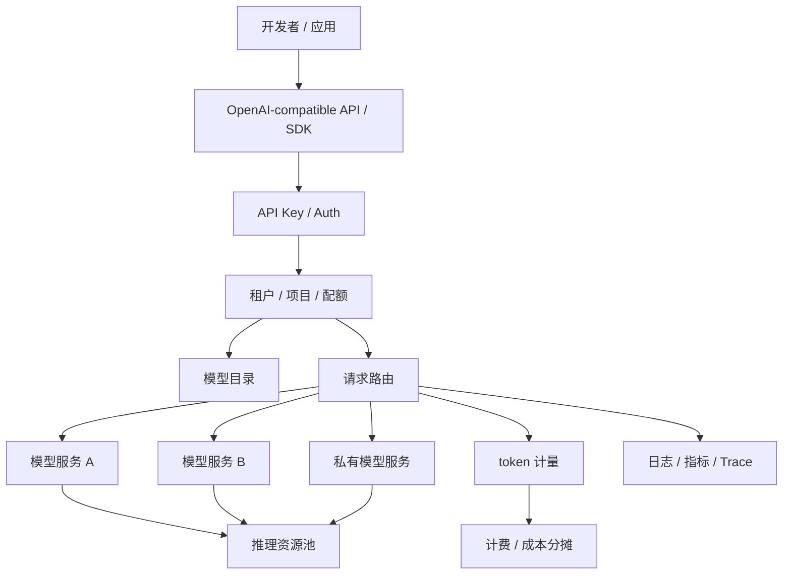

# 第 5 章：MaaS 平台

## 本章回答的问题

- MaaS 为什么是 Platform 层能力，而不是模型服务本身？
- OpenAI-compatible API、模型目录、API Key、租户、配额、路由和 SLA 如何组成一个可运营平台？
- MaaS 平台如何把应用需求连接到模型、推理服务、计量计费和基础设施？

## 一个真实场景

一个公司内部有多个团队接入大模型：客服团队需要稳定问答，研发团队需要代码助手，数据团队需要批量分析，业务团队希望试用不同模型。最初每个团队直接调用模型服务，结果很快出现问题：API Key 分散、模型版本混乱、限流口径不一致、账单无法分摊、故障时不知道哪个租户受影响。

MaaS 平台的价值就在这里。它不是单个模型 endpoint，而是围绕模型能力交付的一套平台：统一 API、模型目录、租户体系、配额、路由、SLA、可观测性和计费。

## 核心概念

MaaS 即 Model as a Service，把模型能力以服务方式交付给应用和用户。它向上提供 API、SDK、控制台和账单，向下连接模型服务、推理集群、评测系统和 GPU 基础设施。一个成熟 MaaS 平台的核心不是“能调用模型”，而是“能稳定、可控、可计量地交付模型能力”。

MaaS 属于 Platform 层。它和 GPU IaaS 的边界很清楚：GPU IaaS 交付 GPU、驱动、网络、存储和资源池；MaaS 交付模型 API、路由、限流、计量、SLA 和开发者体验。

## 系统架构



MaaS 平台位于应用和模型服务之间。它把模型服务包装成可治理的产品能力，让平台团队能够回答：谁在用、用了多少、是否超配额、调用了哪个模型、是否满足 SLA、成本由谁承担。

## 5.1 MaaS 是什么

MaaS 是模型能力的服务化交付层。它通常包含控制台、API、SDK、模型目录、密钥管理、租户体系、配额、限流、路由、计量、计费、可观测性和支持流程。对用户来说，MaaS 是“我可以用统一方式调用模型”；对平台来说，MaaS 是“我可以治理模型能力的生产和消费”。

MaaS 的成熟度可以分阶段理解。第一阶段是统一 API，解决接入问题。第二阶段是统一模型目录和权限，解决治理问题。第三阶段是计量计费和 SLA，解决运营问题。第四阶段是多模型路由、灰度、fallback 和成本优化，解决规模化问题。

## 5.2 OpenAI-compatible API

OpenAI-compatible API 已经成为许多模型平台的事实接口风格。它降低了应用迁移成本，让开发者可以用相似的 chat completions、embeddings、models 等接口接入不同后端。

但兼容 API 不等于兼容行为。不同模型对 tokenizer、tool calling、streaming chunk、错误码、上下文长度和参数支持可能不同。MaaS 平台需要明确兼容范围：哪些字段完全支持，哪些字段忽略，哪些字段有模型特定限制。否则应用会在迁移模型时遇到隐性行为差异。

## 5.3 模型目录

模型目录是 MaaS 的产品入口。它应描述模型名称、能力、上下文长度、支持的输入输出类型、适用场景、价格、SLA、版本、状态和访问权限。模型目录不是静态列表，而是连接评测、上线、灰度和下线流程的控制面。

模型目录还应区分公开模型、租户私有模型和实验模型。公开模型面向广泛应用，私有模型只对特定租户可见，实验模型可能只允许白名单调用。目录中的模型状态应包括 available、deprecated、maintenance、preview 等，帮助应用做迁移计划。

## 5.4 API Key

API Key 是应用访问 MaaS 的身份凭证。它应该绑定租户、项目、权限、配额和审计信息，而不是只是一串静态字符串。生产平台应支持 key 创建、轮换、禁用、过期、作用域和泄露检测。

API Key 的风险在于传播简单。它可能被写入代码仓库、日志、浏览器或第三方工具。MaaS 平台应提供最小权限 key、按环境区分 key、请求来源限制和异常调用告警。对高安全场景，可以结合 OAuth、短期 token 或服务账户。

## 5.5 租户、项目、配额

租户是资源和账单的组织边界，项目是租户内部的应用或工作空间边界，配额是对模型能力消费的限制。配额可以按 RPM、TPM、并发请求、日预算、模型、区域或资源池设置。

配额设计要避免只看请求数。LLM 请求成本和风险更接近 token、模型和上下文长度。一个租户每分钟 100 次短问答，和每分钟 100 次长文档总结，对基础设施压力完全不同。MaaS 应同时支持 request quota、token quota、concurrency quota 和 budget quota。

## 5.6 请求路由

请求路由决定一个 API 请求进入哪个模型服务实例或资源池。路由依据可以包括模型名、租户、SLA、区域、负载、成本、模型版本、灰度策略和健康状态。路由层要兼顾稳定性和可解释性。

常见路由策略包括静态路由、权重路由、租户专属路由、按延迟选择、按成本选择和 fallback。高质量路由系统需要知道后端模型服务的健康、队列长度、GPU 压力、错误率和版本状态。否则路由只是负载均衡，无法承担 AI 平台治理职责。

## 5.7 SLA 与服务等级

SLA 是平台对用户承诺的服务等级。MaaS 的 SLA 不应只写可用性，还应考虑 TTFT、TPOT、端到端延迟、错误率、限流行为、模型版本稳定性和支持响应时间。不同应用需要不同 SLA：客服可能要求高可用和稳定输出，代码补全要求低延迟，批量推理更关注完成时间和成本。

服务等级应映射到资源池和调度策略。Premium 租户可能使用独立资源池、更高优先级、更严格容量预留；普通租户使用共享资源池；实验模型不承诺生产 SLA。没有资源约束支撑的 SLA 只是文档承诺。

## 工程实现

一个模型目录条目可以这样表达：

```yaml
model:
  name: af-chat-large
  version: 2026-06-18
  status: available
  modalities: [text]
  context_window: "documented_by_provider"
  api:
    chat_completions: true
    embeddings: false
    tool_calling: true
    streaming: true
  service_levels:
    standard:
      rate_limits: tenant_default
    premium:
      dedicated_pool: true
  billing:
    input_token_price: configured
    output_token_price: configured
```

这类结构可以被控制台、网关、计费和路由系统共同使用。

## 常见故障

- 模型目录和实际服务版本不一致，应用调用到错误版本。
- API Key 没有绑定项目，导致账单无法分摊。
- 配额只按 QPS 设置，长上下文请求压垮推理服务。
- fallback 没有考虑模型能力差异，导致业务结果不一致。
- SLA 没有对应容量预留，高峰期无法兑现。

## 性能指标

- 接入指标：活跃租户数、活跃 API Key、活跃模型数。
- 流量指标：RPM、TPM、并发请求、input/output token。
- 体验指标：TTFT、TPOT、端到端延迟、stream 中断率。
- 治理指标：限流命中、配额超限、key 禁用、模型下线迁移进度。
- 运营指标：成本分摊、收入、毛利、按租户 cost per token。

## 设计取舍

MaaS 平台要在兼容性和能力表达之间取舍。完全追求 OpenAI-compatible 可以降低应用接入成本，但可能隐藏后端模型差异。提供大量模型特定参数可以释放能力，但会增加应用迁移成本。稳妥做法是保留统一核心 API，同时通过模型目录和 capability metadata 明确差异。

## 小结

- MaaS 是模型能力的服务化交付平台，不是单个模型 endpoint。
- 模型目录、API Key、租户、项目、配额、路由和 SLA 是 MaaS 的核心治理对象。
- OpenAI-compatible API 降低接入成本，但需要明确行为兼容边界。
- MaaS 的 SLA 必须映射到资源池、调度策略和容量预留。

## 延伸阅读

- TODO: OpenAI API 官方文档
- TODO: Azure OpenAI / Bedrock / Vertex AI 等 MaaS 产品文档
- TODO: 多租户 API 平台工程案例
