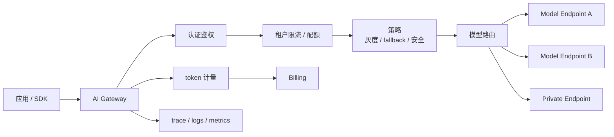

# 第 6 章：AI Gateway

## 本章回答的问题

- 为什么 AI Factory 需要专门的 AI Gateway，而不是普通 API Gateway？
- 认证鉴权、流量治理、模型路由、fallback、灰度和多模型聚合如何协同？
- Envoy AI Gateway 与 Gateway API Inference Extension 代表了什么方向？

## 一个真实场景

一个 MaaS 平台早期直接把应用流量转发到模型服务，普通 API Gateway 只负责 TLS、鉴权和 HTTP 路由。上线初期流量不大，看起来没有问题；租户增多后，故障开始连锁出现。某个租户突然提交大量长上下文请求，模型服务 prefill 队列堆积，其他短请求 TTFT 被拖慢；另一个租户开启 streaming 后连接保持很久，占满网关连接池；模型版本灰度没有按租户隔离，客服应用输出风格发生变化；后端模型超时后 fallback 到另一个模型，却因为 tool calling 格式不同导致应用解析失败。

这些问题说明普通 API Gateway 不理解模型流量的关键语义。普通网关可以按路径、header、QPS 和 upstream 健康转发请求，但 AI 流量还包含模型名、上下文长度、input/output token、streaming、工具调用、模型能力、租户预算、SLA 和成本。一个 200 状态码的请求可能生成了错误格式；一个 QPS 很低的租户可能消耗大量 TPM；一个 fallback 成功的 HTTP 响应可能让业务结果变差。

AI Gateway 的价值，是把模型流量治理前置到入口。它既保护后端推理资源，也保护应用免受模型版本、能力差异和后端故障的直接冲击。它不是“更懂 AI 的反向代理”这么简单，而是 AI 平台的数据面策略执行点：在每个请求进入模型服务前，完成身份、配额、能力、路由、风险、观测和计量的基本判断。

如果缺少这个入口治理，平台会在规模扩大后被迫把策略补到各处。应用自己判断模型能力，模型服务自己做限流，计费系统事后补 token，SRE 用日志猜测租户影响面，安全团队再去追工具权限。每个局部方案都可能暂时有效，但整体不可审计。AI Gateway 的目标，是让这些策略在同一入口按同一对象模型执行，并让结果能被追踪。

## 核心概念

AI Gateway 是面向模型 API、RAG 和 Agent 流量的网关层。它承担认证鉴权、租户识别、配额、限流、模型路由、fallback、灰度、参数校验、请求改写、响应处理、token 计量、日志、metrics、trace 注入和安全策略等能力。它位于应用和模型服务之间，是 MaaS 数据面的核心组件。没有 AI Gateway，MaaS 控制面中的模型目录、配额和服务等级很难落实到每个请求。

AI Gateway 与普通 API Gateway 的差异在于流量语义。普通 API Gateway 主要理解 HTTP 连接、路径、方法、证书、认证和 upstream；AI Gateway 还要理解模型能力、context window、token 预算、streaming 生命周期、tool calling、RAG/Agent 调用树和后端推理状态。它的限流不能只看请求数，路由不能只看服务地址，fallback 不能只看可用性，灰度不能只看 5xx。

AI Gateway 也不是推理引擎。它不负责具体 batching、KV Cache、CUDA kernel 或 NCCL 通信；这些属于模型服务和 AI Runtime。Gateway 的职责是入口治理：让请求以正确身份、正确预算、正确模型能力和正确观测标签进入后端。职责边界清楚，才能避免网关变成复杂单点，也避免治理逻辑散落到每个应用。

因此，AI Gateway 的成功标准不是“转发成功率高”，而是“策略执行一致且可解释”。一个请求被拒绝，应能说明是认证失败、配额超限、模型无权限、上下文超限还是安全策略拦截；一个请求被路由，应能说明命中的模型版本和资源池；一个请求被 fallback，应能说明原因和后果。可解释性是网关治理能力的一部分。

这也是它区别于普通网关的核心。

否则入口层只是在转发流量。

治理结果必须可验证。

验证失败时应阻断请求。

默认拒绝更安全。

## 系统架构

AI Gateway 通常分为控制面和数据面。控制面接收模型目录、租户、配额、路由、灰度、fallback、安全策略和服务等级配置；数据面处理每个请求，执行认证、限流、能力校验、路由选择、trace 注入、streaming 管理和响应计量。控制面决定规则，数据面执行规则。两者之间需要版本化配置和可回滚能力，否则策略变更本身会成为事故来源。

数据面处理请求时，顺序很重要。通常先识别调用者和租户，再检查 API Key、项目权限和模型访问权限；随后根据请求参数估算或校验上下文、输出预算和工具能力；再执行配额与限流；接着根据模型目录、服务等级、健康状态和灰度规则选择 upstream；响应返回时记录 token、延迟、错误码、fallback、取消和账单事件。每一步都应进入 trace。

架构上，AI Gateway 需要与模型服务共享健康和负载信息。后端是否能接收请求，不只取决于进程是否存活，还取决于队列长度、KV Cache、GPU/HBM 状态、错误率和模型版本。Gateway 不需要掌握所有 runtime 细节，但至少应获得可路由的健康信号。否则它只能做静态转发，无法承担 AI 平台治理职责。

配置发布也要纳入架构设计。路由规则、限流阈值、fallback 目标和灰度比例都可能影响全站流量，必须有版本、审批、灰度和回滚。网关策略错误的影响范围通常比单个模型服务更大，因为它位于入口。生产系统应把 Gateway 配置当作高风险配置管理，而不是临时修改的 YAML。

策略发布应有审计、预览和回滚。

并且要确认所有网关实例已同步。

实例一致性应自动检查。

检查失败应阻止继续放量。



## 6.1 为什么需要 AI Gateway

AI Gateway 首先解决统一接入问题。一个 AI Factory 中可能同时存在自研模型、开源模型、第三方 API、租户私有模型、实验模型和不同推理引擎。应用不应直接依赖这些后端的地址、认证、参数和错误格式。Gateway 对上提供稳定 API，对下适配不同模型服务，使模型迁移、供应商切换、版本升级和资源池调整不必每次都改应用。

第二个问题是统一治理。租户、项目、API Key、配额、限流、审计、计量和安全策略必须在入口处执行。若治理散落在应用和模型服务中，不同团队会形成不同口径：有的按 QPS 限流，有的按 token 限流，有的不记录 streaming 取消，有的不记录 fallback。AI Gateway 让平台可以在同一入口执行一致策略，并把策略结果写入 trace 和账单。

第三个问题是统一演进。模型升级、灰度、fallback、多模型聚合、安全策略和成本优化都需要在不破坏应用的情况下迭代。Gateway 是流量切分和回滚的关键点。没有 Gateway，模型服务变更会直接暴露给应用；有 Gateway，平台可以按租户、项目、用户、比例或请求特征逐步放量，并在发现质量或成本异常时回滚。AI Gateway 是模型平台规模化演进的缓冲层。

还有一个问题是统一证据。入口处最容易绑定 request id、tenant、project、model、route、quota 和 token 计量。若这些信息在网关处缺失，后续模型服务、计费和观测系统只能各自补字段，口径难以一致。AI Gateway 让每个请求从进入平台开始就带着正确标签，这对账单、SLO 和事故复盘都很关键。

标签越早绑定，后续证据链越完整。

入口标签也是计费标签的来源。

缺失标签会污染账单。

## 6.2 认证鉴权

认证回答“调用者是谁”，鉴权回答“调用者能做什么”。AI Gateway 应把 API Key、服务账户、用户身份、租户、项目、模型权限和服务等级绑定起来。对普通 Chat，请求只需确认调用者能否使用某个模型；对 RAG 和 Agent，还要把用户身份传递给检索、工具和业务 API，确保下游按同一权限边界执行。模型请求不应成为绕过企业权限系统的通道。

鉴权不能只在入口做一次。RAG 检索需要文档权限，Agent 工具调用需要业务权限，私有模型访问需要租户隔离，高风险操作可能需要二次确认。AI Gateway 可以注入租户、项目、用户、trace id 和策略上下文，让下游服务继续做细粒度校验。它也可以拦截明显不允许的模型访问和参数组合，减少无效请求进入后端。

安全工程上还要处理凭据生命周期。API Key 泄露、租户权限变化、项目迁移、人员离职、模型访问下线，都应能快速影响网关鉴权。Gateway 应支持 key 禁用、来源限制、异常调用告警和审计查询。认证鉴权不是一次性接入功能，而是 MaaS 和企业安全体系的持续同步点。任何身份漂移，最终都会变成成本和数据风险。

鉴权还要关注“代理身份”问题。很多企业应用用服务账户调用 MaaS，但实际用户不同；如果 Gateway 只识别服务账户，下游 RAG 和工具就无法按真实用户权限过滤。更稳妥的做法是同时传递应用身份和用户身份，并明确哪些动作使用应用权限，哪些动作使用用户权限。Agent 场景尤其需要这种区分，否则工具调用很容易扩大权限面。

权限上下文应随 trace 一起传递。

## 6.3 流量治理

AI 流量治理包括限流、熔断、超时、重试、并发控制、streaming 连接控制、token 预算和任务预算。LLM 请求不能只按 QPS 限制，因为资源压力更接近 input token、output token、上下文长度、并发序列和模型成本。Gateway 应支持 RPM、TPM、并发请求、最大上下文、最大输出 token、streaming 连接数、每租户预算和每项目预算。Agent 还需要每 run 模型调用数、工具调用数和总 token 限制。

超时和重试策略必须谨慎。普通 HTTP 请求失败后重试通常安全，但 LLM streaming 已经输出部分 token 后重试，可能产生重复内容；Agent 工具调用失败后重试，可能重复发送邮件、提交工单或执行写操作。Gateway 应区分连接失败、后端超时、模型拒绝、限流、安全拒绝、客户端取消和部分输出。不同错误类型对应不同重试和计费语义。

流量治理还要服务公平性和成本控制。高价值租户可以有更高优先级或专属资源池，实验流量可以更低优先级，批量任务可以排队或异步执行。若所有流量共享同一限流规则，短请求会被长请求拖慢，生产业务会被实验流量影响。AI Gateway 应把流量治理与服务等级、资源池和成本预算绑定，而不是只做全局速率限制。

治理策略还需要用户可见。被限流时，应用应知道是 RPM、TPM、并发、预算还是上下文超限，并获得可操作建议，例如稍后重试、缩短上下文、申请配额或转异步任务。模糊的 429 会让应用盲目重试，进一步放大流量。AI Gateway 的错误响应应是平台契约的一部分。

清晰错误能减少无效重试。

错误语义本身就是治理接口。

应用依赖它做退避。

## 6.4 模型路由

模型路由根据请求属性选择后端 endpoint。路由依据包括模型名、租户、项目、区域、SLA、成本、模型能力、灰度规则、健康状态、上下文长度、工具调用需求和数据驻留要求。一个高质量路由系统必须理解 capability：是否支持 tool calling、JSON 输出、多模态、最大上下文、embedding 或指定安全策略。能力不匹配的路由，比后端失败更隐蔽，因为它可能返回 HTTP 成功但业务结果错误。

路由还要考虑后端 runtime 状态。模型服务不是普通无状态服务，模型加载、GPU HBM、KV Cache、batching、队列长度和推理引擎状态都会影响可接收请求能力。Gateway 至少应获得后端健康、错误率、TTFT/TPOT、队列、资源池和版本状态。更高级的系统可以把长上下文请求、低延迟请求和批量请求路由到不同资源池，减少互相干扰。

路由决策必须可解释。Trace 中应记录匹配的模型目录版本、路由规则、灰度命中、fallback 状态、upstream 和服务等级。出现事故时，平台要能回答请求为什么进了某个模型、是否命中灰度、是否因为健康状态切换、是否违反能力约束。不可解释路由会让模型质量问题和账单争议都难以处理。路由是治理动作，不只是负载均衡算法。

路由策略还要处理冷启动和容量预留。某些模型 endpoint 虽然健康，但权重未加载或副本刚启动，首批请求会经历明显延迟；某些 Premium 租户需要保留容量，不能被普通流量耗尽。Gateway 可以通过预热状态、资源池标签和服务等级约束避免把请求送到不合适的后端。路由若只看当前错误率，就会忽略这些体验风险。

路由应同时考虑当前健康和未来承诺。

## 6.5 fallback

Fallback 是后端失败、超时或不可用时切换到备用模型、备用 endpoint 或备用 provider。它能提升可用性，但风险很高。备用模型的上下文长度、tokenizer、输出风格、工具调用格式、价格、安全策略和质量都可能不同。HTTP 层面 fallback 成功，不代表业务层面成功。客服、数据分析和 Agent 场景尤其不能随意切换到能力不同的模型。

Fallback 策略应按应用、模型能力和错误类型配置。客服系统可以 fallback 到同能力同版本的备用集群，但不应自动切到回答风格不同或没有知识库约束的模型；代码补全可以 fallback 到较小模型，但应标记质量等级；Agent 工具调用请求不能 fallback 到不支持 function calling 的模型。对已经部分输出的 streaming 请求，fallback 还要定义是否中断、重试或返回部分结果。

每次 fallback 都应进入 trace、指标和账单。平台需要知道 fallback 发生频率、原因、目标、延迟、成本和业务影响。若 fallback 过于频繁，说明主集群容量或健康有问题；若 fallback 后错误率下降但投诉上升，说明可用性提升牺牲了质量。Fallback 是可靠性手段，不是隐藏故障的手段。成熟平台会对 fallback 设置预算和告警。

Fallback 还要尊重幂等和输出一致性。对尚未开始生成的请求，切换后端相对简单；对已经 streaming 的请求，强行切换可能产生重复或断裂输出；对 Agent 内部调用，fallback 可能改变工具参数生成，影响后续步骤。平台应明确哪些阶段允许 fallback，哪些场景只能失败并让上层处理。否则 fallback 会把清晰失败变成隐蔽错误。

隐蔽错误比显式失败更难治理。

因此 fallback 不能默认开启。

它应是显式策略。

## 6.6 灰度发布

灰度发布让平台按租户、项目、用户、流量比例、模型版本、区域或请求特征逐步切换。AI 模型灰度不只看 5xx 和延迟，还要看输出质量、工具调用成功率、引用准确率、投诉、人工评测、业务指标和成本。一次模型升级可能没有技术错误，却改变回答风格、拒答率、JSON 稳定性或 token 消耗。普通服务灰度指标不足以覆盖 AI 风险。

灰度对象也不只模型权重。Prompt 模板、tokenizer、RAG 索引、rerank 模型、安全策略、推理引擎、sampling 参数和网关适配器都可能需要灰度。若多个对象同时变化，质量波动时很难定位原因。Gateway 应支持细粒度流量切分，并把灰度版本写入 trace，让评测和线上反馈可以按版本回放。

灰度必须配套快速回滚。回滚条件应提前定义，例如错误率、TTFT、输出格式失败、工具调用失败、人工质检下降或成本异常。回滚也要注意状态：streaming 请求是否继续，Agent run 是否使用旧版本完成，账单如何记录。灰度不是发布流程的装饰，而是 AI Factory 在模型不可完全预测时控制风险的必要机制。

灰度结果应和评测系统连接。线上灰度可以发现真实用户分布下的问题，离线评测可以解释具体能力变化。若两者割裂，团队只能看到“投诉变多”却不知道原因，或看到 benchmark 提升却不知道线上是否受益。AI Gateway 记录的灰度标签，是把线上流量、用户反馈和离线评测连接起来的关键字段。

没有灰度标签，就没有可信对比。

没有回滚条件，就没有安全灰度。

灰度必须可停止。

停止后还要能清理旧策略。

否则策略会残留。

## 6.7 多模型聚合

多模型聚合指一个平台同时接入自研模型、开源模型、第三方 API、租户私有模型和专用小模型。AI Gateway 对上提供统一 API，对下适配不同 provider 的认证、参数、错误码、streaming 格式、tool calling、计量口径和能力描述。聚合的价值是让应用通过一个入口使用多种模型能力，也让平台能按质量、成本和可用性灵活路由。

聚合的难点是标准化和差异表达。平台不能假装所有模型完全一样。不同模型的上下文、工具调用、JSON 稳定性、多模态能力、拒答策略和价格都不同。Gateway 可以做参数转换和错误映射，但应通过模型目录暴露 capability，避免应用误用。统一 API 负责降低接入成本，能力差异负责保护应用正确性。二者必须同时存在。

多模型聚合还带来数据和合规问题。请求是否可以发到第三方 provider，是否需要留在某个区域，是否允许使用租户私有模型，是否记录原始 prompt，是否用于训练，都需要策略控制。Gateway 是执行这些策略的关键入口。若聚合只关注“多接几个模型”，而不处理数据边界和计费边界，平台会在商业化和合规阶段遇到风险。

聚合还会影响故障责任。第三方 provider 超时、自研模型失败、私有模型资源不足，对用户来说都是 MaaS 平台不可用，但内部处理方式不同。Gateway 应把 provider、endpoint、错误类型和 fallback 结果写入 trace，帮助支持团队解释影响范围。多模型聚合不是把复杂性消除，而是把复杂性收敛到平台可管理的位置。

可管理的前提是差异可见。

差异不可见时，统一接口会误导应用。

目录要表达差异。

## 6.8 Envoy AI Gateway 与 Gateway API Inference Extension

Envoy AI Gateway 和 Gateway API Inference Extension 代表了一个趋势：AI 推理流量治理正在进入云原生网关和 Kubernetes Gateway API 生态。它们尝试在标准网关模型中表达模型路由、推理后端、策略扩展和流量治理，使 AI Gateway 不再完全依赖每家公司自研。标准化的意义在于降低集成成本，让模型平台、网关、Kubernetes 和推理服务之间有更清晰接口。

这类项目关注的问题，正是本章讨论的工程边界：如何把模型、endpoint、路由、策略和后端健康纳入网关；如何让 AI 流量治理与云原生基础设施共存；如何避免每个 MaaS 平台重复造一套入口层。它们不意味着所有业务逻辑都应塞进标准网关，而是提供一个可扩展底座，让团队把通用流量治理与业务策略分层实现。

生产落地仍要结合组织现状。很多企业已有 API Gateway、服务网格、身份系统、计费系统、模型目录和可观测平台；引入标准 AI Gateway 时，需要决定哪些能力使用社区组件，哪些能力保留在自研控制面。标准接口能减少重复建设，但不会自动解决模型质量、业务灰度、成本归因和安全策略。落地时要看接口能否承载自己的对象模型和运营流程。

因此评估这类项目时，不应只看功能列表，还要看扩展点、配置模型、可观测数据、与现有身份和计费系统的集成方式。标准组件适合承载通用流量治理，自研系统仍需要表达业务对象和商业规则。二者结合得好，平台既能减少底层重复建设，又能保留自己的 MaaS 治理能力。

标准化应服务治理，而不是替代治理。

业务策略仍要回到 MaaS 对象模型中。

## 工程实现

AI Gateway 工程实现应把路由、配额、fallback 和能力校验表达为版本化策略。策略既要能被控制面管理，也要能在数据面高效执行。一个请求进入 Gateway 后，应生成 trace id，解析租户和模型，校验权限和能力，检查 token 与并发预算，选择 upstream，并在响应结束时写入计量事件。对 streaming 请求，还要在首 token、每段输出、取消和结束时维护状态。

一个简化路由规则可以这样表达。实际系统还应补充服务等级、数据驻留、模型 capability、灰度版本和观测标签。

```yaml
route:
  match:
    model: af-chat-large
    tenant: enterprise-a
  policy:
    max_input_tokens: 32000
    max_output_tokens: 4096
    rate_limit:
      rpm: 600
      tpm: 2000000
    fallback:
      enabled: true
      target: af-chat-large-backup
      on_errors: [timeout, unavailable]
  upstreams:
    - endpoint: inference-pool-a
      weight: 90
    - endpoint: inference-pool-b
      weight: 10
```

上线前应测试关键路径：认证失败、权限拒绝、配额超限、长上下文拒绝、streaming 取消、fallback、灰度命中、后端超时、错误码映射和账单事件。AI Gateway 的正确性不是只看能否转发，而是看每种边界条件是否产生预期策略结果。入口层一旦出错，影响面往往覆盖所有模型和租户。

工程实现还应提供策略审计和回放能力。给定一个历史请求，平台应能用当时的策略版本解释它为什么被允许、拒绝、路由或 fallback。策略回放能帮助事故复盘，也能在发布新策略前做 dry-run，评估会影响哪些租户和模型。没有回放能力，网关策略变更只能靠线上试错。

实现时还要关注性能路径。认证、配额和路由需要低延迟执行，复杂策略可以预编译或缓存；计量和日志可以异步写入，但不能丢失关键结束事件。尤其是 streaming 请求，开始、取消和结束都应可靠记录。工程实现要在入口延迟和治理完整性之间做明确设计，而不是把所有逻辑串行阻塞在请求路径上。

关键路径失败时，应优先安全拒绝，而不是绕过策略继续转发。

## 常见故障

第一类故障是网关只按 QPS 限流，无法限制超长上下文、长输出和 Agent 内部调用，导致后端推理服务被少量请求拖垮。第二类故障是 fallback 到能力不同的模型，HTTP 请求成功但工具调用、JSON 输出或安全策略失败。第三类故障是 streaming 沿用普通 HTTP 超时和缓冲配置，长回答被中断，或者客户端取消后服务端继续生成。

第四类故障是灰度只看 5xx，不看质量和成本。模型升级后错误率不变，但回答风格、引用准确率或 token 消耗变化，业务已经受影响。第五类故障是错误码映射不统一，应用无法区分限流、配额、模型失败、安全拒绝和 provider 故障。第六类故障是策略分散在应用、网关和模型服务中，出现问题时没人知道最终生效规则是什么。

排查 AI Gateway 故障时，应从请求 trace 入手：调用者是谁，命中哪个 key 和租户，目标模型能力是否匹配，配额是否通过，路由规则是什么，upstream 是哪个，是否 fallback，streaming 是否取消，错误来自网关还是后端。Gateway 故障的本质通常是策略与实际流量不匹配，而不是简单连接失败。

还有一类常见故障是网关和控制面状态不一致。控制面已经下线模型，数据面仍缓存旧规则；配额已经提升，某个网关实例仍使用旧配置；灰度规则只更新了部分区域。这类问题会表现为同一租户在不同请求中得到不同结果。配置版本和实例一致性检查，是 AI Gateway 运维的基本功。

否则同一策略会在不同实例上表现不同。

这种不一致会直接破坏排障可信度。

配置漂移要告警。

告警应指向具体实例。

## 性能指标

AI Gateway 指标应覆盖入口流量、治理结果、模型后端和成本。入口指标包括请求数、连接数、streaming duration、网关处理延迟、请求体大小、响应体大小和客户端取消率。治理指标包括认证失败、权限拒绝、限流命中、配额拒绝、上下文超限、fallback 次数、灰度流量比例、策略拦截和错误码分布。

后端指标应按 upstream、模型、租户和服务等级切分，包括 TTFT、TPOT、E2E latency、后端错误率、队列等待、超时、健康状态和资源池压力。成本指标包括按路由策略的 input/output token、fallback 成本、租户成本、模型成本和异常 token 消耗。安全指标包括高风险工具请求、策略拒绝、异常 key 调用和跨租户访问拒绝。

指标要支持行动。若限流命中高，可能需要调整配额或优化应用；若 fallback 激增，可能是主集群故障或路由策略错误；若 streaming 取消率高，可能是客户端体验、超时或输出过慢；若某 upstream TTFT 升高，可能是队列、prefill 或资源池压力。Gateway dashboard 应帮助团队判断下一步，而不是只显示总请求数。

指标还要按策略版本切分。一次路由规则、限流阈值或 fallback 配置变更后，平台需要比较变更前后的延迟、错误、成本和质量代理指标。若没有策略版本维度，网关变更造成的影响会混在模型流量波动里。AI Gateway 是策略执行点，因此策略本身也应成为观测维度。

性能指标还应连接容量规划。Gateway 看到的是最早的租户和模型流量分布，能提前发现某些模型、区域或资源池的需求增长。若这些指标只用于告警，不进入容量评审，平台会重复在高峰期被动扩容。入口指标是业务需求进入 AI Factory 的第一手信号。

## 设计取舍

AI Gateway 可以做得很厚，也可以做得很薄。厚网关统一治理强，能集中实现鉴权、限流、路由、fallback、计量和安全策略，但容易变成复杂单点，变更风险高。薄网关更简单、性能路径短，但很多策略会散落到应用和模型服务中，导致口径不一致。成熟平台通常让 Gateway 负责入口治理和路由，把模型内部调度留给推理服务，把多步任务编排留给 Agent Platform。

第二个取舍是标准化与业务定制。使用 Envoy AI Gateway、Gateway API 等标准生态可以降低基础能力建设成本，但企业仍有自己的租户、计费、权限和模型目录。完全自研可以贴合业务，但长期维护成本高。可行路径是用标准网关承载通用数据面能力，用自研控制面管理 MaaS 对象和业务策略，并通过清晰接口连接二者。

第三个取舍是实时策略与稳定性。动态路由、实时健康、成本优化和自动 fallback 可以提高效率，但策略过于复杂会降低可解释性。生产系统应从简单、可验证的路由开始，再逐步引入实时信号。每个自动策略都要有 trace、告警和回滚。AI Gateway 的目标不是让流量自动“聪明”起来，而是让治理动作可控、可解释、可恢复。

最后还要在性能路径和治理深度之间取舍。每增加一次外部查询、策略计算或日志写入，都会增加网关延迟；每减少一项检查，又可能放大安全和成本风险。常见做法是把高频、低复杂度的策略放在数据面快速执行，把复杂审批和分析放在控制面异步处理。入口层必须快，但不能快到失去治理。

治理缺失最终会以更高故障成本偿还。

## 小结

- AI Gateway 是模型流量的治理入口，不只是 HTTP 反向代理。
- LLM 限流需要理解 token、上下文、streaming 和任务调用树。
- Fallback 和灰度必须考虑模型能力、质量、成本和可回滚性。
- 标准化网关生态正在形成，但生产系统仍需要结合租户、计费和可观测性闭环。

## 延伸阅读

- [Envoy AI Gateway documentation](https://aigateway.envoyproxy.io/)
- [Gateway API Inference Extension documentation](https://gateway-api-inference-extension.sigs.k8s.io/)
- [Kubernetes Gateway API documentation](https://gateway-api.sigs.k8s.io/)
