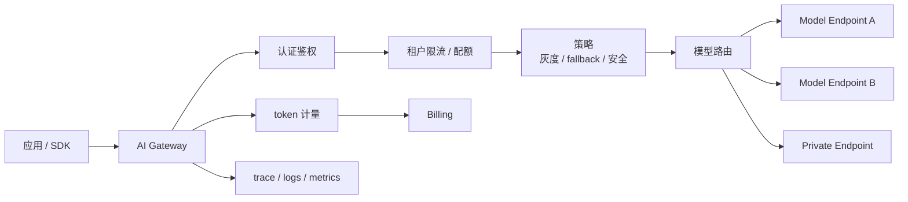

# 第 6 章：AI Gateway

## 本章回答的问题

- 为什么 AI Factory 需要专门的 AI Gateway，而不是普通 API Gateway？
- 认证鉴权、流量治理、模型路由、fallback、灰度和多模型聚合如何协同？
- Envoy AI Gateway 与 Gateway API Inference Extension 代表了什么方向？

## 一个真实场景

一个 MaaS 平台直接把应用流量打到模型服务。上线初期没问题，租户变多后开始出现连锁故障：某个租户长上下文请求激增，模型服务队列堆积；另一个租户触发大量 streaming 连接，占满网关连接；模型版本灰度时没有按租户隔离，导致客服应用输出风格变化；后端模型故障时，fallback 到另一个模型，却因为 tokenizer 和工具调用行为不同引发应用错误。

AI Gateway 的作用是把这些治理逻辑前置。它不是简单转发请求，而是 AI 平台的流量控制面和策略执行点。

## 核心概念

AI Gateway 是面向模型 API 和 Agent/RAG 流量的网关层。它承担认证鉴权、租户识别、限流、配额、模型路由、fallback、灰度、请求改写、响应处理、token 计量、日志和 trace 注入等能力。

普通 API Gateway 关注 HTTP 路由、TLS、认证、限流和负载均衡。AI Gateway 还必须理解模型名、token、streaming、上下文长度、工具调用、模型能力、成本和后端推理状态。

## 系统架构



AI Gateway 同时在控制面和数据面中工作。控制面配置模型、租户、路由和策略；数据面处理每个请求和 streaming 响应。

## 6.1 为什么需要 AI Gateway

AI Gateway 解决三个问题。第一是统一接入：不同模型服务、不同推理引擎和不同资源池需要统一暴露给应用。第二是统一治理：租户、配额、限流、审计和计费必须在入口处执行。第三是统一演进：模型升级、灰度、fallback 和多模型聚合需要在不改应用的情况下迭代。

没有 AI Gateway，应用会直接依赖模型服务细节。模型迁移、版本升级、限流策略和账单口径都会变成应用改造。随着模型和租户增多，这种耦合会迅速失控。

## 6.2 认证鉴权

认证确认“调用者是谁”，鉴权确认“调用者能做什么”。AI Gateway 应把 API Key、服务账户、用户身份、租户、项目和模型权限绑定起来。对 Agent 和工具调用场景，还要区分用户权限、应用权限和工具权限。

鉴权不能只在请求入口做一次。RAG 检索、工具调用、私有模型访问和高风险操作都可能需要二次检查。AI Gateway 可以注入租户和用户上下文，让下游服务做细粒度权限判断。

## 6.3 流量治理

流量治理包括限流、熔断、超时、重试、并发控制和预算控制。LLM 请求的限流应支持 RPM、TPM、并发请求、streaming 连接数、最大上下文长度和最大输出 token。Agent 任务还需要限制每任务调用次数和总 token。

重试策略要非常谨慎。普通 HTTP 请求失败可以重试，但 LLM streaming 已经输出部分 token 后重试可能造成重复内容；有副作用工具调用失败后重试可能造成重复操作。AI Gateway 应区分可重试错误、不可重试错误和需要应用确认的错误。

## 6.4 模型路由

模型路由根据请求属性选择后端 endpoint。路由依据包括模型名、租户、区域、SLA、成本、负载、模型能力、灰度规则和健康状态。一个高质量路由系统应理解 capability：是否支持 tool calling、最大上下文、是否支持 JSON mode、是否支持多模态。

路由还要考虑队列和资源状态。后端 endpoint 不是普通无状态服务，模型加载、GPU HBM、KV Cache 和 batching 都会影响可接收请求能力。AI Gateway 至少应接收后端健康、错误率和负载信息。

## 6.5 fallback

Fallback 是后端失败或质量不满足时切换到备用模型或 endpoint。它能提升可用性，但风险很高。备用模型的输出风格、上下文长度、工具调用支持、tokenizer 和价格可能不同。

Fallback 策略应按应用和模型能力配置。客服系统可以 fallback 到同能力同版本的备用集群，但不应随意 fallback 到回答风格不同的模型。代码补全可以 fallback 到较小模型，但应标记质量等级。每次 fallback 都应进入 trace 和账单。

## 6.6 灰度发布

灰度发布让平台按租户、项目、用户、流量比例或模型版本逐步切换。AI 模型灰度不只看错误率，还要看输出质量、投诉、人工评测、业务指标和成本。一次模型升级可能没有技术错误，却改变回答风格或工具调用概率。

灰度系统应支持快速回滚。模型服务、prompt 模板、推理引擎、tokenizer、RAG 索引和安全策略都可能需要灰度。AI Gateway 是实现流量切分和回滚的关键入口。

## 6.7 多模型聚合

多模型聚合指一个平台同时接入自研模型、开源模型、第三方 API 和租户私有模型。AI Gateway 对上提供统一 API，对下适配不同 provider 的认证、参数、错误码、streaming 格式和计量口径。

聚合的难点是标准化和差异表达。平台不能假装所有模型完全一样，而应在模型目录中暴露 capability，并在网关层做参数转换、错误映射和能力校验。

## 6.8 Envoy AI Gateway 与 Gateway API Inference Extension

Envoy AI Gateway 和 Gateway API Inference Extension 代表了一个趋势：把 AI 推理流量治理纳入云原生网关和 Kubernetes Gateway API 生态。它们关注如何在标准网关模型中表达模型路由、推理后端、策略和扩展能力。

这类项目说明 AI Gateway 正在从“业务自研网关”走向“基础设施标准组件”。但生产落地仍要结合组织已有网关、服务网格、认证系统、计费系统和模型平台。标准接口降低集成成本，不会自动解决模型质量和成本治理。

## 工程实现

一个 AI Gateway 路由规则可以抽象为：

```yaml
route:
  match:
    model: af-chat-large
    tenant: enterprise-a
  policy:
    max_input_tokens: 32000
    max_output_tokens: 4096
    rate_limit:
      rpm: 600
      tpm: 2000000
    fallback:
      enabled: true
      target: af-chat-large-backup
      on_errors: [timeout, unavailable]
  upstreams:
    - endpoint: inference-pool-a
      weight: 90
    - endpoint: inference-pool-b
      weight: 10
```

实现时要把配置和运行时观测结合起来。没有后端健康和 token 计量，路由策略无法闭环。

## 常见故障

- 网关只按 QPS 限流，无法限制超长上下文。
- fallback 到能力不同的模型，导致工具调用或 JSON 输出失败。
- streaming 超时配置沿用普通 HTTP，长回答被中断。
- 灰度只看 5xx，不看质量和成本指标。
- 错误码映射不统一，应用无法区分限流、配额、模型失败和安全拒绝。

## 性能指标

- 网关指标：请求数、连接数、streaming duration、网关处理延迟。
- 治理指标：限流命中、配额拒绝、fallback 次数、灰度流量比例。
- 模型指标：按 upstream 的 TTFT、TPOT、错误率、队列等待。
- 成本指标：按路由策略的 input/output token、fallback 成本、租户成本。
- 安全指标：认证失败、权限拒绝、策略拦截、高风险工具请求。

## 设计取舍

AI Gateway 可以做得很厚，也可以做得很薄。厚网关统一治理强，但容易变成复杂单点；薄网关更简单，但很多策略会散落到应用和模型服务中。成熟平台通常让网关负责入口治理和路由，把模型内部调度留给推理服务，把任务编排留给 Agent Platform。

## 小结

- AI Gateway 是模型流量的治理入口，不只是 HTTP 反向代理。
- LLM 限流需要理解 token、上下文、streaming 和任务调用树。
- Fallback 和灰度必须考虑模型能力、质量、成本和可回滚性。
- 标准化网关生态正在形成，但生产系统仍需要结合租户、计费和可观测性闭环。

## 延伸阅读

- TODO: Envoy AI Gateway 官方文档
- TODO: Gateway API Inference Extension 官方文档
- TODO: 云原生 API Gateway 设计资料
