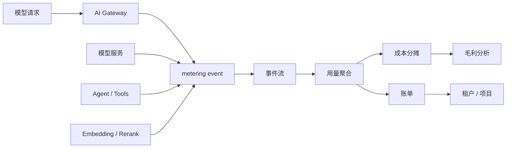

# 第 7 章：计量与计费

## 本章回答的问题

- token 计量为什么是 AI Factory 经济系统的基础？
- input token、output token、reasoning token、工具调用和缓存命中应如何进入计费口径？
- cost per token、revenue per token 和毛利模型如何反向影响平台设计？

## 一个真实场景

一个内部 MaaS 平台上线半年后，GPU 成本持续增长，但没有团队能说清每个业务线到底消耗了多少。平台只记录请求数，没有记录 input token、output token、模型版本、租户、项目、失败请求、streaming 中断、fallback 和 Agent 中间调用。财务只能按部门人数或 GPU 预算粗略分摊，业务团队也无法判断某个应用是否值得继续扩容。最后出现争议：客服认为代码助手消耗了资源，研发认为长文档办公助手才是成本来源，平台团队没有证据。

继续追查会发现，问题不是缺少账单页面，而是缺少可信计量链路。网关知道租户和 API Key，但不知道实际生成 token；模型服务知道 token，但不知道成本中心；Agent 平台知道内部多轮调用，但没有把中间调用归到同一个任务；fallback 后实际服务模型和请求模型不一致；streaming 取消后已生成 token 没有落账。每个系统都掌握一部分事实，但没有统一事件把它们串起来。

计量与计费不是商业化之后才需要的功能。只要 GPU、模型和平台能力是稀缺资源，就需要计量；只要多个租户共享资源，就需要成本分摊；只要对外提供服务，就需要账单、收入和毛利。AI Factory 的经济性从第一天就存在，只是早期常被隐藏在预算和人工协调里。越晚补计量，历史成本越难解释，平台治理越容易失真。

这类问题的修复成本会随规模增长。早期少量团队可以靠人工确认账单，几十个租户后就需要自动聚合，商业化后还要支持合同价、退款、争议和审计。计量系统越晚建设，越难还原历史用量，也越难说服业务方接受新的收费口径。因此计量不是财务附属系统，而是 AI Factory 的基础控制面之一。

## 核心概念

Metering 是计量，回答“谁在什么时候用了什么、用了多少”。Billing 是计费，回答“这些用量如何换算成费用、折扣、结算和账单”。Chargeback 是内部收费，即把成本或费用真正分摊到团队；showback 是只展示成本，不实际扣费。AI Factory 中的计量对象包括请求、token、模型、租户、项目、GPU 时间、工具调用、embedding、rerank、存储、网络、专属资源池和第三方 API。

Token 是推理服务最常见的计量单位，但不是唯一单位。Chat 请求主要看 input/output token；RAG 还会产生 embedding、检索和 rerank 成本；Agent 会产生多轮模型调用、工具调用和沙箱资源；批量推理可能按任务或文件计量；微调和训练可能按 GPU 小时、数据量和 checkpoint 计量。计量系统不能只服务一个 API 形态，而要能承接多种 AI workload。

可信计量有三个要求。第一是归属清楚：每条用量必须关联租户、项目、应用、模型、路由和成本中心。第二是口径稳定：token、失败、取消、fallback、缓存命中和折扣如何处理必须有规则。第三是可追溯：账单聚合可以修正，但原始计量事件应保留，能够从账单回溯到请求或任务。没有这三点，计费会变成争议制造机。

还要区分“事实层”和“解释层”。事实层记录真实发生的请求、token、错误和资源消耗；解释层根据价格、折扣、合同和内部政策生成账单。事实层应尽量稳定，解释层可以随商业策略变化。把二者混在一起，会让后续重算困难，也会让不同团队围绕同一份数据得出不同结论。清晰分层是可信账单的前提。

在工程实践中，计量还要有明确责任边界。平台团队负责事件规范和聚合准确性，模型团队负责 token 口径和版本元数据，业务团队负责项目标签和成本中心，商业或财务团队负责价格规则。任何一方缺位，账单都可能“算得出来但解释不了”。这也是计量系统需要产品化治理的原因。

## 系统架构

计量与计费链路可以分为五层。第一层是事件产生，AI Gateway、模型服务、Agent 平台、RAG 服务和工具服务在真实用量发生时生成 metering event。第二层是事件流和存储，保证事件可追溯、可重放、可去重。第三层是用量聚合，把事件按租户、项目、模型、时间窗口和服务等级汇总。第四层是成本和价格计算，把用量映射到内部成本、外部价格、折扣和税费。第五层是账单、报表、预算控制和毛利分析。

事件应尽量靠近真实发生点生成。网关最了解租户、API Key、路由和请求上下文；模型服务最了解 tokenizer、实际 input/output token、finish reason、prefill/decode 和错误阶段；Agent 平台最了解中间调用和工具成本；RAG 服务最了解 embedding、检索、rerank 和 context assembly。最终账单需要通过 trace id、request id 或 run id 把这些事件关联起来。只在一个地方估算，会丢失关键事实。

架构上要区分在线预算和离线结算。在线路径需要快速判断是否超预算、是否限流、是否允许继续生成；它可以使用预估或近实时计量。离线路径需要准确、可审计、可对账；它应从原始事件聚合，处理补偿、去重、折扣和争议。把月度账单逻辑放到在线路径会增加延迟，把在线限流完全依赖离线账单又无法实时控费。两层配合才可靠。

这条链路还需要处理延迟和补偿。某些事件会迟到，某些模型服务会重试上报，某些请求会在网关成功但模型服务失败。事件流应支持幂等写入、去重、补偿事件和重放。账单系统不能假设所有事件按顺序、一次性、完整到达。AI 计量链路越接近分布式日志系统，越要重视事件一致性和可重放能力。



## 7.1 token 计量

Token 计量首先要明确 tokenizer、模型版本和计数发生点。不同模型 tokenizer 不同，同一段文本可能得到不同 token 数；同一模型别名在灰度期间也可能路由到不同版本。计量事件应记录 requested model、served model、model version、tokenizer version、input token、output token、status、finish reason、route 和 trace id。否则模型升级后，用量变化可能被误判为业务增长。

Streaming 场景必须定义部分输出口径。客户端取消时，模型可能已经生成一部分 token；服务端可能已经发送一部分，网关可能缓冲了一部分。平台要明确按已生成 token、已发送 token，还是成功完成请求计费。内部成本分析通常应记录已生成 token，因为 GPU 已经消耗；对外账单可能按已发送或成功完成计算，取决于产品承诺。无论选择哪种口径，都要保留原始事实。

Token 计量还要处理失败请求。请求在鉴权前失败，没有模型 token；在 tokenizer 后失败，有 input token 但无 output token；在 prefill 后失败，已经消耗 GPU；在 decode 中失败，已有部分 output token；fallback 后，实际服务模型可能变化。计量系统如果只记录 success，会低估失败成本；如果不记录失败阶段，又无法优化平台。失败 token 是可靠性成本的一部分。

Token 计量也要支持对账。可观测 dashboard、账单聚合和模型服务日志中的 token 数应能在合理误差内一致。若 dashboard 显示某租户使用量下降，而账单显示增长，平台必须能定位差异来自缓存、失败、折扣、迟到事件还是标签错误。没有对账机制，token 计量只能用于展示，不能用于结算和治理。

最后要避免在网关侧盲估 token 后直接出账。网关可以做预算预扣和粗略限流，但最终口径应以实际服务模型和实际 tokenizer 为准。尤其在长上下文、工具输出、模板拼接和模型 fallback 场景中，网关看到的输入并不等于模型真正消费的输入。

## 7.2 input token、output token、reasoning token

Input token 对应输入上下文，主要影响 prefill、KV Cache 初始分配和上下文相关成本。Output token 对应生成结果，主要影响 decode、streaming 时长和用户可见产出。二者必须分开记录，因为应用优化方向不同：RAG、长文档和工具输出会增加 input token；长报告、代码生成和多轮回答会增加 output token。只记录 total token 会掩盖成本来源。

Reasoning token 是部分推理模型内部思考或隐藏推理产生的 token 口径。不同平台对它的暴露、计费和限制策略不同：有的平台显示 reasoning token，有的平台只体现在价格中，有的平台允许设置 reasoning effort。工程上应把 reasoning token 当成单独口径处理，至少在模型能力和账单说明中明确。否则用户会发现同样 input/output token 的请求价格不同，却无法解释。

还有一些 token 相关口径也要单独记录。Cached input token 可能成本低于普通 input token；prefix cache 命中可能降低 prefill 成本；工具调用中的模型中间输出可能不直接展示给用户；Agent 的内部总结可能属于任务成本但不是最终回答。把这些口径混在一起，会让 cost per token 和 revenue per token 失真。计量系统应保留细粒度事实，再由计费策略决定如何收费。

对用户可见口径也要保持清楚。用户通常关心自己为什么被扣费，平台则关心真实成本。二者可以不同，但不能互相矛盾。比如 reasoning token 是否展示、cached token 是否优惠、失败请求是否收费，都应在产品说明和账单明细中明确。计量透明度越高，账单争议越少。

这些口径还会影响应用设计。若 cached input token 有明显成本优势，应用会倾向于稳定系统提示词和可复用上下文；若 reasoning token 有独立预算，应用会为不同任务选择不同推理强度。计量不是被动记录，它会改变开发者使用模型的方式。

## 7.3 按模型计费

不同模型的成本差异很大。大模型、长上下文模型、多模态模型、reasoning 模型、代码模型、低延迟专属部署和第三方 API 的 GPU、显存、吞吐、延迟、供应商价格和运维成本都不同。按模型计费可以让价格更接近成本，也能引导应用选择合适模型。若所有模型同价，应用没有动力使用小模型或低成本资源，平台成本会失控。

按模型计费的前提是模型目录和计量系统一致。模型别名、版本、灰度、fallback、租户私有模型和实验模型都可能影响账单。一次请求如果请求 `af-chat-large`，实际 fallback 到 `af-chat-large-backup`，账单应同时记录 requested model 和 served model。若只按请求模型计费，平台看不到真实成本；若只按服务模型计费，用户可能不理解价格变化。两者都要保留。

模型价格还应区分服务等级和部署形态。同一模型在共享资源池、专属资源池、低延迟池和私有化环境中的成本不同；preview 模型可能低价或免费但无 SLA；premium 模型可能价格高但有容量保障。计费策略应在模型目录中公开，让应用知道质量、成本和 SLA 的关系。按模型计费不是简单价目表，而是资源和能力的经济表达。

模型计费还要处理别名和版本。用户可能调用稳定别名，平台内部实际服务多个版本；灰度期间同一别名可能对应不同成本；模型下线后历史账单仍要按当时价格解释。因此计量事件必须记录价格版本和服务版本。否则月末账单无法解释“同一个模型名为什么价格或成本变化”。

价格版本需要像 API 版本一样管理。一次价格调整应有生效时间、适用租户、适用模型和回滚策略；历史事件不应被新价格默默覆盖。这样平台才能支持合同价、试用价和内部结算价并存，也能在用户追问时给出一致答案。

## 7.4 按租户计费

按租户计费需要把每个请求归属到租户、项目、应用、环境和成本中心。租户不一定等于外部客户，也可能是内部业务线、团队、产品或部门；项目通常对应某个应用或工作空间。若只有租户没有项目，平台只能做粗分摊，无法解释某个业务线内部哪个应用消耗最多。若只有 API Key 没有成本中心，账单会和组织财务系统脱节。

租户计费要处理共享资源。一个推理集群服务多个租户时，直接按请求数分摊 GPU 成本不准确；按 token 分摊更接近推理消耗，但仍要考虑模型差异、SLA、保留容量、失败重试和空闲资源。对于共享资源池，可以按模型 token、服务等级和资源池成本综合分摊；对于专属资源池，可以按资源预留、实际使用或两者组合计费。口径必须提前说明。

租户计费还要支持预算和告警。平台应允许租户设置月度预算、项目预算、模型预算和异常增长告警。预算不是账单结束后的报告，而是在线治理的一部分：接近预算时通知，超过预算时限流、降级或需要审批。对内部平台来说，预算能减少资源争议；对商业平台来说，预算能降低客户账单冲击和投诉。

租户计费也要支持争议处理。客户或内部团队可能质疑某段时间的账单，平台应能按时间、模型、API Key、项目和 trace 追溯明细，并说明失败、fallback、折扣和免费额度如何处理。没有明细的账单难以被接受。计费系统要把“能解释”作为核心能力，而不只是“能算出总数”。

租户维度还承担治理职责。平台可以根据租户历史用量设定默认并发、预算提醒和异常增长检测，也可以把长期低利用的专属容量重新谈判。计费数据如果能回到配额和容量策略中，租户管理才不是静态账户表，而是资源运营闭环。

## 7.5 成本分摊

成本分摊要覆盖直接成本和间接成本。直接成本包括 GPU、CPU、内存、存储、网络、电力、第三方模型 API、专属资源池和数据处理；间接成本包括平台研发、运维、监控、失败重试、空闲容量、折旧、机房和支持。若只把 GPU 使用量作为成本，平台会低估 RAG、Agent、多模态和私有化运维的真实负担。

内部平台可以先从 showback 开始，让每个团队看到自己的 token、模型、成本、趋势和与其他团队的对比。等计量口径稳定、数据质量可信、组织接受后，再逐步做 chargeback。直接进入强制收费容易引发争议，因为早期计量系统通常会有缺失事件、标签错误和模型版本不一致。计费系统需要先赢得信任，再承担结算责任。

成本分摊还要处理保留容量和空闲成本。Premium 租户或专属资源池即使没有完全使用，也占用了平台容量；共享资源池的空闲可能来自容量冗余或预测误差。把所有空闲成本平均摊给活跃租户可能不公平，完全不摊又会低估平台成本。成熟做法通常区分 usage cost、reserved cost 和 shared overhead，让团队知道自己是在为实际用量、容量保障还是公共平台能力付费。

分摊口径应随平台成熟度演进。早期可以用较粗的 token 和模型维度；规模扩大后，再加入资源池、SLA、缓存、失败重试和专属容量。过早追求极精细分摊，会增加系统复杂度和解释成本；长期停留在粗分摊，又会掩盖真实成本。好的分摊系统应允许逐步加细，同时保留历史口径说明。

成本分摊的目标不是把每分钱都算到理论最精确，而是支持正确行为。应用团队看到长 context 成本后会优化提示词，平台团队看到空闲成本后会调整容量，商业团队看到低毛利套餐后会修正价格。能推动这些动作的口径，比表面复杂但没人相信的口径更有价值。

## 7.6 revenue per token

Revenue per token 表示每个 token 带来的收入。对外部 MaaS，这可以来自实际价格；对内部平台，可以用内部结算价、业务价值、人工节省或替代成本估算。这个指标帮助平台判断某类流量是否值得使用高成本模型、专属资源池或更高 SLA。不是所有 token 的价值相同，客服解决一个高价值问题和低价值闲聊不能只按 token 数比较。

Revenue per token 不能脱离质量和业务结果。低价大流量可能带来很低毛利，甚至压垮资源池；高价值场景即使 token 少，也可能值得保障低延迟和高可靠性。平台应按应用、租户、模型和服务等级分析收入，而不是只看总体 token 量。否则会误以为 token 越多越好，忽略无效输出、失败重试和低价值流量。

内部平台使用 revenue per token 时要谨慎。很多内部应用没有直接收入，但可能节省人工、提升转化或降低故障时间。可以用业务方认可的价值 proxy，例如每成功客服会话节省成本、每个代码补丁节省时间、每个自动报表减少分析工作。关键是把 token 产出和业务结果关联起来。没有业务结果，revenue per token 只是人为定价。

这个指标不应被孤立用于决策。某些应用 revenue per token 低，但能形成战略能力或提升员工效率；某些应用短期收入高，但质量风险或合规风险大。Revenue per token 的价值在于提供经济视角，而不是替代产品判断。它应与成功率、SLA、风险和用户留存一起看。

在商业平台中，还要区分标价收入和实际收入。折扣、免费额度、套餐包、退款和渠道分成都可能让表面价格偏离真实收入。若只用标价计算 revenue per token，毛利会被高估。更稳妥的做法是同时保留 list price、contract price 和 realized revenue。

## 7.7 cost per token

Cost per token 表示生产一个 token 的成本。它受 GPU 采购或租赁成本、利用率、模型吞吐、功耗、机房成本、平台运维、失败率、空闲容量和第三方 API 价格影响。提高 tokens/s、提高 batching 效率、减少失败重试、优化模型、提升资源利用率和降低能耗，都可能降低 cost per token。但这些优化不能脱离质量和延迟。

一个简化口径是：

```text
cost_per_token = total_allocated_cost / billable_tokens
```

这个公式容易理解，但生产中要分层拆解。`total_allocated_cost` 可以按资源池、模型、租户、时间窗口和服务等级分摊；`billable_tokens` 也可能区分 input、output、reasoning、cached 和免费额度。若把失败 token 排除在外，cost per token 可能看起来更好，但平台实际成本没有消失；若把所有空闲成本压到少量活跃 token 上，短期指标可能异常高。口径要服务决策。

Cost per token 还会反向影响平台设计。若某模型 cost per token 高但质量提升有限，可以考虑小模型路由、RAG、蒸馏或缓存；若某资源池 cost per token 高，可能是利用率低、batch 太小、保留容量过多或故障重试多；若某租户 cost per token 高，可能是长上下文、低缓存命中或大量失败调用。成本指标应指向工程动作，而不是只做财务报表。

还要避免用单一 cost per token 评估所有 workload。低延迟补全为了体验牺牲 batching，cost per token 可能高；批量推理追求吞吐，cost per token 应更低；reasoning 模型和多模态模型的 token 成本结构不同。正确做法是按 workload 和服务等级建立基线，再比较偏离。没有基线，成本优化容易误伤关键体验。

成本口径还应区分边际成本和完全分摊成本。边际成本适合判断是否承接额外流量，完全分摊成本适合判断长期商业可持续性。两个口径都真实，但回答的问题不同。把它们混用，会导致低价扩量或过度保守两种相反错误。

## 7.8 毛利模型

毛利模型连接收入和成本：

```text
gross_margin = revenue - cost
margin_rate = (revenue - cost) / revenue
```

在 AI Factory 中，毛利不是纯财务指标，它反向影响技术设计。提高 batching 可以降低成本，但可能影响 TTFT；使用更小模型可以降低成本，但可能影响质量；给大客户专属资源池可以提高 SLA，但会降低共享利用率；增加 fallback 可以提高可用性，但可能增加第三方 API 成本。毛利模型把这些取舍显性化。

毛利要按模型、租户、应用和服务等级拆开看。全局毛利为正，不代表每个产品线都健康；某个模型可能高收入但也高成本，某个低价套餐可能消耗大量长上下文，某个专属部署可能因为利用率低而亏损。拆分后，平台才能决定调价、限流、优化模型、调整 SLA 或改变资源池策略。毛利分析不是为了指责某个团队，而是为了让扩容和定价有事实依据。

训练和推理还应分开看 ROI。训练成本可能在当期很高，但如果产出模型长期降低推理成本或提升收入，就有投资价值；推理服务可能短期毛利低，但能带来客户增长或产品粘性。经济模型需要时间窗口和业务目标。单月 cost per token 不能解释所有决策，但没有它，平台也无法判断优化是否有效。

毛利模型还应进入容量规划。若某类流量毛利稳定且增长，平台可以规划专属资源和优化路线；若某类流量长期负毛利，要么调价，要么限制，要么优化模型和运行时。技术扩容不能脱离经济回报。AI Factory 的规模化，最终要同时满足能力、可靠性和经济性。

因此毛利分析应成为平台例会的一部分，而不是季度财务复盘。模型上线、价格调整、资源池扩容、SLA 承诺和重大客户接入，都应同时查看质量指标、容量指标和毛利指标。只有这样，工程团队才能知道哪些优化真正改变了业务结果。

## 工程实现

计量事件应采用统一结构，并且尽量不可变。原始事件写入事件流或日志存储，后续聚合、补偿和账单修正都应保留 lineage。事件至少包含 event id、trace id、request id 或 run id、租户、项目、API Key、requested model、served model、token、状态、错误阶段、开始结束时间、路由和价格版本。Agent、RAG 和工具事件也应能归属到同一个 run。

示例事件如下：

```json
{
  "event_id": "evt-001",
  "trace_id": "trace-abc",
  "tenant": "team-a",
  "project": "customer-service",
  "model_requested": "af-chat-large",
  "model_served": "af-chat-large",
  "input_tokens": 2380,
  "output_tokens": 642,
  "status": "success",
  "finish_reason": "stop",
  "started_at": "2026-06-18T05:00:00Z",
  "duration_ms": 4820
}
```

原始事件可以进一步固化为 schema，用于网关、模型服务和离线账单系统对齐字段。下面是一个简化示例，重点是区分事实字段、归因字段和定价版本：

```yaml
metering_event:
  identity:
    event_id: string
    trace_id: string
    request_id: string
    run_id: string
  attribution:
    tenant: string
    project: string
    api_key_id: string
    cost_center: string
  model:
    requested: string
    served: string
    version: string
    price_version: string
  usage:
    input_tokens: integer
    output_tokens: integer
    reasoning_tokens: integer
    cached_tokens: integer
  status:
    result: success | failed | cancelled
    error_stage: gateway | queue | prefill | decode | stream | tool
    finish_reason: string
  time:
    started_at: timestamp
    ended_at: timestamp
```

实现时要做对账。网关事件、模型服务事件、账单聚合和可观测指标应能按 trace id 对齐；若 token 数、模型版本或状态不一致，应进入异常表。账单可以允许人工修正，但修正必须保留原因和审批。计量系统的可信度来自可对账，而不是来自某个数据库字段看起来完整。

`tenant_cost_isolation` 是多租户 MaaS 计费的核心对象。它定义哪些成本归属于租户直接用量，哪些成本归属于租户保留容量，哪些属于共享平台 overhead，哪些属于安全或可靠性事故。没有这个对象，平台容易把所有 GPU 成本按 token 平均摊开，导致高 SLA 租户、专属资源池、低利用 reservation、失败重试和免费额度的真实成本都被掩盖。

```yaml
tenant_cost_isolation:
  tenant_id: enterprise-a
  billing_period: 2026-06
  cost_boundary:
    direct_usage:
      token_cost: calculated
      embedding_cost: calculated
      rerank_cost: calculated
      tool_execution_cost: calculated
    reserved_capacity:
      pool_id: inference-premium-a
      reserved_gpu_hours: measured
      unused_reserved_cost: calculated
      borrow_policy_credit: calculated
    shared_overhead:
      observability: allocated_by_policy
      gateway: allocated_by_request_share
      storage_cache: allocated_by_cache_usage
    exceptional_cost:
      leaked_key_cost: under_investigation
      platform_failure_credit: calculated
      security_incident_hold: policy_defined
  attribution_keys:
    - trace_id
    - project_id
    - credential_id
    - served_model
    - route_pool
    - policy_decision_id
```

这个对象让账单争议可拆解。若租户质疑费用增长，平台可以区分是正常 output token 增加、长上下文 input 增加、Agent 中间调用增加、专属容量空闲、fallback 到高成本模型、key 泄露还是平台失败重试。每一种原因对应不同处理：应用优化、预算调整、容量谈判、安全处置、退款或平台修复。没有成本隔离，所有争议都会退化成“账单为什么变贵了”。

计费隔离还要和安全边界联动。API Key 泄露期间产生的 token 是否计费，取决于合同和平台责任，但无论如何都要先能识别这部分用量。被安全策略拒绝的请求是否收费，取决于是否已经消耗 prefill 或第三方 API；跨区域被拒绝的请求通常不应产生模型成本，但可能产生网关处理成本。成本系统必须消费 Gateway 的 `policy_decision_record`，否则无法解释安全事件的经济影响。

工程实现还应支持重算。价格规则变化、折扣补录、事件迟到或标签修复后，平台可能需要重算某个时间窗口的账单。重算必须基于不可变原始事件和版本化价格规则，而不是覆盖历史聚合结果。这样才能在争议处理和审计时说明“为什么账单发生变化”。可重算能力是计费系统成熟度的重要标志。

落地时可以把链路拆成三类数据集：原始事件表、聚合用量表和账单明细表。原始事件只追加不覆盖；聚合用量可以按小时或天重算；账单明细记录价格规则、折扣和出账批次。每次重算都生成新的版本，并保留旧版本用于审计。在线预算系统则使用近实时聚合结果，不直接依赖月度账单。

还需要建立数据质量任务。每天检查事件延迟、重复率、缺失租户、未知模型、负数 token、异常高 output、价格版本缺失和 trace 断裂。检查结果应进入告警和待修复队列，而不是只在月末出账前人工发现。计量链路一旦进入商业结算，数据质量就应按生产系统对待。

## 常见故障

第一类故障是只记录请求数，不记录 token、模型和租户，导致成本解释失真。第二类故障是网关和模型服务分别计量但缺少 trace id，无法对账。第三类故障是 streaming 中断没有明确口径，用户认为没完成不该付费，平台认为 GPU 已经生成 token。第四类故障是 fallback 后按原模型计费，掩盖真实成本或引发用户疑问。

第五类故障是 Agent 中间调用未计量。用户看到一次任务，平台只记录最终回答，内部十几次模型调用、检索、工具和沙箱成本全部漏掉。第六类故障是免费额度、折扣、赠送和内部结算混在原始用量里，导致后续无法复用原始数据做成本分析。原始用量应保持事实，商业规则应在账单层处理。

还有一类故障是标签错误。API Key 没有项目标签，租户迁移后成本中心没有更新，模型别名指向新版本但计费仍按旧版本，或者测试流量混入生产账单。标签错误不会让请求失败，却会让账单失真。计量系统应定期做标签完整性检查，并把缺失标签的事件放入待修复队列。账单可信度依赖数据治理。

第七类故障是跨租户成本污染。共享推理池中某个低价套餐租户制造了大量长上下文请求，导致 GPU 队列和成本上升，但平台把空闲冗余和失败重试平均摊给所有租户；或者专属资源池的空闲成本被错误摊入共享池，使共享池 cost/token 看起来异常高。解决方向是区分 usage cost、reserved cost、shared overhead 和 exceptional cost，并把 route_pool、service_level、reservation_id 写入原始事件。

第八类故障是安全事件成本无法冻结。某个 key 疑似泄露后，平台继续按正常账单聚合，月底才发现异常 token 已经混入租户账单和毛利报表。更稳妥的做法是密钥异常触发 `billing_hold`，把相关 usage 标记为 under investigation；调查完成后再决定计费、退款、内部损失或安全赔付。计费系统必须支持事件级状态，而不是只能生成最终账单。

故障复盘时要区分“少收、错收、无法解释”。少收影响平台成本回收，错收影响用户信任，无法解释影响治理能力。三者优先级和处理方式不同。成熟平台会为计费事故建立专门流程，包括影响范围、修正账单、通知租户和修复计量链路。计费事故也是生产事故。

还有一种隐蔽故障是“指标好看但口径漂移”。例如模型升级后 tokenizer 改变，token 数下降并不代表成本下降；缓存命中统计变更后，cached token 激增也不一定是优化成功。任何计量口径变化都应发布变更说明，并在报表中标注生效时间。

## 性能指标

计量系统本身也需要指标。计量完整性包括事件丢失率、重复事件率、对账差异、延迟入账比例和未归属事件比例。用量指标包括按租户、项目、模型、服务等级和时间窗口聚合的 input/output/reasoning token、请求数、任务数和工具调用。成本指标包括 cost per token、GPU allocated cost、第三方 API 成本、失败重试成本、空闲容量和平台 overhead。

收入指标包括 revenue per token、账单金额、折扣金额、免费额度消耗、欠费或超预算金额。毛利指标包括按模型、租户、应用、资源池和时间窗口的 gross margin 与 margin rate。预算指标包括预算使用率、接近预算告警、超预算拒绝和预算调整记录。若这些指标不能按对象维度切分，就无法指导运营。

安全与隔离指标包括按 credential、project 和 tenant 切分的异常用量、被 hold 的 usage、疑似泄露 key 成本、越权请求次数、跨区域拒绝成本、第三方 provider 禁止路由次数和账单争议金额。它们不是安全团队的独立指标，而是成本治理的一部分。多租户平台只要支持共享资源，就必须能说明某个租户没有为另一个租户的异常行为买单。

指标还要服务数据质量。每月出账前，应检查事件完整性、模型价格版本、租户标签、折扣规则、对账差异和异常增长。异常不一定是错误，可能是业务增长或新应用上线，但必须能解释。计量计费系统的性能不是吞吐越高越好，而是及时、准确、可追溯、可解释。账单一旦失去信任，后续所有成本治理都会困难。

这些指标也应反馈给产品和基础设施。某个模型毛利下降，可能需要调价或优化推理；某个租户预算频繁触顶，可能需要商业沟通或应用优化；某个资源池失败重试成本高，可能需要可靠性治理。计量指标如果只用于财务结算，就浪费了对平台设计的反馈价值。

指标展示要区分实时运营和结算审计。实时 dashboard 允许分钟级延迟和少量迟到修正，用于发现异常；结算报表需要冻结窗口、版本号和审批记录，用于对账。二者共享事实层，但服务不同决策。把它们做成同一张无版本报表，最终会同时不适合排障和出账。

## 设计取舍

计费系统要在实时性和准确性之间取舍。实时预算控制需要快速估算，以便在请求进入模型前判断是否允许；月度账单需要准确对账，处理失败、退款、折扣和人工修正。平台可以采用两层模型：在线路径做预算扣减、限流和粗粒度估算，离线路径基于不可变事件做精确聚合和账单结算。两者口径要能对账。

第二个取舍是简单价格与精细成本。简单按 input/output token 定价便于用户理解，但可能无法反映 reasoning、多模态、专属资源池、缓存命中和第三方 API 差异；过度精细的价格贴近成本，却会让用户难以预测账单。常见做法是对用户保持少数清晰计费项，对内部保留更细成本维度。外部价格可以简单，内部成本不能糊涂。

第三个取舍是商业规则与原始事实的分离。折扣、免费额度、赠送、保底、合同价和内部结算规则会频繁变化；原始用量事实应尽量稳定。若把商业规则写进原始计量事件，后续重算和对账会很困难。更稳妥的设计是事件层记录事实，定价层记录价格版本，账单层应用商业规则。这样系统才能支持追溯和修正。

还要在透明度和复杂度之间取舍。账单明细越细，越容易解释争议，但用户理解成本也越高；账单越简单，越易读，但可能隐藏成本差异。对外账单可以用少量清晰项目，对内报表保留细粒度成本维度。透明不是把所有内部字段都暴露，而是让用户能理解自己为什么付费。

最后是自研与购买的取舍。通用订阅计费系统可以处理合同、发票和支付，但通常不了解 token、模型版本、streaming 中断和 Agent 中间调用；完全自研可以贴合 AI 场景，但会承担财务合规和结算流程成本。常见组合是自研 metering 与用量聚合，把清洗后的账单项同步到商业计费系统。

## 小结

- Metering 回答谁用了多少，Billing 回答如何收费或分摊。
- Token 是关键计量单位，但 Agent、工具、embedding、rerank 和专属资源也要进入成本口径。
- input token、output token 和 reasoning token 应分开记录和分析。
- cost per token 和 revenue per token 把工程优化与商业模型连接起来。

## 延伸阅读

- [Google Cloud Billing documentation](https://cloud.google.com/billing/docs)
- [FinOps Framework: Allocation](https://www.finops.org/framework/capabilities/allocation/)
- [OpenAI API Pricing](https://openai.com/api/pricing/)
