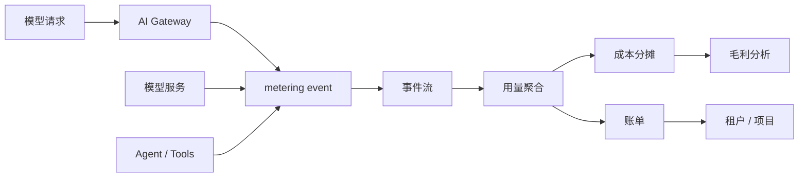

# 第 7 章：计量与计费

## 本章回答的问题

- token 计量为什么是 AI Factory 经济系统的基础？
- input token、output token、reasoning token、工具调用和缓存命中应如何进入计费口径？
- cost per token、revenue per token 和毛利模型如何反向影响平台设计？

## 一个真实场景

一个内部 MaaS 平台上线半年后，GPU 成本持续增长，但没有团队能说清每个业务线消耗了多少。平台只记录请求数，没有记录 input/output token、模型版本、租户、失败请求、stream 中断和 Agent 中间调用。财务只能按部门粗略分摊，业务团队也无法判断某个应用是否值得继续扩容。

计量与计费不是商业化后才需要的功能。只要资源是稀缺的，平台就需要计量；只要多个租户共享资源，就需要成本分摊；只要服务对外收费，就需要账单和毛利模型。

## 核心概念

Metering 是计量，回答“谁用了多少”。Billing 是计费，回答“这些用量应该如何收费或分摊”。Chargeback 是内部收费，showback 是只展示成本不实际收费。AI Factory 的计量对象包括请求、token、模型、租户、GPU 时间、工具调用、检索、存储和网络。

Token 是推理服务最常见的计量单位，但不是唯一单位。Agent 任务、批量推理、微调、embedding、rerank 和工具调用都可能需要额外口径。

## 系统架构



计量事件应尽量靠近真实发生点生成。网关知道租户和请求，模型服务知道实际 token 和结束原因，Agent 平台知道中间调用和工具成本。最终账单需要把这些事件按统一 ID 关联起来。

## 7.1 token 计量

Token 计量需要明确 tokenizer 和模型版本。不同模型 tokenizer 不同，同一段文本的 token 数可能不同。计量系统应记录模型名、模型版本、input token、output token、缓存命中、请求状态和结束原因。

Streaming 场景要处理部分输出。客户端中断时，模型可能已经生成了一部分 token；平台要决定按已生成 token、已发送 token 还是成功完成请求计费。这个口径必须明确，否则会引发财务和用户争议。

## 7.2 input token、output token、reasoning token

Input token 对应输入上下文，主要影响 prefill。Output token 对应生成结果，主要影响 decode。Reasoning token 是部分推理模型内部思考或隐藏推理产生的 token 口径，具体是否暴露和如何计费取决于模型和平台策略。

把 input 和 output 分开计量有工程意义。RAG、长文档总结和 Agent 工具输出会显著增加 input token；长文本生成和代码生成会显著增加 output token。不同成本结构需要不同价格和限流策略。

## 7.3 按模型计费

不同模型的成本不同。大模型、长上下文模型、多模态模型、reasoning 模型和专属部署模型的 GPU、显存、延迟和吞吐差异很大。按模型计费可以让价格更接近成本，也能引导应用选择合适模型。

按模型计费的前提是模型目录和计量系统一致。模型别名、版本、灰度、fallback 和私有模型都可能影响账单。一次请求如果 fallback 到备用模型，账单应记录原始请求模型和实际服务模型。

## 7.4 按租户计费

按租户计费需要把每个请求归属到租户、项目、应用和环境。生产系统中，租户不一定等于公司客户；也可能是内部业务线、团队、项目或成本中心。

租户计费要处理共享资源。一个推理集群服务多个租户时，直接把 GPU 成本按请求数分摊是不准确的。更合理的方式是按 token、模型、SLA、资源池和保留容量综合分摊。对于专属资源池，则可以按资源预留或实际使用计费。

## 7.5 成本分摊

成本分摊要覆盖直接成本和间接成本。直接成本包括 GPU、CPU、内存、存储、网络、电力和第三方模型 API。间接成本包括平台研发、运维、监控、失败重试、空闲容量和折旧。

内部平台可以先从 showback 开始：让每个团队看到自己的 token、模型、成本和趋势。等口径稳定后，再做 chargeback。直接进入强制收费容易引发争议，因为早期计量系统通常还不够准确。

## 7.6 revenue per token

Revenue per token 表示每个 token 带来的收入。对外部 MaaS，这可以来自实际价格；对内部平台，可以用内部结算价、业务价值或成本节省估算。这个指标帮助平台判断某类流量是否值得使用高成本模型或专属资源池。

Revenue per token 不能脱离质量。低价大流量可能毛利很低，高价值场景即使 token 少也值得保障 SLA。平台应按应用和模型维度分析收入，而不是只看总体 token 量。

## 7.7 cost per token

Cost per token 表示生产一个 token 的成本。它受 GPU 价格、利用率、模型吞吐、功耗、机房成本、失败率和平台开销影响。提高 tokens/s、减少空闲、降低失败重试、优化模型和推理引擎，都可能降低 cost per token。

一个简化口径是：

```text
cost_per_token = total_allocated_cost / billable_tokens
```

更精细的口径会按模型、资源池、租户和时间窗口拆分。关键是保持口径一致，避免不同团队用不同公式比较。

## 7.8 毛利模型

毛利模型连接收入和成本：

```text
gross_margin = revenue - cost
margin_rate = (revenue - cost) / revenue
```

在 AI Factory 中，毛利不是纯财务指标，它反向影响技术设计。比如提高 batching 可以降低成本，但可能影响 TTFT；使用更小模型可以降低成本，但可能影响质量；给大客户专属资源池可以提高 SLA，但会降低共享利用率。毛利模型帮助平台把这些取舍显性化。

## 工程实现

计量事件可以采用统一结构：

```json
{
  "event_id": "evt-001",
  "trace_id": "trace-abc",
  "tenant": "team-a",
  "project": "customer-service",
  "model_requested": "af-chat-large",
  "model_served": "af-chat-large",
  "input_tokens": 2380,
  "output_tokens": 642,
  "status": "success",
  "finish_reason": "stop",
  "started_at": "2026-06-18T05:00:00Z",
  "duration_ms": 4820
}
```

事件应进入不可随意修改的日志或事件流，再由聚合任务生成账单。账单结果可以修正，但原始计量事件应可追溯。

## 常见故障

- 只记录请求数，不记录 token，导致成本解释失真。
- 网关和模型服务分别计量但缺少 trace id，无法对账。
- Streaming 中断没有明确计费口径。
- Fallback 后按原模型计费，掩盖真实成本。
- Agent 中间调用未计量，任务成本被低估。
- 免费额度、折扣和内部结算混在原始用量里，导致数据不可复用。

## 性能指标

- 计量完整性：计量事件丢失率、对账差异、延迟入账比例。
- 用量指标：按租户、模型、项目聚合的 input/output token。
- 成本指标：cost per token、GPU allocated cost、失败重试成本。
- 收入指标：revenue per token、账单金额、折扣金额。
- 毛利指标：按模型、租户、资源池、时间窗口的毛利率。

## 设计取舍

计费系统要在实时性和准确性之间取舍。实时预算控制需要快速估算，月度账单需要准确对账。平台可以采用两层模型：在线路径做预算扣减和限流，离线路径做精确聚合和账单结算。

## 小结

- Metering 回答谁用了多少，Billing 回答如何收费或分摊。
- Token 是关键计量单位，但 Agent、工具、embedding、rerank 和专属资源也要进入成本口径。
- input token、output token 和 reasoning token 应分开记录和分析。
- cost per token 和 revenue per token 把工程优化与商业模型连接起来。

## 延伸阅读

- TODO: 云计费系统设计资料
- TODO: FinOps 成本分摊实践
- TODO: LLM token pricing 工程案例
