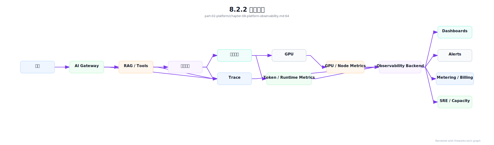
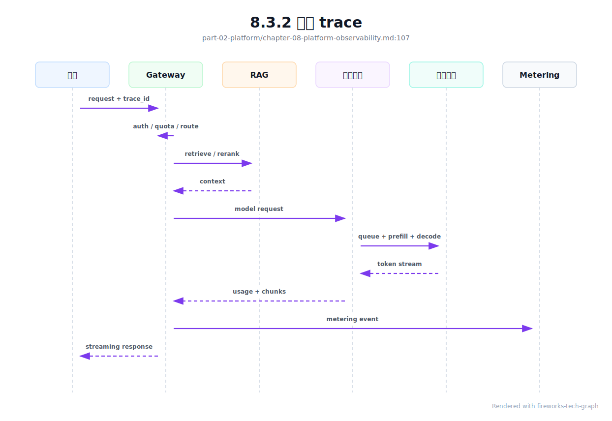
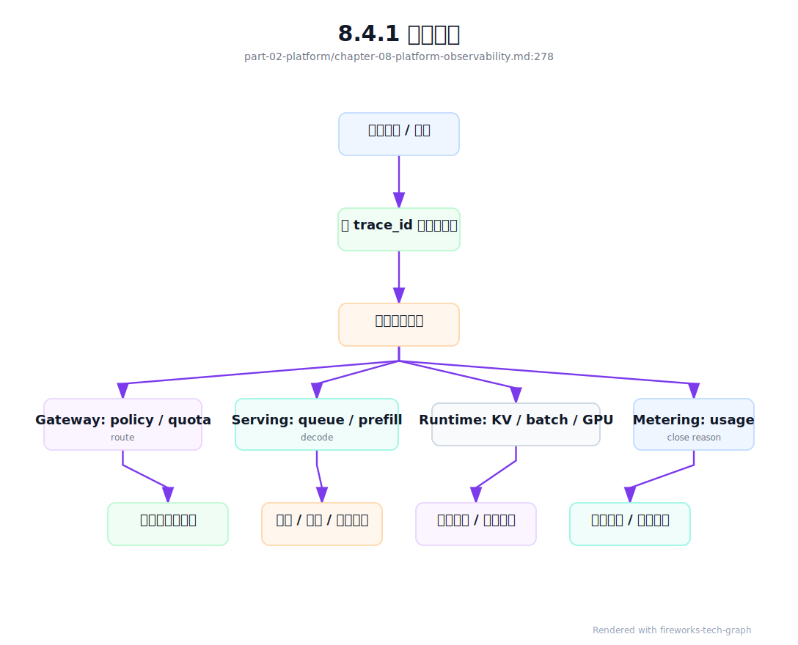

# 第 8 章：AI 平台可观测性

## 8.1 导读

### 8.1.1 本章回答的问题

- AI 平台可观测性为什么不能只看日志、Prometheus 指标和 GPU 利用率？
- 请求 trace、token 指标、TTFT、TPOT、错误码、限流和推理 dashboard 应如何设计？
- 如何让应用、平台、模型服务和基础设施团队看到同一条事实链？


### 8.1.2 本章上下文

- 层级定位：本章属于 `Platform 层`，重点讨论MaaS、AI Gateway、租户治理、计量计费和平台可观测性。
- 前置依赖：建议先理解 第 7 章：计量与计费 中的核心对象和路径。
- 后续关联：本章内容会继续连接到 第 9 章：大模型基础，并在系统地图、深度标准和读者测试中被交叉引用。
- 读完能力：读完本章后，读者应能把《AI 平台可观测性》中的概念映射到 AI Factory 的生产路径、工程对象、观测证据和设计取舍。


### 8.1.3 读者测试

- 机制题：读者能否解释 应用日志、请求 trace、token 指标、TTFT、TPOT、E2E latency 的核心机制，以及它们如何共同支撑《AI 平台可观测性》？
- 边界题：读者能否区分 MaaS/API Gateway/Observability/Billing 与下层 serving/runtime 的责任边界，并说明哪些问题不能简单归因到本章组件？
- 路径题：读者能否从一次 API 请求追到租户、鉴权、路由、限流、计量、账单和观测证据，并指出本章对象在路径中的位置？
- 排障题：当《AI 平台可观测性》相关生产症状出现时，读者能否列出第一层证据、下一跳证据、可能 owner 和止血动作？


### 8.1.4 一个真实场景

一个用户反馈“模型今天很慢”。应用日志显示请求耗时 18 秒，网关指标显示没有 5xx，模型服务指标显示 GPU 利用率正常，基础设施团队也没有看到节点故障。每个团队都能拿出一张看似正常的 dashboard，但没有任何一张图能回答请求到底慢在哪里。最后通过人工翻日志才发现：租户触发了低优先级队列，排队 8 秒；请求携带很长的 RAG context，prefill 6 秒；decode 阶段其实稳定。用户看到的是“慢”，系统内部却包含排队、上下文长度、模型执行和 streaming 多个阶段。

这类问题的难点不在单点指标缺失，而在事实链断裂。应用侧知道用户和业务任务，AI Gateway 知道租户、认证、限流和路由，RAG 服务知道检索和 rerank，模型服务知道 queue、prefill、decode 和 token，GPU 节点知道利用率、HBM 和错误。若这些数据没有同一个 trace id 和统一标签，就只能各查各的。团队之间会围绕“是不是我的系统慢”争论，而不是围绕同一条请求路径定位瓶颈。

AI 平台可观测性的目标，是把一次请求从应用入口到 token 输出的路径还原出来，并能按租户、模型、资源池、版本、错误阶段和基础设施维度聚合。它既服务线上排障，也服务容量规划、SLA 报告、成本归因和账单对账。没有可观测性，平台只能依赖经验扩容；有了可观测性，工程团队才能把“用户觉得慢”拆成可验证的阶段、指标和责任边界。

这也是 AI 平台和传统微服务平台的差异。普通 API 慢，通常优先看服务耗时、数据库和网络；AI 请求慢，还要看 prompt 长度、tokenizer、prefill、decode、batch、KV Cache 和模型路由。一个指标正常不能证明系统健康，只有端到端证据链完整，才能把体验问题转化为工程判断。


## 8.2 基础模型

### 8.2.1 核心概念

可观测性通常包括 logs、metrics 和 traces。Logs 记录离散事件，适合解释单次异常；metrics 描述聚合数值，适合看趋势、告警和容量；traces 连接一次请求或任务跨多个组件的路径，适合定位端到端延迟。AI 平台仍然需要这三类数据，但还要增加 AI-specific 维度：input/output token、TTFT、TPOT、prefill、decode、KV Cache、batching、模型版本、tokenizer、finish reason、限流规则和计量事件。

Trace 是 AI 平台可观测性的骨架。一次 Chat 请求可能经过应用、Gateway、RAG、模型服务、推理引擎、计量和 billing；一次 Agent 任务可能包含十几次模型调用和工具调用。若只记录每个组件的局部日志，很难知道哪个内部调用影响了最终体验。合理的 trace 应把用户请求、模型请求、工具调用和计量事件关联到同一个 request id 或 run id。

Metrics 是容量和告警的基础，但必须带正确标签。模型、租户、项目、资源池、服务等级、状态码和版本都是关键维度。只看全局平均值会掩盖问题：某个 premium 租户的 P99 可能很差，某个新模型的 TTFT 可能异常，某个资源池的 token throughput 可能下降。标签体系不是附属字段，而是可观测数据能否用于决策的前提。

Logs 则承担解释细节的角色。它应记录结构化事件，而不是不可检索的大段文本。对于 prompt、用户输入和模型输出，默认不应进入明文日志；确需调试时，也应有脱敏、采样、授权和保留期限。AI 平台可观测性必须同时考虑排障能力和数据安全，否则观测系统本身会成为泄露风险。

还要区分观测事实和诊断结论。事实是某次请求 input token 很长、排队时间很高、fallback 到另一个模型；结论可能是租户超配额、RAG 拼接过多或资源池容量不足。平台应先保证事实可追溯，再通过 dashboard、告警和 runbook 帮助工程师形成结论。把结论硬编码进日志，反而会掩盖新的故障模式。


### 8.2.2 系统架构

AI 平台可观测性可以分为采集、关联、存储、分析和反馈五层。采集层从应用、Gateway、RAG、模型服务、推理引擎、GPU 节点和计量系统收集 logs、metrics、traces。关联层负责统一 trace id、span id、tenant、project、model、served model、resource pool 等标签。存储层分别承接高基数 trace、时间序列指标、结构化日志和长期账单数据。分析层提供 dashboard、告警、查询和异常检测。反馈层把结论送回限流、路由、扩容、计费和 SRE 流程。

可观测性后端不是一个单独的运维工具，而是 AI Factory 的事实层。排障需要它解释一次请求的慢点；平台运营需要它评估 SLA 和容量；模型团队需要它比较模型版本；计费系统需要它核对 token；安全团队需要它审计异常调用。若每个团队各建一套指标，数据口径会漂移，最终无法做跨团队决策。因此应先定义统一事件和标签规范，再允许各团队构建自己的视图。

系统还要处理数据量和成本。Token、trace、日志和 GPU 指标都可能非常高频，不能无脑全量保留。常见做法是核心 metrics 全量保留，trace 按错误、慢请求和租户采样，日志默认结构化摘要，敏感内容按授权采样。采样策略本身也要可观测：一旦没有命中慢请求样本，平台就无法复盘关键事故。观测成本与排障能力之间必须有明确取舍。

架构上还应避免把可观测性做成“最后接入”的旁路系统。trace id、标签和错误码需要在 API 设计、模型服务接口和计量事件中同步定义；等系统上线后再补，往往只能靠日志拼接和字段猜测。可观测性越早进入架构设计，后续排障、计费和容量规划的成本越低。




## 8.3 关键技术

### 8.3.1 应用日志

应用日志记录的是业务视角，而不是模型服务视角。它应包含用户请求进入应用后的业务动作、调用的模型能力、业务对象、错误处理和最终结果。例如客服场景要记录是否解决问题、是否转人工、是否命中知识库；代码助手要记录建议是否被采纳；办公助手要记录文档生成是否成功。只记录“调用模型成功”无法判断模型是否真正创造了业务价值，也无法解释 token 花在哪里。

应用日志必须传递统一上下文。至少应包含 trace id、tenant、project、application、environment、user group、request type 和业务任务 id。AI Gateway、RAG、模型服务和计量事件都应沿用这些标签。若应用没有传递项目和任务标签，平台只能看到匿名 token 消耗，无法做成本归因；若 trace id 在跨服务调用中丢失，后续排障只能靠时间窗口猜测。

同时，应用日志要严格控制敏感内容。Prompt、用户输入、检索片段、模型输出和工具结果都可能包含个人信息、商业机密或源代码。默认策略应记录结构化摘要、长度、hash、分类和错误原因，而不是明文原文。需要问题复盘时，可以在有授权的租户、时间窗口和采样比例下开启详细日志，并设置保留期限。可观测性不能以牺牲数据边界为代价。

工程上还要避免把日志当成唯一事实源。应用侧感知的是端到端体验，但不知道模型服务实际 token、fallback 和 GPU 阶段。应用日志适合解释用户意图和业务结果，不能替代模型服务指标和计量事件。正确做法是用 trace 把应用日志与平台事实关联起来，让“用户做了什么”“平台如何处理”“模型产生了多少 token”出现在同一条路径上。


### 8.3.2 请求 trace

请求 trace 把一次调用拆成多个 span：应用处理、网关鉴权、配额检查、限流、路由、RAG 检索、rerank、context assembly、模型服务排队、prefill、decode、streaming、计量上报和账单事件。每个 span 应有开始时间、结束时间、状态、错误码和关键 attribute。trace 的价值不只是画链路图，而是把端到端延迟分解成可归责、可优化的阶段。

AI 请求的 trace 需要比普通 HTTP trace 更细。普通微服务通常关注 RPC 延迟和错误；LLM 推理还要拆分 queue time、prefill time、decode time、first token time、tokens generated、finish reason、batch id 和 cache hit。否则 TTFT 高时无法判断是网关排队、长 prompt、KV Cache 分配还是推理引擎调度。模型服务内部阶段越透明，平台越容易把“慢”转化为工程动作。

Agent 和 RAG 让 trace 更重要。一次 Agent 任务可能产生多次模型调用、检索、工具调用、代码执行和外部 API 调用。用户只看到一个任务失败，内部可能是第三次工具调用超时、第四次模型重试或检索结果为空。trace 应支持父子 span，把一次 run 的所有内部调用串起来。这样才能计算任务级成本、任务级成功率和任务级延迟，而不是只统计单次模型请求。

Trace 还要服务采样和审计。全量存储所有请求 trace 成本很高，但只随机采样会错过低频高价值故障。更合理的策略是保留所有错误、慢请求、premium 租户、灰度版本和异常路由的 trace，对正常流量按比例采样。采样决策要在 trace 中记录，便于解释为什么某些请求能复盘、某些只能看聚合指标。

Trace 的另一个价值是建立跨团队共同语言。应用团队看到业务 span，平台团队看到 Gateway span，模型团队看到 prefill/decode span，基础设施团队看到节点和 GPU 关联信息。大家围绕同一条时间线讨论，能显著减少“各自指标正常”的争议。好的 trace 设计，本质上是在组织之间建立事实协议。




### 8.3.3 token 指标

Token 指标是 AI 平台区别于普通 API 平台的核心观测对象。至少应记录 input tokens、output tokens、total tokens、tokens/s、tokens per request、context length、max output tokens、finish reason、cached tokens、reasoning tokens 和 rejected tokens。请求数只能说明调用频率，token 才更接近推理负载、显存压力、延迟和成本。两个租户请求数相同，但一个使用长上下文、一个短问答，对基础设施的影响完全不同。

Token 指标必须按模型、租户、应用、资源池、状态和时间窗口切分。全局平均 input token 可能很稳定，但某个 RAG 应用的 P95 context length 已经接近模型上限；全局 output token 可能下降，但某个代码生成场景长尾明显；全局 tokens/s 可能正常，但 premium 池的吞吐下降。没有维度的平均值适合做宣传，不适合做平台运维。

Token 指标还要和延迟指标关联。input token 增加通常拉长 prefill，output token 增加通常拉长 decode；prefix cache 命中可以降低 prefill，batching 策略会影响 TPOT。若只看 token 总量，无法知道用户体验变化来自输入变长、输出变长、缓存失效还是模型版本变化。Dashboard 应能把 token 分布、TTFT、TPOT 和模型版本放在同一视图。

计量和可观测性的 token 口径也要一致。模型服务用于排障的 token、Gateway 展示给用户的 token、billing 出账使用的 token，至少要能追溯到同一原始事件。若 dashboard 上的用量和账单不一致，用户会质疑平台；若成本分析和推理日志不一致，工程团队会做错优化。token 指标既是性能指标，也是经济指标。

还要关注 token 分布，而不是只看总量。P95 input token 上升，通常预示 RAG 拼接、系统提示词或对话历史管理出了问题；P99 output token 变长，可能意味着产品提示词鼓励模型冗长回答；finish reason 中 length 比例升高，说明 max tokens 设置或上下文策略需要调整。token 指标可以直接指向应用优化。


### 8.3.4 TTFT、TPOT、E2E latency

TTFT 是 Time To First Token，表示从请求发出到首个 token 返回的时间。它包含客户端到网关、鉴权、限流、路由、排队、RAG、prefill 和首个 decode 的时间。对 streaming 应用来说，TTFT 直接影响用户是否觉得系统“开始响应”。TTFT 高并不一定表示 GPU 慢，它可能来自队列、长 prompt、检索慢、模型冷启动或路由到拥挤资源池。

TPOT 是 Time Per Output Token，表示输出阶段平均每个 token 的生成时间，通常用于观察 decode 速度和稳定性。TPOT 高可能与 batch 结构、KV Cache、显存带宽、GPU 负载、模型大小、并发策略和网络发送有关。一个请求 TTFT 正常但 TPOT 高，用户会看到开头很快、后续输出拖沓；这与 TTFT 高的体验和优化方向不同。两者必须分开看。

E2E latency 是端到端耗时，包含应用处理、网关、RAG、模型服务、streaming、客户端消费和后处理。E2E 高但模型侧 TTFT/TPOT 正常，问题可能在应用、检索、工具调用或客户端网络；模型侧指标异常但 E2E 只有轻微变化，可能是输出较短掩盖了局部退化。E2E 是用户视角，TTFT/TPOT 是推理路径视角，二者互补。

实际 dashboard 应同时展示 P50、P95、P99 和分布，而不是只看平均值。AI 请求的输入长度、输出长度和工具调用差异很大，平均延迟容易被短请求稀释。还要区分成功、失败、取消、限流和安全拒绝请求；把失败请求混入延迟分布，会让指标解释困难。延迟指标的目标是定位阶段和人群，而不是给出一个漂亮的全局数字。

延迟指标还要和服务目标绑定。Chat 应用关注 TTFT 和流式稳定性，批量推理关注总吞吐和完成时间，Agent 关注任务级 E2E，RAG 关注检索加模型的组合延迟。不同 workload 使用同一个延迟目标，会导致错误优化。指标要从用户体验反推，而不是从监控系统已有字段出发。


### 8.3.5 错误码

AI 平台错误码应表达失败发生在什么阶段，以及调用方是否应该重试。认证失败、权限拒绝、配额超限、限流、请求过大、上下文过长、模型不可用、后端超时、安全拒绝、工具失败、检索失败、streaming 中断和内部错误，都应有不同语义。把所有失败映射成 500，会让应用无法做正确处理，也会让平台无法统计真实问题来源。

错误码需要分层设计。对外错误码应稳定、可理解，并给出用户可采取的动作；内部错误原因可以更细，记录在 trace 和日志中。例如外部返回“rate_limited”，内部记录命中的租户规则、模型池、当前并发和恢复时间；外部返回“model_unavailable”，内部记录 served model、资源池、实例 id 和失败阶段。外部简洁不等于内部模糊。

错误码还要区分可重试性。配额超限、权限拒绝和请求过大通常不应立即重试；后端短暂不可用、连接中断和部分超时可以按策略重试；安全拒绝需要向用户解释；streaming 中断要记录已生成 token、已发送 token 和中断原因。错误码若不能指导 retry policy，就会导致雪崩式重试或用户体验不一致。

工程实现中，错误码要进入指标、trace、日志和计量。失败请求是否产生 token、是否进入账单、是否触发 fallback，都依赖错误阶段。比如 prefill 后超时与鉴权失败的成本完全不同；工具失败与模型失败的责任边界也不同。错误码不是接口装饰，而是可靠性、成本和用户体验共同依赖的事实字段。

错误码还应有生命周期管理。新增模型能力、RAG 组件或安全策略时，可能需要新增错误语义；废弃错误码时，要保持兼容期，避免应用处理逻辑失效。错误码文档应说明含义、HTTP 映射、是否可重试、是否计费、建议用户动作和内部排查入口。这样错误码才能真正降低协作成本。


### 8.3.6 限流与熔断

限流和熔断是保护 AI 平台的控制机制，也必须可观测。限流可能基于租户、项目、API Key、模型、并发、RPM、TPM、预算、服务等级或资源池容量。每一次限流都应记录规则 id、命中对象、当前用量、阈值、拒绝原因和建议重试时间。否则用户只会看到请求失败，不知道是预算耗尽、并发过高，还是平台正在保护后端。

熔断关注后端健康和影响范围。某个模型池错误率升高时，Gateway 可以停止路由新请求；某个推理引擎实例延迟异常时，负载均衡可以摘除实例；某个租户异常流量激增时，可以只限制该租户，避免影响其他租户。可观测性要能解释熔断触发条件、持续时间、受影响租户、fallback 行为和恢复过程。没有这些数据，熔断会被用户理解为随机失败。

限流指标还应与业务等级结合。免费试用、普通租户、premium 租户和内部关键业务不应共享完全相同的保护策略。平台可以在容量紧张时降低低优先级请求，保留高等级 SLA；但这必须被指标记录并能在事后解释。否则服务等级只是合同文字，无法落到运行时行为。限流观测是 SLA 落地的重要证据。

还要警惕限流与客户端重试相互放大。若错误码没有 retry-after，客户端可能立即重试；若多个应用同时重试，会把短暂拥塞变成持续压力。Dashboard 应显示限流请求、重试请求、fallback 请求和最终成功率之间的关系。只有看到控制机制的副作用，平台才能调整规则，避免保护动作本身造成新的故障。

限流数据还应回到容量规划。长期稳定命中限流，说明需求超过供给或套餐设计不合理；偶发尖峰命中限流，可能只需要客户端退避和队列缓冲。把限流只当失败率处理，会错过需求信号。


### 8.3.7 推理服务 dashboard

推理服务 dashboard 应覆盖四层：请求层、token 层、运行时层和基础设施层。请求层看 QPS、RPM、并发、错误率、状态码、租户和服务等级；token 层看 input/output token、TTFT、TPOT、tokens/s、context length 和 finish reason；运行时层看 queue length、batch size、prefill/decode、KV Cache、cache hit 和模型副本；基础设施层看 GPU、HBM、功耗、节点、网络和存储。

每一层都应有明确问题。请求层回答“谁受影响”；token 层回答“负载为什么变了”；运行时层回答“模型服务如何执行”；基础设施层回答“资源是否健康”。如果 dashboard 只是把所有曲线堆在一起，值班工程师仍然要靠经验寻找入口。好的 dashboard 应按排障路径组织，而不是按数据来源堆叠。

Dashboard 的关键不是图多，而是能沿问题路径下钻。用户说慢，应能从租户 P99 延迟进入某个模型，再看到 TTFT/TPOT 分解，继续下钻到队列、prefill、decode、资源池和节点。账单异常，应能从 token 增长进入应用、模型版本、context length 和请求样本。若每个页面都是孤立图表，排障仍然依赖专家记忆。

Dashboard 必须展示分位数和分布。AI workload 天然长尾明显，平均值经常误导。一个模型平均 TTFT 正常，但少数长上下文请求可能拖垮 premium 租户；平均 GPU 利用率正常，但某个节点可能因错误重试导致 P99 抖动。P50、P95、P99、max、直方图和按状态拆分的视图，比单一平均值更能反映用户体验。

最后，dashboard 要区分实时作战和长期分析。实时页面用于 incident：延迟、错误、限流、容量和资源健康要快速可见；长期页面用于容量规划和成本优化：token 趋势、模型迁移、缓存命中、利用率和 cost per token 更重要。把两类目标混在一页，会让页面既拥挤又难用。成熟平台通常为值班、模型团队、租户运营和财务治理提供不同视图，但共享同一套数据口径。


## 8.4 工程落地

### 8.4.1 工程实现

工程实现的第一步是定义统一语义。建议为模型请求定义稳定的 trace attributes 和 metric labels，例如 tenant、project、application、model requested、model served、model version、tokenizer、resource pool、streaming、input tokens、output tokens、finish reason、error code 和 route policy。这些字段应在应用、Gateway、模型服务、计量和 dashboard 中复用，而不是各系统自定义一套近似名称。

OpenTelemetry 的 Generative AI semantic conventions 提供了一个重要方向：把模型系统中的请求、响应、token 用量、模型名和操作类型纳入统一 telemetry 语义。生产平台不必机械照搬每个字段，但应避免自造完全不同的命名体系。更稳妥的做法是：对外尽量兼容通用语义，对内扩展 AI Factory 需要的租户、资源池、KV Cache、prefill/decode 和账单字段。这样既能接入通用可观测生态，也能保留平台特有维度。

示例 attributes 如下：

```yaml
attributes:
  ai.tenant: team-a
  ai.project: customer-service
  ai.application: support-copilot
  ai.model.requested: af-chat-large
  ai.model.served: af-chat-large
  ai.model.version: "2026-06-01"
  ai.request.stream: true
  ai.tokens.input: 2380
  ai.tokens.output: 642
  ai.finish_reason: stop
  ai.route.pool: inference-premium-a
```

建议把 span 拆成稳定层级。Gateway span 记录 identity、quota、route 和 policy；RAG span 记录 retrieve、rerank 和 context assembly；model serving span 记录 admission、tokenizer、queue、prefill、decode 和 streaming；metering span 记录 usage 和 billing policy。每个 span 只记录自己负责的事实，不要让 Gateway 猜测 GPU 指标，也不要让模型服务猜测业务价值。

```yaml
trace_spans:
  - name: ai.gateway.admit
    attributes: [tenant, project, requested_model, policy_version, quota_rule_id]
  - name: ai.gateway.route
    attributes: [route_pool, endpoint, fallback_state, route_reason]
  - name: ai.rag.retrieve
    attributes: [index, top_k, retrieved_chunks, retrieval_ms]
  - name: ai.serving.tokenize
    attributes: [tokenizer, input_tokens, context_breakdown]
  - name: ai.serving.prefill
    attributes: [prefill_ms, input_tokens, prefix_cache_hit]
  - name: ai.serving.decode
    attributes: [output_tokens, tpot_ms, kv_cache_blocks, finish_reason]
  - name: ai.metering.commit
    attributes: [billable_input_tokens, billable_output_tokens, close_reason]
```

第二步是打通 trace。应用创建或透传 trace id，Gateway 在鉴权、限流和路由阶段创建 span，RAG 和工具服务继承上下文，模型服务继续记录 queue、prefill、decode 和 streaming，计量事件引用同一个 trace id。对于 Agent，应使用 run id 关联多个子请求；对于 batch inference，应使用 job id 和 item id 同时关联任务与单条样本。不同 workload 需要不同粒度，但关联原则相同。

第三步是建立数据质量检查。每天检查 trace 断裂比例、未知模型标签、缺失租户、错误码 unknown、token 与账单差异、指标高基数爆炸和日志脱敏失败。观测数据本身也会出故障，不能默认可信。只有把可观测性当成生产系统运营，平台才能在事故中依赖它，而不是事故后才发现数据缺失。

还应把常见查询固化为 runbook。比如“某租户 TTFT 升高”“某模型 output token 激增”“账单和 dashboard 不一致”“某资源池 P99 抖动”，都应有标准查询路径、关键指标和下一步动作。Runbook 不是替代专家判断，而是让一线值班在事故早期快速收敛范围。可观测性建设的成果，最终要体现在排障时间下降。

上线时建议采用渐进策略。先接入 Gateway 和模型服务的核心 trace，再补 RAG、Agent、工具和 billing；先统一少量强制标签，再扩展团队自定义指标；先覆盖线上排障，再服务成本和容量。一次性设计过大容易延期，缺少统一语义又会留下长期债务。渐进不等于随意，关键是每一步都遵守同一事实模型。

可观测数据还应支持“请求回放式复盘”。复盘不是重放用户隐私内容，而是用结构化事实重建路径：当时的 policy version、route target、served model、input token bucket、queue、prefill、decode、KV Cache、finish reason、error code 和 metering event。这样，即使 prompt 原文不可见，团队也能解释大多数平台故障。对于确需内容诊断的问题，再走授权采样和脱敏流程。

为了让“可排障”和“不泄露”同时成立，平台应生成 `prompt_trace_redaction_record`。它记录一次请求或一次导出中哪些字段被保留、脱敏、哈希、引用化或拒绝导出，并绑定 `data_boundary_policy`、租户、用途、TTL 和审批。这个对象不是日志处理细节，而是可观测性安全边界的证据。没有它，团队很难证明 trace 中没有明文 prompt、RAG chunk、工具参数或用户隐私。

```yaml
prompt_trace_redaction_record:
  redaction_id: ptr-20260620-001
  trace_id: trace-abc
  tenant_id: enterprise-a
  data_boundary_policy: dbp-20260610.3
  purpose: latency_troubleshooting
  fields:
    prompt:
      action: replace_with_ref_and_hash
      ref: object://secure-debug/trace-abc/prompt
      hash: sha256:example
    response:
      action: sampled_redacted_summary
    rag_chunks:
      action: chunk_ids_only
    tool_arguments:
      action: schema_and_hash_only
  access_control:
    allowed_roles: [sre-oncall, tenant-approved-debugger]
    ttl: 7d
    export_approval: required_for_raw_content
  audit:
    security_audit_event: sae-20260620-001
```

这个记录使观测系统可以被审计。事故期间经常会临时扩大日志、导出 trace、转发诊断包；如果没有 redaction record，安全团队只能事后查谁下载了什么，却不知道下载的数据是否已经符合边界。更好的方式是让每次 trace 采集和导出都先产生脱敏决策，再允许查询和传输。对平台工程师来说，这会多一步流程，但能避免可观测性系统成为最大的数据泄露面。




### 8.4.2 常见故障

第一类故障是 trace 断裂。应用、Gateway 和模型服务使用不同 request id，或者异步任务、streaming 和工具调用没有透传上下文，导致端到端路径无法还原。表现是每个组件都有日志，但没有办法证明它们属于同一次请求。修复方向是统一 trace 传播规范，并把 trace id 缺失率作为平台指标。

第二类故障是标签体系混乱。租户叫 tenant、org、account，模型叫 model、deployment、endpoint，资源池叫 pool、cluster、backend，导致查询和 dashboard 口径不一致。标签混乱通常不会立刻造成事故，但会在容量规划、账单对账和 SLA 报告时暴露。平台应维护指标字典和字段版本，禁止随意新增高基数标签。

第三类故障是敏感内容进入日志。Prompt、检索片段、用户文件、模型输出和工具结果可能包含隐私、密钥或代码。为了排障方便而全量记录原文，会把观测系统变成高风险数据湖。正确做法是默认结构化摘要和脱敏，按授权采样详细内容，并把访问审计和保留期限纳入治理。

第四类故障是只有基础设施指标，没有 AI 阶段指标。GPU 利用率正常不代表用户体验正常，HBM 占用正常也不能解释 TTFT。若没有 prefill、decode、queue、KV Cache 和 token 指标，平台只能猜测模型服务是否健康。AI 平台排障必须把用户体验、推理阶段和基础设施指标放在同一条链路上。

第五类故障是告警不可行动。比如“延迟升高”没有租户、模型、资源池和阶段标签，值班只能逐个系统排查；“GPU 利用率低”没有关联队列和请求量，也无法判断是负载下降还是调度异常。告警应指向明确 runbook 和责任域。否则告警数量越多，真正事故越容易被噪声淹没。


### 8.4.3 性能指标

请求层指标包括 QPS、RPM、并发、成功率、错误率、重试率、取消率、fallback 率、限流率和安全拒绝率。这些指标应按租户、项目、模型、服务等级和资源池切分。单独看全局错误率意义有限，因为一个重要租户的错误率升高，可能被大量低价值正常流量稀释。请求层指标回答“谁受影响”和“影响范围多大”。

延迟层指标包括 TTFT、TPOT、E2E latency、queue time、routing time、RAG time、prefill time、decode time、streaming duration 和 client cancel time。它们要展示 P50、P95、P99 和分布。延迟指标回答“慢在哪个阶段”。如果 TTFT 高而 TPOT 正常，优先看排队、prefill 和 RAG；如果 TPOT 高，优先看 decode、batch、KV Cache 和 GPU 访存。

Token 与运行时指标包括 input/output/reasoning tokens、tokens/s、context length、finish reason、batch size、queue length、KV Cache 使用率、cache hit、model replica、engine restart 和 backpressure。它们回答“负载形态是什么”。同样 QPS 下，长上下文和短问答对系统压力完全不同；同样 token 下，低延迟池和批量推理池的目标也不同。

基础设施与数据质量指标包括 GPU 利用率、HBM 占用、功耗、Xid、ECC、网络错误、RDMA 指标、存储延迟、trace 缺失率、未归属事件比例、日志采样率和 token 对账差异。可观测性如果不能检查自身质量，就无法作为事故事实源。高质量 dashboard 应同时告诉你系统状态和数据可信度。

还需要业务结果指标。对客服是解决率、转人工率和满意度；对代码助手是采纳率、回滚率和构建失败率；对 RAG 是引用命中、无答案率和用户追问率。这些指标不直接属于基础设施，却决定 token 是否有价值。AI 平台若只看系统指标，会把“稳定地产生低价值 token”误认为成功。

指标还要有明确 owner。请求指标通常归平台，runtime 指标归模型服务，GPU 和网络指标归基础设施，业务结果归应用。owner 不清，告警就没有行动路径。

下面是一组建议的告警分层。告警不应只通知“慢了”，而应尽量指向阶段和可能 owner。

| 告警 | 触发信号 | 初始 owner | 第一排查入口 |
| --- | --- | --- | --- |
| 租户 TTFT P95 升高 | `ttft_ms` 按 tenant/model 超 SLO | MaaS / Gateway | 路由、配额、queue、prefill |
| Decode 节奏退化 | `tpot_ms` 升高且 output token 分布稳定 | Model Serving | decode batch、KV Cache、GPU/HBM |
| 账单对账漂移 | usage 事件与 billing token 差异超阈值 | Platform / Billing | metering event、close reason、重试 |
| Trace 断裂 | 缺失 trace id 或 span parent 比例升高 | Observability | SDK、Gateway、中间件传播 |
| KV Cache 压力 | cache allocation failure 或 eviction 升高 | Runtime / Serving | context 分布、max seq、资源池 |
| Gateway 策略漂移 | 网关实例策略版本不一致 | Platform SRE | 配置发布、实例同步、回滚 |

这些告警要和 runbook 绑定。比如 TTFT 升高的 runbook 应先切分 queue、prefill 和 Gateway 处理时间；KV Cache 压力的 runbook 应先看 context bucket、active sequence 和近期配置变更。告警缺少 runbook，就会变成信息噪声。


### 8.4.4 设计取舍

第一个取舍是细粒度与成本。记录完整 trace、详细日志和高频 runtime 指标最有利于排障，但存储、查询和合规成本很高；只保留聚合指标成本低，却无法解释单次慢请求和账单争议。常见做法是核心指标全量、trace 条件采样、日志默认脱敏摘要、事故期间临时提高采样。采样策略要可配置、可审计、可回滚。

第二个取舍是统一平台与团队自由度。统一字段、标签和 dashboard 能保证跨团队对账，但可能限制模型团队和应用团队观察特定问题；完全放开则会产生多套口径。更稳妥的做法是定义少量强制字段作为事实层，例如 trace id、tenant、model、token、status 和 resource pool；团队可以在此基础上增加局部指标，但不能改变核心语义。

第三个取舍是隐私保护与排障效率。明文 prompt 对质量排查很有帮助，但风险很高；完全不看内容又会让幻觉、RAG 失配和安全拒绝难以诊断。平台可以采用分级访问：默认只记录长度、类型、hash 和脱敏摘要；授权场景下记录采样原文；高敏租户禁用内容日志。制度和技术要一起设计。

最后是面向人还是面向自动化。人类值班需要清晰 dashboard、告警和 runbook；自动化系统需要稳定指标、阈值和事件流来驱动扩缩容、路由和熔断。若指标只适合人看，平台难以自愈；若指标只服务自动化，人类难以复盘。好的可观测性应同时支持机器决策和工程师判断。

还有一个取舍是短期排障与长期治理。事故期间需要快速定位，允许临时提高采样和打开更细日志；长期治理需要稳定口径，避免指标频繁变化。平台应把临时调试能力和长期报表分开管理，避免事故中的临时字段进入正式口径。这样既能快速排障，也能保持数据资产可信。


## 8.5 小结与延伸阅读

### 8.5.1 小结

- AI 平台可观测性必须把应用、网关、RAG、模型服务、运行时和基础设施串成一条 trace。
- TTFT、TPOT 和 E2E latency 分别定位不同瓶颈，不能混用。
- Token 指标是容量、成本和体验分析的核心。
- 错误码、限流和熔断必须可解释，否则平台治理会变成黑盒。


### 8.5.2 延伸阅读

- [OpenTelemetry documentation](https://opentelemetry.io/docs/)
- [OpenTelemetry GenAI semantic conventions](https://github.com/open-telemetry/semantic-conventions/tree/main/docs/gen-ai)
- [Prometheus documentation](https://prometheus.io/docs/)；[Grafana documentation](https://grafana.com/docs/)
- [vLLM metrics documentation](https://docs.vllm.ai/en/latest/examples/observability/metrics/)
