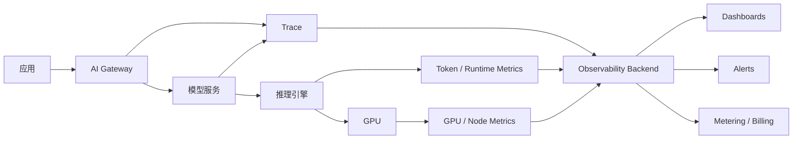
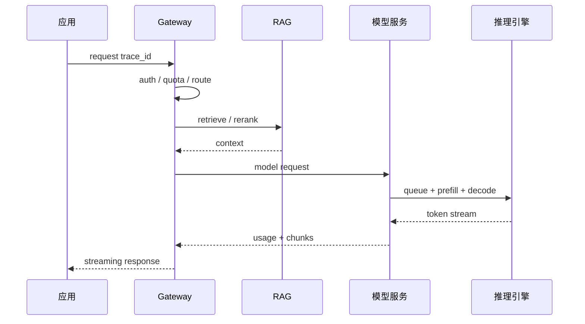

# 第 8 章：AI 平台可观测性

## 本章回答的问题

- AI 平台可观测性为什么不能只看日志、Prometheus 指标和 GPU 利用率？
- 请求 trace、token 指标、TTFT、TPOT、错误码、限流和推理 dashboard 应如何设计？
- 如何让应用、平台、模型服务和基础设施团队看到同一条事实链？

## 一个真实场景

一个用户反馈“模型今天很慢”。应用日志显示请求耗时 18 秒，网关指标显示没有 5xx，模型服务指标显示 GPU 利用率正常，基础设施团队也没有看到节点故障。各团队都觉得自己没问题。最后通过 trace 才发现：租户触发了较低优先级队列，排队 8 秒；请求包含长 RAG context，prefill 6 秒；decode 正常。没有端到端 trace 时，这类问题会变成跨团队扯皮。

AI 平台可观测性的目标是把一次请求从应用入口到 token 输出的路径还原出来，并能按租户、模型、资源池和基础设施维度聚合。

## 核心概念

可观测性包括 logs、metrics 和 traces。Logs 记录离散事件，metrics 描述聚合数值，traces 连接一次请求或任务的跨组件路径。AI 平台还需要 token-level 和 model-level 观测：input/output token、TTFT、TPOT、prefill、decode、KV Cache、batching、限流和计量。

OpenTelemetry 提供了统一的 traces、metrics 和 logs 语义，但 AI 平台还需要定义自己的 span、attribute 和 metric 命名规范。没有统一标签，数据会碎片化。

## 系统架构



可观测性后端需要同时服务排障、容量规划、SLA 报告和计费对账。它不是单纯运维系统，而是 AI Factory 的事实层。

## 8.1 应用日志

应用日志记录用户请求、业务上下文和应用侧错误。AI 平台需要应用在请求中传递 trace id、tenant、project、application、user group 等标签。日志不能记录敏感 prompt 原文，除非有明确合规策略和脱敏机制。

应用日志应记录请求意图和业务结果，例如“客服是否转人工”“代码建议是否被采纳”“RAG 是否有引用”。这些信号是模型质量和业务价值评估的重要来源。

## 8.2 请求 trace

请求 trace 把一次调用拆成多个 span：网关鉴权、限流、路由、检索、rerank、模型服务排队、prefill、decode、streaming 和计量。每个 span 应有开始时间、结束时间、状态和关键 attribute。



Trace 的价值在于拆分“慢在哪里”。没有 trace，只能看到总耗时；有 trace，才能区分网关排队、RAG 慢、模型 prefill 慢还是 decode 慢。

## 8.3 token 指标

Token 指标是 AI 平台特有的核心指标。至少应包括 input tokens、output tokens、total tokens、tokens/s、tokens per request、context length、max output tokens、实际输出长度和 finish reason。

Token 指标要按模型、租户、应用、资源池和状态聚合。只看全局平均值会掩盖问题：某个租户的 RAG 请求可能 input token 远高于平均，某个模型的 output token 分布可能长尾明显。

## 8.4 TTFT、TPOT、E2E latency

TTFT 表示首 token 时间，反映排队、路由和 prefill 等因素。TPOT 表示输出阶段每 token 时间，反映 decode 节奏。E2E latency 是端到端耗时，包含应用、网关、RAG、模型服务、网络和客户端处理。

三个指标要一起看。TTFT 高但 TPOT 正常，可能是排队或长 prompt；TPOT 高但 TTFT 正常，可能是 decode batch、KV Cache 或 GPU 访存问题；E2E 高但模型指标正常，可能是 RAG、工具调用或客户端消费慢。

## 8.5 错误码

AI 平台错误码应区分认证失败、权限拒绝、配额超限、限流、请求过大、模型不可用、后端超时、安全拒绝、工具失败和内部错误。把所有错误都映射成 500 会让应用无法正确处理。

错误码还要区分是否可重试。配额超限不应立即重试；短暂后端不可用可以按策略重试；安全拒绝需要向用户解释；streaming 中断需要记录已输出 token 和中断原因。

## 8.6 限流与熔断

限流和熔断是保护平台的机制，也必须可观测。平台应记录限流规则、命中租户、命中模型、拒绝原因、当前配额和恢复时间。否则用户只会看到“请求失败”，无法知道是预算耗尽、并发过高还是平台保护。

熔断应结合后端健康和业务等级。某个模型池错误率升高时，网关可以停止路由新请求；某个租户异常流量激增时，可以只限制该租户。可观测性要能解释熔断触发条件和影响范围。

## 8.7 推理服务 dashboard

推理 dashboard 应覆盖四层：请求层、token 层、运行时层和基础设施层。请求层看 QPS、错误、延迟、租户；token 层看 input/output、TTFT、TPOT；运行时层看队列、batch、KV Cache、prefill/decode；基础设施层看 GPU、HBM、节点、网络和存储。

Dashboard 不应只有平均值。P50、P95、P99、分租户、分模型、分资源池和分状态的视图更重要。平均 TTFT 正常时，某个 premium 租户的 P99 仍可能不可接受。

## 工程实现

推荐为模型请求定义统一 trace attributes：

```yaml
attributes:
  ai.tenant: team-a
  ai.project: customer-service
  ai.model.requested: af-chat-large
  ai.model.served: af-chat-large
  ai.request.stream: true
  ai.tokens.input: 2380
  ai.tokens.output: 642
  ai.finish_reason: stop
  ai.route.pool: inference-premium-a
```

这些 attributes 应在网关、模型服务、计量和 dashboard 中复用，避免每个系统自定义标签。

## 常见故障

- 应用、网关和模型服务使用不同 request id，trace 断裂。
- 指标只有全局平均值，没有租户和模型维度。
- Prompt 原文直接进入日志，带来数据泄露风险。
- 错误码不区分限流、配额和后端失败。
- 没有记录 prefill/decode，无法解释 TTFT 和 TPOT。
- 计量和可观测性使用不同 token 口径，账单与 dashboard 对不上。

## 性能指标

- 请求：QPS、RPM、并发、成功率、错误率、重试率。
- 延迟：TTFT、TPOT、E2E latency、排队时间、RAG 时间。
- Token：input/output tokens、tokens/s、context length、finish reason。
- Runtime：batch size、queue length、KV Cache 使用、prefill/decode 时间。
- Infra：GPU 利用率、HBM 占用、功耗、网络错误、存储延迟。

## 设计取舍

可观测性要在细粒度和成本之间取舍。记录完整 prompt 最有利于排障，但风险和成本高；只记录聚合指标成本低，但无法诊断质量问题。常见做法是默认记录结构化指标和脱敏摘要，对特定租户、特定时间窗口或明确授权场景开启采样调试。

## 小结

- AI 平台可观测性必须把应用、网关、RAG、模型服务、运行时和基础设施串成一条 trace。
- TTFT、TPOT 和 E2E latency 分别定位不同瓶颈，不能混用。
- Token 指标是容量、成本和体验分析的核心。
- 错误码、限流和熔断必须可解释，否则平台治理会变成黑盒。

## 延伸阅读

- TODO: OpenTelemetry 官方文档
- TODO: Prometheus / Grafana 可观测性资料
- TODO: LLM serving observability 工程案例
