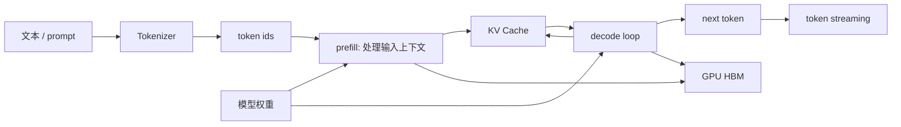

# 第 9 章：大模型基础

## 本章回答的问题

- Transformer、attention、tokenizer、prefill、decode 和 KV Cache 分别在系统中承担什么角色？
- 参数量、上下文长度和显存占用如何影响推理与训练基础设施？
- Dense model 与 MoE model 对调度、服务和成本有什么不同要求？

## 本章上下文

- 层级定位：本章属于 `Model 层`，重点讨论模型训练、后训练、微调、评测和模型服务化。
- 前置依赖：建议先理解 第 8 章：AI 平台可观测性 中的核心对象和路径。
- 后续关联：本章内容会继续连接到 第 10 章：预训练，并在系统地图、深度标准和读者测试中被交叉引用。
- 读完能力：读完本章后，读者应能把《大模型基础》中的概念映射到 AI Factory 的生产路径、工程对象、观测证据和设计取舍。

## 读者测试

- 机制题：读者能否解释 Transformer、attention、tokenizer、prefill 与 decode 的核心机制，以及它们如何共同支撑《大模型基础》？
- 边界题：读者能否区分 模型算法、模型产物、serving release、评测证据和基础设施容量 的责任边界，并说明哪些问题不能简单归因到本章组件？
- 路径题：读者能否从模型产物追到数据、训练、评测、serving release、路由和回滚，并指出本章对象在路径中的位置？
- 排障题：当《大模型基础》相关生产症状出现时，读者能否列出第一层证据、下一跳证据、可能 owner 和止血动作？


## 一个真实场景

平台团队上线一个新模型后，应用侧反馈长文档问答“首 token 很慢”。应用日志只看到端到端延迟变高，推理团队说 GPU utilization 并不低，基础设施团队看到 HBM 占用接近上限，但没有硬件故障。继续拆解后才发现：应用把更多历史对话和 RAG 片段拼进 prompt，input token 大幅增加；prefill 阶段变长，KV Cache 占用变大；模型服务为了避免 OOM 降低并发，排队时间随之上升。用户看到的是一个慢请求，系统内部却同时发生了计算、显存和调度压力变化。

这个场景说明，大模型基础不是抽象数学知识，而是 AI Factory 中资源规划和故障诊断的底层语言。应用的 prompt 设计会影响 token 数，token 数会影响 prefill 和 KV Cache，KV Cache 会影响并发容量，并发容量又会影响队列和 TTFT。若平台团队不了解这些关系，就容易把长上下文导致的瓶颈误判为 GPU 不够，或者把队列等待误判为模型质量问题。

理解本章概念的目标，不是从零推导 Transformer 的全部公式，而是建立工程映射：模型机制如何变成 latency、throughput、HBM、network 和 cost。AI Factory 的很多指标，包括 TTFT、TPOT、tokens/s、cost per token 和 capacity per GPU，最终都会落到这些机制上。只有把模型结构和系统行为连接起来，后续章节的推理引擎、训练框架、调度和验收才有共同语义。

因此，本章要建立一套排障思维：看到 TTFT 变高，先问 input token、prefill 和队列；看到 TPOT 变差，先问 decode、batch 和 KV Cache；看到 GPU 空闲但请求 pending，先问显存、缓存和调度约束；看到账单增长，先问 tokenizer、上下文和输出长度。模型基础不是孤立知识，而是把症状映射到系统层的索引。

## 核心概念

大语言模型（Large Language Model, LLM）把文本表示成 token 序列，并学习在给定上下文下预测下一个 token。现代 LLM 大多基于 Transformer 架构，由多层 block 堆叠而成。推理时，模型先处理输入上下文，再逐 token 生成输出；训练时，模型在大规模数据上计算 loss，并通过反向传播更新参数。这个过程看起来是语言任务，本质上是高密度矩阵计算、显存访问、缓存管理和分布式通信。

Token 是模型处理文本的基本单位。Tokenizer 把文本变成 token id，也把输出 token id 还原为文本。Attention 让模型在处理当前 token 时引用上下文中的其他 token。Prefill 是处理输入上下文的阶段，decode 是逐步生成输出的阶段。KV Cache 保存历史 token 的 Key 和 Value，避免每次生成新 token 时重复计算完整上下文。这些概念共同决定一次请求如何消耗 GPU。

从系统视角看，模型参数、上下文长度、并发序列数和数据类型共同决定显存压力。参数需要常驻 HBM，KV Cache 随请求上下文和并发增长，临时 buffer 和 runtime 开销也会占用空间。训练还要保存 optimizer state、gradient 和 activation。推理和训练使用同一类模型，但资源模型完全不同。把“模型能放进显存”当作容量规划结论，是常见错误。

模型类型也影响基础设施。Dense model 通常每个 token 激活大部分参数，计算路径稳定；MoE model（Mixture of Experts）每个 token 路由到部分 expert，降低单 token 计算量的同时引入路由、负载均衡和通信问题。模型结构不是只属于算法团队的选择，它会影响模型服务、GPU 拓扑、并行策略、监控指标和成本模型。

这些概念还构成团队协作边界。模型团队描述架构、tokenizer 和上下文能力；推理团队把它们转化为 serving 参数；平台团队据此制定路由、配额和计量；应用团队用这些边界设计 prompt 和产品体验。若概念不统一，同一个“模型慢”会被不同团队解释成完全不同的问题。

## 系统架构

一次 LLM 推理可以看作从文本到 token、从 token 到矩阵计算、再从计算结果回到文本的流水线。应用提交 prompt 后，服务端使用对应模型的 tokenizer 计算 token ids；模型读取权重，在 prefill 阶段处理所有 input token，并建立 KV Cache；随后 decode loop 每次根据已有上下文生成一个或一组新 token；token streaming 把结果逐步返回给应用。这个流水线的每一段都对应不同资源瓶颈。

架构上要区分模型语义路径和资源路径。语义路径描述用户文本如何变成输出文本；资源路径描述权重、activation、KV Cache、kernel、HBM 和 GPU compute 如何被使用。AI Factory 的平台层通常看到的是 request、token、latency 和 error；Runtime 层看到的是 batch、cache、kernel 和 memory；GPU IaaS 层看到的是设备、驱动、HBM 和故障。模型基础知识把这些视角连接起来。

还要注意推理路径中的状态。普通 HTTP 请求通常是无状态的，而 LLM streaming 请求在 decode 期间会持续持有 KV Cache、连接和调度位置。一个客户端取消请求，可能释放连接但模型服务仍需正确释放缓存；一个长上下文会话，可能让服务实例在很长时间内承担高 HBM 压力。状态管理失败会表现为 OOM、吞吐下降或尾延迟变差。

这条架构也说明观测点应放在哪里。Tokenizer 后要记录 input token，prefill 后要记录首 token 前的阶段耗时，decode 期间要记录 output token 和 TPOT，缓存管理要记录 KV Cache 使用和释放，streaming 结束要记录 finish reason 和取消原因。没有这些观测点，系统图只是一张逻辑图，无法支撑生产排障。

同一架构还适用于训练理解，只是路径方向不同。训练时 token 序列进入模型后要计算 loss、保存 activation、执行 backward，并通过 optimizer 更新权重；推理时权重固定，系统主要围绕低延迟和高吞吐组织执行。二者共享 Transformer 和 tokenizer，但状态、显存和通信模型不同。后续章节会分别展开。



## 9.1 Transformer

Transformer 是一种基于 attention 的神经网络架构。它的核心优势是能够在序列内部建立 token 之间的依赖关系，并且相比早期循环结构更适合大规模并行训练。一个典型 Transformer block 包含 attention、MLP、normalization 和 residual connection。LLM 通过堆叠很多 block，把 token embedding 逐层变换为能够预测下一个 token 的表示。

对 AI Infra 工程师来说，Transformer 的重要性在于它决定计算形态。模型的大部分计算会表现为矩阵乘、attention 计算、非线性激活和归一化操作。训练阶段需要保存中间 activation 用于反向传播；推理阶段需要高效加载权重、执行 kernel，并维护 KV Cache。不同优化技术虽然名字不同，但很多都是围绕这些计算和内存访问路径展开。

Transformer 的层数、hidden size、attention head、MLP 大小和词表规模都会影响参数量、计算量和显存占用。参数量越大，权重加载和 HBM 常驻压力越高；层数越多，decode 每步经过的计算链越长；上下文越长，attention 相关开销和 KV Cache 压力越明显。模型配置因此会直接进入容量规划和服务选型。

工程上不需要把 Transformer 简化成“参数越大越好”。大模型可能提高能力，但也提高延迟、成本和服务复杂度；小模型可能更适合低延迟、高并发或垂直场景；蒸馏、量化和 MoE 则提供不同取舍。AI Factory 的模型层应把架构信息转化为模型目录、推理 profile 和验收基线，让上层应用知道能力边界，让下层平台知道资源需求。

Transformer 还决定了许多工程优化的边界。Kernel fusion、量化、并行切分、activation checkpointing 和推理引擎优化都在利用其计算结构的规律。平台不必让每个工程师都成为算法研究者，但需要理解哪些优化会改变数值精度，哪些只改变执行效率，哪些会影响模型输出稳定性。否则性能优化可能和质量回归混在一起。

## 9.2 attention

Attention 让模型在处理当前 token 时关注上下文中的其他 token。典型 self-attention 会为每个 token 生成 Query、Key 和 Value，再根据 Query 与 Key 的相关性加权聚合 Value。直观地说，模型不是孤立地看当前词，而是在上下文中寻找相关信息。这个机制让 LLM 能处理长距离依赖，也让上下文长度成为重要工程变量。

Attention 的工程影响首先体现在长上下文。输入越长，prefill 阶段需要处理的 token 越多，attention 相关计算和内存访问越重；生成越长，decode 阶段需要不断引用更长的历史上下文。虽然现代实现会通过 kernel 优化、cache 和分页管理降低开销，但长上下文仍然不是免费能力。应用把所有历史和检索结果都塞进 prompt，会直接转化为 GPU 压力。

许多推理优化都围绕 attention 展开。FlashAttention 关注 attention 计算的 I/O 效率；paged attention 关注 KV Cache 的分页和复用；prefix cache 关注重复前缀的缓存命中；speculative decoding 则通过候选 token 加速 decode。理解 attention，可以帮助平台团队判断优化到底解决的是计算、访存、缓存还是调度问题。

排障时，attention 相关问题常表现为 TTFT 上升、HBM 压力增加、长上下文请求挤压短请求、TPOT 抖动或 OOM。诊断入口不是只看 GPU utilization，而是同时看 input token 分布、prefill time、KV Cache 使用率、batch composition 和请求队列。Attention 是模型能力来源之一，也是长上下文成本来源之一。

设计应用时，也要尊重 attention 的成本边界。RAG 不应把所有候选文档无差别拼进 context，Agent 不应无限追加历史，办公助手不应默认携带整份文档。更好的做法是用检索、摘要、窗口裁剪和缓存控制上下文质量。Attention 能让模型利用上下文，但不会替平台免费筛选上下文。

## 9.3 tokenizer

Tokenizer 把文本转换成 token ids，也把模型输出的 token ids 转回文本。它决定同一段文本在模型中被切成多少 token，以及哪些字符、词片段或字节序列能被表示。不同模型可能使用不同 tokenizer，同一段中文、英文、代码或符号文本的 token 数会不同。因此 tokenizer 是上下文长度、限流、计量和账单的基础口径。

Tokenizer 的不一致会制造很多平台问题。应用侧用一个 tokenizer 估算没有超限，服务端用另一个 tokenizer 计算后拒绝；计量系统按请求模型统计 token，fallback 后实际服务模型 tokenizer 不同；模型升级时 tokenizer 变化，导致 token 数、成本和上下文利用率同时变化。若平台没有记录 tokenizer 版本，很多账单和性能变化都会变得难以解释。

在 MaaS 平台中，模型目录应明确 tokenizer、context window、特殊 token、chat template 和截断策略。Chat template 也会影响 token 数，因为系统提示词、角色标记、工具 schema 和多轮历史都会被序列化成模型输入。应用看到的是 messages，模型服务看到的是完整 token 序列。两者之间的转换必须可追溯。

工程实现上，应为每个模型提供官方或平台验证过的 token counting 方法，并在 Gateway、模型服务、计量和开发者工具中保持一致。对于长文档、RAG 和 Agent，应在请求进入模型前给出 token 预算和截断策略。Tokenizer 不是前端小工具，而是 AI Factory 中连接体验、容量和经济性的基础组件。

Tokenizer 还影响多语言和代码场景的成本解释。某些文本在一个 tokenizer 下很紧凑，在另一个 tokenizer 下会被切得更碎；代码、表格、日志和符号密集文本尤其容易出现差异。平台若支持模型路由或 fallback，就必须意识到 tokenizer 变化会改变上下文利用率和费用，而不只是改变模型名称。

## 9.4 prefill 与 decode

Prefill 是模型处理输入上下文的阶段。模型把所有 input token 经过 Transformer 前向计算，生成每一层后续 decode 所需的 KV Cache。这个阶段通常与输入长度强相关，长 prompt、长 RAG context 和长对话历史会直接增加 prefill 时间。用户感知上的首 token 时间（TTFT）常常受到 prefill、排队和路由共同影响。

Decode 是逐 token 生成输出的阶段。每一步根据当前上下文和 KV Cache 计算下一个 token，再把新的 Key/Value 追加到缓存中。Decode 的特点是循环多、单步计算粒度小、对 KV Cache 访问敏感。输出越长，decode 循环越久；并发越高，调度器越需要在不同序列之间平衡吞吐和延迟。TPOT 通常更能反映 decode 阶段的节奏。

Prefill 和 decode 的资源特征不同，因此需要不同优化。Prefill 更适合大块并行计算，关注长输入、batching 和算力利用；decode 更关注持续调度、cache 命中、访存效率和流式输出稳定性。把两者混在一个平均延迟里，会掩盖瓶颈。一个系统可能 prefill 很慢但 decode 稳定，也可能首 token 很快但后续输出拖沓。

工程上还会出现 prefill/decode 分离（PD 分离）等架构。它把 prefill 和 decode 放到不同资源池或服务路径中，试图分别优化吞吐、延迟和缓存管理。但这种设计会引入更复杂的状态转移、网络传输和调度逻辑。是否采用 PD 分离，应基于 workload、模型大小、长上下文比例和运维复杂度，而不是把它当作默认答案。

容量规划也应分别估算 prefill 和 decode。长输入短输出的 RAG 问答，瓶颈可能在 prefill；短输入长输出的写作和代码生成，瓶颈可能在 decode；交互式 Chat 则同时关心首 token 和输出节奏。把所有请求折算成平均 token，会让资源池设计失真。正确做法是建立 workload profile。

## 9.5 KV Cache

KV Cache 保存历史 token 在各层 attention 中的 Key 和 Value，避免 decode 阶段每生成一个 token 都重新计算完整上下文。没有 KV Cache，长输出的重复计算会非常昂贵；有了 KV Cache，模型可以把历史上下文以缓存形式复用。它是现代 LLM 推理服务的核心状态，也是推理并发容量的关键约束。

KV Cache 的占用与模型层数、hidden size、并发序列数、上下文长度、输出长度和数据类型相关。它不是固定开销，而是随着请求生命周期增长。一个服务实例的权重可能能放进 HBM，但在高并发、长上下文或长输出时，KV Cache 可能先耗尽显存。此时 GPU 还有计算余量，也无法继续接收请求。这就是推理容量不能只看权重大小的原因。

KV Cache 还带来调度问题。不同请求的上下文长度和输出长度不同，缓存分配会产生碎片；streaming 请求持续占用缓存，客户端取消需要及时释放；prefix cache 命中可以节省 prefill，但需要管理缓存生命周期和隔离边界；多租户共享服务时，还要防止缓存状态泄露。缓存系统因此既是性能组件，也是隔离组件。

排障时，KV Cache 问题常表现为吞吐下降、OOM、请求被拒绝、长尾延迟上升或 batch size 被迫降低。关键指标包括 KV Cache 使用率、block/page 分配失败、cache hit、active sequence、context length 分布、HBM 峰值和碎片情况。把 KV Cache 作为一等资源观测，是推理平台成熟的标志。

KV Cache 还会影响多租户策略。Premium 租户的长会话可能长期占用缓存，普通租户的短请求可能因此排队；Agent 任务可能因为内部多轮调用放大缓存压力；批量推理则可能通过更规则的长度分布提高缓存利用。调度器若只按 GPU 数量和 QPS 决策，就无法表达这些差异。

## 9.6 参数量、上下文长度、显存占用

参数量描述模型权重规模，通常影响模型能力、显存占用和计算量。上下文长度描述模型一次能处理的 token 窗口，影响应用能力、prefill 成本和 KV Cache。显存占用则由权重、KV Cache、临时 buffer、runtime 开销、碎片和框架保留空间共同组成。三者相关，但不能互相替代。知道参数量，不等于知道可服务并发。

推理显存模型通常要先放下权重，再为 KV Cache 和运行时预留空间。量化可以降低权重占用，但不一定等比例降低 KV Cache；长上下文会扩大缓存压力；更高并发会增加 active sequence 和 cache 分配。模型服务为了避免 OOM，可能限制 max context、max batch、max output 或并发数。这些限制最终会体现为应用能力和 SLA 边界。

训练显存模型更加复杂。除了权重，还要考虑 gradient、optimizer state、activation、通信 buffer 和并行策略。activation checkpointing 可以降低激活保存开销，但会增加重算；ZeRO、FSDP、tensor parallel 和 pipeline parallel 会改变参数和状态在 GPU 之间的分布。推理能跑，不代表训练能跑；小规模 fine-tuning 能跑，也不代表预训练能跑。

容量规划应使用模型 profile，而不是只用“参数量 × 字节数”的粗略公式。Profile 至少要包含架构类型、数据类型、上下文窗口、并行方式、KV Cache 策略、目标并发、输入输出分布和安全余量。模型上线前的准入测试，也应验证真实 workload 下的 HBM 峰值、OOM 边界和延迟分布。

还要区分理论上限和生产上限。模型文档中的 context window 是能力边界，不等于平台必须允许所有租户都使用最大窗口；显存看起来还有余量，也不代表可以继续提高并发，因为碎片、突发长输出和重试都会消耗空间。生产系统需要为尾部请求和故障恢复保留安全余量。

## 9.7 dense model 与 MoE model

Dense model 通常在每个 token 上激活大部分参数，计算路径相对稳定，负载更容易预测。它的优点是实现和服务较直接，batch 行为、并行策略和延迟特征更容易建模；缺点是模型能力增长往往伴随更高计算和显存成本。许多通用推理平台先支持 dense model，是因为它的系统行为更可控。

MoE model（Mixture of Experts）包含多个 expert，每个 token 通过 router 选择部分 expert 参与计算。它可以在较大总参数量下控制每个 token 的实际计算量，但系统复杂度明显增加。训练时需要 expert parallel、负载均衡和跨 GPU 通信；推理时 expert 命中分布不均可能造成尾延迟，热门 expert 可能成为瓶颈。

MoE 的资源规划不能只看总参数量或激活参数量。总参数量影响权重存放和模型加载，激活参数量影响单 token 计算，expert 分布影响通信和负载均衡，router 行为影响稳定性。模型服务需要观测 expert hit rate、expert load imbalance、routing latency、all-to-all 通信和 fallback 行为。没有这些指标，MoE 故障很难定位。

Dense 与 MoE 的选择应回到应用目标。若业务需要低延迟、稳定输出和简单运维，dense model 可能更容易落地；若需要更大能力规模，并且平台具备并行通信和负载治理能力，MoE 可能提供更好的能力成本比。MoE 不是免费扩展，它把一部分计算成本转化为路由、通信和调度复杂度。

模型目录也应暴露这种差异。对应用开发者来说，dense 或 MoE 不一定是选择模型的第一语言，但平台至少应说明延迟特征、上下文能力、稳定性边界和适用场景。对平台团队来说，模型类型必须进入路由、验收和可观测性。否则 MoE 的 expert 问题会被误认为普通模型服务抖动。

## 工程实现

模型接入 AI Factory 前，应形成可执行的 model profile。它不是论文摘要，而是模型目录、推理服务、容量规划、验收和计费共同使用的工程合同。Profile 至少包括 architecture、model type、tokenizer、context window、数据类型、并行方式、支持的 API 能力、KV Cache 策略、推荐资源池和已知限制。没有 profile，模型上线就只能靠口头经验和临时压测。

一个简化 profile 可以这样表达：

```yaml
model_profile:
  name: af-chat-large
  architecture: transformer
  type: dense
  tokenizer: tokenizer-name
  context_window: documented_by_model_owner
  serving:
    supports_streaming: true
    supports_tool_calling: true
    kv_cache_required: true
  infra_notes:
    weights_memory: estimate_required
    kv_cache_policy: paged
    preferred_parallelism: tensor_parallel
```

Profile 还应包含测试结果。比如在标准输入分布、长上下文分布和压力场景下的 TTFT、TPOT、tokens/s、HBM 峰值、KV Cache 使用率和 OOM 边界。这里不需要把示例数值写成通用结论，但必须在平台内部保留可复现实验。模型上线不是复制权重文件，而是把模型行为登记为可运营对象。

工程流程上，模型团队负责提供架构、tokenizer、能力和限制，推理团队负责验证服务参数，平台团队负责把 profile 接入模型目录、路由、计量和告警。任何变更，如 tokenizer、chat template、context window、量化方式或推理引擎版本，都应更新 profile 并触发必要验收。Profile 是模型变更管理的锚点。

最小落地流程可以很简单：先登记 profile，再用标准 prompt 集和压力集跑基线，随后把结果写入模型目录，最后在灰度期间对比线上 TTFT、TPOT、错误率和 token 分布。关键不是文档多复杂，而是模型上线必须留下可复查的证据。没有证据的上线，后续所有排障都会回到猜测。

验收时还应覆盖边界输入。短 prompt、长 prompt、长输出、streaming 取消、工具调用、异常字符、多语言、代码和超限请求都应进入测试集。模型基础能力只有在这些边界下稳定，才能被平台承诺给应用。只跑少量正常样例，无法发现 tokenizer、KV Cache 和输出格式问题。

## 常见故障

第一类故障是 tokenizer 口径不一致。应用估算 token 未超限，服务端拒绝；账单 token 与 dashboard token 不一致；模型升级后 token 数变化却没有变更说明。排查时应确认 requested model、served model、tokenizer version 和 chat template，而不是只看用户原始文本。

第二类故障是显存估算过于乐观。团队只计算权重占用，忽略 KV Cache、临时 buffer、runtime 预留和碎片，压测短 prompt 时正常，上线长上下文后 OOM。排查入口包括 HBM 峰值、KV Cache 使用、active sequence、context length 分布和 OOM 前的 batch 变化。

第三类故障是长短请求混部。长上下文请求占用大量 prefill 和缓存，短请求被排队，导致整体 P99 变差。解决方向可能是按上下文长度路由、独立资源池、调度优先级、prefix cache 或限制应用拼接。简单扩容 GPU 不一定解决尾延迟。

第四类故障是 MoE 负载不均。某些 expert 命中过高，导致部分 GPU 或通信链路成为瓶颈，全局 GPU utilization 看起来正常，但 TPOT 长尾明显。排查需要 expert 级指标和通信指标。MoE 平台若只沿用 dense model 监控，很多问题会被平均值掩盖。

第五类故障是模型能力变更没有同步到应用。比如 chat template 调整后工具调用格式变化，context window 调整后旧应用仍按原策略拼接，量化版本上线后少数领域质量下降。这类故障不一定表现为 5xx，却会表现为业务结果下降。模型基础信息必须进入变更通知和回滚流程。

排障时要避免单一归因。TTFT 高可能是模型长、prompt 长、队列长或缓存不足；OOM 可能是并发高、长输出、碎片或配置错误；质量下降可能来自模型版本、tokenizer、模板或解码参数。成熟流程应先收集事实，再缩小范围，而不是让某个团队凭经验背锅。

## 性能指标

模型基础指标包括 architecture、参数量、层数、hidden size、context window、tokenizer、dense/MoE 类型和支持能力。这些指标回答模型是什么。它们应进入模型目录和 model profile，而不是散落在文档和实验脚本中。没有基础指标，应用和平台无法对齐能力边界。

推理指标包括 TTFT、TPOT、prefill time、decode time、tokens/s、request throughput、active sequence、batch size、queue time 和 streaming cancel rate。这些指标回答模型服务如何运行。它们应按模型、版本、资源池、租户和上下文长度切分，避免平均值掩盖长尾。

显存与缓存指标包括权重占用、KV Cache 使用、HBM 峰值、cache hit、cache allocation failure、碎片、OOM 次数和实例重启。它们回答容量是否健康。对长上下文和高并发场景，KV Cache 指标往往比单纯 GPU utilization 更能解释瓶颈。

质量与经济指标包括基础 benchmark、领域评测、安全评测、单位 token GPU 时间、cost per token、tokens/W 和不同模型版本的质量成本曲线。这些指标回答模型是否值得上线和扩容。模型基础指标最终要服务取舍：能力、延迟、成本和可靠性是否匹配应用目标。

指标还要分离实验口径和线上口径。实验环境可以用固定数据集和固定并发比较模型版本，线上环境必须按真实租户、真实输入长度和真实服务等级观察。两类指标都重要：实验口径保证可复现，线上口径保证贴近业务。只看其中一种，都会让模型判断失真。

指标应进入发布门禁。新模型或新推理配置上线前，至少要和上一版本比较延迟、显存、错误、token 分布和关键评测；上线后继续观察灰度租户。若指标没有门禁，只在事故后查看，就失去了预防价值。模型基础指标的最终用途，是让变更可控。

## 设计取舍

第一个取舍是模型规模与服务成本。更大模型可能带来更强能力，但也带来更高显存占用、更低并发、更高延迟和更复杂并行。对于高价值复杂任务，大模型可能合理；对于高频简单任务，小模型、蒸馏模型或路由到不同模型可能更经济。模型选型应按任务价值和服务等级决定，而不是按参数量排序。

第二个取舍是长上下文与系统效率。长上下文能减少外部检索和多轮交互，提升某些应用能力；但它会增加 prefill、KV Cache 和成本。RAG、摘要、历史裁剪和 prefix cache 都是在应用能力和系统效率之间做平衡。平台应让应用看到 token 成本，而不是把长上下文当作无限资源。

第三个取舍是 dense 与 MoE。Dense 行为稳定、服务简单，但规模扩展成本高；MoE 可能提供更好的能力成本比，但引入 router、expert 负载和通信复杂度。若平台缺少 expert 监控、拓扑感知调度和通信诊断，MoE 的理论优势可能在生产中被尾延迟和故障成本抵消。

最后是通用模型与专用模型。通用模型便于统一平台和开发体验，专用模型可能在特定场景中更便宜、更快或更安全。AI Factory 不应只追求一个最大模型，而应建立模型组合、路由和评测机制。模型基础知识的作用，就是让这些选择有工程依据。

这些取舍没有永久答案。模型、推理引擎、硬件和业务场景都会变化，今天合理的上下文长度、量化策略或模型路由，半年后可能需要调整。平台应把取舍固化为可观察、可回滚的策略，而不是写死在应用代码中。可演进性本身也是设计目标。

## 小结

- LLM 的工程本质是 token 序列上的矩阵计算、显存访问和缓存管理。
- Prefill 影响首 token，decode 影响输出节奏，KV Cache 决定并发容量。
- Tokenizer 是计量、上下文和兼容性的基础口径。
- Dense 与 MoE 对服务、调度和通信的要求不同。

## 延伸阅读

- [Attention Is All You Need](https://arxiv.org/abs/1706.03762)
- [Stanford CS224N: Natural Language Processing with Deep Learning](https://web.stanford.edu/class/cs224n/)
- [PagedAttention / vLLM paper](https://arxiv.org/abs/2309.06180)
