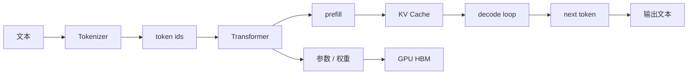

# 第 9 章：大模型基础

## 本章回答的问题

- Transformer、attention、tokenizer、prefill、decode 和 KV Cache 分别在系统中承担什么角色？
- 参数量、上下文长度和显存占用如何影响推理与训练基础设施？
- Dense model 与 MoE model 对调度、服务和成本有什么不同要求？

## 一个真实场景

平台团队上线一个新模型后，应用反馈长文档请求首 token 很慢，推理团队说 GPU 利用率不低，基础设施团队看到 HBM 占用接近上限。排查发现不是“模型坏了”，而是应用输入上下文变长后，prefill 计算和 KV Cache 占用同时上升；模型服务为了避免 OOM 降低并发，导致队列等待增加。

理解大模型基础，不是为了从零推导所有数学公式，而是为了知道模型机制如何变成 AI Factory 中的资源、延迟和成本约束。

## 核心概念

大语言模型（Large Language Model, LLM）把文本表示成 token 序列，并学习在给定上下文下预测下一个 token。现代 LLM 大多基于 Transformer 架构。推理时，模型先处理输入上下文，再逐 token 生成输出。训练时，模型通过大规模数据和反向传播更新参数。

从工程角度看，LLM 的关键不是“会说话”，而是它把请求转化为矩阵计算、显存访问、缓存管理和网络通信。AI Factory 的上层指标 TTFT、TPOT、tokens/s、cost per token，最终都会落到这些机制上。

## 系统架构



这条路径解释了为什么应用层的 prompt 会影响 GPU 层。文本越长，token 越多；token 越多，prefill 越重；输出越长，decode 循环越久；并发越高，KV Cache 越大。

## 9.1 Transformer

Transformer 是一种基于 attention 的神经网络架构。它的核心特点是可以并行处理序列中的 token，并通过 attention 机制建模 token 之间的关系。LLM 通常由多层 Transformer block 堆叠而成，每一层包含 attention、MLP、归一化和残差连接等结构。

对 AI Infra 工程师来说，Transformer 的重要性在于它决定计算形态：大量矩阵乘、attention 计算、激活存储和参数访问。训练时需要保存中间激活用于反向传播；推理时需要高效加载权重并维护 KV Cache。

## 9.2 attention

Attention 让模型在处理当前 token 时关注上下文中的其他 token。典型 self-attention 会生成 Query、Key、Value，并根据 Query 与 Key 的相似度加权聚合 Value。上下文长度越长，attention 的计算和缓存压力越大。

工程上，attention 是长上下文和推理优化的核心。FlashAttention、paged attention、KV Cache、prefix cache 等技术都围绕 attention 的计算和内存访问展开。理解 attention，有助于解释为什么长 prompt 的成本不是线性无感增长。

## 9.3 tokenizer

Tokenizer 把文本转换成 token ids，也把模型输出的 token ids 转回文本。不同模型使用不同 tokenizer，因此同一段文本在不同模型下 token 数可能不同。计量、上下文长度、截断和账单都依赖 tokenizer 口径。

Tokenizer 是平台兼容性的隐性边界。MaaS 平台如果支持多个模型，就必须明确每个模型的 token 统计方式。应用侧估算 token 时，也应使用对应模型 tokenizer，否则会出现“本地估算未超限，服务端拒绝”的问题。

## 9.4 prefill 与 decode

Prefill 是处理输入上下文的阶段。模型对所有 input token 做前向计算，并生成后续 decode 所需的 KV Cache。Decode 是逐 token 生成输出的阶段，每一步读取已有 KV Cache，生成一个或一小组新 token。

Prefill 和 decode 的性能瓶颈不同。Prefill 更像大块并行计算，受输入长度影响明显；decode 是小步循环，受 batch、KV Cache 访问、调度和 kernel 启动影响。TTFT 常受 prefill 和排队影响，TPOT 更多反映 decode 节奏。

## 9.5 KV Cache

KV Cache 保存历史 token 的 Key 和 Value，避免每次 decode 重新计算完整上下文。它显著提升生成效率，但消耗 GPU HBM。模型层数、hidden size、上下文长度、并发序列数和数据类型都会影响 KV Cache 占用。

KV Cache 让推理容量从“模型权重能不能放下”变成“权重 + 并发缓存能不能放下”。一个服务实例可能还有算力余量，却因为 KV Cache 空间不足无法接收更多请求。推理调度必须把 KV Cache 作为一等资源看待。

## 9.6 参数量、上下文长度、显存占用

参数量决定模型权重规模，影响加载时间、显存占用和计算量。上下文长度影响 prefill、attention 和 KV Cache。显存占用由权重、KV Cache、临时 buffer、框架开销和碎片共同组成。

容量规划不能只用“模型参数量 × 数据类型字节数”估算。生产推理还要预留 KV Cache 和 runtime buffer；训练还要考虑 optimizer state、gradient、activation 和通信 buffer。对于同一个模型，训练显存和推理显存需求完全不同。

## 9.7 dense model 与 MoE model

Dense model 每次推理通常激活大部分参数。MoE model（Mixture of Experts）包含多个专家，每个 token 只路由到部分专家。MoE 可以在较大总参数量下控制单 token 计算量，但引入专家路由、负载均衡和通信复杂度。

MoE 对基础设施有特殊要求。训练时 expert parallel 会增加跨 GPU 通信；推理时不同专家负载可能不均，导致尾延迟。模型服务需要关注 expert 命中分布、路由开销、通信和显存布局。

## 工程实现

模型接入平台前，至少应形成模型卡片：

```yaml
model_profile:
  name: af-chat-large
  architecture: transformer
  type: dense
  tokenizer: tokenizer-name
  context_window: documented_by_model_owner
  serving:
    supports_streaming: true
    supports_tool_calling: true
    kv_cache_required: true
  infra_notes:
    weights_memory: estimate_required
    kv_cache_policy: paged
    preferred_parallelism: tensor_parallel
```

这份 profile 应被模型目录、推理服务、容量规划和验收流程共同使用。

## 常见故障

- tokenizer 口径不一致，导致限流、计费和截断不一致。
- 只估算权重显存，忽略 KV Cache 和 runtime buffer。
- 长上下文请求和短请求混部，导致短请求 TTFT 被拖慢。
- MoE expert 负载不均，尾延迟高。
- 模型能力变更没有同步到模型目录，应用误用参数。

## 性能指标

- 模型指标：参数量、上下文长度、tokenizer、dense/MoE 类型。
- 推理指标：TTFT、TPOT、prefill time、decode time、tokens/s。
- 显存指标：权重占用、KV Cache 占用、峰值 HBM、碎片率。
- 质量指标：基础 benchmark、领域评测、安全评测。
- 成本指标：单位 token GPU 时间、cost per token、tokens/W。

## 设计取舍

更大模型通常带来更强能力，但也带来更高成本和更复杂服务。更长上下文提高应用能力，但增加 prefill 和 KV Cache 压力。MoE 提供参数规模与计算成本之间的新平衡，但增加路由和通信复杂度。模型选型应由应用质量、延迟、成本和基础设施约束共同决定。

## 小结

- LLM 的工程本质是 token 序列上的矩阵计算、显存访问和缓存管理。
- Prefill 影响首 token，decode 影响输出节奏，KV Cache 决定并发容量。
- Tokenizer 是计量、上下文和兼容性的基础口径。
- Dense 与 MoE 对服务、调度和通信的要求不同。

## 延伸阅读

- TODO: Attention Is All You Need
- TODO: Transformer 架构官方/教材资料
- TODO: LLM serving 工程案例
