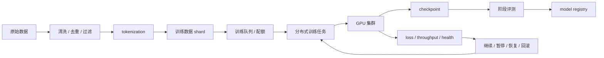
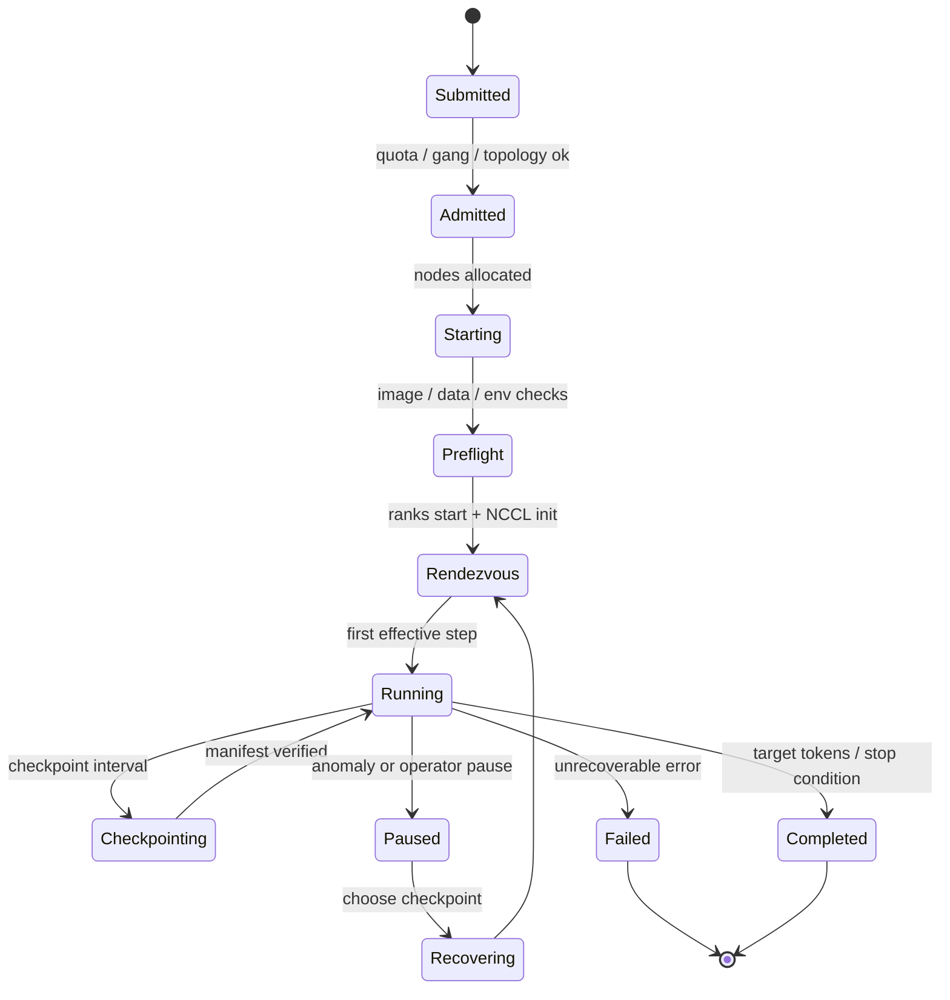

# 第 10 章：预训练

## 本章回答的问题

- 预训练如何把海量数据转化为基础模型能力？
- 数据清洗、tokenization、loss、batch size、learning rate、checkpoint 和分布式训练分别影响什么？
- 为什么预训练是 AI Factory 中最依赖系统工程的 workload 之一？

## 一个真实场景

一个预训练任务运行到第 9 天突然出现 loss spike，随后 checkpoint 写入失败。模型团队怀疑某批数据有坏样本，训练平台团队怀疑存储抖动，基础设施团队看到少量节点 RDMA 错误增加。由于任务缺少数据 shard 级 lineage、checkpoint 校验和节点健康事件关联，排查只能从日志里人工拼时间线。最后发现问题不是单点：某批样本格式异常触发梯度异常，checkpoint 高峰期存储延迟上升，恢复脚本又没有自动选择最近的有效 checkpoint。

这个场景说明，预训练不是“启动脚本跑很久”。它是数据、模型、优化器、训练框架、分布式通信、存储、调度和故障恢复共同组成的长周期系统工程。任何一个环节缺少可观测性和恢复能力，都会把小故障放大为昂贵中断。GPU 小时已经消耗之后，再发现数据不可追溯或 checkpoint 不可用，成本会非常高。

从 AI Factory 视角看，预训练是最能暴露系统短板的 workload。它持续时间长，资源规模大，对网络、存储和节点一致性敏感；它的失败成本不只是一次任务失败，还包括实验不可复现、模型质量不可解释和训练预算浪费。平台建设预训练能力，不能只提供 GPU 队列，还要提供数据治理、实验追踪、checkpoint 管理、准入测试和故障复盘。

这类任务还会检验组织协作。数据团队、模型团队、训练框架团队、调度团队、网络存储团队和 SRE 都参与同一条链路。若没有统一任务记录和事件时间线，事故中很难判断谁先异常、谁是后果。预训练平台的成熟度，往往体现在跨团队能否共享证据，而不是单个训练脚本写得多复杂。

## 核心概念

预训练（pretraining）是使用大规模数据训练基础模型的过程。对自回归 LLM 来说，常见目标是 next-token prediction，即在给定前文的情况下预测下一个 token。模型通过大量样本反复计算 loss、执行 backward、更新参数，逐步形成语言、知识、推理和模式识别能力。预训练产出的通常不是直接面向用户的最终助手，而是后续后训练、微调和服务化的基础模型。

预训练的核心对象包括数据集、tokenizer、模型配置、优化器、learning rate schedule、batch size、并行策略、checkpoint 和评测。它们必须作为一个整体管理。改变 tokenizer 会影响 token 分布，改变 batch size 可能要求调整 learning rate，改变并行策略会影响通信和显存，改变数据清洗规则会影响 loss 和能力。预训练配置不是一组独立参数，而是一套相互约束的实验定义。

预训练也是资源密集型作业。它通常需要 gang scheduling 同时分配大量 GPU，依赖高速网络做 collective communication，依赖存储系统持续读取数据和周期性写入 checkpoint。任务运行中还需要监控 loss、step time、tokens/s、GPU 利用率、NCCL 状态、数据读取延迟和节点健康。模型训练成功与否，既取决于算法，也取决于系统是否稳定。

因此，预训练平台的目标不是简单“提交任务并等待完成”，而是让训练过程可复现、可恢复、可解释、可优化。可复现要求配置、代码、镜像、数据和随机状态可追溯；可恢复要求 checkpoint 完整且可选择；可解释要求 loss 异常能关联数据、节点和配置；可优化要求训练吞吐和资源成本可量化。

还要区分训练实验和生产训练。实验可以接受人工观察和较高失败率，生产级预训练必须有准入、值班、告警、恢复和预算控制。一个任务占用大量 GPU 多天运行时，它已经是生产系统的一部分。平台不能把它当作研究脚本托管，而要按关键作业运营。

## 系统架构

预训练链路可以分为数据准备、任务调度、分布式训练、checkpoint、评测和模型注册。原始数据先经过解析、去重、过滤、安全处理和 tokenization，形成可训练的数据 shard；训练任务提交到队列后，调度器根据配额、优先级和 gang scheduling 分配 GPU；训练框架启动后，读取数据、执行 forward/backward、做梯度通信和参数更新；周期性 checkpoint 保存模型状态；阶段评测判断是否继续、回滚或调整策略。

这条链路跨越多层基础设施。数据准备依赖存储和数据处理集群，训练依赖 GPU、网络和容器镜像，checkpoint 依赖高吞吐可靠存储，调度依赖队列、配额和拓扑感知，评测依赖模型注册和基准数据。预训练平台如果只优化训练脚本，而忽视数据和 checkpoint，很容易在长任务中暴露系统性风险。

架构上必须重视闭环。训练产生的 loss、吞吐、错误和 checkpoint 不只是日志，而是后续决策输入。Loss spike 可能触发暂停和数据排查；checkpoint 校验失败应阻止覆盖旧版本；评测下降可能要求回滚到早期 checkpoint；节点错误可能触发资源隔离。没有闭环，平台只能事后复盘；有闭环，平台可以在训练过程中降低损失。

这套架构还需要明确控制面和数据面的边界。控制面管理任务、配置、队列、配额、checkpoint 索引和实验记录；数据面负责实际训练进程、通信、数据读取和指标上报。控制面必须能在训练进程失败后仍然保留事实，不能把所有状态都放在 worker 本地。否则最需要排障时，证据会随容器一起消失。

另外，预训练架构应把评测放进主链路，而不是训练结束后的临时脚本。阶段 checkpoint 只有经过固定评测和质量记录，才知道是否值得继续投入。训练、评测和注册三者断开，会让模型生命周期缺少可信节点。



## 10.1 数据清洗

数据清洗包括格式解析、语言识别、去重、质量过滤、安全过滤、隐私处理和元数据补齐。预训练数据质量直接影响模型上限，也影响训练稳定性。低质量样本会让模型学习噪声，重复数据会浪费训练预算并增加过拟合风险，异常格式可能触发 tokenizer 或数据 loader 错误，高风险内容可能带来安全和合规问题。数据清洗不是训练前的附属步骤，而是模型能力建设的一部分。

清洗规则需要版本化。一次去重策略、语言过滤阈值或安全规则变更，都会改变 token 分布和模型行为。若训练结果异常，而平台无法回答某个 checkpoint 之前使用了哪版数据规则，就很难判断能力变化来自数据、模型配置还是训练不稳定。数据 pipeline 应记录来源、处理版本、过滤规则、样本数量、token 数、质量统计和异常样本比例。

数据还要具备 shard 级 lineage。训练任务通常按 shard 顺序或随机策略读取数据；当某一步 loss spike 或 worker hang 时，平台应能定位对应数据 shard、样本范围和处理版本。没有 lineage，只能用排除法重跑，成本极高。对长期预训练任务而言，数据可追溯性和 checkpoint 一样重要，都是恢复和解释的基础。

工程上要避免把“数据越多越好”当成唯一原则。质量、覆盖、去重、领域配比和安全边界都需要权衡。AI Factory 中的数据清洗应和评测闭环连接：某类数据增加后，哪些能力提升，哪些风险增加，训练稳定性是否变化，都要有证据。预训练数据是资产，不是只按 TB 计量的原料。

数据清洗还要留下负样本和过滤统计。被过滤的数据为什么被过滤，某类来源过滤比例是否突然升高，某个规则是否误杀高价值样本，这些都会影响训练结果。成熟数据管线不只输出“可训练数据”，还输出质量报告，让模型团队能理解数据变化。

## 10.2 tokenization

Tokenization 把清洗后的文本转成 token ids，是预训练数据进入模型的最后语义转换。Tokenizer 一旦确定，模型 embedding、词表、数据格式、评测和推理计量都要围绕它建立。更换 tokenizer 通常不是小改动，它可能影响 token 分布、压缩率、多语言表现、代码能力和上下文利用率。因此预训练前必须把 tokenizer 作为核心配置冻结。

预训练数据通常会提前 tokenization 并写成适合顺序读取或分片读取的格式，以降低训练时 CPU 和 I/O 压力。若训练过程中临时做 tokenization，CPU、Python 数据处理和小文件读取可能成为瓶颈。预处理后的 shard 应包含 tokenizer 版本、样本边界、token 数、数据来源和校验信息。这样训练吞吐、异常定位和复现实验都更可靠。

Tokenizer 还影响 batch 和样本组织。不同文本被切成的 token 数不同，packing、sequence length 和 padding 策略会影响有效 token 利用率。若 padding 过多，GPU 做了无效计算；若样本拼接策略不当，可能破坏语义边界或增加训练噪声。数据团队和训练团队需要共同定义样本组织方式，而不是只交付原始 token 文件。

工程诊断时，tokenization 问题可能表现为训练吞吐低、样本长度分布异常、loss 变化难以解释、某些语言或代码能力不足，或者线上计量与训练假设不一致。平台应保留 token 分布统计，并在 tokenizer 或 chat template 变更时触发完整评估。Tokenizer 是从数据到模型的契约。

Tokenization 还会影响存储和读取效率。过小 shard 会造成大量元数据操作，过大 shard 会降低调度灵活性和故障定位精度；压缩格式、索引格式和样本边界都会影响 data loader 性能。训练吞吐低不一定是 GPU 或网络问题，也可能是 tokenized dataset 的工程形态不适合大规模读取。

## 10.3 loss

Loss 是训练优化目标的数值反馈。预训练中常见的 next-token prediction loss 表示模型在当前训练目标上的错误程度。Loss 下降通常说明模型在训练分布上变好，但它不是模型能力的全部。模型可能 loss 下降但安全性变差，也可能整体 loss 稳定但某个领域退化。因此 loss 是核心指标，但不能替代评测。

Loss 曲线的形态非常重要。Loss spike 可能来自坏数据、学习率问题、数值溢出、梯度异常、节点故障或通信错误；长期平台期可能说明 learning rate、数据分布或模型容量存在问题；训练 loss 和 validation loss 背离可能提示过拟合或验证集分布差异。平台不能只记录一个全局 loss 数字，而要把 loss 与 step、数据 shard、learning rate、gradient norm、节点和错误事件关联。

Loss 还需要分层观察。全局平均 loss 可能掩盖某类数据的问题；按语言、领域、来源或长度切分的 loss 能帮助发现数据配比和质量问题。对于大规模预训练，异常不一定来自整批数据，可能只来自少数 shard 或特定格式。若没有细粒度统计，训练团队只能看到曲线异常，却无法定位原因。

工程上应把 loss 作为控制信号之一。出现 NaN、连续 spike、gradient norm 异常或 validation loss 明显恶化时，平台可以自动暂停训练、保留现场、标记可疑数据和阻止覆盖 checkpoint。自动化不应盲目重启，因为重启可能掩盖根因。正确做法是先保留证据，再决定恢复、回滚或继续。

Loss 也要和评测保持距离。训练 loss 是优化目标的近似反馈，不能证明模型在真实任务上更好。阶段性 checkpoint 应进入固定评测集，观察领域能力、安全性和指令跟随的变化。预训练阶段虽然不直接追求最终助手体验，但若完全不做中间评测，训练可能在错误方向上消耗大量算力。

## 10.4 batch size

Batch size 表示一次优化使用的样本规模。预训练中通常要区分 micro batch、global batch 和 gradient accumulation。Micro batch 是单个 GPU 或单次 forward/backward 能处理的规模；global batch 是一次 optimizer update 汇总的总样本或 token；gradient accumulation 用多次小 batch 累积梯度，模拟更大的 global batch。混淆这些概念，会导致配置、日志和论文复现都出错。

Batch size 影响训练效率和收敛行为。更大的 batch 可以提高硬件利用率，减少优化步骤数，并让通信和计算更容易批量化；但它需要更多显存，可能要求调整 learning rate，也可能影响泛化和稳定性。更小 batch 更灵活，但硬件利用率可能较低，step overhead 更明显。batch size 不是纯性能参数，也是优化参数。

从平台角度看，global batch 决定 tokens per step，进而影响训练吞吐和 checkpoint 节奏。增大 batch 可能需要更多 GPU、更复杂并行策略和更高通信带宽；micro batch 受 HBM、activation、sequence length 和模型大小限制；gradient accumulation 会改变 step time 和指标解释。平台 dashboard 应展示实际 tokens per step，而不是只展示配置中的 batch 数。

Batch size 还影响故障恢复。恢复训练时，global batch、数据顺序、随机状态和 accumulation 状态必须一致，否则训练轨迹会发生变化。对于严格复现要求高的实验，batch 配置和数据采样状态应进入 checkpoint 或实验记录。否则同一个 checkpoint 恢复后，loss 曲线可能出现不可解释的偏移。

调度系统也会受到 batch size 影响。更大的 global batch 往往意味着更多 GPU 或更长 accumulation，队列等待、拓扑选择和资源碎片都会变化。平台如果只按 GPU 数量调度，而不了解 batch 与并行策略，可能给任务分配了可运行但低效的资源形态。Batch size 因此也是调度输入。

## 10.5 learning rate

Learning rate 决定参数更新步长，是训练稳定性和效率的关键因素。预训练通常使用 warmup、decay、cosine schedule 等策略：早期逐步升高 learning rate，避免模型刚开始训练时不稳定；中后期逐步降低，以便收敛。学习率过大可能导致 loss spike、NaN 或发散；过小可能训练缓慢，浪费 GPU 时间。

Learning rate 不能脱离 batch size、优化器和模型规模讨论。改变 global batch 后，原有 learning rate 不一定合适；改变优化器参数，也可能改变稳定性边界。训练团队需要把 schedule、optimizer state、step 数和 token 数一起记录。只在配置文件里写一个初始学习率，无法解释长周期训练中的实际行为。

工程上，learning rate schedule 必须随 checkpoint 保存和恢复。恢复训练时如果 scheduler state 丢失，任务可能从错误的学习率继续，导致 loss 异常；若手工修改学习率没有记录，后续实验也无法复现。Checkpoint 不只是权重文件，还应包含 optimizer、scheduler、随机状态和训练进度。学习率是训练状态的一部分。

Learning rate 也应进入监控和告警。Dashboard 应把 loss、gradient norm、learning rate、step time 和 tokens/s 放在同一时间轴。出现 loss spike 时，先看当时 learning rate 是否处于 warmup、切换或异常恢复阶段，再看数据和硬件。没有 learning rate 曲线，很多训练异常都会被误判为数据或基础设施问题。

学习率调整还应有变更记录。长周期训练中，团队可能根据中间评测或稳定性手工调整 schedule；这种调整如果只存在聊天记录或脚本临时参数里，后续无法复现。平台应把手工干预视为实验事件，记录时间、原因、操作者和影响范围。

还要避免把 learning rate 问题全部交给算法团队。恢复脚本加载错 scheduler、step 计数偏移、配置覆盖和 checkpoint 元数据缺失，都会让学习率在错误时间点生效。这些是平台工程问题，需要通过校验和审计解决。

## 10.6 checkpoint

Checkpoint 保存训练状态，是长时间预训练的生命线。一个完整 checkpoint 通常包括模型权重、优化器状态、learning rate scheduler 状态、随机数状态、训练 step、数据读取位置和必要元数据。只保存权重可以用于推理或评测，但不一定能无缝恢复训练。预训练任务若没有可靠 checkpoint，就无法承受节点故障、驱动问题、存储抖动、任务抢占和人为配置错误。

Checkpoint 的挑战在于体积大、写入集中、并发高。大规模训练常在固定 step 写入，多个 rank 同时向存储系统输出，容易造成写入峰值。若 checkpoint 写入阻塞训练，会引起 step time 周期性抖动；若写入失败但没有校验，恢复时才发现不可用；若保留策略过于激进，可能删除了最后一个健康版本。存储和训练框架必须协同设计。

可靠 checkpoint 需要原子性、校验和版本策略。写入时应避免半成品覆盖旧版本；完成后应记录 manifest、checksum 和训练配置；恢复时应自动选择最近的 valid checkpoint，而不是简单取最新目录。对于重要训练，还要考虑跨故障域复制和保留 best/last 多个版本。Checkpoint 管理是平台能力，不应完全依赖训练脚本临时实现。

Checkpoint 还服务评测和回滚。阶段评测发现质量退化时，需要找到对应训练状态；loss spike 后可能要回滚到异常前 checkpoint；后训练或微调也可能基于不同 checkpoint 分支实验。没有清晰 checkpoint lineage，模型生命周期会混乱。Model registry 应能记录 checkpoint 与数据、配置、代码和评测结果的关系。

Checkpoint 策略还要考虑成本。保存太多版本会占用大量存储，保存太少会增加风险；只保留 latest 方便但危险，保留 last、best 和 milestone 更适合长任务。平台应根据训练成本、故障率和评测节奏制定策略，并把删除动作审计化。删除 checkpoint 也是高风险操作。

## 10.7 分布式训练

分布式训练把数据、模型或计算拆到多张 GPU、多个节点甚至多个机架上。常见并行方式包括 data parallel、tensor parallel、pipeline parallel、sequence parallel 和 expert parallel。它们解决的问题不同：data parallel 扩大 batch，tensor/pipeline parallel 支撑更大模型，expert parallel 支撑 MoE。实际训练常使用混合并行，以平衡显存、计算和通信。

分布式训练强依赖通信。梯度同步、参数切分、activation 传递和 expert routing 通常依赖 NCCL、RDMA、InfiniBand 或 RoCE。网络抖动、丢包、错误配置和拓扑不匹配都可能表现为 step time 变慢、NCCL hang 或训练失败。GPU 本身正常，不代表训练系统健康；大规模训练的瓶颈经常出现在跨 GPU 协同上。

调度上，分布式训练需要 gang scheduling。所有关键 worker 必须同时获得资源，并在一致环境中启动。若只启动部分 worker，任务无法建立通信，还会占用 GPU。调度器需要理解队列、配额、优先级、拓扑、节点健康和资源预留。对于大型训练，节点选择可能影响通信性能，因此 topology-aware scheduling 不是锦上添花。

工程上还要处理镜像、驱动、NCCL、CUDA、OFED 和训练框架版本一致性。一个节点版本不一致，可能让任务在初始化后才失败；一个 NIC 或 GPU 健康异常，可能在数小时后表现为 hang。分布式训练的可靠性，依赖准入测试、环境一致性检查、启动前健康检查和运行中 telemetry。训练脚本只是最上层。

分布式训练还需要故障域意识。同一个 job 的 rank 如何跨节点、机架和网络 rail 分布，会影响通信性能和故障影响范围。拓扑感知不是只为了追求峰值吞吐，也为了避免把任务放到已知不稳定的链路上。训练平台应把拓扑、健康和历史故障纳入调度。

## 10.8 训练稳定性

训练稳定性包括数值稳定、数据稳定、通信稳定、存储稳定和硬件稳定。数值问题可能表现为 NaN、Inf、loss spike 或 gradient norm 异常；数据问题可能表现为某些 step 卡住或 loss 异常；通信问题可能表现为 NCCL hang、step time 抖动或 rank 失败；存储问题可能影响数据读取和 checkpoint；硬件问题可能来自 GPU Xid、ECC、NVLink、NIC 或节点重启。

稳定性工程的目标不是承诺永不失败，而是快速发现、准确隔离、保留证据、可控恢复。大规模预训练的失败概率会随运行时间和节点规模上升，平台必须把失败当成常态处理。自动重试有价值，但不能盲目；某些故障适合重启恢复，某些故障必须隔离节点或回滚 checkpoint，某些故障要求暂停训练检查数据。

训练 dashboard 应把模型指标和基础设施指标放在同一时间轴：loss、gradient norm、learning rate、tokens/s、step time、data loading time、checkpoint time、GPU utilization、HBM、NCCL 错误、RDMA 指标、存储延迟和节点健康。只有时间线对齐，团队才能判断异常先后顺序。没有统一 dashboard，训练稳定性排查会退化为跨团队日志拼接。

稳定性还依赖演练。平台应定期验证 checkpoint 恢复、worker 失败、节点隔离、存储延迟、通信异常和作业重排流程。很多系统在正常路径上看似可用，但第一次真实故障才发现恢复脚本不可用或权限不足。预训练任务太昂贵，不能把第一次恢复演练放在生产事故中。

稳定性文化也很重要。训练团队应接受“暂停保存现场”有时比“立刻重启继续跑”更正确；基础设施团队应把训练异常当作端到端事件，而不是只检查节点是否在线。长任务的可靠性来自流程、工具和判断共同作用。平台要把正确动作做成默认路径。

## 工程实现

训练任务提交应包含数据、模型、并行和恢复配置，并进入实验追踪系统。配置至少包括 dataset version、tokenizer version、code commit、container image、model config、optimizer、learning rate schedule、global batch tokens、parallelism、checkpoint policy 和 resume policy。这些字段不是文档装饰，而是复现和排障的最低条件。平台应拒绝关键字段缺失的长周期训练任务。

生产级预训练应把 `TrainingJob` 作为一等对象，而不是把 `torchrun`、`sbatch` 或 `kubectl apply` 当成唯一事实源。`TrainingJob` 要同时表达模型语义、数据语义、资源语义和恢复语义。调度器用它做 gang 和拓扑准入，训练框架用它初始化 runtime，checkpoint 系统用它记录状态，成本系统用它归集 GPU 小时。缺少统一对象，训练链路就会散落在脚本、队列、日志和文件系统里。

示例任务配置如下：

```yaml
training_job:
  dataset: pretrain-corpus-v3
  tokenizer: tokenizer-v3
  global_batch_tokens: configured
  parallelism:
    data: 8
    tensor: 4
    pipeline: 2
  checkpoint:
    interval_steps: 1000
    retention: last_5_and_best
    verify_checksum: true
  recovery:
    resume_from: latest_valid
```

更完整的 spec 应包含不可变版本和运行时门禁。下面示例不追求覆盖所有框架参数，而是展示哪些字段必须被平台理解。

```yaml
training_job:
  identity:
    tenant: foundation-model-team
    project: base-model-v4
    experiment_id: exp-20260619-001
  source:
    code_commit: git-sha
    container_image: registry/train-runtime@sha256:example
    runtime_template: pytorch-megatron-h100-v7
  data:
    dataset_version: corpus-v3.2
    tokenizer_version: tokenizer-v3
    shard_manifest: s3://datasets/corpus-v3.2/manifest.json
    dataset_manifest_digest: sha256:example
    expected_cache_policy: prewarm_for_training_prod
  model:
    architecture: transformer
    parameter_scale: documented_by_team
    sequence_length: 8192
  optimization:
    global_batch_tokens: configured
    optimizer: adamw
    lr_schedule: cosine_with_warmup
    precision: bf16
  parallelism:
    data_parallel: 16
    tensor_parallel: 8
    pipeline_parallel: 4
  scheduling:
    queue: training-prod
    gang: true
    topology: same_fabric_required
  checkpoint:
    interval_steps: 1000
    format: sharded
    retention: last_5_best_and_milestones
    verify_on_write: true
  recovery:
    resume_policy: latest_valid_checkpoint
    max_auto_restarts: 2
```

训练任务还应有明确状态机。作业 pending、Pod running 或 Slurm running 都不是训练有效进展。真正的状态应覆盖数据就绪、资源准入、runtime 自检、NCCL rendezvous、有效 step、checkpoint、异常暂停、恢复和完成。



状态机里的 `Rendezvous` 和 `Running` 必须有可审计证据。Rendezvous 不是日志中出现 “init process group” 就算通过，而是所有预期 rank 在同一 world size、同一 rendezvous endpoint、同一 NCCL/env contract、同一 rank topology contract 下成功建立通信，并且没有 rank 迟到、重号、缺号或落到错误节点。平台应生成 `rendezvous_evidence`，把 launcher、调度放置、rank 映射和通信初始化绑定起来：

```yaml
rendezvous_evidence:
  evidence_id: rv-exp-20260620-001
  training_job: exp-20260620-031
  launcher_contract: lc-torchrun-h100-202606
  expected:
    world_size: 512
    min_ready_ranks: 512
    rendezvous_backend: c10d_or_etcd_or_slurm
    rank_topology_contract: rtc-llm-20260620-001
    nccl_env_contract: nec-h100-rdma-20260620
  observed:
    joined_ranks: 512
    duplicate_ranks: []
    missing_ranks: []
    late_ranks: measured
    endpoint: recorded
    nodes: recorded
    gpu_assignment_records: attached
  timing:
    first_rank_started_at: recorded
    last_rank_joined_at: recorded
    process_group_ready_at: recorded
  verdict:
    rendezvous_complete: true
    topology_matches_contract: true
    safe_to_enter_training_loop: true
```

进入 `Running` 也不等于首个 batch 开始执行。生产平台更应该记录 `first_effective_step_record`：它证明训练已经完成数据读取、forward、backward、collective、optimizer update 和必要指标上报，产生了第一个有效训练 step。这个对象能把“任务启动成功”与“开始产生训练价值”分开，也是训练 ROI 中 effective GPU hours 的起点：

```yaml
first_effective_step_record:
  record_id: fes-exp-20260620-001
  training_job: exp-20260620-031
  prerequisites:
    rendezvous_evidence: rv-exp-20260620-001
    dataset_manifest: corpus-v3.2
    training_runtime_spec: trs-exp-20260620-031
    placement_commit_record: pcr-exp-20260620-031
  step:
    global_step: 1
    tokens_processed: measured
    loss: measured
    forward_backward_complete: true
    optimizer_step_complete: true
    collective_trace_record: attached
    data_shards_consumed: recorded
  timing:
    admitted_at: recorded
    first_effective_step_at: recorded
    startup_gpu_hours: calculated
  verdict:
    effective_training_started: true
    startup_waste_reason: none_or_image_or_rendezvous_or_data
```

这两个对象能改变训练启动事故的归因。若 GPU 已分配但没有 `rendezvous_evidence`，浪费应归入启动或通信初始化；若 rendezvous 完成但没有 first effective step，可能是数据读取、首个 collective、optimizer 或框架配置问题；若 first effective step 已产生，后续 step time 和 loss 才能进入常规训练稳定性分析。没有这些阶段证据，平台会把大量启动浪费误算为正常训练成本。

工程实现还要拆分控制面和运行面。控制面负责队列、配额、配置校验、实验记录和 checkpoint 索引；运行面负责启动容器、初始化通信、读取数据、执行训练和上报指标。控制面应能在任务失败后回答：使用了什么数据，跑到哪一步，最后有效 checkpoint 是哪个，哪些节点参与，失败前哪些指标异常。没有这些问题的答案，平台就没有真正管理训练。

上线一个预训练平台时，可以先建立最小闭环：任务提交校验、节点准入、训练 telemetry、checkpoint 校验、失败事件归档和恢复演练。随后再逐步加入自动异常检测、数据 shard 追踪、拓扑感知调度和成本分析。一次性追求全自动训练平台容易延期；但如果最小闭环缺失，规模一上来就会用人工成本补系统缺口。

还应提供任务结束后的标准报告。报告至少包含训练配置、数据版本、总 token、有效 step、失败和恢复记录、checkpoint 列表、阶段评测、资源消耗和未解决异常。这个报告既服务模型发布，也服务成本复盘。没有结项报告，预训练经验很难沉淀为下一次训练的改进。

实现上还要把权限纳入流程。谁能提交大规模训练、谁能删除 checkpoint、谁能恢复任务、谁能修改数据版本，都应有审计记录。预训练消耗资源巨大，权限和审计是成本治理的一部分。

训练数据也应有标准 `dataset_manifest`。第 33 章会从存储系统角度解释它；在预训练章节里，它首先是训练可复现和故障定位的合同。它不能只写数据集名称，而要固定处理 pipeline、tokenizer、shard 列表、采样权重、权限、缓存策略和从 step 到 shard 的映射规则。没有这些字段，loss spike、data loader hang 和恢复后状态漂移都很难证明。

```yaml
dataset_manifest:
  dataset_id: corpus-v3.2
  immutable_digest: sha256:dataset-manifest
  tokenizer:
    name: tokenizer-v3
    digest: sha256:tokenizer
  processing:
    pipeline_digest: sha256:clean-tokenize-pack
    dedup_profile: dedup-v4
    packing_strategy: fixed_length_with_document_boundary
  shards:
    format: indexed_binary
    count: 8192
    checksum_index: required
    step_to_shard_mapping: deterministic_with_seed
  sampling:
    mixture_weights: versioned
    epoch_policy: documented
    random_seed: recorded
  access:
    data_classification: restricted
    tenant_scope: foundation-model-team
    cache_policy: prewarm_for_training_prod
```

训练框架启动前应校验 manifest digest、shard checksum、reader 版本、缓存状态和权限；进入 first effective step 后，应把实际消费的 shard range 写入训练 telemetry。这样 loss 异常可以定位到数据版本和 shard，checkpoint 恢复也能验证 dataloader state 是否回到同一位置。数据 manifest 是训练控制面的一部分，不是存储目录旁边的说明文件。

`dataset_manifest` 描述训练数据“应该是什么”，还需要 `dataset_lineage_record` 说明它“实际如何生成”。Lineage 应记录原始来源、抓取时间、清洗和去重版本、安全过滤、tokenization、sharding、采样权重、人工审核、删除请求处理、数据许可证和生成者。没有 lineage，训练后发现某类能力退化或合规问题时，只能知道用了 `corpus-v3.2`，却不知道哪些来源、新增规则或删除动作改变了数据分布。

```yaml
dataset_lineage_record:
  lineage_id: dlr-corpus-v3-2-20260620
  dataset_id: corpus-v3.2
  manifest_digest: sha256:dataset-manifest
  source_inputs:
    - source: web_crawl
      snapshot: crawl-20260601
      license_policy: reviewed
    - source: code_corpus
      snapshot: code-20260605
      license_policy: restricted_allowlist
  transformations:
    parse_pipeline: parse-v11@sha256:example
    pii_filter: pii-filter-v6
    safety_filter: safety-filter-v9
    dedup_profile: dedup-v4
    tokenizer: tokenizer-v3@sha256:tokenizer
    packer: fixed_length_with_document_boundary
  output_stats:
    documents_in: measured
    documents_removed: measured
    tokens_out: measured
    shard_count: 8192
    language_distribution: recorded
    source_mixture_weights: versioned
  governance:
    data_classification: restricted
    deletion_requests_applied: [dr-20260618-001]
    training_exclusion_registry: updated
    reviewer: data-governance-owner
```

这个 record 让训练异常能回到数据供应链。若某次 loss spike 集中在一组 shard，平台可以从 shard 追到 parse、filter、tokenizer 和源 snapshot；若模型上线后出现某类版权或隐私风险，可以定位哪些数据版本和 checkpoint 受影响；若删除请求要求追踪衍生产物，lineage 能回答哪些 checkpoint、adapter、评测集和模型 artifact 依赖了该数据。数据 lineage 不是合规团队的文档，而是训练恢复、质量解释和模型发布的事实基础。

Checkpoint manifest 应被平台标准化。每次写入 checkpoint 后，训练进程或 sidecar 不应只留下一个目录，而应写入 manifest，说明包含哪些 rank 分片、优化器和 scheduler 状态、数据读取位置、随机状态、校验和、评测状态和可恢复性。

```yaml
checkpoint_manifest:
  checkpoint_id: ckpt-step-120000
  training_job: exp-20260619-001
  step: 120000
  global_tokens_seen: measured
  format: sharded
  world_size: 512
  parallelism:
    data: 16
    tensor: 8
    pipeline: 4
  contents:
    model_state: complete
    optimizer_state: complete
    scheduler_state: complete
    rng_state: complete
    dataloader_state: complete
  validation:
    manifest_checksum: sha256:example
    shard_checksums: verified
    restore_smoke_test: passed
  lineage:
    parent_checkpoint: ckpt-step-119000
    dataset_shards_consumed: manifest-range
```

Manifest 的价值在恢复时体现。恢复逻辑应先查询 latest valid checkpoint，而不是简单读取最新目录；恢复后应校验 world size、parallelism、tokenizer、数据位置和 scheduler state 是否匹配。若不匹配，应显式拒绝并给出原因。这样可以避免“恢复成功但训练轨迹已经变了”的隐性事故。

Checkpoint 写入还应采用两阶段提交门禁。训练 rank 先写入临时路径和本地 checksum，validator 验证所有 rank 分片、manifest、optimizer、scheduler、rng 和 dataloader state，再把 checkpoint 标记为 latest valid。任何 rank 缺片、checksum 不一致、metadata 不完整或恢复 smoke test 失败，都不能更新 latest 指针。这样能防止“目录已经出现但 checkpoint 实际不可恢复”的生产事故。

```yaml
checkpoint_commit_record:
  checkpoint_id: ckpt-step-120000
  phase: commit_validation
  temporary_path: managed_tmp_path
  rank_shards:
    expected: 512
    written: measured
    checksum_verified: true
  manifest:
    committed: true
    latest_pointer_updated: only_after_validation
  restore_gate:
    world_size_match: true
    parallelism_match: true
    scheduler_state_match: true
    dataloader_position_match: true
  failure_policy:
    keep_previous_latest_valid: true
    quarantine_partial_checkpoint: true
```

这个记录是训练恢复和成本账本的共同证据。若 checkpoint 写入拉长 step time，平台可以从 commit record 看到长尾来自 rank 写入、manifest 校验还是 latest 指针更新；若恢复失败，平台可以证明失败发生在 checkpoint 本身、恢复配置还是数据位置。Checkpoint 不是文件夹，而是一个有提交协议的训练状态对象。

Checkpoint 还必须通过 `checkpoint_restore_drill`。恢复演练不是事故发生后的临时动作，而是持续验收：定期从真实 checkpoint 拉起短窗口训练，验证 manifest、rank shard、optimizer、scheduler、rng、dataloader state、并行配置和评测探针。很多 checkpoint 在写入时看起来完整，真正恢复时才发现权限、路径、world size、依赖镜像或 reader 版本不匹配。恢复演练能把这类问题提前暴露。

```yaml
checkpoint_restore_drill:
  drill_id: crd-20260620-ckpt-120000
  checkpoint: ckpt-step-120000
  training_job: exp-20260619-001
  trigger:
    type: scheduled_or_preemption_readiness
    policy: every_n_checkpoints_for_critical_training
  restore_environment:
    container_image: registry/train-runtime@sha256:example
    world_size: 512
    parallelism:
      data: 16
      tensor: 8
      pipeline: 4
    resource_pool: acceptance-or-spare-pool
  validation:
    manifest_read: pass
    shard_checksums: pass
    optimizer_scheduler_rng: pass
    dataloader_position: pass
    first_effective_step_after_restore: pass
    short_eval_smoke: pass
  outcome:
    restorable: true
    restore_duration_ms: measured
    rollback_distance_tokens: calculated
    block_latest_pointer_if_failed: true
```

`checkpoint_restore_drill` 应进入训练门禁和 SRE 例会。关键训练任务至少要知道最近几个 checkpoint 中哪些真正可恢复，恢复需要多久，回滚距离是多少，是否需要跨故障域复制。若 drill 失败，平台应阻止删除更早的健康 checkpoint，并把任务标记为恢复风险升高。训练可靠性不是“写 checkpoint”，而是“能在可接受损失内恢复训练进度”。

预训练任务还应把数据路径纳入运行时自检。`dataset_manifest_digest`、实际挂载路径、缓存命中、shard 数量、reader 版本和 data loader 指标，都应在 first effective step 之前上报。若数据路径不可达、manifest checksum 不匹配或缓存预热未完成，任务应停在 preflight，而不是进入训练后让 GPU 等待。数据自检失败是平台问题，不应由训练 step 承担。

## 常见故障

第一类故障是数据 shard 损坏或格式异常。表现可能是 worker hang、loss spike、tokenization 错误或数据读取失败。排查时应能从 step 定位到 shard、样本范围和数据处理版本。若数据没有 lineage，只能靠重跑和二分定位，成本很高。数据问题应进入数据质量队列，而不是只在训练脚本里捕获异常。

第二类故障是 checkpoint 不可用。常见原因包括写入中断、manifest 缺失、某些 rank 文件不完整、checksum 不一致、保留策略删除健康版本，或者恢复脚本没有加载 optimizer/scheduler state。表现可能是无法恢复，或恢复后 loss 异常。平台应把 checkpoint 校验作为写入完成条件，并定期做恢复演练。

第三类故障是分布式通信异常。NCCL 初始化失败、rank 间版本不一致、RDMA 错误、拓扑配置错误或某个节点慢，都可能导致任务 hang 或 step time 长尾。排查要同时看训练日志、NCCL 日志、网络 telemetry、节点健康和调度拓扑。只看应用日志，很难区分通信问题和模型计算问题。

第四类故障是配置不可复现。有人手工修改 learning rate，镜像 tag 被覆盖，数据集版本指向 latest，或者恢复时 batch 配置变化。任务可能继续运行，但实验已经不可解释。预训练平台应禁止关键配置使用漂移引用，要求使用不可变版本，并把变更写入实验记录。可复现性是训练质量的一部分。

第五类故障是健康准入不足。节点在短压测中正常，但长时间训练中出现 ECC、Xid、RDMA retry 或存储超时，导致任务反复抖动。大规模训练应在进入队列前确认节点、GPU、NIC、驱动和文件系统健康，并在运行中根据错误自动隔离高风险节点。坏节点不应由训练任务来发现。

第六类故障是恢复后状态漂移。任务从 checkpoint 恢复后，global step、learning rate、数据 shard 位置或随机状态与保存时不一致，短期看训练继续运行，长期看 loss 曲线和评测结果不可解释。解决方向是 checkpoint manifest、恢复前校验和恢复后短窗口对比。恢复不是进程重启，而是训练状态一致性验证。

第七类故障是有效 step 与资源计费脱节。任务已经分配 512 张 GPU，但卡在镜像拉取、数据预检、NCCL 初始化或 checkpoint 恢复阶段，成本系统仍按正常训练归集。平台应区分 allocated GPU hours、effective training GPU hours 和 wasted GPU hours，否则无法评估队列、镜像、存储和网络问题造成的真实损失。

## 性能指标

训练效率指标包括 tokens/s、step time、samples/s、GPU utilization、GPU MFU、data loading time、forward/backward time 和 communication time。它们回答训练是否高效。单看 GPU utilization 不够，因为数据读取、通信和 checkpoint 都可能成为瓶颈。指标应按 step 和时间窗口展示，并能关联并行配置和节点拓扑。

稳定性指标包括失败率、平均无故障运行时间、恢复时间、checkpoint 成功率、checkpoint 写入耗时、NCCL 错误、节点隔离次数、NaN 次数和自动重试次数。它们回答长任务是否可靠。对于预训练，稳定性指标和吞吐同等重要；高吞吐但频繁失败，最终成本可能更高。

数值和质量指标包括 training loss、validation loss、gradient norm、learning rate、per-domain loss、阶段 benchmark 和安全评测。它们回答模型是否按预期学习。Loss 需要和数据、学习率、硬件事件共同观察；阶段评测需要和 checkpoint 关联，便于选择继续、回滚或分支实验。

资源和成本指标包括 GPU 小时、网络带宽、存储吞吐、存储容量、checkpoint 占用、失败浪费 GPU 小时、每 billion token 训练成本和能耗。它们回答训练是否值得继续扩展。AI Factory 的预训练能力最终要能说明：同样预算下，哪些优化提高了有效 token throughput，哪些故障造成了浪费。

指标应支持按任务、阶段和故障类型聚合。单个任务的指标用于排障，多任务汇总指标用于平台优化。若长期发现 checkpoint 写入占比高，就应优化存储；若通信等待占比高，就应检查拓扑和 NCCL；若失败浪费 GPU 小时高，就应加强准入和恢复。指标必须指向改进动作。

这些指标还应形成训练基线。新框架版本、新网络拓扑或新存储系统上线前，应与历史基线比较 tokens/s、step time、checkpoint 时间和失败率。没有基线，平台只能凭感觉判断改造是否有效。

训练链路还应建立阶段耗时指标。提交到准入、准入到启动、启动到 rendezvous、rendezvous 到 first effective step、checkpoint 写入、checkpoint 校验、故障到恢复，这些阶段分别对应不同 owner。只看训练总时长，无法发现资源浪费发生在哪个阶段。

| 阶段指标 | 口径 | 主要 owner | 典型用途 |
| --- | --- | --- | --- |
| `training.queue_wait_ms` | 提交到准入 | 调度平台 | quota、gang、拓扑容量分析 |
| `training.startup_ms` | 准入到所有 rank 进程启动 | 调度 / 镜像 / 节点 | 镜像拉取、节点状态、launcher 排障 |
| `training.rendezvous_ms` | rank 启动到 NCCL 初始化完成 | Runtime / 网络 | 通信和环境自检 |
| `training.first_step_ms` | NCCL 完成到第一有效 step | 框架 / 数据 | 数据读取和编译问题 |
| `training.effective_tokens_s` | 有效训练 token 吞吐 | 训练框架 | 性能基线和成本核算 |
| `training.wasted_gpu_hours` | 分配但未产生有效 step 的 GPU 小时 | 平台运营 | 浪费归因和 ROI |

## 设计取舍

第一个取舍是 checkpoint 频率。更频繁 checkpoint 可以降低故障损失和回滚距离，但会增加存储成本、写入压力和训练抖动；更少 checkpoint 提高正常路径效率，却扩大故障后损失。合理频率取决于任务规模、故障率、checkpoint 写入时间、存储能力和业务对恢复点的要求。它应通过数据决定，而不是凭经验固定。

第二个取舍是 batch size 与收敛。更大 batch 有利于吞吐和硬件效率，但可能需要调整 learning rate，也可能改变训练动态；更小 batch 更稳妥但成本更高。平台不能只鼓励最大 batch，而应同时观察 tokens/s、loss 曲线、gradient norm 和评测结果。效率优化不能以不可解释的质量风险为代价。

第三个取舍是并行复杂度。更复杂的 tensor、pipeline、sequence 和 expert parallel 能支持更大模型，但会增加通信依赖、调试难度和故障面。若模型规模不需要复杂并行，简单策略可能更可靠；若模型必须跨大量 GPU，则需要投入拓扑感知调度、通信监控和故障恢复。并行策略是系统设计，不只是训练参数。

最后是自动化与人工控制。自动重试、自动恢复和异常检测能降低值班压力，但错误自动化可能掩盖数据问题或覆盖关键证据。成熟平台应把自动化分级：低风险故障自动恢复，高风险异常自动暂停并保留现场，关键决策需要人工确认。预训练越昂贵，越需要可控自动化。

还要在速度和治理之间取舍。研究团队希望快速试验，平台团队需要可审计和可恢复。可行做法是按资源规模分级：小实验保持轻量流程，大规模预训练强制完整元数据、准入和恢复演练。治理应与风险匹配。

## 小结

- 预训练是数据、优化器、分布式训练和基础设施共同作用的系统工程。
- 数据质量和可追溯性决定训练上限，也决定异常排查效率。
- Checkpoint 是长时间训练的生命线，必须校验、版本化并定期恢复演练。
- 分布式训练对 gang scheduling、NCCL、RDMA 和存储都有强依赖。

## 延伸阅读

- [Megatron-LM repository](https://github.com/NVIDIA/Megatron-LM)；[DeepSpeed documentation](https://www.deepspeed.ai/)
- [PyTorch Distributed documentation](https://pytorch.org/docs/stable/distributed.html)
- [Language Models are Few-Shot Learners](https://arxiv.org/abs/2005.14165)
- [OPT: Open Pre-trained Transformer Language Models](https://arxiv.org/abs/2205.01068)
