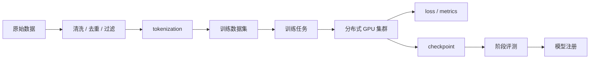

# 第 10 章：预训练

## 本章回答的问题

- 预训练如何把海量数据转化为基础模型能力？
- 数据清洗、tokenization、loss、batch size、learning rate、checkpoint 和分布式训练分别影响什么？
- 为什么预训练是 AI Factory 中最依赖系统工程的 workload 之一？

## 一个真实场景

一个训练任务运行到第 9 天突然 loss spike，随后 checkpoint 写入失败。模型团队怀疑数据有坏样本，训练平台怀疑存储抖动，基础设施团队看到某些节点 RDMA 错误增加。最终定位发现：数据管线中某批样本格式异常引发梯度异常，同时 checkpoint 高峰期存储延迟上升，恢复流程又缺少最近可用 checkpoint 的自动选择。

预训练不是“启动脚本跑很久”。它是数据、模型、优化器、分布式通信、存储、调度和故障恢复共同组成的系统工程。

## 核心概念

预训练是用大规模数据训练基础模型的过程。常见目标是让模型学习下一个 token 预测能力。预训练任务通常规模大、周期长、资源昂贵、失败成本高，对数据质量、训练稳定性和基础设施可靠性要求极高。

从 AI Factory 视角看，预训练连接 Model 层、Runtime 层、调度层、网络存储层和物理基础设施层。一次训练失败可能浪费大量 GPU 小时，因此平台必须提供准入、队列、checkpoint、监控和恢复能力。

## 系统架构



预训练链路的关键是闭环：数据进入训练，训练产生指标和 checkpoint，评测决定是否继续、回滚或调整策略。

## 10.1 数据清洗

数据清洗包括格式解析、语言识别、去重、质量过滤、安全过滤、版权和隐私处理。低质量数据会直接影响模型能力和安全性。重复数据会浪费训练预算，并可能让模型过拟合特定内容。

数据清洗需要可追溯。每批数据应记录来源、处理版本、过滤规则、样本数量、token 数和质量统计。训练出现异常时，团队需要能定位到具体数据 shard，而不是只能重跑全量任务。

## 10.2 tokenization

Tokenization 把文本转成 token ids。预训练前通常会把数据预处理成适合顺序读取的格式，以减少训练时 CPU 和 I/O 压力。Tokenizer 一旦确定，后续模型、数据和评测都要使用同一口径。

Tokenizer 选择会影响压缩率、语言覆盖、代码能力和多语言表现。工程上要关注 tokenization 吞吐、数据格式、shard 大小、随机读取模式和与训练框架的数据加载兼容性。

## 10.3 loss

Loss 是训练优化目标的数值反馈。预训练中常见的是 next-token prediction loss。Loss 下降通常表示模型在训练目标上变好，但它不是唯一质量指标。Loss spike、NaN、长期平台期和训练/验证 loss 背离都可能提示问题。

Loss 需要和数据、学习率、梯度、硬件错误和通信错误一起看。单独看 loss 曲线无法判断根因。平台应记录 loss、gradient norm、learning rate、吞吐、step time、数据 shard 和节点健康。

## 10.4 batch size

Batch size 表示每次优化使用的样本规模。大 batch 可以提高硬件利用率和训练稳定性，但需要更多显存和通信，并且可能要求调整 learning rate。训练中常区分 micro batch、global batch 和 gradient accumulation。

Batch size 不是纯模型参数，它影响调度和资源需求。增大全局 batch 可能需要更多 GPU、更多并行策略和更高网络通信能力。平台应记录 batch 配置和实际 tokens per step。

## 10.5 learning rate

Learning rate 决定参数更新步长。预训练通常使用 warmup、decay、cosine schedule 等策略。学习率过大可能导致发散，过小可能训练缓慢或陷入平台期。

工程上，learning rate schedule 必须随 checkpoint 保存和恢复。恢复训练时如果 schedule 状态丢失，可能出现 loss 异常。训练配置、optimizer state 和 scheduler state 应作为 checkpoint 的一部分管理。

## 10.6 checkpoint

Checkpoint 保存模型权重、优化器状态、学习率状态、随机数状态和训练进度。它是故障恢复和阶段评测的基础。预训练任务没有可靠 checkpoint，就无法承受节点故障、驱动问题、存储抖动和任务抢占。

Checkpoint 的挑战是体积大、写入频繁、并发高。存储系统需要承受周期性写入峰值。平台需要定义保留策略、写入原子性、校验、恢复选择和跨地域备份策略。

## 10.7 分布式训练

分布式训练把模型、数据或计算拆到多张 GPU 甚至多集群上。常见并行方式包括 data parallel、tensor parallel、pipeline parallel、sequence parallel 和 expert parallel。通信通常依赖 NCCL 和 RDMA。

分布式训练要求 gang scheduling。所有关键进程必须同时获得资源并建立通信。半启动会浪费 GPU。调度器、镜像、网络、存储和运行时必须共同保证任务可启动、可通信、可恢复。

## 10.8 训练稳定性

训练稳定性包括数值稳定、数据稳定、通信稳定和硬件稳定。NaN、loss spike、NCCL hang、节点掉卡、ECC 错误、存储超时都可能中断训练。稳定性工程的目标不是“永不失败”，而是快速发现、隔离、恢复和复现。

平台应提供训练 dashboard：step time、tokens/s、loss、GPU 利用率、NCCL 错误、数据读取时间、checkpoint 时间和节点健康。长任务需要自动告警和自动收集上下文。

## 工程实现

训练任务提交应包含数据、模型、并行和恢复配置：

```yaml
training_job:
  dataset: pretrain-corpus-v3
  tokenizer: tokenizer-v3
  global_batch_tokens: configured
  parallelism:
    data: 8
    tensor: 4
    pipeline: 2
  checkpoint:
    interval_steps: 1000
    retention: last_5_and_best
    verify_checksum: true
  recovery:
    resume_from: latest_valid
```

这些配置应进入任务记录和实验追踪系统。

## 常见故障

- 数据 shard 损坏导致 worker hang 或 loss 异常。
- checkpoint 写入过慢，训练 step 周期性抖动。
- 恢复训练缺少 optimizer 或 scheduler state。
- NCCL 初始化失败或运行中 hang。
- 学习率配置和 global batch 不匹配导致发散。
- 节点健康没有准入，训练中暴露硬件问题。

## 性能指标

- 训练效率：tokens/s、step time、GPU MFU、数据读取时间。
- 稳定性：失败率、恢复时间、checkpoint 成功率、NCCL 错误。
- 数值：training loss、validation loss、gradient norm、NaN 次数。
- 资源：GPU 利用率、HBM 占用、网络带宽、存储吞吐。
- 成本：每 billion token 训练成本、失败浪费 GPU 小时。

## 设计取舍

更频繁 checkpoint 可以降低故障损失，但增加存储成本和训练抖动。更大 batch 可以提高吞吐，但可能影响收敛并增加通信。更复杂并行策略可以训练更大模型，但调试难度和通信依赖更强。预训练平台需要在效率、稳定性和可恢复性之间取舍。

## 小结

- 预训练是数据、优化器、分布式训练和基础设施共同作用的系统工程。
- 数据质量和可追溯性决定训练上限，也决定异常排查效率。
- Checkpoint 是长时间训练的生命线。
- 分布式训练对 gang scheduling、NCCL、RDMA 和存储都有强依赖。

## 延伸阅读

- TODO: Megatron-LM / DeepSpeed 官方资料
- TODO: 大模型预训练工程论文
- TODO: 分布式训练稳定性案例
