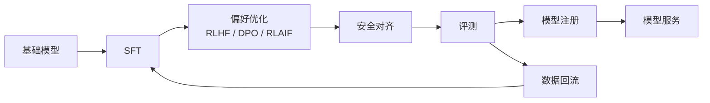

# 第 11 章：后训练

## 本章回答的问题

- 后训练如何把基础模型变成可用、可控、可对话的产品模型？
- SFT、RLHF、DPO、RLAIF、alignment、safety 和 instruction following 分别解决什么问题？
- 后训练对数据、评测、调度和模型管理有什么工程要求？

## 一个真实场景

一个预训练模型在 benchmark 上表现不错，但上线 Chat 后经常不遵循格式、拒答边界不稳定、工具调用参数错误。团队不是重新预训练，而是通过 SFT 数据、偏好数据、安全数据和工具调用数据进行后训练。几轮迭代后，模型更像产品，但也出现新问题：某次安全数据过强导致正常问题拒答率升高，某次偏好优化提升了人工评分却降低了代码任务能力。

后训练的价值是把“会预测 token 的模型”变成“能按产品要求工作的模型”。它也是模型质量、平台需求和安全策略交汇最密集的环节。

## 核心概念

后训练（post-training）是在预训练之后，用指令数据、偏好数据、安全数据和任务数据继续优化模型行为的过程。它通常比预训练规模小，但迭代更频繁，更贴近产品需求。

后训练不是单一算法，而是一组方法和流程：SFT 让模型学习指令和回答格式；RLHF 或 DPO 让模型偏向人类偏好的回答；RLAIF 使用 AI 反馈降低人工成本；alignment 和 safety 则定义模型应该做什么、不应该做什么。

## 系统架构



后训练是循环过程。线上反馈、人工评测和红队结果会不断回流到数据和训练流程。

## 11.1 SFT

SFT 即 Supervised Fine-Tuning，监督微调。它使用高质量指令-回答数据，让模型学习如何遵循指令、组织答案、使用格式和处理任务。SFT 常用于把基础模型变成对话模型或领域助手。

SFT 的关键是数据质量。少量高质量、多样化、结构清晰的数据往往比大量噪声数据更重要。工程上需要记录数据来源、标注规范、版本、去重和质量检查结果。

## 11.2 RLHF

RLHF 即 Reinforcement Learning from Human Feedback，基于人类反馈的强化学习。典型流程是收集人类偏好，训练 reward model，再用强化学习优化模型输出。它可以让模型更符合人类偏好，但流程复杂、成本高、稳定性要求高。

RLHF 的工程挑战包括偏好数据采集、reward model 质量、训练稳定性和过优化。平台需要把偏好数据、reward model、策略模型和评测结果统一管理。

## 11.3 DPO

DPO 即 Direct Preference Optimization，直接偏好优化。它绕过显式 reward model，用偏好对直接优化模型。DPO 工程流程通常比 RLHF 简洁，因此在许多后训练场景中常见。

DPO 仍然依赖偏好数据质量。偏好对的构造、数据覆盖、拒答样本、领域样本和安全样本都会影响最终行为。DPO 训练完成后必须用多维评测检查是否牺牲了某些能力。

## 11.4 RLAIF

RLAIF 即 Reinforcement Learning from AI Feedback，使用 AI 生成或辅助的反馈信号。它可以降低人工标注成本，提高迭代速度，但也可能继承评审模型的偏见和盲区。

工程上，RLAIF 不应完全替代人工评测。更常见的做法是用 AI 反馈做初筛和大规模覆盖，用人工评测校准关键场景和高风险样本。

## 11.5 alignment

Alignment 指让模型行为符合人类意图、产品目标和安全规范。它不仅是安全问题，也包括指令遵循、格式稳定、工具使用、价值边界和拒答策略。

Alignment 需要明确规范。模型“不应该做什么”必须转化成数据、策略、评测和上线门禁。模糊的价值口号无法直接指导训练。

## 11.6 safety

Safety 包括有害内容拒绝、隐私保护、越权防护、工具安全、幻觉控制和合规要求。安全不是只靠模型本身完成，还需要网关、策略引擎、RAG 权限、工具权限和审计系统共同保证。

安全后训练会影响正常能力。过强拒答会伤害用户体验，过弱拒答会带来风险。平台必须用安全评测和正常任务评测一起看，避免单指标优化。

## 11.7 instruction following

Instruction following 是模型理解并遵循用户指令的能力。它包括格式要求、角色要求、约束条件、工具调用要求和多步任务要求。许多产品问题不是模型“不会”，而是模型没有稳定遵循指令。

指令遵循能力需要在数据、prompt、解码参数和评测中共同优化。对于 JSON、函数调用或结构化输出，平台还可以使用 schema 校验和重试策略辅助。

## 工程实现

后训练任务应记录完整谱系：

```yaml
post_training_run:
  base_model: af-base-v1
  method: dpo
  datasets:
    - sft-instruction-v4
    - preference-chat-v2
    - safety-refusal-v3
  eval_sets:
    - general-chat
    - tool-calling
    - safety-redteam
  output_model: af-chat-v2-candidate
```

没有谱系记录，就无法解释模型行为变化。

## 常见故障

- SFT 数据格式不一致，导致输出格式不稳定。
- 偏好数据过窄，模型在某类任务上退化。
- 安全数据过强，正常请求拒答率上升。
- 后训练模型没有完整评测就进入灰度。
- 模型注册只记录权重，不记录数据和训练方法。

## 性能指标

- 质量：人工偏好胜率、指令遵循率、格式正确率。
- 安全：红队通过率、拒答准确率、越权拦截率。
- 工具：工具调用准确率、参数 schema 通过率。
- 回归：核心 benchmark、领域评测、线上 A/B。
- 成本：后训练 GPU 小时、数据标注成本、迭代周期。

## 设计取舍

后训练要在有用性、真实性、安全性和风格之间取舍。更强安全可能降低帮助性，更强格式约束可能降低自然性，更强领域优化可能损害通用能力。经典做法是用分层评测和灰度发布控制风险，而不是相信单次训练结果。

## 小结

- 后训练把基础模型转化为产品模型，是质量和安全的关键环节。
- SFT、RLHF、DPO、RLAIF 解决不同类型的行为优化问题。
- Alignment 和 safety 必须落实到数据、训练、评测和上线门禁。
- 后训练需要完整谱系记录，否则无法解释模型行为变化。

## 延伸阅读

- TODO: InstructGPT / RLHF 经典论文
- TODO: DPO 论文
- TODO: 模型安全评测资料
