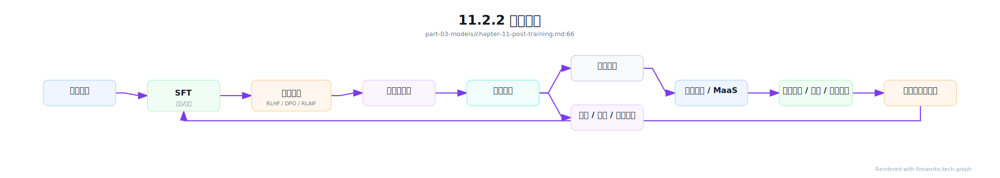
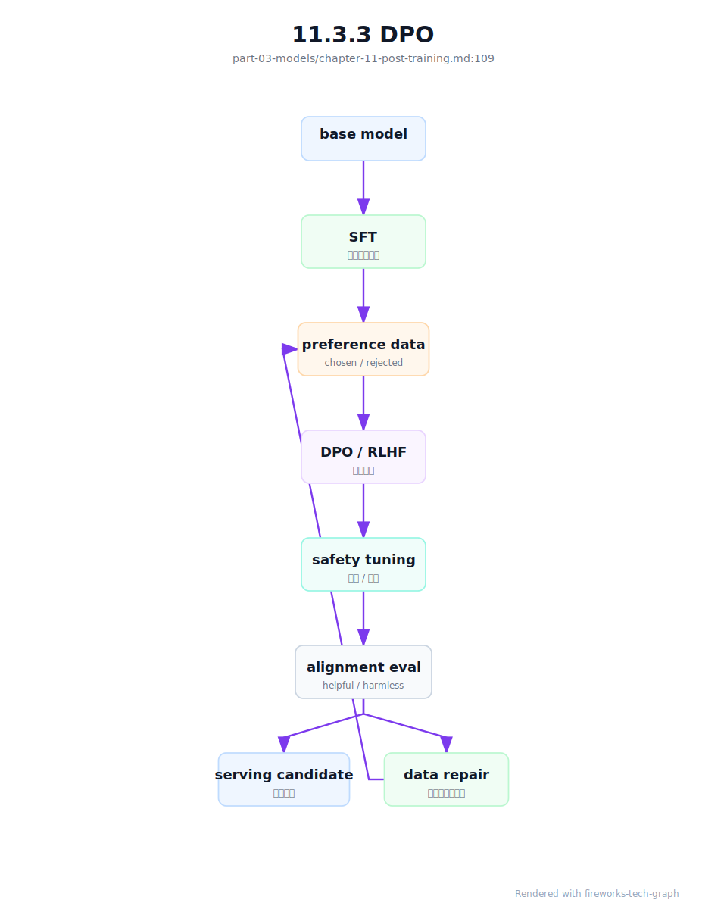
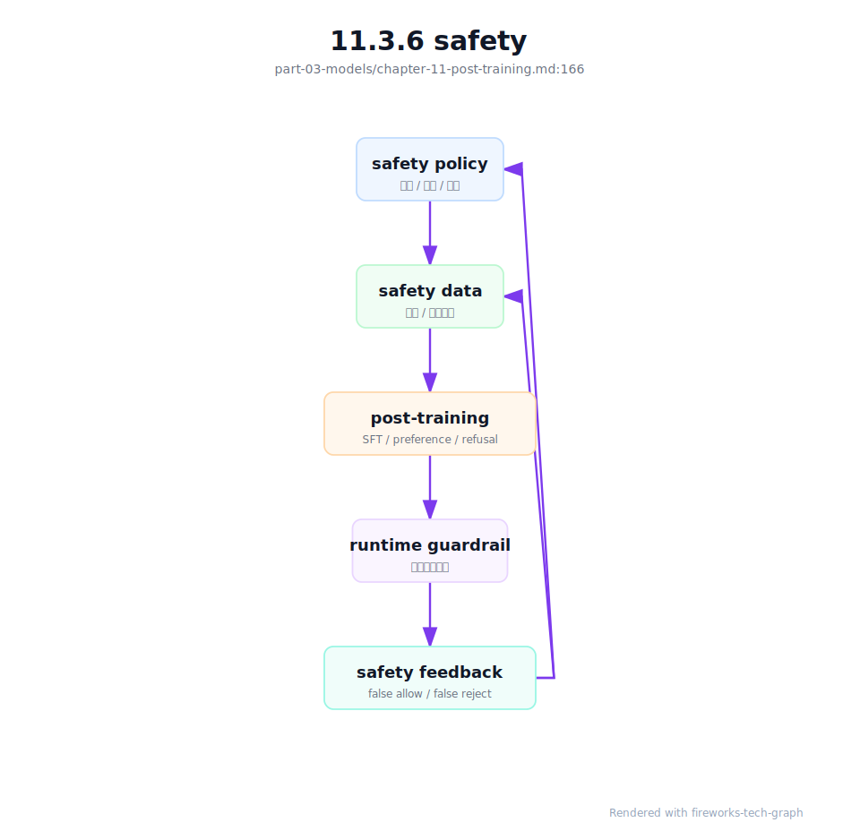

# 第 11 章：后训练

## 11.1 导读

### 11.1.1 本章回答的问题

- 后训练如何把基础模型变成可用、可控、可对话的产品模型？
- SFT、RLHF、DPO、RLAIF、alignment、safety 和 instruction following 分别解决什么问题？
- 后训练对数据、评测、调度和模型管理有什么工程要求？


### 11.1.2 本章上下文

- 层级定位：本章属于 `Model 层`，重点讨论模型训练、后训练、微调、评测和模型服务化。
- 前置依赖：建议先理解 第 10 章：预训练 中的核心对象和路径。
- 后续关联：本章内容会继续连接到 第 12 章：微调与模型定制，并在系统地图、深度标准和读者测试中被交叉引用。
- 读完能力：读完本章后，读者应能把《后训练》中的概念映射到 AI Factory 的生产路径、工程对象、观测证据和设计取舍。


### 11.1.3 读者测试

- 机制题：读者能否解释 SFT、RLHF、DPO、RLAIF 的核心机制，以及它们如何共同支撑《后训练》？
- 边界题：读者能否区分 模型算法、模型产物、serving release、评测证据和基础设施容量 的责任边界，并说明哪些问题不能简单归因到本章组件？
- 路径题：读者能否从模型产物追到数据、训练、评测、serving release、路由和回滚，并指出本章对象在路径中的位置？
- 排障题：当《后训练》相关生产症状出现时，读者能否列出第一层证据、下一跳证据、可能 owner 和止血动作？


### 11.1.4 一个真实场景

一个预训练模型在通用 benchmark 上表现不错，但接入 Chat 产品后问题很多：回答格式不稳定，JSON 输出经常破坏 schema；面对敏感问题时拒答边界摇摆；工具调用参数不符合 API 要求；多轮对话里会忘记系统指令。团队没有重新预训练，而是构建 SFT 数据、偏好数据、安全数据和工具调用数据，对模型进行后训练。几轮迭代后，模型更像一个产品助手，但新问题也出现了：某批安全数据过强导致正常问题拒答率升高，某次偏好优化提升人工评分却降低代码任务表现。

这个场景说明，后训练的核心不是“让模型更聪明”，而是让模型在产品约束下更可靠。预训练模型学习了大量语言和知识模式，但它不天然知道某个产品的回答风格、安全边界、工具 schema、拒答策略和格式要求。后训练把这些要求转化为数据、训练目标、评测和上线门禁。它连接模型能力、用户体验、产品策略和安全治理。

后训练也是迭代最频繁的模型工程环节。预训练可能按月或季度规划，后训练可能每周甚至更快迭代。频繁迭代意味着平台必须管理数据版本、训练方法、评测结果、模型谱系、灰度和回滚。若只把后训练当作实验脚本，模型行为变化就无法解释；若把它产品化，平台才能稳定改进模型，而不是反复制造回归。

真实平台中，后训练事故往往不是训练任务失败，而是模型成功上线后行为变了。用户发现回答变长、拒答变多、工具调用少了或格式不稳定，平台必须能追溯到具体训练数据和策略。后训练的质量标准因此应包括“行为变化可解释”，而不只是“新模型分数更高”。


## 11.2 基础模型

### 11.2.1 核心概念

后训练（post-training）是在预训练之后，用指令数据、偏好数据、安全数据、工具调用数据和领域任务数据继续优化模型行为的过程。它通常比预训练规模小，但更贴近产品目标。预训练让模型具备基础语言能力，后训练让模型知道如何回答、何时拒答、如何遵循格式、如何使用工具，以及如何在不同场景中表现得可控。

SFT（Supervised Fine-Tuning，监督微调）使用指令-回答样本，让模型学习目标输出格式和任务模式。RLHF（Reinforcement Learning from Human Feedback，基于人类反馈的强化学习）用人类偏好训练 reward model，再优化策略模型。DPO（Direct Preference Optimization，直接偏好优化）使用偏好对直接优化模型。RLAIF（Reinforcement Learning from AI Feedback，基于 AI 反馈的强化学习）用 AI 辅助生成反馈，降低人工成本。

Alignment 指模型行为与人类意图、产品目标和安全规范保持一致。Safety 是其中重要部分，但 alignment 不只等于安全，它还包括指令遵循、格式稳定、工具使用、帮助性、真实性和拒答边界。Instruction following 则强调模型能否准确执行用户和系统指令，包括格式、约束、多步任务和角色要求。

从平台角度看，后训练不是单次算法选择，而是数据、训练、评测、注册和发布的闭环。每次候选模型都应能回答：基于哪个 base model，用了哪些数据，采用什么方法，评测结果如何，哪些能力提升，哪些能力退化，是否允许灰度。没有这些问题的答案，后训练会变成不可审计的模型行为修改。

这些概念还对应不同团队职责。产品团队定义目标行为，安全团队定义风险边界，数据团队构造和审核样本，模型团队选择训练方法，平台团队提供调度、评测和发布，SRE 负责线上风险控制。后训练越接近产品，越需要明确责任分工。否则一次模型行为变化会变成跨团队争议。


### 11.2.2 系统架构

后训练系统通常从基础模型开始，经过 SFT、偏好优化、安全对齐、评测、模型注册和服务发布。线上反馈、人工评测、红队样本、工具失败样本和用户投诉会回流到数据池，形成下一轮训练。这个循环比预训练更靠近产品，因此需要更快的反馈、更严格的评测和更清晰的版本管理。

架构中最重要的是数据和评测的闭环。SFT 数据决定模型学会什么格式和任务，偏好数据决定模型倾向什么回答，安全数据决定拒答和风险边界，评测集决定上线门槛。若数据版本和评测版本不清楚，模型行为变化无法解释。若只有训练没有评测，后训练可能提升某个指标同时损害关键能力。

后训练还需要与 MaaS 和模型服务连接。候选模型进入 registry 后，平台要支持灰度、A/B、回滚、能力标注和计费口径更新。一个后训练模型可能支持更好的 tool calling，也可能改变输出长度和成本；可能提升安全拒答，也可能影响用户满意度。发布系统必须把模型行为变化映射到产品和平台策略。

因此，架构中应有明确上线门禁。模型不能只因为训练完成就进入生产，而要经过自动评测、人工评审、风险批准和灰度观察。不同风险等级的模型可以有不同门禁：内部实验模型轻量，面向外部客户的默认模型严格。门禁是把后训练从研究流程变成生产流程的关键。

架构还应支持并行候选模型。后训练经常同时尝试多组数据和方法，平台需要比较候选，而不是覆盖旧结果。每个候选都应有独立谱系、评测和发布状态。这样团队才能基于证据选择模型，而不是只保留最后一次训练产物。




## 11.3 关键技术

### 11.3.1 SFT

SFT 即 Supervised Fine-Tuning，监督微调。它使用高质量指令-回答数据，让模型学习如何响应任务、组织答案、遵循格式、使用角色和处理常见场景。对于基础模型，SFT 往往是从“预测下一个 token”到“像助手一样回答”的关键步骤。它能显著改善对话风格、指令遵循和结构化输出，但其效果高度依赖数据质量。

SFT 数据需要覆盖真实产品场景。若数据只包含通用问答，模型可能不会稳定执行企业客服、代码修复、表格分析或工具调用；若数据格式不一致，模型会学习到混乱输出；若答案过于模板化，模型会变得僵硬。工程上应定义标注规范、消息格式、系统指令、拒答样例、工具 schema 和多轮上下文结构，避免数据看似丰富但语义不一致。

SFT 也会带来能力偏移。过多某一类数据可能让模型在该领域变强，但通用能力下降；过强风格数据可能让模型在不适合的场景也套用固定口吻；错误示范可能被模型放大。每次 SFT 后都需要通用能力、领域能力、格式能力和安全能力的回归评测。不能只看训练 loss 或少量人工样例。

平台实现中，SFT 数据应具备 lineage：来源、标注人或生成方式、审核状态、版本、去重、敏感信息处理和适用模型。训练 run 应记录 base model、数据版本、超参、代码和输出模型。SFT 是最常见的后训练入口，也最容易因为数据管理粗糙导致模型行为不可解释。

SFT 还需要负样本和边界样本。只给模型看理想回答，会让它在异常输入、冲突指令和不完整上下文中表现脆弱。高质量 SFT 数据应包含无法回答、需要澄清、需要拒绝、需要调用工具和需要引用来源的场景。产品模型的稳定性，往往来自这些边界样本。


### 11.3.2 RLHF

RLHF 即 Reinforcement Learning from Human Feedback，基于人类反馈的强化学习。典型流程是：先让模型生成多个候选回答，再由人类标注偏好；用偏好数据训练 reward model；最后使用强化学习方法优化策略模型，使其更倾向于产生高 reward 的回答。RLHF 的目标不是简单拟合标准答案，而是学习人类对回答质量的偏好。

RLHF 的工程复杂度较高。偏好数据采集需要设计任务、候选生成、标注规范和一致性检查；reward model 需要训练、评估和防止偏差；策略优化需要控制稳定性，避免 reward hacking 或过优化。整个流程涉及多个模型和数据集，任何一个版本不清楚，最终行为都难以解释。RLHF 平台必须有完整谱系管理。

RLHF 的风险在于 reward model 不等于真实用户价值。Reward model 可能偏好看起来礼貌但没有帮助的回答，可能低估代码正确性，可能在安全边界上过度保守，也可能被策略模型利用漏洞。工程上需要把 reward 分数、人工评测、任务评测和线上反馈结合起来，而不是把 reward 作为唯一目标。

在 AI Factory 中，RLHF 通常适合高价值、强产品目标、需要细致人类偏好的模型迭代。它的成本来自人工标注、候选生成、reward model 训练和策略优化。平台要明确哪些问题值得使用 RLHF，哪些问题用 SFT、DPO、规则或产品约束即可解决。复杂方法应服务明确收益，而不是成为默认流程。

RLHF 还要求标注治理。人类反馈并不天然一致，不同标注员对简洁、礼貌、真实性和安全的偏好可能不同。平台需要标注指南、一致性检查、仲裁机制和样本审计。没有这些治理，reward model 学到的可能是标注噪声，而不是产品偏好。


### 11.3.3 DPO

DPO 即 Direct Preference Optimization，直接偏好优化。它使用偏好对直接训练模型，使模型更倾向于 preferred answer，而不显式训练 reward model，也不需要传统强化学习流程。相比 RLHF，DPO 的工程链路通常更短，训练稳定性和实现复杂度更容易控制，因此在许多后训练场景中很常见。

DPO 的简单不意味着数据要求降低。偏好对必须表达清晰差异：哪个回答更好，为什么更好，适用什么场景。若偏好数据来自噪声标注、单一风格或错误评审标准，DPO 会把这些偏好固化进模型。对安全、工具调用、代码和长文档任务，偏好标准还需要领域化，不能只靠“看起来更自然”判断。

DPO 训练后需要特别关注回归。模型可能更迎合偏好数据中的风格，却在事实性、简洁性、代码正确性或拒答边界上退化。评测应包括 pairwise preference、领域 benchmark、安全评测、格式检查和线上 A/B。只看偏好胜率，容易忽略真实任务指标。DPO 是优化手段，不是质量证明。

平台上，DPO 的价值在于迭代速度。数据团队可以更快构造偏好集，训练团队可以更快产出候选模型，产品团队可以更快验证行为变化。但速度越快，越需要版本化和门禁。每个 DPO run 都应记录偏好数据来源、reference model、beta 等关键配置、评测结果和上线状态，避免快速迭代造成模型谱系混乱。

DPO 还适合做有边界的行为修正。例如让模型更遵循格式、更少冗长、更偏好引用证据或更稳定拒答。但如果目标是引入大量新知识或深度领域能力，DPO 可能不是首选。选择方法前应先定义问题类型，而不是先选流行算法。



### 11.3.4 RLAIF

RLAIF 即 Reinforcement Learning from AI Feedback，使用 AI 生成或辅助的反馈信号。它可以用一个或多个评审模型对候选回答打分、排序或生成评价，从而降低人工标注成本、扩大覆盖范围。对于大量低风险样本，AI feedback 可以快速发现格式问题、明显错误或安全风险，提升后训练迭代效率。

RLAIF 的核心风险是评审模型的偏差会被放大。评审模型可能偏好冗长回答，可能不擅长某个专业领域，可能继承自身安全边界或幻觉问题。若完全依赖 AI feedback，训练模型可能逐渐迎合评审模型，而不是真实用户和产品目标。RLAIF 的反馈来源必须被评估、校准和版本化。

工程上更常见的做法是人机结合。AI feedback 用于大规模初筛、生成候选偏好、覆盖长尾场景和辅助标注；人工评测用于校准关键场景、高风险样本和争议样本。平台应记录每条反馈来自人类、AI 还是混合流程，并记录评审模型版本。否则后续发现偏差时，无法回溯影响范围。

RLAIF 还需要防止评审数据泄漏和循环污染。如果训练模型和评审模型共享过多数据或来自同一模型族，评审可能无法发现系统性盲区。对于安全、医疗、法律、金融等高风险场景，AI feedback 只能作为辅助信号，不能替代专家评审。RLAIF 的优势是规模和速度，边界是可信度和责任。

平台应对 AI feedback 做抽样审计。定期抽取 AI 评审结果给人工复核，计算一致率和偏差类型；一旦评审模型升级，应比较新旧评审结果差异。评审模型本身也是模型资产，也需要版本、评测和回滚。否则 RLAIF 的反馈口径会悄悄漂移。


### 11.3.5 alignment

Alignment 指让模型行为符合人类意图、产品目标、组织规范和安全边界。它不是单一算法，也不是只靠一批安全数据解决。一个对齐良好的模型，应能理解系统指令，按用户意图提供帮助，在不确定时表达边界，在风险场景中拒绝或降级，在工具调用时遵守权限和 schema。Alignment 是产品要求在模型行为中的体现。

Alignment 需要把抽象原则转化为可训练、可评测、可执行的规范。比如“不要泄露隐私”需要变成数据处理规则、拒答样例、权限检查、评测集和网关策略；“回答要有帮助”需要定义任务成功标准；“遵循格式”需要 schema 和自动校验。没有规范，alignment 只是一组口号，无法指导训练和上线门禁。

Alignment 还涉及冲突处理。用户要求越权操作时，模型应遵循安全规范而不是用户指令；用户要求 JSON 输出时，模型应在格式和解释之间取舍；系统指令、开发者指令和用户指令可能有优先级。后训练数据必须体现这些优先级，否则模型会在冲突场景中表现不稳定。

平台层要把 alignment 视为端到端能力。模型后训练提供基础行为，AI Gateway 做策略和审计，RAG 系统保证权限，工具平台限制可调用动作，评测系统提供门禁。只靠模型权重承担所有 alignment 风险是不现实的。AI Factory 的对齐能力，来自模型和平台共同设计。

Alignment 还需要组织层的规范。哪些内容必须拒绝，哪些内容可以给安全替代，哪些行业需要更严格边界，谁有权批准例外，都不是模型自己能决定的。后训练把规范注入模型，但规范本身来自产品、法律、安全和业务共同决策。模型工程必须承接这些决策。


### 11.3.6 safety

Safety 包括有害内容拒绝、隐私保护、越权防护、工具安全、幻觉控制、合规要求和滥用防护。安全后训练让模型在风险场景中更稳定地拒答、解释边界或提供安全替代方案。但 safety 不只是“拒绝更多”，而是在帮助性和风险控制之间建立可解释边界。过强拒答会伤害正常用户，过弱拒答会带来安全事故。

安全数据需要覆盖攻击、误用、灰区和正常请求。只训练明显有害样本，模型可能无法处理隐蔽提示注入；只训练拒答样本，模型可能对正常安全教育问题也拒绝。数据应包含允许回答、需要谨慎回答、必须拒绝和需要转人工或工具校验的样例。安全边界越细，模型行为越可控。

Safety 评测必须和正常能力评测同时进行。一个模型红队通过率提高，但客服解决率下降或代码任务拒答增加，并不一定是可接受改进。平台应观察拒答准确率、误拒率、漏拒率、越权拦截、敏感信息泄露、工具风险和用户满意度。安全不是单指标优化，而是风险与可用性的平衡。

工程上，模型 safety 应与平台 safety 协同。网关可以做认证、租户策略和高风险请求拦截；RAG 可以做文档权限；工具平台可以做参数校验和审批；日志审计可以追踪异常调用。后训练让模型更会判断和表达，平台策略则提供硬边界。二者缺一不可。

Safety 还要考虑上线后的监控。攻击方式、用户行为和业务边界都会变化，训练时通过的模型可能在新场景中暴露问题。平台应收集安全拒答、用户申诉、策略拦截、红队样本和误拒案例，并定期回流到评测和训练。安全不是一次训练完成的状态，而是持续运营。



### 11.3.7 instruction following

Instruction following 是模型理解并遵循指令的能力。它包括系统指令、开发者指令、用户指令、格式要求、角色要求、约束条件、工具调用要求和多步任务要求。很多产品故障不是模型完全不会，而是模型没有稳定遵守约束：要求输出 JSON 却夹杂解释，要求只引用给定资料却加入猜测，要求调用工具却直接回答。

指令遵循能力来自数据、模板、训练目标、解码策略和评测共同作用。SFT 数据要包含清晰的指令和正确响应，偏好数据要奖励遵循约束的回答，安全数据要体现指令冲突处理。对于结构化输出，平台还可以使用 schema validation、constrained decoding、重试和后处理。模型能力和工程约束应结合，而不是把所有压力交给模型。

Instruction following 需要分层评测。简单任务看格式是否正确，复杂任务看是否满足所有约束，多轮任务看是否保持上下文，工具任务看参数是否符合 schema，安全任务看是否正确处理冲突指令。只用人工主观评分，很难发现格式和约束问题。自动评测、规则校验和人工评估应配合。

线上问题还要进入数据回流。每次 JSON 解析失败、工具参数错误、系统指令被忽略、引用不合规，都应被记录为训练或评测候选。Instruction following 是产品体验中最容易被用户感知的能力之一，也是后训练迭代的高价值数据来源。平台应把这些失败变成可学习样本。

同时要避免用重试掩盖模型问题。Schema 重试和后处理可以提高成功率，但如果底层模型长期不遵循格式，成本和延迟都会上升，且复杂场景仍会失败。平台应同时记录原始失败率和修复后成功率。工程补救和模型训练应形成闭环。


## 11.4 工程落地

### 11.4.1 工程实现

后训练任务应记录完整谱系。最少包括 base model、训练方法、数据集版本、数据构造方式、评审来源、训练超参、代码版本、容器镜像、评测集、输出模型、灰度状态和回滚关系。谱系记录不是为了做漂亮表格，而是为了在模型行为变化时能解释原因。没有谱系，就无法判断某次拒答率上升来自安全数据、偏好优化还是模板变化。

示例记录如下：

```yaml
post_training_run:
  base_model: af-base-v1
  method: dpo
  datasets:
    - sft-instruction-v4
    - preference-chat-v2
    - safety-refusal-v3
  eval_sets:
    - general-chat
    - tool-calling
    - safety-redteam
  output_model: af-chat-v2-candidate
```

工程流程应包含数据准入、训练、评测、注册、灰度和回滚。数据准入检查格式、去重、敏感内容和标注质量；训练阶段记录超参和指标；评测阶段执行通用、领域、安全和格式测试；注册阶段写入模型卡和能力元数据；灰度阶段观察线上指标；回滚阶段保留旧模型和路由策略。后训练的复杂度在流程，不只在算法。

后训练平台还应支持比较视图。模型团队需要看到候选模型相对上一版本在哪些评测上提升、哪些退化；产品团队需要看到用户体验和业务指标；安全团队需要看到风险指标；平台团队需要看到延迟、token 长度和成本变化。一个候选模型只有在多方指标都可接受时，才应进入更大范围发布。

实现上还要支持可回滚发布。后训练模型上线后如果出现质量或安全回归，MaaS 路由应能快速切回旧模型，并保留问题请求样本。回滚不是失败，而是模型迭代的安全机制。没有回滚能力，团队会因为害怕上线风险而放慢迭代，或者冒险扩大影响面。

权限也应纳入实现。谁能上传训练数据、谁能批准安全样本、谁能发布默认模型、谁能扩大灰度，都需要审计。后训练直接改变用户体验和风险边界，不能只按普通训练任务管理。权限、审批和审计是模型治理的一部分。


### 11.4.2 常见故障

第一类故障是数据格式不一致。SFT 样本中角色字段、系统提示、工具 schema、拒答格式和多轮结构混乱，模型会学习到不稳定输出。表现为同类问题回答风格摇摆、JSON 结构不稳定或工具调用参数错误。修复方向不是只增加数据量，而是统一标注规范和数据校验。

第二类故障是偏好数据过窄。模型在偏好评测上变好，但代码、数学、长文档或领域任务退化。原因可能是偏好样本覆盖不足，或评审标准偏向礼貌和流畅而忽略正确性。排查时应查看偏好数据分布和多维评测，而不是只看总体 win rate。后训练很容易优化到局部目标。

第三类故障是安全数据过强或过弱。过强会导致正常请求误拒，过弱会导致风险请求漏拒。安全行为变化还可能影响工具调用和 RAG，因为模型可能拒绝访问本来有权限的内容，或在风险场景中仍调用工具。安全评测必须包含允许、拒绝和灰区样本，不能只测攻击样本。

第四类故障是模型注册只记录权重，不记录数据和方法。几周后发现某版本表现异常，却无法知道它用了哪批偏好数据、哪个评审模型、哪些安全样本。后训练迭代频繁，谱系缺失会快速累积技术债。模型注册系统必须管理行为来源，而不只是 artifact 路径。

第五类故障是评测集被训练数据污染。模型在内部评测上提升明显，但上线后用户反馈没有改善，原因可能是训练数据和评测数据过度重叠。后训练平台需要数据去重和评测隔离机制，尤其是偏好数据和红队数据。评测集一旦污染，门禁就失去意义。


### 11.4.3 性能指标

质量指标包括人工偏好胜率、指令遵循率、格式正确率、领域任务分数、事实性、代码执行通过率和用户满意度。它们回答模型是否更有用。质量指标应按任务类型切分，避免通用聊天提升掩盖专业任务退化。后训练的目标不是让单一总分更高，而是让目标产品场景更可靠。

安全指标包括红队通过率、拒答准确率、误拒率、漏拒率、越权拦截率、敏感信息泄露率、工具风险事件和安全投诉。它们回答模型是否可控。安全指标必须和正常能力指标一起看，否则容易把“更多拒答”误认为更安全。真正的安全是该拒绝时拒绝，该帮助时帮助。

工程指标包括后训练任务成功率、训练时长、GPU 小时、数据标注成本、候选模型数量、评测耗时、灰度回滚次数和迭代周期。它们回答平台是否能高效迭代。后训练是高频流程，若每次迭代都靠人工拼接数据、启动脚本和整理评测，平台很难支撑产品节奏。

服务指标包括 TTFT、TPOT、output token 分布、工具调用成功率、schema 通过率、错误率和 cost per token。后训练可能改变回答长度、工具使用频率和拒答比例，因此也会改变服务成本和体验。模型质量变化不能脱离服务指标观察。产品模型最终要在生产环境中运行。

指标还要支持按版本对比。后训练的关键问题不是某个模型绝对值如何，而是相对上一版本改变了什么。Dashboard 应展示质量、安全、成本和延迟的版本差异，并能按租户和任务类型切分。没有版本对比，模型迭代只能靠主观感受。


### 11.4.4 设计取舍

第一个取舍是帮助性与安全性。更强安全训练可能降低风险，但也可能提高误拒；更强帮助性可能改善体验，但在边界场景中增加风险。平台应使用分层安全策略：模型负责基础判断，网关和工具系统提供硬边界，评测系统持续校准。不能用单一训练目标解决所有安全问题。

第二个取舍是人工反馈与 AI feedback。人工反馈可信度更高，成本也更高；AI feedback 覆盖广、速度快，但可能带来评审模型偏差。高价值和高风险场景应保留人工校准，低风险长尾场景可以更多使用 AI 辅助。关键是记录反馈来源，并用人工样本持续校验 AI feedback。

第三个取舍是快速迭代与回归控制。后训练越快，产品响应越快；但如果缺少评测门禁，回归也会更频繁。成熟平台通常把评测分层：快速 smoke test 阻止明显错误，完整评测决定灰度，线上 A/B 决定扩大流量。速度来自自动化，而不是跳过验证。

最后是通用对齐与领域定制。通用后训练让模型适合广泛 Chat 场景，领域后训练让模型适合特定业务。领域优化可能损害通用能力，通用对齐可能不满足行业约束。AI Factory 应支持模型谱系和路由，让不同产品使用合适模型，而不是强迫一个模型承担所有目标。

这些取舍应由评测和灰度数据驱动。后训练很容易被少数样例说服，但生产模型需要面对长尾用户。平台应把争议转化为数据：增加评测切片、扩大灰度观察、收集失败样本，而不是在会议上争论模型“感觉更好”。证据化是后训练工程化的核心。


## 11.5 小结与延伸阅读

### 11.5.1 小结

- 后训练把基础模型转化为产品模型，是质量和安全的关键环节。
- SFT、RLHF、DPO、RLAIF 解决不同类型的行为优化问题。
- Alignment 和 safety 必须落实到数据、训练、评测和上线门禁。
- 后训练需要完整谱系记录，否则无法解释模型行为变化。


### 11.5.2 延伸阅读

- [Training language models to follow instructions with human feedback](https://arxiv.org/abs/2203.02155)
- [Direct Preference Optimization](https://arxiv.org/abs/2305.18290)
- [NIST AI Risk Management Framework](https://www.nist.gov/itl/ai-risk-management-framework)
