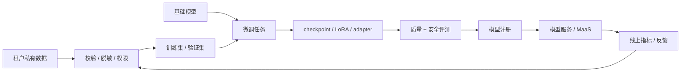

# 第 12 章：微调与模型定制

## 12.1 本章回答的问题

- full fine-tuning、LoRA、QLoRA、adapter 和 prompt tuning 分别适合什么场景？
- 企业私有数据微调如何处理数据、安全、调度和模型管理？
- 微调平台如何从实验脚本变成可复用的产品能力？

## 12.2 本章上下文

- 层级定位：本章属于 `Model 层`，重点讨论模型训练、后训练、微调、评测和模型服务化。
- 前置依赖：建议先理解 第 11 章：后训练 中的核心对象和路径。
- 后续关联：本章内容会继续连接到 第 13 章：模型评测，并在系统地图、深度标准和读者测试中被交叉引用。
- 读完能力：读完本章后，读者应能把《微调与模型定制》中的概念映射到 AI Factory 的生产路径、工程对象、观测证据和设计取舍。

## 12.3 读者测试

- 机制题：读者能否解释 full fine-tuning、LoRA 与 QLoRA、adapter、prompt tuning 的核心机制，以及它们如何共同支撑《微调与模型定制》？
- 边界题：读者能否区分 模型算法、模型产物、serving release、评测证据和基础设施容量 的责任边界，并说明哪些问题不能简单归因到本章组件？
- 路径题：读者能否从模型产物追到数据、训练、评测、serving release、路由和回滚，并指出本章对象在路径中的位置？
- 排障题：当《微调与模型定制》相关生产症状出现时，读者能否列出第一层证据、下一跳证据、可能 owner 和止血动作？


## 12.4 一个真实场景

一个企业客户希望用内部客服记录微调模型，让模型掌握行业术语、工单分类和标准话术。业务方期待模型更懂业务，安全团队担心客户隐私进入训练日志，平台团队担心每个客户都提交自定义训练后 GPU 资源失控。第一次试点用脚本完成，效果看起来不错，但很快遇到数据上传、脱敏、训练失败、模型版本、评测、上线、回滚和权限归属问题。脚本能完成一次实验，却无法支撑持续交付。

微调的工程难点不在于启动一次训练，而在于把模型定制变成可治理、可复现、可交付的流程。企业客户关心的是“我的数据是否安全、模型是否可控、效果是否可验证、上线后能否回滚”。平台关心的是“资源是否可预测、产物是否可管理、成本是否可计量、多租户是否隔离”。两组问题都不由训练代码单独回答。

还要警惕微调被误用。许多知识更新、事实查询和文档问答更适合 RAG；许多格式问题可以通过 prompt、schema 和后处理解决；许多工具调用问题需要改 Agent 编排而不是改权重。微调适合改变模型行为模式、术语习惯、输出风格和任务适配，但不是所有定制需求的默认答案。正确判断“是否需要微调”，是模型定制平台的第一道门槛。

这个判断最好产品化。平台可以在创建任务前要求用户描述目标、数据类型、更新频率、期望指标和风险等级，然后推荐 RAG、prompt、LoRA 或 full fine-tuning。没有这个入口，用户会把所有效果问题都提交成训练任务，平台资源和评测能力都会被低价值实验消耗。

## 12.5 核心概念

微调（fine-tuning）是在已有模型基础上，用特定数据继续训练，使模型适应某个任务、领域、组织风格或输出约束。和预训练相比，微调数据量和成本通常更小，迭代更快；和 prompt engineering 相比，微调会改变模型权重或增加可训练参数，因此产物需要注册、评测、权限和服务策略。

Full fine-tuning 更新模型全部或大部分参数，能力强但成本高、风险高。LoRA（Low-Rank Adaptation，低秩适配）训练少量低秩增量参数，冻结基础模型；QLoRA 在量化基础模型上训练 LoRA，进一步降低显存需求。Adapter 是插入模型的小型可训练模块，prompt tuning 则学习可训练的 prompt 表示。它们都属于不同程度的模型定制方法。

企业微调的关键对象包括 tenant、base model、dataset、training job、artifact、evaluation、registry entry、serving policy 和 access control。微调不只是训练任务，还涉及数据上传、脱敏、格式校验、队列、配额、失败恢复、模型注册、灰度发布和审计。缺少其中任何一环，都可能让定制能力停留在实验室阶段。

微调的成功标准也不只是训练 loss 下降。它要在目标任务上提升，同时不破坏通用能力、安全边界和服务成本。一个客服微调模型如果更会行业术语，但更容易泄露隐私或拒答策略退化，就不能直接上线。微调平台必须把质量、安全、成本和可运营性一起纳入门禁。

还要区分模型定制和租户隔离。定制模型可能只服务一个租户，也可能服务一个行业或多个内部团队。不同共享范围对应不同数据要求、权限策略和评测门槛。平台应在模型注册时明确产物归属和可见范围，避免“为一个客户训练的模型”被误用到其他场景。

## 12.6 系统架构

微调平台连接数据治理、训练调度、评测、模型注册和模型服务。租户上传或选择数据后，平台先做格式校验、脱敏、权限检查、去重和训练/验证集划分；随后根据方法选择 full fine-tuning、LoRA、QLoRA、adapter 或 prompt tuning；训练完成后产出 checkpoint 或 adapter artifact；评测通过后进入 model registry；最后由 MaaS 或模型服务按租户策略加载和发布。

这条链路必须多租户隔离。不同企业的数据、训练日志、模型产物和评测结果不能互相可见；共享基础模型时，adapter 或微调权重也要绑定租户和权限；服务时不能把一个租户的定制产物误加载给另一个租户。微调平台比普通训练平台更接近客户数据，因此安全和审计是核心功能，而不是附加功能。

架构上还要处理产物形态。Full fine-tuning 可能产出完整 checkpoint，LoRA/adapter 产出小型增量参数，prompt tuning 产出 soft prompt。不同产物的存储、加载、合并、版本兼容和服务方式不同。模型注册系统必须知道产物依赖哪个 base model、tokenizer、推理引擎版本和安全策略，否则上线时容易出现不兼容。

微调架构还应内置比较基线。每个任务都应有 base model 表现、prompt/RAG 基线和微调后表现。若微调只比原始模型好，却不如简单 RAG 或更好的 prompt，就不应进入生产。平台需要帮助用户证明“训练值得做”，而不是只证明“训练成功完成”。

架构还要支持失败闭环。数据未通过校验时返回可修复报告，训练失败时保留日志和资源快照，评测未通过时说明失败维度，发布失败时能回滚到上一版本。没有这些状态，用户只会看到“任务失败”，平台也无法改进流程。微调平台的体验来自全链路反馈。



## 12.7 full fine-tuning

Full fine-tuning 更新模型全部或大部分参数，适合需要深度改变模型行为、领域能力或任务模式的场景。它可以让模型充分吸收新数据，但代价是显存、计算、存储和评测成本较高。由于基础权重被改变，模型可能出现灾难性遗忘、安全能力退化或通用能力下降。它不是多租户自助定制的低风险默认选项。

Full fine-tuning 的优势在于能力上限和一致性。对于少数高价值场景，例如专用行业模型、内部代码模型或长期维护的企业模型，完整微调可能比加载大量 adapter 更简单，也更容易在服务端做统一优化。但这种选择要求更严格的数据治理、更完整评测和更清晰的版本生命周期。一次 full fine-tuning 产物通常应被当成新模型管理。

工程上，full fine-tuning 需要关注训练资源和恢复能力。它可能需要多卡或分布式训练，需要保存完整 checkpoint、optimizer 状态和训练日志。相比 LoRA，产物体积更大，注册和存储成本更高；上线时也可能需要独立部署或重新做推理优化。平台应提前估算成本，而不是让租户提交后才发现资源不足。

上线门禁应包含通用能力、安全能力和目标任务评测。Full fine-tuning 改动范围大，不能只看目标领域提升。若一个客服模型更懂行业术语，却在通用对话、拒答或工具调用上退化，就需要限制使用范围或继续训练。Full fine-tuning 适合严肃模型产品，不适合无治理地批量生成私有变体。

它还需要更强成本审批。完整权重训练和服务通常占用更多存储、构建和推理资源，后续每个版本都要维护。若只是少量格式适配，full fine-tuning 的长期运维成本可能超过收益。平台应把训练成本和服务成本一起展示给决策者。

## 12.8 LoRA 与 QLoRA

LoRA 即 Low-Rank Adaptation，通过训练低秩增量矩阵适配模型，冻结原始权重。它的核心价值是降低训练成本和产物大小，让多个定制版本可以共享同一个 base model。QLoRA 在量化基础模型上训练 LoRA，进一步降低显存需求，适合资源受限或多租户微调场景。二者是企业微调中最常见的参数高效方法之一。

LoRA 的优势是轻量、可管理、易回滚。一个租户可以拥有自己的 LoRA artifact，基础模型保持不变；多个版本可以并存；评测不通过时可以丢弃增量参数；服务端可以选择动态加载或合并权重。对于客服话术、领域术语、格式偏好和中等复杂度任务，LoRA 往往比 full fine-tuning 更经济。

LoRA 也有边界。它依赖 base model 的能力，不能凭少量数据创造基础模型完全不具备的能力；数据质量差时，LoRA 仍会学习错误模式；多个 LoRA 同时加载、组合或合并可能引入服务复杂度；不同推理引擎对动态 LoRA 的支持和性能表现也不同。平台必须把 LoRA 视为模型产物，而不是随意文件。

QLoRA 进一步引入量化相关取舍。量化降低显存占用，但可能影响训练稳定性、数值行为和最终质量；不同硬件、框架和量化配置可能导致结果差异。平台应记录 quantization config、base model 版本、adapter 配置和评测结果。LoRA/QLoRA 的低成本优势，只有在产物管理和服务策略清晰时才能真正规模化。

服务端还要考虑 LoRA 的热加载和缓存。高频 adapter 可以常驻，低频 adapter 可以按需加载，但加载延迟、显存占用和并发隔离都要被观测。若平台忽视这些运行时成本，LoRA 训练阶段的节省可能会在服务阶段被复杂度抵消。

## 12.9 adapter

Adapter 是插入模型中的小型可训练模块，通过训练少量附加参数适配特定任务。它和 LoRA 一样属于参数高效微调思路，但实现形式不同。Adapter 可以让不同任务共享同一个基础模型，同时使用不同附加模块表达任务差异。对于多任务、多租户或需要快速切换定制能力的平台，adapter 是一种重要设计选项。

Adapter 的工程关注点首先是兼容性。一个 adapter 依赖特定 base model、模型结构、层位置、hidden size、tokenizer 和推理实现。基础模型升级后，旧 adapter 不一定可用；推理引擎更新后，动态加载方式也可能变化。因此注册系统必须记录 adapter 的依赖关系和兼容范围，不能只记录 artifact 路径。

服务加载是第二个关注点。平台可以为每个 adapter 独立部署模型，也可以在同一 base model 实例上动态加载 adapter。独立部署隔离性好但资源成本高；动态加载节省资源但需要处理加载延迟、缓存、并发隔离和租户路由。对于高频租户，可以常驻 adapter；对于低频租户，可以按需加载。策略应由流量和 SLA 决定。

Adapter 还需要评测和回滚。由于 adapter 改变的是部分行为，它可能在目标任务上有效，但在工具调用、安全拒答或输出长度上产生副作用。平台应把 adapter 当成一等模型版本，记录数据、训练配置、评测、权限、状态和发布历史。只有这样，adapter 才能支撑企业级定制，而不是变成对象存储中的散乱文件。

Adapter 还适合做组合能力管理，但组合会增加风险。多个 adapter 是否能叠加、优先级如何、冲突如何处理，不能靠用户猜测。若平台不支持组合，就应明确禁止；若支持组合，就需要专门评测和路由策略。定制能力越灵活，治理越不能缺位。

## 12.10 prompt tuning

Prompt tuning 学习一组可训练 prompt 表示，而不是更新全部模型参数。它与人工 prompt engineering 不同：人工 prompt 是人写的文本，prompt tuning 学到的是连续向量或可训练提示表示。它的改动更小、训练成本更低，适合某些分类、抽取或固定任务适配，但对复杂行为改变的能力有限。

Prompt tuning 的优势是轻量和隔离。它通常不会大幅改变基础模型权重，产物小，适合快速实验和低风险适配。对于任务边界清晰、输出模式稳定、数据量有限的场景，它可能比 LoRA 更简单。平台可以把 prompt tuning 产物作为模型配置或轻量 artifact 管理，而不必为每个任务部署完整模型。

它的缺点是能力边界和可解释性。学到的 prompt 表示不如自然语言提示直观，也未必能处理复杂多轮行为、工具调用和强领域知识。若任务需要模型学习大量术语、风格或流程，prompt tuning 可能不足。评估时不能只看训练集效果，要看目标任务的泛化和线上稳定性。

工程上，应把 prompt tuning 放在定制方法选择树中。若人工 prompt 和 RAG 已能解决问题，就不必训练；若需要小幅任务适配，可以尝试 prompt tuning；若需要更强行为改变，再考虑 LoRA 或 full fine-tuning。平台提供多种方法的意义，是让用户按问题选择，而不是把所有需求推向最重的训练方式。

Prompt tuning 的产物也需要治理。它虽然轻量，但仍可能改变输出风格、安全边界和任务成功率。平台应记录训练数据、目标任务、适用模型和评测结果，并限制它的使用范围。轻量不等于无风险，尤其是在面向外部客户的生产服务中。

它也适合做方法探索。若 prompt tuning 已能达到目标，就无需更重训练；若效果不足，再升级到 LoRA。这样可以用更低成本验证需求是否真实存在，减少盲目微调。

## 12.11 企业私有数据微调

企业私有数据微调必须先解决数据治理。数据进入平台前，应完成权限确认、用途声明、格式校验、敏感信息检测、脱敏、去重、训练/验证集划分和保留策略。客服记录、合同、代码、工单和知识库都可能包含个人信息、商业秘密或访问凭证。微调平台如果把这些内容写入训练日志或错误栈，本身就会制造安全事故。

跨租户隔离是底线。一个租户的数据不能进入另一个租户的训练集、评测集、日志、样本预览或模型产物。即使共享基础模型，也要确保 adapter、checkpoint、权限和服务路由绑定正确。平台还应记录谁上传数据、谁批准训练、谁可以查看样本、谁可以发布模型。企业客户购买的不是一次训练，而是可信定制流程。

数据质量同样关键。企业数据常有噪声、重复、历史策略、错误回答、过期知识和不一致格式。直接用这些数据训练，模型可能学会旧流程或错误话术。平台应提供数据报告：样本数量、token 数、重复率、敏感信息、标签分布、异常格式和验证集覆盖。业务方需要先确认数据代表目标行为，模型才可能学到正确模式。

还要明确微调与 RAG 的边界。若目标是让模型知道最新政策、客户文档或频繁变化的知识，RAG 更可控；若目标是让模型稳定输出某种话术、分类、格式或工作流，微调更合适。企业定制方案通常是组合：RAG 提供事实，微调提供行为，平台策略提供权限和审计。

企业场景还要处理数据删除和合同结束。客户要求删除训练数据或终止服务时，平台需要知道数据存在哪里、产物是否依赖该数据、是否需要删除 adapter 或 checkpoint。若数据 lineage 不完整，后续合规请求会很难处理。私有数据微调从第一天就要设计生命周期。

## 12.12 微调任务调度

微调任务通常比预训练小，但数量更多、租户更多、提交更频繁。一个平台可能同时服务内部团队、企业客户、实验任务和紧急交付。若没有队列、配额和优先级，低价值实验可能占满 GPU，高优先级客户任务排队；若没有成本预估，租户可能提交超出预算的训练。微调调度是多租户资源治理问题。

调度系统应区分任务类型。开发调试任务可以使用小数据、小资源和短超时；生产微调需要稳定资源和完整评测；紧急客户交付可能有更高优先级；full fine-tuning、LoRA 和 prompt tuning 的资源需求也不同。平台不应让所有微调任务使用同一资源模板。任务模板和资源规格是控制成本和稳定性的工具。

微调 workload 还需要失败重试和可恢复能力。数据格式错误应快速失败并给出可行动反馈；资源不足应排队而不是无限 pending；训练中断应能从 checkpoint 或中间产物恢复；超时任务应保留日志和诊断信息。对租户来说，失败原因比失败本身更重要。一个黑盒训练平台很难被企业接受。

调度还应与计费和预算连接。微调消耗 GPU 小时、存储、评测和服务增量成本。平台应在任务提交前估算成本，执行中记录资源消耗，结束后生成账单或 showback。没有成本可见性，微调容易从“低成本定制”变成不可控资源黑洞。微调平台应像 MaaS 一样可运营。

资源池设计也要区分训练和服务。训练任务可以排队和延迟，线上定制模型服务则需要稳定 SLA。若同一批 GPU 同时承担训练和推理，平台必须定义抢占、限流和优先级。否则大量微调任务可能影响在线模型体验。

## 12.13 微调模型管理

微调产物必须进入模型注册系统。注册信息应包括租户、基础模型、微调方法、数据版本、训练配置、代码版本、artifact 类型、评测结果、权限、状态、创建人、发布时间和回滚关系。没有注册，产物会散落在对象存储或训练目录里，后续无法确定线上到底用了哪个版本，也无法解释模型行为。

模型管理还要处理兼容性。LoRA 或 adapter 绑定特定 base model 和 tokenizer；full fine-tuning 产物可能需要独立 serving profile；prompt tuning 可能依赖特定输入模板。基础模型升级时，旧微调产物不应默认兼容。Registry 应能标记 compatible、deprecated、blocked 和 needs-reeval 等状态，让发布系统避免错误加载。

服务策略是模型管理的一部分。合并权重简单、延迟稳定，但会增加存储和部署数量；动态加载 adapter 节省资源，但需要管理加载延迟、缓存和隔离；独立部署隔离强但成本高。不同租户和 SLA 可以采用不同策略。模型管理不能只记录产物，还要记录如何服务这个产物。

最后要支持生命周期治理。微调模型可能过期、被新数据替代、因安全问题下线，或因租户合同结束需要删除。平台应提供发布、冻结、回滚、下线、删除和审计流程。企业微调产物涉及客户数据，生命周期管理既是工程问题，也是合规和商业问题。

模型管理还要支持发现和清理。多租户平台运行一段时间后，会产生大量实验 adapter、失败任务产物和过期模型。若没有状态和保留策略，存储成本会上升，错误加载风险也会增加。Registry 应区分 draft、candidate、production、deprecated 和 archived。

还要支持模型卡片。每个微调产物应说明适用场景、数据来源摘要、已通过评测、已知限制、服务方式和负责人。模型卡片让应用团队知道如何使用，也让平台团队知道如何运维。

## 12.14 工程实现

微调任务模板应把数据、方法、资源、产物和门禁放在同一个声明中。模板既给平台调度使用，也给审计和复现使用。用户提交任务时，平台应校验租户权限、base model 是否允许微调、数据是否通过脱敏、资源是否在配额内、评测是否配置完整。缺少这些校验，微调很快会退化为不受控脚本集合。

示例模板如下：

```yaml
fine_tuning_job:
  tenant: enterprise-a
  base_model: af-chat-base
  method: lora
  dataset: customer-service-sft-v1
  resources:
    gpu_type: allowed_by_platform
    gpu_count: 1
  output:
    artifact_type: adapter
    registry_name: enterprise-a-service-lora-v1
  gates:
    require_eval: true
    require_safety_check: true
```

实现流程可以拆成五步。第一步是数据准入，生成数据报告和版本；第二步是任务计划，估算资源和成本；第三步是训练执行，记录日志、指标和 checkpoint；第四步是评测门禁，执行质量、安全和回归测试；第五步是注册发布，写入 registry 并配置服务策略。每一步都应有状态和审计记录。

微调产物还应进入模型产物供应链。LoRA、QLoRA、adapter、prompt tuning 权重和合并后的 full model 都应写入 `model_artifact_provenance`：记录 base model digest、微调数据 lineage、训练配置、adapter 格式、merge 脚本、tokenizer/template 版本、评测门禁和签名。它们同时要受 `storage_security_boundary` 管控，因为 adapter 往往携带企业私有数据分布和业务能力，不能被当作普通小文件在共享对象桶中复制。没有 provenance 和边界，微调平台很容易出现“线上加载了哪个 adapter 不清楚”“客户数据训练出的 adapter 被错误复用”“回滚只回滚 base model 未回滚 adapter”这类事故。

平台还应提供自助能力和专家兜底。常见 LoRA 微调可以产品化为表单、API 和模板；复杂 full fine-tuning 或高风险数据需要专家审核。这样既能支持规模化，又能避免让普通用户接触过多底层训练细节。微调平台的目标是把正确流程默认化，而不是把所有开关暴露给用户。

实现时还应把评测自动绑定到任务模板。用户不应每次手工选择安全评测、格式评测和领域评测；平台应根据任务类型和风险等级自动生成最小评测矩阵。这样既减少遗漏，也让不同微调任务之间可以比较。评测模板是平台化的关键。

任务状态机也要清晰：draft、validated、queued、running、evaluating、registered、serving、failed、rolled_back。状态清楚，用户和运营人员才能知道下一步动作。微调平台不是黑盒训练服务，而是可跟踪交付流程。

关键状态转换应有权限校验和事件记录，尤其是发布、回滚和删除。

## 12.15 常见故障

第一类故障是私有数据泄露。样本原文进入训练日志、错误栈、评测报告或可观测系统，导致未授权人员可见。解决方向包括脱敏、日志分级、样本访问控制、最小权限和审计。微调平台必须默认把数据当成敏感资产，而不是普通训练输入。

第二类故障是微调数据质量差。数据太少、重复、标注不一致、历史话术过期或包含错误回答，导致模型学到错误格式或错误业务逻辑。表现可能是训练指标正常，但线上效果差。排查时应先看数据报告和验证集，而不是只调学习率或训练轮数。微调质量上限常由数据决定。

第三类故障是产物不兼容。Adapter 绑定的 base model 与线上模型不一致，tokenizer 变化后输出异常，推理引擎不支持某种动态加载方式，或量化配置不匹配。平台应在注册和发布时做兼容性检查，不能等服务启动失败。兼容性是微调产物管理的核心。

第四类故障是评测缺失。模型在目标样例上表现更好，但安全拒答、通用任务、工具调用或输出长度退化。企业定制尤其容易只看业务方关心的正样例，忽略安全和回归。上线前必须有最小评测矩阵，灰度后继续观察真实指标。没有评测的微调只是带风险的猜测。

第五类故障是服务策略错误。训练产物正确，但发布时加载了错误 adapter、路由到错误租户、未启用必要 prompt 模板，或动态加载延迟导致线上超时。微调故障不一定发生在训练阶段，很多发生在注册、路由和 serving。排查时要覆盖完整链路。

第六类故障是基线缺失。团队只看到微调后效果不错，却不知道简单 prompt、RAG 或更小模型是否同样有效。结果是用训练解决本可由产品配置解决的问题。方法选择错误也是平台故障，会造成长期成本浪费。

## 12.16 性能指标

训练指标包括任务成功率、排队时间、训练时长、GPU 小时、失败重试次数、checkpoint 成功率和资源利用率。它们回答平台是否能稳定交付微调任务。微调任务数量多，单次成本可能不大，但失败和排队会直接影响客户体验。调度和训练指标应按租户、方法和资源规格切分。

质量指标包括领域评测、格式正确率、人工评分、线上 A/B、工具调用成功率、分类准确率和业务成功率。它们回答微调是否带来目标收益。指标应和基线模型比较，而不是只看微调模型绝对表现。微调如果没有超过 prompt/RAG 基线，就不一定值得上线。

安全与治理指标包括敏感信息检测通过率、安全评测通过率、误拒率、越权行为、数据脱敏覆盖率、产物权限错误、回滚次数和审计事件。它们回答定制过程是否可信。企业微调平台的可信度来自这些治理指标，而不只是训练成功率。

成本指标包括单次微调成本、每租户微调成本、存储成本、评测成本、服务增量成本和 adapter 加载成本。LoRA 训练便宜，不代表服务一定便宜；大量低频 adapter 也会增加管理和加载开销。成本指标能帮助平台决定哪些微调自助化，哪些需要商业审批。

还应观察方法选择指标。多少需求被 RAG 解决，多少进入 LoRA，多少升级到 full fine-tuning；不同方法的成功率、成本和上线率如何。这些指标能帮助平台改进推荐和门禁。微调平台不是只执行任务，也要学习哪些定制方式真正有效。

线上指标也要纳入评估。微调模型上线后，应持续观察用户采纳、投诉、回滚、输出长度和延迟变化。离线评测通过只能说明可灰度，线上指标才证明定制是否创造价值。

## 12.17 设计取舍

第一个取舍是微调与 RAG。知识更新、事实查询和文档问答通常优先 RAG，因为知识可更新、可追溯、可权限控制；行为风格、格式稳定、分类模式和任务流程可以考虑微调。很多企业场景需要二者结合：RAG 提供事实，微调提供表达和流程。把知识硬写进权重，往往会增加更新和审计成本。

第二个取舍是 full fine-tuning 与参数高效微调。Full fine-tuning 能力强但成本高、风险大；LoRA、QLoRA、adapter 更适合多租户和成本敏感场景，但能力边界受 base model 限制。平台应默认轻量方法，只有在目标收益、数据质量和评测门禁充分时，才升级到完整微调。

第三个取舍是动态加载与独立部署。动态加载 adapter 节省资源，适合多租户低频场景，但增加延迟、缓存和隔离复杂度；独立部署成本高，但性能稳定、隔离清晰，适合高价值或高 SLA 租户。服务策略应由流量、SLA、风险和成本共同决定，而不是由训练方法自动决定。

最后是自助化与治理。完全自助能提高交付速度，但可能带来数据、安全和资源风险；完全人工审核能降低风险，但难以规模化。可行路径是分级治理：低风险小规模 LoRA 自助，高风险数据和大规模 full fine-tuning 需要审批。平台应让常规路径高效，让高风险路径可控。

取舍还包括统一平台与客户定制。统一模板降低维护成本，但企业客户常有特殊数据、评测和安全要求。平台应通过配置和策略支持差异，而不是为每个客户 fork 一套流程。可配置的平台，比堆积定制脚本更可持续。

最后是短期交付与长期维护。为客户快速训练一个模型很容易，长期维护多个版本、数据删除、基础模型升级和安全回归才是真成本。设计微调平台时，应从生命周期出发，而不是从第一次训练成功出发。

## 12.18 小结

- 微调是模型定制手段，不是所有知识问题的默认答案。
- LoRA/QLoRA 适合多租户和成本敏感场景，但仍需要产物管理和评测。
- 企业微调必须把数据安全、任务调度、评测和模型注册纳入平台。
- 微调产物的谱系、兼容性和权限管理决定它能否生产化。

## 12.19 延伸阅读

- [LoRA: Low-Rank Adaptation of Large Language Models](https://arxiv.org/abs/2106.09685)
- [QLoRA: Efficient Finetuning of Quantized LLMs](https://arxiv.org/abs/2305.14314)
- [Hugging Face PEFT documentation](https://huggingface.co/docs/peft)
