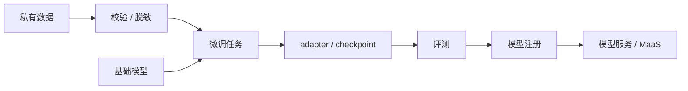

# 第 12 章：微调与模型定制

## 本章回答的问题

- full fine-tuning、LoRA、QLoRA、adapter 和 prompt tuning 分别适合什么场景？
- 企业私有数据微调如何处理数据、安全、调度和模型管理？
- 微调平台如何从实验脚本变成可复用的产品能力？

## 一个真实场景

一个企业客户希望用内部客服记录微调模型。业务方期待模型学会行业术语，安全团队担心客户隐私泄露，平台团队担心每个客户都提交自定义训练任务后 GPU 资源失控。第一次试点用脚本完成，但很快遇到数据上传、脱敏、任务排队、训练失败、模型版本和回滚问题。

微调的工程难点不在于启动一次训练，而在于把模型定制变成可治理、可复现、可交付的流程。

## 核心概念

微调是在已有模型基础上，用特定数据继续训练，使模型适应某个任务、领域或组织偏好。和预训练相比，微调数据量和成本通常更小；和 prompt engineering 相比，微调会改变模型权重或附加参数。

企业微调常见目标包括术语适配、格式稳定、客服话术、代码风格、分类任务和工具调用。微调不是解决所有问题的默认答案。很多知识更新更适合 RAG，很多格式问题可以通过 prompt、schema 和后处理解决。

## 系统架构



微调平台连接数据治理、训练调度、评测、模型注册和服务发布。缺少任一环节，微调都难以规模化。

## 12.1 full fine-tuning

Full fine-tuning 更新模型全部或大部分参数。它能力强，适合需要深度改变模型行为的场景，但显存、计算和存储成本高，也更容易造成灾难性遗忘或安全能力退化。

生产中 full fine-tuning 需要严格评测和版本管理。它通常不适合作为大量租户自助微调的默认方案，除非平台有充分资源隔离和质量门禁。

## 12.2 LoRA 与 QLoRA

LoRA 即 Low-Rank Adaptation，通过训练低秩增量矩阵来适配模型，冻结原始权重。QLoRA 在量化基础模型上训练 LoRA，进一步降低显存需求。它们是企业微调和多租户定制中常见的参数高效微调方法。

LoRA 的优势是成本低、产物小、便于多版本管理。代价是能力边界受基础模型影响，多个 LoRA 的加载、合并和服务策略需要平台支持。

## 12.3 adapter

Adapter 是插入模型中的小型可训练模块。它和 LoRA 一样属于参数高效微调思路。Adapter 可以让不同任务拥有不同附加参数，而共享基础模型。

Adapter 的工程关注点是产物管理和服务加载。平台需要知道某个 adapter 适配哪个基础模型、哪个 tokenizer、哪个推理引擎版本，以及是否支持动态加载。

## 12.4 prompt tuning

Prompt tuning 学习一组可训练 prompt 表示，而不是直接更新全部模型参数。它适合某些任务适配，但对复杂行为改变的能力有限。和人工 prompt engineering 相比，它更接近训练方法；和 LoRA 相比，它改动更小。

Prompt tuning 的优势是轻量，缺点是可解释性和能力边界不如显式数据与模型调整直观。生产中应通过评测决定是否足够。

## 12.5 企业私有数据微调

企业私有数据微调必须处理数据权限、脱敏、合规、数据保留和模型产物归属。数据进入训练平台前，应做格式校验、敏感信息检测、重复样本处理和训练/验证集划分。

平台还要防止跨租户污染。一个租户的数据不能进入另一个租户模型。训练日志、样本预览、错误信息和模型输出也可能泄露敏感信息，需要脱敏和访问控制。

## 12.6 微调任务调度

微调任务通常比预训练小，但数量多、租户多、提交频繁。它适合队列、配额和优先级管理。平台需要支持任务模板、资源规格、超时、失败重试和成本预估。

微调 workload 可能使用单卡、多卡或小规模分布式。调度系统应区分开发调试、生产微调和紧急客户交付，避免低优先级实验占用关键资源。

## 12.7 微调模型管理

微调产物需要进入模型注册系统。注册信息应包括基础模型、微调方法、数据版本、训练配置、评测结果、产物路径、权限和状态。没有模型管理，微调产物会散落在对象存储里，无法上线、回滚或审计。

服务时要决定是合并权重、动态加载 adapter，还是独立部署模型。合并权重简单但占用更多存储和显存；动态加载节省资源但增加服务复杂度和延迟风险。

## 工程实现

微调任务模板：

```yaml
fine_tuning_job:
  tenant: enterprise-a
  base_model: af-chat-base
  method: lora
  dataset: customer-service-sft-v1
  resources:
    gpu_type: allowed_by_platform
    gpu_count: 1
  output:
    artifact_type: adapter
    registry_name: enterprise-a-service-lora-v1
  gates:
    require_eval: true
    require_safety_check: true
```

这类模板让微调从脚本变成平台能力。

## 常见故障

- 私有数据未脱敏进入训练日志。
- 微调数据太少或质量差，模型学到错误格式。
- 基础模型版本和 adapter 不匹配。
- 微调后未做安全回归，拒答或越权行为变化。
- 产物没有注册，后续无法复现上线模型。

## 性能指标

- 训练：任务成功率、排队时间、训练时长、GPU 小时。
- 质量：领域评测、格式正确率、人工评分、线上 A/B。
- 安全：敏感信息泄露检测、安全评测通过率。
- 管理：产物数量、活跃 adapter、回滚次数。
- 成本：单次微调成本、每租户微调成本、服务增量成本。

## 设计取舍

微调和 RAG 经常被混用。知识更新、事实查询和文档问答通常优先 RAG；行为风格、格式稳定和特定任务模式可以考虑微调。LoRA 等轻量方法适合多租户定制，full fine-tuning 适合少数高价值深度定制。

## 小结

- 微调是模型定制手段，不是所有知识问题的默认答案。
- LoRA/QLoRA 适合多租户和成本敏感场景。
- 企业微调必须把数据安全、任务调度、评测和模型注册纳入平台。
- 微调产物的谱系和权限管理决定它能否生产化。

## 延伸阅读

- TODO: LoRA 论文
- TODO: QLoRA 论文
- TODO: 参数高效微调工程实践
