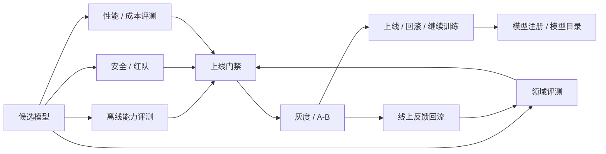
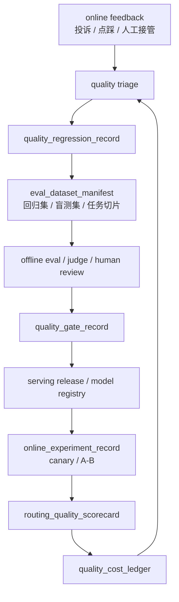
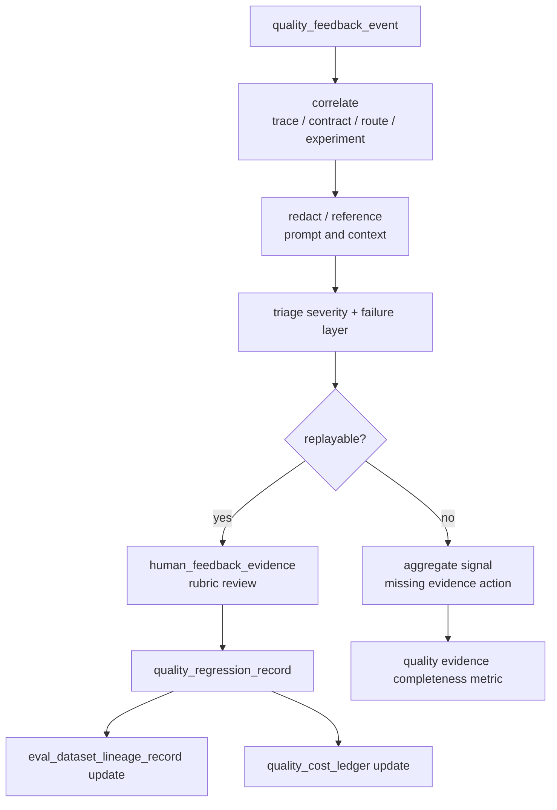
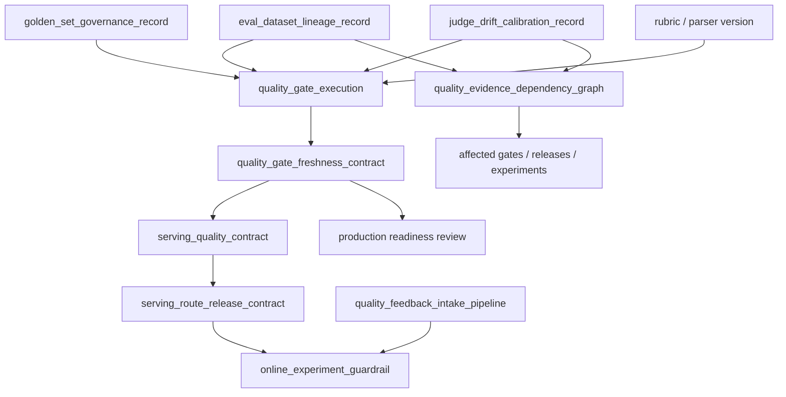
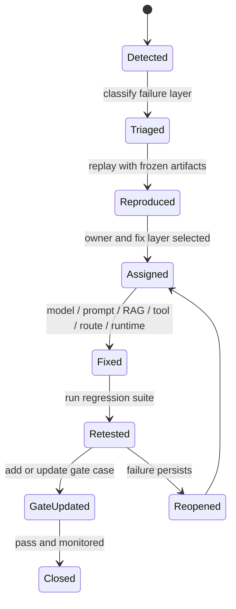
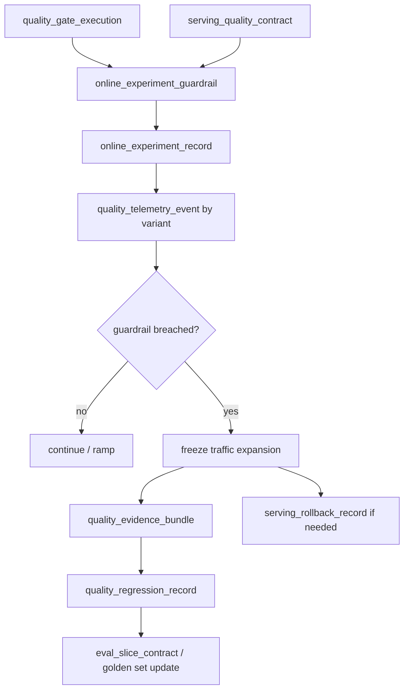
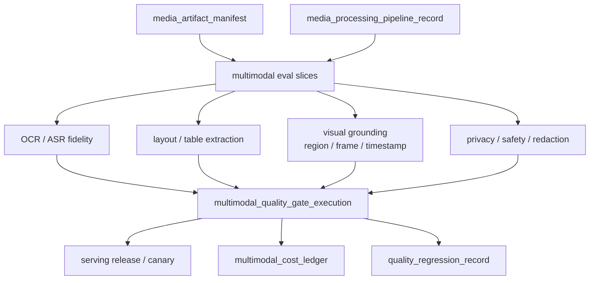

# 第 13 章：模型评测

## 13.1 导读

### 13.1.1 本章回答的问题

- 模型评测为什么不能只看一个 benchmark 分数？
- accuracy、latency、throughput、human evaluation、red teaming 和线上 A/B 分别适合回答什么问题？
- 评测如何反向影响容量规划、上线门禁和成本模型？


### 13.1.2 本章上下文

- 层级定位：本章属于 `Model 层`，重点讨论模型训练、后训练、微调、评测和模型服务化。
- 前置依赖：建议先理解 第 12 章：微调与模型定制 中的核心对象和路径。
- 后续关联：本章内容会继续连接到 第 14 章：模型服务，并在系统地图、深度标准和读者测试中被交叉引用。
- 读完能力：读完本章后，读者应能把《模型评测》中的概念映射到 AI Factory 的生产路径、工程对象、观测证据和设计取舍。


### 13.1.3 读者测试

- 机制题：读者能否解释 benchmark、accuracy、latency、throughput 的核心机制，以及它们如何共同支撑《模型评测》？
- 边界题：读者能否区分 模型算法、模型产物、serving release、评测证据和基础设施容量 的责任边界，并说明哪些问题不能简单归因到本章组件？
- 路径题：读者能否从模型产物追到数据、训练、评测、serving release、路由和回滚，并指出本章对象在路径中的位置？
- 排障题：当《模型评测》相关生产症状出现时，读者能否列出第一层证据、下一跳证据、可能 owner 和止血动作？


### 13.1.4 一个真实场景

一个新模型在通用 benchmark 上提升明显，离线报告显示推理、知识和多语言能力都有改善。平台把它灰度到客服应用后，客服转人工率反而上升，用户投诉“回答更像百科，不像客服”。排查发现，离线评测没有覆盖企业知识库、拒答策略、引用格式和客服话术；性能评测只测了空载单请求，没有测真实 RAG context；成本评估也没有发现新模型输出更长，导致 cost per ticket 上升。模型“更强”，但不适合这个应用。

这个场景说明，评测的目标不是证明模型在排行榜上更强，而是判断它是否适合某个任务、某个用户群、某个 SLA 和某个成本边界。公开 benchmark 能提供基础参考，但业务成功依赖领域数据、产品约束、风险边界和服务成本。AI Factory 里的评测必须连接模型能力和生产系统，而不是只服务模型发布宣传。

评测还承担组织沟通功能。模型团队关心能力提升，应用团队关心业务结果，平台团队关心延迟和成本，安全团队关心风险，SRE 关心稳定性。如果评测体系只输出一个总分，各团队无法据此做决策。好的评测应把候选模型拆成多个可比较维度，明确上线条件、回滚条件和后续优化方向。

因此，评测报告应像发布决策文档，而不是学术排行榜。它要回答模型能用于哪些场景、不能用于哪些场景、需要多少资源、有哪些风险、如何灰度、何时回滚。评测如果不能指导动作，就只是测量；AI Factory 需要的是能驱动生产决策的评测。

评测还应保留反例。通过的模型也会有失败样本，失败样本比平均分更能指导应用边界。对用户和平台来说，知道模型在哪些条件下不适合使用，和知道它在哪些任务上很强一样重要。


## 13.2 基础模型

### 13.2.1 核心概念

模型评测是用数据、指标和流程判断模型能力、风险、成本和上线可行性的系统。它包括离线 benchmark、领域评测、安全评测、人工评测、性能评测、线上 A/B 和业务指标分析。不同评测回答不同问题：benchmark 回答基础能力，领域评测回答任务适配，安全评测回答风险，性能评测回答服务可行性，线上实验回答真实用户效果。

Accuracy 描述答案是否正确，但开放生成任务中的“正确”往往包含事实性、完整性、格式、引用和约束遵循。Latency 描述响应速度，包括 TTFT、TPOT 和端到端耗时。Throughput 描述单位时间处理请求或 token 的能力。Human evaluation 用人工判断开放质量和偏好。Red teaming 主动寻找风险和失败模式。A/B 用真实流量比较模型或策略。

评测还要区分离线和线上。离线评测可复现、成本低、适合门禁和回归；线上评测真实但有用户影响，需要灰度和回滚。离线分数高不保证线上效果好，线上短期指标好也不代表长期安全。成熟平台会把自动评测、人工评测和线上实验组合起来，而不是选择其中一种。

从 AI Factory 视角看，评测结果应进入模型目录、路由策略、容量规划、计费和发布门禁。一个模型如果质量提升但吞吐下降，需要更多 GPU；如果输出更长，cost per token 或 cost per task 会变化；如果安全拒答更强，用户满意度可能变化。评测是模型生命周期的控制系统。

还要区分模型评测和系统评测。模型评测关注权重和行为，系统评测关注模型在 Gateway、RAG、工具、推理引擎和真实资源池中的表现。很多线上问题不是模型本身差，而是上下文拼接、服务参数、路由或工具策略不匹配。生产评测必须覆盖完整链路。


### 13.2.2 系统架构

模型评测系统通常从候选模型和基线模型开始，执行离线质量评测、领域评测、安全评测和性能评测。通过门禁后，候选模型进入灰度或 A/B；线上数据再回流到评测集和训练数据。评测结果写入 model registry 和模型目录，供发布、路由、容量规划和成本分析使用。这个系统把训练、服务和业务反馈连接起来。

评测架构需要同时支持可复现和可扩展。可复现要求固定数据版本、prompt 模板、解码参数、评审规则和模型版本；可扩展要求能够快速增加新任务、新领域和新风险样本。若评测数据和 prompt 不版本化，模型分数无法比较；若评测体系扩展困难，新业务上线后就没有合适门禁。

性能评测应与质量评测并行，而不是上线前最后补做。候选模型的上下文长度、输出长度、batch 行为、显存占用和吞吐，都会影响服务策略。一个模型在质量上通过，但在目标 SLA 下需要两倍 GPU，可能仍然不适合默认上线。评测系统必须把质量和基础设施事实放在同一发布决策中。

评测系统还需要权限和隔离。盲测集不应被随意下载，红队样本可能包含敏感攻击，线上反馈可能包含用户数据。评测平台既要让团队快速验证模型，又要防止数据泄漏和评测污染。评测数据治理是模型治理的一部分。

架构中还应有基线模型。每次评测都要和当前线上版本、上一候选版本或成本更低的替代模型比较。没有基线，分数本身很难解释。模型发布决策本质上是相对选择，而不是绝对判断。



生产评测还需要把多个事实对象串成闭环：`eval_dataset_manifest` 定义评测数据和污染控制，`quality_gate_record` 定义上线门禁，`online_experiment_record` 定义线上实验，`quality_feedback_event` 定义真实用户反馈，`quality_regression_record` 定义失败样本的修复和复测。没有这些对象，评测会停留在报告；有了这些对象，评测才能进入路由、发布、SRE 和经济模型。



`eval_dataset_manifest` 是评测系统最核心的元数据。它不是样本内容本身，而是说明样本从哪里来、覆盖什么任务、如何标注、谁能访问、如何防污染、何时过期、如何与线上反馈和回归集连接。一个模型候选如果只在“某个目录下的一批 JSON”上评测，后续无法判断分数变化来自模型、数据、prompt、评审规则还是样本泄漏。Manifest 让评测数据成为可治理资产。

```yaml
eval_dataset_manifest:
  dataset_id: support-quality-202606
  owner: model-quality
  purpose: release_gate
  task_slices:
    - faq_grounded_answer
    - rag_citation
    - no_answer_refusal
    - tool_call_json
    - safety_sensitive_request
  source:
    curated_cases: object://eval/support/curated
    online_feedback_events: [qfe-20260619-0001]
    regression_cases: [qrr-20260619-0007]
  labeling:
    rubric_version: support-rubric-v5
    human_review_required_for: [safety_sensitive_request, high_value_customer]
    judge_model_version: judge-202606
  execution_binding:
    prompt_template_version: support-v18
    tokenizer_version: tokenizer-202606
    decoding_profile: deterministic_eval
  governance:
    blind_split: holdout-202606
    data_classification: internal_sensitive
    allowed_readers: [model-quality, sre-oncall]
    exclude_from_training: true
```

Manifest 之后还需要 `eval_slice_contract`。Manifest 说明“有哪些样本”，slice contract 说明“每个任务切片为什么存在、最低覆盖要求是什么、由谁解释、失败后阻断什么生产动作”。很多评测体系看起来样本很多，但关键业务切片没有最低样本策略：高价值客户、长上下文、拒答、引用、工具调用、跨语言、低价模型 fallback 和人工接管场景混在一个总分里。这样总分上升时，团队无法知道核心业务是否真的安全。Slice contract 把评测从样本集合提升为发布契约。

```yaml
eval_slice_contract:
  contract_id: esc-support-202606
  dataset_id: support-quality-202606
  owner: model-quality
  business_binding:
    application: support-chat
    primary_business_metric: resolved_ticket_without_handoff
    protected_segments:
      - enterprise_high_value_customer
      - regulated_knowledge_base
  slices:
    - slice_id: rag_citation
      purpose: verify_answer_grounded_in_allowed_evidence
      minimum_coverage_policy: policy_defined_by_risk
      required_metrics:
        - citation_precision
        - citation_recall_on_required_evidence
        - answer_supported_by_citation
        - refusal_when_no_allowed_evidence
      hard_gates:
        no_high_severity_regression: required
        permission_replay_pass: required
      owner: knowledge-platform
    - slice_id: tool_call_json
      purpose: protect_agent_and_api_contract
      required_metrics:
        - schema_validity
        - tool_selection_accuracy
        - no_unapproved_side_effect
      hard_gates:
        valid_json_for_contract_cases: required
        side_effect_policy_replay: required
      owner: agent-platform
    - slice_id: low_cost_fallback
      purpose: verify_small_model_route_does_not_raise_handoff_cost
      required_metrics:
        - task_success_rate
        - human_handoff_delta
        - cost_per_successful_answer
      hard_gates:
        no_negative_margin_for_target_plan: required
      owner: gateway-and-economics
  release_binding:
    quality_gate_record: qg-af-chat-20260619
    online_experiment_guardrail: oeg-support-20260620
```

这个对象的核心不是固定样本数量，而是固定风险口径。样本数量可以随业务规模、流量和风险等级调整，但每个切片必须能回答三件事：为什么这个切片保护生产价值，哪些指标是硬门禁，失败后谁负责解释和修复。若 `rag_citation` 切片失败，不能用通用问答分数抵消；若 `low_cost_fallback` 切片导致人工接管上升，不能只说 token 成本下降。切片契约让评测门禁和商业决策共享同一套任务边界。

Golden set 还需要独立治理。Golden set 通常指长期保留、用于版本比较和回归判断的高价值样本集合；holdout 或 blind split 则是受控访问、用于防止调参过拟合的盲测部分。它们不能被随意复制到训练、prompt 调参或公开报告中。生产系统里常见的失败不是没有 golden set，而是 golden set 被多轮优化、人工挑选、样本泄漏和 judge 漂移污染后，仍然被当作可信门禁。

```yaml
golden_set_governance_record:
  governance_id: gsg-support-202606
  dataset_id: support-quality-202606
  protected_splits:
    golden_regression: object://eval/support/golden@sha256:example
    blind_holdout: object://eval/support/holdout@sha256:example
  access_control:
    readers: [model-quality]
    raw_sample_export: denied_by_default
    reviewer_ui_redaction: required
    break_glass_approval: security_and_quality_owner
  leakage_control:
    excluded_from_training: enforced
    excluded_from_sft_and_dpo: enforced
    prompt_tuning_access: denied
    overlap_scan_against_training_manifests: pass
    access_audit_window: continuous
  freshness_control:
    stale_case_policy: review_or_retire_when_business_rule_changes
    new_failure_intake: from_quality_regression_record
    slice_distribution_review: required_per_release_train
  judge_drift_control:
    rubric_version: support-rubric-v5
    judge_model_version: judge-202606
    human_anchor_cases: required
    judge_upgrade_requires_backtest: true
  release_decision:
    usable_for_gate: true
    invalidation_conditions:
      - overlap_with_training_data
      - unapproved_raw_export
      - judge_upgrade_without_backtest
      - stale_business_policy
```

Golden set 的治理记录让“评测可信度”本身可审计。若一次模型升级在 golden regression 上通过，但治理记录显示 blind holdout 曾被导出给训练团队，门禁结论应降级；若业务政策改变导致历史拒答案例不再适用，旧样本应退役或改标，而不是继续制造假回归；若 judge model 升级后没有用人工 anchor cases 回放，分数变化不能直接解释为模型变化。评测系统的可信度取决于样本、rubric、judge 和访问控制共同成立。

评测数据还需要 `eval_dataset_lineage_record`。Manifest 描述数据集应该是什么，lineage record 记录这次数据集版本实际如何生成、从哪些线上反馈或回归样本吸收、经过哪些脱敏和标注、是否进入训练排除列表、judge 或 rubric 是否变化。没有 lineage，团队看到评测分数变化时，无法区分是模型变了，还是评测集、评审规则或样本构成变了。

```yaml
eval_dataset_lineage_record:
  lineage_id: edl-support-quality-20260620
  dataset_id: support-quality-202606
  version: v20260620
  inputs:
    curated_cases: object://eval/support/curated@sha256:example
    quality_feedback_events: [qfe-20260619-0001, qfe-20260619-0042]
    quality_regression_records: [qrr-20260619-0007]
    red_team_cases: [rt-support-202606]
  transformations:
    pii_redaction: policy-v4
    deduplication: semantic-dedup-v2
    task_slice_assignment: rubric-support-v5
    holdout_split: deterministic_seed_recorded
  contamination_control:
    exclude_from_training_registry: recorded
    overlap_check_against_sft_data: pass
    overlap_check_against_public_benchmarks: reviewed
  judge_and_rubric:
    rubric_version: support-rubric-v5
    judge_model_version: judge-202606
    human_audit_sample_rate: policy_defined
  diff_from_previous:
    added_cases: measured
    removed_cases: measured
    changed_labels: measured
    changed_task_slice_distribution: measured
```

这个 record 的价值是让评测分数可解释。若候选模型在 RAG citation 上下降，同时 lineage 显示该版本新增了大量高风险投诉样本，下降未必是模型退化；若 judge model 升级后所有模型分数一起变化，问题可能是评审口径；若 overlap check 失败，门禁分数不应进入发布决策。评测数据在 AI Factory 中是生产控制面的一部分，必须像模型和镜像一样有 lineage。

RAG 和 Agent 的 lineage 还应引用生产证据对象。RAG 样本应记录 `retrieval_permission_decision`、`rag_context_snapshot` 和 `rag_quality_regression_record`，因为问题不只是答案是否正确，还包括用户是否有权看到证据、正确证据是否进入 prompt、无答案和冲突场景是否被正确处理。Agent 样本应记录 `agent_tool_execution_record`、`tool_side_effect_policy`、`agent_budget_ledger` 和轨迹结果，因为最终任务成功不能掩盖越权工具、重复副作用或成本失控。

```yaml
eval_dataset_lineage_record:
  lineage_id: edl-rag-agent-20260620
  dataset_id: rag-agent-production-gates
  version: v20260620
  evidence_bindings:
    rag:
      context_snapshots: [rcs-20260620-0001]
      retrieval_permission_decisions: [rpd-20260620-0001]
      rag_quality_regression_records: [rqr-20260619-0007]
    agent:
      tool_execution_records: [ater-20260620-0001]
      side_effect_policies: [tsep-20260620-codefix]
      budget_ledgers: [abl-20260620-0001]
      trajectory_records: [agent-traj-20260619-0001]
  gate_requirements:
    rag_permission_replay: required
    rag_context_replay: required
    agent_tool_policy_replay: required
    agent_budget_replay: required
```

这让评测可以检查系统行为，而不只是模型输出。RAG gate 可以重放同一用户权限下的检索和 context assembly，确认没有越权证据进入模型；Agent gate 可以重放工具策略，确认高风险动作被确认或拒绝，预算控制没有被绕过。若离线评测样本缺少这些绑定，只能测“模型看到一段文本后怎么答”，不能测 AI Factory 真实生产链路。

线上反馈进入评测系统还需要一条明确的 intake pipeline。`quality_feedback_event` 是入口，但不是所有反馈都能直接进入门禁样本：有些是用户误用，有些缺少 trace，有些包含敏感数据，有些只是低严重度偏好，有些需要人工裁决。`quality_feedback_intake_pipeline` 负责把反馈从“原始信号”变成可复现、可标注、可进入回归或可丢弃的质量事实。它的目标不是最大化样本数量，而是最大化样本的可解释性和可用性。

```yaml
quality_feedback_intake_pipeline:
  pipeline_id: qfip-support-202606
  sources:
    - frontend_thumbs_down
    - regenerate_clicked
    - crm_complaint
    - human_handoff
    - agent_run_failed
    - safety_or_policy_escalation
  required_correlation:
    request_id: required
    trace_id: required
    serving_quality_contract: required
    routing_quality_decision_record: required_if_routed
    experiment_id: required_if_experiment
    prompt_context_snapshot: required_for_replay
  triage:
    severity_routing:
      sev1: quality_incident
      high: regression_candidate
      medium: sampling_queue
      low: aggregate_metric
    failure_layer_labels:
      - model_behavior
      - prompt_template
      - rag_retrieval
      - rag_context_assembly
      - tool_policy
      - gateway_route
      - runtime_protocol
      - client_rendering
      - user_misuse
  privacy:
    raw_prompt_export: denied_by_default
    use_references: [prompt_ref, response_ref, context_snapshot_ref]
    pii_redaction_before_labeling: required
  outputs:
    human_feedback_evidence: generated_if_reviewed
    quality_regression_record: generated_if_reproduced
    eval_dataset_lineage_record_update: generated_if_added_to_dataset
    quality_cost_ledger_update: generated_if_user_visible_loss
```

这条 pipeline 的关键控制点是 reproduction。一个反馈如果无法用当时的 serving contract、prompt template、retrieval snapshot、tool trace 和 route decision 重放，就不能直接作为门禁样本，只能作为 aggregate signal 或人工调查线索。反过来，高严重度且可复现的反馈应自动生成 `quality_regression_record`，并进入目标 `eval_slice_contract` 的候选样本池。这样线上反馈不会变成噪声池，也不会在客服系统和模型团队之间丢失。



评测证据还会失效，因此需要 `eval_contamination_invalidation_record`。很多团队只在创建 golden set 时做污染检查，却忽略后续访问、导出、prompt 调参、训练数据合并、外包标注和 judge 升级都会改变证据可信度。一旦发现 golden set 或 holdout 被未授权访问、与训练数据重叠、样本业务规则过期、label 规则被改写，相关 gate execution 就不应继续作为生产放行依据，直到完成替换、重标或降级。

```yaml
eval_contamination_invalidation_record:
  invalidation_id: ecir-support-20260620-001
  dataset_id: support-quality-202606
  affected_splits:
    - golden_regression
    - blind_holdout
  trigger:
    type: unauthorized_access_or_overlap_or_stale_policy_or_judge_change
    detected_by: access_audit_and_overlap_scan
  evidence:
    golden_set_governance_record: gsg-support-202606
    eval_dataset_lineage_record: edl-support-quality-20260620
    access_audit_events: sampled
    overlap_scan_report: attached
    affected_quality_gate_executions: [qge-af-chat-20260620-001]
  decision:
    gate_status: invalidated_or_degraded
    allowed_use: historical_reference_only_until_remediated
    production_readiness_review: block_high_value_release
  remediation:
    remove_contaminated_cases: required_if_confirmed
    relabel_or_replace_cases: required
    regenerate_blind_split: required_if_holdout_affected
    rerun_quality_gate_execution: required
```

这个对象让“评测集不可信”成为可执行状态，而不是质量团队内部备注。若 `gate_status` 已 invalidated，Gateway 不能用该 execution 扩大高价值流量，serving release 不能把它作为质量证据，PRR 不能批准外部客户上线。很多组织在模型事故后才发现评测集早已被训练或调参污染；更好的做法是让污染检测直接失效门禁证据，并要求重新执行 gate。

AI judge 也需要治理。Judge model、rubric 和解析器升级会改变分数，甚至改变回归趋势。如果没有 `judge_drift_calibration_record`，团队可能把 judge 变严误判为模型退化，也可能把 judge 变松误判为模型提升。校准记录应使用人工 anchor cases、历史模型输出和跨版本 backtest，对比新旧 judge 的一致性、偏差、严重样本漏判和任务切片影响。

```yaml
judge_drift_calibration_record:
  calibration_id: jdcr-support-20260620-001
  judge_change:
    previous_judge: judge-202605
    candidate_judge: judge-202606
    rubric_version: support-rubric-v5
    parser_version: eval-parser-v3
  calibration_sets:
    human_anchor_cases: support-anchor-202606
    historical_outputs:
      - af-chat-large-202605
      - af-chat-large-202606
    high_risk_slices:
      - rag_citation
      - safety_sensitive_request
      - tool_call_json
  results:
    agreement_with_human_anchor: measured
    severity_flip_rate: measured
    false_pass_on_high_severity: measured
    score_shift_by_slice: measured
  decision:
    usable_for_gate: true_or_false
    requires_threshold_rebaseline: true_or_false
    affected_gate_executions_to_rerun: [qge-af-chat-20260620-001]
```

Judge 校准不是追求 judge 永远不变，而是让变化可解释。新的 judge 可能更好，但只要它改变了阈值含义，就必须重跑或重标关键 gate；某些 slice 的 score shift 可能很大，阈值需要重新标定；如果高严重度样本 false pass 增加，不能进入生产门禁。把 judge 当作基础设施组件治理，才能让自动评测长期可信。

`quality_gate_record` 是把评测结果转成发布决策的对象。它应记录候选、基线、门禁维度、阈值、通过或失败、豁免、owner、审批和后续动作。门禁不应只说 pass/fail，还要表达“在哪些任务切片通过，哪些指标观察，哪些风险被接受”。这样第 14 章的 serving release、第 6 章的 Gateway 路由和第 40 章的 SRE 变更管理才能消费同一事实。

```yaml
quality_gate_record:
  gate_id: qg-af-chat-20260619
  candidate:
    model_version: af-chat-large-202606
    prompt_template_version: support-v18
    runtime_profile: vllm-prod-v7
  baseline:
    model_version: af-chat-large-202605
  datasets:
    - support-quality-202606
    - rag-support-202606
    - agent-codefix-202606
  hard_gates:
    safety_eval: pass
    no_domain_regression: pass
    citation_accuracy: pass
    latency_p95_under_slo: pass
    token_count_drift_explained: pass
  soft_gates:
    output_length_delta: review
    cost_per_successful_task: review
  decision:
    action: canary
    approved_by: release_owner
    expiry: next_major_release
```

门禁配置还要落成 `quality_gate_execution`。同一条 gate 可能在不同时间、不同 runtime、不同评测数据版本、不同 judge 版本下执行；只保存最终 pass/fail 会丢掉决策证据。Execution 记录这次运行的输入、环境、结果、豁免和后续发布动作，是 PRR、serving release 和 SRE 质量事故复盘共同引用的事实。

```yaml
quality_gate_execution:
  execution_id: qge-af-chat-20260620-001
  gate_id: qg-af-chat-20260619
  candidate:
    model_version: af-chat-large-202606
    serving_quality_contract: sqc-af-chat-20260619-r3
    runtime_quality_gate: rqg-vllm-20260620
  datasets:
    - dataset_id: support-quality-202606
      lineage: edl-support-quality-20260620
  execution_environment:
    runner_image: eval-runner@sha256:example
    decoding_profile: deterministic_eval
    judge_model_version: judge-202606
  results:
    hard_gates: pass
    soft_gates: review_required
    regressions_opened: [qrr-20260620-0012]
    token_count_drift: explained
    cost_per_successful_answer: within_or_review
  waivers:
    - metric: output_length_delta
      reason: expected_more_complete_answer
      expires_at: next_gate_execution
      approver: model-release-owner
  decision:
    action: approve_canary
    canary_scope: internal_and_low_risk_tenants
```

这份 execution 让质量门禁可以审计和复用。Gateway 的 `routing_quality_scorecard` 可以引用最近一次通过的 execution；第 14 章的 `serving_quality_contract` 可以证明上线组合与评测组合一致；第 40 章的 quality incident 可以检查当初是否有豁免或未关闭回归；第 41 章可以把评测成本和低质量损失放进质量账本。门禁不是静态清单，而是一条可追溯的发布证据链。

质量门禁还需要 `quality_gate_freshness_contract`。很多平台的 gate 在执行当天是可信的，但几天后依赖已经变化：评测数据集新增了高风险反馈样本，judge 模型升级，rubric 变更，serving runtime 改了输出协议，Gateway route 增加了 fallback，RAG index 的 ACL 策略更新，或者 feedback pipeline 暂时丢失 trace。若 gate 仍被当作“最近一次通过”使用，就会出现评测证据过期但发布继续放量。Freshness contract 的作用是定义一次 gate 结果在什么依赖不变的条件下可用，哪些变化会让它自动降级或失效。

```yaml
quality_gate_freshness_contract:
  contract_id: qgfc-support-20260620
  gate_execution: qge-af-chat-20260620-001
  valid_for:
    serving_quality_contract: sqc-af-chat-20260619-r3
    task_slices: [support_chat, rag_citation, tool_call_json]
    release_train: maas-chat-2026-06
    max_age: policy_defined_by_risk
  dependency_versions:
    eval_dataset_lineage_record: edl-support-quality-20260620
    golden_set_governance_record: gsg-support-202606
    judge_drift_calibration_record: jdcr-support-20260620-001
    rubric_version: support-rubric-v5
    eval_runner_image: eval-runner@sha256:example
    prompt_template: support-v18
    runtime_profile: vllm-prod-h100-v7
    serving_route_release_contract: srrc-af-chat-large-20260620
    quality_feedback_intake_pipeline: qfip-support-202606
  invalidation_triggers:
    eval_dataset_lineage_changed: rerun_affected_slices
    contamination_record_opened: block_high_value_release
    judge_or_rubric_changed_without_calibration: block_gate_reuse
    serving_contract_changed: rerun_protocol_and_quality_gate
    route_or_fallback_changed: require_route_quality_replay
    feedback_replay_rate_below_threshold: degrade_to_observation_only
  decision:
    reusable_for_canary: true
    reusable_for_full_ramp: true_or_false
    next_required_rerun: before_major_ramp_or_dependency_change
```

这个契约让质量门禁从“时间最近”变成“依赖仍然一致”。它也避免两个极端：一端是每次小变更都全量重跑，导致发布效率过低；另一端是只要 gate 曾经通过就无限复用，导致证据失真。工程上应把 invalidation trigger 做成控制面事件：dataset lineage 更新、judge 校准失败、serving contract 变化、fallback 变化或 feedback pipeline 失效时，自动更新 gate 状态，并让 PRR、Gateway 和 release pipeline 消费这个状态。

还应建立 `quality_evidence_dependency_graph`。Freshness contract 定义规则，dependency graph 记录实际依赖关系和影响面。它能回答：某个 judge 校准失败会影响哪些 gate execution、哪些 serving release、哪些 online experiment、哪些 task slice 和哪些客户 ramp；某个 golden set 污染是否只影响 RAG citation，还是也影响 tool_call_json；某条 feedback pipeline 关联失败会不会让线上实验结论不可用。没有这张图，质量证据失效只能靠人工开会传播。

```yaml
quality_evidence_dependency_graph:
  graph_id: qedg-support-20260620
  nodes:
    gate_execution:
      - qge-af-chat-20260620-001
    eval_dataset_lineage:
      - edl-support-quality-20260620
    golden_set_governance:
      - gsg-support-202606
    judge_calibration:
      - jdcr-support-20260620-001
    serving_quality_contract:
      - sqc-af-chat-20260619-r3
    online_experiment_guardrail:
      - oeg-support-20260620
    quality_feedback_pipeline:
      - qfip-support-202606
  edges:
    - from: edl-support-quality-20260620
      to: qge-af-chat-20260620-001
      relation: provides_eval_cases
      invalidation_action: rerun_affected_slices
    - from: jdcr-support-20260620-001
      to: qge-af-chat-20260620-001
      relation: defines_judge_score_semantics
      invalidation_action: rebaseline_threshold_or_block
    - from: qge-af-chat-20260620-001
      to: sqc-af-chat-20260619-r3
      relation: approves_serving_combination
      invalidation_action: freeze_release_or_rerun_gate
    - from: qfip-support-202606
      to: oeg-support-20260620
      relation: supplies_feedback_guardrail
      invalidation_action: freeze_experiment_if_correlation_broken
  impact_query:
    input_event: judge_calibration_failed
    affected_gate_executions: [qge-af-chat-20260620-001]
    affected_serving_contracts: [sqc-af-chat-20260619-r3]
    affected_experiments: [oeg-support-20260620]
```



这张图说明质量证据不是线性的。评测数据、judge、rubric、serving contract、route 和反馈管线共同决定一次 gate 是否仍可信。`quality_evidence_dependency_graph` 应进入 release pipeline：当依赖事件发生时，系统不需要猜哪些 release 受影响，而是直接查询图并更新状态。对资深工程师来说，这比“质量团队确认过”更可靠，因为它把人的确认变成可回放、可审计、可自动传播的控制面状态。

`quality_regression_record` 是失败样本从发现到关闭的状态机。它要记录发现来源、复现条件、影响范围、归因层级、owner、修复方案、复测结果和是否加入门禁。没有 regression record，线上反馈很容易被临时修掉，却不能防止复发；有了它，质量事故会沉淀成长期资产。



```yaml
quality_regression_record:
  regression_id: qrr-20260619-0007
  discovered_by: online_feedback
  feedback_event: qfe-20260619-0001
  affected_versions:
    model: af-chat-large-202606
    prompt_template: support-v18
    gateway_policy: gw-20260619.4
  failure:
    task_slice: rag_citation
    severity: high
    layer: context_assembly
    symptom: correct_evidence_retrieved_but_truncated
  reproduction:
    prompt_context_snapshot: pcs-20260619-0001
    replay_status: reproduced
  ownership:
    team: knowledge-platform
    fix_layer: rag_context_budget
  retest:
    status: pending
    added_to_dataset: support-quality-202606
```


## 13.3 关键技术

### 13.3.1 benchmark

Benchmark 是标准化测试集和指标，适合横向比较模型在特定能力上的表现，例如知识、推理、数学、代码、多语言或安全。它的价值在于可复现、可比较和低成本，能作为模型基础体检。对于模型团队，benchmark 能帮助判断训练或后训练是否带来能力提升；对于平台团队，benchmark 能提供模型目录中的基础能力信号。

Benchmark 的局限同样明显。公开测试集可能被训练数据覆盖，导致分数虚高；测试任务可能与实际业务差异很大；选择题得分不一定代表开放生成能力；通用能力提升不一定转化为客服、代码助手、RAG 或 Agent 场景成功。把 benchmark 当成上线许可，是很多模型发布事故的来源。

平台应把 benchmark 放在评测矩阵的第一层，而不是唯一层。候选模型先通过基础 benchmark，证明没有明显通用能力回退；随后进入领域评测、安全评测、性能评测和线上灰度。对于每个 benchmark，还应记录版本、数据来源、评测参数和是否可能被污染。分数没有上下文，就不具备工程价值。

Benchmark 还应服务趋势分析。单次分数高低不如版本之间变化重要。模型升级后某些 benchmark 上升、某些下降，平台要理解变化是否符合目标。如果后训练模型在通用 benchmark 上小幅下降，但目标领域显著提升且安全不退化，仍可能值得上线到特定场景。评测要服务决策，而不是追求所有分数都最高。

Benchmark 也应按模型用途解释。基础模型、对话模型、代码模型、embedding 模型和多模态模型需要不同评测组合。把所有模型放到同一排行榜，会诱导错误选择。模型目录应展示与用途相关的 benchmark，而不是堆砌分数。评测的上下文比排名更重要。


### 13.3.2 accuracy

Accuracy 描述任务答案是否正确。对于分类、抽取、选择题和结构化预测，accuracy 或类似指标较直观；对于开放生成任务，正确性需要更复杂定义，包括事实是否正确、是否完整、是否引用证据、是否遵循格式、是否避免编造。LLM 的 accuracy 不是单一数字，而是任务定义和评分规则共同产生的结果。

开放任务评测要特别注意评分口径。一个回答可能事实正确但格式错误，可能格式正确但遗漏关键条件，可能语言流畅但引用不可靠。评测集应明确每个任务的评分维度，并尽量使用结构化判分。对于 RAG，答案正确还不够，引用是否来自允许文档也很重要；对于代码，文本解释正确不如测试通过可靠。

Accuracy 评测要防止数据泄漏和评测污染。公开测试集、训练集、SFT 数据和红队样本可能重叠，导致分数不能代表泛化能力。领域评测集应保留盲测部分，限制访问权限，并定期更新。模型团队可以使用开发集调试，但上线门禁应使用未被训练直接优化的评测集。没有隔离，评测会被“训练到”。

工程上，accuracy 应与错误分析结合。只知道准确率下降，没有错误类型，就无法改进。平台应记录失败样本、错误类别、输入长度、领域、模型版本和评审结果。错误分析能指导数据补充、prompt 调整、RAG 改造或后训练。Accuracy 的价值在于定位能力缺口，而不是只生成报告数字。

对于开放生成，还要接受多答案可能性。一个问题可能有多个正确表达，严格字符串匹配会低估模型；过宽松的 AI judge 又可能放过幻觉。平台应根据任务选择 exact match、规则校验、单元测试、引用校验、人工评审或模型评审。指标必须匹配任务形态。


### 13.3.3 latency

Latency 是模型服务延迟，包括 TTFT、TPOT、端到端耗时、排队时间、RAG 时间和工具调用时间。模型评测必须测 latency，因为用户体验、SLA 和容量规划都依赖它。一个模型回答质量更高，但 TTFT 明显变长，可能不适合实时 Chat；一个模型 TPOT 较慢，长输出任务体验会变差；一个模型端到端延迟高，可能来自检索或工具而不是模型本身。

Latency 评测必须贴近生产 workload。单请求空载延迟只能说明理想条件下性能，不能代表真实并发、真实上下文长度和 streaming 行为。评测集应包含短问答、长上下文、RAG、Agent、代码生成和批量任务等典型输入输出分布。还要区分冷启动、预热后、稳定并发和高峰流量。不同阶段的延迟含义不同。

延迟指标应看分位数和阶段拆分，而不是只看平均值。P50 反映典型体验，P95/P99 反映长尾风险；TTFT 高可能来自排队或 prefill，TPOT 高可能来自 decode 和 KV Cache，E2E 高可能来自应用或工具。评测报告应能告诉团队慢在哪里。否则延迟评测只能说明“慢”，不能指导优化。

Latency 还会影响成本和路由。低延迟要求可能降低 batching 效率，提高 cost per token；允许较高延迟的批量任务可以使用更大 batch 或低优先级资源。评测系统应把 latency 与吞吐、成本和服务等级一起呈现。模型不是单独评测“快不快”，而是评测在目标 SLA 下能否经济地服务。

还应记录延迟回归的原因。模型参数变大、context window 变长、输出更长、推理引擎变更、量化策略改变或 KV Cache 配置变化，都可能影响延迟。评测报告如果只写延迟上升，没有归因，就无法决定是优化 runtime、调整路由，还是放弃候选模型。


### 13.3.4 throughput

Throughput 描述单位时间处理的请求、样本或 token。推理中常用 requests/s、input tokens/s、output tokens/s、total tokens/s；训练中常用 tokens/s、samples/s 和 step time。吞吐决定单位资源能服务多少流量，是容量规划和 cost per token 的基础。一个模型质量更好但吞吐低，可能需要更多 GPU 才能满足同样需求。

吞吐评测必须和 SLO 绑定。只追求最大 tokens/s，可能通过增加 batch 牺牲 TTFT 和 P99；只追求低延迟，可能让 GPU 利用率很低。平台应在给定 TTFT、TPOT 和错误率约束下测可持续吞吐。这个数字比实验室最大吞吐更有工程意义，因为它代表生产可用容量。

吞吐还受输入输出分布影响。长 input 会增加 prefill，长 output 会延长 decode，streaming 连接会占用状态，RAG 和 Agent 会产生多次调用。评测 workload 如果与线上不一致，吞吐结论就会失真。平台应为主要应用维护标准压测集，并定期用线上分布校准。吞吐不是模型固有常数，而是模型与 workload 的组合结果。

工程上，吞吐评测应同时记录 GPU utilization、HBM、KV Cache、queue length、batch size、prefill/decode time 和错误率。否则无法判断瓶颈在算力、显存、缓存、调度还是网络。吞吐评测的目标不是跑出一个最大值，而是找到稳定服务边界和扩容模型。

吞吐评测还要区分在线和离线。在线推理要在延迟约束下保持稳定吞吐，离线批量推理可以牺牲交互延迟追求总完成时间。把离线最大吞吐拿来规划在线 Chat，会低估用户体验风险；把在线低延迟配置用于批量任务，又会浪费资源。Workload 类型必须写进评测结论。

还要观察吞吐稳定性。短时间峰值很高但长时间运行抖动大，不能作为容量承诺。压测应覆盖预热、稳定期和持续运行，观察是否出现内存碎片、缓存耗尽或错误积累。


### 13.3.5 human evaluation

Human evaluation 使用人工评审判断模型输出质量，适合开放生成、风格、帮助性、真实性、安全边界和业务满意度评估。许多产品问题无法用简单 accuracy 描述，例如回答是否有礼貌、是否符合品牌口吻、是否真正解决用户问题、是否解释得清楚。人工评测成本高，但能发现自动指标看不到的质量问题。

人工评测需要严格规范。样本如何抽取，评审是否盲评，评分维度是什么，多个评审不一致如何处理，是否允许查看参考答案，如何防止评审疲劳，这些都会影响结果可信度。没有规范的人工评分容易变成主观意见集合。平台应把评审流程产品化，而不是靠临时表格。

评审维度应贴近任务。客服关注解决率、合规话术和是否需要转人工；代码助手关注正确性、可运行性和是否引入风险；RAG 关注引用和事实一致性；写作助手关注风格和可编辑性。不同任务不应使用同一套泛化评分。人工评测的价值在于理解业务质量，而不是给所有回答打一个“喜欢”分。

人工评测也应与自动评测互补。自动评测可以高频回归，人工评测可以校准评审模型和发现新问题；线上反馈可以验证评测是否和用户体验一致。平台可以用人工样本训练或校准 AI judge，但必须保留人工抽检。人类评测不是规模化的唯一方案，却是质量基准的重要来源。

人工评测还要管理评审成本。高风险模型、默认模型和重大版本升级需要更严格人工评审；小修复和低风险场景可以抽样。平台应把人工评审资源用在自动指标不可靠、业务影响大或安全风险高的地方。评测成本也需要工程化配置。


### 13.3.6 red teaming

Red teaming 是主动寻找模型风险和失败模式的过程。它覆盖越狱、有害内容、隐私泄露、提示注入、工具滥用、幻觉、越权访问和合规风险。红队不是上线前一次性活动，而是持续风险发现机制。模型、工具、RAG 数据和攻击方式都在变化，安全评测也必须持续更新。

红队样本应结构化管理。每个失败样本应记录触发条件、攻击类型、风险等级、模型版本、是否需要拒答、是否涉及工具或数据权限、修复策略和回归状态。没有结构化记录，红队只能产生报告，不能形成训练数据、策略规则和评测门禁。红队结果应进入数据闭环。

Red teaming 还要覆盖平台层风险。模型可能被诱导调用高风险工具，RAG 可能泄露无权限文档，Agent 可能执行不该执行的动作，日志可能记录敏感内容。把红队只限定在文本输出，会漏掉 AI Factory 中更真实的风险。安全评测应把模型、Gateway、RAG、工具和审计一起看。

工程上，红队通过不等于绝对安全。它只能说明在已知样本和策略下没有发现不可接受风险。平台应保留监控和快速响应机制：上线后收集安全投诉、策略拦截、异常工具调用和新攻击样本。Red teaming 的价值不只是阻止发布，还在于持续更新安全边界。

红队结果还应区分修复层级。有些问题需要后训练，有些需要 Gateway 策略，有些需要工具权限，有些需要 RAG 数据隔离。若所有红队失败都交给模型训练，平台会忽略更可靠的系统边界。安全评测要指向正确修复位置。

红队样本也要防止过拟合。若团队只针对固定攻击集训练，模型可能通过已知样本，却不能处理变体。平台应保留盲测红队集，并持续引入新攻击模式。安全评测必须动态演进。


### 13.3.7 线上 A/B

线上 A/B 用真实流量比较模型、提示词、路由或策略。它能观察真实用户行为、业务指标、成本、延迟和稳定性，是离线评测无法替代的一环。模型在离线评测中表现好，可能因为线上输入分布不同而失败；离线差异不大的模型，可能在线上显著改善用户体验。A/B 是生产环境中的验证。

A/B 也有风险，因为真实用户会受影响。平台必须支持按租户、用户群、流量比例、应用和时间窗口灰度，并能快速回滚。实验开始前要定义成功指标、失败指标、护栏指标和最小观察时间。没有护栏的 A/B 可能为了提升点击或满意度，牺牲安全、成本或延迟。

线上指标不应只看单一业务结果。客服场景要看解决率、转人工率、满意度、投诉、安全拦截、平均 token、延迟和成本；代码助手要看采纳率、回滚率、构建失败和安全风险；Agent 要看任务成功率、中间调用次数和工具错误。模型可能提升互动，却增加成本或风险。A/B 必须多维。

A/B 结果还要考虑统计和归因。流量分桶是否稳定，用户群是否可比，外部事件是否影响结果，模型版本是否同时改变了 prompt 或工具策略，都可能影响结论。平台应记录实验配置、流量分配、模型版本和策略版本。否则线上实验会变成模糊经验，而不是可靠证据。

线上 A/B 还应有退出机制。实验达到成功标准、失败标准或最长观察时间后，应明确扩大、回滚或继续收集。长期悬挂的实验会让模型版本和用户体验混乱，也会污染后续数据。实验平台应把生命周期管理作为核心能力。


### 13.3.8 评测与基础设施容量规划

评测结果会直接影响容量规划。模型吞吐、显存占用、上下文长度、batch 策略和延迟 SLO 决定需要多少 GPU；输出长度和拒答策略影响 token 产量；工具调用和 RAG 会改变端到端负载；质量评测决定是否能用小模型替代大模型。容量规划如果不使用评测 workload，就会和真实业务脱节。

评测 workload 应覆盖主要应用形态：短 Chat、长文档、RAG、Agent、代码生成、批量推理、多模态和高安全场景。每类 workload 都应记录输入长度、输出长度、并发、streaming、工具调用和成功标准。这样性能评测才能转化为资源模型。随机 prompt 压测无法指导 AI Factory 的真实扩容。

模型选择也会反向改变基础设施。一个更小模型如果领域评测足够好，可能显著降低 cost per token；一个更长上下文模型可能减少 RAG 调用，但增加 prefill 和 KV Cache；一个安全拒答更短的模型可能降低输出 token，但影响用户满意度。容量规划必须把质量、延迟和成本放在同一张表里。

工程上，评测系统应输出容量建议，而不只是分数。比如在目标 P95 TTFT 下，单副本可承载多少 tokens/s；达到某租户流量需要多少 replica；长上下文占比上升时 GPU 需求如何变化；cost per task 是否在预算内。评测是容量规划的输入，也是定价和 SLA 的依据。

容量规划还需要安全余量。评测 workload 再接近生产，也无法覆盖全部流量尖峰、异常长输出和故障重试。平台应根据评测结果、线上波动和业务等级设置 headroom。没有余量的容量模型，在现实流量下很容易失效。

评测结果还可指导路由。若某模型在长文档场景吞吐差但质量好，可以只服务高价值长文档；若小模型在简单分类上足够好，就不应占用大模型资源。容量规划和模型路由应共用评测数据。


## 13.4 工程落地

### 13.4.1 工程实现

模型上线门禁应声明评测项、阈值、数据版本、回滚条件和灰度策略。它不应只写“评测通过”，而要说明哪些维度必须不回退，哪些维度允许折中，哪些指标触发人工审批。门禁配置应进入 model registry，与候选模型、评测报告和发布记录绑定。这样每次上线都有可追溯依据。

示例配置如下：

```yaml
release_gate:
  model: af-chat-v2-candidate
  required:
    benchmark: pass
    domain_eval: no_regression
    safety_eval: pass
    latency_p95: within_slo
    cost_per_token: within_budget
  rollout:
    canary_tenants: [internal-test]
    rollback_on:
      error_rate: high
      complaint_rate: high
```

工程实现还应支持评测复现。每次评测要记录模型版本、runtime、prompt 模板、解码参数、评测数据版本、评审模型版本和执行环境。若一个月后要复查某次上线决策，平台必须能重跑或解释当时结果。缺少复现能力，评测报告会变成一次性文档。

评测平台还应提供失败样本管理。失败样本可以进入数据修复、后训练、RAG 改造或安全策略；已修复样本应加入回归集；争议样本应有人工裁决。评测的最终价值不只是拦截模型，而是让失败变成下一轮改进的输入。模型评测和数据闭环必须连接。

实现上还应支持评测报告自动生成。报告应包含模型版本、基线、评测数据、通过项、失败项、风险、性能、成本、建议动作和审批记录。人可以写结论，但事实数据应自动汇总，减少手工复制错误。评测报告是发布审计的一部分。

评测任务本身也需要调度。大模型评测会消耗 GPU、调用外部工具或运行代码沙箱，应进入队列和配额。若评测资源不可控，模型发布会被评测瓶颈拖慢。评测平台也是 AI workload 平台的一部分。

评测产物应长期保存，至少保存摘要、失败样本索引和关键配置。

审批记录也应绑定报告。

线上实验的工程实现要复用第 6 章的 `online_experiment_record`，并把结果回写到 `quality_gate_record`。实验不是门禁之外的例外，而是门禁之后的受控验证。实验期间产生的投诉、人工接管、格式错误、引用错误和安全拦截，应通过 `quality_feedback_event` 回流，并按实验 variant 切分。否则线上 A/B 只能告诉你某个指标变了，不能解释是哪类样本、哪个版本、哪个策略造成。

```yaml
online_eval_summary:
  experiment_id: exp-support-model-20260619
  gate_id: qg-af-chat-20260619
  variants:
    control:
      model_version: af-chat-large-202605
      sample_size: measured
    treatment:
      model_version: af-chat-large-202606
      sample_size: measured
  primary_metrics:
    task_success_rate: treatment_non_inferior
    citation_accuracy: treatment_better
  guardrails:
    ttft_p95: no_regression
    complaint_rate: no_regression
    cost_per_successful_answer: review_required
  harvested_feedback:
    quality_feedback_events: measured
    new_regression_records: measured
  decision: expand_or_review
```

线上实验还需要 `online_experiment_guardrail`。`online_experiment_record` 记录实验是什么，guardrail 记录实验允许伤害多少、何时自动停止、如何保护随机化和归因。没有 guardrail 的 A/B 很容易出现三类错误：第一，随机化单元选错，把同一用户会话切到多个模型，污染多轮上下文；第二，只看主指标，忽略投诉、人工接管、安全拦截和成本；第三，实验失败后没有冻结样本和路由证据，导致结论争议无法复盘。

```yaml
online_experiment_guardrail:
  guardrail_id: oeg-support-20260620
  experiment_id: exp-support-model-20260619
  randomization:
    unit: user_or_conversation
    stickiness: required_for_multi_turn
    exclusion:
      - high_risk_tenants_without_approval
      - users_in_active_incident
      - requests_without_trace_or_contract_id
  exposure_control:
    initial_percent: small_canary
    max_percent_before_human_review: policy_defined
    ramp_requires:
      - quality_gate_execution_valid
      - serving_quality_contract_match
      - no_open_sev1_quality_regression
  guardrail_metrics:
    safety_block_miss: hard_stop
    citation_failure_rate: freeze_and_collect_bundle
    human_handoff_rate: freeze_if_regressed
    complaint_rate: freeze_if_regressed
    ttft_p95: freeze_if_slo_regressed
    cost_per_successful_answer: review_if_regressed
  stop_rules:
    automatic_freeze: enabled
    route_weight_to_candidate: set_to_zero_on_hard_stop
    evidence_bundle: quality_evidence_bundle_required
    rollback_record: required_if_serving_reverted
  attribution_requirements:
    task_slice: required
    routing_quality_decision_record: sampled
    serving_quality_contract: required
    quality_feedback_event_variant: required
```

护栏的价值在于把“实验伦理”和“工程止血”落到控制面。实验可以允许小范围探索，但不能允许无限制伤害用户任务。对于客服、代码、安全和工具执行这类高风险场景，实验必须有 blast radius、停止规则和证据保留。若 treatment 的主指标略好，但 `human_handoff_rate` 和 `cost_per_successful_answer` 同时恶化，不能简单扩大流量；若随机化单元不是 conversation，多轮对话的质量差异可能被历史上下文污染。A/B 的可信度来自实验设计和护栏，而不只是统计显著性。



人类反馈也要结构化成 `human_feedback_evidence`。用户点踩、客服工单、人工接管、标注员评分和专家评审常常存在不同系统里，若没有统一证据对象，质量团队只能看到“有人说不好”，无法把反馈变成回归样本和质量成本。这个对象应保留来源、任务切片、上下文引用、评审规则、冲突处理、隐私边界和后续动作。

```yaml
human_feedback_evidence:
  evidence_id: hfe-support-20260620-001
  source:
    type: user_feedback_crm_human_review
    feedback_event: qfe-20260620-0042
    reviewer_role: support_domain_expert
    consent_and_privacy_policy: applied
  binding:
    request_id: req-20260620-001
    trace_id: trace-20260620-001
    task_slice: rag_citation
    experiment_id: exp-support-model-20260619
    serving_quality_contract: sqc-af-chat-20260619-r3
    routing_quality_decision_record: rqdr-20260620-001
  review:
    rubric_version: support-rubric-v5
    label:
      task_success: false
      citation_supported: false
      should_handoff: true
    disagreement_resolution: adjudicated_if_conflict
    severity: high
  downstream_actions:
    quality_regression_record: qrr-20260620-0012
    add_to_eval_slice: rag_citation
    golden_set_candidate: true
    quality_cost_ledger: qcost-20260620-support
```

这份证据把人工判断从“主观意见”变成生产事实。它不要求把用户原文无限制复制到评测平台，而是通过脱敏引用和上下文快照保留可回放性。若客服专家判定应该转人工，路由和成本系统就能把该请求计入 `cost_per_successful_answer`；若多个评审对同一类样本分歧很大，问题可能不是模型，而是 rubric 不清；若某个 experiment variant 收集到大量高严重度反馈，guardrail 应冻结放量。人类反馈的工程目标是闭环，而不是收集更多表单。

评测平台还应支持“修复层级”统计。一次失败可能要改模型权重、prompt、RAG、工具 schema、Gateway 路由、runtime 参数或客户端展示。每个 `quality_regression_record` 都应填写 `fix_layer`，并在月度质量评审中统计。若多数问题来自 RAG context 截断，继续训练模型收益有限；若多数问题来自 tool schema，应该改工具协议；若多数问题来自 runtime token drift，应该加强 serving quality contract。评测系统的目标是把投资指向真正瓶颈。

多模态模型还需要专门的 `multimodal_quality_gate_execution`。通用文本 gate 无法覆盖媒体链路的关键风险：OCR 是否漏字，ASR 是否错分段，表格结构是否错列，图像区域引用是否对齐，视频抽帧是否漏掉关键片段，模型回答是否来自允许的媒体证据，敏感信息是否被正确脱敏。多模态评测不应只问“模型描述图片是否正确”，而要验证从上传、预处理、派生产物、模型输入到答案引用的完整系统行为。

```yaml
multimodal_quality_gate_execution:
  execution_id: mm-qge-claims-20260620
  scope:
    application: claims-document-review
    multimodal_workload_profile: mwp-claims-document-review-202606
    serving_release: claims-mm-model-20260620-r2
  media_inputs:
    manifests:
      - media_artifact_manifest: mam-claims-doc-20260620-001
        media_type: scanned_pdf
        derived_artifacts_required:
          - ocr_text
          - layout_blocks
          - page_images
          - visual_embeddings
  slices:
    ocr_fidelity:
      metrics: [field_exactness, low_confidence_region_reviewed]
      hard_gate: pass
    table_extraction:
      metrics: [cell_alignment, header_mapping, numeric_consistency]
      hard_gate: pass_for_financial_fields
    visual_grounding:
      metrics: [answer_region_iou_or_region_match, unsupported_visual_claim_rate]
      hard_gate: pass
    citation_to_source_region:
      metrics: [page_region_citation_precision, citation_click_replay]
      hard_gate: pass
    privacy_and_safety:
      metrics: [redaction_leak_rate, sensitive_media_refusal]
      hard_gate: pass
  execution_environment:
    preprocessing_pipeline_records: [mppr-claims-20260620-001]
    judge_rubric: multimodal-claims-rubric-v3
    human_review_required_for: [low_confidence_ocr, claim_denial_recommendation]
  decision:
    action: approve_canary_or_block
    blocked_slices: []
    required_follow_up: []
```

这个 gate 的关键是引用 `media_artifact_manifest` 和 `media_processing_pipeline_record`。如果 OCR 产物已经缺失关键字段，模型回答错误不能简单算作模型能力不足；如果表格解析错列，后续 LLM 再强也可能生成错误理赔结论；如果答案引用的是页码但没有 region，用户无法审计证据；如果视频任务只评最终文字，不评抽帧覆盖，系统可能在关键帧缺失时仍然给出自信回答。多模态门禁必须把媒体处理和模型行为一起评估。



多模态评测还要处理人工复核。对于合同、票据、医疗影像、保险理赔、工业质检和合规审查，模型输出即使通过自动 gate，也可能需要人工确认关键字段、区域引用和风险结论。人工复核不应只在业务系统里打一个“通过”，而应生成 `human_feedback_evidence` 或质量复核记录，绑定 media manifest、页码/区域、rubric、评审人角色和后续动作。这样，后续模型升级才能知道哪些样本是高价值回归，哪些错误来自 OCR，哪些错误来自模型推理。


### 13.4.2 常见故障

第一类故障是只看通用 benchmark，忽略领域任务。模型通用分数上升，但客服、代码、RAG 或 Agent 任务下降。排查时应查看任务切片，而不是只看总分。上线门禁应要求目标应用相关评测通过，公开 benchmark 只能作为基础体检。

第二类故障是离线评测 prompt 与线上 prompt 不一致。线上有系统提示、工具 schema、RAG context 和多轮历史，离线只测裸问题，结果自然不一致。评测应使用接近生产的 prompt 模板和上下文拼接方式。Prompt 是模型输入的一部分，不能在评测中省略。

第三类故障是性能评测不真实。空载单请求延迟很好，上线并发后 P99 飙升；短 prompt 压测通过，长文档场景 OOM；只测请求数，不测 token。性能评测必须覆盖并发、输入输出分布、streaming 和资源指标。否则容量规划会失真。

第四类故障是评测污染。训练数据、SFT 数据或人工调参反复使用同一评测集，导致分数越来越高但泛化不变。平台应区分开发集、门禁集和盲测集，控制访问权限，并定期更新。评测集也是资产，需要治理。

第五类故障是只评模型不评系统。模型离线回答很好，上线后因为 RAG 拼接、工具 schema、网关超时或推理参数不同而失败。排查时应确认线上输入是否与评测一致，服务配置是否一致，路由是否命中同一模型版本。生产评测必须覆盖链路。

第六类故障是没有回归集。线上事故修复后，失败样本没有加入长期评测，几周后新模型再次犯同样错误。每次事故都应沉淀为回归样本。否则评测系统不会随着经验变强。

还有一类故障是评测通过但 owner 未确认，导致风险被默认接受。

第七类故障是评测数据没有 manifest。样本文件被替换、标注规则变化、judge 模型升级、prompt 模板变化，但报告仍然把新旧分数放在一起比较。解决方法是让每次评测强制绑定 `eval_dataset_manifest`、执行配置和评审规则版本。没有 manifest 的分数只能作为临时探索结果，不能进入发布门禁。

第八类故障是质量回归没有状态机。线上事故被修复后，没有复测、没有 owner、没有加入 gate，几个月后又因另一次模型或 runtime 升级复发。`quality_regression_record` 应成为事故系统和评测系统之间的共同对象，关闭条件必须包括“复现过、修复过、复测过、门禁更新过或明确豁免过”。

第九类故障是评测切片没有契约。报告里有几千条样本和一个总分，但没有说明高价值客户、RAG 引用、拒答、工具调用和低价 fallback 各自的最低门禁。结果某个切片严重退化却被平均分掩盖。解决方向是为关键任务维护 `eval_slice_contract`，让失败切片直接阻断对应发布、路由或商业承诺。

第十类故障是 golden set 被污染。样本被导出到训练、prompt 调参或演示材料后，模型在 golden set 上越来越好，线上却没有改善。排查时应看 `golden_set_governance_record` 的访问审计、overlap scan、judge drift backtest 和 stale case review。被污染或失效的 golden set 不能作为发布证据，只能作为历史参考。

第十一类故障是线上实验没有护栏。A/B 主指标上涨，但人工接管、投诉或安全拦截恶化；或者实验没有会话粘性，多轮上下文被 control 和 treatment 混用。`online_experiment_guardrail` 应定义随机化单元、排除范围、停止规则、证据包和回滚动作。没有护栏的实验不应进入高价值租户。


### 13.4.3 性能指标

质量指标包括 benchmark、领域准确率、任务成功率、人工偏好、格式正确率、事实性、引用正确率和工具调用成功率。它们回答模型是否有用。质量指标应按任务切片展示，因为不同应用对“好”的定义不同。单一总分无法支撑模型路由和上线决策。

安全指标包括红队通过率、拒答准确率、误拒率、漏拒率、越权拦截率、敏感信息泄露率和工具风险事件。它们回答模型是否可控。安全指标必须与帮助性指标一起看，避免把过度拒答误认为安全提升。安全评测还应记录风险等级和修复状态。

服务指标包括 TTFT、TPOT、E2E latency、P95/P99、吞吐、GPU utilization、HBM、KV Cache、错误率和取消率。它们回答模型能否按 SLA 服务。服务指标必须在接近生产 workload 下测量，才能进入容量规划。空载指标只能作为开发参考。

成本和业务指标包括 cost per token、cost per task、tokens/W、解决率、转化率、采纳率、人工接管率、投诉率和留存。它们回答模型是否值得上线和扩容。模型评测如果不包含成本和业务结果，就无法支撑 AI Factory 的经济性判断。

指标还应绑定阈值和 owner。质量不回退由模型团队负责，安全门禁由安全团队负责，延迟和吞吐由平台团队负责，业务指标由应用团队负责。没有 owner 的指标只能展示，不能驱动决策。评测门禁需要责任边界。

指标还要区分硬门禁和观察项。安全越权、严重质量回退和 SLA 失败可能是硬阻断；输出长度变化、轻微成本上升可能进入人工审批。门禁过松会放大风险，过严会阻碍迭代。分级阈值更实用。

质量闭环指标包括 dataset coverage、blind split 占比、反馈到回归的转化率、回归复现率、回归关闭时长、门禁阻断次数、豁免次数、线上实验护栏触发次数和回归重开率。它们衡量评测系统自身是否有效。一个评测体系如果从不阻断发布、从不重开样本、从不发现线上问题，未必说明模型完美，更可能说明评测没有覆盖真实风险。

还应增加证据有效性指标，包括每个 `eval_slice_contract` 的覆盖状态、slice owner 响应时间、golden set 最近访问异常数、overlap scan 结果、judge drift backtest 通过率、线上实验 guardrail freeze 次数、human feedback 进入 regression 的转化率、人工评审分歧率和高严重度反馈关闭时长。这些指标衡量评测控制面是否可信。质量门禁的危险不只是模型退化，还包括门禁本身失效。


### 13.4.4 设计取舍

第一个取舍是覆盖面与速度。全量评测覆盖广，但耗时长；快速 smoke test 能高频执行，但只能发现明显问题。成熟平台通常分层：开发阶段跑快速回归，候选发布前跑完整评测，高风险模型增加人工和红队，线上灰度继续观察。评测不必每次都最重，但门禁要与风险匹配。

第二个取舍是自动评测与人工评测。自动评测便宜、可重复、适合规模化；人工评测能理解复杂质量和业务语境，但慢且贵。平台应使用人工评测校准自动评测，用自动评测扩大覆盖。完全依赖任一方都会有盲区。评测体系的目标是可信，而不是形式统一。

第三个取舍是离线确定性与线上真实性。离线评测可控、可复现，适合发布门禁；线上 A/B 真实，但存在用户影响和统计复杂性。候选模型应先通过离线门禁，再小流量线上验证。线上实验失败时要能回滚，并把失败样本带回离线评测。二者应形成闭环。

最后是单模型最优与组合策略。某个模型在平均分上最好，不一定适合所有任务。平台可以根据任务、租户、成本和 SLA 做模型路由：高风险任务用更安全模型，低延迟任务用小模型，复杂任务用大模型。评测应支持这种组合决策，而不是只选一个全局冠军。

取舍还包括评测标准的稳定与演进。标准太稳定会落后于新业务，变化太频繁又让版本不可比较。平台应保留核心长期指标，同时允许新增任务切片。这样既能看趋势，也能覆盖新场景。

评测体系本身也需要版本化，避免标准变化后旧结论被误读。

还有一个取舍是 golden set 稳定性与业务新鲜度。长期稳定样本便于版本比较，但业务规则、知识库、用户输入和攻击方式会变化；频繁更新样本能覆盖新风险，却削弱长期趋势可比性。可行做法是把核心 anchor cases、golden regression、blind holdout 和新鲜线上样本分层管理：anchor 负责校准 judge，golden 负责回归，holdout 负责门禁，新鲜样本负责发现新风险。不同集合回答不同问题，不应混成一包。

线上实验也有速度与保护的取舍。低风险体验优化可以快速小流量验证，高风险模型、工具、RAG 权限或低价路由必须有更严格 blast radius。Guardrail 越严格，迭代越慢；guardrail 越宽松，用户伤害和成本争议越大。生产平台的目标不是禁止实验，而是让实验失败时影响范围有限、证据完整、回滚路径清楚。


## 13.5 小结与延伸阅读

### 13.5.1 小结

- 模型评测是上线门禁，不是排行榜装饰。
- 质量、延迟、吞吐、安全和成本必须一起看。
- 领域评测和线上 A/B 比单一公开 benchmark 更接近业务真实。
- 评测 workload 是容量规划的重要输入。
- `eval_dataset_manifest`、`quality_gate_record`、`quality_regression_record` 和 `online_experiment_record` 把评测从报告变成可回放、可路由、可回归、可审计的生产控制面。
- `eval_slice_contract`、`golden_set_governance_record`、`online_experiment_guardrail` 和 `human_feedback_evidence` 决定质量证据是否足以支撑高价值生产发布。


### 13.5.2 延伸阅读

- [HELM](https://crfm.stanford.edu/helm/latest/)；[lm-evaluation-harness](https://github.com/EleutherAI/lm-evaluation-harness)
- [NIST AI Risk Management Framework](https://www.nist.gov/itl/ai-risk-management-framework)
- [Argo Rollouts documentation](https://argo-rollouts.readthedocs.io/)
