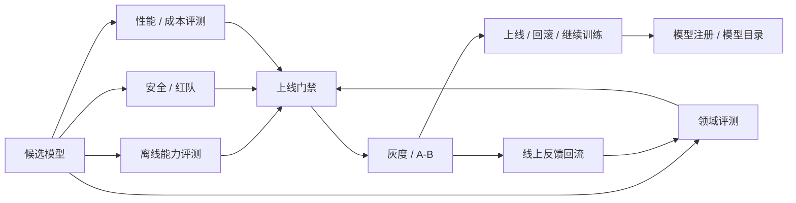

# 第 13 章：模型评测

## 本章回答的问题

- 模型评测为什么不能只看一个 benchmark 分数？
- accuracy、latency、throughput、human evaluation、red teaming 和线上 A/B 分别适合回答什么问题？
- 评测如何反向影响容量规划、上线门禁和成本模型？

## 一个真实场景

一个新模型在通用 benchmark 上提升明显，离线报告显示推理、知识和多语言能力都有改善。平台把它灰度到客服应用后，客服转人工率反而上升，用户投诉“回答更像百科，不像客服”。排查发现，离线评测没有覆盖企业知识库、拒答策略、引用格式和客服话术；性能评测只测了空载单请求，没有测真实 RAG context；成本评估也没有发现新模型输出更长，导致 cost per ticket 上升。模型“更强”，但不适合这个应用。

这个场景说明，评测的目标不是证明模型在排行榜上更强，而是判断它是否适合某个任务、某个用户群、某个 SLA 和某个成本边界。公开 benchmark 能提供基础参考，但业务成功依赖领域数据、产品约束、风险边界和服务成本。AI Factory 里的评测必须连接模型能力和生产系统，而不是只服务模型发布宣传。

评测还承担组织沟通功能。模型团队关心能力提升，应用团队关心业务结果，平台团队关心延迟和成本，安全团队关心风险，SRE 关心稳定性。如果评测体系只输出一个总分，各团队无法据此做决策。好的评测应把候选模型拆成多个可比较维度，明确上线条件、回滚条件和后续优化方向。

因此，评测报告应像发布决策文档，而不是学术排行榜。它要回答模型能用于哪些场景、不能用于哪些场景、需要多少资源、有哪些风险、如何灰度、何时回滚。评测如果不能指导动作，就只是测量；AI Factory 需要的是能驱动生产决策的评测。

评测还应保留反例。通过的模型也会有失败样本，失败样本比平均分更能指导应用边界。对用户和平台来说，知道模型在哪些条件下不适合使用，和知道它在哪些任务上很强一样重要。

## 核心概念

模型评测是用数据、指标和流程判断模型能力、风险、成本和上线可行性的系统。它包括离线 benchmark、领域评测、安全评测、人工评测、性能评测、线上 A/B 和业务指标分析。不同评测回答不同问题：benchmark 回答基础能力，领域评测回答任务适配，安全评测回答风险，性能评测回答服务可行性，线上实验回答真实用户效果。

Accuracy 描述答案是否正确，但开放生成任务中的“正确”往往包含事实性、完整性、格式、引用和约束遵循。Latency 描述响应速度，包括 TTFT、TPOT 和端到端耗时。Throughput 描述单位时间处理请求或 token 的能力。Human evaluation 用人工判断开放质量和偏好。Red teaming 主动寻找风险和失败模式。A/B 用真实流量比较模型或策略。

评测还要区分离线和线上。离线评测可复现、成本低、适合门禁和回归；线上评测真实但有用户影响，需要灰度和回滚。离线分数高不保证线上效果好，线上短期指标好也不代表长期安全。成熟平台会把自动评测、人工评测和线上实验组合起来，而不是选择其中一种。

从 AI Factory 视角看，评测结果应进入模型目录、路由策略、容量规划、计费和发布门禁。一个模型如果质量提升但吞吐下降，需要更多 GPU；如果输出更长，cost per token 或 cost per task 会变化；如果安全拒答更强，用户满意度可能变化。评测是模型生命周期的控制系统。

还要区分模型评测和系统评测。模型评测关注权重和行为，系统评测关注模型在 Gateway、RAG、工具、推理引擎和真实资源池中的表现。很多线上问题不是模型本身差，而是上下文拼接、服务参数、路由或工具策略不匹配。生产评测必须覆盖完整链路。

## 系统架构

模型评测系统通常从候选模型和基线模型开始，执行离线质量评测、领域评测、安全评测和性能评测。通过门禁后，候选模型进入灰度或 A/B；线上数据再回流到评测集和训练数据。评测结果写入 model registry 和模型目录，供发布、路由、容量规划和成本分析使用。这个系统把训练、服务和业务反馈连接起来。

评测架构需要同时支持可复现和可扩展。可复现要求固定数据版本、prompt 模板、解码参数、评审规则和模型版本；可扩展要求能够快速增加新任务、新领域和新风险样本。若评测数据和 prompt 不版本化，模型分数无法比较；若评测体系扩展困难，新业务上线后就没有合适门禁。

性能评测应与质量评测并行，而不是上线前最后补做。候选模型的上下文长度、输出长度、batch 行为、显存占用和吞吐，都会影响服务策略。一个模型在质量上通过，但在目标 SLA 下需要两倍 GPU，可能仍然不适合默认上线。评测系统必须把质量和基础设施事实放在同一发布决策中。

评测系统还需要权限和隔离。盲测集不应被随意下载，红队样本可能包含敏感攻击，线上反馈可能包含用户数据。评测平台既要让团队快速验证模型，又要防止数据泄漏和评测污染。评测数据治理是模型治理的一部分。

架构中还应有基线模型。每次评测都要和当前线上版本、上一候选版本或成本更低的替代模型比较。没有基线，分数本身很难解释。模型发布决策本质上是相对选择，而不是绝对判断。



## 13.1 benchmark

Benchmark 是标准化测试集和指标，适合横向比较模型在特定能力上的表现，例如知识、推理、数学、代码、多语言或安全。它的价值在于可复现、可比较和低成本，能作为模型基础体检。对于模型团队，benchmark 能帮助判断训练或后训练是否带来能力提升；对于平台团队，benchmark 能提供模型目录中的基础能力信号。

Benchmark 的局限同样明显。公开测试集可能被训练数据覆盖，导致分数虚高；测试任务可能与实际业务差异很大；选择题得分不一定代表开放生成能力；通用能力提升不一定转化为客服、代码助手、RAG 或 Agent 场景成功。把 benchmark 当成上线许可，是很多模型发布事故的来源。

平台应把 benchmark 放在评测矩阵的第一层，而不是唯一层。候选模型先通过基础 benchmark，证明没有明显通用能力回退；随后进入领域评测、安全评测、性能评测和线上灰度。对于每个 benchmark，还应记录版本、数据来源、评测参数和是否可能被污染。分数没有上下文，就不具备工程价值。

Benchmark 还应服务趋势分析。单次分数高低不如版本之间变化重要。模型升级后某些 benchmark 上升、某些下降，平台要理解变化是否符合目标。如果后训练模型在通用 benchmark 上小幅下降，但目标领域显著提升且安全不退化，仍可能值得上线到特定场景。评测要服务决策，而不是追求所有分数都最高。

Benchmark 也应按模型用途解释。基础模型、对话模型、代码模型、embedding 模型和多模态模型需要不同评测组合。把所有模型放到同一排行榜，会诱导错误选择。模型目录应展示与用途相关的 benchmark，而不是堆砌分数。评测的上下文比排名更重要。

## 13.2 accuracy

Accuracy 描述任务答案是否正确。对于分类、抽取、选择题和结构化预测，accuracy 或类似指标较直观；对于开放生成任务，正确性需要更复杂定义，包括事实是否正确、是否完整、是否引用证据、是否遵循格式、是否避免编造。LLM 的 accuracy 不是单一数字，而是任务定义和评分规则共同产生的结果。

开放任务评测要特别注意评分口径。一个回答可能事实正确但格式错误，可能格式正确但遗漏关键条件，可能语言流畅但引用不可靠。评测集应明确每个任务的评分维度，并尽量使用结构化判分。对于 RAG，答案正确还不够，引用是否来自允许文档也很重要；对于代码，文本解释正确不如测试通过可靠。

Accuracy 评测要防止数据泄漏和评测污染。公开测试集、训练集、SFT 数据和红队样本可能重叠，导致分数不能代表泛化能力。领域评测集应保留盲测部分，限制访问权限，并定期更新。模型团队可以使用开发集调试，但上线门禁应使用未被训练直接优化的评测集。没有隔离，评测会被“训练到”。

工程上，accuracy 应与错误分析结合。只知道准确率下降，没有错误类型，就无法改进。平台应记录失败样本、错误类别、输入长度、领域、模型版本和评审结果。错误分析能指导数据补充、prompt 调整、RAG 改造或后训练。Accuracy 的价值在于定位能力缺口，而不是只生成报告数字。

对于开放生成，还要接受多答案可能性。一个问题可能有多个正确表达，严格字符串匹配会低估模型；过宽松的 AI judge 又可能放过幻觉。平台应根据任务选择 exact match、规则校验、单元测试、引用校验、人工评审或模型评审。指标必须匹配任务形态。

## 13.3 latency

Latency 是模型服务延迟，包括 TTFT、TPOT、端到端耗时、排队时间、RAG 时间和工具调用时间。模型评测必须测 latency，因为用户体验、SLA 和容量规划都依赖它。一个模型回答质量更高，但 TTFT 明显变长，可能不适合实时 Chat；一个模型 TPOT 较慢，长输出任务体验会变差；一个模型端到端延迟高，可能来自检索或工具而不是模型本身。

Latency 评测必须贴近生产 workload。单请求空载延迟只能说明理想条件下性能，不能代表真实并发、真实上下文长度和 streaming 行为。评测集应包含短问答、长上下文、RAG、Agent、代码生成和批量任务等典型输入输出分布。还要区分冷启动、预热后、稳定并发和高峰流量。不同阶段的延迟含义不同。

延迟指标应看分位数和阶段拆分，而不是只看平均值。P50 反映典型体验，P95/P99 反映长尾风险；TTFT 高可能来自排队或 prefill，TPOT 高可能来自 decode 和 KV Cache，E2E 高可能来自应用或工具。评测报告应能告诉团队慢在哪里。否则延迟评测只能说明“慢”，不能指导优化。

Latency 还会影响成本和路由。低延迟要求可能降低 batching 效率，提高 cost per token；允许较高延迟的批量任务可以使用更大 batch 或低优先级资源。评测系统应把 latency 与吞吐、成本和服务等级一起呈现。模型不是单独评测“快不快”，而是评测在目标 SLA 下能否经济地服务。

还应记录延迟回归的原因。模型参数变大、context window 变长、输出更长、推理引擎变更、量化策略改变或 KV Cache 配置变化，都可能影响延迟。评测报告如果只写延迟上升，没有归因，就无法决定是优化 runtime、调整路由，还是放弃候选模型。

## 13.4 throughput

Throughput 描述单位时间处理的请求、样本或 token。推理中常用 requests/s、input tokens/s、output tokens/s、total tokens/s；训练中常用 tokens/s、samples/s 和 step time。吞吐决定单位资源能服务多少流量，是容量规划和 cost per token 的基础。一个模型质量更好但吞吐低，可能需要更多 GPU 才能满足同样需求。

吞吐评测必须和 SLO 绑定。只追求最大 tokens/s，可能通过增加 batch 牺牲 TTFT 和 P99；只追求低延迟，可能让 GPU 利用率很低。平台应在给定 TTFT、TPOT 和错误率约束下测可持续吞吐。这个数字比实验室最大吞吐更有工程意义，因为它代表生产可用容量。

吞吐还受输入输出分布影响。长 input 会增加 prefill，长 output 会延长 decode，streaming 连接会占用状态，RAG 和 Agent 会产生多次调用。评测 workload 如果与线上不一致，吞吐结论就会失真。平台应为主要应用维护标准压测集，并定期用线上分布校准。吞吐不是模型固有常数，而是模型与 workload 的组合结果。

工程上，吞吐评测应同时记录 GPU utilization、HBM、KV Cache、queue length、batch size、prefill/decode time 和错误率。否则无法判断瓶颈在算力、显存、缓存、调度还是网络。吞吐评测的目标不是跑出一个最大值，而是找到稳定服务边界和扩容模型。

吞吐评测还要区分在线和离线。在线推理要在延迟约束下保持稳定吞吐，离线批量推理可以牺牲交互延迟追求总完成时间。把离线最大吞吐拿来规划在线 Chat，会低估用户体验风险；把在线低延迟配置用于批量任务，又会浪费资源。Workload 类型必须写进评测结论。

还要观察吞吐稳定性。短时间峰值很高但长时间运行抖动大，不能作为容量承诺。压测应覆盖预热、稳定期和持续运行，观察是否出现内存碎片、缓存耗尽或错误积累。

## 13.5 human evaluation

Human evaluation 使用人工评审判断模型输出质量，适合开放生成、风格、帮助性、真实性、安全边界和业务满意度评估。许多产品问题无法用简单 accuracy 描述，例如回答是否有礼貌、是否符合品牌口吻、是否真正解决用户问题、是否解释得清楚。人工评测成本高，但能发现自动指标看不到的质量问题。

人工评测需要严格规范。样本如何抽取，评审是否盲评，评分维度是什么，多个评审不一致如何处理，是否允许查看参考答案，如何防止评审疲劳，这些都会影响结果可信度。没有规范的人工评分容易变成主观意见集合。平台应把评审流程产品化，而不是靠临时表格。

评审维度应贴近任务。客服关注解决率、合规话术和是否需要转人工；代码助手关注正确性、可运行性和是否引入风险；RAG 关注引用和事实一致性；写作助手关注风格和可编辑性。不同任务不应使用同一套泛化评分。人工评测的价值在于理解业务质量，而不是给所有回答打一个“喜欢”分。

人工评测也应与自动评测互补。自动评测可以高频回归，人工评测可以校准评审模型和发现新问题；线上反馈可以验证评测是否和用户体验一致。平台可以用人工样本训练或校准 AI judge，但必须保留人工抽检。人类评测不是规模化的唯一方案，却是质量基准的重要来源。

人工评测还要管理评审成本。高风险模型、默认模型和重大版本升级需要更严格人工评审；小修复和低风险场景可以抽样。平台应把人工评审资源用在自动指标不可靠、业务影响大或安全风险高的地方。评测成本也需要工程化配置。

## 13.6 red teaming

Red teaming 是主动寻找模型风险和失败模式的过程。它覆盖越狱、有害内容、隐私泄露、提示注入、工具滥用、幻觉、越权访问和合规风险。红队不是上线前一次性活动，而是持续风险发现机制。模型、工具、RAG 数据和攻击方式都在变化，安全评测也必须持续更新。

红队样本应结构化管理。每个失败样本应记录触发条件、攻击类型、风险等级、模型版本、是否需要拒答、是否涉及工具或数据权限、修复策略和回归状态。没有结构化记录，红队只能产生报告，不能形成训练数据、策略规则和评测门禁。红队结果应进入数据闭环。

Red teaming 还要覆盖平台层风险。模型可能被诱导调用高风险工具，RAG 可能泄露无权限文档，Agent 可能执行不该执行的动作，日志可能记录敏感内容。把红队只限定在文本输出，会漏掉 AI Factory 中更真实的风险。安全评测应把模型、Gateway、RAG、工具和审计一起看。

工程上，红队通过不等于绝对安全。它只能说明在已知样本和策略下没有发现不可接受风险。平台应保留监控和快速响应机制：上线后收集安全投诉、策略拦截、异常工具调用和新攻击样本。Red teaming 的价值不只是阻止发布，还在于持续更新安全边界。

红队结果还应区分修复层级。有些问题需要后训练，有些需要 Gateway 策略，有些需要工具权限，有些需要 RAG 数据隔离。若所有红队失败都交给模型训练，平台会忽略更可靠的系统边界。安全评测要指向正确修复位置。

红队样本也要防止过拟合。若团队只针对固定攻击集训练，模型可能通过已知样本，却不能处理变体。平台应保留盲测红队集，并持续引入新攻击模式。安全评测必须动态演进。

## 13.7 线上 A/B

线上 A/B 用真实流量比较模型、提示词、路由或策略。它能观察真实用户行为、业务指标、成本、延迟和稳定性，是离线评测无法替代的一环。模型在离线评测中表现好，可能因为线上输入分布不同而失败；离线差异不大的模型，可能在线上显著改善用户体验。A/B 是生产环境中的验证。

A/B 也有风险，因为真实用户会受影响。平台必须支持按租户、用户群、流量比例、应用和时间窗口灰度，并能快速回滚。实验开始前要定义成功指标、失败指标、护栏指标和最小观察时间。没有护栏的 A/B 可能为了提升点击或满意度，牺牲安全、成本或延迟。

线上指标不应只看单一业务结果。客服场景要看解决率、转人工率、满意度、投诉、安全拦截、平均 token、延迟和成本；代码助手要看采纳率、回滚率、构建失败和安全风险；Agent 要看任务成功率、中间调用次数和工具错误。模型可能提升互动，却增加成本或风险。A/B 必须多维。

A/B 结果还要考虑统计和归因。流量分桶是否稳定，用户群是否可比，外部事件是否影响结果，模型版本是否同时改变了 prompt 或工具策略，都可能影响结论。平台应记录实验配置、流量分配、模型版本和策略版本。否则线上实验会变成模糊经验，而不是可靠证据。

线上 A/B 还应有退出机制。实验达到成功标准、失败标准或最长观察时间后，应明确扩大、回滚或继续收集。长期悬挂的实验会让模型版本和用户体验混乱，也会污染后续数据。实验平台应把生命周期管理作为核心能力。

## 13.8 评测与基础设施容量规划

评测结果会直接影响容量规划。模型吞吐、显存占用、上下文长度、batch 策略和延迟 SLO 决定需要多少 GPU；输出长度和拒答策略影响 token 产量；工具调用和 RAG 会改变端到端负载；质量评测决定是否能用小模型替代大模型。容量规划如果不使用评测 workload，就会和真实业务脱节。

评测 workload 应覆盖主要应用形态：短 Chat、长文档、RAG、Agent、代码生成、批量推理、多模态和高安全场景。每类 workload 都应记录输入长度、输出长度、并发、streaming、工具调用和成功标准。这样性能评测才能转化为资源模型。随机 prompt 压测无法指导 AI Factory 的真实扩容。

模型选择也会反向改变基础设施。一个更小模型如果领域评测足够好，可能显著降低 cost per token；一个更长上下文模型可能减少 RAG 调用，但增加 prefill 和 KV Cache；一个安全拒答更短的模型可能降低输出 token，但影响用户满意度。容量规划必须把质量、延迟和成本放在同一张表里。

工程上，评测系统应输出容量建议，而不只是分数。比如在目标 P95 TTFT 下，单副本可承载多少 tokens/s；达到某租户流量需要多少 replica；长上下文占比上升时 GPU 需求如何变化；cost per task 是否在预算内。评测是容量规划的输入，也是定价和 SLA 的依据。

容量规划还需要安全余量。评测 workload 再接近生产，也无法覆盖全部流量尖峰、异常长输出和故障重试。平台应根据评测结果、线上波动和业务等级设置 headroom。没有余量的容量模型，在现实流量下很容易失效。

评测结果还可指导路由。若某模型在长文档场景吞吐差但质量好，可以只服务高价值长文档；若小模型在简单分类上足够好，就不应占用大模型资源。容量规划和模型路由应共用评测数据。

## 工程实现

模型上线门禁应声明评测项、阈值、数据版本、回滚条件和灰度策略。它不应只写“评测通过”，而要说明哪些维度必须不回退，哪些维度允许折中，哪些指标触发人工审批。门禁配置应进入 model registry，与候选模型、评测报告和发布记录绑定。这样每次上线都有可追溯依据。

示例配置如下：

```yaml
release_gate:
  model: af-chat-v2-candidate
  required:
    benchmark: pass
    domain_eval: no_regression
    safety_eval: pass
    latency_p95: within_slo
    cost_per_token: within_budget
  rollout:
    canary_tenants: [internal-test]
    rollback_on:
      error_rate: high
      complaint_rate: high
```

工程实现还应支持评测复现。每次评测要记录模型版本、runtime、prompt 模板、解码参数、评测数据版本、评审模型版本和执行环境。若一个月后要复查某次上线决策，平台必须能重跑或解释当时结果。缺少复现能力，评测报告会变成一次性文档。

评测平台还应提供失败样本管理。失败样本可以进入数据修复、后训练、RAG 改造或安全策略；已修复样本应加入回归集；争议样本应有人工裁决。评测的最终价值不只是拦截模型，而是让失败变成下一轮改进的输入。模型评测和数据闭环必须连接。

实现上还应支持评测报告自动生成。报告应包含模型版本、基线、评测数据、通过项、失败项、风险、性能、成本、建议动作和审批记录。人可以写结论，但事实数据应自动汇总，减少手工复制错误。评测报告是发布审计的一部分。

评测任务本身也需要调度。大模型评测会消耗 GPU、调用外部工具或运行代码沙箱，应进入队列和配额。若评测资源不可控，模型发布会被评测瓶颈拖慢。评测平台也是 AI workload 平台的一部分。

评测产物应长期保存，至少保存摘要、失败样本索引和关键配置。

审批记录也应绑定报告。

## 常见故障

第一类故障是只看通用 benchmark，忽略领域任务。模型通用分数上升，但客服、代码、RAG 或 Agent 任务下降。排查时应查看任务切片，而不是只看总分。上线门禁应要求目标应用相关评测通过，公开 benchmark 只能作为基础体检。

第二类故障是离线评测 prompt 与线上 prompt 不一致。线上有系统提示、工具 schema、RAG context 和多轮历史，离线只测裸问题，结果自然不一致。评测应使用接近生产的 prompt 模板和上下文拼接方式。Prompt 是模型输入的一部分，不能在评测中省略。

第三类故障是性能评测不真实。空载单请求延迟很好，上线并发后 P99 飙升；短 prompt 压测通过，长文档场景 OOM；只测请求数，不测 token。性能评测必须覆盖并发、输入输出分布、streaming 和资源指标。否则容量规划会失真。

第四类故障是评测污染。训练数据、SFT 数据或人工调参反复使用同一评测集，导致分数越来越高但泛化不变。平台应区分开发集、门禁集和盲测集，控制访问权限，并定期更新。评测集也是资产，需要治理。

第五类故障是只评模型不评系统。模型离线回答很好，上线后因为 RAG 拼接、工具 schema、网关超时或推理参数不同而失败。排查时应确认线上输入是否与评测一致，服务配置是否一致，路由是否命中同一模型版本。生产评测必须覆盖链路。

第六类故障是没有回归集。线上事故修复后，失败样本没有加入长期评测，几周后新模型再次犯同样错误。每次事故都应沉淀为回归样本。否则评测系统不会随着经验变强。

还有一类故障是评测通过但 owner 未确认，导致风险被默认接受。

## 性能指标

质量指标包括 benchmark、领域准确率、任务成功率、人工偏好、格式正确率、事实性、引用正确率和工具调用成功率。它们回答模型是否有用。质量指标应按任务切片展示，因为不同应用对“好”的定义不同。单一总分无法支撑模型路由和上线决策。

安全指标包括红队通过率、拒答准确率、误拒率、漏拒率、越权拦截率、敏感信息泄露率和工具风险事件。它们回答模型是否可控。安全指标必须与帮助性指标一起看，避免把过度拒答误认为安全提升。安全评测还应记录风险等级和修复状态。

服务指标包括 TTFT、TPOT、E2E latency、P95/P99、吞吐、GPU utilization、HBM、KV Cache、错误率和取消率。它们回答模型能否按 SLA 服务。服务指标必须在接近生产 workload 下测量，才能进入容量规划。空载指标只能作为开发参考。

成本和业务指标包括 cost per token、cost per task、tokens/W、解决率、转化率、采纳率、人工接管率、投诉率和留存。它们回答模型是否值得上线和扩容。模型评测如果不包含成本和业务结果，就无法支撑 AI Factory 的经济性判断。

指标还应绑定阈值和 owner。质量不回退由模型团队负责，安全门禁由安全团队负责，延迟和吞吐由平台团队负责，业务指标由应用团队负责。没有 owner 的指标只能展示，不能驱动决策。评测门禁需要责任边界。

指标还要区分硬门禁和观察项。安全越权、严重质量回退和 SLA 失败可能是硬阻断；输出长度变化、轻微成本上升可能进入人工审批。门禁过松会放大风险，过严会阻碍迭代。分级阈值更实用。

## 设计取舍

第一个取舍是覆盖面与速度。全量评测覆盖广，但耗时长；快速 smoke test 能高频执行，但只能发现明显问题。成熟平台通常分层：开发阶段跑快速回归，候选发布前跑完整评测，高风险模型增加人工和红队，线上灰度继续观察。评测不必每次都最重，但门禁要与风险匹配。

第二个取舍是自动评测与人工评测。自动评测便宜、可重复、适合规模化；人工评测能理解复杂质量和业务语境，但慢且贵。平台应使用人工评测校准自动评测，用自动评测扩大覆盖。完全依赖任一方都会有盲区。评测体系的目标是可信，而不是形式统一。

第三个取舍是离线确定性与线上真实性。离线评测可控、可复现，适合发布门禁；线上 A/B 真实，但存在用户影响和统计复杂性。候选模型应先通过离线门禁，再小流量线上验证。线上实验失败时要能回滚，并把失败样本带回离线评测。二者应形成闭环。

最后是单模型最优与组合策略。某个模型在平均分上最好，不一定适合所有任务。平台可以根据任务、租户、成本和 SLA 做模型路由：高风险任务用更安全模型，低延迟任务用小模型，复杂任务用大模型。评测应支持这种组合决策，而不是只选一个全局冠军。

取舍还包括评测标准的稳定与演进。标准太稳定会落后于新业务，变化太频繁又让版本不可比较。平台应保留核心长期指标，同时允许新增任务切片。这样既能看趋势，也能覆盖新场景。

评测体系本身也需要版本化，避免标准变化后旧结论被误读。

## 小结

- 模型评测是上线门禁，不是排行榜装饰。
- 质量、延迟、吞吐、安全和成本必须一起看。
- 领域评测和线上 A/B 比单一公开 benchmark 更接近业务真实。
- 评测 workload 是容量规划的重要输入。

## 延伸阅读

- [HELM](https://crfm.stanford.edu/helm/latest/)；[lm-evaluation-harness](https://github.com/EleutherAI/lm-evaluation-harness)
- [NIST AI Risk Management Framework](https://www.nist.gov/itl/ai-risk-management-framework)
- [Argo Rollouts documentation](https://argo-rollouts.readthedocs.io/)
