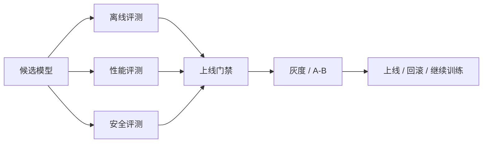

# 第 13 章：模型评测

## 本章回答的问题

- 模型评测为什么不能只看一个 benchmark 分数？
- accuracy、latency、throughput、human evaluation、red teaming 和线上 A/B 分别适合回答什么问题？
- 评测如何反向影响容量规划、上线门禁和成本模型？

## 一个真实场景

一个新模型在通用 benchmark 上提升明显，但上线灰度后客服转人工率上升。离线评测没有覆盖客服知识库、拒答策略和话术格式，平台也没有对比 TTFT 和 cost per token。最终模型质量提升没有转化为业务收益，反而增加了成本。

评测的目标不是证明模型“更强”，而是判断它是否适合某个应用、某个 SLA 和某个成本边界。

## 核心概念

模型评测是用数据、指标和流程判断模型能力、风险和上线可行性。它包括离线 benchmark、领域评测、安全评测、人工评测、性能评测和线上实验。不同评测回答不同问题，不能互相替代。

AI Factory 中的评测还要连接基础设施。一个模型质量更好但吞吐低、显存高、延迟长，可能不适合在线业务；一个模型质量略低但成本低，可能适合批处理或低风险场景。

## 系统架构



评测是模型生命周期的门禁系统。它把训练、服务和业务反馈连接起来。

## 13.1 benchmark

Benchmark 是标准化测试集和指标。它适合横向比较模型在特定任务上的表现，例如知识、推理、代码、数学或多语言能力。Benchmark 的价值在于可重复，局限在于不一定代表业务场景。

平台应把 benchmark 当成基础体检，而不是上线许可。模型在公开 benchmark 上好，不代表在企业知识库、客服话术、工具调用和安全边界上好。

## 13.2 accuracy

Accuracy 描述任务答案是否正确。对于分类、抽取和选择题，accuracy 较直观；对于开放生成任务，需要定义评分标准、参考答案或评审模型。开放生成的“正确”往往包含事实性、完整性、格式和引用。

Accuracy 指标要防止数据泄漏和评测污染。公开测试集可能被模型训练数据覆盖，导致分数虚高。领域评测集应定期更新，并保留盲测集。

## 13.3 latency

Latency 是模型服务延迟，包括 TTFT、TPOT 和端到端耗时。评测模型时必须测延迟，因为用户体验和容量规划直接受影响。长上下文、工具调用和 RAG 会改变延迟分布。

延迟评测应使用接近生产的 prompt 长度、输出长度、并发和 streaming 模式。单请求空载延迟不能代表线上表现。

## 13.4 throughput

Throughput 描述单位时间处理的请求或 token。推理中常用 output tokens/s、total tokens/s、requests/s。训练中常用 tokens/s、samples/s、step time。吞吐决定容量和 cost per token。

吞吐评测要和 SLO 绑定。只追求最大吞吐可能牺牲 P99 延迟。平台应在指定 TTFT/TPOT 约束下测可持续吞吐。

## 13.5 human evaluation

Human evaluation 使用人工评审判断模型输出质量。它适合开放任务、风格、帮助性、安全性和业务满意度评估。人工评测成本高，但能发现自动指标看不到的问题。

人工评测需要规范：样本抽取、盲评、评分维度、一致性检查和争议处理。没有规范的人工评分很容易变成主观意见集合。

## 13.6 red teaming

Red teaming 是主动寻找模型风险和失败模式的过程。它覆盖越狱、有害内容、隐私泄露、工具滥用、幻觉和合规风险。Red teaming 不只是安全团队工作，也应纳入模型上线门禁。

红队结果应结构化进入数据闭环：失败样本、触发条件、风险等级、修复策略和回归评测。否则每次红队都是一次性活动。

## 13.7 线上 A/B

线上 A/B 用真实流量比较模型或策略。它能观察用户行为、业务指标、成本和稳定性。A/B 风险在于真实用户受影响，因此必须灰度、可回滚、可分租户和可监控。

A/B 不应只看点击或满意度，也要看 token、延迟、错误、投诉、安全拦截和人工接管。模型可能提升短期互动，但增加成本或风险。

## 13.8 评测与基础设施容量规划

评测结果会影响容量规划。模型吞吐、显存、上下文长度、batch 策略和延迟 SLO 决定需要多少 GPU。模型质量决定是否能用较小模型替代大模型。安全和拒答策略会影响实际输出 token 分布。

容量规划应使用评测 workload，而不是随机 prompt。平台需要为主要应用维护标准压测集：短问答、长文档、RAG、Agent、代码、多模态等。

## 工程实现

模型上线门禁可以表达为：

```yaml
release_gate:
  model: af-chat-v2-candidate
  required:
    benchmark: pass
    domain_eval: no_regression
    safety_eval: pass
    latency_p95: within_slo
    cost_per_token: within_budget
  rollout:
    canary_tenants: [internal-test]
    rollback_on:
      error_rate: high
      complaint_rate: high
```

评测结果应和模型注册系统绑定。

## 常见故障

- 只看通用 benchmark，忽略领域任务。
- 离线评测 prompt 与线上 prompt 不一致。
- 性能评测在空载环境做，无法代表生产并发。
- 安全评测没有回归，模型升级引入风险。
- A/B 没有成本指标，质量提升不可持续。

## 性能指标

- 质量：benchmark、领域准确率、人工偏好、格式正确率。
- 安全：红队通过率、拒答准确率、越权拦截。
- 服务：TTFT、TPOT、P95/P99 延迟、吞吐。
- 成本：cost per token、tokens/W、单位任务成本。
- 业务：转化率、解决率、采纳率、人工接管率。

## 设计取舍

评测要在覆盖面、成本和速度之间取舍。全量人工评测最细，但慢且贵；自动评测快，但可能失真；线上 A/B 最真实，但有风险。成熟流程通常组合三者：自动评测做高频回归，人工评测做关键质量判断，线上灰度做最终验证。

## 小结

- 模型评测是上线门禁，不是排行榜装饰。
- 质量、延迟、吞吐、安全和成本必须一起看。
- 领域评测和线上 A/B 比单一公开 benchmark 更接近业务真实。
- 评测 workload 是容量规划的重要输入。

## 延伸阅读

- TODO: HELM / lm-evaluation-harness 等评测工具
- TODO: 模型安全评测资料
- TODO: 在线实验平台工程实践
