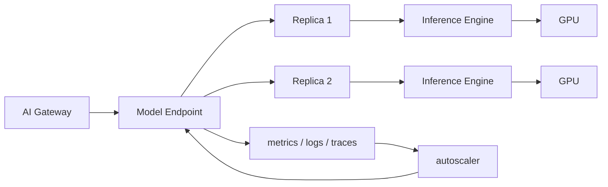

# 第 14 章：模型服务

## 本章回答的问题

- model server、endpoint、replica、batching、autoscaling 和 canary 如何组成模型服务系统？
- 模型服务和 MaaS、AI Gateway、推理引擎、Kubernetes 的边界是什么？
- 如何设计可灰度、可回滚、可观测、可扩缩容的模型服务？

## 一个真实场景

一个模型服务升级推理引擎后，单副本吞吐提升，但上线后错误率上升。原因是新版本改变了 streaming chunk 格式，网关适配不完整；同时 autoscaler 只看 CPU，没看 GPU HBM 和队列长度，高峰期扩容滞后。回滚时又发现模型权重和引擎版本没有绑定记录。

模型服务是模型能力进入生产的最后一公里。它不只是启动一个 Python 进程，而是模型、引擎、资源、路由、观测和发布流程的组合。

## 核心概念

模型服务（model serving）把模型权重和推理引擎包装成可调用服务。它向上接受 API 或内部协议请求，向下使用 GPU、CPU、内存、网络和存储。模型服务通常由 endpoint、replica、runtime、batching、health check、autoscaling 和发布策略组成。

MaaS 面向租户和开发者，AI Gateway 管流量和策略，模型服务负责实际执行推理。推理引擎是模型服务内部的核心 runtime。

## 系统架构



模型服务的控制循环包括流量、指标、扩缩容和发布。缺少任何一个环节，服务都难以稳定运行。

## 14.1 model server

Model server 是承载模型推理的服务进程。它负责加载权重、初始化 tokenizer、接收请求、调用推理引擎、管理 batch、返回 streaming 响应并上报指标。常见实现可能基于 vLLM、SGLang、TensorRT-LLM、Triton 或自研服务。

Model server 必须处理模型加载失败、显存不足、请求取消、stream 中断、健康检查和优雅下线。大模型加载时间长，滚动升级时要特别关注冷启动。

## 14.2 endpoint

Endpoint 是对外暴露的模型服务入口。一个 endpoint 可以对应多个 replica，也可以对应一个模型版本或一个路由组。Endpoint 应有清晰的模型名、版本、协议、SLA 和权限。

Endpoint 不是简单 Service。它还包含模型能力、资源池、发布状态和观测标签。MaaS 模型目录中的模型应能映射到一个或多个 endpoint。

## 14.3 replica

Replica 是模型服务的副本。多个 replica 提供并发能力和高可用。每个 replica 通常加载一份模型权重，可能占用一张或多张 GPU。副本数量直接影响成本和容量。

Replica 管理要考虑冷启动、权重加载、GPU 分配和下线排水。Streaming 请求长时间连接，直接杀副本会中断用户输出。发布系统应支持优雅停止接收新请求，等待已有请求完成或超时。

## 14.4 batching

Batching 把多个请求合并执行，提高 GPU 利用率。静态 batching 适合离线任务，continuous batching 更适合在线 LLM，因为请求长度和到达时间不同。

Batching 是延迟和吞吐的核心取舍。更大 batch 提高吞吐，可能增加排队和 TTFT。模型服务应暴露队列长度、batch size、等待时间、prefill/decode 时间，让平台能调参。

## 14.5 autoscaling

Autoscaling 根据负载自动调整 replica 数。普通 CPU 利用率不适合 LLM 服务。更有用的指标包括队列长度、TTFT、TPOT、GPU 利用率、HBM 占用、KV Cache 使用和 tokens/s。

扩容也有冷启动问题。大模型加载可能需要较长时间，因此 autoscaler 应结合预测、预热和容量保留。缩容时要避免释放正在处理长 streaming 的副本。

## 14.6 multi-model serving

Multi-model serving 指一个服务系统承载多个模型。它可以提高资源利用率，但会增加权重加载、缓存、隔离和路由复杂度。小模型和低频模型适合共享，大模型和高 SLA 模型通常需要独立资源。

多模型服务要关注模型切换成本。若每次请求都加载权重，延迟不可接受；若常驻多个模型，显存可能不足。平台需要根据流量、模型大小和 SLA 决定部署策略。

## 14.7 canary

Canary 是灰度发布策略。模型服务 canary 可以按租户、流量比例、模型版本或 endpoint 切分。它应同时观察错误率、TTFT、TPOT、质量指标和 cost per token。

Canary 不是只部署新副本。还要确保网关路由、模型目录、计量、dashboard 和回滚策略都能识别版本。否则出了问题无法快速定位和回滚。

## 14.8 rollback

Rollback 是把流量或服务恢复到上一稳定版本。模型服务 rollback 需要版本化权重、镜像、推理引擎、tokenizer、配置和 prompt 模板。只回滚镜像不回滚模型，可能无法恢复行为。

生产系统应保留上一稳定版本的可用容量。若所有旧副本在发布时被删除，回滚仍要经历模型加载和调度，恢复时间会变长。

## 工程实现

模型服务发布单元可以这样定义：

```yaml
model_deployment:
  name: af-chat-large-v2
  model_artifact: registry/af-chat-large:v2
  runtime_image: inference-runtime:v1.8
  engine: vllm
  replicas: 4
  resources:
    gpu: 1
  rollout:
    strategy: canary
    steps: [5, 25, 50, 100]
  metrics:
    required: [ttft, tpot, error_rate, tokens_per_second]
```

这份配置应能被部署系统、网关和观测系统共同理解。

## 常见故障

- 健康检查只检查 HTTP 端口，不检查模型是否加载完成。
- Autoscaler 只看 CPU，无法反映 GPU 和 KV Cache 压力。
- 发布时没有排水，streaming 请求被中断。
- 模型权重、tokenizer 和 runtime 镜像版本没有绑定。
- Canary 只观察错误率，不观察质量和成本。

## 性能指标

- 请求：QPS、并发、错误率、取消率。
- Token：input/output tokens/s、TTFT、TPOT。
- Runtime：queue length、batch size、prefill/decode time、KV Cache 使用。
- 资源：GPU 利用率、HBM 占用、功耗。
- 发布：canary 错误率、回滚时间、冷启动时间。

## 设计取舍

独立部署每个模型隔离强、可控性好，但资源利用率低。多模型共享提高利用率，但复杂度高。激进 autoscaling 降低成本，但可能影响高峰体验。模型服务设计必须按应用 SLA、模型大小、流量稳定性和成本目标选择。

## 小结

- 模型服务是模型能力生产化的执行层，连接网关、推理引擎和 GPU。
- Batching、autoscaling、canary 和 rollback 是模型服务的关键机制。
- LLM autoscaling 应关注 token、队列、GPU 和 KV Cache，而不是只看 CPU。
- 模型发布必须版本化权重、tokenizer、runtime 和配置。

## 延伸阅读

- TODO: vLLM / SGLang / TensorRT-LLM serving 文档
- TODO: Kubernetes serving 和 autoscaling 文档
- TODO: 模型发布工程案例
