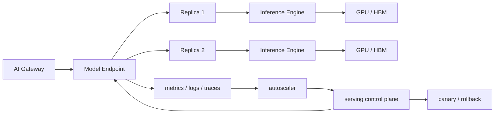

# 第 14 章：模型服务

## 本章回答的问题

- model server、endpoint、replica、batching、autoscaling 和 canary 如何组成模型服务系统？
- 模型服务和 MaaS、AI Gateway、推理引擎、Kubernetes 的边界是什么？
- 如何设计可灰度、可回滚、可观测、可扩缩容的模型服务？

## 一个真实场景

一个模型服务升级推理引擎后，单副本压测吞吐提升了，但生产上线后错误率上升。排查发现，新版本改变了 streaming chunk 的边界和 usage 返回时机，AI Gateway 的适配不完整；同时 autoscaler 仍然只看 CPU，没有看 GPU HBM、队列长度和 KV Cache 使用，高峰期扩容滞后；回滚时又发现模型权重、tokenizer 和 runtime 镜像没有绑定记录，只能人工确认上一稳定组合。吞吐提升是真的，生产事故也是真的。

这个场景说明，模型服务不是“启动一个推理进程”。它是模型权重、tokenizer、推理引擎、服务协议、资源分配、批处理、可观测性、扩缩容和发布流程的组合。任何一个边界不清楚，模型能力都可能无法稳定交付。AI Factory 中，模型服务是模型层进入生产系统的执行面，是 MaaS 和 GPU 基础设施之间的关键连接点。

模型服务还承担成本责任。Batching、replica 数、资源池、并发限制和 autoscaling 策略都会影响 tokens/s、TTFT、TPOT 和 cost per token。一个服务可以在单副本压测中表现很好，却因为冷启动、长上下文、流式连接和灰度策略在生产中不稳定。模型服务设计必须同时考虑质量、体验、容量、成本和发布安全。

它也是跨团队接口。模型团队交付 artifact 和能力说明，推理团队选择 runtime，平台团队管理部署和观测，SRE 负责稳定性，MaaS 团队承接 API 和租户体验。若模型服务缺少清晰契约，上游会把所有问题归咎于模型，下游会把所有问题归咎于基础设施。服务边界越清楚，协作成本越低。

本章讨论的模型服务，重点是生产系统，而不是本地 demo。能回答一次请求只是最低要求；能在多租户、灰度、故障、扩容和成本约束下持续回答，才是 AI Factory 需要的模型服务能力。

## 核心概念

模型服务（model serving）把模型权重和推理引擎包装成可调用服务。它向上接受 MaaS 或 AI Gateway 的请求，向下使用 GPU、CPU、HBM、网络和存储。一个生产模型服务通常由 endpoint、replica、runtime、model artifact、tokenizer、batching、health check、autoscaling、observability、canary 和 rollback 组成。

Model server 是实际加载模型并执行推理的进程。Endpoint 是平台暴露的服务入口，可以对应一个模型版本、多个 replica 或一个路由组。Replica 是服务副本，提供并发和高可用。Batching 把多个请求组合执行，提高 GPU 利用率。Autoscaling 根据负载调整 replica。Canary 和 rollback 控制发布风险。

模型服务与其他层有明确边界。MaaS 面向租户、模型目录、计量和 API 产品；AI Gateway 执行认证、限流、路由和策略；模型服务负责具体推理执行；推理引擎负责 runtime 内部的 batching、KV Cache 和 kernel 调度；Kubernetes 或调度系统负责容器、GPU 和副本生命周期。边界清楚，问题才能定位。

模型服务的难点来自 LLM 的状态性。Streaming 请求持续持有连接和 KV Cache，长上下文占用显存，batch 结构随请求动态变化，模型加载时间长，副本下线需要排水。普通无状态微服务经验只能解决一部分问题。LLM serving 需要围绕 token、cache、GPU 和发布状态重新设计服务控制面。

这些概念也决定了故障责任。Endpoint 失败可能是路由或发布问题，replica 失败可能是资源或 runtime 问题，batching 问题可能表现为延迟，autoscaling 问题可能表现为排队，canary 问题可能表现为版本差异。模型服务指标必须保留这些对象维度，才能定位问题。

还要把 artifact 和 deployment 分开。一个模型 artifact 可以被多个 endpoint 使用，一个 endpoint 可以逐步切换 deployment，一个 deployment 又可以包含多个 replica。分层管理能支持灰度和回滚；混在一起则会让发布变成替换文件。

## 系统架构

模型服务架构通常包括控制面和数据面。控制面管理模型 artifact、endpoint、replica、配置、发布策略、扩缩容策略和观测规则；数据面处理实际请求，从 Gateway 接收请求，进入 endpoint，选择 replica，执行 tokenizer、prefill、decode、streaming 和 usage 上报。控制面决定服务形态，数据面决定请求体验。

一次请求进入模型服务后，通常先经过 endpoint 的协议和参数校验，再进入某个 replica 的队列。Replica 内部的 model server 调用推理引擎，执行 batching、prefill、decode 和 KV Cache 管理。响应以 streaming 或非 streaming 方式返回，同时上报 TTFT、TPOT、token、错误码、finish reason、队列时间和资源指标。Autoscaler 根据这些指标调整 replica。

发布链路也属于架构的一部分。新模型或新 runtime 先创建 candidate deployment，经过健康检查和预热后接入少量 canary 流量；观察质量、错误、延迟、token 和成本指标；若通过门禁，再逐步扩大流量；若失败，快速 rollback 到上一稳定版本。没有发布控制，模型服务每次升级都是直接修改生产状态。

架构还应让配置变更可审计。Batch 参数、max context、并发上限、LoRA 加载策略、超时和错误映射都可能影响线上体验。它们不应以临时环境变量散落在副本中，而应进入 deployment 配置并带版本。生产问题经常来自配置漂移，而不是代码错误。

数据面还要尽量少做控制决策。租户权限、模型目录和价格策略属于上层控制面；model server 应专注执行推理和上报事实。边界过厚会让服务进程难以替换，边界过薄又缺少运行时保护。关键是把策略和执行分层。

架构评审时，应逐项确认请求路径、指标路径、发布路径和回滚路径。能画出请求怎么进来还不够，还要能画出指标怎么反馈到扩缩容，配置怎么发布到副本，事故时流量怎么退回。模型服务是多个控制循环的组合。



## 14.1 model server

Model server 是承载模型推理的服务进程。它负责加载权重、初始化 tokenizer、暴露协议接口、接收请求、调用推理引擎、管理 batch、处理 streaming、返回 usage，并上报日志、metrics 和 traces。常见实现可能基于 vLLM、SGLang、TensorRT-LLM、Triton 或自研服务。无论实现不同，生产职责类似：稳定执行模型推理。

Model server 的启动不是简单进程启动。大模型需要加载权重、初始化 CUDA context、分配 HBM、建立并行通信、加载 tokenizer 和 warmup kernel。任何一步失败，都可能表现为容器 ready 但模型不可用。因此健康检查不能只看 HTTP 端口，还要检查模型是否加载完成、推理是否可执行、GPU 是否可用、关键指标是否上报。

运行中，model server 必须处理请求取消、streaming 中断、超时、OOM、KV Cache 释放、优雅下线和错误映射。客户端取消后，如果服务端继续 decode，会浪费 GPU；副本下线时，如果直接 kill 进程，会中断长回答；OOM 后如果不隔离实例，可能持续影响流量。模型服务需要把这些边界条件作为核心逻辑。

Model server 还要提供稳定协议。OpenAI-compatible API、内部推理协议、streaming chunk、usage 返回、错误码和工具调用格式都可能被上游依赖。升级推理引擎时，即使模型输出质量不变，协议细节也可能变化。生产 model server 应通过兼容性测试和 contract test，避免 runtime 升级破坏 MaaS 和应用。

Model server 也要控制资源边界。它应拒绝超过上下文或输出预算的请求，限制并发，防止单个租户耗尽 KV Cache，并在异常时返回可解释错误。把所有保护都放在 Gateway 不够，因为只有 model server 最清楚实际 runtime 状态。入口治理和服务端保护需要配合。

此外，model server 应提供可诊断启动日志和运行状态。模型加载到哪一步、占用多少 HBM、初始化哪个并行组、使用哪个 tokenizer，都应能查询。否则冷启动和加载失败会很难排查。

## 14.2 endpoint

Endpoint 是对外暴露的模型服务入口。它可以代表一个模型版本、一个 deployment、一个资源池或一个路由组。上游 Gateway 通常不应直接感知每个 replica，而是调用 endpoint；endpoint 再根据负载和策略分配到后端副本。Endpoint 是模型服务的数据面入口，也是控制面管理对象。

Endpoint 不只是 Kubernetes Service。它应包含模型名、版本、协议、tokenizer、能力标签、资源池、SLA、发布状态、观测标签和权限边界。MaaS 模型目录中的一个模型，可能映射到多个 endpoint：标准池、premium 池、灰度版本、区域版本或专属租户版本。没有 endpoint 抽象，模型路由会和底层部署强耦合。

Endpoint 还承担兼容性和稳定性边界。它应声明支持哪些 API 参数、最大上下文、streaming、tool calling、response format 和模型版本。若后端 runtime 改变，endpoint 要么保持兼容，要么发布新版本。上游应用依赖的是 endpoint contract，而不是某个临时服务地址。契约不清，升级风险会传递给应用。

工程上，endpoint 应有生命周期：draft、warming、ready、canary、stable、draining、deprecated。每个状态对应不同流量行为。比如 warming 阶段可以预热但不接收生产流量，draining 阶段不接新请求但等待 streaming 结束。状态化管理让发布和回滚可控，而不是依赖人工操作。

Endpoint 还应绑定观测命名。所有请求、指标、日志和计量事件都应带 endpoint id 和版本。否则一个模型多个部署形态并存时，平台无法区分 premium 池、标准池和灰度池。Endpoint 是观测和成本归因的关键维度，不只是网络入口。

Endpoint 设计还影响用户承诺。稳定 endpoint 应尽量保持协议和行为兼容，实验 endpoint 可以允许更快变化但不承诺 SLA。把实验流量和生产流量放在同一 endpoint，会让应用无法管理风险。入口命名本身就是产品契约。

## 14.3 replica

Replica 是模型服务副本，多个 replica 提供并发能力、弹性和高可用。每个 replica 通常加载一份模型权重，可能占用一张或多张 GPU，也可能通过 tensor parallel 跨多卡运行。副本数量直接影响容量和成本：副本越多，可服务流量越高，但空闲成本也越高。

Replica 管理首先要处理冷启动。大模型加载权重和初始化 runtime 可能较慢，扩容后不能立即承接流量。平台需要 readiness gate、warmup 请求和预热容量。若 autoscaler 在流量峰值到来后才创建副本，实际可用时间可能已经晚了。对高 SLA 模型，保留热副本往往比极限节省成本更重要。

下线同样复杂。Streaming 请求可能持续很久，直接删除 pod 会中断用户输出；长 decode 请求占用 KV Cache，排水时间不可忽略。Replica 下线应先停止接收新请求，等待已有请求完成或到达超时，再释放资源。发布系统和 Kubernetes 生命周期钩子需要配合，否则滚动升级会制造用户可见错误。

Replica 还需要健康分级。进程存活、模型加载完成、推理成功、延迟正常、HBM 充足、错误率正常，是不同层次的健康。一个副本可能端口可用但队列严重堆积，或 GPU 出现错误但还未退出。负载均衡和 autoscaling 应使用更丰富的健康信号，而不是简单 ready/not ready。

Replica 也要考虑故障隔离。某个副本出现 OOM、Xid 或连续超时，应被摘除并保留诊断信息，而不是继续接收请求。对于多卡副本，任一 GPU 或通信链路异常都可能影响整个 replica。健康检查必须理解实际服务拓扑。

副本数量也不是越多越好。过多副本会增加空闲成本，降低每个副本的 batch 效率；过少副本会降低可用性和弹性。容量规划需要结合流量分布、冷启动时间、SLA 和 batching 效率选择副本策略。

## 14.4 batching

Batching 把多个请求合并执行，提高 GPU 利用率。传统静态 batching 适合离线任务，输入形状和执行时间较一致；LLM 在线推理更常见 continuous batching，因为请求到达时间、输入长度和输出长度不同。Continuous batching 可以在 decode 过程中动态加入和移除序列，提高吞吐，但调度逻辑更复杂。

Batching 是延迟和吞吐的核心取舍。更大的 batch 通常提高 tokens/s 和 GPU 利用率，但会增加排队和 TTFT；更小 batch 降低等待但可能浪费 GPU。Prefill 和 decode 对 batching 的要求也不同：prefill 受输入长度影响，decode 受 active sequence 和 KV Cache 影响。一个固定 batch 参数很难适配所有 workload。

Batching 还会影响公平性。长上下文请求可能占用大量 prefill，长输出请求可能长时间占用 decode slot，短请求可能被排队。多租户服务中，如果没有优先级和隔离，高价值低延迟请求可能被低价值长任务拖慢。模型服务需要结合租户、服务等级、请求长度和资源池策略管理 batch。

观测指标是调参基础。平台应记录 queue length、queue time、batch size、prefill batch、decode batch、active sequence、tokens/s、TTFT、TPOT、KV Cache 使用和拒绝请求。没有这些指标，batching 调参只能靠经验。Batching 的目标不是最大化单一吞吐，而是在目标 SLO 下最大化有效产能。

Batching 策略还应按 workload 分层。低延迟 Chat、代码补全、长文档总结和批量推理不应使用同一等待时间和 batch 上限。平台可以用不同 endpoint 或资源池承载不同策略。把所有流量混在一个 batch 队列中，是很多尾延迟问题的根源。

还要处理取消和超时。请求在队列中取消，应及时移除；decode 中取消，应释放 KV Cache；超时请求应记录已生成 token 和阶段。Batching 若不能正确处理生命周期，会出现隐性资源泄漏。

## 14.5 autoscaling

Autoscaling 根据负载自动调整 replica 数。普通微服务常看 CPU 或请求数，但 LLM 服务更适合看 queue length、TTFT、TPOT、tokens/s、GPU utilization、HBM、KV Cache 使用、active sequence 和错误率。CPU 低不代表 GPU 空闲，GPU utilization 高也不一定表示需要扩容；关键是用户体验和队列是否恶化。

扩容有冷启动问题。模型权重加载、镜像拉取、GPU 分配、通信初始化和 warmup 都需要时间。若 autoscaler 只根据当前队列扩容，可能在副本 ready 前已经出现 SLA 违约。高价值在线服务常需要预测扩容、预热副本、最小热容量和分时容量策略。Autoscaling 不只是反应式控制。

缩容也要谨慎。副本可能正在处理 streaming 请求，或者持有大量 KV Cache。直接缩容会中断输出或造成重试。缩容策略应先 drain，再等待完成或超时，并避免在短周期波动中频繁扩缩。Thrashing 会增加冷启动、缓存失效和延迟抖动。稳定性往往比极限省钱更重要。

Autoscaling 还要考虑模型和租户差异。Premium endpoint 可能保留更多热容量，批量推理 endpoint 可以更激进缩容，低频模型可以按需加载。一个全局 autoscaling 策略无法适配所有模型。平台应按 workload profile 和 SLA 定义扩缩容策略，并持续用线上指标校准。

还要避免扩缩容与发布同时造成扰动。模型升级期间副本本就不稳定，如果 autoscaler 同时频繁调整容量，问题归因会困难。发布系统可以临时冻结或限制 autoscaling，让 canary 指标更可信。控制循环之间需要协调。

Autoscaling 也要有上限和预算。无限扩容可能保护了延迟，却让成本失控；过低上限又会造成持续限流。扩缩容策略应同时读取 SLA 和预算约束。模型服务弹性是经济控制的一部分。

## 14.6 multi-model serving

Multi-model serving 指一个服务系统承载多个模型或多个模型变体。它可以提高资源利用率，尤其适合小模型、低频模型、embedding、rerank 或大量租户 adapter 场景。但它也会增加权重加载、缓存管理、隔离、路由和可观测性复杂度。多模型服务不是免费合并，而是用复杂度换利用率。

关键问题是模型常驻还是按需加载。常驻多个模型可以降低请求延迟，但占用 HBM 和内存；按需加载节省资源，但冷启动可能不可接受。平台需要根据流量频率、模型大小、SLA 和租户价值决定策略。高频高 SLA 模型通常独立部署，低频低 SLA 模型可以共享资源。

多模型服务还要处理隔离。一个模型的长请求、OOM 或异常不应影响其他模型；一个租户的 adapter 不应被错误加载给另一个租户；指标必须按模型和租户切分。若共享服务缺少隔离和观测，资源利用率提高会换来排障难度和风险增加。共享越多，边界越要清楚。

工程上，multi-model serving 应先从低风险场景开始。比如把多个小 embedding 模型合并，或为低频 LoRA 做按需加载；对于大语言模型主力在线服务，应谨慎评估。多模型服务的成熟度取决于 registry、路由、加载、缓存、监控和回滚是否都支持模型维度。

多模型服务还要考虑安全边界。不同模型可能对应不同租户、数据权限和合规要求，共享进程时日志、缓存和错误信息都要避免串租户。资源共享不能突破数据隔离。平台如果做不到强隔离，就应限制共享范围。

多模型服务的观测也更复杂。指标必须按 model、tenant、adapter、artifact version 和 load state 切分。否则一个冷门模型的加载失败可能被主力模型流量淹没。共享服务越复杂，标签体系越重要。

## 14.7 canary

Canary 是灰度发布策略，在扩大影响前用少量流量验证新模型、runtime 或配置。模型服务 canary 可以按租户、用户、流量比例、endpoint、模型版本或请求类型切分。它不仅用于权重升级，也用于 tokenizer、推理引擎、batch 参数、quantization 和服务镜像变更。任何可能影响输出或性能的变更都应灰度。

Canary 指标必须多维。错误率只是基础，还要看 TTFT、TPOT、P95/P99、streaming 中断、token 分布、质量代理指标、工具调用成功率、成本和用户投诉。一个版本可能 HTTP 错误率正常，但输出更长、格式更差或成本更高。模型服务 canary 必须同时观察系统指标和模型行为指标。

Canary 还需要版本可解释。Trace 中应记录模型版本、runtime 镜像、tokenizer、配置版本、路由规则和 canary 组。出现问题时，平台要能判断请求是否命中新版本，是否只影响某个租户或某个资源池。没有版本标签，灰度会失去排障价值。灰度不是流量随机切分，而是可审计发布。

发布流程应支持自动暂停和手动审批。低风险指标异常可以自动停止放量，高风险安全或质量问题应立即回滚，边界不清的指标进入人工判断。Canary 的目标是尽早发现问题并限制影响面，而不是形式上走几个比例。好的 canary 设计能让团队敢于更频繁地发布。

Canary 还应覆盖回放测试。在接入真实流量前，可以用历史请求样本或标准评测集打到新版本，检查协议、延迟、错误码和输出格式。离线回放不能替代真实灰度，但能提前发现明显兼容性问题，减少用户暴露。

灰度样本也要可解释。只把 5% 流量切过去还不够，要知道这 5% 来自哪些租户、哪些应用、哪些输入长度和哪些服务等级。否则灰度通过可能只是因为没有覆盖高风险流量。

## 14.8 rollback

Rollback 是把流量或服务恢复到上一稳定版本。模型服务 rollback 需要版本化权重、tokenizer、runtime 镜像、配置、prompt 模板、路由策略和资源池。只回滚镜像不回滚模型，可能无法恢复行为；只回滚权重不回滚 tokenizer，可能出现 token 口径和输出格式变化。模型服务的版本是组合版本。

生产系统应保留上一稳定版本的可用容量。若发布时立即删除旧副本，回滚仍要经历镜像拉取、权重加载和 warmup，恢复时间会变长。对于关键模型，可以在 canary 期间保留旧版本热容量；对于成本敏感模型，也至少要保留可快速恢复的 artifact 和配置。Rollback 能力需要提前设计。

Rollback 决策应由门禁指标触发。错误率、延迟、streaming 中断、质量指标、安全拦截、投诉或成本异常都可能触发回滚。不同指标的阈值和 owner 应预先定义。事故中临时讨论是否回滚，会浪费时间。回滚不是承认失败，而是生产系统保护用户的机制。

回滚后还要保留现场。问题版本的日志、trace、指标、请求样本、配置和副本状态应被归档，供后续复盘。若回滚过程中清理了所有证据，团队只能知道“新版本不好”，不知道为什么不好。模型服务发布体系应同时支持快速恢复和证据保全。

Rollback 也要定期演练。很多平台文档上支持回滚，实际事故中才发现旧 artifact 被清理、旧镜像无法拉取、旧配置不兼容或权限不足。回滚能力不经过演练就不能算生产能力。模型服务发布应把回滚演练作为验收项。

回滚不一定只回到旧权重。某些事故需要回滚 runtime，某些需要回滚路由，某些需要回滚 batch 配置。发布系统应支持细粒度回滚，同时能保证组合版本一致。粗糙回滚会制造二次事故。

## 工程实现

模型服务发布单元应把模型 artifact、runtime、资源、扩缩容、发布策略和指标门禁写在同一配置中。这个配置应被部署系统、Gateway、模型目录、观测系统和回滚工具共同理解。若部署系统只知道镜像，模型目录只知道模型名，Gateway 只知道 endpoint，出现事故时很难还原完整版本。发布单元是生产模型的最小可审计对象。

示例配置如下：

```yaml
model_deployment:
  name: af-chat-large-v2
  model_artifact: registry/af-chat-large:v2
  runtime_image: inference-runtime:v1.8
  engine: vllm
  replicas: 4
  resources:
    gpu: 1
  rollout:
    strategy: canary
    steps: [5, 25, 50, 100]
  metrics:
    required: [ttft, tpot, error_rate, tokens_per_second]
```

工程流程应包括预检、部署、预热、灰度、扩大、稳定和清理。预检查模型 artifact、tokenizer、runtime 兼容性和资源配额；部署后先做健康检查和 warmup；灰度期间观察指标；通过后逐步扩大；稳定后再清理旧版本。每个阶段都应有自动状态和人工可见性。发布不是一次 kubectl apply。

实现中还要标准化错误处理。模型加载失败、请求超限、OOM、后端超时、streaming 取消、tokenizer 错误和引擎异常，都应映射为可解释错误码，并进入 trace 和指标。上游 Gateway 和 MaaS 需要这些信息做 fallback、计量和用户提示。模型服务不能把所有异常都变成 500。

还要建立发布前检查清单。检查项包括 artifact 是否存在、checksum 是否匹配、tokenizer 是否兼容、runtime 是否支持、资源是否足够、指标是否上报、rollback 是否可用。清单自动化后，发布事故会明显减少。模型服务的工程质量来自这些细节。

服务配置还应进入代码评审或变更审批。模型服务的 YAML、路由、资源和门禁都可能影响生产，不应被视为低风险配置。配置即代码，配置变更也需要验证。

实现完成后，应通过回放测试、压测和故障注入验证。只验证正常请求成功，无法证明服务可生产。

验证结果应写入发布记录。

## 常见故障

第一类故障是健康检查过浅。服务端口可用，但模型尚未加载、GPU 不可用、tokenizer 初始化失败或首个推理请求失败。Kubernetes 认为 pod ready，Gateway 开始导流，用户请求失败。健康检查应包含模型 readiness 和最小推理探针，而不只是 HTTP 端口。

第二类故障是 autoscaler 指标错误。只看 CPU 或请求数，无法反映 GPU、HBM、KV Cache 和队列压力；流量峰值时副本扩容滞后；缩容时中断 streaming。解决方向是使用 token、queue、latency、GPU 和 cache 指标，并配合预热和 drain。LLM autoscaling 需要专用信号。

第三类故障是发布版本不完整。模型权重、tokenizer、runtime、prompt 模板和配置没有绑定，回滚时无法恢复旧行为；canary 只标记镜像版本，trace 中看不到模型版本。生产模型版本必须是组合版本，并写入所有请求上下文。否则发布事故难以定位。

第四类故障是 batching 参数不适配 workload。为了追求吞吐增大 batch，导致 TTFT 变差；为了低延迟减小 batch，导致 GPU 利用率过低；长短请求混部造成 P99 抖动。排查需要同时看 batch size、queue time、prefill/decode、token 分布和租户维度。Batching 故障常被误判为模型慢。

第五类故障是升级破坏协议。Runtime 或 model server 升级后，streaming chunk、usage 字段、错误码或 tool calling 输出发生细微变化，上游解析失败。兼容性测试缺失时，这类问题常在灰度后才暴露。协议也是模型服务契约的一部分。

第六类故障是缺少排水。副本下线或节点维护时仍有 streaming 请求，用户看到中断。排水失败通常不是模型问题，而是服务生命周期管理问题。发布和维护流程都应验证 drain 行为。

还有一类故障是观测缺失。请求失败了但没有 endpoint、replica、model version 和 error stage，事故复盘只能猜测。模型服务必须先可观测，再谈自动化。

## 性能指标

请求指标包括 QPS、并发、成功率、错误率、取消率、超时率、streaming duration 和 fallback 率。它们回答服务是否可用、谁受影响、错误在哪里发生。请求指标应按 endpoint、model version、replica、tenant 和 route 切分。全局平均值无法支撑发布回滚。

Token 指标包括 input tokens/s、output tokens/s、total tokens/s、tokens per request、TTFT、TPOT、finish reason 和 output length distribution。它们回答服务负载和用户体验。LLM 服务容量和成本都与 token 强相关，请求数只是辅助指标。没有 token 指标，autoscaling 和成本分析都会失真。

Runtime 指标包括 queue length、queue time、batch size、prefill time、decode time、KV Cache 使用、active sequence、cache allocation failure、engine restart 和 model load time。它们回答瓶颈在模型服务内部哪里。Runtime 指标是调参、扩容和排障的关键。

资源和发布指标包括 GPU utilization、HBM、功耗、节点健康、冷启动时间、canary 指标、回滚时间、drain 时间和版本错误率。它们回答基础设施和发布是否健康。模型服务是长期运行的生产系统，发布指标和运行指标同等重要。一次糟糕发布可能抵消所有性能优化收益。

指标还应支持容量和成本分析。按 endpoint 和版本统计 tokens/s、空闲副本、扩容次数、拒绝请求和 cost per token，才能判断服务策略是否经济。模型服务不是只追求稳定，也要持续提高资源效率。

还应关注指标基数。按租户、模型、endpoint 和 replica 切分很有价值，但过多动态标签会压垮监控系统。标签设计要稳定，临时调试字段应有采样和保留期限。

指标也要服务 SLO。没有目标阈值的指标只是曲线，有 SLO 才能触发扩容、告警和回滚。

每个关键 endpoint 都应有独立 SLO。

指标还应进入容量例会和发布复盘。若某个版本提升吞吐但增加错误，或降低延迟但提高成本，团队需要基于同一组指标做取舍。模型服务指标的价值在于驱动容量、发布和成本决策，而不是只展示运行状态。

## 设计取舍

第一个取舍是独立部署与共享部署。独立部署隔离强、性能稳定、排障简单，但资源利用率低；共享部署或 multi-model serving 提高利用率，但增加加载、隔离和观测复杂度。高 SLA 大模型适合独立部署，低频小模型或 adapter 场景可以考虑共享。部署形态应由流量和风险决定。

第二个取舍是吞吐与延迟。更激进 batching 提高 GPU 利用率和降低 cost per token，但可能伤害 TTFT 和 P99；更保守 batching 改善交互体验，但成本更高。平台应按应用类型设置策略：代码补全和 Chat 重视低 TTFT，批量推理重视吞吐。没有统一最优参数。

第三个取舍是自动扩缩容与容量预留。Autoscaling 能降低空闲成本，但大模型冷启动慢，高峰期扩容滞后会影响 SLA；容量预留提高稳定性，但空闲成本高。Premium 服务通常需要热容量，best-effort 服务可以更依赖弹性。成本优化不能破坏服务等级承诺。

最后是发布速度与发布安全。频繁发布能快速迭代模型和 runtime，但每次变更都可能影响输出、协议和成本；严格门禁降低风险，但可能拖慢改进。可行路径是自动化 canary、指标门禁和快速 rollback。让发布安全，不是减少发布次数，而是降低每次发布的爆炸半径。

取舍还包括通用 serving 平台与专用优化。统一平台降低维护成本，专用部署能为大客户或关键模型优化极致性能。平台应先统一控制面和观测，再允许数据面按场景优化。这样既能复用治理能力，也能保留性能空间。

最终取舍应由 workload profile 决定。流量稳定、高价值、低延迟的模型，和低频、best-effort 的模型，不应使用同一种 serving 策略。

## 小结

- 模型服务是模型能力生产化的执行层，连接网关、推理引擎和 GPU。
- Batching、autoscaling、canary 和 rollback 是模型服务的关键机制。
- LLM autoscaling 应关注 token、队列、GPU 和 KV Cache，而不是只看 CPU。
- 模型发布必须版本化权重、tokenizer、runtime 和配置。

## 延伸阅读

- [vLLM documentation](https://docs.vllm.ai/)；[SGLang documentation](https://docs.sglang.ai/)；[TensorRT-LLM documentation](https://nvidia.github.io/TensorRT-LLM/)
- [Kubernetes Horizontal Pod Autoscaling](https://kubernetes.io/docs/tasks/run-application/horizontal-pod-autoscale/)
- [MLflow Model Registry documentation](https://mlflow.org/docs/latest/model-registry.html)
