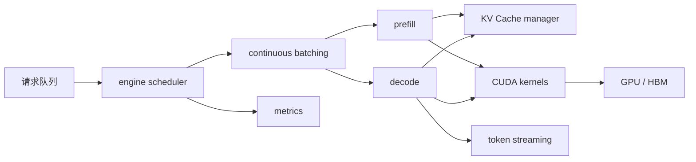

# 第 15 章：推理引擎

## 本章回答的问题

- 推理引擎在模型服务中解决什么问题？
- vLLM、SGLang、TensorRT-LLM 等引擎的关注点有什么不同？
- continuous batching、paged attention、speculative decoding、prefix cache 和 PD 分离如何影响延迟、吞吐和成本？

## 一个真实场景

同一个模型、同一张 GPU，换推理引擎后线上表现差异很大。一个引擎在低并发下首 token 很快，但高并发下 KV Cache 碎片明显；另一个引擎吞吐高，但对某些模型结构支持不完整；还有一个引擎需要提前编译和更严格的版本匹配。应用只看到“模型慢不慢”，平台实际面对的是引擎能力、模型兼容、调度策略和运维复杂度的取舍。

推理引擎是 LLM 线上成本和体验的关键杠杆。

## 核心概念

推理引擎负责把模型权重、请求队列、KV Cache、batching、CUDA kernel 和输出解码组织起来，高效执行 LLM 推理。它位于模型服务内部，向上提供请求处理能力，向下调用 GPU 软件栈。

一个好的推理引擎不只是“能跑模型”，还要高效管理显存、动态调度请求、支持 streaming、暴露指标、处理取消和错误，并适配模型结构。

## 系统架构



引擎内部的调度器决定请求何时进入 batch，KV Cache manager 决定显存如何分配，kernel 决定实际计算效率。

## 15.1 vLLM

vLLM 是常见的开源 LLM 推理引擎，核心特性包括 PagedAttention 和高吞吐 serving。它的工程价值在于降低 KV Cache 碎片、支持 continuous batching，并提供 OpenAI-compatible server 等易用入口。

采用 vLLM 时，平台应关注模型兼容、KV Cache 配置、并发限制、tensor parallel、量化支持和指标暴露。vLLM 适合快速构建通用推理服务，但仍需要结合生产网关、计量和发布系统。

## 15.2 SGLang

SGLang 关注结构化生成、程序化控制和高性能 serving，常用于需要复杂提示流、约束解码或 Agent/RAG 工作流优化的场景。它强调把上层推理程序和底层 serving 效率结合起来。

SGLang 的价值在于不仅优化单次模型调用，还优化多步生成流程。对 Agent 平台来说，这类能力可以减少应用层反复拼接 prompt 和重复调用模型的开销。

## 15.3 TensorRT-LLM

TensorRT-LLM 是 NVIDIA 面向 LLM 推理优化的工具链和 runtime。它通常关注图优化、kernel 优化、量化、并行和特定 GPU 架构上的性能。它可能要求更明确的构建、引擎生成和版本匹配流程。

TensorRT-LLM 适合对性能、延迟和硬件利用率要求高的生产场景。代价是工程复杂度更高，模型改动、版本升级和调试成本也更高。

## 15.4 continuous batching

Continuous batching 允许引擎在 decode 过程中动态加入新请求、移除完成请求。它解决了静态 batch 在 LLM 场景中的低效问题，因为不同请求输入和输出长度差异很大。

Continuous batching 提高吞吐，但也会影响延迟。新请求可能等待合适时机进入 batch，长请求可能占用 KV Cache。引擎和平台需要通过最大 batch、最大 token、队列策略和优先级控制体验。

## 15.5 paged attention

Paged attention 用类似分页的方式管理 KV Cache，把连续大块显存需求拆成可管理的 block，减少碎片并提高并发能力。它让长短请求混合时的显存管理更稳定。

Paged attention 不消除 KV Cache 成本，只是更有效地管理它。平台仍需控制最大上下文、最大并发序列和输出长度，并监控 KV Cache 使用率。

## 15.6 speculative decoding

Speculative decoding 使用较小或较快的 draft 模型先生成候选 token，再由目标模型验证。若候选被接受，就能减少目标模型逐 token 生成的时间。它的目标是降低 decode 延迟。

Speculative decoding 的收益依赖 draft 模型质量、验证开销、请求类型和实现。它也增加部署复杂度，因为需要管理两个模型或两个执行路径。生产中应按 workload 评测，而不是假设总是更快。

## 15.7 prefix cache

Prefix cache 缓存相同或相似 prompt 前缀的计算结果。系统提示、工具描述、长文档模板和多轮对话中可能存在可复用前缀。命中 prefix cache 可以降低 prefill 成本和 TTFT。

Prefix cache 的难点是命中率和一致性。prompt 中只要有动态字段变化，前缀可能无法复用。平台应记录 cache hit rate、节省 token 和缓存占用，避免为了低命中率缓存浪费显存。

## 15.8 PD 分离

PD 分离指把 prefill 和 decode 分离到不同实例或资源池。Prefill 偏大块计算，decode 偏低延迟循环，两者资源特征不同。分离后可以分别优化吞吐、延迟和资源利用。

PD 分离会增加系统复杂度：请求状态、KV Cache 传递、网络开销、调度和故障处理都更复杂。它适合规模较大、流量稳定、平台能力成熟的场景，不适合作为早期默认架构。

## 工程实现

推理引擎配置应进入模型部署记录：

```yaml
inference_engine:
  name: vllm
  model: af-chat-large
  tensor_parallel_size: 2
  max_model_len: configured
  max_num_seqs: configured
  kv_cache:
    policy: paged
  features:
    streaming: true
    prefix_cache: optional
```

这些配置必须和模型目录、容量规划、dashboard 和回滚策略关联。

## 常见故障

- 引擎支持的模型结构与实际模型不匹配。
- max context 配置过大，导致并发容量下降。
- KV Cache 逼近上限，GPU 算力未满但请求排队。
- Continuous batching 配置激进，TTFT P99 变差。
- Prefix cache 命中率低却占用大量显存。
- 引擎升级改变 streaming 或错误码行为，网关适配失败。

## 性能指标

- TTFT、TPOT、E2E latency。
- Prefill tokens/s、decode tokens/s、总 tokens/s。
- Queue length、batch size、waiting time。
- KV Cache usage、cache hit rate、eviction。
- GPU SM 利用率、HBM 占用、功耗。

## 设计取舍

推理引擎选型要在性能、兼容性、可运维性和生态之间取舍。高性能引擎可能要求更复杂构建和版本管理；易用引擎可能在极限性能上不占优。平台应按模型类型和 workload 建立基准，而不是全平台只选一个引擎。

## 小结

- 推理引擎决定 LLM 服务的显存管理、batching、kernel 和输出节奏。
- Continuous batching 提升吞吐，paged attention 改善 KV Cache 管理。
- Speculative decoding、prefix cache 和 PD 分离是更高级的优化，需要按 workload 验证。
- 引擎指标必须进入平台 dashboard 和容量规划。

## 延伸阅读

- TODO: vLLM 官方文档
- TODO: SGLang 官方文档
- TODO: TensorRT-LLM 官方文档
