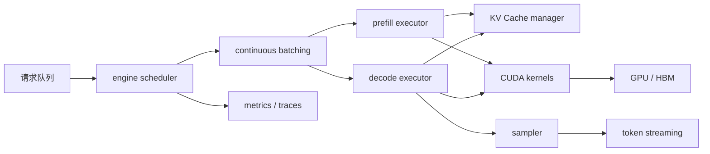

# 第 15 章：推理引擎

## 本章回答的问题

- 推理引擎在模型服务中解决什么问题？
- vLLM、SGLang、TensorRT-LLM 等引擎的关注点有什么不同？
- continuous batching、paged attention、speculative decoding、prefix cache 和 PD 分离如何影响延迟、吞吐和成本？

## 一个真实场景

同一个模型、同一组 GPU，换推理引擎后线上表现差异很大。一个引擎在低并发下 TTFT 很好，但高并发时 KV Cache 碎片明显，P99 延迟上升；另一个引擎吞吐高，但对某些模型结构、量化方式或 tool calling 输出支持不完整；还有一个引擎在目标硬件上性能突出，却需要提前构建 engine，并严格绑定 CUDA、driver、NCCL 和模型格式。应用只看到“模型快不快”，平台实际面对的是兼容性、显存管理、调度策略、发布风险和运维复杂度。

推理引擎是 LLM 线上成本和体验的关键杠杆。模型权重决定了能力上限，但引擎决定请求如何排队、如何 batch、如何分配 KV Cache、如何执行 CUDA kernel、如何 streaming、如何处理取消和错误。一个模型服务如果只是把模型加载起来，通常只能在小流量 demo 中工作；生产服务需要引擎把动态请求流转化为稳定的 GPU 工作负载。

推理引擎的问题也很容易被误判。TTFT 变高可能来自 queue、prefill、prefix cache 失效或调度策略；TPOT 变差可能来自 decode batch、KV Cache 访问、kernel 或 HBM 压力；吞吐下降可能来自模型版本、量化策略、context 分布或并发限制。评估引擎不能只看一个 benchmark，而要使用接近生产的 workload、指标和故障场景。

这也是为什么引擎选型应进入平台标准流程。每个新引擎或新版本都应经过模型兼容、协议兼容、性能基线、资源边界和回滚验证。引擎不是应用团队随意替换的依赖，而是 AI Factory 的关键 runtime。它一旦出问题，会同时影响体验、成本和服务稳定性。

本章讨论引擎时，始终把它放在生产链路中看：它既要服务模型，也要服务平台控制面。能在 benchmark 中跑出高吞吐只是候选条件，能被观测、被发布、被回滚、被容量规划使用，才是生产条件。

## 核心概念

推理引擎（inference engine）负责把模型权重、tokenizer 输出、请求队列、batching、KV Cache、CUDA kernel 和输出解码组织起来，高效执行 LLM 推理。它通常位于 model server 内部：上层的 MaaS 和 AI Gateway 关心 API、租户、限流和计量；model server 负责服务协议和生命周期；推理引擎负责 runtime 内部的调度、显存和执行效率。

一个生产级推理引擎不只是“能跑模型”。它要支持 streaming、并发请求、动态 batch、长短请求混部、取消释放、错误上报、并行策略、量化、模型格式、KV Cache 管理和可观测指标。引擎能力直接影响 model serving 的 TTFT、TPOT、tokens/s、HBM 使用、OOM 风险和 cost per token。

常见优化包括 continuous batching、paged attention、speculative decoding、prefix cache 和 prefill/decode disaggregation（PD 分离）。它们分别针对不同瓶颈：continuous batching 提高动态请求下的吞吐，paged attention 改善 KV Cache 管理，speculative decoding 试图降低 decode 延迟，prefix cache 降低重复前缀的 prefill 成本，PD 分离把 prefill 与 decode 放到不同资源路径优化。

推理引擎选择还涉及生态和运维。某些引擎易用、模型兼容范围广，适合快速交付；某些引擎深度优化硬件，适合高价值高流量模型；某些引擎强调结构化生成和 Agent/RAG 工作流。AI Factory 不应把引擎选型变成宗教选择，而应建立模型、workload、硬件和服务目标的评测矩阵。

还要区分 engine capability 和 platform capability。引擎可能支持 OpenAI-compatible server，但不代表支持企业级租户、计量、灰度和账单；引擎可能暴露 metrics，但不代表指标口径符合平台标准。平台需要把引擎能力纳入统一控制面，而不是被引擎接口牵着走。

因此，核心概念应落到接口契约。引擎对上提供请求语义、错误语义和 usage 语义，对下依赖 CUDA、NCCL、驱动和 GPU。接口稳定，平台才能替换引擎；接口含糊，所有上层能力都会和某个 runtime 绑定。

## 系统架构

推理引擎内部通常包含请求队列、调度器、batch manager、prefill executor、decode executor、KV Cache manager、kernel runtime、sampler、streaming 输出和 metrics 模块。请求进入 model server 后，被转换为 token ids 和推理参数，进入引擎队列。调度器决定何时进入 prefill 或 decode，KV Cache manager 分配缓存，kernel runtime 在 GPU 上执行计算，sampler 选择输出 token，streaming 模块把结果返回。

这条路径与模型服务控制面紧密相关。Endpoint 的并发限制会影响引擎队列，模型配置会影响 max context 和 KV Cache，发布策略会影响引擎版本，autoscaler 会读取引擎指标，billing 会依赖 usage。推理引擎虽然在 model server 内部，但它的指标和配置必须暴露给平台控制面，否则容量规划和排障都会变成黑盒。

架构上还要区分 prefill 和 decode。Prefill 处理输入上下文，计算量大、并行度高、受 input token 影响；decode 逐步生成 token，循环多、状态性强、受 KV Cache 和 active sequence 影响。优秀引擎通常会分别优化这两个阶段，而不是只追求整体平均 latency。平台 dashboard 也应按阶段拆解。

引擎架构还需要处理生命周期。请求进入队列、进入 prefill、进入 decode、streaming 输出、完成、取消、超时和失败，每个阶段都应有明确状态和资源释放逻辑。缺少生命周期管理，最常见的结果是缓存泄漏、队列堆积和取消后继续占用 GPU。

架构评审还应覆盖 backpressure。队列过长、KV Cache 不足或 GPU 错误时，引擎应如何拒绝、排队、降级或通知上游，必须提前定义。没有 backpressure，压力会从引擎扩散到 Gateway 和客户端重试。

还应覆盖多副本一致性。同一 endpoint 下不同 replica 的引擎版本、配置和模型状态必须一致，否则灰度之外也会出现行为差异。引擎架构不是单进程结构，而是副本集合的运行规则。



## 15.1 vLLM

vLLM 是常见的开源 LLM 推理引擎，核心工程价值在于高吞吐 serving、PagedAttention、continuous batching 和相对易用的 OpenAI-compatible server。它让平台可以较快把常见模型部署为在线服务，并通过 KV Cache 分页管理降低碎片问题。对很多团队来说，vLLM 是从实验模型走向生产推理的常见起点。

采用 vLLM 时，平台首先要验证模型兼容性。模型结构、tokenizer、chat template、量化格式、并行方式、LoRA 支持、工具调用输出和 streaming 行为都可能影响上线。不能因为模型能本地跑通，就直接认为生产服务可用。每个模型都应有 vLLM serving profile 和压测结果。

vLLM 的配置会直接影响容量。max model length、max num seqs、GPU memory utilization、tensor parallel、KV Cache block size、prefix caching 和调度策略都会改变 HBM 使用、并发和延迟。配置过宽会降低并发或触发 OOM，配置过紧会限制应用能力。平台应把这些配置纳入 deployment 版本，而不是让用户随意设置。

生产中还要补齐 vLLM 周边能力。它可以提供 serving runtime，但 MaaS 还需要租户鉴权、配额、计量、灰度、SLA、账单和多模型目录。不要把推理引擎当成完整平台。更稳妥的做法是让 vLLM 作为 model server runtime，被 Gateway、observability、registry 和 rollout 系统统一管理。

vLLM 上线还要关注升级节奏。开源项目迭代很快，新版本可能修复性能问题，也可能改变配置、指标或协议行为。平台应维护经过验证的版本矩阵，并为关键模型固定版本。追逐最新版本不是生产策略，经过验证的可回滚版本才是生产策略。

还要关注社区能力与企业需求的差异。生产平台可能需要长期支持、安全补丁、审计和特定指标，而开源默认配置更偏向通用易用。平台应在引擎外层补齐治理能力。

## 15.2 SGLang

SGLang 关注结构化生成、程序化控制和高性能 serving，常用于复杂提示流、约束解码、Agent/RAG 工作流和多步生成优化场景。它的价值不只是让单次模型调用更快，而是让上层推理程序和底层 serving 结合得更紧。对 Agent 平台来说，减少重复 prompt 拼接和重复模型调用，可能比单次 kernel 优化更有价值。

SGLang 类工具体现了一个趋势：推理优化不只发生在 runtime 内部，也发生在“推理程序”层。RAG 的检索、rerank、context assembly，Agent 的 planning、tool calling、多轮状态，以及结构化输出的约束，都可以影响 token 数、cache 命中和调用次数。把这些逻辑完全放在应用层，容易丢失 runtime 优化机会。

采用 SGLang 时，平台要评估工作流复杂度和团队能力。程序化推理能带来灵活性，但也会让调试、观测和版本管理更复杂。一次请求可能不再是一条简单模型调用，而是一段推理程序的执行结果。Trace 需要记录程序步骤、模型调用、缓存命中、工具调用和错误阶段。

它适合对生成流程有强控制需求的场景，例如结构化输出、Agent、多轮检索和复杂 prompt 流水线。对于简单 Chat Completion，通用 serving 引擎可能更容易运维。引擎选型应从 workload 出发：如果瓶颈在多步工作流，优化单次模型调用可能收益有限；如果瓶颈在高并发 decode，runtime 吞吐更关键。

SGLang 这类路径还要求评测粒度更细。不能只测一次模型调用的 TTFT 和 TPOT，还要测整个推理程序的步骤数、缓存命中、工具调用、失败恢复和输出正确性。多步流程的成本常被隐藏在应用层，放到 runtime 后必须重新设计观测。

它也要求开发流程改变。应用逻辑进入推理程序后，模型团队、应用团队和平台团队要共同维护版本。否则性能优化可能和业务逻辑变更混在一起，事故归因会变难。

## 15.3 TensorRT-LLM

TensorRT-LLM 是 NVIDIA 面向 LLM 推理优化的工具链和 runtime，常见关注点包括图优化、kernel 优化、量化、并行策略和特定 GPU 架构上的性能。它通常更接近硬件优化路径，适合对吞吐、延迟和 GPU 利用率要求高的生产场景。代价是构建、版本和调试流程可能更严格。

使用 TensorRT-LLM 时，平台要管理 engine build 或模型转换流程。模型结构、权重格式、量化配置、batch profile、context length、GPU 架构、CUDA 和 driver 版本都可能影响最终可运行产物。与解释式或动态加载路径相比，这类优化通常需要更明确的构建产物和兼容矩阵。

它的优势在高价值模型上更明显。对于流量大、SLA 严格、模型结构稳定的核心模型，投入更复杂的构建和优化流程可能值得；对于频繁变更、低频调用或实验模型，过重的 engine 生成和验证流程可能拖慢迭代。性能收益必须和发布速度、兼容性和运维成本一起评估。

工程上，TensorRT-LLM 类路径需要更严格的发布门禁。每次模型、量化、引擎、driver 或 GPU 类型变化，都应重新验证 correctness、latency、throughput、memory 和 fallback。不要把一次成功构建当成长期可用结论。高性能 runtime 更需要可复现构建和回滚能力。

它还更依赖硬件路线。某些优化只在特定 GPU 架构、数据类型或并行配置下收益明显。平台在采购、镜像和引擎选型时应一起评估，而不是硬件交付后才尝试适配。Runtime 优化和 GPU 基础设施不是两件独立的事。

因此 TensorRT-LLM 类路径更适合建立黄金组合：模型、engine、GPU、driver、CUDA 和配置一起验证。黄金组合越清晰，扩容和回滚越可靠。

如果团队无法维护这种组合，就应谨慎把它作为默认路径。高性能工具链需要相应的平台纪律。

## 15.4 continuous batching

Continuous batching 允许引擎在 decode 过程中动态加入新请求、移除完成请求。LLM 请求的输入长度、输出长度和到达时间差异很大，静态 batch 很容易等待最慢请求或浪费 GPU。Continuous batching 让引擎在每个 decode step 重新组织活跃序列，提高 GPU 利用率和总吞吐，是在线 LLM serving 的核心机制之一。

它的收益来自动态调度，但风险也来自动态调度。新请求可能等待进入 batch，长请求可能长期占用 KV Cache，短请求可能被长 prefill 阻塞，高优先级租户可能和低优先级请求混在同一队列中。Continuous batching 不是自动公平，它需要队列策略、优先级、最大等待时间、最大 active sequence 和资源隔离配合。

对平台来说，continuous batching 把“单请求性能”变成“流量组合性能”。同一模型在短问答、长文档和代码生成混合流量下，表现可能完全不同。压测必须使用接近生产的请求分布，而不是固定长度请求。否则配置在 benchmark 中好看，线上 P99 却很差。

关键指标包括 queue length、queue time、batch size、active sequence、prefill time、decode time、TTFT、TPOT、tokens/s、KV Cache 使用和取消率。调参时要看这些指标之间的关系，而不是单独追求最大 batch。Continuous batching 的目标是在 SLO 约束下提高有效吞吐。

还要定义租户公平性。高优先级请求是否可以插队，长请求是否被拆分或限制，低优先级批量任务是否可以等待，都应成为策略。Continuous batching 一旦进入多租户平台，就不再只是引擎内部优化，而是服务等级执行机制的一部分。

这些策略应能在 trace 中解释。用户请求为什么等待、为什么被拒绝、为什么进入某个 batch，应有可审计事实。否则 batching 会成为黑盒。

## 15.5 paged attention

Paged attention 用类似分页的方式管理 KV Cache，把长上下文和多并发请求产生的缓存拆成可管理的 block。传统连续分配容易产生碎片，尤其在长短请求混部、streaming 取消和输出长度差异大的情况下。分页管理能提高显存利用率，使服务在相同 HBM 下承载更多活跃序列。

Paged attention 解决的是 KV Cache 管理问题，不是消除 KV Cache 成本。上下文越长、并发越高、输出越长，缓存仍然会增长。平台不能因为使用 paged attention 就无限放开 max context 或 max output。它让资源管理更高效，但容量边界仍然存在。

Paged attention 的效果依赖 workload。大量短请求、长短混合、频繁取消和多租户场景，可能更受益；如果流量长度很规则，收益可能较小。评测时应同时看 HBM 峰值、cache allocation failure、fragmentation、active sequence 和 OOM 事件，而不是只看 tokens/s。

工程上还要关注隔离和回收。请求完成或取消后，cache block 必须及时释放；不同租户的缓存状态不能泄露；prefix cache 和 paged attention 组合时，要明确缓存生命周期和权限边界。KV Cache 是性能资产，也是状态资产。状态管理错误会变成稳定性和安全问题。

Paged attention 的配置也需要压测验证。Block 大小、预留比例、并发限制和 eviction 策略都会影响实际效果。平台应记录配置与 workload 的关系，避免把某个模型上的成功配置复制到所有模型。缓存策略没有全局最优。

同时要给应用设边界。即使缓存管理更高效，超长上下文和无限输出仍会消耗资源。paged attention 是效率工具，不是容量魔法。

因此它应与配额、限流和模型目录共同使用，向应用暴露明确上下文能力。

缓存状态也应进入指标。

## 15.6 speculative decoding

Speculative decoding 使用较小或较快的 draft 模型先生成候选 token，再由目标模型验证。如果候选被接受，就可以减少目标模型逐 token decode 的等待时间，从而降低输出阶段延迟。它针对的是 decode 逐步生成的瓶颈，尤其在目标模型较大、draft 模型质量足够时可能有效。

收益并不必然成立。Draft 模型质量低，会导致候选被大量拒绝，验证开销抵消收益；请求很短，调度和额外模型开销可能不划算；部署两个模型会增加显存、加载、路由和监控复杂度。Speculative decoding 不是“打开就更快”的开关，必须按 workload 实测。

它还会影响服务架构。平台需要管理 draft model、target model、版本兼容、tokenizer 一致性、资源分配和回滚。若 draft 模型和目标模型行为差异过大，可能影响输出分布或调试复杂度。Trace 应记录 speculative path、acceptance rate、验证开销和实际收益。

适合场景通常是流量大、decode 占比高、输出较长、draft 模型稳定且资源充足的服务。对于低并发、短输出或高变更模型，复杂度可能超过收益。平台应把 acceptance rate、TPOT 改善、额外成本和质量回归一起纳入评测，而不是只看单次 latency。

Speculative decoding 还要考虑容量分配。Draft 模型占用 GPU、显存或 CPU 资源，可能挤压目标模型容量。若总资源固定，局部 decode 加速不一定降低整体 cost per token。收益评估必须按端到端资源成本计算。

质量也要回归。虽然目标模型负责验证 token，但实现细节和采样策略仍可能影响输出分布、日志和调试。上线前应比较质量、长度和错误行为。

若收益只在少数样本上出现，平台应限制使用范围，而不是全局开启。

## 15.7 prefix cache

Prefix cache 缓存相同或可复用 prompt 前缀的计算结果，减少重复 prefill。系统提示词、工具 schema、固定模板、RAG 框架提示和多轮对话中的稳定历史，都可能形成可复用前缀。命中后，引擎可以跳过部分重复计算，降低 TTFT 和 prefill cost。对于长系统提示或工具描述，收益可能明显。

Prefix cache 的关键是命中率。只要前缀中有时间戳、随机 id、用户特定字段或动态检索片段，缓存就可能失效。应用和平台需要共同设计稳定前缀，把动态内容放在后段，避免无意义变化破坏缓存。缓存优化不是 runtime 单方面完成的，它需要 prompt 结构配合。

缓存也会占用显存或内存，并引入一致性和隔离问题。不同租户是否共享前缀，系统提示是否包含敏感信息，模型版本或 tokenizer 变化后缓存是否失效，都需要明确。错误复用缓存可能造成输出异常或数据边界问题。Prefix cache 应有严格 key 设计和失效策略。

观测指标包括 cache hit rate、saved prefill tokens、cache memory、eviction、tenant/model/version 维度命中和命中后的 TTFT 改善。低命中率但高缓存占用说明策略不合适。Prefix cache 的目标是可证明地降低成本和延迟，而不是为了缓存而缓存。

Prefix cache 也需要和应用团队协作。系统提示词顺序、工具 schema 序列化、RAG 模板和动态字段位置都会影响命中。平台可以提供 prompt lint 或 cacheability 报告，帮助应用提高可复用前缀比例。缓存优化不是纯底层问题。

缓存收益还会随流量变化。低频租户可能命中率低，高频共享模板可能收益高。平台应按租户和应用观察，不应只看全局命中率。

缓存策略应能按 endpoint 开关，便于灰度和回滚。

## 15.8 PD 分离

PD 分离指把 prefill 和 decode 分离到不同实例、资源池或执行路径。Prefill 偏大块并行计算，适合处理长输入；decode 偏逐 token 循环，强调低延迟和状态管理。把两者分开，可以分别优化资源利用、batching、调度和扩缩容，尤其适合长上下文占比高或规模很大的在线服务。

PD 分离会显著增加系统复杂度。Prefill 阶段产生的 KV Cache 或中间状态如何传给 decode，跨节点传输开销如何控制，失败时如何恢复，调度器如何匹配 prefill 和 decode 容量，metrics 如何归因，都是新问题。它把一个服务内部阶段变成了分布式系统问题。

是否采用 PD 分离，应基于 workload 和平台成熟度。若流量规模不大、上下文较短或团队尚未建立完善观测和调度，单体 serving 更简单可靠；若长上下文请求占比高、prefill 与 decode 资源特征明显不同，并且平台能管理状态转移，PD 分离可能带来收益。它不是早期默认架构。

评测 PD 分离时，要同时看 TTFT、TPOT、tokens/s、KV transfer time、失败率、队列、资源利用率和运维复杂度。若 prefill 更快但 decode 等待更长，整体体验未必改善。PD 分离的正确性来自端到端指标，而不是单阶段优化。

PD 分离还改变故障模式。Prefill 池异常、decode 池异常、状态传输失败和容量比例失衡都会产生不同症状。SRE 需要新的 runbook，调度器需要新的容量模型。没有这些配套，PD 分离会把一个性能问题变成多个可靠性问题。

它也需要更严格的成本模型。分离后可能提升单阶段利用率，但增加网络、状态管理和副本数量。最终是否划算，要看端到端 cost per token。

PD 分离还应先在影子流量或低风险流量验证，避免直接改变核心链路。

## 工程实现

推理引擎配置应进入模型部署记录，成为可审计、可回滚的生产配置。配置至少包括 engine 名称、版本、模型 artifact、tokenizer、并行策略、max context、max num seqs、KV Cache 策略、batching 策略、量化、prefix cache、speculative decoding 和指标开关。没有配置记录，线上性能变化很难复盘。

示例配置如下：

```yaml
inference_engine:
  name: vllm
  version: pinned
  model: af-chat-large
  tensor_parallel_size: 2
  max_model_len: configured
  max_num_seqs: configured
  kv_cache:
    policy: paged
  features:
    streaming: true
    prefix_cache: optional
```

上线前应执行兼容性测试、基准压测和故障场景测试。兼容性测试检查模型结构、tokenizer、streaming、tool calling 和错误码；基准压测覆盖短 prompt、长 prompt、长输出和混合并发；故障测试覆盖取消、超时、OOM、engine restart 和回滚。推理引擎升级不应只看正常样例。

工程流程还应保留上一稳定配置。引擎版本、模型格式、量化方式和 CUDA/NCCL/driver 组合都可能影响行为。发布新引擎时，应能够同时回滚 runtime 和配置，而不是只回滚镜像。推理引擎是高风险生产依赖，版本管理必须严格。

还要建立 engine qualification 流程。新引擎进入平台前，先在标准模型和标准 workload 上跑基线，再选择少量低风险 endpoint 灰度，最后才进入核心模型。这样可以把引擎风险限制在可控范围，而不是直接影响全站流量。

工程实现还应提供统一适配层。不同引擎的配置名、指标名和错误码不同，平台应转换成统一语义，避免上层系统为每个引擎写特殊逻辑。适配层是多引擎治理的基础。

还应提供基准测试模板。每次引擎变更都用同一组模型、prompt 分布和并发参数运行，结果才能比较。没有标准模板，性能结论很容易受测试方式影响。

最后，配置应能被 dry-run。发布前用历史请求回放配置，检查是否会拒绝过多请求、改变上下文上限或触发缓存异常。Dry-run 不能覆盖所有问题，但能拦截明显配置错误。

## 常见故障

第一类故障是模型兼容性不足。模型结构、位置编码、MoE、量化格式、tokenizer 或 chat template 与引擎支持不匹配，导致启动失败、输出异常或性能退化。排查时不能只看模型权重是否存在，还要看 engine support matrix、转换日志、运行时错误和输出一致性测试。

第二类故障是 max context 配置过大。平台为了宣传长上下文能力，把 max model len 配得很高，结果 KV Cache 预留增加，并发容量下降，短请求也被影响。长上下文能力应按 endpoint 和租户开放，而不是全局默认打开。容量评测必须覆盖真实上下文分布。

第三类故障是 KV Cache 逼近上限。GPU utilization 看起来不高，但请求排队、OOM 或被拒绝，因为 HBM 被 cache 占用。排查时要看 active sequence、cache usage、block allocation failure、context length 和输出长度。GPU 算力空闲不代表推理容量充足。

第四类故障是引擎升级破坏协议或指标。Streaming chunk、usage 字段、错误码、metrics 名称或取消语义变化，上游 Gateway、计量和 dashboard 都可能受影响。推理引擎升级应进行 contract test，并在 canary 中观察协议兼容。Runtime 是服务契约的一部分。

第五类故障是观测缺失。引擎只暴露总 tokens/s，不暴露 prefill、decode、queue 和 cache，平台无法解释延迟变化。生产引擎如果不可观测，就无法安全运营。指标缺失本身应被视为上线阻塞项。

第六类故障是配置漂移。线上副本手工修改参数后没有进入 deployment 记录，后续复现和回滚失败。引擎配置必须版本化。

第七类故障是取消语义错误。客户端断开后引擎继续 decode，占用 GPU 和 KV Cache。高并发下，这会变成隐性容量泄漏。取消路径必须压测。

第八类故障是多副本配置不一致。同一 endpoint 下副本参数不同，导致请求随机快慢或输出差异。发布系统应校验副本配置一致性。

## 性能指标

体验指标包括 TTFT、TPOT、E2E latency、P95/P99、streaming 中断率和取消率。它们回答用户是否觉得快、稳、可交互。TTFT 应拆分 queue、prefill 和首 token，TPOT 应关联 decode batch、active sequence 和 KV Cache。单一平均延迟无法指导引擎调优。

吞吐指标包括 prefill tokens/s、decode tokens/s、total tokens/s、requests/s、batch size、active sequence 和 queue throughput。它们回答单位资源能处理多少 token。吞吐必须在 SLO 约束下解释，否则极限吞吐可能牺牲用户体验。在线和离线 workload 应分开统计。

缓存和内存指标包括 KV Cache usage、cache hit rate、prefix cache hit、eviction、fragmentation、allocation failure、HBM peak 和 OOM 次数。它们回答显存和缓存是否健康。对于 LLM serving，缓存指标经常比 GPU utilization 更能解释容量问题。没有缓存指标，paged attention 和 prefix cache 都无法评估。

资源和稳定性指标包括 GPU SM utilization、HBM bandwidth、功耗、engine restart、model load time、kernel error、NCCL error、runtime version 和配置版本。它们回答引擎是否稳定、是否受版本影响。指标必须按 model、endpoint、engine version 和 replica 切分，才能支撑发布和回滚。

指标还要进入容量模型。引擎升级如果让 tokens/s 提升但 HBM 占用增加，平台需要重新计算可承载并发；如果 TTFT 改善但 cost per token 上升，也需要业务判断。Runtime 指标最终要服务资源和经济决策。

指标也要支持版本对比。新旧引擎在同一 workload 下的差异，应能直接展示给发布负责人。没有对比，就无法判断升级是否值得。

指标还要有采样和保留策略。高频 token 级指标成本高，核心聚合应长期保留，细粒度 trace 可以按异常和灰度采样。观测成本也是 runtime 成本的一部分。

每个关键指标都应有 owner 和用途。若指标不用于告警、容量、发布或成本决策，就应考虑降采样或删除，避免噪声掩盖真正信号。

## 设计取舍

第一个取舍是性能与兼容性。高度优化的引擎可能需要严格模型格式、构建流程和硬件版本，兼容范围较窄；通用引擎更容易支持多模型和快速迭代，但极限性能可能不如专用优化。平台可以为核心高流量模型使用深度优化路径，为实验和长尾模型使用通用路径。

第二个取舍是吞吐与延迟。Continuous batching、较大 batch 和 aggressive scheduling 能提高吞吐，但可能增加 TTFT 和长尾；低延迟配置提高交互体验，却降低 GPU 利用率。不同应用应有不同策略：Chat 和代码补全重视 TTFT，批量推理重视总吞吐。不要用一套参数服务所有 workload。

第三个取舍是简单架构与高级优化。Speculative decoding、prefix cache 和 PD 分离都可能带来收益，但也增加模型、缓存、状态和调度复杂度。早期平台应先建立稳定 serving、观测和发布，再逐步引入高级优化。没有可观测性时引入复杂优化，会让故障更难定位。

最后是单引擎统一与多引擎并存。统一引擎降低运维成本和认知负担，多引擎可以为不同模型和硬件选择最佳路径。成熟 AI Factory 可以允许多引擎，但必须有统一 deployment schema、指标、发布门禁和兼容矩阵。否则多引擎会变成不可控碎片化。

取舍还包括开源速度与企业稳定。快速跟进社区可以获得新模型支持和性能优化，但生产平台需要稳定窗口、漏洞修复和回滚策略。引擎治理应像基础运行时治理，而不是普通应用依赖升级。稳定性本身就是性能的一部分。

最后，选型应允许阶段性演进。早期用易运维引擎建立平台能力，核心模型成熟后再引入高性能路径，通常比一开始追求极限优化更稳妥。先可控，再优化。

## 小结

- 推理引擎决定 LLM 服务的显存管理、batching、kernel 和输出节奏。
- Continuous batching 提升吞吐，paged attention 改善 KV Cache 管理。
- Speculative decoding、prefix cache 和 PD 分离是更高级的优化，需要按 workload 验证。
- 引擎指标必须进入平台 dashboard、容量规划和发布门禁。

## 延伸阅读

- TODO: vLLM 官方文档
- TODO: SGLang 官方文档
- TODO: TensorRT-LLM 官方文档
