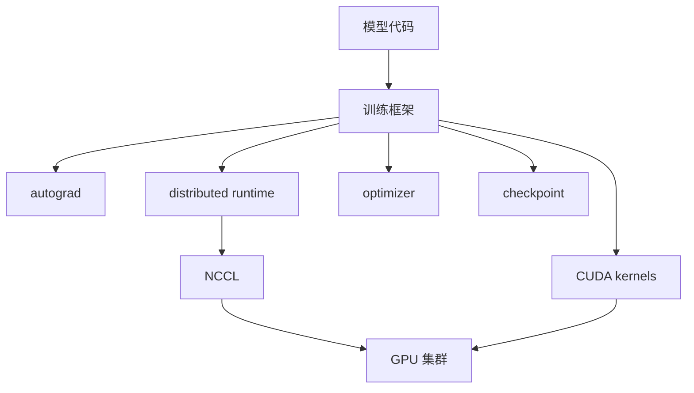

# 第 16 章：训练框架

## 本章回答的问题

- PyTorch、DeepSpeed、Megatron-LM、FSDP、JAX/XLA 在训练系统中分别承担什么角色？
- 混合精度、ZeRO 和 activation checkpointing 如何影响显存、吞吐和稳定性？
- 训练框架选择如何影响 AI Factory 的调度、镜像、监控和故障排查？

## 一个真实场景

一个团队从单机 PyTorch 脚本扩展到数百张 GPU。脚本本身能跑，但分布式后频繁 OOM、吞吐低、checkpoint 太慢。平台团队发现训练框架配置、并行策略、混合精度、ZeRO stage、activation checkpointing 和数据加载全部交织在一起。问题不再是“代码有没有 bug”，而是训练框架和基础设施是否协同。

训练框架是模型算法和 GPU 集群之间的翻译层。

## 核心概念

训练框架负责自动微分、计算图执行、分布式通信、优化器、混合精度、checkpoint 和数据加载。它向上服务模型开发，向下调用 CUDA、NCCL、文件系统和网络。

AI Factory 不应把训练框架视为用户自带脚本细节。框架版本、并行配置和通信策略直接影响资源需求、性能和故障模式。

## 系统架构



框架把模型训练拆成计算、通信、优化和持久化。平台观测也要沿这些边界拆解。

## 16.1 PyTorch

PyTorch 是最广泛使用的深度学习框架之一。它提供动态图、autograd、torch.distributed、FSDP、编译优化和丰富生态。许多训练框架和模型库都以 PyTorch 为基础。

生产中，PyTorch 版本、CUDA 版本、NCCL 版本和驱动版本必须纳入兼容矩阵。一个小版本差异可能影响性能、kernel 选择或分布式行为。

## 16.2 DeepSpeed

DeepSpeed 提供大模型训练优化能力，包括 ZeRO、混合精度、并行训练和推理相关能力。它常用于降低显存占用、扩大模型规模和提高训练效率。

DeepSpeed 的配置复杂，ZeRO stage、offload、通信 bucket、checkpoint 方式都会影响性能和稳定性。平台应把 DeepSpeed 配置纳入任务记录，方便复现和排障。

## 16.3 Megatron-LM

Megatron-LM 关注大规模 Transformer 训练，提供 tensor parallel、pipeline parallel、sequence parallel 等能力。它常用于训练超大模型和研究并行策略。

Megatron-LM 对 GPU 拓扑、通信和并行配置敏感。并行维度如何映射到节点内 NVLink 和跨节点 RDMA，会直接影响训练效率。

## 16.4 FSDP

FSDP 即 Fully Sharded Data Parallel，是 PyTorch 中用于参数、梯度和优化器状态分片的能力。它通过分片降低单卡显存占用，使更大模型能在有限 GPU 上训练。

FSDP 的代价是通信和调试复杂度增加。参数在前向和反向过程中被按需 gather 和 shard，对网络和实现细节更敏感。平台需要关注 step time 中通信占比。

## 16.5 JAX/XLA

JAX 提供函数式编程、自动微分和 XLA 编译，适合高性能数值计算和大规模训练研究。XLA 可以进行图级优化，但也要求用户理解编译、静态形状和设备映射。

JAX/XLA 在一些组织中用于大规模训练，但生态和运维方式与 PyTorch 不同。AI Factory 若支持多框架，需要在镜像、依赖、监控和作业模板上体现差异。

## 16.6 混合精度

混合精度使用 FP16、BF16、FP8 等较低精度格式提高吞吐、降低显存和带宽压力。不同硬件对不同精度支持不同。混合精度可以显著提升效率，但也可能带来数值稳定问题。

训练中要监控 loss scaling、NaN、gradient norm 和溢出。选择 BF16、FP16 或 FP8 应结合硬件、模型和框架成熟度，而不是只看理论性能。

## 16.7 ZeRO

ZeRO 将优化器状态、梯度和参数在数据并行进程间分片，降低显存占用。不同 stage 分片范围不同，显存节省和通信开销也不同。

ZeRO 的配置影响 checkpoint 和恢复。分片 checkpoint 需要正确聚合或按框架方式恢复。跨版本恢复和模型导出要提前验证。

## 16.8 activation checkpointing

Activation checkpointing 通过不保存部分中间激活，在反向传播时重新计算，降低显存占用。它用计算换显存，适合显存紧张的大模型训练。

代价是训练 step 变慢。是否启用、在哪些层启用，需要结合模型大小、GPU 显存、目标吞吐和训练成本评估。

## 工程实现

训练任务应把框架配置作为一等信息：

```yaml
runtime:
  framework: pytorch
  framework_version: pinned
  distributed: fsdp
  precision: bf16
  activation_checkpointing: true
  deepspeed:
    enabled: false
  checkpoint:
    format: sharded
```

这些字段应进入实验追踪和排障报告。

## 常见故障

- 框架、CUDA、NCCL 和驱动版本不兼容。
- 混合精度导致 NaN，但监控缺少 loss scaling 信息。
- ZeRO/FSDP checkpoint 无法恢复或导出。
- Activation checkpointing 降低显存后吞吐不达预期。
- 并行配置和 GPU 拓扑不匹配，通信占比过高。

## 性能指标

- Step time、tokens/s、samples/s。
- GPU 利用率、HBM 占用、通信时间占比。
- Data loading time、checkpoint time。
- NaN 次数、gradient norm、loss scaling 状态。
- Framework version、CUDA/NCCL version、并行配置。

## 设计取舍

框架选择要看团队能力、模型规模、生态、性能和可运维性。PyTorch 生态强，Megatron-LM 并行能力成熟，DeepSpeed 优化丰富，JAX/XLA 在特定场景表现优秀。平台应支持主流路径，但避免无限制支持所有组合，兼容矩阵必须可控。

## 小结

- 训练框架是模型代码和 GPU 集群之间的执行层。
- FSDP、ZeRO 和 activation checkpointing 都是在显存、通信和计算之间做取舍。
- 混合精度提升效率，但必须监控数值稳定性。
- 框架配置应进入任务记录、监控和 checkpoint 管理。

## 延伸阅读

- TODO: PyTorch Distributed 官方文档
- TODO: DeepSpeed 官方文档
- TODO: Megatron-LM 官方资料
