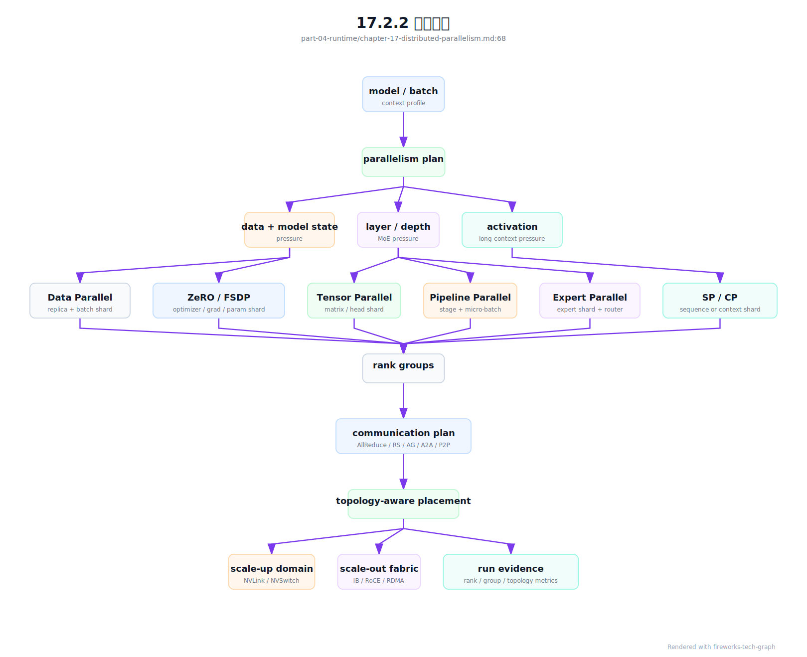

# 第 17 章：分布式并行

## 17.1 导读

### 17.1.1 本章回答的问题

- Data Parallel、Tensor Parallel、Pipeline Parallel、Expert Parallel、Sequence Parallel 和 Hybrid Parallel 分别解决什么问题？
- 并行策略如何映射到 GPU 拓扑、NVLink、RDMA 和调度？
- 为什么并行策略是模型训练和推理容量规划的核心？


### 17.1.2 本章上下文

- 层级定位：本章属于 `AI Runtime 层`，重点讨论推理引擎、训练框架、并行、通信和 GPU 软件栈。
- 前置依赖：建议先理解 第 16 章：训练框架 中的核心对象和路径。
- 后续关联：本章内容会继续连接到 第 18 章：通信原语，并在系统地图、深度标准和读者测试中被交叉引用。
- 读完能力：读完本章后，读者应能把《分布式并行》中的概念映射到 AI Factory 的生产路径、工程对象、观测证据和设计取舍。


### 17.1.3 读者测试

- 机制题：读者能否解释 Data Parallel、Tensor Parallel、Pipeline Parallel、Expert Parallel 的核心机制，以及它们如何共同支撑《分布式并行》？
- 边界题：读者能否区分 框架、引擎、CUDA/NCCL、container runtime、driver 和硬件拓扑 的责任边界，并说明哪些问题不能简单归因到本章组件？
- 路径题：读者能否从框架调用追到推理/训练 runtime、CUDA、NCCL、通信、GPU/HBM 和版本矩阵，并指出本章对象在路径中的位置？
- 排障题：当《分布式并行》相关生产症状出现时，读者能否列出第一层证据、下一跳证据、可能 owner 和止血动作？


### 17.1.4 一个真实场景

一个训练团队先在 8 卡节点内完成模型验证，tokens/s、loss 曲线和 checkpoint 都正常。扩展到 64 卡后，GPU 数增加了 8 倍，吞吐只提升了 3 倍，偶尔还出现 step time 抖动。最初大家怀疑数据读取或框架 bug，但 profiler 显示，Tensor Parallel 的通信跨越了节点，部分 Pipeline stage 等待时间很长，Data Parallel 的 AllReduce 在 checkpoint 前后形成通信高峰。模型没有变，硬件总量增加了，系统效率却下降了。

这个场景说明，分布式并行不是“把同一个任务放到更多 GPU 上”。它是把模型计算、参数状态、激活、梯度、专家路由和数据 batch 映射到真实 GPU 拓扑的工程问题。不同通信频率的并行组，需要落在不同带宽和延迟特征的链路上。高频同步如果跨节点，低频同步如果占用节点内高速链路，都会浪费硬件能力。扩展效率差时，不能只问 GPU 是否够多，还要问并行维度是否贴合拓扑。

AI Factory 中，分布式并行同时影响算法、Runtime、调度和容量规划。算法团队选择模型结构和 batch，Runtime 团队选择并行策略，调度系统决定 GPU 放置，网络团队提供 NVLink、NVSwitch、InfiniBand 或 RoCE 路径。任何一层只看自己的局部目标，都可能让整体吞吐变差。因此，并行配置应被视为生产级资源契约，而不是训练脚本中的私有参数。

这个契约的价值在故障时最明显。若任务变慢，团队应该能回答：哪些 rank 属于同一个 Tensor Parallel group，哪些 rank 是同一个 Pipeline stage，哪些通信跨节点，哪些通信跨机架，checkpoint 是否和并行度绑定。回答不了这些问题，扩容就只能靠试错。经典系统工程强调可解释的边界，分布式并行也一样，先把切分、通信和放置讲清楚，再谈优化。


## 17.2 基础模型

### 17.2.1 核心概念

分布式并行是把一次训练或推理拆到多个设备执行的方法集合。Data Parallel 复制模型、切分数据；Tensor Parallel 切分单层张量计算；Pipeline Parallel 切分模型层；Expert Parallel 切分 MoE expert；Sequence Parallel 切分序列维度；Hybrid Parallel 把多种方式组合起来。它们解决的约束不同：有的解决显存，有的解决计算规模，有的解决长序列，有的解决总参数量，有的解决吞吐扩展。

每种并行方式都会引入通信。Data Parallel 需要同步梯度或参数状态，Tensor Parallel 需要在层内交换中间结果，Pipeline Parallel 需要在 stage 之间传递 micro-batch，Expert Parallel 需要 dispatch token，Sequence Parallel 需要重新组合序列相关数据。通信不是附属开销，而是并行策略的组成部分。判断策略是否合理，必须同时看计算、显存、通信和调度可实现性。

在 AI Factory 中，并行策略还要转化为平台语言。任务不只是“需要 64 张 GPU”，还可能要求每 8 张 GPU 组成一个 Tensor Parallel group、Pipeline stage 尽量落在相邻节点、Data Parallel group 跨机架分布、MoE expert 避免热点。调度器如果只理解 GPU 数量，就无法保证性能可重复。并行策略和 GPU placement 必须共同设计。

还要区分训练并行和推理并行。训练更关注 backward、梯度同步、optimizer state 和 checkpoint；推理更关注 prefill/decode、KV Cache、batching 和尾延迟。二者可能使用相同术语，却有不同瓶颈。平台文档应明确每种并行配置适用于训练、推理还是两者都适用，避免把训练经验直接套到在线推理上。

本章讨论这些概念时，会始终追问三个问题：它节省什么资源，它增加什么通信，它要求调度器保证什么拓扑。能回答这三个问题，才算真正理解一种并行方式。


### 17.2.2 系统架构

分布式并行架构可以看成三层：模型切分层、通信层和拓扑放置层。模型切分层决定哪些张量、层、expert、序列或数据 batch 被拆分；通信层用 AllReduce、AllGather、ReduceScatter、P2P 等原语交换数据；拓扑放置层把通信组映射到节点内 NVLink/NVSwitch、跨节点 RDMA、机架和集群网络。三层之间没有清晰隔离，任何切分方式都会改变通信路径和资源需求。

平台控制面需要把这些信息显式记录。训练提交时，用户或模板给出 tensor_parallel_size、pipeline_parallel_size、data_parallel_size、sequence_parallel、expert_parallel 等参数；调度器根据参数生成 placement 约束；launcher 根据调度结果设置 rank、world size 和通信组；训练框架按 rank group 执行 forward、backward 和 optimizer。若中间任何一步丢失语义，最终运行就只能碰运气。

观测面同样要理解并行结构。一个 step 慢，可能是某个 pipeline stage 负载过重，也可能是 tensor group 跨节点，也可能是 expert 路由倾斜。只有把 rank 映射、GPU 拓扑、通信组和训练 trace 关联起来，才能定位瓶颈。分布式并行的成熟实现，不是单纯支持更多参数，而是让并行配置、放置结果和运行指标形成闭环。

这类架构最怕“配置在脚本里、放置在调度器里、指标在监控里、checkpoint 在存储里”，彼此没有共同标识。一个可维护实现应为每次作业生成统一 run id，并把并行配置、镜像、节点、rank、通信组、checkpoint 和指标都挂到这个标识下。这样复盘才不是人工拼图。

架构还应支持对照实验。同一个模型用不同并行策略运行时，平台应能并排比较吞吐、显存、通信、失败率和恢复时间。没有对照，所谓“优化”往往只是把瓶颈从一个地方转移到另一个地方。

因此，架构设计要把“可比较”作为一等目标。



进入生产前，并行策略应先落成 `parallelism_plan_record`。它回答的不是“用了几个并行维度”，而是“为什么这组维度适合这个模型、这个数据、这个 GPU 拓扑和这个训练目标”。一个合格计划要同时描述模型形态、batch 语义、显存预算、通信画像、checkpoint 约束、期望拓扑和回退策略。缺少这些信息，后续看到 tokens/s 不达预期时，很难判断是模型本身、并行策略、放置、网络还是框架配置的问题。

```yaml
parallelism_plan_record:
  plan_id: ppr-llm-20260620-001
  training_job_template: pretrain-llm-h100-512
  framework_runtime_matrix: frm-h100-train-20260620
  model_profile:
    architecture: transformer_dense_or_moe
    parameter_scale: recorded_bucket
    context_length: recorded
    sequence_length_distribution_ref: dataset-length-profile-001
  batch_semantics:
    micro_batch_size: recorded
    gradient_accumulation_steps: recorded
    global_batch_size: recorded
    global_batch_change_policy: requires_training_review
  parallel_dimensions:
    tensor_parallel_size: 8
    pipeline_parallel_size: 4
    data_parallel_size: 16
    sequence_parallel: true
    expert_parallel_size: 1
  resource_expectation:
    total_gpus: 512
    preferred_gpu_type: h100-class
    tensor_group_topology: same_node_required
    pipeline_adjacent_stage_topology: same_rack_preferred
    data_parallel_fault_domain: spread_preferred
  predicted_pressure:
    hbm_peak_risk: medium
    high_frequency_collectives: [all_gather, reduce_scatter]
    checkpoint_format: sharded
    checkpoint_restore_world_size_policy: fixed_or_converter_required
  acceptance:
    required_baselines:
      - single_node_tp
      - multi_node_dp
      - checkpoint_save_restore
      - short_training_loss_sanity
    regression_gate: communication_regression_record_required
```

这个对象让并行策略可以被评审。评审时应关注三个问题：第一，维度乘积是否只是数学正确，还是符合真实拓扑；第二，显存节省是否以过高通信、重算或 checkpoint 复杂度为代价；第三，若资源不足导致放置降级，用户是否接受吞吐、稳定性和成本后果。`parallelism_plan_record` 不替代训练专家判断，但它强迫判断留下证据。

计划通过后，还需要 `rank_topology_contract`。`parallelism_plan_record` 是意图，`rank_mapping` 是一次运行的事实，`rank_topology_contract` 则定义哪些事实必须满足。它把“应该同节点”“尽量同 rack”“必须 rail 均衡”这类口头要求变成可机器检查的约束和违反动作。

```yaml
rank_topology_contract:
  contract_id: rtc-llm-20260620-001
  parallelism_plan_record: ppr-llm-20260620-001
  hard_constraints:
    tensor_parallel_group:
      gpu_distance: same_nvlink_or_nvswitch_domain
      violation_action: reject_placement
    rdma_device:
      container_visible: required
      gpu_nic_numa_affinity: required
    world_size:
      equals_product_of_parallel_dimensions: required
  soft_constraints:
    pipeline_adjacent_stage:
      topology: same_rack
      violation_action: warn_and_require_user_acceptance
    data_parallel_group:
      fault_domain_spread: preferred
      violation_action: record_degradation
    rail_balance:
      max_skew_policy: compare_with_baseline
      violation_action: mark_for_network_review
  evidence_refs:
    placement_commit_record: required_after_scheduling
    gpu_nic_topology_evidence: required_if_rdma
    rail_balance_report: required_for_multi_rail
```

这份 contract 可以被 Kubernetes 调度器、Slurm 插件、launcher 和验收系统共同使用。调度器用它选择资源，launcher 用它生成 rank 分组，验收系统用它判断 placement 是否合格，排障系统用它解释一次训练为什么偏离基线。它还能防止一种常见失误：作业申请的 GPU 数正确，但 Tensor Parallel group 被跨节点放置，训练仍能启动，却以不可接受的通信成本运行。生产系统应优先在启动前拒绝这类 placement，而不是让用户在几小时后发现吞吐异常。


## 17.3 关键技术

### 17.3.1 Data Parallel

Data Parallel 是最直观的并行方式：每个 GPU 或 GPU 组保存一份模型副本，处理不同数据 batch，反向传播后同步梯度或参数状态。它适合模型能够放入单个并行单元、但需要提高数据吞吐的场景。许多训练任务从单机多卡扩展到多节点时，首先采用 Data Parallel，因为它对模型代码侵入较小，也容易和现有数据加载流程结合。

Data Parallel 的核心成本是同步。GPU 数量越多，每个 step 后需要同步的梯度越多，AllReduce 或 ReduceScatter 的开销越明显。如果计算量足够大，通信可以被计算掩盖；如果 batch 太小、模型太轻或网络较弱，通信会成为扩展瓶颈。看扩展效率时，不能只看 GPU utilization，还要看通信占 step time 的比例，以及不同 rank 是否因为慢节点而等待。

工程上，Data Parallel 要关注 global batch、micro batch、gradient accumulation 和学习率策略。增加 GPU 后如果 global batch 改变，训练收敛行为也可能改变；如果为了维持 global batch 而减小每卡 batch，通信占比可能升高。平台需要记录这些参数，否则一次扩容实验无法解释性能和质量变化。Data Parallel 不是“免费横向扩展”，它把计算扩展问题转化为同步效率和训练语义一致性问题。

Data Parallel 还有一个容易混淆的边界：传统 DP 或 DDP 复制完整模型状态，而 ZeRO 和 FSDP 通过切分 optimizer state、gradient 和 parameter 来减少冗余。ZeRO-1 只切 optimizer state，ZeRO-2 进一步切 gradient，ZeRO-3 连 parameter 也切分；FSDP 与 ZeRO-3 更接近，重点是训练状态分片和按需聚合。它们能显著降低每卡 HBM 占用，但不是把某一层矩阵按行列拆开计算的 Tensor Parallel。平台文档应把“状态切分”和“层内计算切分”分开记录，否则 checkpoint、恢复、推理导出和通信诊断都会混乱。

ZeRO/FSDP 的收益也不是免费显存。参数、梯度或 optimizer state 被切分后，forward、backward 和 optimizer step 的某些阶段需要 AllGather、ReduceScatter 或参数重建，通信模式会从单纯梯度 AllReduce 变成更复杂的状态交换。它适合模型状态成为瓶颈的场景，但如果网络较弱、bucket 设置不合理或重叠不充分，显存省下来了，step time 可能变长。生产模板应同时记录 `state_sharding_stage`、bucket、prefetch、overlap 和 checkpoint 格式。

在生产平台上，Data Parallel 的验收可以从弱扩展和强扩展两条线做。弱扩展保持每卡 batch 不变，看 GPU 数增加后总吞吐是否接近线性；强扩展保持 global batch 不变，看更多 GPU 是否真的缩短 step time。两种测试回答的问题不同，混在一起会误导容量规划。平台给用户承诺训练效率时，应说明使用哪种扩展口径。

如果 Data Parallel 扩展效率差，优先检查慢 rank、通信重叠、bucket 配置和网络路径，而不是立刻更换模型代码。


### 17.3.2 Tensor Parallel

Tensor Parallel 把单层中的矩阵乘、attention 或 MLP 计算沿张量维度切分到多个 GPU。它解决的问题是单个模型层太大、单卡显存或计算能力不足，或者希望用多个 GPU 加速单层计算。与 Data Parallel 复制模型不同，Tensor Parallel 让一个层的计算跨 GPU 协作完成，因此通信频率更高，对带宽和延迟更敏感。

典型约束是拓扑。Tensor Parallel group 通常更适合放在节点内 NVLink 或 NVSwitch 连接的 GPU 上，因为层内通信发生在 forward 和 backward 的关键路径中。如果 group 跨节点，通信可能走 IB/RoCE，延迟和拥塞风险都会增加。不是说 Tensor Parallel 不能跨节点，而是跨节点后需要更强网络和更谨慎的配置。调度器如果随机分配 GPU，Tensor Parallel 的性能会高度不稳定。

工程上，Tensor Parallel size 需要结合模型隐藏维度、attention heads、GPU 显存、节点内 GPU 数和框架支持来选。过小可能无法放下模型，过大可能增加通信和 kernel 碎片化。它还会影响 checkpoint 格式和推理部署：训练时切分的权重，服务时可能需要相同并行度，或经过合并转换。平台应记录 Tensor Parallel group 的 rank 到 GPU 映射，排障时才能判断慢来自模型计算、通信链路还是放置错误。

以 Transformer 为例，Tensor Parallel 通常会沿 attention head、MLP 权重矩阵的列或行切分。列并行让每张 GPU 计算部分输出通道，行并行让每张 GPU 消费部分输入通道，随后通过 AllGather、ReduceScatter 或 AllReduce 合并结果。切分不是随意的：attention head 数、hidden size、intermediate size 和 vocab projection 都要能被并行度合理整除；否则会出现额外 padding、通信或 kernel 效率下降。框架模板应把这些可整除约束写进准入校验，而不是让任务在运行时失败。

Tensor Parallel 的通信发生在层内关键路径，频率通常高于 Data Parallel 的梯度同步。某些实现中，MLP 的一次列并行加行并行会在 forward/backward 中触发多次 collective；输出层如果直接按 vocab 大矩阵合并，通信量也可能非常大。因此 TP 的经验原则是尽量放在同一 NVLink/NVSwitch 域内，跨节点 TP 必须有明确性能证据和网络等级。TP 可以降低单卡参数和 activation 压力，但并行度过大时，通信和 kernel 碎片化会吞掉收益。

一个实用判断是：Tensor Parallel 优先解决“单层太大或单层计算需要多 GPU”的问题，而不是泛化的扩容工具。如果模型能在较小并行度下稳定运行，盲目增大 Tensor Parallel size 可能只是把更多时间交给通信。调参时应比较层内通信占比、HBM 峰值和 kernel 效率，而不是只看是否避免 OOM。

验收时应固定节点内拓扑，避免同一 Tensor Parallel group 在不同运行中落到不同链路上。否则 benchmark 结果不可比较。


### 17.3.3 Pipeline Parallel

Pipeline Parallel 把模型按层或模块切成多个 stage，不同 GPU 或 GPU 组负责不同 stage。Micro-batch 依次通过各 stage，形成流水线。它适合模型层数多、整体参数和 activation 无法由单个并行单元承载的场景，也常与 Tensor Parallel 和 Data Parallel 组合使用。Pipeline 的价值是把模型深度分摊到更多设备，但代价是流水线调度和负载均衡复杂。

Pipeline 的主要问题是 bubble 和 stage imbalance。流水线开始和结束时总有设备等待，micro-batch 数不足时 bubble 更明显；如果某些 stage 包含更多计算或更大 activation，它们会成为瓶颈，其他 stage 等待。切分模型时不能只按层数平均，还要看每层计算量、参数量、activation 大小和通信路径。对于 Transformer，embedding、attention、MLP 和输出层的成本可能并不均匀。

减少 bubble 的基本手段是把 global batch 切成更多 micro-batch，让不同 stage 同时处理不同 micro-batch。1F1B 调度会在前向填满后尽快穿插反向，降低同时保留的 activation 数量；interleaved 或 virtual pipeline 会把每个物理 stage 进一步拆成多个虚拟 stage，降低局部等待；更激进的 zero-bubble 类调度会拆分 backward 中输入梯度和参数梯度的时序，用更细粒度填充空洞。这些方法都不是单纯“加 GPU”，而是在计算、显存和调度复杂度之间交换。

Pipeline 的气泡率可以用直觉公式理解：当 pipeline stage 数为 `p`、micro-batch 数为 `m` 时，常规流水线的等待比例大致随 `(p - 1) / m` 下降。这个公式不是生产评估的完整模型，但能说明为什么 micro-batch 太少会浪费 GPU，micro-batch 太多又会提高 activation、调度和通信管理成本。平台模板应同时记录 `pipeline_parallel_size`、`micro_batch_size`、`num_micro_batches`、schedule 类型和 stage 切分依据。

平台实现 Pipeline Parallel 时，应把 stage 到节点/GPU 的映射记录下来，并提供 stage-level 指标。只看整体 GPU utilization，无法发现某个 stage 长期拖慢流水线。调度上，可以让相邻 stage 落在拓扑相近的位置，减少 P2P 传输成本。Checkpoint 也要理解 stage 切分，否则恢复或导出时会遇到状态不完整的问题。Pipeline Parallel 的关键，不是把层切开，而是让流水线持续、均衡、可恢复地运行。

Pipeline 配置还会影响故障恢复语义。某个 stage 失败后，整个流水线需要一致恢复；若 checkpoint 只保存局部状态或保存点不一致，恢复后可能出现参数不同步。平台应规定 stage state、optimizer state 和随机数状态如何保存。对长时间训练而言，Pipeline 的可恢复性和吞吐同样重要。

评估 Pipeline 时，stage idle time 比平均 GPU 利用率更有解释力。平均值看似正常，某个慢 stage 仍然可能决定全局 step time。

因此，Pipeline 调优要先看最慢 stage，而不是平均 GPU 曲线。


### 17.3.4 Expert Parallel

Expert Parallel 常见于 Mixture of Experts（MoE）模型。MoE 不是让每个 token 经过所有参数，而是通过 router 把 token 分配给部分 expert。Expert Parallel 把不同 expert 放在不同 GPU 或 GPU 组上，从而扩大总参数量，同时控制每个 token 的实际计算量。它适合追求大模型容量但希望控制单 token 计算成本的场景。

Expert Parallel 的难点在于 token dispatch 和负载均衡。某些 expert 如果接收过多 token，就会形成热点，导致尾延迟、显存峰值或训练不稳定；跨节点 dispatch 会消耗网络带宽，并让通信模式变得更不规则。与 Data Parallel 或 Tensor Parallel 相比，MoE 的通信更受数据分布和 router 行为影响，不能只依赖静态拓扑分析。

MoE 的通信形态通常包含 dispatch 和 combine 两段：router 根据 token 特征选择 top-k expert，系统把 token 重排后发给对应 expert，expert 计算完成后再按原顺序合并。跨 GPU、跨节点或跨 DP shard 时，这个过程常表现为 All-to-All 类流量。它和 AllReduce 不同，不只是把同形状梯度求和，而是把不同 token 分发到不同 expert，流量大小和负载由数据分布和路由策略决定。

工程上，应监控 expert token 分布、drop 或 overflow、dispatch time、combine time、expert 负载和跨节点流量。训练时还要关注 router loss、负载均衡策略和容量因子等参数。调度层如果能把高频互访的 expert 或同一 expert group 放在更近拓扑上，可以降低抖动。对于推理，Expert Parallel 还会影响请求路由和尾延迟，因为不同请求的 token 可能触发不同 expert。MoE 的核心不是“参数更多”，而是“稀疏激活带来的系统复杂度”。

MoE 还要求成本核算更细。Dense model 的每 token 计算路径相对稳定，MoE 的每 token 成本会随路由和 expert 负载变化。训练平台要看 expert 平衡，推理平台要看不同请求的尾延迟和热 expert。若只按平均 tokens/s 做容量规划，热点 expert 会在高峰期暴露为不可解释的延迟抖动。

因此，Expert Parallel 的验收要包含分布指标，而不只是整体吞吐。平均值无法说明 expert 是否均衡。

如果分布长期倾斜，应先处理路由和容量策略，再扩大 GPU。

扩容不能替代负载治理。


### 17.3.5 Sequence Parallel

Sequence Parallel 把序列维度切分到多个设备，常用于长上下文训练，或与 Tensor Parallel 结合降低 activation 显存。长序列会显著增加 attention 和 activation 开销，单卡或单个 Tensor Parallel group 可能无法承载。通过拆分 sequence，系统可以把部分中间状态分散到多个 GPU，缓解 HBM 压力。

这里要区分两类常被混用的口径。Megatron 风格 Sequence Parallel 多与 Tensor Parallel 配合，把 layernorm、dropout 等对序列位置局部可计算的 activation 沿 sequence 维切分，常把原本 TP 中的 AllReduce 拆成 ReduceScatter + AllGather，从而减少 activation 冗余。长上下文场景中的 Context/Sequence Parallel，如 Ulysses、Ring Attention 或类似实现，则更关注 attention 的长序列计算与 KV/activation 分布。二者都沿序列维做文章，但适用层、通信模式和调参目标不同。

它的收益取决于模型结构、序列长度、attention 实现和框架支持。短序列场景中，Sequence Parallel 的额外通信可能超过显存收益；长序列场景中，它可能成为训练能否启动的关键。Sequence Parallel 常常和 activation checkpointing、FlashAttention 类优化、Tensor Parallel 和 FSDP 同时出现，因此排障时不能孤立看一个开关。一次 OOM 可能来自序列长度、activation、通信 buffer 和重算策略共同作用。

平台上，Sequence Parallel 需要记录最大 context length、实际样本长度分布、padding 策略、activation 显存、通信耗时和 rank 映射。应用层要求更长上下文时，压力会沿着模型、Runtime、调度和存储向下传导。AI Factory 如果只按“模型参数量”估算资源，会低估长上下文训练的成本。Sequence Parallel 提醒我们：序列长度本身就是容量规划变量。

Sequence Parallel 的诊断也要关注样本分布。两个任务参数量相同、平均长度相同，但长尾样本比例不同，显存峰值和 step time 可能完全不同。平台应保留训练数据的长度统计，至少记录 bucket、padding 和截断策略。没有这些数据，长上下文训练中的 OOM 和吞吐波动很难复盘。

长上下文任务还要单独评估最坏样本，而不是只看平均序列长度。容量通常被长尾决定。

这也是为什么上下文长度要进入资源画像，而不是只写在模型说明里。

否则容量估算会系统性偏乐观。

训练平台应把长度分布作为调度和验收输入。


### 17.3.6 Hybrid Parallel

Hybrid Parallel 是多种并行方式的组合，例如 Data + Tensor + Pipeline，或在 MoE 模型中叠加 Expert Parallel、Sequence Parallel 和 FSDP。大模型训练通常需要混合并行，因为单一并行方式无法同时解决参数量、激活显存、计算吞吐、通信瓶颈和集群规模问题。Hybrid Parallel 的价值是把不同约束分配给不同策略处理，但配置空间会迅速扩大。

混合并行的核心挑战是维度乘积和通信嵌套。假设一个任务使用 tensor_parallel_size=8、pipeline_parallel_size=4、data_parallel_size=16，总 GPU 数就是多个维度的组合。每个 rank 同时属于不同通信组，一次 step 中可能发生层内通信、stage 间传输、梯度同步和 checkpoint 写入。任何一个维度设置不合理，都会拖慢整体。更复杂并行不一定更高效，只有和模型结构、拓扑和 batch 匹配时才有价值。

一个实用分组规则是先确定模型并行组，再由 `world_size / (tp * pp * ep)` 推导数据并行规模，具体还要看框架如何定义 expert、context 和 shard 维度。例如 16 张 GPU、`tp=2`、`pp=4` 时，每个模型副本占 8 张 GPU，若不开 EP 和额外 context 维度，则 `dp=2`。TP 组适合在同节点或同 NVSwitch 域内，PP 组沿 stage 串联，DP 组连接相同模型切片做梯度或状态同步。这个乘积只是起点，真正的生产配置还必须生成 rank group 和拓扑合同。

```yaml
parallel_rank_group_example:
  world_size: 16
  dimensions:
    tensor_parallel_size: 2
    pipeline_parallel_size: 4
    data_parallel_size: 2
  model_parallel_groups:
    - [g0, g1, g4, g5, g8, g9, g12, g13]
    - [g2, g3, g6, g7, g10, g11, g14, g15]
  tensor_parallel_groups:
    - [g0, g1]
    - [g4, g5]
    - [g8, g9]
    - [g12, g13]
    - [g2, g3]
    - [g6, g7]
    - [g10, g11]
    - [g14, g15]
  pipeline_parallel_groups:
    - [g0, g4, g8, g12]
    - [g1, g5, g9, g13]
    - [g2, g6, g10, g14]
    - [g3, g7, g11, g15]
  data_parallel_groups:
    - [g0, g2]
    - [g1, g3]
    - [g4, g6]
    - [g5, g7]
    - [g8, g10]
    - [g9, g11]
    - [g12, g14]
    - [g13, g15]
```

这类示例的重点不是固定某一种编号，而是让平台能回答“哪几个 rank 共享同一层切片、哪几个 rank 是流水线相邻 stage、哪几个 rank 需要同步同一份权重语义”。没有这些组，NCCL 日志中的 rank 只是数字，无法映射到模型结构。

工程上，平台应沉淀推荐模板，而不是让用户每次手动枚举组合。模板可以按模型规模、上下文长度、GPU 类型、节点拓扑和网络能力划分，并附带基线吞吐、显存峰值和已知限制。高级用户可以调整，但调整必须可审计。Hybrid Parallel 的治理目标，是把高维配置空间收敛为少量可解释、可复现、可回滚的生产路径。

模板化并不意味着僵化。好的模板会公开关键假设：目标模型规模、GPU 类型、节点内互联、跨节点网络、推荐 batch、已验证 checkpoint 方式和不适用场景。用户偏离模板时，平台应记录偏离项，并把指标和故障按模板版本比较。这样 Hybrid Parallel 才能从个人经验变成组织能力。

模板评审时，应要求给出“为什么不用更简单策略”的理由。复杂度必须有清楚收益。

否则 Hybrid Parallel 会变成难以维护的参数堆叠。


### 17.3.7 并行策略如何映射到 GPU 拓扑

并行策略最终要落到物理拓扑。通常，高频、低延迟要求强的通信应尽量放在节点内 NVLink/NVSwitch；跨节点 RDMA 更适合可扩展但相对低频或可重叠的通信；跨机架通信要考虑 oversubscription、拥塞和故障域。Tensor Parallel 往往更偏节点内，Data Parallel 可以跨节点扩展，Pipeline stage 的相邻关系需要结合带宽和负载均衡，Expert Parallel 则要看 token 路由模式。

可以把放置原则压缩成四句话：TP 尽量不跨低带宽路径，PP 相邻 stage 尽量靠近但要避免 stage 负载不均，DP 可以跨节点和故障域但要保护梯度同步有效带宽，EP 要按 All-to-All 和 expert 热点规划网络路径。SP/CP 则取决于它服务的是 TP activation 去冗余，还是长上下文 attention 计算。不同策略同时出现时，调度器要明确谁是最高优先级约束，不能把所有约束都当成同等软偏好。

拓扑映射不是一次性的静态设计。随着模型变大、上下文变长、batch 改变、框架升级和集群扩容，最优放置也会变化。平台应保存节点、GPU、NIC、rail、机架和交换机端口信息，并把任务的 rank group 映射到这些对象上。这样当某个训练慢时，才能判断是并行策略不合理、调度放置不稳定，还是某条链路退化。

调度系统需要从“满足 GPU 数量”升级为“满足并行拓扑意图”。作业提交可以表达 same_node、same_rack、same_rail、avoid_fault_domain 等约束；调度器在资源不足时可以给出明确原因，而不是让任务 pending 或随机降级。拓扑感知调度的价值，是让训练性能可预测。没有这个能力，AI Factory 会出现同一任务今天快、明天慢的问题，排障成本会随集群规模放大。

拓扑映射还要服务可靠性。为了性能把所有关键通信集中在同一故障域，可能提高单次吞吐，却降低作业韧性；为了分散故障域而跨更多网络路径，可能降低吞吐。训练任务、在线推理和评测任务对这两者的权重不同。平台应允许不同队列使用不同放置策略，而不是给所有任务同一套拓扑规则。

当资源紧张无法满足拓扑意图时，平台应显式拒绝或提示降级后果，而不是静默放宽约束。


## 17.4 工程落地

### 17.4.1 工程实现

工程实现应把并行配置拆成两类：训练语义和放置意图。训练语义包括 tensor_parallel_size、pipeline_parallel_size、data_parallel_size、expert_parallel_size、sequence_parallel、micro_batch、global_batch 和 gradient accumulation；放置意图包括 tensor group 是否同节点、pipeline stage 是否相邻、data parallel 是否跨故障域、通信是否需要同 rail。二者都必须进入作业元数据。

示例配置如下：

```yaml
parallelism:
  tensor_parallel_size: 8
  pipeline_parallel_size: 4
  data_parallel_size: 16
  sequence_parallel: true
placement:
  tensor_group: same_node
  pipeline_group: same_rack_preferred
  data_parallel: spread_across_nodes
observability:
  record_rank_mapping: true
  record_collective_metrics: true
```

并行配置最终必须落成 rank mapping。Rank mapping 是训练故障诊断的坐标系，记录每个 rank 属于哪些并行组，运行在哪个节点、哪张 GPU、哪个 NUMA 域、哪个 NIC 和哪个拓扑域。没有 rank mapping，NCCL 慢、stage imbalance、expert hotspot 和慢节点都无法可靠定位。

```yaml
rank_mapping:
  job_id: exp-20260619-001
  world_size: 512
  ranks:
    - rank: 0
      node: gpu-node-001
      gpu_uuid: GPU-aaaa
      local_rank: 0
      numa: 0
      nic: mlx5_0
      rack: rack-12
      rail: rail-a
      groups:
        data_parallel: dp-0
        tensor_parallel: tp-0
        pipeline_stage: pp-0
    - rank: 1
      node: gpu-node-001
      gpu_uuid: GPU-bbbb
      local_rank: 1
      numa: 0
      nic: mlx5_0
      rack: rack-12
      rail: rail-a
      groups:
        data_parallel: dp-0
        tensor_parallel: tp-0
        pipeline_stage: pp-0
```

Rank mapping 还应有一致性校验。Tensor Parallel group 是否真的在 same_node，Pipeline 相邻 stage 是否跨越过多网络跳数，Data Parallel group 是否覆盖预期故障域，MoE expert group 是否集中在某个 rack，这些都可以在启动前或启动后自动检查。检查失败时，平台应明确提示“策略未满足”或“降级放置”，而不是让用户从性能下降中猜测。

调度器还应产出 `placement_commit_record`。它把用户提交的并行放置意图、调度器实际分配、放置降级、rank mapping 和后续训练指标绑定起来。`rank_mapping` 是坐标系，`placement_commit_record` 是“这次放置为什么被接受”的审计记录。没有它，团队只能看到任务慢，却不知道是并行策略本身有问题，还是资源不足导致调度器放宽了拓扑约束。

```yaml
placement_commit_record:
  job_id: exp-20260619-001
  parallelism_template: megatron-h100-512gpus-v3
  parallelism_plan_record: ppr-llm-20260620-001
  rank_topology_contract: rtc-llm-20260620-001
  requested_intent:
    tensor_group: same_node_required
    pipeline_adjacent_stage: same_rack_preferred
    data_parallel: spread_across_fault_domains
    rail_policy: balanced
  committed_placement:
    nodes: 64
    racks: [rack-11, rack-12]
    rank_mapping_ref: rank-mapping-exp-20260619-001
    rail_balance_report: rail-balance-exp-20260619-001
  validation:
    tensor_group_intent: satisfied
    pipeline_intent: degraded_with_reason
    gpu_nic_affinity: passed
    fabric_baseline: passed
  decision:
    accepted_by: scheduler_policy_v12
    degradation_reason: insufficient_same_rack_capacity
    user_visible_warning: true
```

这个记录能把调度和 Runtime 指标连接起来。若训练 step time 比模板基线慢，SRE 可以先看 placement 是否降级；若 NCCL hang 只出现在跨 rack placement，平台可以把策略改成拒绝而不是降级；若用户接受了降级等待更短，就应在运行报告里看到它对 tokens/s 和通信占比的影响。放置不是一次内部决策，而是训练性能合同的一部分。

`placement_commit_record` 还应区分“允许降级”和“禁止降级”。Tensor Parallel group 跨越错误拓扑通常应 reject，因为它会改变关键路径通信；Pipeline 相邻 stage 跨 rack 可能允许 conditional accept，但必须把影响进入报告；Data Parallel 故障域分散不足可能不影响短期吞吐，却会影响维护和故障恢复。不同约束的违反动作不同，不能用一个通用 warning 处理。

实现流程可以分为四步。第一步，模板根据模型和硬件给出推荐并行配置。第二步，调度器根据 placement 约束选择节点和 GPU，并返回 rank 到设备的映射。第三步，launcher 把映射写入环境变量或配置文件，框架据此初始化通信组。第四步，监控系统收集 step、rank、group 和 topology 维度指标。缺少任何一步，并行策略都无法闭环。生产平台还应在任务启动前做一致性校验，例如总 GPU 数是否等于各并行维度乘积，Tensor Parallel size 是否超过节点内 GPU 数。

落地时还应提供 dry-run 能力。用户提交配置后，平台先返回预计 GPU 数、节点数、通信组、放置约束和可能的排队原因，而不是直接进入长时间 pending。dry-run 能提前发现维度乘积错误、拓扑约束过严或资源池不匹配。对大规模训练而言，提交前发现错误比运行一小时后失败更有价值。

实现还要保存实际放置结果。用户声明的 placement 是意图，调度器返回的 placement 才是事实。二者都要记录，否则无法解释性能差异来自配置还是资源供给。对于长周期训练，节点替换、重调度或恢复后的新映射也应写入同一任务历史。

同时，平台应把这些信息暴露给用户和 SRE，而不是只保存在调度器内部。可见性是协作排障的前提。

暴露方式可以是作业详情页、事件日志或导出的运行报告。

训练完成或失败后，应把并行配置和 rank mapping 写入运行报告。这样不同策略之间可以比较，也能沉淀模板经验。报告至少应包含：并行维度、实际拓扑、是否满足放置意图、rank skew、最慢 group、通信占比、HBM 峰值、checkpoint 格式和恢复限制。并行优化如果不留下报告，就很难从一次经验变成平台能力。


### 17.4.2 常见故障

第一类故障是通信组跨越错误拓扑。Tensor Parallel group 被调度到跨节点 GPU，或高频 expert dispatch 穿过拥塞链路，会导致 step time 增加。排查需要查看 rank mapping，而不是只看作业申请了多少 GPU。第二类故障是 Pipeline stage 不均衡，某些 stage 计算或通信过重，其他 stage 长时间等待。解决方向是重新切层、调整 micro-batch 或改变 stage 放置。

第三类故障是 Data Parallel 同步成为瓶颈。GPU 数增加后，AllReduce 时间占比升高，扩展效率下降。要检查 bucket、overlap、网络带宽和慢 rank。第四类故障是 MoE expert 热点，token 分布倾斜导致少数 expert 过载，表现为尾延迟、OOM 或训练不稳定。需要结合 router 指标和 expert 级负载观察，而不是只看全局吞吐。

第五类故障是并行配置和 checkpoint 不匹配。训练用一种并行度保存状态，恢复或导出时使用另一种并行度，可能失败或产生错误权重。第六类故障是调度不稳定，同一任务每次拿到的节点拓扑不同，性能波动明显。解决这类问题，需要把并行配置、rank 映射、checkpoint 格式和拓扑结果一起纳入任务记录。

还有一类隐蔽故障是局部慢 rank。单个 GPU 降频、单条链路丢包或某个数据 shard 处理慢，都会让同步型训练整体等待。表现上像全局通信慢，根因却可能是局部异常。排查时应先看 rank skew，再下钻到节点、GPU、NIC 和数据分片。同步系统里，最慢的一小部分资源会决定整体节奏。

故障复盘应产出可执行动作：调整模板、隔离节点、修复网络、修改切分或补充指标。只记录“训练慢”没有运维价值。

如果复盘无法关联到并行维度，就说明观测模型还不完整。

第七类故障是模板参数乘积正确但语义错误。例如总 GPU 数满足 `dp * tp * pp`，但 micro-batch 太小导致 pipeline bubble 极高；Tensor Parallel group 虽在同节点但没有对齐 NVLink 域；Data Parallel group 分布在同一故障域，节点维护时影响面过大。解决方向是把“数学有效”与“拓扑有效”“性能有效”“可靠性有效”分开验收。


### 17.4.3 性能指标

分布式并行的核心指标是扩展效率。常见观察包括 step time、tokens/s、samples/s、GPU MFU、GPU utilization 分布、rank skew、通信占比和 idle time。扩展效率不应只用“总吞吐是否增加”判断，还要看单位 GPU 产出是否下降。若 GPU 数翻倍但 tokens/s 只小幅提升，说明新增 GPU 大量时间用于等待或通信。

通信指标需要按并行组拆分。Tensor Parallel 的 AllGather 或 ReduceScatter、Data Parallel 的 AllReduce、Pipeline 的 P2P、Expert Parallel 的 dispatch/combine 都应单独观察。不同通信模式对网络的压力不同，混在一起看平均值会掩盖问题。平台应能从一次慢 step 追溯到具体 op、rank group、节点和链路。

显存和负载指标同样重要。需要关注每 rank HBM peak、activation memory、optimizer state、communication buffer、stage idle time、expert token 分布和 sequence length 分布。Pipeline 看 stage balance，MoE 看 expert balance，Sequence Parallel 看长序列样本造成的尾部压力。最终指标应回到业务问题：同样预算下能否训练更大模型、是否更快收敛、是否更稳定恢复。

指标也要支持决策对比。一次并行策略调整至少应比较基线吞吐、显存峰值、通信占比、checkpoint 时间、失败率和恢复时间。只看吞吐提升可能掩盖 checkpoint 变慢或恢复更难；只看显存降低可能掩盖通信成本上升。AI Factory 的指标体系要服务全生命周期，而不是服务单次 benchmark。

对外报告指标时，应标明模型、序列长度、batch、GPU 类型、并行度和拓扑范围。缺少上下文的 tokens/s 没有可比性。

内部 dashboard 也应支持按并行维度过滤，例如只看某个 Tensor Parallel group 或某个 Pipeline stage。这样指标才能从展示面板变成诊断工具。

指标保留周期应覆盖一次完整训练和关键复盘窗口。

否则长周期任务的性能退化无法追溯。

建议为每种并行模板建立 template scorecard。Scorecard 用同一组模型和硬件记录基线，避免每次训练都从经验出发重新判断。

| 维度 | 指标 | 用途 |
| --- | --- | --- |
| 扩展效率 | tokens/s、GPU MFU、step time | 判断模板是否值得扩大规模 |
| 通信 | collective time、rank skew、跨 rack 流量 | 判断拓扑和并行组是否合理 |
| 显存 | HBM peak、activation、communication buffer | 判断是否有 OOM 风险 |
| 稳定性 | NCCL hang、失败率、恢复成功率 | 判断模板是否能用于生产长训 |
| 可恢复性 | checkpoint 保存/恢复、world size 限制 | 判断故障后能否恢复和发布 |


### 17.4.4 设计取舍

第一个取舍是简单性与规模。Data Parallel 简单但受模型大小和同步成本限制；Tensor、Pipeline、Expert 和 Sequence Parallel 能扩展模型能力，却显著增加配置、通信和排障复杂度。平台不应为了显得先进而默认使用复杂并行。能用简单策略稳定完成的任务，应优先保持简单；只有当显存、吞吐或模型规模确实受限时，再引入更复杂的维度。

第二个取舍是性能与可重复性。极致性能可能要求非常精细的拓扑绑定和框架参数，但过度手工化会导致模板难复用。AI Factory 更需要可解释的生产性能：每次调度性能接近，指标可对比，故障能复盘。推荐做法是提供少数经过验收的并行模板，允许专家用户扩展，但每次扩展都要记录配置、基线和适用条件。

第三个取舍是资源利用率与故障域隔离。把通信组放得更近可能提升性能，但也可能让单个节点或机架故障影响更大；把 Data Parallel 分散到更多故障域有利于资源利用和容错，却可能增加网络路径复杂度。并行策略不是纯 Runtime 决策，它牵涉调度、公平性、可靠性和成本。成熟平台会把这些取舍前置到容量规划和模板评审中。

最后还要承认组织能力的限制。复杂并行需要框架专家、网络专家、调度专家和模型团队共同维护。如果团队暂时没有能力诊断这些问题，选择较简单、吞吐略低但稳定的策略可能更合理。工程取舍不是追求理论最优，而是在可维护能力内获得稳定产出。

因此，并行策略评审应同时评估性能收益和维护成本。能被团队长期运行的方案，才是生产方案。


## 17.5 小结与延伸阅读

### 17.5.1 小结

- 分布式并行是模型结构、通信模式和 GPU 拓扑之间的映射问题。
- Data、Tensor、Pipeline、Expert、Sequence 和 Hybrid Parallel 解决不同约束，也引入不同通信成本。
- 拓扑感知调度是并行性能可重复的基础。
- 并行配置必须进入任务元数据、checkpoint 管理和观测系统。


### 17.5.2 延伸阅读

- [Megatron-LM paper](https://arxiv.org/abs/1909.08053)；[Megatron-LM repository](https://github.com/NVIDIA/Megatron-LM)
- [PyTorch Distributed documentation](https://pytorch.org/docs/stable/distributed.html)
- [NVIDIA Megatron Core documentation](https://docs.nvidia.com/megatron-core/developer-guide/latest/index.html)
