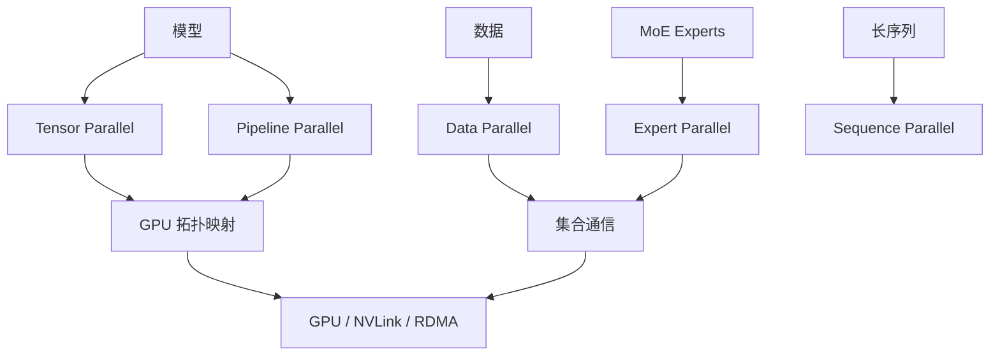

# 第 17 章：分布式并行

## 本章回答的问题

- Data Parallel、Tensor Parallel、Pipeline Parallel、Expert Parallel、Sequence Parallel 和 Hybrid Parallel 分别解决什么问题？
- 并行策略如何映射到 GPU 拓扑、NVLink、RDMA 和调度？
- 为什么并行策略是模型训练和推理容量规划的核心？

## 一个真实场景

一个模型在 8 卡节点内训练效率很好，扩展到 64 卡后吞吐没有线性提升。排查发现 tensor parallel 跨越了节点，频繁走 RDMA；pipeline stage 切分不均，部分 GPU 等待；data parallel all_reduce 在某些 step 形成通信高峰。并行策略没有按拓扑映射，硬件能力被浪费。

分布式并行不是“GPU 越多越快”。它是把模型、数据和计算映射到物理拓扑的工程问题。

## 核心概念

分布式并行把训练或推理任务拆到多个设备上。拆分维度包括数据、参数、层、专家、序列和优化器状态。不同并行方式节省的资源不同，引入的通信也不同。

AI Factory 要把并行策略和调度系统连接起来。调度器需要知道任务需要多少 GPU、是否要求同节点、是否需要 NVLink、是否跨节点 RDMA，以及是否需要 gang scheduling。

## 系统架构



并行策略最终都要落到通信和拓扑上。

## 17.1 Data Parallel

Data Parallel 把同一模型复制到多个 GPU，每个 GPU 处理不同数据 batch，然后同步梯度。它实现简单，适合模型能放入单个并行单元的场景。

Data Parallel 的主要通信是梯度 AllReduce 或类似同步。随着 GPU 数增加，通信成本上升。优化方式包括梯度分桶、通信计算重叠和更高效网络。

## 17.2 Tensor Parallel

Tensor Parallel 把单层中的矩阵计算拆到多个 GPU。它适合单个模型层太大，无法高效放在单 GPU 上的场景。它通常要求高带宽低延迟通信，因此更适合节点内 NVLink/NVSwitch。

Tensor Parallel 跨节点会显著依赖 RDMA 网络。若调度器把 tensor parallel group 放在拓扑距离较远的 GPU 上，性能可能明显下降。

## 17.3 Pipeline Parallel

Pipeline Parallel 把模型层切成多个 stage，不同 GPU 负责不同层。数据以 micro-batch 方式流水线通过各 stage。它适合层数多、模型整体过大的场景。

Pipeline 的问题是 bubble 和负载不均。若 stage 切分不均，某些 GPU 忙，某些 GPU 等。模型结构、层耗时和 micro-batch 数都会影响效率。

## 17.4 Expert Parallel

Expert Parallel 常用于 MoE 模型，把不同 expert 分布到不同 GPU。每个 token 根据路由进入部分 expert。它能扩展总参数量，但引入 token dispatch 和 expert 负载均衡问题。

Expert Parallel 对通信和负载分布敏感。某些 expert 过热会导致尾延迟和训练不均衡。监控应包括 expert token 分布、dispatch 时间和跨节点通信。

## 17.5 Sequence Parallel

Sequence Parallel 把序列维度拆分到多个设备，常用于长上下文或与 tensor parallel 结合降低激活显存。它可以缓解长序列训练的显存压力，但增加通信和实现复杂度。

Sequence Parallel 的收益依赖模型结构、序列长度和框架支持。应用长上下文需求会向下推动这类并行策略。

## 17.6 Hybrid Parallel

Hybrid Parallel 组合多种并行方式，例如 data + tensor + pipeline + sequence。大模型训练通常需要混合并行。混合并行的难点是配置空间大、通信复杂、故障排查困难。

平台需要把并行配置模板化。用户不应每次从头配置所有维度。针对模型规模和集群拓扑，平台可以提供经过验证的推荐配置。

## 17.7 并行策略如何映射到 GPU 拓扑

并行策略必须映射到物理拓扑。通常希望高频通信的组放在节点内 NVLink/NVSwitch，低频或可扩展通信放到跨节点 RDMA。Tensor parallel 往往更偏节点内，data parallel 可以跨节点，pipeline stage 切分要考虑节点边界和带宽。

调度系统需要拓扑感知。只知道“需要 64 张 GPU”不够，还要知道这些 GPU 如何分组、哪些必须同节点、哪些需要同 rail、哪些可以跨机架。否则训练效率会被拓扑随机性吞掉。

## 工程实现

并行配置示例：

```yaml
parallelism:
  tensor_parallel_size: 8
  pipeline_parallel_size: 4
  data_parallel_size: 16
  sequence_parallel: true
placement:
  tensor_group: same_node
  pipeline_group: same_rack_preferred
  data_parallel: cross_node
```

这类配置应被训练框架和调度系统共同理解。

## 常见故障

- Tensor parallel group 跨节点，通信延迟高。
- Pipeline stage 切分不均，GPU 利用率不平衡。
- Data parallel all_reduce 成为瓶颈。
- MoE expert 负载不均，尾延迟高。
- 调度器不理解拓扑，作业每次启动性能不同。

## 性能指标

- 每种并行组的通信时间和带宽。
- GPU 利用率分布、stage idle time、pipeline bubble。
- AllReduce/AllGather/ReduceScatter 耗时。
- Expert token 分布和 dispatch 耗时。
- Step time、tokens/s、扩展效率。

## 设计取舍

并行策略是在显存、计算、通信和实现复杂度之间取舍。更复杂并行能训练更大模型，但调试和调度更难。最优策略依赖模型规模、序列长度、GPU 拓扑和网络能力。AI Factory 应沉淀标准配置，而不是让每个训练任务临场调参。

## 小结

- 分布式并行是把模型和数据映射到多 GPU 的方法集合。
- 高频通信应尽量贴近高带宽拓扑，如 NVLink/NVSwitch。
- 混合并行是大模型训练常态，但需要模板化和拓扑感知调度。
- 并行策略直接影响训练效率、推理延迟和资源需求。

## 延伸阅读

- TODO: Megatron-LM 并行论文和文档
- TODO: PyTorch Distributed 文档
- TODO: 大规模训练拓扑映射案例
