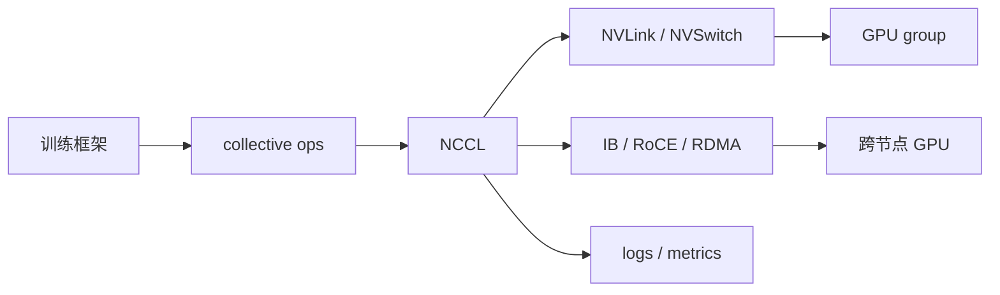

# 第 18 章：通信原语

## 本章回答的问题

- AllReduce、AllGather、ReduceScatter、Broadcast 和 P2P 分别解决什么通信问题？
- NCCL 如何把训练框架的通信请求映射到 GPU、NVLink 和 IB/RoCE？
- 通信瓶颈如何观察、定位和优化？

## 一个真实场景

训练任务 step time 突然升高，GPU 利用率周期性下降。模型代码没有变化，数据读取也正常。进一步查看 NCCL 日志和网络 telemetry，发现某条 IB 链路错误增加，AllReduce 带宽下降。应用层看到的是训练慢，真正瓶颈在集合通信路径。

通信原语是分布式训练的血管。模型越大、GPU 越多、并行越复杂，通信越可能成为瓶颈。

## 核心概念

通信原语是分布式系统中常见的数据交换模式。训练框架用它们同步梯度、分发参数、聚合激活或移动专家 token。NCCL 是 NVIDIA GPU 生态中常用的集合通信库，负责在 GPU 间高效执行这些操作。

理解通信原语，有助于把训练性能问题拆成计算、通信、存储和调度问题，而不是把所有慢都归因于模型代码。

## 系统架构



训练框架表达通信语义，NCCL 选择算法和路径，底层网络提供带宽和延迟。

## 18.1 AllReduce

AllReduce 对多个进程的数据做规约，并把结果分发回所有进程。Data Parallel 中梯度同步常用 AllReduce。它的性能直接影响大规模训练扩展效率。

AllReduce 对带宽和拓扑敏感。GPU 数增加后，通信开销可能超过计算收益。优化包括通信计算重叠、梯度分桶、拓扑优化和更高带宽网络。

## 18.2 AllGather

AllGather 从所有进程收集数据，并让每个进程都得到完整结果。FSDP、ZeRO 和 tensor parallel 中经常出现 AllGather，用于恢复参数或激活片段。

AllGather 会增加内存压力，因为每个参与者最终拥有聚合后的数据。平台排查 OOM 时，不应只看模型参数，还要看通信过程中的临时 buffer。

## 18.3 ReduceScatter

ReduceScatter 先对数据做规约，再把结果分片分发给不同进程。它常与 AllGather 配合，用于分片训练和优化器状态管理。

ReduceScatter 有助于降低单进程持有的数据量，但增加通信模式复杂度。性能问题需要结合框架配置和 NCCL trace 分析。

## 18.4 Broadcast

Broadcast 从一个进程向其他进程分发数据。训练初始化、参数同步、配置分发和 checkpoint 恢复中都可能使用 broadcast。

Broadcast 的风险在于源节点成为瓶颈或单点。大规模场景下应依赖高效树形或环形算法，而不是应用层手写逐个发送。

## 18.5 P2P

P2P 即点对点通信。Pipeline parallel 的相邻 stage、MoE token dispatch 或自定义并行策略可能使用 P2P。它比 collective 更灵活，但也更要求开发者理解通信顺序和死锁风险。

P2P 问题常表现为 hang。一个进程等待接收，另一个进程没有发送，整个训练任务就会卡住。框架和日志必须能定位到哪个 rank、哪个 step 和哪个 op。

## 18.6 NCCL

NCCL 提供 GPU 集合通信实现，支持多 GPU、多节点和多网络路径。它会根据拓扑、设备和环境变量选择通信算法。NCCL 对驱动、CUDA、网络、容器权限和拓扑配置敏感。

生产中应保存 NCCL 版本、环境变量、拓扑信息和关键日志。NCCL 问题经常不是库本身，而是 RDMA 配置、网卡选择、容器设备注入、DNS/主机名或防火墙问题。

## 18.7 NVLink 与 IB/RoCE

NVLink/NVSwitch 主要解决节点内 GPU 间高速通信。IB/RoCE 主要解决跨节点通信。并行策略应尽量把高频通信放在节点内，把可扩展通信放在跨节点网络上。

RoCE 对以太网配置要求高，例如 PFC、ECN、MTU 和拥塞控制。IB 通常提供更完整的 HPC 网络能力，但也需要严谨的 fabric 管理。无论哪种网络，链路错误、降速和拥塞都会影响 NCCL。

## 18.8 通信瓶颈分析

通信瓶颈分析要从 step time 分解开始。先判断计算、数据读取、通信和 checkpoint 哪个占比异常，再看具体 collective op。NCCL test 可以验证基础通信能力，但真实训练还要看框架通信模式。

常见工具包括 NCCL 日志、NCCL test、网络 telemetry、GPU metrics、框架 profiler 和训练 step trace。排障时应把 rank、节点、GPU、NIC、交换机端口和拓扑关联起来。

## 工程实现

训练任务应记录通信环境：

```yaml
communication:
  backend: nccl
  nccl_version: pinned
  network: rdma
  interfaces: [configured_by_platform]
  topology:
    tensor_parallel: same_node
    data_parallel: cross_node
  diagnostics:
    nccl_debug_on_failure: true
```

失败时自动收集 NCCL 日志和网络状态，能显著降低排障成本。

## 常见故障

- NCCL 选择了错误网卡或回退到低性能路径。
- 容器内缺少 RDMA 设备或权限。
- RoCE 配置不完整，丢包导致通信抖动。
- 某条链路降速，只有跨特定节点训练慢。
- P2P 顺序不一致导致 hang。
- AllGather 临时 buffer 导致 OOM。

## 性能指标

- Collective op 耗时：AllReduce、AllGather、ReduceScatter。
- 通信带宽：节点内、跨节点、跨机架。
- 通信占 step time 比例。
- NCCL 错误、重试、hang 次数。
- 网络：丢包、拥塞、链路错误、端口带宽。

## 设计取舍

通信优化可以从模型并行、拓扑调度、网络建设和框架配置四个方向入手。更强网络降低通信瓶颈但成本高；更复杂并行减少显存压力但增加通信；更频繁 overlap 提高效率但调试更难。优化前必须先量化瓶颈。

## 小结

- Collective communication 是分布式训练性能的核心路径。
- NCCL 把框架通信语义映射到 GPU 和网络拓扑。
- NVLink/NVSwitch 和 IB/RoCE 分别支撑节点内与跨节点通信。
- 通信排障需要把训练 step、rank、GPU、NIC 和网络 telemetry 关联起来。

## 延伸阅读

- TODO: NCCL 官方文档
- TODO: NCCL tests 文档
- TODO: RDMA / RoCE 网络调优资料
