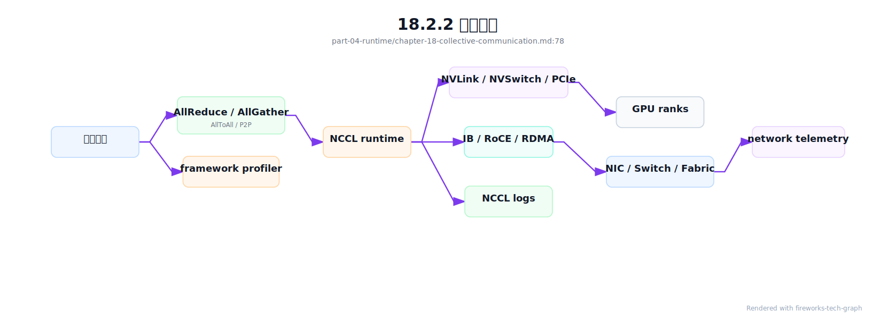
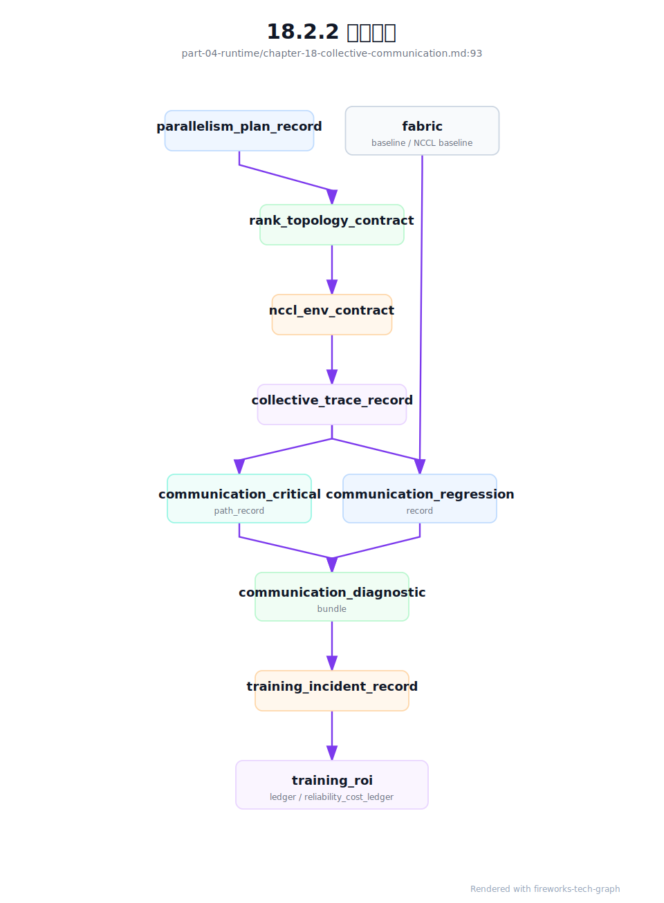

# 第 18 章：通信原语

## 18.1 导读

### 18.1.1 本章回答的问题

- AllReduce、AllGather、ReduceScatter、Broadcast 和 P2P 分别解决什么通信问题？
- NCCL 如何把训练框架的通信请求映射到 GPU、NVLink 和 IB/RoCE？
- 通信瓶颈如何观察、定位和优化？


### 18.1.2 本章上下文

- 层级定位：本章属于 `AI Runtime 层`，重点讨论推理引擎、训练框架、并行、通信和 GPU 软件栈。
- 前置依赖：建议先理解 第 17 章：分布式并行 中的核心对象和路径。
- 后续关联：本章内容会继续连接到 第 19 章：CUDA、驱动与 GPU 软件栈，并在系统地图、深度标准和读者测试中被交叉引用。
- 读完能力：读完本章后，读者应能把《通信原语》中的概念映射到 AI Factory 的生产路径、工程对象、观测证据和设计取舍。


### 18.1.3 读者测试

- 机制题：读者能否解释 AllReduce、AllGather、ReduceScatter、Broadcast 的核心机制，以及它们如何共同支撑《通信原语》？
- 边界题：读者能否区分 框架、引擎、CUDA/NCCL、container runtime、driver 和硬件拓扑 的责任边界，并说明哪些问题不能简单归因到本章组件？
- 路径题：读者能否从框架调用追到推理/训练 runtime、CUDA、NCCL、通信、GPU/HBM 和版本矩阵，并指出本章对象在路径中的位置？
- 排障题：当《通信原语》相关生产症状出现时，读者能否列出第一层证据、下一跳证据、可能 owner 和止血动作？


### 18.1.4 一个真实场景

一个 128 卡训练任务在前几天运行稳定，某天开始 step time 周期性升高。模型代码、数据版本和训练参数都没有变化，GPU utilization 也不是一直低，而是呈现“计算一段、等待一段”的锯齿形。应用团队先怀疑 PyTorch 版本和数据加载，平台团队检查 DataLoader 后没有发现异常。进一步打开框架 profiler 和 NCCL 日志，发现 AllReduce 带宽在部分 step 明显下降，关联到的 rank 都经过同一组交换机端口。

网络 telemetry 显示，这些端口的错误计数和重传增加。对应用层来说，症状是训练变慢；对 Runtime 层来说，是 collective communication 无法稳定完成；对基础设施层来说，是链路质量下降或拥塞控制异常。这个场景说明，通信原语不是分布式训练的底层细节，而是连接模型框架、GPU 拓扑和网络健康的关键路径。没有通信视角，训练性能问题很容易被误判。

本章的重点不是记住每个原语的定义，而是理解它们在训练系统中搬运什么数据、何时发生、消耗哪类链路、产生什么临时内存，以及如何被观测。AllReduce、AllGather、ReduceScatter、Broadcast 和 P2P 的语义不同，故障表现也不同。把通信原语讲清楚，才能把“训练慢”拆成可诊断的问题。

更重要的是，通信问题通常跨团队边界。模型团队看到 loss 和 step time，Runtime 团队看到 profiler，平台团队看到 Pod 和 rank，网络团队看到端口和链路。若没有共同语言，各方会用自己的指标解释同一个现象。通信原语正是这套共同语言：它把训练框架中的一次等待，翻译成具体的数据交换、参与 rank、网络路径和可能的故障域。

所以，本章会把每个原语都放回工程现场：它什么时候出现，慢了会怎样，错了如何定位。


## 18.2 基础模型

### 18.2.1 核心概念

通信原语是分布式程序中常见的数据交换模式。训练框架用它们同步梯度、聚合参数、分发状态、移动 activation、传递 Pipeline micro-batch 或 dispatch MoE token。Collective communication 指多个 rank 共同参与的通信，例如 AllReduce、AllGather、ReduceScatter 和 Broadcast；P2P 则是 rank 之间点对点发送和接收。二者共同构成分布式训练的数据通路。

NCCL 是 NVIDIA GPU 生态中常用的集合通信库，它负责在多 GPU、多节点、多网络路径中执行这些通信。训练框架表达“我要对这些 rank 做 AllReduce”，NCCL 根据拓扑、算法、协议和环境变量选择具体路径。底层可能走 NVLink、NVSwitch、PCIe、InfiniBand、RoCE 或主机网络。上层看到的是一个通信 op，底层实际涉及 GPU、NIC、交换机、驱动、容器权限和网络配置。

理解通信原语能帮助工程师区分计算瓶颈和通信瓶颈。GPU utilization 低不一定是模型小，也可能是 rank 在等待通信；HBM OOM 不一定是参数太多，也可能是 AllGather 临时 buffer；NCCL hang 不一定是 NCCL bug，也可能是某个 rank 没有进入同一个 collective。通信原语是分布式训练的系统语言，掌握它才能进行可靠排障。

还要理解同步语义。大多数 collective 要求参与 rank 以一致顺序进入通信，否则就可能等待或挂起。分布式训练中，一个 rank 的异常分支、一个数据 shard 的特殊样本、一次未处理的 OOM，都可能让其他 rank 看起来像 NCCL hang。很多通信故障的根源并不在网络，而在多 rank 控制流不一致。

这也是为什么通信排障必须同时看应用日志和网络指标。

单看任何一侧，都只能得到片面结论。

诊断入口应从 op 语义开始。

先知道在交换什么数据，才知道该查哪条路径。


### 18.2.2 系统架构

通信路径可以分成四层。第一层是训练框架，例如 PyTorch、DeepSpeed、Megatron-LM 或 FSDP，它们决定何时发起通信。第二层是通信库，通常是 NCCL，它把 collective 或 P2P 请求转成具体算法。第三层是节点和网络拓扑，包括 GPU 间 NVLink/NVSwitch、PCIe、NIC、IB/RoCE fabric。第四层是观测与诊断，包括 NCCL 日志、框架 profiler、DCGM、网络 telemetry 和交换机端口指标。

这四层必须关联起来。框架 trace 能告诉我们哪个 op 慢，但不一定知道哪条链路异常；网络 telemetry 能看到端口错误，但不一定知道影响了哪个训练任务；调度系统知道 rank 在哪些节点，却不一定知道这些 rank 属于哪个通信组。成熟平台要把 rank、GPU、NIC、端口、collective op 和训练 step 串起来，形成一条可追踪路径。

架构上还要区分基准测试和真实训练。NCCL tests 可以验证基础通信能力，但真实训练中的通信会受到 batch、并行策略、overlap、checkpoint、数据加载和慢 rank 影响。基础测试通过，只说明链路具备某种能力；真实训练稳定，还要求通信模式和拓扑匹配。AI Factory 需要两类证据：准入时的通信基线，以及运行时的任务级通信指标。

因此，通信架构不能只依赖单点工具。Profiler、NCCL 日志、DCGM、交换机 telemetry、Kubernetes 事件和调度记录都只看到一部分事实。平台应提供统一视图：某个 step 中哪个 op 最慢，涉及哪些 rank，rank 在哪些节点和 GPU 上，经过哪些 NIC 和端口，历史上这些链路是否退化。这个视图决定通信排障能否从经验判断走向证据链。

统一视图还应保留时间关系，避免把同时发生的事件误判为因果。

时间线是通信诊断的基本数据结构。

没有时间线，就没有因果分析。



生产诊断需要把通信证据拆成四类：配置契约、运行 trace、回归记录和关键路径影响。配置契约证明任务“应该怎样通信”，运行 trace 证明任务“实际怎样通信”，回归记录证明变更前后是否等价，关键路径影响证明慢通信是否真的浪费 GPU。四类证据缺一，排障就容易滑向猜测：只有配置不知道真实路径，只有 trace 不知道是否偏离预期，只有 benchmark 不知道是否影响训练，只有成本数字不知道根因在哪一层。



这张图强调，NCCL 不是孤立库。它承接并行计划和拓扑契约，依赖容器、RDMA、fabric 和调度事实，最终影响训练进度和经济账本。平台若只保存 NCCL 日志，会丢失上游意图；若只保存 topology，会丢失真实 op；若只看成本，会丢失技术根因。因此通信章节的核心，是把这些事实串成同一条证据链。

通信诊断还要覆盖 checkpoint overlap。很多训练 step spike 并不是 collective 本身退化，而是 checkpoint 写入、manifest commit、对象存储限流或 metadata hotspot 与 collective 暴露在同一个时间窗口。平台应生成 `checkpoint_overlap_evidence`，区分“通信慢导致 checkpoint 慢”“checkpoint 抢占网络/存储导致通信慢”和“二者同时受底层 fabric 影响”：

```yaml
checkpoint_overlap_evidence:
  evidence_id: coe-exp-20260620-step120000
  training_job: exp-20260620-031
  window:
    start_step: 119980
    end_step: 120020
    checkpoint_id: ckpt-step-120000
  communication:
    collective_trace_record: ctr-exp-20260620-120000
    exposed_collective_wait_ms: measured
    affected_ops: [all_reduce, reduce_scatter]
  checkpoint:
    checkpoint_commit_record: ckpt-step-120000
    write_duration_ms: measured
    manifest_commit_ms: measured
    slow_ranks: recorded
  storage_and_network:
    storage_evidence: storage-ev-20260620-017
    network_path_evidence: optional
    congestion_event_record: optional
  verdict:
    overlap_detected: true
    likely_cause: checkpoint_write_competes_with_collective_or_storage_backpressure
    gpu_idle_seconds: calculated
    recommended_action: stagger_checkpoint_or_isolate_path_or_fix_storage
```

这个对象能防止错误投资。若 spike 来自 checkpoint 与 collective 叠加，盲目升级 NCCL 或增加 GPU 不能解决问题；更有效的动作可能是错峰 checkpoint、改写入格式、限制并发、隔离存储路径、优化 manifest commit 或调整 checkpoint interval。它也能把周期性 step spike 转成 `training_roi_ledger` 中的 wasted GPU hours，而不是让它隐藏在平均 step time 里。


## 18.3 关键技术

### 18.3.1 AllReduce

AllReduce 对多个 rank 的张量进行规约，并把规约结果返回给所有 rank。Data Parallel 中最典型的用途是梯度同步：每个 rank 处理不同数据，得到本地梯度，然后通过 AllReduce 求和或平均，使所有模型副本保持一致。它的语义简单，但在大规模训练中往往是最重要的通信成本之一。

AllReduce 对带宽、拓扑和重叠能力敏感。GPU 数增加后，每个 rank 需要参与更多通信，通信时间可能抵消并行计算收益。框架通常会使用 bucket，把多个梯度合并后通信，并尝试与 backward 计算重叠。若 bucket 配置不合适，或某些 rank 计算慢，通信重叠效果会变差，AllReduce 就会暴露在 step time 的关键路径上。

排查 AllReduce 瓶颈时，应先看通信占 step time 的比例、不同 rank 的等待时间、有效带宽和慢节点分布。如果只有跨特定节点的 AllReduce 慢，问题可能在网络链路或拓扑放置；如果所有 rank 都慢，可能是并行规模过大、bucket 过小或网络整体拥塞。AllReduce 的优化不能脱离训练语义，因为改变 global batch、gradient accumulation 或同步频率会影响收敛。

AllReduce 还常用于评估扩展边界。随着 Data Parallel 规模增加，理想情况是计算增加带来吞吐提升，通信只占较小比例；现实中，慢 rank、网络拥塞和同步频率会让边际收益下降。平台应把 AllReduce 时间随 GPU 数增长的曲线作为容量规划依据。若某类模型在固定网络下扩展效率很快下降，就应考虑更强网络、更大 batch、梯度累积、分片策略或不同并行组合。

AllReduce 是扩容收益递减最常见的观察窗口之一。

它也最容易暴露慢 rank 对整体训练的影响。

同步训练会被最慢参与者限制。


### 18.3.2 AllGather

AllGather 从所有 rank 收集数据，并让每个 rank 都获得完整数据。它常出现在 Tensor Parallel、FSDP、ZeRO 和参数分片场景中。例如某个 rank 只保存参数的一部分，在前向计算前需要通过 AllGather 临时恢复完整参数或某个计算所需的张量。与 AllReduce 不同，AllGather 的结果会让每个参与者持有聚合后的数据，因此会带来临时显存压力。

AllGather 的风险经常被低估。模型参数本身可能已经被分片，静态显存看起来足够，但通信过程中需要额外 buffer，导致 HBM 峰值超过预期。长序列、较大 hidden size 或较高 Tensor Parallel size 下，这种临时内存更明显。排查 OOM 时，如果只看参数、optimizer state 和 activation，而忽略通信 buffer，就会漏掉一类真实原因。

性能上，AllGather 既受网络带宽影响，也受调用频率影响。FSDP wrap 策略过细，可能导致频繁 gather；bucket 太大，可能提高临时显存；跨节点 gather 又会放大延迟。平台应记录 AllGather 次数、耗时、传输量和 HBM 峰值，并把它们与 FSDP、ZeRO 或 Tensor Parallel 配置关联起来。这样才能判断是通信库问题，还是分片策略本身不适合当前模型和拓扑。

AllGather 的优化通常不是单纯“让网络更快”。可以调整 wrap 粒度、prefetch、bucket、并行组放置和 checkpoint 策略，也可以改变模型切分方式。每种优化都可能在显存、吞吐和复杂度之间转移成本。平台在给出推荐模板时，应明确 AllGather 可能产生的临时内存峰值，并在 OOM 报告中标出通信 buffer，而不是只显示静态模型占用。

否则团队会把通信内存误判为模型参数过大。

这会导致错误地缩小模型，而不是修正分片策略。

正确归因能避免无效优化。


### 18.3.3 ReduceScatter

ReduceScatter 先对多个 rank 的数据做规约，再把规约结果按分片分发给不同 rank。它常与 AllGather 配合使用，尤其是在分片训练中。直观理解是：AllReduce 可以拆成 ReduceScatter 加 AllGather。对于 ZeRO、FSDP 和某些并行策略，ReduceScatter 能在同步梯度的同时减少每个 rank 最终持有的数据量。

ReduceScatter 的价值在于降低单 rank 状态压力。传统 Data Parallel 中，每个 rank 最终得到完整梯度；分片策略下，每个 rank 只需要负责一部分参数或优化器状态，对应的规约结果也可以分片保存。这样可以降低 HBM 占用，并为更大模型训练腾出空间。但它不是免费优化，因为通信模式更复杂，对 rank 分组、bucket 和框架实现更敏感。

排障时，ReduceScatter 常与 optimizer step、ZeRO stage 和 FSDP sharding strategy 纠缠在一起。训练慢可能不是单个 op 慢，而是 ReduceScatter、参数 AllGather 和 optimizer 更新之间没有良好重叠。平台应把这些 op 放在同一个 step timeline 中观察，而不是孤立看 NCCL test 带宽。对生产训练而言，ReduceScatter 是否有效，最终要看显存峰值、step time 和恢复复杂度的综合结果。

ReduceScatter 也影响 checkpoint 和恢复。分片后的状态如果按 rank 保存，恢复时就要保证 rank、world size 或转换流程符合预期。否则训练能跑，故障后却不能恢复，或者导出模型时需要额外合并步骤。平台设计分片训练模板时，应同时设计状态保存格式、恢复测试和发布权重转换流程。通信原语在这里直接影响模型生命周期。

这让 ReduceScatter 不只是性能优化，也是一种状态管理策略。

因此它必须进入 checkpoint 设计评审。

否则恢复流程会滞后于训练策略。

这类滞后往往在事故恢复时才暴露。

因此要提前演练恢复。


### 18.3.4 Broadcast

Broadcast 从一个 root rank 向其他 rank 分发数据。训练初始化、模型参数同步、配置分发、随机种子同步和 checkpoint 恢复中都可能使用它。Broadcast 的语义看似简单，但在大规模系统中，root rank、网络路径和数据大小都会影响启动时间和恢复时间。训练任务卡在初始化阶段时，Broadcast 是需要重点检查的通信类型之一。

Broadcast 的风险是源端和拓扑路径成为瓶颈。如果应用层手工实现逐个 rank 发送，root rank 会形成单点压力；成熟通信库通常会选择树形、环形或其他算法分发数据。即便使用 NCCL，root rank 所在节点、跨机架路径和网络拥塞仍会影响性能。对于大模型 checkpoint 恢复，若大量参数从一个 rank 或一个存储位置集中广播，启动时间可能明显增加。

工程上，应把 Broadcast 与初始化和恢复流程一起分析。任务启动慢不一定是容器慢，也可能是参数同步、进程组初始化或 checkpoint 状态广播慢。平台可以记录 broadcast 数据量、root rank、耗时和参与 rank 数。若某些任务反复在初始化阶段超时，应检查 root rank 所在节点、网络路径、checkpoint 读取和 rank 是否全部按预期进入通信。

Broadcast 的可靠性还和启动编排有关。若部分 rank 已经进入 broadcast，其他 rank 因镜像拉取、数据挂载或环境自检延迟未到达，先到的 rank 会等待。大规模训练中，启动时钟不一致会放大成通信超时。平台应把容器启动、进程组初始化和第一次通信放在同一条时间线上，而不是把它们分散到不同日志中。

这样才能判断启动慢发生在运行时之前还是通信阶段。

启动超时应有可归因的阶段标签。


### 18.3.5 P2P

P2P 即 point-to-point communication，指两个 rank 之间直接发送和接收数据。Pipeline Parallel 的相邻 stage、MoE token dispatch、自定义并行策略和某些推理分片都可能使用 P2P。与 collective 相比，P2P 更灵活，能表达不规则通信模式；但它也更容易出现顺序错误、死锁和局部热点。

P2P 故障常表现为 hang。一个 rank 等待接收，另一个 rank 没有发送，或发送顺序与接收顺序不一致，整个训练可能卡住。Collective 通常要求所有参与 rank 以相同顺序进入 op，P2P 则要求开发者或框架正确管理每一对 send/recv。复杂 Pipeline、MoE 或自定义调度中，P2P 的正确性和可观测性非常重要。

排查 P2P 问题时，要定位 rank 对、step、message size 和调用顺序。只看到“训练挂住”没有足够信息。平台应收集超时 rank、最后一个通信 op、相邻 stage 或 expert group 映射，并在必要时启用更详细的 debug 日志。性能优化上，P2P 要避免跨越低带宽链路，也要避免某些 rank 成为流量汇聚点。P2P 是灵活性的来源，也是复杂性的来源。

P2P 的设计还要考虑背压。Pipeline stage 如果下游处理慢，上游发送会堆积或等待；MoE dispatch 如果某些 expert 过热，相关 rank 会成为流量热点。此时平均带宽并不能说明问题，队列长度、等待时间和尾部 rank 更重要。平台应把 P2P 与具体并行结构绑定展示，否则很难判断是哪一对 rank、哪一段流水或哪组 expert 造成瓶颈。

P2P 的诊断粒度必须细到 rank pair。

否则只能看到全局 hang，看不到阻塞边。

阻塞边是修复 P2P 的起点。

平台应把最后一次 send/recv 记录下来。

同时记录对应的 stage 或 expert 关系。

这能把通信阻塞映射回模型结构。

诊断才可行动。


### 18.3.6 NCCL

NCCL 是 GPU 集合通信的核心运行时之一，提供 AllReduce、AllGather、ReduceScatter、Broadcast 和 P2P 等能力。它会根据拓扑和配置选择算法、协议和网络接口。NCCL 的行为受 CUDA、driver、NCCL 版本、容器设备注入、RDMA 栈、网卡选择、DNS/主机名、环境变量和防火墙等因素影响。很多 NCCL 问题并不是库本身错误，而是运行环境不一致。

生产平台要把 NCCL 配置作为运行时基线管理。NCCL 版本、关键环境变量、网络接口选择、拓扑文件、debug 级别、timeout 策略都应可追溯。容器内看不到 RDMA 设备、选择了错误网卡、节点间主机名解析异常、RoCE 配置不完整，都可能表现为 NCCL 初始化失败、性能下降或 hang。排障时不能只让用户贴一段错误日志，而要自动收集环境和拓扑上下文。

更严格的做法是生成 `nccl_env_contract`。它定义一类训练模板允许哪些 NCCL 环境变量、接口选择、RDMA 设备、timeout、debug 和拓扑文件。用户可以覆盖部分参数，但覆盖必须进入审计，并触发对应回归。这个 contract 能防止“某个脚本临时加了 `NCCL_SOCKET_IFNAME`，后来所有任务都走错接口”这种隐性事故。

```yaml
nccl_env_contract:
  contract_id: nec-h100-rdma-20260620
  framework_runtime_matrix: frm-h100-train-20260620
  rank_topology_contract: rtc-llm-20260620-001
  allowed_backend: nccl
  required:
    nccl_version: pinned
    rdma_devices_visible_in_container: true
    gpu_nic_topology_evidence: required
    interface_selection_source: platform_generated
  env_policy:
    NCCL_DEBUG:
      default: WARN
      escalation_on_failure: INFO_or_TRACE_windowed
    NCCL_SOCKET_IFNAME:
      source: platform_template
      user_override: audited
    NCCL_IB_DISABLE:
      expected: "0"
      violation_action: reject_if_rdma_required
    topology_file:
      source: generated_from_inventory_if_used
      drift_action: invalidate_baseline
  timeout_policy:
    init_timeout: platform_default
    collective_timeout: platform_default
    hang_detection: step_progress_and_rank_heartbeat
  evidence:
    capture_on_start: [env_summary, interface_probe, rdma_device_probe]
    capture_on_failure: [nccl_logs, rank_state, port_counters, recent_changes]
```

`nccl_env_contract` 的重要性在于把“环境变量经验”变成“运行时边界”。很多 NCCL 事故并非网络突然坏掉，而是接口命名、容器设备、OFED、debug 参数或拓扑文件发生了漂移。Contract 让这些漂移能被检测，并让变更评审知道哪些 baseline 需要失效重跑。它也能减少用户脚本中的神秘参数，把 NCCL 默认值收敛到平台模板中。

NCCL tests 是准入和诊断的重要工具，但它不等于真实训练性能。Tests 可以验证某种消息大小和 rank 数下的带宽，真实训练会有不同 op 混合、计算通信重叠、慢 rank 和框架调度。平台应同时保存 NCCL baseline 和真实任务的 NCCL 观测。前者判断基础设施是否健康，后者判断训练策略是否合理。两者结合，才能避免把所有问题都归因于网络或框架。

NCCL 版本治理也很关键。升级 NCCL 可能改善某些拓扑或算法，也可能改变默认接口选择、timeout 行为或性能特征。AI Factory 应把 NCCL 升级纳入 Runtime 基线，而不是让用户镜像随意漂移。灰度升级时，应同时跑 NCCL tests、代表性训练任务和失败恢复测试，并保留回滚路径。

通信库升级应按基础设施变更处理。

它影响的是整条训练数据通路。

升级前后必须保留可对比基线。


### 18.3.7 NVLink 与 IB/RoCE

NVLink 和 NVSwitch 主要支撑节点内或 scale-up 域内 GPU 间高速通信，适合 Tensor Parallel、部分 Pipeline stage 和高频 activation/parameter exchange。InfiniBand 和 RoCE 主要支撑跨节点 scale-out 通信，适合 Data Parallel、跨节点 Pipeline、分布式 checkpoint 和更大规模训练。二者不是互相替代，而是服务不同距离和通信模式。

并行策略应尽量让高频、低延迟通信贴近 NVLink/NVSwitch，把可扩展、可重叠或低频通信放到跨节点网络。若 Tensor Parallel group 跨节点，性能会更依赖 RDMA；若 Data Parallel 全部局限在少数节点，可能影响资源利用和故障域分布。平台调度需要理解这些差异，否则硬件拓扑优势无法转化为训练吞吐。

RoCE 对以太网配置要求高，例如 PFC、ECN、MTU、队列、拥塞控制和交换机缓冲；InfiniBand 通常提供更完整的 HPC fabric 能力，但也需要 subnet manager、链路健康和拓扑管理。无论使用哪种网络，端口错误、链路降速、拥塞和不对称路径都会影响 NCCL。AI Factory 的网络验收不能只看 ping 或普通 TCP 带宽，必须验证 GPU 到 GPU 的真实通信路径。

拓扑选择还受成本和规模影响。节点内互联越强，单机或 scale-up 域内并行越高效；跨节点网络越强，大规模 Data Parallel 和混合并行越稳定。平台不能把网络能力抽象成一个“带宽数字”，而要知道哪些通信走节点内、哪些走跨节点、哪些会跨机架。只有这样，模型并行策略和网络投资才能相互校准。

网络设计应服务 workload，而不是只追求纸面带宽。

同样带宽在不同拓扑下价值不同。

链路位置决定带宽能否被模型用上。

靠近高频通信组的带宽最有价值。

远端带宽无法弥补错误放置。

拓扑意识是通信效率的前提。


### 18.3.8 通信瓶颈分析

通信瓶颈分析应从 step timeline 开始。先把一次训练 step 拆成 data loading、forward、backward、communication、optimizer 和 checkpoint，再判断通信是否进入关键路径。若通信与计算充分重叠，即使通信耗时不短，也未必影响 step time；若通信暴露在关键路径上，哪怕单次 op 不大，也会拖慢整体。没有时间线，就容易把相关性误判为因果。

第二步是定位具体 op 和 rank group。AllReduce 慢、AllGather OOM、ReduceScatter 与 optimizer 不重叠、Broadcast 初始化慢、P2P 顺序错误，对应的排查路径不同。还要看慢是否集中在某些 rank、节点、NIC、交换机端口或机架。如果慢 rank 与特定物理路径重合，更可能是基础设施问题；如果所有 rank 都慢，更可能是策略、规模或全局网络拥塞。

第三步是用基线验证假设。可以运行 NCCL tests、检查网络 telemetry、查看 DCGM、对比历史任务、改变 placement 或降低并行度。每次实验只改变一个变量，才能判断根因。通信优化的常见方向包括拓扑感知调度、调整并行策略、增大或减小 bucket、改进 overlap、修复网络配置、隔离异常节点。目标不是让某个 benchmark 更好看，而是让真实训练稳定、可重复、可解释。

瓶颈分析还要避免平均值陷阱。平均 step time、平均带宽和平均 GPU utilization 都可能掩盖尾部 rank。同步训练中，最慢 rank 决定全局节奏；在线推理中，尾部延迟决定用户体验。通信 dashboard 应默认展示分位数、最大值和 rank skew，而不是只给平均值。排障时先找到“谁在等谁”，再讨论优化策略。

如果找不到等待关系，就说明 trace 还不够完整。

完整 trace 应覆盖计算、通信和调度放置。

三者缺一，定位都会失真。

通信瓶颈分析本质上是跨层关联。


## 18.4 工程落地

### 18.4.1 工程实现

工程实现应让训练任务自动记录通信环境。至少包括 backend、NCCL 版本、CUDA/driver 版本、关键 NCCL 环境变量、网络接口、RDMA 设备、rank 到 GPU/NIC 映射、并行组、collective metrics 和 debug 日志策略。没有这些信息，通信故障复盘会依赖人工记忆。平台应把它们写入作业元数据和运行报告。

示例配置如下：

```yaml
communication:
  backend: nccl
  nccl_version: pinned
  network: rdma
  interfaces: [configured_by_platform]
  topology:
    tensor_parallel: same_node
    data_parallel: cross_node
  diagnostics:
    collect_nccl_logs_on_failure: true
    record_rank_to_nic_mapping: true
```

运行中还应生成 `collective_trace_record`。它不是全量 profiler dump，而是对关键 step 窗口做结构化摘要：每类 collective 的耗时、消息大小、参与 rank、等待关系、是否处于 critical path、是否和计算重叠。这样排障系统可以在不依赖巨大 trace 文件的情况下做第一轮归因。

```yaml
collective_trace_record:
  trace_id: ctr-exp-20260620-031-window-84200
  training_job: exp-20260620-031
  parallelism_plan_record: ppr-llm-20260620-001
  placement_commit_record: pcr-exp-20260620-031
  nccl_env_contract: nec-h100-rdma-20260620
  window:
    start_step: 84200
    end_step: 84250
    trigger: step_time_p99_regression
  operations:
    - op: all_reduce
      group: data_parallel
      message_size_bucket: large
      duration_ms_p50: measured
      duration_ms_p99: measured
      exposed_on_critical_path: true
      slow_ranks: [17, 49, 81]
    - op: all_gather
      group: fsdp_param_gather
      message_size_bucket: medium
      hbm_temporary_buffer_peak: measured
      exposed_on_critical_path: false
  correlation:
    rank_mapping_ref: rank-mapping-exp-20260620-031
    rail_balance_report: rail-balance-exp-20260620-031
    fabric_baseline: fabric-h100-rail-20260619
```

这个记录能回答一个经常被忽略的问题：慢 op 是否真的导致慢 step。某些 AllGather 耗时很长，但被 backward 重叠，对端到端吞吐影响较小；某个 AllReduce 绝对耗时不算最大，却让大量 rank 等待，它才是关键路径。`collective_trace_record` 应和 `communication_critical_path_record` 配合使用，避免把全部优化资源投向最显眼但不是最关键的曲线。

通信故障发生时，平台应自动生成 communication diagnostic bundle。这个包不是把所有日志打包，而是围绕一次异常 step 或异常 op 收集最小充分证据：op、rank、节点、NIC、端口、NCCL 环境、网络错误、GPU 状态和最近变更。这样网络、Runtime 和训练团队可以围绕同一份证据排查。

```yaml
communication_diagnostic_bundle:
  incident_id: comm-20260619-001
  training_job: exp-20260619-001
  window:
    start: anomaly_start_time
    end: anomaly_end_time
  slow_ops:
    - op: all_reduce
      step: 84520
      ranks: [0, 17, 42]
      expected_ms: baseline
      observed_ms: measured
  topology:
    rank_mapping_ref: rank-mapping.json
    affected_nodes: [gpu-node-001, gpu-node-018]
    affected_nics: [mlx5_0]
    switch_ports: [leaf12/1, leaf12/18]
  runtime:
    nccl_version: pinned
    cuda_driver: recorded
    env: NCCL_DEBUG_and_interface_summary
    nccl_env_contract: nec-h100-rdma-20260620
  telemetry:
    rdma_errors: collected
    port_counters: collected
    dcgm_events: collected
    recent_changes: driver_or_network_changes
```

诊断包应在异常发生后尽快生成。很多网络计数器、容器日志和 profiler trace 保留时间有限，等事故复盘时再补采集，证据往往已经丢失。自动采集不意味着全量高噪声日志长期打开，而是在触发条件满足时提升采样并冻结窗口。

任务启动前应执行通信自检：确认容器能看到 GPU 和 RDMA 设备，NCCL 能选择正确接口，节点间主机名和端口可达，rank 数与调度结果一致。任务运行中应采集 op 级耗时、带宽、错误和超时。失败时自动打包 NCCL 日志、环境变量、拓扑、网络端口状态和最近的 step trace。工程目标是让通信问题从“玄学”变成可复现的诊断流程。

平台还应提供分级诊断。普通用户看到的是“通信初始化失败”“跨节点带宽低”“某个 rank 超时”等可行动结论；SRE 可以进入详细视图查看 NCCL 环境变量、接口选择、端口错误和 rank 映射。这样既避免把底层复杂度暴露给所有人，也保证事故时有足够证据深入排查。

实现还应有自动化采集边界。正常任务不应长期打开高噪声 debug；失败、超时或带宽低于基线时，再自动提升日志级别并保留现场。这样能控制日志成本，也能在事故时拿到足够证据。

此外，通信自检结果应进入节点准入和作业详情。节点刚加入集群、驱动或 RDMA 栈升级、交换机配置变更后，都应重新生成通信基线。作业运行时如果低于基线，平台应能区分是节点退化、拓扑不佳，还是训练策略本身造成的通信放大。

这些结果还应可导出，便于事故复盘和供应商协同。

平台还应建立通信基线库。基线库按 GPU 型号、节点内拓扑、rack、rail、NCCL 版本、消息大小和 rank 数记录测试结果。真实训练出现退化时，先与同条件基线比较，再判断是否进入网络、Runtime 或训练策略排查。基线库可以来自准入测试，也可以来自周期性巡检和代表性训练任务。

任何通信相关变更都应产出 `communication_regression_record`。它覆盖 NCCL、CUDA、driver、OFED、NIC firmware、交换机配置、GPU Operator、container runtime、CNI、调度标签、rank topology contract 和训练模板。记录的目标不是证明“某个 nccl-test 通过”，而是证明变更前后的真实训练关键路径没有不可接受回归。

```yaml
communication_regression_record:
  record_id: crr-20260620-004
  change:
    type: nccl_or_ofed_or_fabric_or_runtime
    change_record: fabric-or-runtime-change-id
    affected_resource_pools: [training-prod-h100]
  baselines:
    fabric_baseline_before: fabric-h100-rail-20260619
    fabric_baseline_after: fabric-h100-rail-20260620
    framework_runtime_matrix: frm-h100-train-20260620
    nccl_env_contract: nec-h100-rdma-20260620
  tests:
    nccl_tests_same_node: passed
    nccl_tests_cross_node: passed
    multi_rail_balance: passed_or_degraded
    representative_training_short_run: passed
    checkpoint_overlap_run: passed
  regression_budget:
    collective_bandwidth_delta: within_policy
    step_time_delta: within_policy
    rank_skew_delta: within_policy
    hang_or_timeout: none
  decision:
    promote: true_or_false
    rollback_required: false
    invalidated_baselines: []
```

这份记录能把第 32 章的 fabric 变更、第 38 章的验收、第 39 章的故障树和第 44 章的 PRR 接起来。若一次 NCCL 升级只跑了单节点测试，没有跑代表性训练和 checkpoint overlap，不能认为生产可用；若网络变更使 NCCL test 带宽略降但真实训练 step 不受影响，可以记录为可接受；若 NCCL test 通过但 rank skew 增大，应暂停放量。回归标准必须和 workload 绑定。

训练通信还经常被 checkpoint 干扰。Checkpoint 写入会占用存储、网络、CPU、PCIe、内存和调度线程，可能与 NCCL 或数据读取叠加，表现为周期性 step time spike。平台应保留 `checkpoint_overlap_evidence`，说明 checkpoint 是否与通信、数据加载和评测同时争用关键路径。

```yaml
checkpoint_overlap_evidence:
  evidence_id: coe-exp-20260620-031
  training_job: exp-20260620-031
  checkpoint_window:
    checkpoint_id: ckpt-84200
    start_step: 84190
    end_step: 84220
    mode: synchronous_or_async
  overlap:
    collective_ops_during_checkpoint: [all_reduce, reduce_scatter]
    storage_backend: parallel_fs_or_object_storage
    network_path_shared_with_training: true
    gpu_idle_due_to_checkpoint_ms: calculated
    communication_exposed_ms_delta: calculated
  verdict:
    checkpoint_interferes_with_collective: true_or_false
    recommended_action:
      - shift_checkpoint_window
      - throttle_checkpoint_io
      - separate_storage_network
      - tune_async_checkpoint
```

这个对象能防止把周期性通信抖动误判为 fabric 问题。若每次 checkpoint 前后通信变慢，且端口错误没有增加，根因可能是 I/O 与训练通信共享路径、rank 写入长尾或异步 checkpoint 回压。反过来，如果无 checkpoint 窗口也出现同类退化，才更应该进入 fabric、runtime 或 collective mismatch 分支。通信诊断必须把 checkpoint 作为一等变量。


### 18.4.2 常见故障

第一类故障是 NCCL 选择了错误路径。容器内网卡命名不同、环境变量缺失、RDMA 设备没有注入，可能让通信走低性能接口或直接失败。第二类故障是 RoCE/IB 网络异常，例如丢包、拥塞、链路降速、PFC/ECN 配置问题或交换机端口错误。它们常表现为训练间歇性变慢，而不是每次都失败。

第三类故障是 rank 不一致。某些 rank 没有进入同一个 collective，或进入顺序不同，会导致 hang。常见原因包括条件分支、异常处理不一致、数据 shard 触发不同代码路径、P2P send/recv 顺序错误。第四类故障是通信 buffer 导致 OOM，尤其是 AllGather 或大 bucket 场景。静态显存估算没有覆盖临时通信内存，就会低估风险。

第五类故障是拓扑和并行策略不匹配。高频通信跨越低带宽链路，或调度每次给出不同拓扑，导致性能波动。第六类故障是基准测试和真实训练不一致：NCCL test 通过，但真实训练由于慢 rank、checkpoint、数据加载或 op 混合而变慢。解决这些故障，需要把通信 op、rank、节点、NIC、交换机和训练 step 关联起来，而不是只看单点日志。

还有一类故障来自变更。驱动、NCCL、OFED、交换机配置、GPU Operator、容器 runtime 或内核升级后，通信路径可能改变。若平台没有版本基线和变更记录，排查会变成猜测。通信事故复盘应检查最近变更，并把恢复动作写回准入测试和升级流程，避免同类问题重复出现。

故障清单也应区分用户代码、Runtime 配置、网络和硬件，避免责任混淆。

分类清楚，后续改进才有 owner。

没有 owner 的故障会反复出现。

复盘结论要回写到模板和准入规则。

第七类故障是诊断窗口丢失。训练任务 hang 后被用户直接 kill，容器日志、NCCL debug、端口计数增量和 rank 状态全部消失，只剩一个失败退出码。平台应提供“保留现场”动作：暂停任务、冻结节点事件、采集诊断包、再决定重启或释放资源。昂贵训练任务不能把证据管理交给临时人工命令。


### 18.4.3 性能指标

通信指标要覆盖 op、rank、拓扑和业务四个层面。Op 层面包括 AllReduce、AllGather、ReduceScatter、Broadcast、P2P 的耗时、传输量和有效带宽；rank 层面包括慢 rank、等待时间、超时和错误；拓扑层面包括节点内带宽、跨节点带宽、端口错误、拥塞、重传和链路状态；业务层面包括通信占 step time 的比例、tokens/s、扩展效率和失败率。

不同指标回答不同问题。有效带宽低说明通信路径或算法可能有问题；rank skew 高说明某些 rank 拖慢整体；AllGather 期间 HBM 峰值高说明临时 buffer 可能引发 OOM；通信占比上升说明扩容收益正在下降。指标不能只在任务失败后收集，必须持续采样并保留历史基线。否则训练变慢时无法判断是网络退化、框架升级、模型变化还是调度放置变化。

指标口径也要固定。NCCL test 带宽、真实训练 op 带宽、端口物理带宽不是同一个概念；单节点 bandwidth 和跨节点 bandwidth 不能混用；平均耗时会掩盖尾部 rank。对外报告通信能力时，应标明 GPU 数、节点数、消息大小、拓扑范围、并行策略和测试工具。没有上下文的带宽数字不能指导工程决策。

通信指标还应和成本关联。更强网络、更低 oversubscription 和更复杂拓扑都会提高建设成本。平台需要知道通信瓶颈影响了多少 tokens/s、多少训练时长和多少 GPU 空转，才能判断是否值得投资。没有这层经济视角，通信优化容易停留在局部技术指标，而不能支撑 AI Factory 的容量决策。

最终指标要能回答：慢通信浪费了多少 GPU 时间。

这个问题直接连接性能优化和成本治理。

GPU 空转时间是最直观的成本信号。

通信指标还应有训练有效性口径。`comm_time_ms` 本身不说明问题，只有当它暴露在 critical path 上并造成 rank 等待时，才直接浪费 GPU。建议记录 `communication_exposed_ms`、`rank_wait_ms` 和 `gpu_idle_due_to_comm_hours`。这样网络优化可以和 GPU 成本直接关联，便于判断是否值得升级 fabric、调整拓扑或修改并行策略。

一份更可用的通信性能记录应把 op、等待关系和成本影响绑定在一起。注意这里不把端口吞吐直接等同于浪费，只有通信处在 step 的关键路径上、且其它 rank 被它阻塞时，才计入 exposed communication waste：

```yaml
communication_critical_path_record:
  training_job: train-20260620-017
  step_window:
    start_step: 84200
    end_step: 84300
  slow_operation:
    op: all_reduce
    bucket: grad_bucket_31
    message_size_bucket: large
    affected_ranks: [17, 49, 81]
  timing:
    op_duration_ms_p50: measured
    op_duration_ms_p99: measured
    rank_wait_ms_max: measured
    communication_exposed_ms: calculated
  topology:
    rank_mapping_ref: rank-mapping.json
    fabric_baseline_id: train-fabric-a-20260619
    rail_balance_report: rail-balance-20260620-017
  impact:
    gpu_idle_due_to_comm_hours: calculated
    step_time_delta_vs_baseline: calculated
    suspected_owner: network_or_runtime_or_placement
```

这个对象能防止两个误判。第一，某个 collective 总耗时很长，但被 backward 完全 overlap，它不是当前 step time 的主因；第二，某个端口出现拥塞计数，但没有对应 rank 等待，也不能直接归因为训练变慢。通信诊断要先证明等待关系，再讨论网络、runtime 或并行策略根因。这样才能把 NCCL profiler、rank timeline、fabric telemetry 和 Token Factory 成本账本接起来。


### 18.4.4 设计取舍

通信优化的第一个取舍是硬件投入与软件复杂度。更强网络和更好的 scale-up 拓扑可以降低通信瓶颈，但成本高、交付周期长；更复杂的并行策略、overlap 和 bucket 调优可以在现有硬件上提升效率，但会增加调试难度。平台需要基于真实 workload 判断瓶颈，而不是先假设一定要升级网络或一定能靠软件解决。

第二个取舍是吞吐与稳定性。为了追求吞吐，可以使用更激进的 overlap、更大的 bucket、更复杂的拓扑绑定，但这些策略可能增加 OOM、hang 或恢复难度。生产系统不能只优化最好一次 benchmark，而要优化长期稳定的 tokens/s。通信配置应通过灰度和回滚管理，尤其是 NCCL 版本、RDMA 栈和网络参数变更。

第三个取舍是抽象与透明。平台应向普通用户隐藏大部分 NCCL 细节，提供可用默认值；但对 SRE 和高级训练团队，必须暴露足够的 rank、op、拓扑和网络信息。完全透明会增加学习负担，完全封装会让排障无从下手。好的 AI Factory 会把默认路径做简单，把诊断路径做深入，让通信问题既不打扰日常使用，也能在事故时被精确定位。

最后是局部最优与系统最优的取舍。降低某个 op 的耗时不一定提高端到端吞吐，增大 bucket 可能改善带宽却增加显存，固定拓扑可能提升性能却降低调度弹性。通信优化应以完整训练任务为目标，而不是以单个 benchmark 为目标。系统工程的答案通常不是“最快”，而是“在当前成本、可靠性和维护能力下持续有效”。

通信层尤其如此，因为它连接了最昂贵的 GPU 和最复杂的网络。


## 18.5 小结与延伸阅读

### 18.5.1 小结

- Communication primitives 是分布式训练的关键路径，不是底层附属细节。
- AllReduce、AllGather、ReduceScatter、Broadcast 和 P2P 的语义、内存压力和故障模式不同。
- NCCL 问题通常跨越框架、容器、驱动、RDMA 和网络拓扑。
- 通信排障需要把 step、op、rank、GPU、NIC、交换机和历史基线关联起来。


### 18.5.2 延伸阅读

- [NCCL User Guide](https://docs.nvidia.com/deeplearning/nccl/user-guide/docs/)
- [NCCL tests repository](https://github.com/NVIDIA/nccl-tests)
- [NVIDIA RDMA Aware Networks Programming User Manual](https://docs.nvidia.com/networking/display/rdmaawareprogrammingv17)
