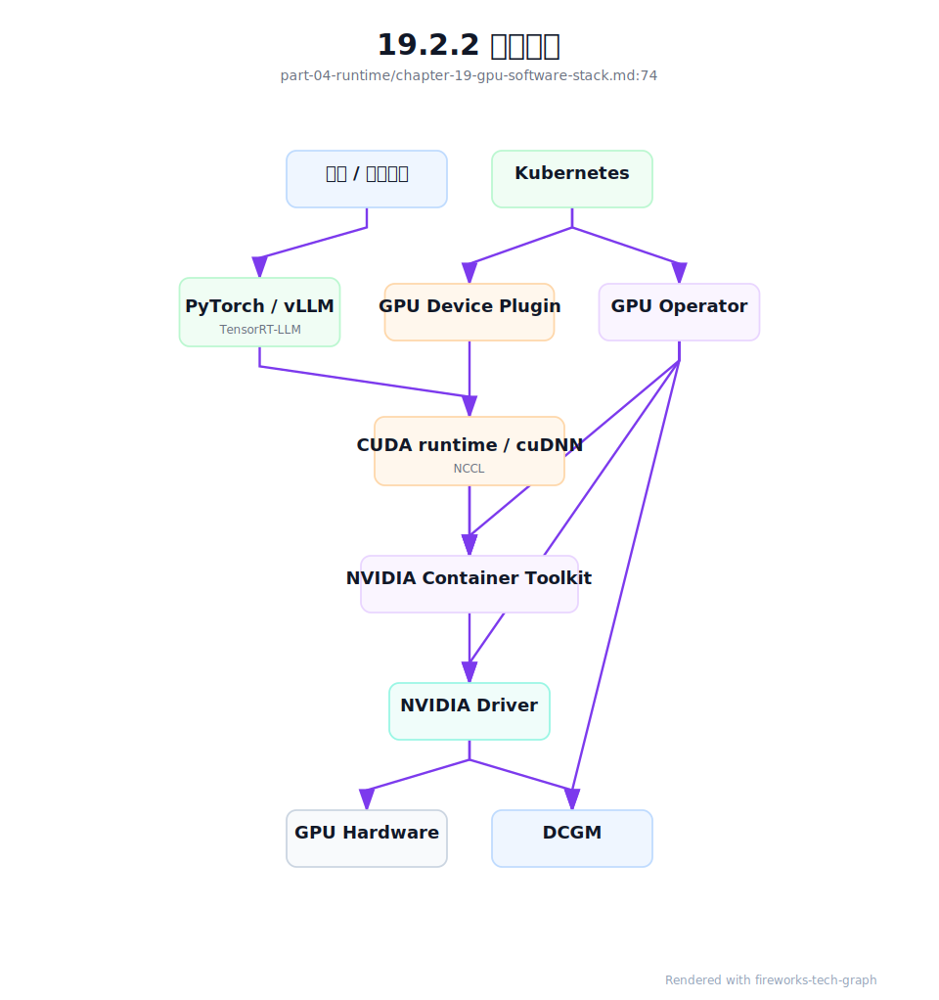

# 第 19 章：CUDA、驱动与 GPU 软件栈

## 19.1 导读

### 19.1.1 本章回答的问题

- NVIDIA Driver、CUDA、cuDNN、NCCL、DCGM、NVIDIA Container Toolkit 和 GPU Operator 分别处于哪一层？
- 版本兼容性为什么是 GPU 集群稳定性的核心问题？
- 如何把 GPU 软件栈从手工安装变成可验收、可升级、可回滚的平台能力？


### 19.1.2 本章上下文

- 层级定位：本章属于 `AI Runtime 层`，重点讨论推理引擎、训练框架、并行、通信和 GPU 软件栈。
- 前置依赖：建议先理解 第 18 章：通信原语 中的核心对象和路径。
- 后续关联：本章内容会继续连接到 第 20 章：AI Workload 的形态，并在系统地图、深度标准和读者测试中被交叉引用。
- 读完能力：读完本章后，读者应能把《CUDA、驱动与 GPU 软件栈》中的概念映射到 AI Factory 的生产路径、工程对象、观测证据和设计取舍。


### 19.1.3 读者测试

- 机制题：读者能否解释 NVIDIA Driver、CUDA、cuDNN、NCCL 的核心机制，以及它们如何共同支撑《CUDA、驱动与 GPU 软件栈》？
- 边界题：读者能否区分 框架、引擎、CUDA/NCCL、container runtime、driver 和硬件拓扑 的责任边界，并说明哪些问题不能简单归因到本章组件？
- 路径题：读者能否从框架调用追到推理/训练 runtime、CUDA、NCCL、通信、GPU/HBM 和版本矩阵，并指出本章对象在路径中的位置？
- 排障题：当《CUDA、驱动与 GPU 软件栈》相关生产症状出现时，读者能否列出第一层证据、下一跳证据、可能 owner 和止血动作？


### 19.1.4 一个真实场景

一次 GPU 节点驱动升级后，部分训练任务开始在 NCCL 初始化阶段失败，部分推理镜像启动后提示 CUDA library 加载异常。节点上执行 `nvidia-smi` 能看到 GPU，DCGM 指标也在上报，平台最初判断硬件健康；但容器内应用的表现并不一致。进一步检查发现，主机 NVIDIA Driver、容器内 CUDA 用户态库、NCCL 版本、OFED/RDMA 栈和 NVIDIA Container Toolkit 的组合没有经过矩阵验证。

这个场景很典型。GPU 软件栈的问题经常不以“驱动坏了”的形式出现，而是伪装成模型服务失败、训练 hang、通信带宽低、容器看不到 GPU 或指标缺失。单独看任何一层都可能正常：主机驱动能加载，容器能启动，GPU 能分配，网络能 ping 通；但组合起来就失败。AI Factory 的稳定性依赖整条软件栈的一致性，而不是某个组件独立可用。

本章讨论 GPU 软件栈的目的，是把“环境问题”变成可管理的工程对象。平台需要知道哪些组件在主机，哪些在容器，哪些由 Kubernetes 组件注入，哪些由驱动和内核绑定，哪些可以随镜像升级，哪些必须走节点基线。只有边界清晰，才能做版本矩阵、准入测试、灰度升级和回滚。

从运维角度看，软件栈是 AI Factory 的交付边界。用户购买或申请的不是“某台装了驱动的机器”，而是一组可运行训练和推理 workload 的兼容环境。环境不一致会直接转化为 GPU 空转、任务失败和排障成本。因此，软件栈治理不是平台内部卫生问题，而是算力产品质量的一部分。

判断一个 GPU 集群是否成熟，要看它能否稳定重复交付同一运行时环境，而不是看某次手工调通了多少节点。


## 19.2 基础模型

### 19.2.1 核心概念

GPU 软件栈从下到上包括硬件、主机驱动、CUDA 用户态库、深度学习库、通信库、容器运行时集成、监控诊断工具和 Kubernetes 管理组件。NVIDIA Driver 运行在主机层，负责操作系统和 GPU 硬件交互；CUDA 提供 GPU 编程模型和运行时；cuDNN 提供深度学习算子库；NCCL 提供多 GPU 通信；DCGM 提供健康和指标；NVIDIA Container Toolkit 把 GPU 设备和驱动库注入容器；GPU Operator 负责在 Kubernetes 中自动化部署和管理相关组件。

这些组件不是简单的线性依赖，而是版本和边界交织的系统。容器通常携带 CUDA 用户态库和框架依赖，但仍依赖主机驱动访问 GPU；NCCL 既依赖 CUDA，也依赖网络和 RDMA 栈；DCGM 指标来自主机和设备，但需要被映射到 Pod、任务和租户；GPU Operator 可以安装 driver、device plugin、DCGM exporter 和 Container Toolkit，但也可能与裸金属初始化脚本发生管理冲突。

因此，AI Factory 必须把 GPU 软件栈视为基础设施基线，而不是用户镜像的私有选择。用户可以选择模型框架和部分依赖，但主机 driver、内核、RDMA 栈、container runtime、device plugin、GPU Operator 策略和 DCGM 采集方式应由平台统一治理。否则同一训练任务在不同节点表现不同，排障会变成不可复现的环境猜谜。

还要区分“支持范围”和“实际安装”。平台可以声明某个 driver 支持若干 CUDA runtime，但实际可用性仍要通过镜像、框架和通信测试验证。兼容性不是网页表格上的结论，而是本集群、本镜像、本 workload 下跑出来的证据。书中后续章节讨论准入测试时，会继续沿用这个原则。

所以核心概念背后的关键词是 baseline、matrix、validation 和 drift control。

这四个词也构成本章的治理主线。


### 19.2.2 系统架构

GPU 软件栈架构的关键是主机与容器边界。物理 GPU 由主机内核和 NVIDIA Driver 管理，容器通过 NVIDIA Container Toolkit 获得设备文件、驱动库挂载和环境变量。训练框架或推理引擎在容器中调用 CUDA、cuDNN、NCCL 等用户态库，最终通过主机驱动访问 GPU。Kubernetes 侧，Device Plugin 把 GPU 暴露为可调度资源，GPU Operator 可以管理驱动、Toolkit、Device Plugin、DCGM exporter、MIG manager 等组件。

这条路径有多个控制点。节点初始化决定 OS、kernel、driver、OFED/RDMA 和基础工具；容器镜像决定 CUDA runtime、NCCL、cuDNN、PyTorch、vLLM 或 TensorRT-LLM；Kubernetes 决定 GPU 如何被声明、分配和注入；监控系统决定 DCGM 指标如何关联到 Pod 和任务。任何控制点没有版本记录，就会削弱可复现性。架构图能帮助我们看到，容器内“缺库”和主机驱动“不可用”是不同问题。

平台还要定义管理权。若裸金属 provisioning 已经在 golden image 中安装 driver，就不应再让 GPU Operator 以另一套版本安装 driver；若 GPU Operator 管理 MIG，那么节点初始化脚本不应同时修改 MIG 配置。一个组件只能有一个事实来源。AI Factory 的软件栈治理，重点不是能否安装，而是谁负责、如何验证、怎样升级、失败后如何回滚。

架构评审时，应画出每个组件的 owner 和变更路径。Driver 由节点镜像还是 Operator 管，NCCL 由基础镜像还是用户镜像带，DCGM 标签由谁补齐，RDMA 栈由谁验证，这些问题必须在事故前回答。否则故障发生时，各团队会围绕“这是谁的组件”争论，而不是围绕证据修复系统。

这张架构图不是安装手册，而是责任边界图。边界越清晰，升级和回滚越可控。

边界模糊时，自动化只会更快地放大错误。

因此架构图应随基线一起版本化。




## 19.3 关键技术

### 19.3.1 NVIDIA Driver

NVIDIA Driver 是主机层组件，负责操作系统与 GPU 硬件之间的交互。它提供内核模块、设备管理能力和用户态接口，是 CUDA 应用访问 GPU 的基础。`nvidia-smi` 能正常显示 GPU，说明驱动和设备的基本通信可用，但不代表容器、CUDA runtime、NCCL、RDMA 或框架一定可用。驱动正常只是必要条件，不是完整验收。

驱动升级是 GPU 集群中风险最高的变更之一。它可能影响 CUDA 兼容性、NCCL 行为、DCGM 指标、MIG、GPU Operator、Container Toolkit 和容器内框架。某些问题只在特定 GPU 型号、特定 CUDA 版本或跨节点通信中出现。生产平台不应把驱动升级当作普通包更新，而应像内核升级一样管理：灰度、准入、回滚、监控和变更记录缺一不可。

工程上，驱动版本应进入节点 inventory、作业元数据和故障报告。节点加入资源池前，需要通过 `nvidia-smi`、CUDA sample、容器 GPU smoke test、DCGM 指标、NCCL 单节点和跨节点测试。升级后要比较基线，确认训练和推理代表性任务没有回退。若同一集群中存在多个驱动版本，调度器和镜像策略也要理解兼容边界，避免任务被放到不支持的节点上。

驱动故障还需要分级处理。加载失败、Xid 大量出现、GPU 不可见，通常要摘除节点；轻微指标异常可能进入维护观察；版本不匹配则应阻止任务调度。平台应把这些状态暴露给调度器，而不是只在运维 dashboard 中显示。驱动是资源可用性的前置条件，健康状态必须影响资源分配。

驱动状态如果不能影响调度，监控就只是事后告警，不能保护任务。

资源池应只接纳驱动健康且版本合规的节点。

这是调度前置过滤条件。


### 19.3.2 CUDA

CUDA 是 NVIDIA GPU 并行计算平台和编程模型，包括 runtime、driver API、编译工具链和大量用户态库。训练框架和推理引擎通常不直接让用户写 CUDA kernel，但它们最终会通过 CUDA 执行 GPU 计算。CUDA 的版本影响可用算子、编译行为、性能路径和与框架的兼容性，是 AI Runtime 的核心依赖。

CUDA 的关键边界在主机驱动和容器镜像之间。容器可以携带 CUDA runtime 和用户态库，但访问 GPU 时仍依赖主机 NVIDIA Driver。通常需要确保主机驱动支持容器内 CUDA runtime 的要求。平台如果只固定镜像而不固定节点驱动，或者只升级驱动而不验证镜像，就会出现“某些节点能跑，某些节点失败”的问题。兼容矩阵必须覆盖这条边界。

工程实践中，应为训练和推理提供经过验证的 CUDA base image，并禁止生产任务使用 floating tag。镜像 digest、CUDA 版本、框架版本、NCCL/cuDNN 版本和构建日期都应可追溯。升级 CUDA 时，不仅要跑简单 kernel，还要跑代表性模型、通信、混合精度、checkpoint 和推理服务 smoke test。CUDA 不是单个库版本，而是一组会影响上层行为的运行时基线。

CUDA 还会影响构建流程。某些扩展会在镜像构建或首次运行时编译 kernel，编译产物可能依赖 CUDA、编译器和 GPU 架构。若平台允许用户在运行时临时安装或编译依赖，任务复现会变难。更稳妥的做法是把生产依赖固化在镜像构建阶段，并把构建参数写入镜像元数据。

这能让一次训练失败回到确定的构建输入，而不是回到不可复现的运行现场。

可复现构建是可复现训练的前提。

运行时临时变更应被禁止或隔离。


### 19.3.3 cuDNN

cuDNN 是面向深度学习的 GPU 加速库，提供卷积、归一化、RNN 和部分神经网络操作的高性能实现。虽然 LLM 训练和推理更常讨论矩阵乘、attention、NCCL 和推理引擎优化，cuDNN 仍然是许多模型、框架和多模态任务的重要依赖。对于包含视觉、语音或混合模型的 AI Factory，cuDNN 的版本和行为依然需要纳入基线。

cuDNN 的影响主要体现在性能和数值行为。不同版本可能选择不同 kernel、支持不同数据类型或改变某些算子路径。对普通用户来说，这些差异表现为训练速度变化、显存变化，甚至在边界条件下出现数值差异。平台不能把 cuDNN 视为无关依赖，因为框架升级时往往会连带改变 cuDNN 版本。若没有记录，性能回退很难复盘。

工程上，cuDNN 应随 CUDA 和框架镜像一起验证。测试不一定只覆盖 CNN，也可以覆盖平台实际 workload：多模态 encoder、图像 embedding、视频模型、语音模型或包含相关算子的训练任务。指标包括 kernel 是否可加载、训练是否稳定、吞吐是否符合基线、数值是否有异常。对于纯 LLM 路径，cuDNN 可能不是瓶颈，但仍应被版本化管理，避免依赖漂移。

cuDNN 的治理重点是不要让它成为隐形变量。一次 PyTorch 镜像升级可能同时改变 CUDA、cuDNN 和其他库，如果性能变化后无法拆分变量，就无法判断收益或回退来自哪里。平台镜像发布说明应列出这些底层库的变化，并保留可回滚版本。即使某个库不是主路径瓶颈，也可能在特定 workload 中成为关键。

对多模态平台来说，这一点尤其重要，因为 workload 不再只是文本模型。

不同模型族会暴露不同底层库路径。


### 19.3.4 NCCL

NCCL 是 NVIDIA GPU 集合通信库，是分布式训练和多 GPU 推理的重要组件。它提供 AllReduce、AllGather、ReduceScatter、Broadcast 和 P2P 等通信能力，连接训练框架、CUDA、GPU 拓扑和 RDMA 网络。NCCL 问题常常跨越软件和基础设施边界：版本、驱动、CUDA、网卡、OFED、容器权限、DNS、主机名、交换机配置都可能影响它。

平台需要把 NCCL 作为独立基线管理，而不是仅仅接受框架镜像自带版本。不同 NCCL 版本可能改变算法选择、网络接口选择、拓扑识别和性能特征。一次看似普通的镜像升级，可能把 NCCL 也升级了，进而影响大规模训练。生产平台应固定 NCCL 版本，记录关键环境变量，并对代表性消息大小、节点数和并行策略做基准验证。

排障时，NCCL 日志、rank 映射、网络接口、RDMA 设备、拓扑、交换机端口和训练 step trace 都需要被自动收集。单独运行 NCCL tests 通过，只能说明基础路径可用；真实训练还会受到慢 rank、计算通信重叠、bucket 和 checkpoint 影响。NCCL 是 Runtime 层与网络层的接缝，治理它需要跨团队协作和统一证据，而不是把错误日志丢给用户自行解释。

NCCL 还应进入升级验收。驱动、CUDA、OFED、交换机配置或容器 runtime 变化后，都可能影响 NCCL 行为。平台至少应覆盖单节点多卡、跨节点小规模、代表性大规模和异常恢复几类测试。若只跑单节点测试，就无法发现 scale-out 路径问题；若只跑大消息测试，也可能漏掉真实训练中的小消息或混合 op 模式。

NCCL 验收要覆盖实际并行策略，而不是只覆盖实验室 benchmark。

否则跨节点问题会在生产训练中暴露。

通信基线要覆盖真实节点距离。


### 19.3.5 DCGM

DCGM 即 Data Center GPU Manager，用于 GPU 健康监控、指标采集和诊断。它可以提供 GPU utilization、HBM 使用、温度、功耗、ECC、Xid、NVLink 状态、时钟、PCIe 和健康检查等信息。对于 AI Factory，DCGM 是 GPU 可观测性的基础，但原始指标只有在关联到节点、Pod、任务、租户、模型和时间线后才真正有用。

DCGM 的价值在于把硬件状态带入上层排障。训练 loss spike 可能来自数据，也可能与 GPU Xid、ECC 或降频有关；推理延迟升高可能来自请求模式，也可能来自温度、功耗限制或某张 GPU 异常。若 DCGM 指标没有和任务标签关联，平台只能看到某个节点有异常，却不知道影响了哪个租户或模型服务。可观测性必须跨越资源和业务。

工程上，应部署 DCGM exporter，并确保指标带有 node、GPU、Pod、namespace、job、tenant 等标签。对于 Slurm 或裸金属任务，也要有相应的作业映射。还应定义告警策略：哪些 Xid 需要摘除节点，哪些 ECC 趋势需要维护，哪些温度或功耗异常需要降级或迁移。DCGM 不是 dashboard 装饰，而是准入、健康管理、故障隔离和容量分析的依据。

DCGM 指标还要进入历史分析。单次 Xid 可能是偶发，重复出现可能说明硬件、供电、散热或驱动问题；温度和功耗长期接近上限，可能影响稳定性和性能；某些 GPU 利用率长期异常，可能说明调度或容器注入问题。把 DCGM 作为时序证据使用，才能支持维护决策，而不是只在事故后查看当前状态。

历史趋势能区分偶发故障和系统性退化，这是维护策略的基础。

没有趋势，告警只能驱动被动响应。

趋势分析能提前安排维护窗口。

这能减少突发摘除对训练队列的冲击。


### 19.3.6 NVIDIA Container Toolkit

NVIDIA Container Toolkit 让容器能够访问 GPU 设备和必要的驱动库。它与 Docker、containerd、CRI-O 等 container runtime 集成，在容器启动路径上注入设备文件、driver libraries、二进制工具、环境变量和 capability，使容器内的 CUDA 应用可以使用主机 GPU。没有这层集成，Kubernetes 即使把 Pod 调度到 GPU 节点，容器内应用也可能看不到 GPU，或者只能看到设备但无法加载正确 driver library。

从软件栈角度看，Toolkit 由几类组件协同。`libnvidia-container` 是底层库，负责发现宿主机 driver 能力并执行 bind mount；`nvidia-container-cli` 调用该库完成设备和库注入；`nvidia-container-runtime-hook` 在 OCI runtime 的 prestart 阶段执行；`nvidia-container-runtime` 作为 runtime wrapper 修改 OCI spec，把 NVIDIA hook 加入生命周期；`nvidia-ctk` 用于配置 Docker、containerd 等运行时。第 21 章会展开 OCI hook 细节，本章强调它在 GPU 软件栈中的版本边界和基线治理。

Toolkit 问题常表现为边界错位。主机 `nvidia-smi` 正常，Kubernetes 也分配了 GPU，但容器内 `nvidia-smi` 失败，或应用报找不到 CUDA/driver library。排查路径应包括：Device Plugin 是否分配 GPU、runtime class 是否正确、Toolkit 是否安装、container runtime 配置是否生效、OCI hook 是否执行、设备文件是否注入、驱动库挂载是否正确、容器权限是否满足。把这些问题笼统称为“GPU 不可用”会降低排障效率。

平台上，Container Toolkit 的版本应与 driver、container runtime、Kubernetes 版本、GPU Operator 策略和基础镜像一起验证。升级 containerd、CRI-O、Docker、节点 OS 或 driver 时，都要验证 GPU 容器 smoke test。对于多租户环境，还要明确容器隔离边界：容器能看到哪些 GPU、哪些 device capability 被开放、是否允许 privileged、是否暴露 RDMA 设备、是否允许镜像默认环境变量绕过调度意图。Toolkit 是容器访问 GPU 的门闩，既影响可用性，也影响安全边界。

Toolkit 的验收应覆盖三类场景。第一类是最小容器，只运行 `nvidia-smi`、`nvidia-container-cli info` 和简单 CUDA sample，验证注入链路；第二类是真实基础镜像，加载 PyTorch、NCCL 或推理引擎并执行一次 GPU 计算，验证用户态依赖组合；第三类是 Kubernetes Pod，通过 device plugin 分配 GPU 后在容器内执行同样检查，验证 CRI、runtime、hook 和 Kubernetes 资源分配的组合路径。若只测 `nvidia-smi`，可能漏掉框架兼容问题；若只测业务镜像，问题又难以归因。

此外，Toolkit 配置应纳入节点 drift 检测。container runtime 配置被手工修改、runtime handler 变化、hook 二进制被覆盖、`NVIDIA_VISIBLE_DEVICES` 默认行为变化，都应触发节点重新准入。生产平台应把 Toolkit 版本、runtime 配置 hash、GPU smoke test 结果写入资源池，而不是只保存在节点上。这样才能防止局部修复变成长期隐患，也能在容器 GPU 问题发生时快速判断是节点基线、镜像依赖还是 Kubernetes 分配出了问题。

较新的集群还应把 CDI/NRI 能力纳入 Toolkit 基线。Toolkit 不只是“安装一个 nvidia runtime”，还可能负责生成 CDI spec、配置 containerd/CRI-O 的 CDI 支持、与 device plugin 的 `deviceListStrategy` 对齐，或通过 NRI 参与容器创建路径。基线记录应明确当前节点使用 legacy OCI hook、CDI，还是混合模式；混合模式只应出现在迁移窗口，并要有到期时间。否则同一个 GPU Pod 在不同节点上会走不同注入路径，故障表现和审计证据都不一致。

```yaml
container_toolkit_baseline:
  toolkit_version: pinned
  libnvidia_container_version: pinned
  container_runtime: containerd
  runtime_handler:
    name: nvidia
    mode: legacy_hook
  cdi:
    enabled: true
    spec_path: /var/run/cdi/nvidia-gpu.yaml
    spec_hash: measured
  nri:
    enabled: policy_defined
  device_plugin_strategy: cdi
  validation:
    - nvidia_container_cli_info
    - legacy_hook_smoke_if_enabled
    - cdi_device_resolution
    - kubernetes_runtimeclass_smoke
    - pod_device_visibility_reconciliation
```

这个 baseline 的价值在升级时最明显。containerd、CRI-O、runc、Toolkit、device plugin 任一组件升级，都可能改变设备注入路径。若 baseline 只记录版本，不记录注入模式和 spec hash，升级后即使版本看起来正确，也无法解释为什么容器内可见设备发生变化。AI Factory 应把“GPU 如何进入容器”视为可验收能力，而不是 runtime 的内部细节。


### 19.3.7 GPU Operator

GPU Operator 使用 Kubernetes Operator 模式管理 GPU 软件栈，通常可以部署或管理 driver、NVIDIA Container Toolkit、GPU Device Plugin、DCGM exporter、MIG manager、Node Feature Discovery 等组件。它的价值是把 GPU 节点配置声明化、自动化，降低手工安装和漂移风险。对于 Kubernetes GPU 集群，GPU Operator 是常见管理方式。

但 GPU Operator 不是无条件更好的选择。若裸金属平台已经通过 golden image 固定 driver 和 RDMA 栈，再让 Operator 动态安装 driver，可能引入版本冲突和升级风险。若集群需要严格控制驱动升级窗口，Operator 的自动化能力也需要被平台变更流程约束。关键问题不是“是否使用 Operator”，而是哪些组件由它管理，哪些组件由节点镜像或外部 provisioning 管理。

工程上，应明确 GPU Operator 的管理边界和版本策略。Operator 自身版本、driver policy、Toolkit、Device Plugin、DCGM exporter、MIG 配置都应进入集群基线。升级 Operator 前，应在测试集群或灰度节点验证 GPU 分配、容器访问、DCGM 指标、MIG、NCCL 和代表性任务。Operator 能减少手工漂移，但不能替代兼容矩阵和准入测试。自动化越强，越需要清楚的回滚方案。

GPU Operator 还会影响集群运维节奏。某些组件以 DaemonSet 形式运行，升级会逐节点滚动；某些驱动安装需要重启或排空节点；某些配置错误会影响整个 GPU 节点池。平台应把 Operator 变更纳入 change management，并在升级前冻结或迁移关键训练任务。自动化不是无人值守，自动化需要更严格的边界条件。

Operator 的状态也应被监控：期望版本、实际版本、失败节点和回滚动作都要可见。

控制器本身也是生产组件。

生产组件必须可观测、可回滚。

否则 Operator 故障会变成集群级故障。

控制面风险不能被忽视。


### 19.3.8 版本兼容性

版本兼容性是 GPU 软件栈最常见、也最容易被低估的风险。Driver、CUDA、cuDNN、NCCL、PyTorch、推理引擎、kernel、OFED/RDMA、Container Toolkit、GPU Operator、Kubernetes 和容器 runtime 都存在兼容关系。升级其中一个组件，可能改变整条链路。问题不一定立即爆炸，可能只在跨节点训练、特定模型、特定精度或特定容器镜像中出现。

生产平台需要维护兼容矩阵。矩阵不是静态文档，而是经过测试验证的组合清单。每个组合应包含 OS/kernel、driver、CUDA runtime、NCCL、cuDNN、framework、container runtime、Toolkit、RDMA 栈和 GPU Operator 策略，并标明适用 GPU 型号和任务类型。任务提交时，平台应能判断镜像和节点基线是否兼容，而不是等容器启动失败后再排查。

版本治理还要支持灰度和回滚。新驱动、新 CUDA 镜像、新 NCCL 或新 Operator 先进入小规模节点池，跑准入测试和代表性 workload；指标稳定后再扩大范围。发现问题时，能够把节点移出资源池、回滚镜像或恢复旧基线。AI Factory 的软件栈升级方式应接近基础设施变更管理，而不是普通应用依赖升级。稳定性来自可控变更，而不是永远不升级。

兼容矩阵应同时服务调度和用户沟通。调度器用它避免不兼容放置，用户用它选择受支持镜像，SRE 用它判断故障是否与版本有关。矩阵如果只存在于文档中，而不进入系统控制面，就无法阻止错误组合进入生产。真正有效的矩阵应被机器读取和执行。

矩阵还应标明生命周期：推荐、兼容、冻结、废弃和禁用。

生命周期决定调度和支持策略。

禁用组合不应进入生产队列。

这应由系统自动执行。

人工约定不够可靠。


## 19.4 工程落地

### 19.4.1 工程实现

工程实现应从 GPU node baseline 开始。基线至少包含 OS、kernel、driver、CUDA 支持范围、NCCL、cuDNN、OFED/RDMA、Container Toolkit、DCGM、GPU Operator 策略、container runtime 和验证用例。基线发布后，节点加入资源池、升级、维修返回、重装系统都要重新验证。没有基线，节点只是“装了驱动的机器”，不是 AI Factory 可交付资源。

示例基线如下：

```yaml
gpu_node_baseline:
  os: ubuntu-or-enterprise-linux
  kernel: pinned
  nvidia_driver: pinned
  cuda_runtime: supported_range
  nccl: pinned
  rdma_stack: pinned
  container_toolkit: pinned
  container_toolkit_mode: cdi_or_legacy_hook
  device_plugin_strategy: pinned
  cdi_spec_hash: measured_if_enabled
  dcgm_exporter: enabled
  validation:
    - nvidia-smi
    - cuda-sample
    - container-gpu-smoke-test
    - cdi-or-runtimeclass-smoke-test
    - nccl-test
    - dcgm-metrics-check
```

基线验收应分层执行。主机层验证驱动、GPU 健康、NVLink、ECC、Xid、RDMA；容器层验证 GPU 可见性、CUDA library、框架加载；通信层验证单节点和跨节点 NCCL；业务层验证短训练、推理 smoke test 和指标上报。每次验收产生报告，包含版本、节点、时间、测试结果和失败原因。这样软件栈才能被采购、交付、运维和用户共同信任。

实现还应支持节点生命周期状态。新节点先进入 pending validation，通过后进入 serving；出现异常进入 quarantine；维修或升级后重新 validation；退役前保留故障和版本记录。状态机比人工备注可靠。对 GPU IaaS 来说，软件栈准入和硬件健康一样重要，二者共同决定节点是否能交付给训练和推理任务。

平台还应把基线检查做成可重复命令或流水线，而不是依赖人工 runbook。每次运行输出结构化报告，报告可以被 CI、准入系统和审计系统消费。这样，节点规模扩大后，软件栈质量不会随人工操作能力下降。

实现中还要把失败原因标准化。比如 driver mismatch、container gpu invisible、nccl bandwidth below baseline、dcgm label missing、rdma device missing 应有明确错误码。错误码能驱动自动隔离、告警分派和报表统计，也能让用户看到可理解的失败原因。

这套错误码应在节点准入、作业启动和运行中诊断之间复用。

统一错误码能连接平台、SRE 和用户沟通。


### 19.4.2 常见故障

第一类故障是主机驱动与容器 CUDA 用户态库不兼容。表现为容器启动成功但框架加载 CUDA 失败，或某些节点可用、某些节点失败。第二类故障是 Container Toolkit 或 runtime 配置异常，容器内看不到 GPU。第三类故障是 NCCL 与 RDMA 栈或网络配置不匹配，单卡训练正常，跨节点训练失败或性能极差。

第四类故障是管理权冲突。节点镜像安装了一套 driver，GPU Operator 又尝试安装或升级另一套；MIG 配置被节点脚本和 Operator 同时修改；DCGM exporter 版本与驱动或 GPU 型号不匹配。这类问题不是单个组件坏，而是平台边界不清。第五类故障是指标缺少关联标签，DCGM 能看到 GPU 异常，但无法定位到 Pod、租户或训练任务。

第六类故障来自升级和漂移。某些节点被手工修复后版本不同，某些镜像使用 floating tag 拉到了新 CUDA，某次 container runtime 升级改变了设备注入行为。这些问题往往只在规模化后暴露。解决方向是禁止手工漂移、固定镜像 digest、维护版本 inventory、使用准入测试拦截异常节点，并把每次变更写入审计记录。

排障时应先确认“是否同一基线”。如果失败任务跨越不同 driver、CUDA 或 Toolkit 组合，优先按版本分组比较；如果只在某些节点发生，优先检查节点漂移和硬件健康；如果所有节点同时发生，优先检查近期镜像、Operator 或集群级变更。分组比较能显著减少盲目试错。

常见故障的处理目标不是临时修好一个节点，而是消除产生漂移的路径。

否则同类节点会继续失败。

修复应回写到基线流程。

只修现场不修流程，问题会重复发生。


### 19.4.3 性能指标

GPU 软件栈指标首先要覆盖版本分布。平台应能看到每个节点的 OS、kernel、driver、CUDA 支持范围、NCCL、RDMA 栈、Container Toolkit、GPU Operator 和 DCGM exporter 版本。版本分布不是管理台装饰，而是排障入口。某类任务只在某个版本组合上失败时，inventory 能快速缩小范围。

健康指标包括 GPU 可见性 smoke test 通过率、DCGM 指标完整性、Xid、ECC、温度、功耗、时钟、NVLink 状态、PCIe 状态和节点准入通过率。通信指标包括 NCCL test 带宽、跨节点错误率、RDMA 设备可见性和网络接口选择。容器指标包括 GPU 注入成功率、runtime class 使用情况、容器内 CUDA smoke test 和镜像兼容失败率。

运维指标包括升级成功率、回滚时间、节点漂移数量、基线覆盖率、故障按版本组合分布和变更后回归次数。这些指标回答平台是否可持续运营。单个节点能跑任务不代表软件栈健康；大规模集群需要知道版本是否一致、升级是否可控、失败是否可归因、回滚是否可执行。GPU 软件栈的指标最终服务可靠性和变更治理。

这些指标还应进入容量运营。若某个版本组合失败率高，相关节点即使硬件仍在，也不应被计入可售或可用容量；若某次升级导致回滚时间过长，说明变更机制本身有问题。AI Factory 的可用 GPU 数，不是机房里 GPU 的物理数量，而是通过软件栈准入并能稳定运行 workload 的数量。

因此，软件栈指标最终会影响 SLA、交付能力和成本核算。

它们不是底层噪声，而是业务质量指标。

指标应进入平台月度运营评审。

评审要看趋势、版本分布和失败归因。

还要看回滚演练结果。


### 19.4.4 设计取舍

第一个取舍是 golden image 与运行时自动化。把 driver、RDMA 和基础工具预装进 golden image，可以提高启动速度和一致性，但升级需要重建镜像和重启节点；用 GPU Operator 动态安装组件，可以声明化和自动化，但要处理集群内升级、权限和回滚风险。两种方式都可行，关键是明确管理边界，不要让两套系统同时管理同一组件。

第二个取舍是统一基线与用户灵活性。平台统一 driver、CUDA 支持范围、NCCL 和 Toolkit，有利于稳定和排障；用户完全自定义镜像，有利于实验速度，但会增加兼容风险。可行做法是平台提供受支持镜像矩阵，用户可以扩展上层依赖，但不能随意改变底层 runtime 组合。对于研究环境可以更灵活，对于生产训练和在线推理应更严格。

第三个取舍是升级速度与可靠性。新版本可能带来性能、功能和硬件支持，也可能引入回归。AI Factory 不能长期停留在旧版本，也不能无验证地追新。合理机制是灰度节点池、代表性 workload、准入测试、指标对比和快速回滚。GPU 软件栈是 AI Factory 的地基，它的变更要有节奏、有证据、有责任人。

还有一个取舍是平台统一与特殊需求。少数团队可能需要新的 CUDA、框架或通信库验证前沿模型，但平台不能因此破坏生产主路径。可以提供实验节点池和隔离镜像通道，让新组合先在有限范围验证。进入主路径前，必须补齐兼容矩阵、准入测试和运维责任。创新需要通道，生产需要边界。

边界清楚时，平台既能支持探索，也能保护稳定性。

这是长期维护 AI Factory 的基本平衡。


## 19.5 小结与延伸阅读

### 19.5.1 小结

- GPU 软件栈跨越主机、容器、Runtime、Kubernetes 和监控系统。
- Driver、CUDA、NCCL、Container Toolkit 和 GPU Operator 的边界必须清晰。
- 版本兼容矩阵和准入测试是稳定性的核心。
- 软件栈升级应按基础设施变更管理，支持灰度、验证和回滚。


### 19.5.2 延伸阅读

- [CUDA Toolkit Documentation](https://docs.nvidia.com/cuda/)
- [NVIDIA Container Toolkit documentation](https://docs.nvidia.com/datacenter/cloud-native/container-toolkit/latest/index.html)
- [NVIDIA GPU Operator documentation](https://docs.nvidia.com/datacenter/cloud-native/gpu-operator/latest/index.html)
