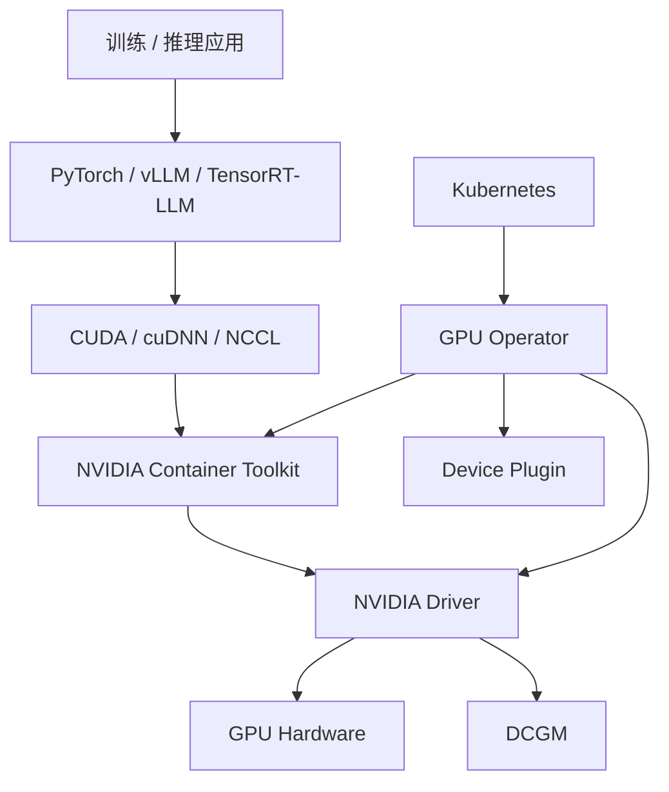

# 第 19 章：CUDA、驱动与 GPU 软件栈

## 本章回答的问题

- NVIDIA Driver、CUDA、cuDNN、NCCL、DCGM、NVIDIA Container Toolkit 和 GPU Operator 分别处于哪一层？
- 版本兼容性为什么是 GPU 集群稳定性的核心问题？
- 如何把 GPU 软件栈从手工安装变成可验收、可升级、可回滚的平台能力？

## 一个真实场景

一次驱动升级后，部分训练任务开始 NCCL 初始化失败，部分推理镜像无法加载 CUDA 库。节点上 `nvidia-smi` 正常，容器内却报错。最后发现主机驱动、容器 CUDA 用户态库、NCCL 版本和 NVIDIA Container Toolkit 组合没有经过矩阵验证。

GPU 软件栈的问题经常表现为“模型服务失败”或“训练任务失败”，但根因在版本和环境边界。

## 核心概念

GPU 软件栈从下到上包括内核驱动、用户态库、通信库、深度学习库、容器运行时集成、监控工具和 Kubernetes 管理组件。它连接物理 GPU 和 AI Runtime。

AI Factory 必须把软件栈版本纳入基础设施基线。没有基线，就无法解释为什么同一镜像在不同节点表现不同。

## 系统架构



这张图说明容器内应用和主机驱动之间有清晰边界。容器可以带用户态库，但必须依赖主机驱动访问 GPU。

## 19.1 NVIDIA Driver

NVIDIA Driver 是主机层驱动，负责操作系统和 GPU 硬件之间的交互。`nvidia-smi` 看到 GPU，不代表容器和框架一定可用，但驱动异常通常会让上层全部失败。

驱动升级是高风险操作。它可能影响 CUDA 兼容、NCCL 行为、GPU Operator、容器 runtime 和监控。生产升级应经过小规模灰度和准入测试。

## 19.2 CUDA

CUDA 是 NVIDIA GPU 并行计算平台和编程模型。训练框架和推理引擎通过 CUDA 执行 GPU kernel。CUDA 包含编译工具、运行时和用户态库。

容器镜像通常带 CUDA 用户态库，但仍依赖主机驱动。平台需要明确“主机驱动版本支持哪些 CUDA 运行时”。这就是版本兼容矩阵的核心。

## 19.3 cuDNN

cuDNN 提供深度学习常用算子的高性能实现，如卷积、归一化和部分神经网络操作。虽然 LLM 主要依赖矩阵乘和 attention 相关优化，但 cuDNN 仍是许多模型和框架的重要库。

cuDNN 版本差异可能影响性能和数值行为。镜像基线应固定 cuDNN 版本，并在框架升级时验证。

## 19.4 NCCL

NCCL 负责 GPU 集合通信，是分布式训练的关键组件。NCCL 与 CUDA、驱动、网络驱动、RDMA 栈和容器权限都有关系。NCCL 错误经常跨越软件和网络边界。

平台应固定并记录 NCCL 版本，训练任务失败时自动收集 NCCL 日志、环境变量、拓扑和网络状态。

## 19.5 DCGM

DCGM 即 Data Center GPU Manager，用于 GPU 健康、指标和诊断。它可以提供利用率、显存、温度、功耗、ECC、Xid 等信息，是 GPU 可观测性的基础。

DCGM 指标应进入统一监控，并和节点、Pod、租户、训练任务或模型服务关联。只看到节点 GPU 指标而不知道哪个任务使用它，排障价值有限。

## 19.6 NVIDIA Container Toolkit

NVIDIA Container Toolkit 让容器能够访问 GPU 设备和必要的驱动库。它与 container runtime 集成，在容器启动时注入设备、库和环境变量。

容器内 `nvidia-smi` 失败时，排查路径通常包括：主机驱动是否正常、device plugin 是否分配 GPU、runtime class 是否正确、Container Toolkit 是否安装、容器权限是否足够。

## 19.7 GPU Operator

GPU Operator 用 Kubernetes Operator 模式管理 GPU 软件栈。它可以部署驱动、device plugin、DCGM exporter、Container Toolkit、MIG manager 等组件。它让 GPU 节点配置更可声明和自动化。

是否让 GPU Operator 管驱动取决于平台策略。有些裸金属平台在镜像中预装驱动，有些集群让 Operator 安装。关键是避免两套系统同时管理同一组件。

## 19.8 版本兼容性

版本兼容性是 GPU 软件栈最常见风险。驱动、CUDA、NCCL、cuDNN、PyTorch、推理引擎、内核、OFED、Container Toolkit 和 GPU Operator 都有兼容关系。升级其中一个组件，可能影响整个链路。

生产平台应维护兼容矩阵和 golden image。每次升级前运行准入测试：`nvidia-smi`、CUDA sample、NCCL test、推理 smoke test、训练 smoke test、DCGM 指标和容器 GPU 访问。

## 工程实现

节点软件栈基线：

```yaml
gpu_node_baseline:
  os: ubuntu-or-enterprise-linux
  kernel: pinned
  nvidia_driver: pinned
  cuda_runtime: supported_range
  nccl: pinned
  container_toolkit: pinned
  dcgm_exporter: enabled
  validation:
    - nvidia-smi
    - cuda-sample
    - nccl-test
    - container-gpu-smoke-test
```

这份基线应进入准入验收和升级流程。

## 常见故障

- 主机驱动升级后，旧镜像中的 CUDA 用户态库不兼容。
- 容器未正确注入 GPU 设备，应用看不到 GPU。
- NCCL 与 RDMA 栈不匹配，跨节点通信失败。
- GPU Operator 和节点初始化脚本同时安装驱动，状态冲突。
- DCGM 指标没有 Pod 标签，无法关联业务。

## 性能指标

- 驱动和 CUDA 版本分布。
- GPU 可见性 smoke test 通过率。
- NCCL test 带宽和错误率。
- DCGM 指标完整性、Xid、ECC、温度、功耗。
- 升级失败率、回滚时间、节点准入通过率。

## 设计取舍

预装驱动的 golden image 启动快、可控性强，但升级需要重做镜像。GPU Operator 自动化程度高，但要处理集群内升级风险。平台应根据节点规模、变更频率和团队能力选择，并统一版本治理入口。

## 小结

- GPU 软件栈跨越驱动、CUDA、通信库、容器 runtime 和 Kubernetes 组件。
- 版本兼容性是稳定性的核心，必须用矩阵和准入测试管理。
- DCGM 和 Container Toolkit 是生产可观测性与容器访问 GPU 的关键组件。
- GPU Operator 能自动化软件栈，但不能替代版本治理和升级验证。

## 延伸阅读

- TODO: NVIDIA Driver / CUDA 官方文档
- TODO: NVIDIA Container Toolkit 文档
- TODO: NVIDIA GPU Operator 文档
