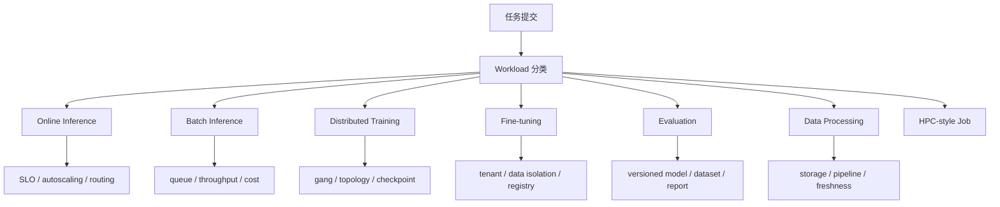
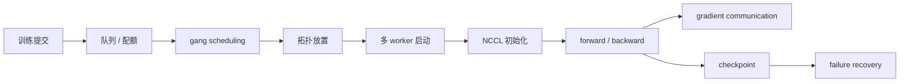
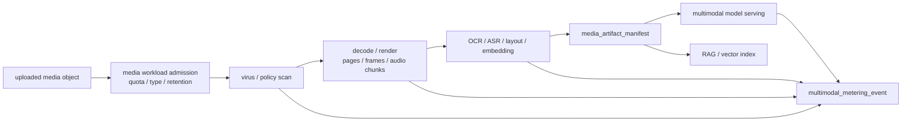

# 第 20 章：AI Workload 的形态

## 本章回答的问题

- AI Factory 中常见 workload 有哪些形态？
- 在线推理、批量推理、训练、微调、评测、数据处理和 HPC-style job 的调度需求有什么差异？
- 为什么 AI workload 不能简单套用普通微服务的资源模型？

## 本章上下文

- 层级定位：本章属于 `资源编排与作业调度层`，重点讨论容器、Kubernetes、GPU 调度、队列、Slurm 和多集群资源治理。
- 前置依赖：建议先理解 第 19 章：CUDA、驱动与 GPU 软件栈 中的核心对象和路径。
- 后续关联：本章内容会继续连接到 第 21 章：容器与 Kubernetes，并在系统地图、深度标准和读者测试中被交叉引用。
- 读完能力：读完本章后，读者应能把《AI Workload 的形态》中的概念映射到 AI Factory 的生产路径、工程对象、观测证据和设计取舍。

## 读者测试

- 机制题：读者能否解释 online inference、batch inference、distributed training、fine-tuning 的核心机制，以及它们如何共同支撑《AI Workload 的形态》？
- 边界题：读者能否区分 资源编排与作业调度、GPU IaaS、Platform 层和 AI Runtime 层 的责任边界，并说明哪些问题不能简单归因到本章组件？
- 路径题：读者能否从 workload 提交追到队列、配额、调度、容器启动、GPU 分配和拓扑证据，并指出本章对象在路径中的位置？
- 排障题：当《AI Workload 的形态》相关生产症状出现时，读者能否列出第一层证据、下一跳证据、可能 owner 和止血动作？


## 一个真实场景

一个 GPU 集群同时运行在线 Chat 服务、批量 embedding、LoRA 微调、离线评测和 32 卡训练。白天在线服务请求突增，推理副本需要扩容，但空闲 GPU 被批量任务占住；夜间训练任务申请到部分 worker 后迟迟等不到剩余 GPU，已经启动的 Pod 空占资源；评测任务临时读取大量样本，把对象存储打满，导致 checkpoint 写入抖动。表面看是“集群资源不足”，实际上是多种 workload 被当成同一种 Pod 处理。

平台最初只要求用户声明 CPU、memory 和 `nvidia.com/gpu`，认为调度器只要找得到 GPU 就能运行任务。事故复盘发现，每类 workload 的关键约束完全不同：在线推理关注 TTFT、TPOT 和可用性；批量推理关注吞吐和完成时间；训练关注 gang scheduling、NCCL 和 checkpoint；微调关注租户隔离和产物管理；评测关注可复现；数据处理关注存储和数据新鲜度。单一资源模型无法表达这些差异。

AI Factory 的调度设计必须从 workload 形态开始。先识别任务类型，再决定队列、配额、优先级、抢占、拓扑、资源池和指标。否则平台会把低优先级离线任务放在在线服务旁边，把同步训练当成普通 Job，把数据处理当成无害 CPU 任务。workload 分类不是产品标签，而是资源编排和故障隔离的第一性信息。

这个场景还有一个容易忽略的教训：GPU 利用率不是唯一目标。在线服务为了低延迟可能保留冗余容量，训练任务为了同步效率可能要求整组资源同时可用，数据处理为了保障下游训练可能需要提前占用存储带宽。若平台只追求全局 GPU 利用率，短期数字可能变好，长期却会牺牲 SLO、稳定性和可恢复性。workload 分类的作用，就是让每类任务用自己的目标函数被管理。

## 核心概念

AI workload 是消耗模型、数据和计算资源的工作负载。它既包括面向用户请求的在线服务，也包括运行到完成的离线任务；既包括单 GPU 推理，也包括跨多节点同步训练；既包括模型相关任务，也包括数据清洗、tokenization、embedding 构建和评测流水线。它们共同构成 AI Factory 的生产活动，而不仅是“跑在 GPU 上的程序”。

Workload 分类要看运行形态、资源形态和失败语义。运行形态包括常驻服务、批处理、长时间训练、短任务、DAG 流水线和交互式实验；资源形态包括 GPU、HBM、CPU、RDMA、NVMe、对象存储、并行文件系统和模型权重；失败语义包括是否可重试、是否依赖 checkpoint、是否影响在线 SLO、是否需要人工复核。分类越准确，调度策略越可解释。

从平台视角看，workload 类型会影响整个控制面。它决定任务进哪个队列、如何计算 quota、是否允许抢占、是否需要 gang、是否需要拓扑亲和、如何收集指标、如何计费、失败后如何恢复。普通微服务平台通常把副本看作独立单元；AI Factory 必须把任务、模型、数据、GPU 组和生命周期一起建模。这就是资源编排与作业调度层的起点。

还要把 workload 和资源画像分开。Workload 描述“任务想做什么”，资源画像描述“它如何消耗资源”。同样是 online inference，小模型和长上下文大模型的 HBM、KV Cache 和扩容特征不同；同样是 training，单节点微调和多节点预训练完全不同。平台应先分类，再用资源画像细化，而不是用一个粗糙标签替代全部调度判断。

分类还应服务组织协作。产品、算法、平台、SRE 和财务都需要用同一套 workload 名称讨论问题。否则产品说“推理慢”，平台不知道是 online 还是 batch；财务说“训练成本高”，算法不知道是否包含评测和数据处理。统一概念能减少跨团队误解。

## 系统架构

AI workload 架构可以看成从提交入口到资源执行的分类控制链。用户或平台组件提交任务时，首先声明 workload 类型、模型、数据、资源、SLO、优先级和恢复策略；控制面根据这些信息选择队列和资源池；调度层执行配额、拓扑、gang、抢占或弹性扩缩容；运行时启动容器、进程组、模型服务或数据处理任务；观测系统按 workload 类型收集不同指标。

这条链路的关键是把 workload 类型传递到每一层。若提交入口知道这是在线推理，但调度器只看到普通 Pod，就无法保障延迟；若调度器知道这是训练，但观测系统只看 Pod 状态，就无法解释 step time；若计费系统只知道 GPU 小时，不知道 tokens/s、checkpoint 或失败重试，就无法做成本归因。workload 类型必须成为跨系统字段。

架构上还要支持混部和隔离。在线推理、批量推理、训练和数据处理可以共享底层 GPU IaaS，但不应共享相同的调度策略。统一入口不等于统一执行语义。成熟平台会把 workload 分类、队列、配额、资源池和指标体系组合起来，让不同任务在同一 AI Factory 中按不同规则运行。

这套架构最好形成闭环。分类规则影响调度，调度结果影响运行指标，指标再反向修正分类和资源画像。例如某类 batch inference 经常抢占后恢复失败，就不应继续放在可抢占池；某类在线模型冷启动过慢，就需要更高预留或模型缓存；某类数据处理导致训练等待，就要调整存储隔离。workload 架构不是静态目录，而是持续运营系统。

因此，workload 分类应允许演进。新模型形态、新推理引擎或新业务流程出现后，平台可以增加子类型或资源画像，但不应破坏已有指标口径。



## 20.1 online inference

Online inference 是面向用户实时请求的在线推理 workload。它通常承载 Chat Completion、Agent 调用、RAG 查询、多模态理解或企业应用请求。它关注 TTFT、TPOT、端到端延迟、错误率、可用性、token 计量和成本。在线推理需要常驻服务、健康检查、弹性扩缩容、灰度发布、模型路由、限流、熔断和请求级可观测性。

在线推理和普通 Web 服务的差异在于资源状态更重。每个模型副本需要加载权重，占用大量 HBM；长上下文请求会消耗 KV Cache；batching 会在吞吐和延迟之间做取舍；streaming 响应需要网关和 Service 正确处理长连接。扩容不是简单增加 Pod 数，因为新副本可能要经历镜像拉取、模型下载、权重加载和 warmup。冷启动期间，调度成功不等于服务可用。

调度上，online inference 应进入有 SLO 保障的资源池或队列，避免被低优先级批任务挤占。指标不应只看 GPU 利用率，还要看 TTFT、TPOT、TPOP、队列长度、batch size、KV Cache 命中、超时、限流和模型实例健康。平台设计时要明确：在线推理的目标不是把 GPU 永远打满，而是在可接受成本下稳定地产生用户可感知的 token。

工程实现上，online inference 需要 readiness 与 liveness 分离。进程启动不代表模型加载完成，模型加载完成也不代表 warmup、KV Cache、路由和限流都正常。发布时应使用 canary 和渐进流量，不应让新副本在冷启动时直接承接全部请求。容量规划也要按峰值请求、上下文长度和输出长度分布计算，而不是只按平均 QPS 估算。

在线推理的容量要为尾部请求和故障转移留余量，不能只按平均负载追求高利用率。

否则一次节点维护或模型冷启动就可能击穿用户体验。

## 20.2 batch inference

Batch inference 是离线或准实时推理 workload，例如批量摘要、内容审核、离线生成、批量 embedding、数据标注、离线评测和日志回放。它通常不要求单请求低延迟，但要求总完成时间、吞吐、失败重试和单位 token 成本可控。与在线推理相比，它可以更激进地使用 batching、队列和低优先级资源，从而提高 GPU 利用率。

批量推理的工程重点是任务切分和进度管理。一个大任务可能被拆成许多 shard，每个 shard 读取输入、调用模型、写出结果，并在失败后重试。平台需要记录输入版本、模型版本、prompt 版本、输出位置和失败样本。若只把批量推理当作一组匿名 Job，任务完成后就很难回答“哪些样本失败、是否重复处理、成本是多少、结果是否可复现”。

调度上，batch inference 适合队列化和可抢占，但不能无边界地影响在线服务。常见策略是让离线任务使用在线保留容量之外的空闲 GPU，或在夜间低峰运行；如果被抢占，任务应从 shard 级 checkpoint 或输出清单恢复。指标包括吞吐、完成时间、失败率、重试次数、tokens/s、GPU 利用率和 cost per token。批量推理是提高利用率的重要工具，但前提是它不会破坏在线 SLO。

批量推理还要处理输出幂等性。失败重试时，平台应知道哪些样本已经成功、哪些需要重新生成、重复输出如何去重。对于 embedding 任务，还要关注向量库写入和索引构建是否成为瓶颈；对于生成任务，要记录采样参数和 prompt 版本。没有这些元数据，批处理完成了也很难审计结果质量和成本。

批量推理的完成状态应由输出清单和校验结果定义，而不是仅由 Job 成功状态定义。

## 20.3 distributed training

Distributed training 是多 GPU、多节点协同训练模型的 workload。它通常需要所有 worker 同时启动，依赖 NCCL、RDMA、共享数据读取、checkpoint 写入和长时间稳定运行。训练任务的失败成本很高：一次节点故障可能浪费数小时 GPU 时间，checkpoint 写入慢会拖长 step，网络抖动会让所有 rank 等待。它不是普通 Pod 副本集合，而是一个同步系统。

训练调度的关键是 gang scheduling 和拓扑感知。若 64 卡任务只启动 40 个 worker，任务无法前进，已分配 GPU 反而被浪费。若 Tensor Parallel group 跨越低带宽链路，训练能启动但吞吐很差。调度器要理解节点数、GPU 型号、同节点/同机架、RDMA rail、健康状态和队列配额。资源满足不只是数量满足，还包括拓扑和健康满足。

训练 workload 还需要明确恢复策略。平台应记录 checkpoint 路径、保存频率、最近可恢复 step、训练镜像、框架版本、并行配置和数据版本。抢占或故障后，任务应能从最近 checkpoint 恢复，而不是从头运行。指标包括队列等待、准入时间、step time、tokens/s、NCCL 时间、checkpoint 时间、失败原因和恢复成功率。Distributed training 是 AI Factory 中最能暴露基础设施质量的 workload。

训练还会放大集群中的局部缺陷。单张 GPU 降频、单条 RDMA 链路错误、一个存储挂载慢，都会让同步任务整体等待。普通服务可以绕开坏副本，分布式训练往往需要整个通信组一致前进。因此训练队列应与节点健康、准入测试和维护状态紧密联动。把训练任务调度到“看似可用但未验收”的节点，代价通常高于等待健康资源。

训练队列宁可明确等待，也不应把大作业放到不可信资源上消耗时间。



## 20.4 fine-tuning

Fine-tuning 的规模通常小于预训练，但平台复杂度并不低。它更接近多租户产品化 workload：用户提交私有数据、选择基础模型、设置 LoRA/QLoRA 或 full fine-tuning 参数、运行训练、评测结果、注册新模型版本。微调任务频率高、租户多、数据敏感，对权限、模板、产物管理和成本可见性要求更强。

微调调度介于在线服务和大规模训练之间。单个任务可能只需要 1 到数张 GPU，也可能需要多卡；持续时间可能从几分钟到数小时；失败后通常可以重试，但必须保留数据、配置和 checkpoint。平台需要控制并发，防止大量小微调任务造成镜像拉取、模型下载和存储抖动。对企业场景，还要确保数据隔离、访问审计和产物权限。

工程上，fine-tuning 应有标准任务模板，而不是让用户自由拼训练脚本。模板应记录基础模型版本、数据集版本、微调方法、超参、镜像、评测集、输出 adapter 或权重、模型注册信息和计费标签。指标包括排队时间、训练时间、失败率、显存峰值、评测结果、产物大小和单位任务成本。微调平台的价值在于把训练能力产品化，同时不牺牲治理和复现。

微调还要防止小任务造成平台级抖动。大量用户同时提交短任务，会放大镜像拉取、基础模型下载、数据解压和评测排队。平台应提供模型缓存、数据预校验、并发限制和租户级配额。对于企业私有数据，还要把任务日志、临时文件和模型产物纳入权限边界。Fine-tuning 看似小，但它是多租户 AI 平台最容易规模化放大的 workload。

因此，微调平台应默认带有租户隔离和产物生命周期，而不是只提供训练入口。

## 20.5 evaluation

Evaluation 包括离线 benchmark、回归评测、安全评测、红队测试、人工评测、线上 A/B 和性能评测。它可能消耗推理 GPU、CPU、存储、标注系统、日志平台和分析系统。评测 workload 的特殊性在于它不一定直接产生用户 token，但它决定模型能否上线、是否回滚、是否进入某个服务等级。评测结果必须可信、可复现、可比较。

评测最容易出问题的是版本漂移。模型版本、prompt 模板、tokenizer、推理引擎、采样参数、数据集和评分脚本任一变化，都会影响结果。如果平台只保存最终分数，而不保存这些输入，评测报告就无法作为上线证据。对于延迟和吞吐评测，还要记录硬件、并行度、batching、上下文长度和请求分布，否则不同评测结果没有可比性。

调度上，evaluation 可被视为批处理，但它的优先级可能很高，因为它阻塞发布流程。平台应支持固定环境、固定数据、结果归档、失败重试和报告生成。指标包括评测排队时间、执行时间、覆盖率、失败样本、通过率、延迟分布、tokens/s 和成本。Evaluation 是 AI Factory 的质量闸门，不能被当作临时脚本集合。

评测还要区分质量评测和性能评测。质量评测强调数据集、评分器和人工复核，性能评测强调硬件、并发、上下文长度、batching 和路由。把二者混在一个报告里，容易得出错误结论。模型上线前，应能看到质量、延迟、吞吐、安全和成本的组合证据。Evaluation workload 的调度优先级，常常应高于普通离线任务，因为它决定发布节奏。

评测失败也应有明确归因：模型质量、数据集、推理服务、评测脚本或基础设施。

只有归因清楚，评测才能成为发布闸门。

## 20.6 data processing

Data processing 包括数据清洗、去重、过滤、脱敏、tokenization、数据混合、embedding 构建、多模态预处理和样本生成。它可能主要消耗 CPU、内存和存储，也可能使用 GPU 做 embedding、OCR、视觉特征抽取或音频处理。它不一定直接运行大模型训练，但会决定训练和推理的数据供给质量。很多 GPU 低效问题，根因在数据处理链路。

数据处理的瓶颈通常在 I/O、格式和流水线，而不是单个算子。对象存储小文件过多、数据格式不适合顺序读取、tokenization 临时执行、缓存命中低、embedding 写入慢，都可能让后续训练等待。若平台只监控训练任务，就会看到 GPU 空闲，却看不到数据准备延迟。AI Factory 需要把数据处理纳入整体 workload，而不是把它视为外部 ETL。

工程上，data processing 应有 DAG、版本和产物管理。输入数据版本、处理代码版本、过滤规则、输出路径、统计报告和质量检查都应可追溯。调度上，它适合批处理队列，可以使用 CPU 池、低优先级 GPU 池或专门数据集群。指标包括吞吐、失败率、重试、数据新鲜度、输出样本数、过滤比例、存储 I/O 和下游消费延迟。数据处理是 token 生产之前的原料生产线。

数据处理还影响成本。低质量数据进入训练，会浪费大量 GPU；重复 embedding 会浪费推理资源；没有缓存的 tokenization 会让训练反复等待 CPU。平台应把数据处理结果和后续训练、评测、推理效果关联起来，形成数据血缘。只有这样，团队才能判断某次数据清洗是否真正提高模型质量，还是只是移动了成本。

数据处理产物应像模型一样有版本和质量报告。

否则下游训练无法解释数据变化。

数据处理还应产出可消费 manifest。下游训练、评测和 RAG 构建不应扫描上游临时目录，而应读取被发布的数据集 manifest。Manifest 至少包含输入版本、处理代码版本、输出 shard、checksum、统计报告、权限标签和生命周期策略。这样，数据处理失败、部分输出、重复写入和误删都不会被下游任务误认为“数据已就绪”。

```yaml
data_processing_output:
  pipeline_run: tokenize-corpus-v3.2-20260619
  input_manifest: raw-corpus-v3.1
  output_manifest: corpus-v3.2-tokenized
  status: published
  validation:
    shard_checksums: verified
    sample_count: measured
    token_count: measured
    quality_report: attached
  downstream_ready_for:
    - pretraining
    - evaluation
```

这让 data processing 从普通离线任务变成 AI Factory 的数据供应链节点。任务完成状态由 manifest 发布和校验定义，而不是由容器 exit code 定义。

多模态预处理应被单独建模为 media processing workload。它既像数据处理，又直接影响在线用户体验：用户上传文件后，系统需要扫描、解码、OCR、ASR、抽帧、切片、embedding、布局分析和安全检测；有些步骤可以异步排队，有些步骤决定用户是否能继续对话；有些步骤主要消耗 CPU，有些步骤需要 GPU 或专用加速库。把它隐藏在应用后端里，会让调度、成本、故障和清理都不可见。

```yaml
media_processing_workload:
  workload_id: media-proc-claims-20260620-017
  source_profile: multimodal_workload_profile:mwp-claims-document-review-202606
  tenant: enterprise-a
  priority: production_async
  media:
    input_type: scanned_pdf
    object_ref: object://uploads/claims/redacted
    data_classification: restricted
    expected_derived_artifacts:
      - page_images
      - ocr_text
      - layout_blocks
      - table_cells
      - embeddings
  stages:
    virus_scan:
      resource: cpu
      failure_semantics: reject_before_processing
    page_render:
      resource: cpu_or_gpu
      retry: idempotent_by_page_digest
    ocr:
      resource: gpu_or_cpu_accelerated
      output_manifest_required: true
    layout_analysis:
      resource: gpu_optional
      output_manifest_required: true
    embedding:
      resource: embedding_gpu_pool
      output_manifest_required: true
  scheduling:
    queue: media-processing-prod
    max_concurrency_per_tenant: policy_defined
    preemption: allowed_before_model_inference_only
  storage:
    media_artifact_manifest: required
    cleanup_policy: tied_to_retention_and_task_state
  observability:
    emit_media_processing_pipeline_record: true
    emit_multimodal_metering_event: true
```

这个 spec 能解释为什么多模态不是普通 Job。第一，阶段资源不同，不能只申请一个固定 GPU；第二，阶段输出要进入 `media_artifact_manifest`，否则重试和清理不可控；第三，计量单位不是单一 token，而是页、帧、秒、tile、OCR token、embedding 和存储天数；第四，失败语义影响用户体验和账单，上传前拒绝、OCR 后失败、模型生成后失败，处理动作完全不同。调度层要理解这些阶段，才能给出 pending reason、重试策略和成本归因。



调度 media workload 时，还要避免它挤占关键推理和训练。OCR、ASR、视觉 embedding 和视频抽帧可能在峰值时消耗大量 GPU 或 CPU；如果它们和在线推理共池，用户会看到 TTFT 变差；如果它们和训练共用存储，checkpoint 会抖动。更稳妥的方式是把 media processing 放入独立队列和资源池，允许低风险任务使用可抢占资源，但要求每个 stage 有幂等输出和 manifest checkpoint。这样，预处理可以利用低峰资源，又不会把媒体链路变成生产 SLO 的黑洞。

## 20.7 HPC-style job

HPC-style job 强调批式提交、队列、资源独占、拓扑、长时间运行、强通信和命令行工作流。大规模预训练与传统 HPC 有许多共同点：用户提交作业，申请多个节点，要求高性能网络，运行数小时到数周，依赖 checkpoint 和日志。Slurm 在这类场景中仍然重要，因为它长期服务于类似的调度模型。

HPC-style job 和 Kubernetes 在线服务的思维不同。在线服务强调副本、滚动升级和服务发现；HPC 作业强调队列、partition、节点状态、作业步骤、账户和 fairshare。把研究训练团队熟悉的 Slurm 工作流强行迁到默认 Kubernetes Pod 语义上，可能丢失交互调试、节点独占和拓扑控制能力。反过来，用 Slurm 承载 MaaS 网关和在线推理控制面，也不一定合适。

AI Factory 可以同时使用 Slurm 和 Kubernetes，但要统一身份、数据、模型注册、镜像、观测和成本口径。HPC-style job 的指标包括排队时间、节点利用率、GPU 利用率、step time、NCCL 性能、节点 drain 原因和账户用量。工具选择应由 workload 决定，而不是由组织偏好决定。资源编排层的成熟表现，是允许不同调度系统在统一治理下各司其职。

HPC-style job 也需要和现代平台能力衔接。研究人员可以继续使用 `sbatch` 和 `srun`，但模型产物应进入 model registry，日志应进入统一观测系统，成本应进入租户账单，数据权限应由统一身份管理。否则 Slurm 集群会变成孤岛，训练结果难以进入 MaaS 和模型服务链路。兼容研究工作流和平台治理，是 AI Factory 的现实要求。

这种衔接能力决定训练成果能否顺利进入服务化链路。

孤立的 HPC 作业难以形成产品闭环。

统一治理能保留研究效率，也能支撑商业化交付。

## 20.8 AI workload 与普通微服务的差异

普通微服务通常可以独立副本扩缩容，失败后快速重启，资源以 CPU 和内存为主，网络通信以请求响应为主。AI workload 更常涉及 GPU、HBM、RDMA、NVLink、模型权重、KV Cache、数据集、checkpoint、长启动时间和多副本同步。一个 Pod Running 不代表模型可服务，一个 GPU 空闲不代表任务能启动，一个 Job 重试不代表训练能恢复。

这种差异改变了调度语义。AI workload 需要表达资源组、gang、队列、配额、优先级、拓扑、GPU 型号、MIG、RDMA、健康状态、镜像基线、数据路径和恢复策略。普通 Scheduler 的 Pod 级决策不足以覆盖这些需求。Kubernetes、Slurm、Volcano、Kueue、Ray 和自定义控制器在 AI Factory 中的作用，正是补齐这些语义。

差异也改变了可观测性和成本模型。普通服务主要看 QPS、延迟和错误率；AI workload 还要看 TTFT、TPOT、tokens/s、step time、NCCL、checkpoint、HBM、GPU 利用率、数据吞吐和 cost per token。AI Factory 不是把 GPU 加进云原生平台，而是围绕 AI workload 重新定义资源、生命周期、指标和经济性。

因此，把 AI workload 简化为“带 GPU 的微服务”会导致系统性错误。调度器会低估 gang 和拓扑，SRE 会低估 checkpoint 和恢复，财务会低估 token 成本差异，产品会低估冷启动和模型版本治理。正确的做法是承认 AI workload 的异质性，并把这种异质性转化为平台可执行的策略。

例如，online inference 需要保留容量，training 需要 gang 和 checkpoint，evaluation 需要版本冻结，data processing 需要 I/O 隔离。它们都可以运行在容器或作业系统中，但不能共享同一套默认策略。AI Factory 的工程成熟度，体现在平台能否把这些差异自动转化为调度、观测和成本规则。

这也是本书把 Kubernetes、Slurm 和 GPU 调度放在资源编排与作业调度层的原因。

## 工程实现

平台应在任务提交时显式声明 workload 类型，并把类型传递给调度、观测、计费和故障处理系统。最小声明包括 type、tenant、priority、resource、data、model、runtime、recovery 和 observability。对于训练，要声明 gang 和 checkpoint；对于在线推理，要声明 SLO 和 autoscaling；对于批处理，要声明 shard、重试和输出位置。声明越清晰，平台越能给出可解释的调度结果。

示例配置如下：

```yaml
workload:
  type: distributed-training
  tenant: foundation-model-team
  priority: production
  gpu:
    count: 64
    topology: same-fabric
  scheduling:
    gang: true
    queue: training-prod
  storage:
    dataset: dataset-v3
    checkpoint: required
```

工程上还要提供 workload admission。提交后，平台应先检查 quota、资源池、镜像基线、数据权限、拓扑可用性和恢复策略，再决定进入队列或拒绝。Pending 状态必须有原因：quota 不足、GPU 型号不匹配、gang 不满足、拓扑不足、镜像不可用、数据无权限或存储不可达。用户看到原因，才可能调整任务；平台看到原因，才可能做容量规划。

实现中应避免让 workload 类型只存在于前端表单。它应写入 Kubernetes label、CRD spec、Slurm job metadata、计费标签和 trace 属性中。这样同一个任务从提交、调度、运行、失败、恢复到结算，都可以被同一组字段串起来。平台后续扩展新策略时，也能基于这些字段做自动化，而不是依赖人工约定。

还应提供策略 dry-run。用户提交 workload spec 后，平台返回将进入哪个队列、预计检查哪些约束、可能使用哪些资源池、是否可抢占、失败后如何恢复。dry-run 能在真正排队前暴露配置问题，也能帮助用户理解平台规则。

此外，平台应把 workload spec 版本化。策略变化后，旧任务可以按旧语义解释，新任务使用新模板，审计时能知道一次调度决策依据的是哪一版规则。

AI workload spec 还应显式声明 storage intent。训练、推理、评测和数据处理虽然都可能运行在容器里，但它们的数据路径完全不同：训练需要 dataset manifest、data loader 热路径和 checkpoint；推理需要 model artifact、权重 cache 和 rollback artifact；评测需要冻结的评测数据和输出归档；数据处理需要输入、输出、shuffle 和中间结果。若这些需求只写在脚本里，调度器无法做预热，准入系统无法验证路径，成本系统也无法归因。

```yaml
workload_storage_intent:
  workload_id: train-20260620-017
  type: distributed_training
  dataset:
    manifest: dataset-manifest@sha256:example
    cache_policy: prewarm_before_first_step
    data_loader_slo: no_gpu_wait_after_warmup
  checkpoint:
    policy: sharded_two_phase_commit
    interval_steps: 1000
    retention: last_5_best_milestone
    restore_required: true
  scratch:
    local_nvme_gb: requested
    cleanup: required_on_completion
  observability:
    emit_data_path_evidence: true
    chargeback_tags: [tenant, project, dataset, checkpoint_policy]
```

对在线推理，storage intent 会换成 artifact 和 cache 语义：

```yaml
workload_storage_intent:
  workload_id: endpoint-af-chat-large-prod
  type: online_inference
  artifact:
    distribution: model_artifact_distribution
    cache_residency_required: true_for_premium_pool
    warmup_probe: required
  rollback:
    previous_release_cache: keep_hot_during_canary
  observability:
    emit_model_load_time: true
    emit_cache_miss_event: true
```

有了 storage intent，平台才能在 admission 阶段检查数据权限、manifest 完整性、checkpoint 路径、cache 空间和 artifact 可用性；在调度阶段优先选择已预热节点；在故障阶段从 workload 直接找到 `storage_evidence`；在经济模型中计算 cache miss、checkpoint 和孤儿 artifact 成本。AI workload 与普通微服务的差异，很大一部分就体现在这些数据路径语义上。

最后，workload spec 应和权限系统联动。不同租户能提交哪些 workload、能使用哪些资源池、是否允许高优先级、是否允许可抢占，都应由策略控制。这样平台既能提供自助能力，也能避免用户通过错误类型绕过资源治理。

## 常见故障

第一类故障是 workload 被错误分类。在线推理被放入普通批处理队列，导致高峰无法扩容；批量推理被放到在线资源池，影响 TTFT；数据处理任务被视为普通 CPU Job，却打满对象存储。解决方向不是给每个任务临时加优先级，而是让 workload 类型进入调度策略。

第二类故障是同步任务半启动。分布式训练只拿到部分 worker，已经启动的 Pod 占住 GPU 等待，集群利用率下降。没有 gang scheduling 和作业级准入，就很难避免这种浪费。第三类故障是恢复语义缺失。训练任务被抢占后没有 checkpoint，批处理任务失败后重复处理样本，评测任务失败后报告不完整。可重试不等于可恢复。

第四类故障是指标口径错误。只看 GPU utilization，会误判在线推理低利用为浪费；只看 Job 成功率，会忽略评测不可复现；只看总 GPU 小时，会看不到离线任务对在线服务的影响。故障复盘应回到 workload 类型，检查该类型最重要的 SLO、资源、恢复和成本指标，而不是套用统一模板。

第五类故障是混部策略没有恢复前提。平台允许离线任务借用在线资源，却没有抢占通知和进度保存；允许训练使用低优先级资源，却没有 checkpoint；允许数据处理在高峰运行，却没有 I/O 限流。混部不是简单共享资源，而是对低优先级 workload 提出更高的恢复和限流要求。没有这些能力，混部会变成隐性故障源。

第六类故障是分类字段丢失。提交入口有类型，进入 Kubernetes 或 Slurm 后标签丢失，监控和计费无法关联。解决方向是让 workload id 和 type 贯穿全生命周期。

如果字段丢失，后续所有自动化策略都会退化为人工排查。

## 性能指标

不同 workload 需要不同指标。Online inference 关注 TTFT、TPOT、TPOP、E2E latency、错误率、超时、tokens/s、KV Cache、队列长度和可用性。Batch inference 关注完成时间、吞吐、失败率、重试、GPU 利用率和单位 token 成本。Distributed training 关注队列等待、准入时间、step time、tokens/s、NCCL、checkpoint、失败率和恢复时间。

Fine-tuning 关注任务并发、排队时间、训练时长、评测通过率、产物注册成功率和租户成本。Evaluation 关注数据集版本、模型版本、执行时间、覆盖率、结果可复现、延迟分布和报告产出。Data processing 关注输入输出吞吐、数据新鲜度、过滤比例、失败重试、存储 I/O 和下游等待时间。HPC-style job 关注 partition 利用率、节点状态、作业成功率和 fairshare。

指标还要能聚合到平台层：各类 workload 的 GPU 小时、成功率、等待时间、抢占次数、空转时间、成本和业务贡献。只有这样，平台才能决定是否拆分资源池、调整 quota、增加在线保留容量或优化数据处理。AI Factory 的指标设计不能从单一 workload 出发，而要支持跨 workload 的资源治理和经济性分析。

指标口径必须稳定。tokens/s 要说明输入、输出还是总 token；训练吞吐要说明 global batch 和序列长度；等待时间要区分排队、镜像拉取、模型加载和资源准入；成本要区分保留容量和实际消耗。没有统一口径，跨 workload 比较会失真，平台运营会被错误数字驱动。

指标还要和 owner 绑定。在线指标由服务团队和 SRE 共管，训练指标由训练平台和模型团队共管，数据指标由数据平台负责。没有 owner 的指标很快会失去维护价值。

平台 dashboard 应按 workload 类型组织，而不是只按集群或节点组织。这样用户看到的是与任务目标相关的指标，SRE 也能快速进入正确排障路径。

## 设计取舍

第一个取舍是统一入口与差异化执行。统一入口降低用户学习成本，也便于权限、审计和成本管理；但执行层必须按 workload 类型分化。把所有任务都变成同一种 Kubernetes Job 看似简单，实际会让在线 SLO、训练 gang、评测复现和数据处理 I/O 互相干扰。好的平台是入口统一、语义清晰、策略差异化。

第二个取舍是隔离与利用率。为在线推理、训练、评测和实验拆分资源池，可以降低互相影响，但会产生碎片和空闲；完全混部可以提高利用率，但需要抢占、限流、恢复和可观测性。没有恢复能力的混部是危险的，没有借用机制的隔离是昂贵的。平台应按业务等级和 workload 风险选择策略。

第三个取舍是简单调度与精细语义。越多字段和策略，平台越能表达真实需求，也越难维护；字段太少，用户简单提交，但系统无法解释 pending、失败和性能波动。实践中应从最关键的分类开始：online、batch、training、fine-tuning、evaluation、data processing、HPC-style job，再逐步增加拓扑、恢复、成本和 SLO 语义。

最终目标不是建立最复杂的分类体系，而是让资源决策可解释。用户应知道为什么任务排队，SRE 应知道为什么任务失败，平台负责人应知道为什么某类任务成本上升。只要分类能支撑这些问题，就有工程价值；如果分类只是展示层标签，就会很快失效。

还要在平台复杂度和用户心智之间取平衡。用户不应被迫理解所有调度细节，但必须提供足够信息让平台做正确决策。一个可行方式是用少量 workload 模板收集必要字段，再把复杂策略放在平台内部实现。

## 小结

- AI workload 的形态决定调度、队列、配额、恢复、观测和成本模型。
- Online inference 关注低延迟和可用性，batch inference 关注吞吐和成本。
- Distributed training 需要 gang scheduling、拓扑、NCCL 和 checkpoint。
- Fine-tuning、evaluation 和 data processing 分别强调多租户、复现和数据供给。
- AI workload 与普通微服务的差异，要求平台建立资源编排与作业调度层。

## 延伸阅读

- [Kubernetes Jobs documentation](https://kubernetes.io/docs/concepts/workloads/controllers/job/)
- [Large-scale cluster management at Google with Borg](https://research.google/pubs/large-scale-cluster-management-at-google-with-borg/)
- [MLPerf Training benchmark](https://mlcommons.org/benchmarks/training/)
