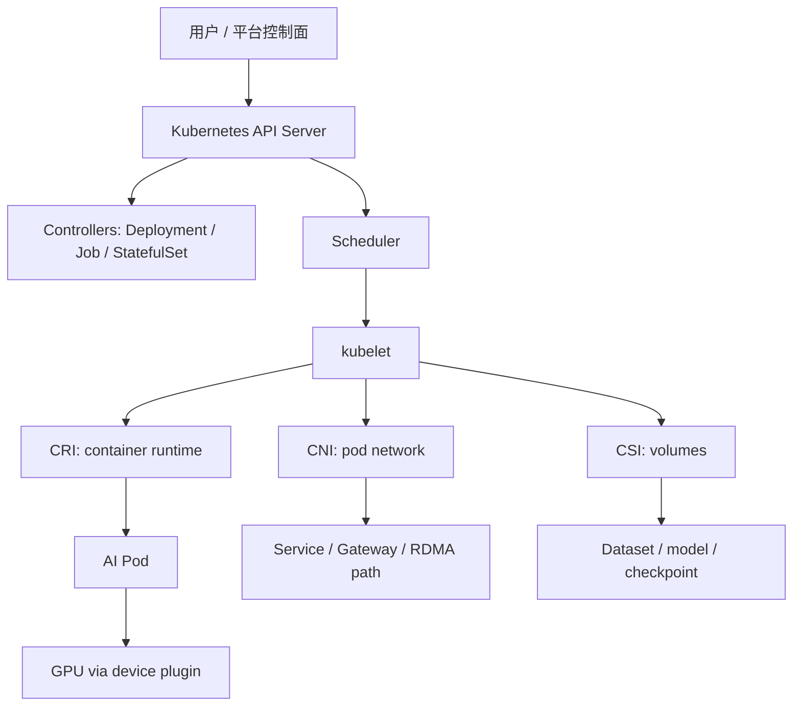

# 第 21 章：容器与 Kubernetes

## 本章回答的问题

- 容器和 Kubernetes 在 AI Factory 中承担什么职责？
- Pod、Deployment、Job、StatefulSet、Service、Scheduler、CNI、CSI、CRI 如何协同？
- 为什么 Kubernetes 是资源编排与作业调度层的一部分，而不是简单的 AI PaaS？

## 一个真实场景

一个模型服务在开发环境中用 Docker 运行正常，迁到生产 Kubernetes 后频繁启动失败。排查发现，镜像里 CUDA 用户态库和节点驱动支持范围不匹配；Pod 已经 Running，但模型权重仍在下载，readiness probe 过早通过；Service 对 streaming 响应的超时设置过短，长回答被中断；调度器只按 GPU 数量放置，没有考虑节点镜像缓存和模型加载时间。每一层都“基本正确”，组合起来却无法稳定服务。

这个场景说明，容器和 Kubernetes 提供的是标准化底座，不是 AI workload 的完整答案。容器能封装运行环境，但无法自动保证 driver、CUDA、NCCL、RDMA 和模型权重一致；Kubernetes 能编排 Pod，但默认调度器不理解 gang scheduling、GPU 拓扑、KV Cache、checkpoint 和 token 指标。AI Factory 需要利用 Kubernetes 的控制面能力，同时补足 AI 语义。

因此，本章不会把 Kubernetes 当成“万能平台”，也不会把它简单归入 PaaS。它位于资源编排与作业调度层：向上支撑 MaaS、模型服务、微调、评测和训练平台，向下依赖 GPU IaaS、网络、存储和物理节点。理解这层边界，才能正确设计后续 GPU on Kubernetes、队列调度和多集群能力。

这个场景还提醒我们：Kubernetes 事件通常只描述对象状态，不自动解释 AI 语义。`PodScheduled` 不代表 GPU 拓扑合适，`ContainersReady` 不代表模型可以接流量，`JobComplete` 不代表业务结果已校验。平台要把 Kubernetes 状态翻译成 AI workload 状态，用户和 SRE 才能基于同一事实排障。

所以迁移到 Kubernetes 的第一步，不是把 Docker 命令改成 YAML，而是定义生产状态机。模型服务什么时候算可接流量，训练任务什么时候算真正开始，批任务什么时候算完成，失败后由谁恢复，都要在平台层明确。没有这些语义，Kubernetes 只能告诉你容器状态，不能告诉你 AI 业务是否健康。

## 核心概念

容器负责封装进程运行环境，包括文件系统、依赖、启动命令、环境变量和资源隔离。它解决“同一程序如何在不同机器上以相同方式启动”的问题，但不解决“是否有正确 GPU、网络、存储和调度策略”的问题。AI 镜像通常包含 Python、CUDA runtime、框架、推理引擎、业务代码和工具链，因此镜像本身就是 runtime 基线的一部分。

Kubernetes 负责把期望状态转化为集群中的实际状态。用户提交 Pod、Deployment、Job、StatefulSet、Service 等对象，API Server 保存期望，Scheduler 选择节点，kubelet 通过 CRI 创建容器，通过 CNI 准备网络，通过 CSI 挂载存储。控制器不断比较期望和现实，重建失败副本、推进滚动升级或更新任务状态。这套控制循环非常适合大规模平台化。

在 AI Factory 中，Kubernetes 的价值是提供统一 API、声明式控制器、生态扩展和资源抽象。它不是 MaaS 本身，也不是模型平台本身。MaaS、AI Gateway、Agent Platform 和 Billing 属于 Platform 层；Kubernetes、容器、调度器和作业控制器属于资源编排与作业调度层。把层次分清，才能避免把业务平台需求硬塞进底层 Pod 语义。

还要区分 Kubernetes API 和平台 API。Kubernetes API 面向资源对象，平台 API 面向模型、任务、租户、数据和成本。成熟平台通常不会让所有用户直接编写复杂 Pod YAML，而是提供领域化入口，再生成底层 Kubernetes 对象。这样既保留 Kubernetes 的标准化能力，又避免用户被底层细节淹没。

这也解释了为什么 Kubernetes 不应被叫作 AI PaaS 的全部。它提供执行和控制基础，但不负责理解 token、模型版本、评测报告、租户账单和业务 SLA。AI PaaS 建在 Kubernetes 之上，而不是等同于 Kubernetes。层次混淆会导致平台职责失焦。

## 系统架构

Kubernetes 的核心链路从 API Server 开始。用户或上层平台提交对象，API Server 存储期望状态；Controller Manager 维护 Deployment、Job、StatefulSet 等控制器；Scheduler 为待调度 Pod 选择节点；kubelet 在节点上调用 CRI 创建容器，调用 CNI 配置网络，调用 CSI 挂载卷；容器运行后，通过 Service、Ingress 或 Gateway 被访问。每一步都可能影响 AI workload。

AI 场景中，这条链路还要接入 GPU、模型和数据。镜像需要匹配节点软件栈，Pod 需要申请 GPU 或 RDMA 设备，CSI 需要挂载模型权重、数据集或 checkpoint，CNI 可能影响 NCCL 或在线推理延迟，Service 和网关影响 streaming，Scheduler 影响 GPU 型号和拓扑。Kubernetes 提供扩展点，但这些扩展点需要平台工程实现。

架构设计时，应避免两种误解。第一种是“只要上 Kubernetes 就云原生了”，忽略 AI workload 对硬件和 runtime 的强依赖；第二种是“AI 太特殊，Kubernetes 没用”，忽略它在控制器、API、生态和多租户治理上的价值。正确做法是在 Kubernetes 基础上建立 AI 作业、模型服务、GPU 调度和观测抽象，让它成为资源编排底座，而不是业务语义的全部。

这也决定了系统 owner。Kubernetes 集群团队负责 API、节点、网络、存储和基础控制器；AI 平台团队负责模型服务、训练任务和评测语义；GPU IaaS 团队负责节点基线和驱动；SRE 负责跨层 SLO 和故障响应。架构图如果不能帮助划分责任，就不足以支撑生产运维。

架构还应体现控制流和数据流。控制流是 API、调度、kubelet 和控制器；数据流是请求、token、数据集、checkpoint、模型权重和 GPU 通信。AI 故障常常跨越这两条路径，例如控制面认为 Pod 已经就绪，数据面却因为模型权重加载慢无法服务。两条路径都要观测。



## 21.1 container runtime

Container runtime 负责拉取镜像、创建容器、挂载文件系统、设置 namespace/cgroup、注入环境变量并启动进程。Kubernetes 通过 CRI 与 containerd、CRI-O 等 runtime 交互。对普通服务来说，runtime 主要影响启动和隔离；对 AI workload 来说，它还影响 GPU 设备、driver library、共享内存、RDMA 设备、模型缓存和大镜像拉取。

AI 容器通常不是轻量镜像。训练镜像可能包含 PyTorch、DeepSpeed、Megatron-LM、CUDA、NCCL 和数据工具；推理镜像可能包含 vLLM、SGLang、TensorRT-LLM、模型服务框架和 tokenizer。Runtime 必须与 NVIDIA Container Toolkit、GPU device plugin 和主机 driver 协同，才能让容器看到 GPU。容器启动成功，不代表 GPU 路径可用；容器内 `nvidia-smi` 成功，也不代表 NCCL 或模型服务可用。

工程上，应把 runtime 相关失败拆分清楚：镜像拉取慢、容器创建失败、GPU 设备注入失败、共享内存不足、权限不足、启动命令失败、模型加载失败。不同失败需要不同 owner。平台还应控制镜像预热、镜像缓存、runtime class、security context 和大模型权重缓存。Container runtime 是 Pod 生命周期的执行点，也是 AI 环境一致性的第一道门。

Runtime 验收要分层。最小容器验证 CRI 和设备注入，基础 AI 镜像验证 CUDA 和框架加载，真实业务镜像验证模型启动和健康检查。只测最小容器会漏掉依赖问题，只测业务镜像会难以归因。分层 smoke test 能把“容器起不来”拆成可修复的具体问题。

运行时还影响安全边界。AI 容器可能需要访问 GPU、RDMA、共享内存和本地 NVMe，但不应因此默认 privileged。平台要用最小权限表达设备需求，并记录哪些 capability 被开放。否则可用性问题解决了，隔离风险又会扩大。

安全与性能必须一起设计，不能事后补丁式处理。

## 21.2 image

Image 是容器运行环境的不可变封装。AI 镜像通常包含 OS 基线、Python、CUDA runtime、cuDNN、NCCL、框架、推理引擎、业务代码和启动脚本。镜像版本会直接影响性能、兼容性、可复现性和安全修复。一个看似普通的镜像升级，可能同时改变 CUDA、NCCL、PyTorch 和 tokenizer 行为。

生产环境需要镜像基线。训练镜像、推理镜像、数据处理镜像和评测镜像应分别管理，因为它们的依赖和升级节奏不同。镜像 tag 不应使用 floating tag，生产任务应记录 image digest。基础镜像应由平台维护，业务层镜像在其上扩展。否则每个团队复制一套 CUDA 基础环境，漏洞修复、驱动兼容和性能回归都会失控。

AI 镜像还涉及分发成本。大镜像拉取会拖慢 Pod 启动，在线推理扩容时尤其明显；跨集群部署还需要镜像同步；私有化环境可能需要离线镜像仓库。平台应支持镜像预拉取、节点缓存、分层优化和镜像准入检查。镜像不是单纯交付包，而是 AI Runtime 的版本化契约。没有镜像治理，就没有可靠的训练和推理复现。

镜像治理还要包括安全和生命周期。基础镜像发现漏洞后，平台要知道哪些业务镜像继承了它，哪些任务仍在使用旧 digest，哪些集群尚未同步。对训练任务而言，旧镜像可能是复现实验所必需；对在线服务而言，旧镜像可能是安全风险。平台需要在复现和安全修复之间建立明确策略。

镜像还应和模型权重分离治理。把大模型权重直接打进镜像会让发布和拉取成本巨大，也让模型版本与代码版本耦合。常见做法是镜像携带服务代码和 runtime，模型权重通过模型仓库、对象存储或节点缓存加载。这样升级代码和切换模型可以有不同节奏。

## 21.3 pod

Pod 是 Kubernetes 的最小调度单元，一个 Pod 可以包含一个或多个容器，共享网络 namespace 和部分存储卷。在线推理通常以 Pod 承载模型服务副本，微调或评测可以用 Pod 执行任务，分布式训练则由多个 Pod 组成 worker group。Pod 是 Kubernetes 调度和生命周期管理的基本对象，但 AI 任务的完整语义往往超出单 Pod。

Pod 的资源请求可以包括 CPU、memory、ephemeral storage、`nvidia.com/gpu`、MIG 资源、RDMA 设备和本地 NVMe。AI 场景下，Pod Running 不等于服务 Ready。模型权重可能仍在下载，GPU context 可能仍在初始化，NCCL 进程组可能尚未建立，推理服务可能还在 warmup。Readiness probe 应反映模型可服务状态，而不是只检查进程端口。

工程上，Pod 应带有清晰标签：workload type、tenant、model、runtime、queue、experiment、cost center。没有标签，监控、计费和排障都会断裂。还要谨慎使用 init container、sidecar 和 emptyDir：模型下载、tokenizer 缓存、日志采集和共享内存都可能影响启动时间和稳定性。Pod 是底层单元，不应承载所有业务语义；上层控制器需要把多个 Pod 组织成完整 workload。

Pod 生命周期也要被重新解释。Pending 可能表示 quota 不足、拓扑不满足或镜像拉取慢；Running 可能只是容器进程启动；Ready 才接近可服务，但仍要看模型级健康；Terminating 可能需要保存 checkpoint 或排空请求。平台应把这些 Kubernetes 状态映射成用户可理解的 AI 任务状态。

Pod 还要处理退出和清理。在线推理要先从流量中摘除，再等待 streaming 请求结束；训练 worker 退出前可能要保存 checkpoint 或同步失败状态；批任务要写出完成标记。若直接依赖默认终止行为，可能造成请求中断、状态丢失或重复处理。

Graceful termination 是 AI Pod 的生产必需项。

## 21.4 deployment

Deployment 管理无状态副本，提供副本数控制、滚动升级、回滚和 ReplicaSet 管理。它适合 AI Gateway、控制面服务、在线模型服务副本和部分轻量推理服务。对于在线推理，Deployment 常与 HPA、KEDA 或自定义 autoscaler 配合，根据 QPS、队列长度、GPU 利用率、tokens/s 或延迟指标扩缩容。

大型模型服务使用 Deployment 时要谨慎。滚动升级会同时影响容量和显存，模型加载慢会延长 rollout，冷启动会拉高 TTFT。若 readiness probe 过早通过，流量会打到未 warmup 的副本；若 maxUnavailable 设置不当，升级期间可用容量不足。Deployment 的默认 Web 服务经验不能直接套到大模型推理。Canary、蓝绿发布、流量镜像和容量预留更适合关键模型服务。

工程上，应把模型版本、镜像 digest、推理引擎版本、配置版本和流量策略写入 Deployment 或上层 CRD。回滚不只是回滚容器镜像，还可能要回滚模型权重、tokenizer、prompt 模板和 engine 配置。Deployment 是在线服务的 Kubernetes 执行工具，真正的模型发布语义通常需要模型服务控制器或平台层来管理。

Deployment 的扩缩容指标也要谨慎选择。CPU 利用率对 LLM 推理意义有限，GPU 利用率也不一定反映排队延迟。更好的信号可能是请求队列、TTFT、TPOT、tokens/s、KV Cache 压力和实例错误率。Autoscaler 如果指标不对，会在高峰时扩容过慢，或在低峰时过度保留昂贵 GPU。

Deployment 适合副本彼此可替换的服务。如果副本保存大量会话状态、KV Cache 亲和或本地模型缓存，平台还要考虑流量粘性和预热策略。否则滚动升级或扩缩容会改变缓存命中率，让性能在发布期间波动。

这要求发布系统理解模型状态，而不仅是容器状态。

## 21.5 job

Job 表示运行到完成的任务，适合批量推理、数据处理、评测、微调和单机训练。它提供完成状态、失败重试、并行度和生命周期管理。Job 的优势是简单、通用、与 Kubernetes 生态集成好；缺点是它的语义主要面向独立任务，不天然理解分布式训练的多角色 worker、gang scheduling、checkpoint 和拓扑。

AI 平台常在 Job 之上构建领域化任务。例如批量推理任务把输入切成 shard，每个 Job 处理一部分；评测任务运行固定模型和数据集，生成报告；微调任务用 Job 启动训练脚本。上层平台应管理输入输出、幂等性、失败重试和产物注册，而不是把所有逻辑留在用户脚本里。Job 成功不一定代表业务任务成功，输出校验和报告生成也应进入状态。

对于分布式训练，普通 Job 往往不够。需要 Training Operator、RayJob、Volcano PodGroup、Kueue workload 或自定义控制器来表达多 Pod 同步和作业级准入。工程上要避免把 64 个 worker 当成 64 个独立 Job。Job 是批任务的基础积木，但 AI Factory 需要在它之上补充作业语义、队列语义和恢复语义。

Job 的完成语义也要业务化。批量推理要确认输出完整，数据处理要确认质量报告，评测要确认报告产出，微调要确认模型注册。Kubernetes 只知道容器退出码，平台要知道业务产物是否有效。否则任务表面成功，后续流水线仍然会失败。

Job 的重试策略也要和幂等性匹配。可安全重试的 shard 可以自动重跑，不可幂等的写入要先做去重或事务保护。对于消耗昂贵 GPU 的任务，重试次数不能无限增加，应根据失败类型区分用户错误、平台错误和临时资源错误。

## 21.6 statefulset

StatefulSet 提供稳定网络标识、有序启动和稳定存储绑定，适合需要固定身份的服务。向量数据库、缓存系统、部分模型服务组件、参数服务器、控制面数据库或有状态队列都可能使用 StatefulSet。它保证 Pod 名称和持久卷关系稳定，这对集群成员发现和数据持久化很有价值。

但 StatefulSet 不等于分布式训练调度。它能提供稳定身份，却不能自动处理 gang scheduling、队列、配额、拓扑感知、抢占和 checkpoint。把训练 worker 放进 StatefulSet，可能解决 hostname 稳定问题，却无法解决作业是否整体准入、失败后如何恢复、节点拓扑是否合适。需要分清“有状态副本管理”和“批式作业调度”。

工程上，使用 StatefulSet 时要关注存储和升级。每个副本绑定的 PVC 是否足够快，滚动升级是否会影响 quorum，Pod 删除后数据是否保留，扩缩容是否会产生孤儿卷。对于 AI 平台组件，StatefulSet 的健康直接影响上层服务，例如向量数据库慢会拖慢 RAG，缓存异常会影响推理延迟。StatefulSet 是有状态基础设施工具，不应被滥用于所有需要稳定名称的 AI 任务。

StatefulSet 的备份和恢复也要纳入平台设计。有状态组件一旦损坏，影响可能不是单个 Pod，而是知识库、索引、缓存或控制面状态。AI Factory 应明确哪些 StatefulSet 属于关键路径，哪些只是可重建缓存。不同类型的恢复策略和 RPO/RTO 不能相同。

StatefulSet 还会影响调度灵活性。绑定 PVC 的副本不容易跨节点迁移，如果底层存储或节点出现问题，恢复速度取决于存储系统能力。对需要高可用的 AI 平台组件，应评估副本数、反亲和、备份和跨故障域部署，而不是只创建一个 StatefulSet。

## 21.7 service

Service 为 Pod 提供稳定访问入口和负载均衡。在线推理服务通常通过 Service 被 AI Gateway、Ingress、服务网格或内部调用方访问。Service 解决的是服务发现和负载均衡入口，不解决模型路由、租户限流、token 计量、灰度发布和 fallback，这些通常属于 Platform 层的 AI Gateway 或模型服务控制面。

AI 推理对 Service 的要求比普通 HTTP 服务更复杂。Streaming 响应需要正确处理长连接、idle timeout、连接中断和客户端取消；负载均衡策略会影响 KV Cache 命中、会话亲和和实例压力；同一个模型的不同副本可能因为显存状态、batch 队列和上下文缓存不同而表现差异明显。Service 的简单 round-robin 不一定适合所有推理场景。

工程上，应把 Service、Gateway 和模型路由一起设计。Service 提供 Kubernetes 内部稳定端点，AI Gateway 负责认证、限流、模型路由、计量和观测，模型服务负责 batching 和 token streaming。若把所有能力塞进 Service 层，会违背分层；若 Service timeout 与 Gateway timeout 不一致，会导致难以解释的中断。Service 是网络基础设施，不是 AI 平台策略中心。

Service 排障要看端到端路径。请求可能经过 DNS、Service、kube-proxy 或 eBPF datapath、Ingress/Gateway、模型服务和上游客户端。长连接、重试和连接池都会改变表现。AI 平台应把 request id 或 trace id 贯穿这些层，否则 streaming 中断只能在多个日志系统之间人工拼接。

Service 也不应承担租户级策略。租户鉴权、限流、模型路由、计量和审计属于网关或平台层。把这些策略散落到多个 Service 和应用实例中，会导致策略不一致。Service 应保持基础网络职责，复杂 AI 策略应集中治理。

分层清楚，策略才能统一生效。

否则同一租户在不同服务上的行为会不一致。

## 21.8 scheduler

Kubernetes Scheduler 负责把 Pod 放到合适节点。默认调度器会考虑资源请求、节点选择、亲和性、污点容忍、拓扑扩展约束和插件评分。它适合大量通用服务，但 AI workload 通常需要更多语义：GPU 型号、MIG profile、NUMA、NVLink、RDMA NIC、节点健康、镜像缓存、队列、配额、gang scheduling、优先级和抢占。

这并不意味着默认 Scheduler 无用。它仍是 Pod 放置的核心执行器，也提供插件扩展和生态集成。问题在于，AI Factory 需要在默认能力之上增加作业级调度和资源治理。Volcano、Kueue、自定义 scheduler plugin、Training Operator、Ray Operator 或 Slurm 集成，都是为了把 Pod 级调度提升到 workload 级决策。调度对象从单个 Pod 扩展到作业、队列和租户。

工程上，Scheduler 应与资源库存、节点健康、GPU 拓扑和队列系统联动。一个 Pod 申请 8 张 GPU，不等于任意 8 张 GPU 都合适；一个训练任务 pending，不应只显示“资源不足”，而应说明是 GPU 型号、quota、gang、拓扑还是节点健康不满足。可解释 pending 是 AI 调度平台的重要能力。Scheduler 的价值不仅是放置成功，还包括拒绝不合适的放置。

Scheduler 还需要与上层队列协调。队列决定作业是否准入，Scheduler 决定 Pod 放在哪里；如果二者各自为政，就会出现已准入但无法放置、或低优先级 Pod 抢先占位的问题。AI Factory 应把 queue、quota、priority、gang 和 placement 设计成一个控制闭环。

调度结果还要进入审计。训练任务为什么拿到这组节点，在线服务为什么没有扩容，批任务为什么被抢占，平台都应能回答。没有调度审计，资源争议会变成口头解释。GPU 稀缺时，可解释性就是用户信任的一部分。

审计记录也能反向改进调度策略。

## 21.9 CNI、CSI、CRI

CNI、CSI、CRI 是 kubelet 连接网络、存储和容器运行时的接口。CRI 影响容器创建、镜像管理、runtime class、设备注入和进程状态；CNI 影响 Pod 网络、Service 连通、网络策略和高性能网络接入；CSI 影响数据集、模型权重、checkpoint、日志和缓存的挂载。AI 场景下，这些接口不是底层细节，而是性能和可靠性的关键路径。

CNI 对在线推理和分布式训练都有影响。在线推理关注延迟、连接数、streaming 和网关路径；训练关注 RDMA、RoCE/IB、Pod 到 Pod 通信、hostNetwork 或多网卡策略。CSI 对训练和微调影响同样明显：数据读取慢会让 GPU 等待，checkpoint 写入慢会延长 step，模型权重挂载慢会拖慢扩容。CRI 则决定 GPU 设备和 driver library 是否正确进入容器。

工程上，应为 CNI、CSI、CRI 建立 workload 级验收。不要只验证 Pod 能 ping 通或卷能挂载，而要验证 NCCL 通信、对象存储吞吐、模型加载、checkpoint、streaming 超时和容器 GPU smoke test。接口选择会影响平台能力：某些 CNI 更适合高性能网络，某些 CSI 更适合大模型权重和 checkpoint，某些 runtime 配置更适合 GPU 设备注入。接口层质量决定上层 AI workload 的实际体验。

接口层变更应按基础设施变更管理。升级 CNI 可能影响延迟和网络策略，升级 CSI 可能影响 checkpoint，升级 container runtime 可能影响 GPU 注入。每次变更都应有代表性 AI workload 回归，而不是只跑通用 Kubernetes conformance。

CNI、CSI、CRI 的 owner 也要清楚。网络团队可能维护 CNI，存储团队维护 CSI，平台团队维护 runtime 配置，但一个 AI 任务失败会同时穿过三者。统一的故障报告应能把错误定位到具体接口层，而不是只显示 Pod 启动失败。

接口层 owner 清楚，跨团队排障才会收敛。

## 工程实现

生产模型服务的 Kubernetes 配置应显式表达镜像、资源、健康检查、模型加载和观测标签。最小 Deployment 只能说明容器如何启动，不能完整表达模型服务生命周期。平台通常会在 Deployment 之上增加 ModelService、InferenceService 或自定义 CRD，用于记录模型版本、engine、并发、SLO、灰度和路由策略。

示例配置如下：

```yaml
apiVersion: apps/v1
kind: Deployment
spec:
  template:
    metadata:
      labels:
        workload.ai-factory/type: online-inference
        model.ai-factory/name: chat-model
    spec:
      containers:
        - name: model-server
          image: registry.example.com/inference:baseline
          resources:
            limits:
              nvidia.com/gpu: 1
          readinessProbe:
            httpGet:
              path: /ready
              port: 8080
```

实际生产还应加入节点选择、拓扑标签、runtime class、模型缓存、Service、Gateway、日志、metrics、trace 和安全策略。对于 Job 和训练任务，则需要补充 queue、quota、gang、checkpoint 和数据路径。工程实现的原则是：Kubernetes 对象负责表达基础运行形态，上层 AI 平台对象负责表达模型、数据和业务语义。两者边界清晰，系统才可维护。

实现还应提供生成和审计能力。平台可以从 ModelService 或 TrainingJob 生成底层 Deployment、Job、Service 和 ConfigMap，并保留 ownerReference、label 和 trace id。用户不必手写所有 YAML，SRE 仍能追踪到底层对象。生成物应可审计，避免平台黑盒化。

最小生产实现还应包含准入检查：镜像是否来自受信仓库，资源请求是否符合 workload 类型，GPU 节点是否通过基线，Service timeout 是否适合 streaming，Job 是否配置输出和重试。把这些检查前置，比运行后排障更便宜。

生产实现还应提供对象关联视图。用户看到一个模型服务时，应能看到生成的 Deployment、ReplicaSet、Pod、Service、ConfigMap、HPA 和 Gateway；看到一个训练任务时，应能看到队列对象、PodGroup、worker Pod、PVC 和事件。关联视图能减少在 kubectl 输出之间手工跳转的成本。

同时，平台要保留反向映射：从任意 Pod 也能找到所属模型服务、训练任务、租户和成本中心。没有反向映射，节点级告警很难快速定位业务影响。对象关联和反向映射共同构成 Kubernetes 到 AI 平台语义的桥梁。

## 常见故障

第一类故障是镜像与节点基线不兼容。容器内 CUDA、NCCL 或框架版本与主机 driver、RDMA 栈不匹配，表现为 GPU 不可用、NCCL 失败或性能回退。第二类故障是健康检查过浅。Pod Ready 只代表进程启动，模型权重、GPU 初始化、warmup 和路由并未完成，流量过早进入导致超时或高 TTFT。

第三类故障是 Service 或 Gateway 配置不适合 streaming。Idle timeout、连接复用、负载均衡和重试策略设置不当，会导致长输出中断、重复请求或 KV Cache 命中下降。第四类故障是 Job 重试语义不理解业务状态。批量推理重复写输出，微调失败后丢失 checkpoint，评测任务成功但报告不完整，都不是 Kubernetes 原生状态能完全表达的。

第五类故障是调度只看 GPU 数量。Pod 被放到没有模型缓存、拓扑不合适、RDMA 不可用或节点健康可疑的机器上。第六类故障是 CNI/CSI/CRI 被忽视：网络插件导致延迟抖动，存储插件导致 checkpoint 慢，runtime 配置导致 GPU 注入失败。排障时应沿 API、Scheduler、kubelet、CRI/CNI/CSI、容器和应用逐层检查。

还有一类故障来自控制器误用。Deployment 用于需要全局一致恢复的训练，Job 用于长期在线服务，StatefulSet 用于不需要稳定状态的临时任务，都会让 Kubernetes 行为和业务预期不一致。选择对象类型本身就是架构决策。

故障处理要保留 Kubernetes 原始事件，但最终要转译成 AI 平台语言。例如“ImagePullBackOff”应说明影响哪个模型服务，“Unschedulable”应说明缺少哪类 GPU 或拓扑，“Readiness failed”应说明是模型加载还是应用端口问题。

这类翻译是平台体验的一部分，不是可有可无的包装。

错误语言越接近用户目标，恢复越快。

也越能减少无效升级。

## 性能指标

Kubernetes 基础指标包括 Pod 启动时间、镜像拉取时间、调度等待时间、容器创建失败率、Pod restart、Deployment rollout 成功率、Job 成功率和节点 pressure。AI 场景要进一步拆分：模型加载时间、GPU 初始化时间、readiness 延迟、模型 warmup 时间、模型缓存命中和推理服务可用时间。只有拆开这些阶段，才能解释扩容慢的根因。

网络和存储指标同样重要。CNI 需要关注 Pod 网络延迟、丢包、连接错误、Service 超时、RDMA 路径和网卡带宽；CSI 需要关注挂载时间、读写吞吐、metadata 延迟、checkpoint 写入时间和模型权重加载时间；CRI 需要关注镜像解压、容器创建、设备注入和 runtime 错误。这些指标直接影响训练 step、推理 TTFT 和批处理完成时间。

平台层还应按 workload 聚合 Kubernetes 指标。Online inference 看 rollout 是否影响 SLO，training 看 gang 准入和 worker 启动是否一致，batch inference 看 Job shard 成功率，fine-tuning 看租户并发和失败原因。Kubernetes 原始指标只有与 AI workload 语义结合，才能从运维噪声变成工程决策依据。

指标也要支持从业务下钻到底层。一次 TTFT 升高，应能看到是否发生 Deployment rollout、Pod 重启、镜像拉取、Service 错误或节点压力。一次训练 pending，应能看到队列、quota、拓扑和节点健康。没有下钻路径，Kubernetes 指标会停留在集群运维层，无法支撑 AI 平台运营。

指标保留周期要覆盖发布和训练周期。在线服务可能只需要分钟级排障，训练任务可能要追溯数天前的节点和网络状态。统一采样而不考虑 workload 生命周期，会导致关键证据过早丢失。

指标标签也必须稳定，否则长期对比会失真。

标签变更应像 API 变更一样管理。

否则 dashboard 会断裂。

## 设计取舍

第一个取舍是 Kubernetes 原生对象与 AI 平台 CRD。直接使用 Deployment、Job 和 Service 简单、通用、学习成本低；但模型版本、token 指标、checkpoint、gang、评测报告和计费标签难以完整表达。自定义 CRD 能表达 AI 语义，但会增加平台维护成本。较好的做法是以 Kubernetes 原生对象为执行层，在上层 CRD 中表达模型和作业语义。

第二个取舍是通用调度与专用调度。默认 Scheduler 稳定、生态好，但不理解复杂 AI 需求；专用调度器或插件能处理队列、拓扑和 gang，但引入更多组件。平台应根据 workload 风险选择：普通控制面和轻量服务使用默认调度，大规模训练和关键 GPU workload 使用扩展调度。不要为了统一而牺牲训练效率，也不要为了特殊而破坏平台一致性。

第三个取舍是自动化与可控性。Kubernetes 鼓励声明式自动化，自动重启、滚动升级和自愈都很有价值；但 AI workload 中，自动重启可能浪费 checkpoint，滚动升级可能造成模型冷启动，自愈可能把任务放到未验收节点。自动化策略应理解 workload 语义。Kubernetes 是强大的底座，但 AI Factory 的质量来自底座能力和 AI 语义的正确结合。

第四个取舍是生态复用与平台约束。直接使用社区组件可以降低建设成本，但组件默认假设未必适合大模型训练和推理；完全自研可以精确表达需求，却增加维护负担。务实做法是复用 Kubernetes 的成熟控制面和生态，在 AI 关键路径上增加受控扩展。不要为了“原生”牺牲生产需求，也不要为了“定制”放弃生态红利。

取舍的标准应是长期可维护，而不是短期概念统一。

能稳定运行、能解释故障、能低成本升级，才是好的 Kubernetes 方案。

## 小结

- 容器封装运行环境，但 AI 镜像必须治理 CUDA、NCCL、框架和推理引擎版本。
- Kubernetes 提供声明式 API、控制器、调度、Service、CNI、CSI 和 CRI，是资源编排底座。
- Deployment 适合在线服务，Job 适合批任务，StatefulSet 适合有状态组件，但都需要 AI 语义补充。
- 默认 Scheduler 不足以覆盖所有 AI workload，需要队列、配额、gang、GPU 和拓扑扩展。
- CNI、CSI、CRI 会直接影响网络、存储、容器运行时和 GPU 可用性。

## 延伸阅读

- [Kubernetes Concepts documentation](https://kubernetes.io/docs/concepts/)
- [Large-scale cluster management at Google with Borg](https://research.google/pubs/large-scale-cluster-management-at-google-with-borg/)
- [Open Container Initiative Runtime Specification](https://github.com/opencontainers/runtime-spec)
