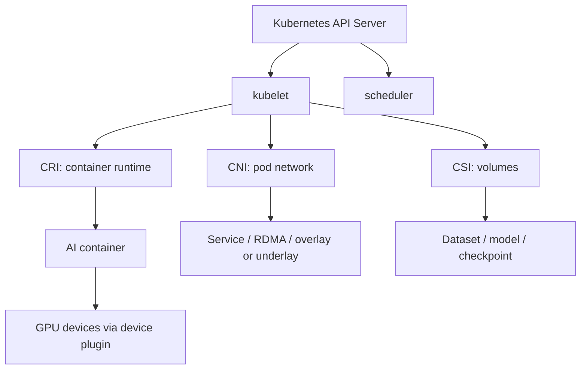

# 第 21 章：容器与 Kubernetes

## 本章回答的问题

- 容器和 Kubernetes 在 AI Factory 中承担什么职责？
- Pod、Deployment、Job、StatefulSet、Service、Scheduler、CNI、CSI、CRI 如何协同？
- 为什么 Kubernetes 是资源编排与作业调度层的一部分，而不是简单的 AI PaaS？

## 一个真实场景

一个模型服务在开发环境运行正常，迁到生产 Kubernetes 后启动失败。容器里缺少匹配的 CUDA 用户态库，节点驱动版本和镜像基线不一致，Service 超时又导致 streaming 被中断。问题跨越 image、runtime、GPU 注入、Service 和网关。

容器与 Kubernetes 提供了标准化底座，但 AI workload 对镜像、设备、网络和存储的要求更严格。

## 核心概念

容器负责封装运行环境，Kubernetes 负责编排 Pod、控制器、Service、调度和扩展资源。它们位于资源编排与作业调度层，向上支撑 MaaS、模型服务、训练任务和平台组件，向下依赖 GPU IaaS、网络、存储和物理节点。

## 系统架构

Kubernetes 的核心关系可以理解为：API Server 接收期望状态，Scheduler 选择节点，kubelet 调用 CRI/CNI/CSI 准备运行环境，控制器维持 Deployment、Job 和 StatefulSet 等工作负载状态。

## 21.1 container runtime

Container runtime 负责拉取镜像、创建容器、挂载文件系统、设置 namespace/cgroup，并启动进程。Kubernetes 通过 CRI 与 containerd、CRI-O 等 runtime 交互。AI workload 对 runtime 的要求更高，因为容器需要访问 GPU、RDMA 设备、共享内存、模型权重和高速存储。

推理和训练容器通常包含 Python、CUDA 用户态库、框架、推理引擎和业务代码。runtime 层必须和主机驱动、NVIDIA Container Toolkit、设备插件配合，才能把 GPU 设备和必要库正确注入容器。

## 21.2 image

Image 是容器运行环境的不可变封装。AI 镜像通常比普通服务镜像大得多，包含 CUDA、cuDNN、NCCL、PyTorch、vLLM、SGLang、TensorRT-LLM 或业务依赖。镜像版本会直接影响可复现性和故障定位。

生产环境应建立镜像基线：OS、Python、CUDA、NCCL、框架和推理引擎版本要可追溯。训练和推理镜像最好分层管理，避免每个团队复制一套大型基础镜像，导致漏洞修复和兼容性治理失控。

## 21.3 pod

Pod 是 Kubernetes 的最小调度单元。一个 Pod 可以包含一个或多个容器，共享网络 namespace 和部分存储卷。在线推理通常以 Pod 承载模型服务副本，训练任务则可能用多个 Pod 构成 worker group。

Pod 的资源请求不仅包括 CPU 和 memory，还可以包括 `nvidia.com/gpu`、MIG 资源、RDMA 设备和本地存储。AI 场景下，Pod 的启动并不等于服务可用；模型权重下载、GPU 初始化、NCCL 建连和健康检查都可能需要额外时间。

## 21.4 deployment

Deployment 管理无状态副本，适合在线 API、网关、控制面和部分模型服务。它提供滚动升级、回滚和副本数控制。对于在线推理，Deployment 常和 HPA、KEDA 或自定义 autoscaler 配合，根据 QPS、队列长度、GPU 利用率或 token 指标扩缩容。

但大型模型服务不一定适合频繁滚动升级。模型加载慢、显存占用高、冷启动成本大，升级时需要更谨慎的 canary、流量切换和容量预留。

## 21.5 job

Job 表示运行到完成的任务，适合批量推理、数据处理、评测、微调和单机训练。Job 失败后可以重试，但对分布式训练来说，普通 Job 的语义不够，需要更高层控制器管理多角色 worker、launcher 和 gang scheduling。

AI 平台常用 Job 作为底层抽象，再在上层封装训练任务、评测任务或数据处理任务。这样可以让用户提交领域化任务，同时保留 Kubernetes 的生命周期和状态管理能力。

## 21.6 statefulset

StatefulSet 提供稳定网络标识和有状态副本管理。它适合需要固定身份、固定存储或有序启动的服务。某些模型服务、向量数据库、缓存系统、参数服务器或控制面组件会使用 StatefulSet。

不过，StatefulSet 不等同于分布式训练调度。它能提供稳定身份，但不能自动解决队列、配额、gang scheduling 和拓扑感知问题。AI Factory 需要在工作负载控制器和调度器层补足这些语义。

## 21.7 service

Service 为 Pod 提供稳定访问入口和负载均衡。在线推理服务通常通过 Service 被网关或内部调用方访问。Service 解决的是服务发现问题，不解决模型路由、租户限流、token 计量和灰度策略，这些通常属于 AI Gateway 或 Platform 层。

对于 streaming 响应，Service 和上游网关还要正确处理长连接、超时和连接中断。负载均衡策略也会影响 KV Cache 命中率、会话亲和性和模型实例压力。

## 21.8 scheduler

Kubernetes Scheduler 负责把 Pod 放到合适节点。默认调度器根据资源请求、亲和性、污点容忍、拓扑约束等规则做决策。AI workload 往往需要更复杂的调度：GPU 型号、MIG 粒度、NUMA、NVLink、RDMA NIC、队列、配额、gang 和优先级。

因此，AI Factory 中的 Kubernetes 通常会扩展调度能力：使用 Volcano、Kueue、自定义 scheduler plugin，或结合 Slurm/Ray/Kubeflow 管理不同类型作业。Kubernetes 是资源编排与作业调度层的一部分，而不是 MaaS 本身。

## 21.9 CNI、CSI、CRI

CNI 负责容器网络，影响 Pod 连通性、Service、网络策略和高性能网络接入。CSI 负责存储卷接入，影响数据集、模型权重、checkpoint 和日志持久化。CRI 负责 kubelet 与 container runtime 的接口，影响容器创建、镜像管理和运行时状态。



AI 场景下，CNI、CSI、CRI 的选择不是底层细节。网络路径会影响 NCCL 和服务延迟，存储路径会影响数据读取和 checkpoint，runtime 兼容性会影响 GPU 是否能被容器正确使用。

## 工程实现

一个生产推理 Pod 至少应显式声明镜像、资源、健康检查和模型加载状态：

```yaml
apiVersion: apps/v1
kind: Deployment
spec:
  template:
    spec:
      containers:
        - name: model-server
          image: registry.example.com/inference:baseline
          resources:
            limits:
              nvidia.com/gpu: 1
          readinessProbe:
            httpGet:
              path: /ready
              port: 8080
```

实际生产还应加入节点选择、拓扑标签、模型缓存、Service 和观测标签。

## 常见故障

- 镜像和主机驱动版本不兼容，容器内无法使用 GPU。
- Pod Ready 只代表进程启动，不代表模型权重加载完成。
- Service 超时不适合 streaming，导致长输出中断。
- Job 重试策略不理解训练 checkpoint，失败后重复浪费 GPU。

## 性能指标

- Pod 启动时间、镜像拉取时间、模型加载时间。
- Deployment rollout 成功率、回滚次数、Ready 延迟。
- Job 成功率、重试次数、运行时长。
- CNI 网络延迟、CSI I/O 延迟、CRI 容器启动错误。

## 设计取舍

Kubernetes 生态强、扩展能力好，但默认语义面向通用服务。AI workload 需要在 Kubernetes 之上补充 GPU、队列、拓扑、gang scheduling 和模型生命周期。对 HPC 风格任务，Slurm 仍可能是更合适的选择。

## 小结

- 容器提供可复现运行环境，但 AI 镜像需要严格治理 CUDA、NCCL、框架和推理引擎版本。
- Kubernetes 提供 Pod、控制器、Service 和扩展机制，是 AI Factory 的资源编排与作业调度底座之一。
- Deployment 适合在线服务，Job 适合批式任务，StatefulSet 适合需要稳定身份的组件。
- 默认 scheduler 不足以覆盖所有 AI workload，需要队列、配额、gang、GPU 和拓扑扩展。
- CNI、CSI、CRI 会直接影响网络、存储和容器运行时的生产质量。

## 延伸阅读

- TODO: 官方文档
- TODO: 经典论文
- TODO: 工程案例
