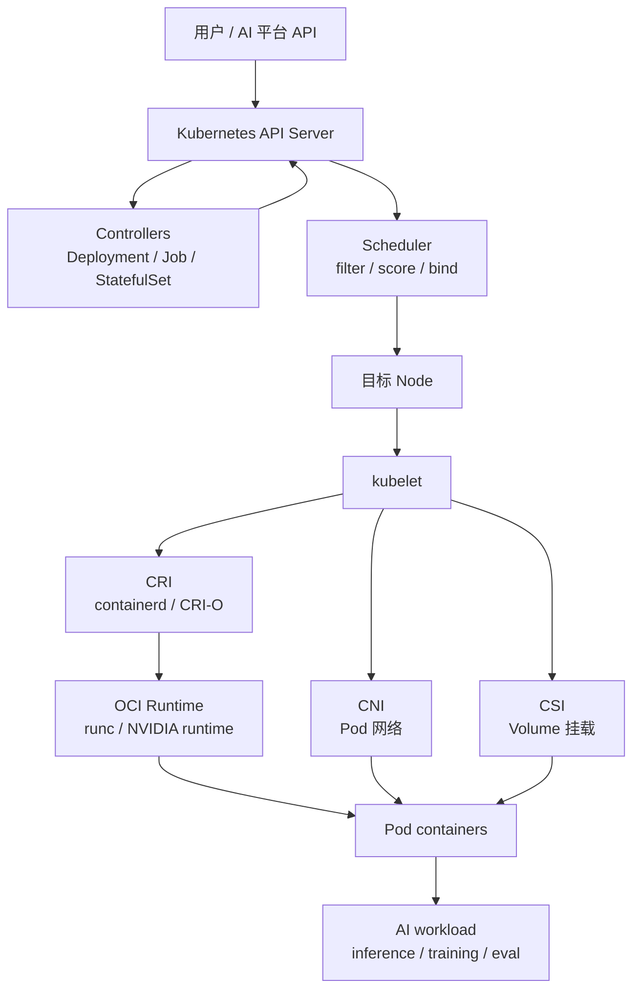
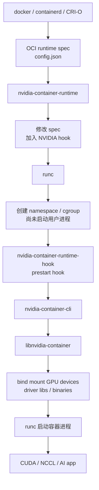

# 第 21 章：容器与 Kubernetes

## 本章回答的问题

- 容器到底隔离了什么，没有隔离什么？
- 为什么 AI 镜像不是一个普通业务镜像，而是 runtime 基线的一部分？
- Kubernetes 如何把一个期望状态变成运行中的 Pod？
- Pod、Deployment、Job、StatefulSet、Service、Scheduler、CNI、CSI、CRI 的边界分别是什么？
- NVIDIA GPU Container 的真实链路是什么：Docker/containerd、OCI spec、runc hook、nvidia-container-runtime、nvidia-container-runtime-hook、nvidia-container-cli 和 libnvidia-container 如何协同？
- 为什么 Kubernetes 属于“资源编排与作业调度层”，而不是 MaaS 或 GPU IaaS？

## 一个真实场景

一个模型服务在开发机上用 `docker run` 可以正常看到 GPU，迁入生产 Kubernetes 后却出现三类问题。第一类是 Pod 已经 `Running`，业务日志却显示 `libcuda.so.1` 加载失败；第二类是 `nvidia-smi` 在容器内可用，但推理引擎启动后 NCCL 初始化失败；第三类是滚动升级时新副本很快 `Ready`，流量进入后 TTFT 飙升，因为模型权重仍在下载，KV Cache 还未 warmup。运维同学从 Kubernetes 事件看，只能看到 Pod、容器和探针状态；模型平台同学从服务指标看，只能看到延迟和错误；GPU 平台同学从节点看，driver 又似乎正常。

这个场景的根因不是某个组件“坏了”，而是层次被混在一起。容器镜像包含用户态依赖，但 GPU driver 的内核模块和一部分 driver library 来自主机；Kubernetes 负责声明式编排，但不直接理解模型权重是否加载完成；NVIDIA Container Toolkit 负责把 GPU 设备和必要库注入容器，但不负责判断推理服务是否已经具备接流量能力；Service 负责稳定访问入口，但不负责模型路由、token 计量和 streaming 语义。任何一层被误认为“全能”，都会导致排障方向错误。

生产平台要把状态拆开：`PodScheduled` 只表示调度器选出了节点；`ContainerCreating` 涉及镜像、volume、CNI、CRI 和设备注入；`Running` 只表示容器进程被启动；`Ready` 应由业务探针证明模型可服务；`Endpoint` 加入后才会接流量；AI Gateway 的 request trace 还要继续证明 queue、prefill、decode 和 token streaming 正常。类似地，训练任务 `Pod Running` 不代表训练开始，只有所有 worker 完成 rendezvous、NCCL 拓扑建立、数据读取正常、首个 step 产生有效 loss，才接近“作业开始”。

因此，本章要建立一个硬边界：容器和 Kubernetes 是资源编排与作业调度层的基础能力，不是 AI Platform 的全部，也不是 GPU IaaS 的替代。GPU IaaS 交付节点、驱动、镜像基线、网络和存储资源；Kubernetes 把这些资源组织成可调度、可观测、可回滚的 workload；Platform 层在其上表达模型、租户、SLO、计费、评测和发布。第 22 章会进一步讨论 GPU device plugin、GPU Operator、MIG、time-slicing、Topology Manager 和 RDMA device；本章先讲清楚容器、Kubernetes 和 NVIDIA GPU Container 的底层原理。

## 核心概念

容器（container）不是轻量虚拟机。它本质上是一个带隔离边界的进程组：Linux namespace 隔离进程号、网络、挂载点、IPC、UTS 和用户视图；cgroup 限制 CPU、memory、pids、device 等资源；capability、seccomp、AppArmor 或 SELinux 收缩权限；rootfs 提供来自 image 的文件系统。容器复用宿主机 kernel，因此无法像 VM 那样携带自己的内核，也无法单靠镜像解决所有硬件驱动问题。

镜像（image）是分层文件系统和元数据的不可变封装。对普通后端服务来说，镜像通常包含语言运行时、业务二进制和配置入口；对 AI workload 来说，镜像还包含 CUDA runtime、cuDNN、NCCL、PyTorch、TensorRT-LLM、vLLM、SGLang、tokenizer、模型服务框架和诊断工具。镜像不是“打包一下代码”，而是训练和推理 runtime 的版本化契约。生产任务必须记录 image digest，而不是只记录可漂移的 tag。

OCI（Open Container Initiative）定义了镜像和运行时规范。容器运行时最终会把容器启动信息表达为一个 OCI runtime bundle，其中 `config.json` 描述进程、环境变量、mount、namespace、cgroup、capability、device 和 hooks。runc 是常见的低层 OCI runtime，它读 OCI spec，创建容器 namespace 和 cgroup，并启动用户进程。Docker、containerd、CRI-O 等上层运行时最终都要落到类似的低层运行时语义。

Kubernetes 是声明式控制系统。用户提交 Pod、Deployment、Job、StatefulSet、Service 等对象，API Server 保存期望状态，controller 持续把现实状态推向期望状态，Scheduler 负责 Pod 放置，kubelet 负责节点本地执行。kubelet 不直接实现所有能力，而是通过 CRI 调 container runtime，通过 CNI 准备 Pod 网络，通过 CSI 挂载存储，通过 device plugin 体系获取扩展设备资源。理解这些接口，才能定位“Pod 起不来”究竟是控制面、调度、网络、存储、运行时还是硬件设备问题。

GPU Container 的关键点是：容器内应用需要看到 GPU 设备文件、driver library、必要二进制和正确环境变量，但 GPU driver 的内核模块仍在宿主机上。NVIDIA Container Toolkit 的价值，是把“手动挂载 `/dev/nvidia*` 和一堆库文件”变成可由 Docker/containerd/runc 自动执行的标准化流程。它不是 GPU 调度器，也不是 Kubernetes device plugin；它位于容器运行时链路上，负责让已经被分配到容器的 GPU 能在容器内真正可用。

## 系统架构

Kubernetes 的控制流从 API Server 开始，到节点上的 kubelet 结束；容器运行时的数据面从 kubelet 进入 CRI，再进入 containerd 或 CRI-O，最后由 runc 创建容器。AI Factory 在这条链路上叠加了模型、GPU、网络、存储和队列语义。一个在线模型服务至少涉及 Deployment 或上层 ModelService、Pod、Service、Gateway、Secret、ConfigMap、PVC 或对象存储挂载、GPU 资源请求、节点标签、探针、日志、metrics 和 trace；一个训练任务还会涉及 Job 或 TrainingJob、PodGroup、queue、quota、gang scheduling、checkpoint 和数据集。



控制流和数据流要分开看。控制流回答“对象如何被创建、调度、启动、重启、升级、删除”；数据流回答“请求、token、模型权重、数据集、checkpoint、日志和指标如何流动”。很多 AI 故障来自两条路径不一致：控制面认为 Pod 已经 Ready，数据面上的模型权重还在下载；调度器认为 GPU 数量满足，训练数据面上的 RDMA rail 不通；Deployment rollout 成功，Gateway streaming timeout 却导致长回答中断。只看 Kubernetes 对象状态，无法解释完整 AI 体验。

NVIDIA GPU Container 链路是本章必须掌握的一条底层路径。最早的做法是手动把 `/dev/nvidia0`、`/dev/nvidiactl`、`/dev/nvidia-uvm` 和 driver library bind mount 进容器，或者使用 `--privileged` 把过多宿主能力暴露给容器。前者难维护，后者风险高。NVIDIA 先后提供过 `nvidia-docker`、`nvidia-docker2` 和 NVIDIA Container Toolkit。当前主线是 NVIDIA Container Toolkit：通过 `nvidia-container-runtime`、runtime hook、`nvidia-container-cli` 和 `libnvidia-container` 在 OCI runtime 生命周期中完成设备和库注入。



在 Kubernetes 中，GPU 还多一层资源发现和分配。NVIDIA device plugin 向 kubelet 注册 `nvidia.com/gpu` 或 MIG 资源，Scheduler 根据 Pod resource request 选择节点，kubelet 在创建容器时把分配结果传给 CRI，NVIDIA Container Toolkit 再在 runtime 链路中注入设备和库。也就是说，device plugin 解决“哪些 GPU 分给这个 Pod”，container toolkit 解决“这些 GPU 如何出现在容器里”。把两者混为一谈，会导致排障时不知道该看 kubelet/device plugin，还是看 runtime hook/libnvidia-container。

## 21.1 container runtime

Container runtime 是容器从声明变成进程的执行层。Docker Engine 面向用户体验，containerd 面向容器生命周期管理，CRI-O 面向 Kubernetes CRI，runc 面向 OCI spec。Kubernetes 节点上，kubelet 不应该直接调用 Docker CLI，而是通过 CRI 调用 containerd 或 CRI-O；后者准备 sandbox、image、container、log 和 exec，再调用低层 OCI runtime 创建容器。排障时看到 `CreateContainerError`、`RunContainerError`、`OCI runtime create failed`，通常已经进入运行时链路，而不是 Kubernetes API 本身的问题。

对 AI workload，runtime 的职责明显更重。它要拉取和解压大镜像，创建容器 rootfs，设置 cgroup device 规则，挂载 `emptyDir`、PVC、secret、configMap 和 hostPath，执行 OCI hook，注入 GPU、RDMA 或其他设备，设置共享内存和 IPC，并启动 Python、模型服务或训练 launcher。容器进程启动成功，只说明 runtime 走完了基本流程；CUDA、NCCL、模型加载和业务 readiness 仍要继续验证。

NVIDIA Container Toolkit 介入的正是 runtime 路径。`nvidia-container-runtime` 可以被 Docker 或 containerd 配置为一个 runtime。它接收上层传入的 OCI spec，修改其中的 hook 配置，然后调用底层 runc。runc 创建容器 namespace 后、启动用户进程前，调用 `nvidia-container-runtime-hook`。hook 解析 spec 中的环境变量和设备请求，例如 `NVIDIA_VISIBLE_DEVICES`、driver capabilities、mount 需求，再调用 `nvidia-container-cli`。`nvidia-container-cli` 进一步调用 `libnvidia-container`，把宿主机上的 GPU 设备节点、driver library 和必要二进制以 bind mount 方式注入容器。

这条链路解释了几个常见现象。第一，宿主机必须安装 NVIDIA driver，因为内核模块和 driver library 来自主机；容器镜像通常携带 CUDA runtime 和用户态框架，但不替代宿主机 driver。第二，`--privileged` 可以“看见 GPU”，但它绕开了最小权限原则，把过多宿主能力交给容器，不适合作为生产方案。第三，`nvidia-smi` 可用不等于 NCCL 可用，因为 NCCL 还依赖网络、拓扑、RDMA、版本和通信路径。第四，runtime hook 报错常常出现在容器创建阶段，Kubernetes 事件里可能只显示 OCI runtime 失败，需要到 containerd、kubelet 和 hook 日志里继续追。

生产检查可以从四层开始：主机层看 `nvidia-smi`、driver、`/dev/nvidia*`、`ldconfig`；runtime 层看 `nvidia-ctk runtime configure` 是否写入 Docker/containerd 配置；容器层跑 `docker run --gpus all nvidia/cuda:<tag> nvidia-smi` 或等价 containerd smoke test；Kubernetes 层看 device plugin、Pod resource request、kubelet event 和容器内 CUDA/NCCL 测试。不要只跑一个 `nvidia-smi` 就宣布 GPU 容器链路健康。

## 21.2 image

AI 镜像的核心矛盾是“可复现”和“可交付”。镜像越完整，复现越容易，但体积越大、分发越慢、漏洞面越大；镜像越薄，发布越快，但依赖外部环境越多。生产平台通常把镜像分为基础镜像和业务镜像：基础镜像由平台维护，包含 OS、Python、CUDA runtime、cuDNN、NCCL、PyTorch 或推理引擎基线；业务镜像在其上加入模型服务代码、训练脚本、评测逻辑和配置入口。基础镜像升级必须经过兼容性和性能回归，业务镜像升级必须能追溯到 commit、digest 和配置版本。

GPU 镜像还必须理解 driver/runtime 边界。CUDA Toolkit 包含编译器、runtime library 和开发工具；NVIDIA driver 包含内核模块和 driver API library。容器内通常不安装内核 driver，宿主机 driver 通过 NVIDIA Container Toolkit 暴露给容器。CUDA runtime 与 driver 有兼容范围，但“理论兼容”不等于“本集群、本镜像、本模型可用”。因此平台要维护 driver、CUDA、NCCL、框架、推理引擎、GPU 型号和 OFED/RDMA 栈的兼容矩阵，并用真实 workload 验证。

镜像内的环境变量也会影响 GPU 暴露。某些 NVIDIA CUDA 镜像历史上可能带有 `NVIDIA_VISIBLE_DEVICES` 或 capabilities 相关默认值；当节点 runtime 被配置为 NVIDIA runtime 时，即使用户没有显式传 `--gpus`，也可能因为镜像环境或 legacy 行为导致容器看到 GPU。生产平台不能假设“不写 GPU request 就没有 GPU”。在 Kubernetes 中，资源分配应以 Pod resource request 和 device plugin 分配结果为准，镜像默认环境不应绕过调度和配额。

镜像分发是 AI Factory 的基础性能问题。一个包含大量 Python wheel、CUDA 组件和推理引擎的大镜像，可能在扩容时占用数分钟甚至更长时间。在线推理扩容慢，会直接影响峰值流量下的排队和 TTFT；训练任务启动慢，会增加 GPU 空闲等待。常见做法包括镜像分层优化、基础镜像预热、节点镜像缓存、跨地域镜像同步、离线镜像仓库、digest 固定、漏洞扫描和准入策略。镜像治理不是安全团队的边角工作，而是 AI Runtime 可用性的一部分。

模型权重通常不应直接打进通用业务镜像。把大模型权重塞进镜像会让每次代码发布都变成巨型镜像分发，也让模型版本、tokenizer、engine 配置和服务代码耦合。更稳妥的模式是镜像承载 runtime 和服务程序，模型 artifact 由模型仓库、对象存储、并行文件系统或节点缓存加载，并用 model version、artifact digest 和 tokenizer version 记录。这样代码发布、模型切换和安全修复可以分开管理。

## 21.3 pod

Pod 是 Kubernetes 的最小调度单元，不是最小容器单元。一个 Pod 内可以有多个容器，共享 network namespace、localhost、部分 volume 和生命周期。在线模型服务常用一个主容器承载 model server，再加 sidecar 做日志、代理或指标；批量推理可能用 init container 拉取模型或准备输入；训练 worker Pod 可能需要共享内存、host IPC、RDMA 设备和本地 NVMe。Pod 的设计目标不是“把所有东西塞进一个 YAML”，而是把必须共址、共享网络和共享卷的进程放在同一调度单元里。

Pod 生命周期需要用 AI 语义重新解释。`Pending` 可能表示资源不足、quota 未准入、PVC 未绑定、镜像拉取未开始、GPU 拓扑不满足或节点被 taint；`ContainerCreating` 可能卡在 CNI、CSI、image unpack、OCI hook 或 device 注入；`Running` 只是容器主进程启动；`Ready` 取决于 readiness probe；`Terminating` 可能需要从 Gateway 摘流、等待 streaming 结束、保存 checkpoint 或释放模型缓存。生产平台应把这些底层状态映射成用户能理解的状态，例如“等待 A100 80GB 整机资源”“模型权重加载中”“NCCL rendezvous 失败”“等待 checkpoint flush”。

Pod resource request 是调度和隔离的输入。CPU 和 memory request 决定调度预留，limit 决定约束；`ephemeral-storage` 影响临时盘；`nvidia.com/gpu` 或 MIG 资源由 device plugin 暴露；RDMA、DPU 或其他设备也可能通过 device plugin 或 CDI 暴露。不要把 GPU 容器能力仅理解成 `--device /dev/nvidia0`。在 Kubernetes 中，设备资源必须进入调度、配额和审计，否则容器虽然能看到硬件，平台却无法治理谁用了多少资源。

健康检查要区分 liveness、readiness 和 startup。liveness probe 用于判断进程是否需要重启，不能因为模型加载慢就触发重启风暴；startup probe 用于保护慢启动服务，在大模型加载期间避免 liveness 误杀；readiness probe 决定是否加入 Service endpoint，必须检查模型权重、tokenizer、CUDA context、engine warmup 和关键依赖是否可用。只检查 HTTP 端口，会让未准备好的副本接收真实请求。

Pod 标签是 AI Factory 的证据链。每个 Pod 至少应携带 tenant、project、workload type、model、model version、runtime、queue、cost center、experiment、owner 和 trace 相关标签。没有这些标签，节点告警无法映射到业务影响，GPU 利用率无法归因到租户，Pod 失败无法汇总到模型服务或训练任务。标签不是 dashboard 装饰，而是计费、排障、审计和容量规划的主键。

## 21.4 deployment

Deployment 管理一组可替换副本，通过 ReplicaSet 实现滚动升级、扩缩容和回滚。它适合 AI Gateway、控制面服务、无状态 API、轻量模型服务，以及可以用副本数表达容量的在线推理服务。Deployment 的强项是声明式、简单、生态成熟；弱点是它不理解模型冷启动、KV Cache、GPU 显存、token 延迟、流量权重和模型版本关系。把大模型服务当成普通 Web Deployment，会在发布、扩容和回滚时付出代价。

大模型 Deployment 最大的风险是 rollout 期间容量被高估。Kubernetes 看到新 Pod Ready 后就会把它加入 endpoint，但模型服务可能刚完成最浅层探针，还没有完成 engine warmup、prefix cache 预热或典型 prompt 测试。`maxUnavailable` 和 `maxSurge` 如果沿用普通服务默认值，可能导致升级期间可用 GPU 容量不足，老副本被提前下线，新副本虽然 Ready 却处理能力不足。关键模型应使用更保守的发布策略：容量预留、灰度流量、分批节点、长连接排空、发布前 synthetic request 和发布后指标观察。

回滚也不是简单回滚 image。一次模型服务发布至少包含 image digest、model artifact、tokenizer、engine 参数、并发配置、batching 策略、LoRA adapter、prompt 模板、Gateway 路由和计量口径。Deployment 原生只理解 Pod template；模型发布系统必须记录这些版本之间的关系。否则 `kubectl rollout undo` 只能回到旧容器模板，却无法保证模型权重和路由策略一起回滚。

Autoscaling 不能只看 CPU。LLM 推理的瓶颈可能是 GPU compute、HBM、KV Cache、请求队列、prefill 长度、decode 并发、输出 token 长度或 streaming 背压。HPA 基于 CPU 的默认经验往往不适用。更合理的指标包括 queue length、in-flight requests、TTFT、TPOT、tokens/s、KV Cache usage、GPU memory、engine batch occupancy 和错误率。即便使用自定义指标，也要避免瞬时扩缩容造成频繁冷启动。

Deployment 的适用边界是“副本可替换”。如果副本依赖本地模型缓存、会话亲和、长生命周期 KV Cache 或专属 GPU 拓扑，发布系统就要显式处理粘性、排空、预热和缓存命中率。Deployment 仍然是底层执行工具，但 AI Factory 需要在其上建立 ModelService、InferenceService 或类似抽象，把模型服务语义补齐。

## 21.5 job

Job 表达“运行到完成”的任务。它适合数据处理、批量推理、评测、单机微调、模型转换、索引构建和一次性管理任务。Job controller 关心 completions、parallelism、backoffLimit、activeDeadlineSeconds 和 Pod 成败。它的优点是简单清晰：容器退出码成功，Job 就可以完成；容器失败，Job 可以按策略重试。它的缺点也同样清晰：它不天然理解分布式训练的 gang scheduling、多角色 worker、checkpoint、rank、弹性恢复和作业级配额。

AI 批任务要把业务完成语义放到 Job 之上。批量推理不是“所有 Pod 退出 0”就结束，还要确认每个 input shard 都有输出、输出 schema 正确、失败样本被记录、重复写入被去重、计量事件完整。评测任务不是“评测脚本退出 0”就结束，还要确认报告、指标、样本追踪、模型版本和数据版本进入 registry。微调任务不是“训练脚本退出 0”就结束，还要确认 checkpoint、adapter、评测结果、权限和模型注册状态。Kubernetes Job 只提供执行框架，业务产物必须由平台控制器校验。

Job 的重试策略必须和幂等性绑定。数据处理 shard 如果输出路径按 shard id 覆盖写，失败重试相对安全；如果每次重试追加写同一个表，就可能产生重复数据。批量推理如果调用外部工具或写入业务系统，自动重试可能带来副作用。GPU Job 的失败还要区分用户错误、资源错误和平台错误：代码参数错不应无限重试，节点 Xid 或网络抖动可以迁移重跑，存储不可用应暂停而不是消耗重试次数。

分布式训练通常不应直接用一组独立 Job 拼出来。64 个 worker 需要同时拿到资源、共享 rendezvous 信息、建立通信拓扑，并在失败时按作业级策略恢复。普通 Job 只能看到单 Pod 或一组 Pod 的成功失败，不提供 queue、quota、gang、PodGroup 和拓扑准入。第 23 章会讲 Volcano、Kueue、Ray、Training Operator 等作业调度能力；本章只强调边界：Job 是批式执行积木，不是完整 AI 作业系统。

Job 还要注意清理和证据保留。失败 Pod 的日志、事件、节点、镜像、环境变量、退出码、GPU UUID 和输入 shard 应保留足够长时间；成功 Job 的中间 Pod 可以按 TTL 清理，但产物、指标和计量必须先落库。清理太早会让排障失去现场，清理太晚会让集群积累大量已完成对象和临时卷。生产平台应为不同任务类型设置不同 TTL 和归档策略。

## 21.6 statefulset

StatefulSet 管理有稳定身份和稳定存储绑定的副本。它提供有序创建、有序删除、稳定 Pod 名称、稳定 network identity 和 PVC 绑定。向量数据库、元数据数据库、队列、缓存、对象存储网关、模型 registry 后端、某些参数服务或需要固定成员身份的系统，适合用 StatefulSet。它解决的是“副本身份和存储关系稳定”，不是“所有有状态 AI 任务都应该用 StatefulSet”。

不要用 StatefulSet 逃避训练调度问题。分布式训练确实需要 rank、hostname 和 worker 身份，但更核心的是作业级准入、gang scheduling、拓扑、故障恢复、checkpoint 和弹性策略。StatefulSet 可以提供稳定 Pod 名称，却不会保证 64 个 worker 同时获得 GPU，也不会在某个 worker 失败时自动理解训练是否可恢复。把训练 worker 生硬放进 StatefulSet，可能让身份稳定了，但调度和恢复仍然不正确。

StatefulSet 的关键风险在存储。每个副本通常绑定独立 PVC，PVC 的性能、可用区、挂载模式和恢复能力会决定服务稳定性。向量数据库如果 PVC 性能不足，会拖慢 RAG 检索；元数据数据库如果没有备份，会影响模型注册和发布；缓存系统如果误用持久卷，可能把可重建状态变成恢复负担。AI Factory 应区分“必须持久化的状态”和“可重建缓存”，并为二者设置不同 RPO/RTO。

升级 StatefulSet 要考虑 quorum、成员变更和数据格式。数据库、向量索引和队列系统不是简单重启即可升级。滚动升级可能造成 leader 迁移、索引重建、协议版本不兼容或写入暂停。生产发布需要预检查、备份、分批升级、健康验证和回滚预案。Kubernetes 能按顺序重建 Pod，但不能替你理解上层系统的一致性协议。

StatefulSet 也会降低调度灵活性。绑定本地或区域性存储后，Pod 不容易迁移到任意节点；节点故障时，恢复速度取决于存储系统和调度约束。对关键 AI 平台组件，应结合 anti-affinity、topology spread、备份、跨故障域副本和容量规划，而不是只设置 `replicas: 3`。稳定身份是基础，高可用仍需要系统级设计。

## 21.7 service

Service 为一组 Pod 提供稳定虚拟 IP、DNS 名称和负载均衡入口。它解决 Pod IP 会变化的问题，让调用方不必跟踪每个副本。在线推理通常由 Service 暴露给 AI Gateway、Ingress、服务网格或内部客户端；训练任务的 rendezvous、参数服务或控制面组件也可能使用 Service。Service 是 Kubernetes 网络抽象，不是模型路由系统，也不是租户治理系统。

LLM streaming 让 Service 的普通经验变得不够。长连接会受到 idle timeout、连接池、负载均衡、客户端取消和中间代理重试影响。请求一旦进入某个模型副本，后续 token 通常要从同一副本持续返回；如果中间层在 streaming 过程中重试，可能产生重复输出或断裂响应。Service 只提供基础负载均衡，AI Gateway 和模型服务还要处理 request id、取消、限流、fallback、token 计量和 trace。

负载均衡策略会影响缓存和延迟。一个模型副本可能已经加载特定 LoRA adapter，另一个副本没有；一个副本 KV Cache 压力高，另一个副本空闲；一个副本刚启动还在 warmup，另一个副本稳定运行。Service 的默认分发并不理解这些状态。生产系统常把 Service 作为稳定 endpoint，把智能路由放在 Gateway 或模型调度层，根据模型、租户、缓存、队列和健康状态做更细选择。

Service 排障要沿完整路径走：DNS 是否解析，EndpointSlice 是否包含 Ready Pod，kube-proxy 或 eBPF datapath 是否正确，NetworkPolicy 是否阻断，Ingress/Gateway timeout 是否一致，模型服务是否接受连接，streaming 是否被中断。只看 `kubectl get svc` 基本没有意义。一次“请求超时”可能发生在客户端、Gateway、Service、Pod 网络、模型队列、GPU decode 或响应发送任意一段。

Service 不应承载租户策略。认证、鉴权、quota、模型路由、计量、审计和灰度属于 AI Gateway 或 Platform 层。把这些策略分散到每个 Service 或应用实例，会造成策略漂移和审计困难。Service 保持基础网络职责，上层平台集中治理 AI 请求语义，是更可维护的分层方式。

## 21.8 scheduler

Kubernetes Scheduler 的默认单位是 Pod。它通过 filter 和 score 阶段选择节点，考虑资源请求、nodeSelector、node affinity、pod affinity/anti-affinity、taints/tolerations、topology spread、volume binding 和扩展插件。对普通服务，这已经足够强大；对 AI workload，它只是起点。GPU 型号、显存、MIG profile、NVLink、NUMA、PCIe、RDMA NIC、机架拓扑、镜像缓存、节点健康、队列、配额和 gang scheduling 都可能影响正确放置。

调度问题要区分 Pod 级和作业级。默认 Scheduler 可以决定一个 Pod 放到哪台节点，但一个训练任务可能由多个 Pod 组成，必须同时拿到一组拓扑合适的 GPU，否则启动一半只会浪费资源。Gang scheduling 解决“要么整体准入，要么整体等待”；queue 和 quota 解决“哪个租户、哪个队列、哪个优先级可以用资源”；topology-aware scheduling 解决“这组 GPU、NIC、rack 是否适合该任务”。这些能力通常由 Volcano、Kueue、scheduler plugin、Ray、Training Operator 或外部调度系统补齐。

可解释 Pending 是 AI 调度平台的重要质量标准。用户看到任务 Pending，不应该只得到一句 `0/200 nodes are available`。平台应说明是 GPU 型号不满足、整机 8 卡资源不足、MIG profile 不匹配、quota 不足、队列未准入、PVC 未绑定、节点 taint、拓扑约束、镜像缓存策略还是节点健康被隔离。GPU 稀缺时，调度解释能力直接影响用户信任和资源运营效率。

Scheduler 还要与资源池和准入系统联动。节点通过第 38 章的准入测试后，才应进入可调度池；发生 Xid、ECC、NVLink、RDMA 或存储异常后，节点应降级、隔离或只允许低风险任务；维修回池后要复测。Scheduler 不能只相信节点上报的 allocatable GPU 数量。一个“有 8 张 GPU”的节点，如果 NCCL baseline 退化或某条 rail 异常，对大训练任务就是坏资源。

调度结果必须可审计。平台应记录作业提交时间、队列、quota、优先级、候选节点、过滤原因、最终绑定节点、GPU UUID、拓扑、抢占和回收事件。没有审计，资源争议会变成口头解释；有审计，容量规划可以基于真实等待原因改进。Scheduler 不只是把 Pod 放出去，更是 AI Factory 资源治理的决策点。

## 21.9 CNI、CSI、CRI

CRI、CNI、CSI 是 Kubernetes 把容器、网络和存储能力插件化的三条接口。CRI（Container Runtime Interface）连接 kubelet 与 container runtime，负责 sandbox、image、container、exec、log 和 stats；CNI（Container Network Interface）为 Pod 配置网络，分配 IP，接入路由、overlay、underlay、NetworkPolicy 或 eBPF datapath；CSI（Container Storage Interface）让存储系统以标准方式提供 volume provision、attach、mount、snapshot 和扩缩容。它们不是缩写表，而是排障边界。

CRI 问题常表现为镜像拉取失败、容器创建失败、OCI runtime hook 失败、日志不可读、exec 失败或 GPU 设备注入异常。GPU 容器链路中，CRI 会把容器创建请求交给 containerd/CRI-O，再进入 NVIDIA runtime 和 runc。若 `nvidia-container-runtime-hook` 失败，Kubernetes 事件可能只显示 `OCI runtime create failed`；真正原因可能在 hook stderr、containerd 日志、`nvidia-container-cli` debug log 或 cgroup device 规则。CRI 排障必须能下钻到节点。

CNI 对 AI workload 的影响不仅是“Pod 能不能 ping 通”。在线推理关注连接建立、长连接稳定性、Service 转发、NetworkPolicy、DNS 和 Gateway 路径；分布式训练关注 Pod-to-Pod 延迟、带宽、RDMA、RoCE/IB、hostNetwork、多网卡和 rail 选择。CNI 插件升级可能改变路径 MTU、conntrack、eBPF 程序或网络策略行为，进而影响 TTFT、TPOT、NCCL all_reduce 和 rendezvous 稳定性。网络变更必须跑 AI workload 回归，而不是只跑通用连通性测试。

CSI 对训练和推理同样关键。模型权重加载、RAG 索引、数据集读取、checkpoint 写入和日志归档都经过存储路径。CSI mount 成功不代表性能足够；PVC Bound 不代表吞吐、metadata latency、并发读和写入放大满足训练要求。AI 平台应分别度量 model load time、dataset read throughput、checkpoint duration、metadata latency、mount latency 和失败率，并把这些指标关联到 workload。

三条接口的 owner 往往不同：平台团队维护 runtime 基线，网络团队维护 CNI，存储团队维护 CSI，GPU 团队维护 device plugin 和 driver。但用户只看到一个 Pod 失败。因此 AI Factory 需要统一事件翻译和关联视图：从一个 Pod 能看到 CRI、CNI、CSI、device、node、image、volume 和 Gateway 状态；从一个训练任务能看到所有 worker 的接口层差异。接口插件越多，越需要清晰边界和统一证据链。

## NVIDIA GPU Container 原理

手动让 Docker 容器使用 GPU 的最小方式，是把 GPU 设备和驱动相关文件挂进去。例如显式传入 `/dev/nvidia0`、`/dev/nvidiactl`、`/dev/nvidia-uvm`，并挂载宿主机上的 NVIDIA driver library 路径。这个方式说明了 GPU 容器的本质：容器需要访问设备节点和 driver 用户态库，GPU 内核驱动仍在宿主机。它也说明了手工方式不可维护：不同驱动版本、不同 GPU、MIG、UVM、NVML、CUDA compatibility library、容器 runtime 和发行版路径都会让挂载清单变化。

```bash
docker run --rm -it \
  --device /dev/nvidia0:/dev/nvidia0 \
  --device /dev/nvidiactl:/dev/nvidiactl \
  --device /dev/nvidia-uvm:/dev/nvidia-uvm \
  -v /usr/local/nvidia:/usr/local/nvidia \
  nvidia/cuda:12.2.0-base-ubuntu22.04 nvidia-smi
```

`--privileged` 能让容器看到更多宿主能力，但这是过宽授权，不是工程方案。特权容器可能访问宿主设备、修改内核相关状态、绕过很多隔离限制。AI 平台为了方便调试偶尔会使用 privileged，但生产模型服务和多租户训练不应依赖它。正确方向是让设备、库、capability、seccomp 和 mount 都以最小权限进入容器，并由调度和审计系统记录。

NVIDIA 的方案演进可以概括为三代。`nvidia-docker` 1.x 是早期包装器，用户用 `nvidia-docker run` 替代 `docker run`，由额外逻辑挂载 GPU 相关资源；它与原生 Docker 生态耦合较强，后来被淘汰。`nvidia-docker2` 引入 `nvidia-container-runtime`，用户可以通过 `docker run --runtime=nvidia` 使用增强 runtime，同时保留 `nvidia-docker` 作为兼容入口。当前主线是 NVIDIA Container Toolkit，它把 runtime、hook、CLI、library 和配置工具组合起来，支持 Docker、containerd、CRI-O、Podman 等不同 runtime 场景，并提供 `nvidia-ctk` 进行配置。

NVIDIA Container Toolkit 的组件职责要记清楚。`libnvidia-container` 是底层库，负责发现宿主机 NVIDIA driver 能力，并执行设备和库文件注入。`nvidia-container-cli` 是调用该库的命令行工具，可用于 debug 和实际注入。`nvidia-container-runtime-hook` 或 `nvidia-container-toolkit` 作为 OCI hook，在容器创建后、用户进程启动前被调用。`nvidia-container-runtime` 包装低层 runc，修改 OCI spec，把 NVIDIA hook 加入生命周期。`nvidia-ctk` 是配置工具，用于写入 Docker、containerd 等 runtime 配置。

安装包关系会随版本变化，但可以用职责而不是包名记忆：library/CLI 负责“怎么注入”，hook 负责“何时注入”，runtime 负责“把 hook 放进 spec”，ctk 负责“把 runtime 接到 Docker/containerd”。某些版本中 `nvidia-container-toolkit` 是 `nvidia-container-runtime-hook` 的软链接或等价入口，这是实现细节。工程上更重要的是能回答：Docker/containerd 是否使用了 NVIDIA runtime，OCI spec 是否包含 hook，hook 是否被 runc 调用，CLI 是否正确识别 GPU，libnvidia-container 是否成功 bind mount 设备和库。

Docker 使用时，典型命令是：

```bash
sudo nvidia-ctk runtime configure --runtime=docker
sudo systemctl restart docker

docker run --rm --gpus all nvidia/cuda:12.2.0-base-ubuntu22.04 nvidia-smi
docker run --rm --gpus '"device=1,2"' nvidia/cuda:12.2.0-base-ubuntu22.04 nvidia-smi
docker run --rm --runtime=nvidia \
  -e NVIDIA_VISIBLE_DEVICES=all \
  nvidia/cuda:12.2.0-base-ubuntu22.04 nvidia-smi
```

Kubernetes 使用 containerd 时，通常不是让用户在 Pod 里写 `--gpus`。Pod 通过 `resources.limits.nvidia.com/gpu` 申请 GPU，device plugin 分配设备，container runtime 按配置调用 NVIDIA 相关逻辑。节点 bootstrap 应检查 containerd runtime class、NVIDIA runtime 配置、device plugin、driver、`nvidia-container-cli info`、容器内 `nvidia-smi` 和最小 CUDA 程序。否则 Kubernetes 调度成功后，容器仍可能在 runtime 阶段失败。

要特别注意 `NVIDIA_VISIBLE_DEVICES`。它可以是 `all`、`none`、具体 GPU index、UUID 或 MIG device 标识，不同 runtime 和工具版本支持细节不同。`NVIDIA_DRIVER_CAPABILITIES` 控制暴露 compute、utility、graphics、video 等能力。错误的环境变量会导致容器看到过多或过少设备；镜像内遗留默认值可能导致未显式申请 GPU 的容器也触发 NVIDIA hook。生产平台应通过调度和准入统一设置，而不是依赖用户手写环境变量。

## 工程实现

生产落地应从节点基线开始，而不是从业务 Pod YAML 开始。节点必须安装匹配的 NVIDIA driver，确认 GPU、MIG、NVLink、ECC、persistence mode、driver version 和 kernel module 状态；安装 NVIDIA Container Toolkit；用 `nvidia-ctk` 配置 Docker 或 containerd；部署 device plugin 或 GPU Operator；最后跑分层 smoke test。每一步都要记录版本和结果，作为节点准入和后续故障对比的证据。

Docker 节点最小检查如下：

```bash
nvidia-smi
nvidia-container-cli info
nvidia-ctk runtime configure --runtime=docker
systemctl restart docker
docker info | grep -i runtime
docker run --rm --gpus all nvidia/cuda:12.2.0-base-ubuntu22.04 nvidia-smi
```

containerd 节点要检查 runtime 配置是否进入 `/etc/containerd/config.toml`，并确认 kubelet 使用的 CRI endpoint 指向该 containerd。配置形式会随发行版、containerd 版本和 NVIDIA Toolkit 版本变化，平台不应手写不可审计的零散配置，而应由节点初始化或 GPU Operator 统一管理。配置后要重启 containerd，并通过 Kubernetes Pod 验证，而不只通过 Docker 验证。

一个最小 GPU Pod 可以这样验证：

```yaml
apiVersion: v1
kind: Pod
metadata:
  name: gpu-smoke
  labels:
    workload.ai-factory/type: gpu-smoke
spec:
  restartPolicy: Never
  containers:
    - name: cuda
      image: nvidia/cuda:12.2.0-base-ubuntu22.04
      command: ["nvidia-smi"]
      resources:
        limits:
          nvidia.com/gpu: 1
```

模型服务的 Deployment 还要补充 runtime 之外的生产语义：

```yaml
apiVersion: apps/v1
kind: Deployment
metadata:
  name: chat-model
spec:
  replicas: 2
  strategy:
    type: RollingUpdate
    rollingUpdate:
      maxUnavailable: 0
      maxSurge: 1
  selector:
    matchLabels:
      app: chat-model
  template:
    metadata:
      labels:
        app: chat-model
        workload.ai-factory/type: online-inference
        model.ai-factory/name: chat-model
        tenant.ai-factory/id: platform
    spec:
      terminationGracePeriodSeconds: 120
      containers:
        - name: model-server
          image: registry.example.com/inference/chat@sha256:example
          ports:
            - containerPort: 8080
          resources:
            requests:
              cpu: "8"
              memory: 64Gi
            limits:
              nvidia.com/gpu: 1
              memory: 64Gi
          startupProbe:
            httpGet:
              path: /startup
              port: 8080
            failureThreshold: 60
            periodSeconds: 10
          readinessProbe:
            httpGet:
              path: /ready
              port: 8080
            periodSeconds: 5
          livenessProbe:
            httpGet:
              path: /live
              port: 8080
            periodSeconds: 10
```

这份 YAML 仍然只是执行层示例。生产平台应由上层 ModelService 或 InferenceService 生成 Deployment、Service、HPA、Gateway route、ConfigMap、Secret、PodDisruptionBudget 和监控规则，并保留 ownerReference 与反向映射。用户看到模型服务，SRE 能下钻到 Pod；节点告警出现，平台能反查租户、模型、版本和成本中心。没有对象关联，Kubernetes 会变成一堆 YAML，而不是 AI Factory 的控制面。

工程实现还应提供标准诊断脚本或诊断 Job。诊断不应只打印 `nvidia-smi`，而应按层次输出：节点 driver 和 GPU UUID、container runtime 配置、NVIDIA hook 是否可用、Pod 分配到的 GPU、容器内设备文件、CUDA library、RDMA device、NCCL 环境变量、Service endpoint 和探针结果。诊断结果应带 run id 并归档，方便后续与准入基线对比。这样用户报“Pod 起不来”或“GPU 不可用”时，平台能快速判断是镜像、调度、runtime、设备注入还是应用 readiness 问题。

落地时还要把准入门禁接到对象创建路径。生产 namespace 可以要求镜像 digest、资源标签、探针、owner、租户、成本中心和安全上下文齐全；GPU workload 可以要求目标节点池已经通过容器 GPU smoke test；训练任务可以要求 queue、quota、checkpoint 和失败策略完整。这些检查应由 admission webhook 或平台控制器自动执行，而不是靠评审 YAML。Kubernetes 允许用户提交很多合法对象，但 AI Factory 只应允许符合生产语义的对象进入关键资源池。

## 常见故障

第一类故障是 driver/runtime 不匹配。宿主机 driver 太旧，容器内 CUDA runtime 或框架需要更高能力；或者 driver 可支持 CUDA runtime，但 NCCL、PyTorch、TensorRT-LLM 与实际 GPU/OFED 组合没有通过验证。症状包括 `libcuda.so.1` 加载失败、CUDA initialization error、`nvidia-smi` 正常但框架不可用。处理方式是查宿主 driver、容器 CUDA、NCCL、框架版本和官方兼容矩阵，再跑最小 CUDA 与 NCCL 测试。

第二类故障是 NVIDIA runtime 没有接入 CRI。Docker 手工测试通过，Kubernetes Pod 失败，常见原因是 Docker 配好了 NVIDIA runtime，但 kubelet 实际使用 containerd；或者 containerd 配置后未重启；或者 RuntimeClass、默认 runtime 和 device plugin 分配不一致。排障顺序应从 kubelet CRI endpoint、containerd config、runtime handler、Pod event、containerd log 到 hook stderr，而不是反复在容器里找文件。

第三类故障是 OCI hook 执行失败。错误可能出现在 cgroup device rule、rootless/container permission、找不到 driver library、`nvidia-container-cli` 初始化失败、legacy image 默认行为或 hook 与 runtime 版本不兼容。Kubernetes 事件通常只显示 `OCI runtime create failed`，需要查看节点日志。生产节点应开启可控 debug 路径，例如在故障节点临时运行 `nvidia-container-cli --debug`，并归档 hook 日志。

第四类故障是 Pod Ready 过早。模型服务端口启动后 readiness 成功，但模型权重还未加载、CUDA graph 未捕获、engine 未 warmup、KV Cache 未初始化或 LoRA adapter 未挂载。表现为发布成功后首批请求大量超时。解决方案是使用 startup probe 保护慢启动，readiness 只在真实模型可服务后通过，并在发布系统中加入 synthetic request。

第五类故障是 Service/Gateway 与 streaming 不匹配。Service endpoint 正常，短请求正常，长回答中断。原因可能是 Gateway idle timeout、upstream timeout、客户端取消传播、HTTP/2 连接池、负载均衡重试或应用没有处理 backpressure。排障要用同一个 request id 贯穿 Gateway、Service、Pod、模型 engine 和 token 计量事件。

第六类故障是调度看见 GPU，runtime 看不见 GPU。Scheduler 只根据 allocatable 和 request 做绑定；真正设备注入发生在 kubelet/device plugin/CRI/runtime 链路。若 device plugin 上报异常、分配结果缺失、runtime hook 没执行或环境变量被镜像覆盖，就会出现节点有 GPU、Pod 也申请了 GPU、容器里却不可用。此时要同时查 `kubectl describe node`、device plugin log、Pod allocated resources、containerd log 和容器内 `/dev/nvidia*`。

## 性能指标

容器与 Kubernetes 指标要按阶段拆分。调度阶段看 pending duration、filter reason、queue wait、bind latency；镜像阶段看 pull duration、unpack duration、cache hit、registry error；运行时阶段看 sandbox creation、container creation、OCI hook duration、device injection error；网络阶段看 CNI setup latency、DNS、Service latency、connection reset；存储阶段看 volume attach/mount、model load、checkpoint write；业务阶段看 startup、readiness、TTFT、TPOT、tokens/s 和 error rate。

GPU Container 需要专门指标。节点层记录 driver version、GPU count、GPU UUID、MIG mode、NVML 可用性、`nvidia-container-cli info` 结果、runtime config hash；容器创建层记录 NVIDIA hook 是否执行、耗时、失败原因、注入的 device 列表和 driver capabilities；容器内 smoke test 记录 `nvidia-smi`、CUDA sample、NCCL test 和推理引擎启动结果。只有这些指标进入资源池，节点才不是“能开机”，而是“可承载 AI workload”。

发布指标要覆盖冷启动。Deployment rollout success 不是唯一指标，还要看 model download time、artifact cache hit、engine initialization、warmup request latency、readiness delay、old replica drain time、新旧副本错误率对比和流量切换阶段的 TTFT/TPOT。否则发布系统会宣布成功，用户体验却已经退化。

Job 指标要覆盖业务完成。批量推理看 shard success、output completeness、duplicate writes、failed samples、tokens billed；数据处理看 input/output record count、schema validation、bad record ratio；评测看 report generated、metric completeness、sample trace；训练看 worker start skew、first step time、checkpoint duration、restart count 和有效 GPU hours。Kubernetes Job success 只是其中一项。

指标还要支持故障树下钻。一次 Pod 启动慢，应能分解为调度等待、镜像拉取、volume mount、CNI、OCI hook、模型下载和业务 warmup；一次推理延迟升高，应能关联最近 Deployment rollout、Pod restart、Service endpoint 变化、GPU 容器 smoke test、节点 DCGM 异常和 Gateway timeout；一次训练 pending，应能关联 queue、quota、gang、GPU class、拓扑和 PVC。指标的价值不在数量，而在能否把症状映射到下一步行动。没有下钻路径，dashboard 只会展示更多无法解释的曲线。

指标标签必须稳定。tenant、project、workload type、model、model version、image digest、node、gpu_uuid、runtime、queue、job、rank、pod、service 和 gateway route 应作为统一维度。标签漂移会让 dashboard 断裂，计费归因失真，容量规划无法复用历史数据。标签设计应像 API 一样管理版本。

## 设计取舍

第一个取舍是 Docker 直跑与 Kubernetes 编排。Docker 直跑适合本地验证、节点 smoke test 和最小复现；Kubernetes 适合生产调度、发布、观测、多租户和自动恢复。不要用 Kubernetes 掩盖节点基线问题，也不要用 Docker 成功证明 Kubernetes 生产链路健康。两者都要保留：Docker/containerd smoke test 用于定位 runtime，Kubernetes workload test 用于验证平台链路。

第二个取舍是手动挂载 GPU 与 NVIDIA Container Toolkit。手动挂载能帮助理解原理，也适合极少数 debug 场景；生产应使用 Toolkit 或厂商等价方案，因为设备、库、capability、MIG 和 runtime 差异会持续变化。`--privileged` 是故障定位工具，不是生产架构。最小权限和可审计注入，才适合多租户 AI Factory。

第三个取舍是原生 Kubernetes 对象与平台 CRD。Deployment、Job、StatefulSet 和 Service 成熟稳定，但不表达模型版本、token 指标、checkpoint、gang、评测报告和计费标签。平台 CRD 能表达 AI 语义，但会增加控制器维护成本。务实做法是上层 CRD 表达模型和作业语义，底层生成原生对象，并保持 ownerReference、label 和事件可追踪。

第四个取舍是默认 Scheduler 与 AI 作业调度。默认 Scheduler 适合控制面、普通服务和轻量推理；大规模训练、拓扑敏感推理、稀缺 GPU 资源池需要 queue、quota、gang、priority、preemption 和 topology-aware scheduling。不要把所有 workload 都交给一个过度复杂的调度器，也不要让关键训练任务退化成一堆独立 Pod。

第五个取舍是自动化与人工门禁。Kubernetes 鼓励自动恢复和滚动升级，但 AI workload 的失败成本高。自动重启可能丢 checkpoint，自动扩容可能触发冷启动，自动回池可能让未复测节点进入生产。关键 GPU 节点、关键模型服务和大训练任务应设置准入、灰度、回滚和人工审批边界。自动化不是越多越好，而是要和 workload 风险匹配。

## 小结

- 容器是进程级隔离和文件系统封装，不是 VM；GPU driver 的内核能力仍来自宿主机。
- Kubernetes 提供声明式控制、调度和扩展接口，但不直接理解模型、token、checkpoint 和业务 SLO。
- NVIDIA Container Toolkit 的核心链路是 `nvidia-container-runtime` 修改 OCI spec，runc 调用 NVIDIA hook，hook 通过 `nvidia-container-cli` 和 `libnvidia-container` 注入 GPU 设备和 driver library。
- Device plugin 解决 Kubernetes 中“GPU 分给谁”，Container Toolkit 解决“GPU 如何进入容器”，二者不能混淆。
- AI Factory 要把 Pod 状态翻译成 AI workload 状态，并用标签、指标、事件和准入基线把容器、Kubernetes、GPU、网络、存储和业务体验串起来。

## 延伸阅读

- [NVIDIA Container Toolkit: Architecture Overview](https://docs.nvidia.com/datacenter/cloud-native/container-toolkit/latest/arch-overview.html)
- [NVIDIA Container Toolkit: Installing the NVIDIA Container Toolkit](https://docs.nvidia.com/datacenter/cloud-native/container-toolkit/latest/install-guide.html)
- [Open Container Initiative Runtime Specification](https://specs.opencontainers.org/runtime-spec/runtime/)
- [Kubernetes Concepts](https://kubernetes.io/docs/concepts/)
- [Kubernetes Network Plugins](https://kubernetes.io/docs/concepts/extend-kubernetes/compute-storage-net/network-plugins/)
- [Large-scale cluster management at Google with Borg](https://research.google/pubs/large-scale-cluster-management-at-google-with-borg/)
