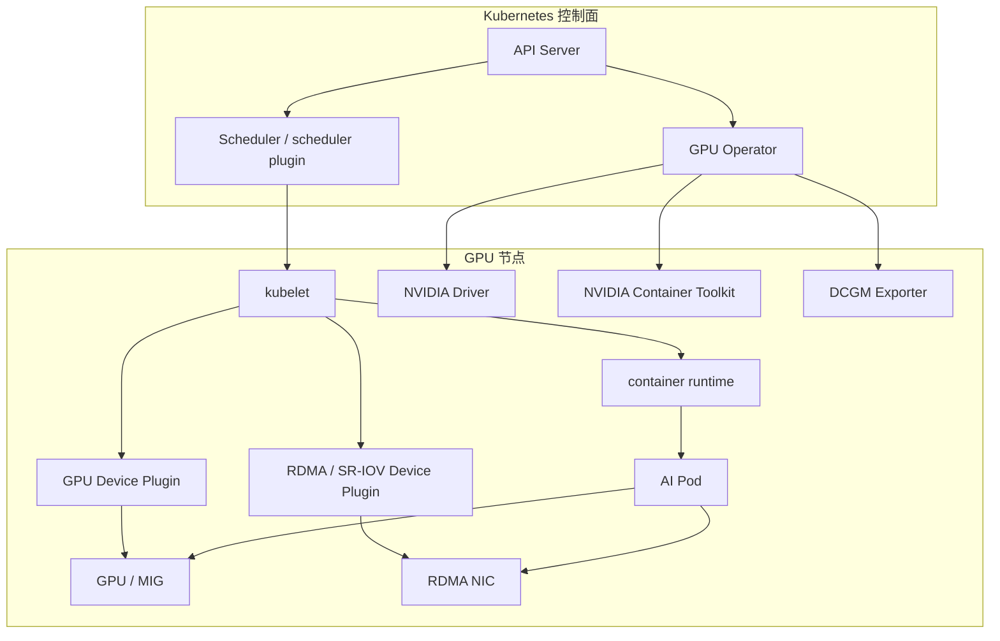

# 第 22 章：GPU on Kubernetes

## 本章回答的问题

- Kubernetes 如何识别、分配和隔离 GPU？
- GPU device plugin、GPU Operator、MIG、time-slicing、Topology Manager、NUMA 和 RDMA device 如何协同？
- 容器访问 GPU 和 NIC 时，哪些地方最容易出问题？

## 22.1 GPU device plugin

Kubernetes 原生只理解 CPU、memory、ephemeral storage 等通用资源。GPU 这类特殊硬件需要通过 Device Plugin 机制暴露给 kubelet。NVIDIA GPU device plugin 会发现节点上的 GPU 或 MIG 实例，并把它们注册成 `nvidia.com/gpu` 或更细粒度的扩展资源。

Pod 通过 resource request 申请 GPU 后，kubelet 在容器启动时调用 device plugin 分配设备，并把设备路径、环境变量和 runtime 配置传给容器。这个过程要求主机驱动、container runtime、NVIDIA Container Toolkit 和 device plugin 版本协同。

## 22.2 GPU Operator

GPU Operator 用 Operator 模式管理 GPU 节点软件栈。典型组件包括 NVIDIA Driver、NVIDIA Container Toolkit、GPU Device Plugin、DCGM Exporter、Node Feature Discovery 和 MIG Manager。它的价值不是“安装一个插件”，而是把 GPU 节点生命周期变成可声明、可升级、可观测的 Kubernetes 资源。

在生产环境中，是否由 GPU Operator 安装驱动取决于组织的镜像和主机基线策略。有些团队在裸金属交付阶段预装驱动，有些团队让 Operator 管理驱动。关键是保持版本矩阵清晰，避免驱动、CUDA、NCCL 和内核组合不可追溯。

## 22.3 GPU resource request

Pod 通过如下方式申请 GPU：

```yaml
resources:
  limits:
    nvidia.com/gpu: 1
```

Kubernetes 对 GPU 扩展资源通常要求只设置 limit，request 会按 limit 处理。这个模型适合整卡分配，但表达不了更复杂的性能需求，例如 HBM 容量、NVLink 邻接关系、GPU 型号、MIG profile、RDMA rail 或拓扑距离。因此 AI 平台通常会在 CRD、调度器插件或队列层增加更多语义。

## 22.4 MIG

MIG 即 Multi-Instance GPU，把一张物理 GPU 切分成多个硬件隔离实例。它适合小模型推理、开发测试和多租户隔离场景。MIG 的好处是资源粒度更细，隔离比普通 time-slicing 更强；代价是灵活性下降，切分 profile 会影响可调度资源形态。

MIG 管理需要和调度、监控和容量规划统一。平台需要知道哪些节点启用了 MIG、有哪些 profile、哪些 workload 能使用它，以及切分变更是否需要排空节点。

## 22.5 time-slicing

Time-slicing 通过时间片方式让多个容器共享同一 GPU。它适合开发、测试、轻量推理或低优先级任务，不适合强隔离和稳定延迟要求很高的生产推理。time-slicing 能提高资源利用率，但会让性能抖动和故障归因变复杂。

使用 time-slicing 时，平台必须明确租户边界、SLO 级别和计费口径。共享 GPU 的 Pod 之间可能互相影响，不能把它当成和整卡隔离等价的能力。

## 22.6 topology manager

Topology Manager 帮助 kubelet 在 CPU、device plugin 和其他资源之间做 NUMA 对齐。对于多 GPU、多 NIC 的节点，CPU socket、PCIe root complex、GPU 和网卡的距离会影响性能。若训练进程使用的 GPU 和 RDMA NIC 跨 NUMA 访问，通信性能可能明显变差。

Topology Manager 只是节点内拓扑协调的一部分。跨节点 GPU 拓扑、NVLink、NVSwitch、IB/RoCE rail 和机架位置还需要调度器、节点标签、拓扑数据和作业控制器共同表达。

## 22.7 NUMA

NUMA 即 Non-Uniform Memory Access，表示不同 CPU socket 访问本地和远端内存的代价不同。GPU 服务器通常存在复杂的 CPU-GPU-NIC 拓扑。AI workload 如果忽略 NUMA，可能出现 GPU 空闲但数据路径绕远、RDMA 带宽低或 CPU 线程调度不稳定的问题。

工程上应在节点准入阶段采集拓扑信息，在调度阶段尽量保持 GPU、CPU、内存和 NIC 亲和，在运行阶段通过指标和 benchmark 验证实际效果。

## 22.8 RDMA device

跨节点训练通常需要 RDMA 网络。Kubernetes 中可以通过 RDMA shared device plugin、SR-IOV device plugin 或厂商网络 Operator 暴露 RDMA 设备。Pod 不仅要拿到 GPU，也要拿到正确的 NIC、驱动、权限和网络配置。

RDMA 问题常被误判成 NCCL 或模型问题。实际根因可能是网卡设备没有注入容器、GID index 配置不对、RoCE PFC/ECN 异常、IB 链路降速、容器缺少权限，或 GPU 与 NIC 拓扑不匹配。

## 22.9 容器访问 GPU 和 NIC

容器访问 GPU 和 NIC 的路径可以概括为：节点安装驱动和用户态库，device plugin 把硬件注册给 kubelet，调度器把 Pod 放到有资源的节点，kubelet 调用 runtime 创建容器，runtime 根据 NVIDIA Container Toolkit 和设备分配结果注入 GPU，网络插件或 RDMA device plugin 注入高性能网络设备。



排障时应沿着这条路径逐层检查：节点是否识别 GPU，驱动是否加载，device plugin 是否注册资源，Pod 是否申请资源，runtime 是否注入设备，容器内是否能执行 `nvidia-smi`，RDMA 设备是否可见，NCCL 是否选择了正确网卡。

## 小结

- GPU on Kubernetes 依赖 device plugin、runtime、驱动、工具链和调度策略协同。
- GPU Operator 可以管理 GPU 节点软件栈，但版本矩阵仍需平台治理。
- 整卡、MIG 和 time-slicing 对隔离、利用率和稳定性的取舍不同。
- Topology Manager、NUMA 和 RDMA device 决定多 GPU 多 NIC 节点的实际性能。
- 容器访问 GPU 和 NIC 的问题要沿 kubelet、device plugin、runtime、驱动和网络设备逐层定位。

## 延伸阅读

- TODO: 官方文档
- TODO: 经典论文
- TODO: 工程案例
