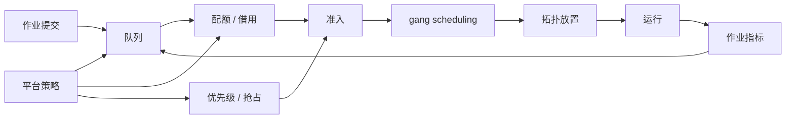

# 第 23 章：AI 作业队列与调度

## 本章回答的问题

- 为什么默认 Kubernetes Scheduler 无法单独满足大规模 AI workload？
- gang scheduling、queue、quota、priority、preemption 如何解决训练和批处理作业问题？
- Volcano、Kueue、Ray、Kubeflow 和 Argo Workflows 在 AI Factory 中分别适合什么位置？

## 一个真实场景

一个 64 卡训练任务提交后，先启动了 40 个 Pod，剩下 24 个 Pod 因资源不足 pending。已经启动的 40 个 Pod 占着 GPU 等待其它 worker，任务无法进入训练，集群可用 GPU 反而更少。另一个在线推理服务正遇到高峰，需要扩容，但离线训练任务占住了资源。平台团队发现默认 Pod 调度语义无法表达“要么一起启动，要么一个都不要启动”的训练需求。

AI 作业调度的核心是把资源分配从单 Pod 决策提升到任务、队列和租户维度。

## 核心概念

AI 作业队列与调度属于资源编排与作业调度层。它负责决定训练、微调、批量推理、评测和数据处理任务何时运行、在哪些节点运行、使用多少 GPU、优先级如何、是否可以抢占以及是否满足拓扑要求。

和在线微服务不同，AI 作业往往需要多副本同步启动、长时间运行、大量 GPU、拓扑亲和、队列等待和公平共享。

## 系统架构



调度不是一次性决策，而是围绕队列、资源状态和任务生命周期的控制循环。

## 23.1 为什么默认 Kubernetes Scheduler 不够

默认 Kubernetes Scheduler 以 Pod 为调度对象，适合多数在线服务。但分布式训练需要一组 Pod 同时获得资源，否则任务无法前进。默认调度器也缺少面向 AI 作业的队列、公平共享、作业级配额和批式准入语义。

这不意味着 Kubernetes 不适合 AI，而是需要在 Kubernetes 之上增加批调度和作业管理能力。Volcano、Kueue、Kubeflow Training Operator、Ray Operator 等都在补足这些语义。

## 23.2 gang scheduling

Gang scheduling 要求一组 Pod 作为整体被调度。只有当任务需要的 worker、launcher 或 parameter server 都能获得资源时，才允许启动。它避免半启动浪费 GPU。

Gang scheduling 的挑战是资源碎片。如果任务要求 64 张同型号 GPU，集群可能有 80 张空闲 GPU，但分散在不同拓扑或被小任务占用，仍无法满足。调度器需要结合队列、抢占和拓扑策略处理。

## 23.3 queue

Queue 是作业等待和公平共享的基本单元。队列可以按团队、项目、业务线、优先级或 workload 类型划分。每个队列可以有资源上限、保底、权重和借用策略。

没有队列，所有作业直接争抢全局资源，用户体验不可预测。队列让平台能够表达组织策略：生产任务优先，实验任务排队；关键团队有保底，空闲时允许其他团队借用。

## 23.4 quota

Quota 定义租户或队列可使用的资源。AI quota 不应只包含 CPU/memory，还要包含 GPU 型号、GPU 数量、MIG、RDMA、存储和并发任务数。Quota 还应区分 guaranteed、borrowed 和 best-effort。

Quota 的难点是利用率。严格静态 quota 隔离强，但容易资源闲置；允许借用提高利用率，但需要回收和抢占机制。平台要让用户清楚看到自己的 quota、已用资源和等待原因。

## 23.5 priority

Priority 表示作业重要性。高优先级任务可以更早准入，甚至触发抢占。优先级通常与业务等级、SLA、紧急程度和租户类型相关。

优先级不能滥用。如果所有任务都是高优先级，就等于没有优先级。平台应限制谁能提交高优先级任务，并记录优先级变更和抢占影响。

## 23.6 preemption

Preemption 是抢占低优先级任务释放资源。它能保障关键任务，但会浪费被抢占任务已消耗的计算，尤其是长训练任务。抢占策略需要结合 checkpoint。

可抢占任务应定期 checkpoint，并能从最近 checkpoint 恢复。对没有 checkpoint 的训练任务，抢占成本很高。平台可以把低优先级批量推理和可重试数据处理放入可抢占池。

## 23.7 Volcano

Volcano 是 Kubernetes 生态中的批调度系统，提供 queue、gang scheduling、priority、preemption 等能力。它适合 AI、HPC 和大数据批式任务。

使用 Volcano 时，要把 PodGroup、Queue 和作业控制器结合起来。平台还需要把用户提交的训练任务转成 Volcano 可理解的调度对象，并把状态回写到用户界面。

## 23.8 Kueue

Kueue 关注 Kubernetes 原生作业的队列和准入控制。它不替代所有调度器，而是在作业进入集群运行前做队列、配额、借用和准入决策。

Kueue 适合与 Job、Kubeflow Training Operator、RayJob 等集成。它的价值是把“是否允许这个 workload 消耗资源”从 Pod 调度前置到作业级控制。

## 23.9 Ray、Kubeflow 与 Argo Workflows

Ray 适合分布式 Python、模型训练、批量推理和在线 serving 的统一计算框架。Kubeflow 提供机器学习工作流、训练算子和模型生命周期组件。Argo Workflows 适合声明式 DAG 工作流，常用于数据处理、评测和流水线编排。

这些工具不互相完全替代。Ray 更像分布式执行框架，Kubeflow 更像 ML 平台组件集合，Argo 更像通用工作流编排。它们都需要底层队列、配额和调度策略支撑。

## 工程实现

作业队列配置示例：

```yaml
queue:
  name: training-prod
  cohort: ai-factory
  quota:
    guaranteed_gpu: 128
    max_gpu: 256
  policy:
    allow_borrowing: true
    preemptible: false
    priority_class: production
```

用户提交作业时，平台应返回 pending 原因：quota 不足、gang 不满足、GPU 型号不匹配、拓扑不满足或镜像拉取失败。

## 常见故障

- 半启动训练任务占住 GPU 但无法前进。
- 队列没有可视化，用户不知道为什么 pending。
- 抢占没有 checkpoint，浪费大量 GPU 小时。
- Quota 静态切分过细，导致整体利用率低。
- 调度器不理解拓扑，任务启动后 NCCL 性能差。

## 性能指标

- 队列等待时间、作业准入时间、pending 原因分布。
- GPU quota 使用率、borrowed quota、资源碎片率。
- Gang scheduling 成功率、半启动避免次数。
- 抢占次数、抢占浪费 GPU 小时、恢复成功率。
- 作业成功率、失败率、平均运行时长。

## 设计取舍

严格公平能保证组织边界，但可能降低利用率。激进借用提高利用率，但需要抢占和回收。高优先级保障生产任务，但可能影响研究实验。AI 作业调度的设计目标不是“所有任务最快”，而是让稀缺 GPU 资源按业务价值和工程约束可解释地分配。

## 小结

- AI 作业调度要从 Pod 级决策提升到作业、队列和租户维度。
- Gang scheduling 是分布式训练避免资源浪费的基础。
- Queue、quota、priority 和 preemption 共同表达组织资源策略。
- Volcano、Kueue、Ray、Kubeflow 和 Argo 各自解决不同层次的问题。

## 延伸阅读

- TODO: Volcano 官方文档
- TODO: Kueue 官方文档
- TODO: Ray / Kubeflow / Argo Workflows 官方文档
