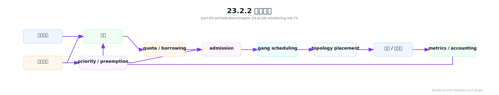
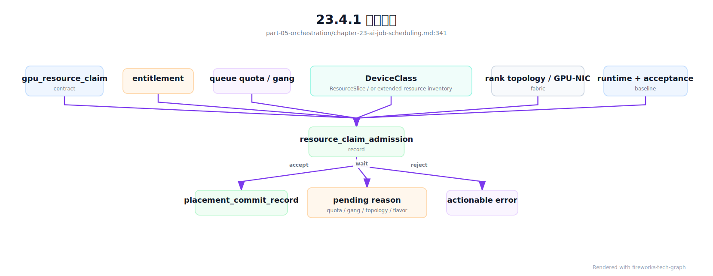

# 第 23 章：AI 作业队列与调度

## 23.1 导读

### 23.1.1 本章回答的问题

- 为什么默认 Kubernetes Scheduler 无法单独满足大规模 AI workload？
- gang scheduling、queue、quota、priority、preemption 如何解决训练和批处理作业问题？
- Volcano、Kueue、Ray、Kubeflow 和 Argo Workflows 在 AI Factory 中分别适合什么位置？


### 23.1.2 本章上下文

- 层级定位：本章属于 `资源编排与作业调度层`，重点讨论容器、Kubernetes、GPU 调度、队列、Slurm 和多集群资源治理。
- 前置依赖：建议先理解 第 22 章：GPU on Kubernetes 中的核心对象和路径。
- 后续关联：本章内容会继续连接到 第 24 章：Slurm 与 HPC 调度，并在系统地图、深度标准和读者测试中被交叉引用。
- 读完能力：读完本章后，读者应能把《AI 作业队列与调度》中的概念映射到 AI Factory 的生产路径、工程对象、观测证据和设计取舍。


### 23.1.3 读者测试

- 机制题：读者能否解释 为什么默认 Kubernetes Scheduler 不够、gang scheduling、queue、quota 的核心机制，以及它们如何共同支撑《AI 作业队列与调度》？
- 边界题：读者能否区分 资源编排与作业调度、GPU IaaS、Platform 层和 AI Runtime 层 的责任边界，并说明哪些问题不能简单归因到本章组件？
- 路径题：读者能否从 workload 提交追到队列、配额、调度、容器启动、GPU 分配和拓扑证据，并指出本章对象在路径中的位置？
- 排障题：当《AI 作业队列与调度》相关生产症状出现时，读者能否列出第一层证据、下一跳证据、可能 owner 和止血动作？


### 23.1.4 一个真实场景

一个 64 卡训练任务提交后，先启动了 40 个 worker Pod，剩下 24 个因为资源不足一直 pending。已经启动的 worker 占住 GPU 等待其它 rank，训练无法进入第一步，集群可用 GPU 反而更少。与此同时，一个在线推理服务遇到流量高峰需要扩容，却被低优先级训练任务占住资源。平台看到的是大量 Pod 状态变化，用户看到的是任务 pending，业务看到的是推理延迟升高。

事故复盘发现，问题不是 Kubernetes 完全不能调度 GPU，而是默认 Pod 级调度缺少作业级语义。分布式训练需要“要么一起启动，要么一个都不要启动”；批量任务需要队列、并发和重试；生产推理需要保留容量和优先级；研究任务需要 fairshare 和可解释等待。把所有任务拆成独立 Pod，会让调度器做出局部正确、整体错误的决策。

AI 作业队列与调度的目标，是把资源分配从单 Pod 决策提升到 workload、queue、tenant 和业务优先级维度。它不只是“谁先运行”的问题，还包括谁有保底、谁能借用、谁能抢占、哪些任务必须整体准入、哪些拓扑必须满足、失败后如何恢复。GPU 稀缺时，调度系统就是 AI Factory 的资源治理系统。

这个场景还说明，调度系统必须同时服务效率和秩序。只追求效率，可能让大作业永远得不到连续资源；只追求公平，可能让 GPU 长时间空闲；只追求生产优先，可能让研究任务没有可预期窗口。调度策略本质上是把组织价值观写进系统，因此必须有可审计规则和可解释结果。

如果平台无法解释一次调度决策，用户就会绕过系统寻求人工协调。人工协调可以解决一次冲突，却会破坏长期公平。作业调度系统的工程目标，是让资源冲突尽量在规则内解决，并把例外变成可审计事件。


## 23.2 基础模型

### 23.2.1 核心概念

AI 作业调度属于资源编排与作业调度层。它管理训练、微调、批量推理、评测、数据处理和 HPC-style job 何时运行、在哪些节点运行、使用多少 GPU、是否满足拓扑、能否被抢占以及如何计入配额。它不同于 MaaS 层的模型路由，也不同于 GPU IaaS 层的裸金属交付。它负责把业务需求转化为集群资源决策。

核心对象包括 queue、quota、priority、preemption、gang 和 admission。Queue 是等待和公平共享的组织单元；quota 定义队列或租户可用资源；priority 表示任务重要性；preemption 允许高优先级任务回收资源；gang scheduling 确保一组 Pod 整体启动；admission 在任务进入执行前判断是否允许消耗资源。这些对象共同表达组织策略和系统约束。

还要区分调度器、队列系统和执行框架。Scheduler 决定 Pod 或任务放到哪里；Kueue 更偏作业准入和队列配额；Volcano 提供批调度、PodGroup 和 gang 等能力；Ray 是分布式执行框架；Kubeflow 提供 ML 训练和流水线组件；Argo Workflows 提供 DAG 编排。它们可以组合，不应被混为一个层次。

这些概念的共同目标是避免“局部最优”。单个 Pod 被成功放置，未必代表训练任务可运行；单个队列利用率高，未必代表全局资源公平；单个高优先级任务成功，未必代表抢占成本可接受。AI 作业调度要在作业、队列、租户和集群之间持续权衡。

调度策略也要和经济性连接。GPU 小时、排队时间、抢占浪费、空转时间和任务价值都应进入同一套分析。否则调度系统只是在移动等待队列，而不是提高 AI Factory 的产出效率。

因此，调度概念要同时服务工程、组织和财务三类决策。


### 23.2.2 系统架构

AI 作业调度架构通常由提交入口、队列准入、资源配额、调度放置、执行控制器和观测反馈组成。用户提交 TrainingJob、RayJob、BatchInferenceJob 或 Workflow；控制面根据租户、workload 类型和优先级放入 queue；准入系统检查 quota、资源池、gang、拓扑、镜像和数据权限；调度器把任务放到节点；执行控制器维护生命周期；观测系统反馈等待、运行、失败和资源使用。

这是一条控制循环，而不是一次性决策。任务等待时，系统需要解释 pending 原因；资源释放时，系统要重新评估队列；高优先级任务到来时，系统可能触发抢占；节点故障时，系统要重新入队或恢复；任务完成后，quota 和成本要更新。若调度只发生在 Pod 创建瞬间，就无法表达 AI 作业的生命周期。

架构上最重要的是“准入”和“放置”的分离。准入回答“这个 workload 现在是否允许消耗资源”，放置回答“它应该放到哪些节点”。Kueue 更强调准入和配额，Volcano 更强调批式调度和 gang，默认 Scheduler 更强调 Pod 放置。成熟平台会把这些能力组合起来，而不是期望一个组件解决所有问题。

这套架构还需要统一状态模型。queued、admitted、scheduling、running、preempting、recovering、completed 和 failed 应有明确含义。用户不应只看到 Kubernetes Pod 状态，而应看到作业状态和等待原因。状态模型越清楚，平台越容易解释资源争议，也越容易做容量运营。

统一状态还要跨工具。一个 RayJob、Kubeflow TrainingJob、Argo Workflow 和 Volcano PodGroup 都应能映射到平台统一状态。用户关心的是任务是否排队、运行、失败或恢复，不应被迫理解每个工具的内部状态机。

状态统一也是计费和审计的前提。

没有统一状态，就没有统一责任。




## 23.3 关键技术

### 23.3.1 为什么默认 Kubernetes Scheduler 不够

默认 Kubernetes Scheduler 以 Pod 为主要调度对象，适合大量无状态服务和普通控制面组件。它能处理资源请求、亲和性、污点容忍、拓扑扩展约束和插件评分。但大规模 AI workload 常常不是独立 Pod：分布式训练需要多个 worker 同时启动，批量任务需要队列和并发控制，微调需要租户配额，评测需要版本和报告，在线推理需要保留容量。

默认调度器缺少作业级准入语义。一个训练任务需要 64 张 GPU，如果只按 Pod 调度，前 40 个 Pod 可能先占住 GPU，剩下 24 个等待，整个任务无法前进。这种半启动会浪费资源，也会阻塞其它任务。默认调度器也不会天然理解队列保底、租户借用、作业级优先级和 checkpoint-aware preemption。这些需要额外系统补足。

这不意味着 Kubernetes 不适合 AI，而是说明需要在 Kubernetes 之上增加 AI 作业语义。Volcano、Kueue、Kubeflow Training Operator、Ray Operator、Argo Workflows 和自定义控制器，都是围绕作业级管理补齐能力。正确问题不是“默认 Scheduler 能不能调度 GPU”，而是“平台是否能把 AI workload 的生命周期和组织策略转化为调度决策”。

默认 Scheduler 仍然可以处理大量基础组件和在线服务副本。问题在于不要让它独自承担批式训练和多租户 GPU 治理。平台应按 workload 类型选择调度路径：普通服务走默认调度，训练和大批任务走队列与 gang，特殊拓扑任务走扩展插件。分流比一刀切更可靠。

这种分流还可以降低风险。把所有 Pod 都交给复杂批调度器，可能影响控制面和在线服务；把所有 Pod 都交给默认调度器，又会伤害训练效率。调度路径本身应是平台策略的一部分。


### 23.3.2 gang scheduling

Gang scheduling 要求一组 Pod 作为整体被调度。只有当训练任务需要的 worker、launcher、parameter server 或其它角色都能获得资源时，才允许启动。它解决的是同步型作业的半启动问题。对分布式训练而言，少一个 rank，整个任务就无法进入训练循环；让部分 worker 先占住 GPU，只会制造资源浪费。

Gang scheduling 的难点是资源碎片和等待。一个 64 卡任务可能需要同型号 GPU、同网络 fabric、甚至特定拓扑；集群总空闲 GPU 足够，不代表能满足整体约束。调度器要在大作业等待和小作业填空之间取舍。过度偏向大作业会让资源空闲，过度填小作业会让大作业永远排不到连续资源。这是队列策略和资源整理问题。

工程上，gang 不应只是“Pod 数量满足”。它还要关联超时、回滚和失败清理。如果 gang 准入后某个 Pod 启动失败，已启动 Pod 应被清理或整体重试，避免占用资源。平台应记录 gang 等待时间、准入失败原因、半启动避免次数和资源碎片。Gang scheduling 是训练平台的基本能力，但它必须和 quota、priority、topology 和 checkpoint 一起设计。

Gang 还要考虑启动阶段的真实依赖。所有 worker Pod 创建成功，不代表 NCCL 初始化成功；所有容器 Running，不代表数据和 checkpoint 可访问。对关键训练任务，gang 准入后仍需要 runtime 自检和失败回滚。否则系统只是避免了调度半启动，却可能陷入运行时半启动。

因此，gang 成功率不能只按 Pod 创建统计，还要看训练是否进入有效 step。平台应把调度 gang 和运行时 rendezvous 区分记录。前者由调度系统负责，后者由训练 runtime 和网络存储共同决定。

这样才能区分调度问题和运行时问题。


### 23.3.3 queue

Queue 是作业等待、排序和公平共享的基本单元。队列可以按团队、项目、业务线、workload 类型、优先级或环境划分，例如 `training-prod`、`research`、`batch-inference`、`evaluation`。每个队列可以有保底、上限、权重、借用策略、抢占策略和准入规则。没有队列，所有任务直接争抢全局 GPU，用户体验和组织治理都会失控。

队列的价值是把组织策略变成系统规则。生产任务有保底，研究任务可以借用空闲资源，低优先级批任务可以被抢占，关键评测可以插队。队列还提供可解释等待：用户可以看到自己排在什么队列、前面有哪些任务、等待原因是 quota、gang、拓扑还是资源池不足。可解释等待比单纯 pending 更重要。

队列设计也会带来取舍。队列太多会造成资源碎片和策略复杂，队列太少又无法表达业务差异。平台应从少量主队列开始，按 workload 和业务等级划分，再根据数据调整。队列不是组织架构的简单映射，而是资源治理工具。它应服务 GPU 利用率、SLO、成本和公平性，而不是复制部门边界。

Queue 还应有可视化。用户需要看到队列深度、预计等待、前序作业、保底使用、借用资源和阻塞原因；平台需要看到队列长期趋势。没有可视化，队列会被认为是黑箱，用户会通过线下沟通绕过系统。透明度是队列制度能否落地的关键。

预计等待时间不一定要非常精确，但要解释主要约束。比如“等待 32 张同型号 GPU”比“pending”更有用。随着历史数据积累，平台可以逐步改进等待时间预测。

队列体验的核心是可解释，而不是承诺绝对准确。

解释能降低无效沟通。


### 23.3.4 quota

Quota 定义租户、队列或项目可使用的资源。AI quota 不应只包含 CPU 和 memory，还应包含 GPU 型号、GPU 数量、MIG profile、RDMA 节点、本地 NVMe、存储吞吐、并发任务数和优先级额度。不同 GPU 不能简单相加，H100、L40S、A10 或 MIG 实例代表的能力不同。Quota 必须按资源能力维度管理。

Quota 可以有 guaranteed、max、borrowed 和 best-effort 等语义。Guaranteed 提供保底，max 限制最大使用，borrowing 允许队列借用空闲资源，best-effort 用于可抢占或低优先级任务。严格静态 quota 隔离强，但容易让资源闲置；完全共享利用率高，但容易让关键团队没有保障。AI Factory 需要在隔离和利用率之间找平衡。

工程上，quota 必须可见、可解释、可审计。用户应能看到自己有哪些 quota、已用多少、借用了多少、为什么不能准入。平台应能看到 quota 使用率、借用率、欠账、抢占影响和闲置资源。Quota 不是审批表，而是调度系统的实时输入。没有可执行 quota，就无法把组织资源策略落到 GPU 集群上。

Quota 还要定期校准。业务增长、模型规模变化、硬件扩容和优先级调整都会改变资源需求。长期不变的 quota 会逐渐脱离现实，导致某些队列长期饥饿，另一些队列长期闲置。平台应通过历史使用和业务计划调整 quota，而不是只在冲突发生后临时改配置。

Quota 调整也要可审计。谁增加了保底，谁降低了上限，是否影响其它队列，都应记录。GPU 资源昂贵，quota 变更本质上是资源承诺变更，不能只作为技术配置处理。

配额记录应能回溯到业务理由。

否则 quota 会变成黑箱。

黑箱 quota 会削弱平台信任，也会鼓励线下协调。

规则必须透明。


### 23.3.5 priority

Priority 表示作业重要性，影响排序、准入和抢占。高优先级任务通常与生产服务、发布阻塞、紧急修复或高价值训练相关；低优先级任务可能是实验、批量回填或可重试数据处理。Priority 让平台在资源不足时按业务价值做决策，而不是完全先来先服务。

优先级必须被治理。如果所有用户都能随意提交最高优先级，系统很快退化为无优先级。平台应限制高优先级使用权限，记录谁提升了优先级、为什么提升、影响了哪些任务。优先级还应与 quota 结合：高优先级不应无限绕过租户边界，否则会破坏公平性。关键任务可以插队，但插队必须可审计。

工程上，priority 不只是一个整数。它应映射到 queue、preemption、SLO、告警和成本。某些高优先级任务允许抢占，某些只允许提前准入；某些低优先级任务可被暂停，某些只能等待完成。平台需要定义优先级等级及其行为，而不是让用户猜测数字含义。优先级的目标是可解释地服务业务价值。

Priority 还应防止“优先级通胀”。如果团队为了缩短等待时间不断提高优先级，系统会失去排序能力。平台可以通过配额限制高优先级提交次数，或要求高优先级任务绑定审批、事故编号、发布窗口等理由。优先级是稀缺资源，也需要治理。

优先级还要与用户体验一致。高优先级任务如果仍然长时间 pending，平台应说明是资源物理不足、拓扑不足还是被更高优先级任务阻塞。否则优先级会失去可信度。

优先级不能替代真实容量。

它只能改变排序。

容量不足仍需要扩容、借用或降级策略。


### 23.3.6 preemption

Preemption 是抢占低优先级任务释放资源给高优先级任务。它能保障生产服务、关键训练或紧急评测，但也会浪费被抢占任务已经消耗的计算。对于长时间训练，抢占没有 checkpoint 就意味着大量 GPU 小时被丢弃；对于批量推理，抢占可能只需要重跑部分 shard；对于数据处理，抢占通常更容易恢复。

抢占策略必须理解 workload 恢复能力。可抢占任务应定期 checkpoint、分片输出或具备幂等重试；不可恢复任务应尽量避免被抢占，除非业务价值确实较低。平台应支持 graceful preemption：提前通知任务保存状态，等待安全点，再释放资源。粗暴删除 Pod 虽然简单，但会把调度成本转移给用户和 GPU 账单。

工程上，应记录抢占原因、被抢占任务、浪费 GPU 小时、恢复成功率和影响范围。抢占不能只看高优先级任务是否成功，还要看整体成本是否可接受。如果抢占频繁发生，说明 quota、保留容量或队列策略需要调整。Preemption 是资源治理工具，不是容量不足的长期替代品。

抢占还应有用户体验设计。被抢占任务应收到明确事件：谁抢占、为何抢占、何时释放、是否会自动恢复、已保留哪个 checkpoint。没有这些信息，用户会认为平台随机杀任务。可解释抢占比静默删除更容易被接受，也更利于成本归因。

抢占策略还可以分层。在线生产任务通常不可抢占，低优先级 batch 可以随时抢占，长训练只能在 checkpoint 后抢占，评测任务根据发布窗口决定。不同 workload 的抢占点不同，不能只用一个全局开关。

抢占点应写入 workload spec。

这样恢复逻辑才可预期。


### 23.3.7 Volcano

Volcano 是 Kubernetes 生态中的批调度系统，面向 AI、HPC 和大数据等批式任务，提供 queue、PodGroup、gang scheduling、priority、preemption 等能力。它适合需要多 Pod 同步启动、作业级调度和批处理语义的场景。对于分布式训练，Volcano 的 PodGroup 能表达一组 Pod 的整体准入需求。

使用 Volcano 时，平台通常不会让用户直接写底层对象，而是由 TrainingJob、MPIJob、PyTorchJob 或自定义 CRD 生成 PodGroup、Queue 和相关 Pod。这样用户提交的是训练任务，平台负责转换为调度对象。Volcano 解决调度层问题，不负责模型注册、数据权限、评测报告和计费；这些仍需要 AI 平台控制面。

工程上，要关注 Volcano 与默认 Scheduler、队列系统和控制器的边界。哪些 Pod 走 Volcano，哪些走默认 Scheduler，哪些队列可抢占，哪些任务需要 gang，都要清晰。若所有 workload 都强行走批调度，在线服务可能受影响；若训练任务不走批调度，又会出现半启动。Volcano 的价值在于为批式 AI 作业提供正确语义，而不是替代整个 Kubernetes 控制面。

Volcano 落地还需要作业模板。用户不应手写复杂 PodGroup 和调度参数，而应提交训练任务或批任务，由平台生成底层对象。模板应包含队列、资源、gang、日志、checkpoint 和失败处理。否则 Volcano 能力存在，但用户难以正确使用。

同时要关注生态兼容。Volcano、默认 Scheduler、Kueue 和上层控制器都可能参与同一集群。平台应明确哪些资源池和 workload 使用 Volcano，避免多个调度控制面争抢同一批 Pod。

Volcano 的队列也要和租户 quota、成本标签和监控标签打通。否则调度成功了，平台仍然无法回答谁用了资源、是否越过配额、抢占影响了哪个项目。批调度组件只有接入平台治理，才能成为 AI Factory 能力。


### 23.3.8 Kueue

Kueue 关注 Kubernetes 原生 workload 的队列和准入控制。它更像是在作业真正消耗资源前，判断是否允许进入执行。它可以管理 ClusterQueue、LocalQueue、ResourceFlavor、cohort、borrowing 和 quota 等概念，与 Job、Kubeflow Training Operator、RayJob 等工作负载集成。Kueue 的核心价值是把队列和配额前置到作业级。

Kueue 不一定替代调度器。它回答“这个 workload 是否被准入”，默认 Scheduler 或其它调度器仍负责 Pod 放置。这个分层很重要：准入控制可以避免任务过早创建大量 Pod，减少半启动和资源争抢；调度器则根据节点和拓扑完成具体放置。对于多租户 AI 平台，Kueue 提供了组织资源策略的清晰入口。

工程上，Kueue 适合与上层训练、批量推理和评测控制器结合。平台应把租户队列、资源 flavor、GPU 型号、借用策略和 pending 原因展示给用户。Kueue 的挑战是需要与实际调度能力、拓扑约束和工作负载控制器协调。准入成功不应意味着任何节点都合适，准入失败也应给出可解释原因。Kueue 是队列治理组件，不是完整 AI 平台。

Kueue 的 ResourceFlavor 特别适合表达 GPU 型号、节点池、地域或软件栈差异。但 flavor 设计过细会增加管理复杂度，过粗又无法避免错误放置。平台应把 flavor 与真实资源能力绑定，并定期清理不再使用的组合。队列抽象必须跟随资源现实。

Kueue 落地时还要处理用户沟通。准入失败应该说明缺少哪个 flavor 或 quota，而不是让用户阅读底层对象状态。队列系统的体验决定它是否能替代人工排队。

如果用户仍然需要找管理员问原因，队列系统就没有真正完成产品化。

产品化要求自解释。


### 23.3.9 Ray、Kubeflow 与 Argo Workflows

Ray 是分布式执行框架，适合 Python 生态中的分布式训练、批量推理、数据处理和 serving。它关心任务、actor、资源和执行图，可以在 Kubernetes 上通过 Ray Operator 管理 RayCluster 和 RayJob。Ray 解决的是应用执行和分布式编程问题，不直接替代底层队列、quota 和 GPU 拓扑调度。

Kubeflow 是机器学习平台组件集合，包含训练算子、Pipeline、模型相关工作流等能力。它适合把训练、调参、评测和发布流程产品化。Argo Workflows 是通用 DAG 工作流引擎，适合数据处理、评测流水线、批处理和多步骤自动化。二者都可以运行在 Kubernetes 上，但它们解决的是工作流和 ML 生命周期问题，不等同于 GPU 调度器。

在 AI Factory 中，这些工具应按层次组合。Ray 负责某些分布式执行，Kubeflow 负责 ML 工作流和训练任务抽象，Argo 负责编排 DAG，Kueue 或 Volcano 负责队列和批调度，Scheduler 负责放置，GPU Operator 和 Device Plugin 负责设备暴露。工具之间不是简单替代关系。选型时要问：它解决的是提交入口、执行框架、队列准入、调度放置，还是生命周期管理。

工具组合的风险是状态分散。Ray 有自己的任务状态，Kubeflow 有训练状态，Argo 有 workflow 状态，Kubernetes 有 Pod 状态，队列系统有准入状态。平台需要统一展示，否则用户要在多个系统之间查原因。统一状态视图比工具数量更重要。

工具选型还要看团队维护能力。引入一个框架就引入升级、权限、观测和故障处理成本。AI Factory 不应因为某个工具流行就全部纳入，而应围绕 workload 选择最少但足够的组件。

少而清晰的工具链，通常比多而重叠的工具链更可靠。

工具边界要能被团队维护。


## 23.4 工程落地

### 23.4.1 工程实现

工程实现应先定义作业模型。一个 AI job 至少应包含 workload type、tenant、queue、priority、resource、runtime、data、checkpoint、preemption policy 和 observability 标签。训练任务还要包含 worker 数、gang、拓扑和恢复策略；批量推理要包含 shard、输出和幂等；评测要包含模型版本、数据集和报告。没有这些字段，调度系统只能做低层资源匹配。

示例队列配置如下：

```yaml
queue:
  name: training-prod
  cohort: ai-factory
  quota:
    guaranteed_gpu: 128
    max_gpu: 256
  policy:
    allow_borrowing: true
    preemptible: false
    priority_class: production
```

训练作业的 admission 事件应结构化。一次作业能否进入运行，不只是资源数量问题，还包括 quota、gang、拓扑、镜像、数据权限、checkpoint、节点健康和准入基线。把这些检查写成事件，用户才能理解 pending，平台才能做容量分析。

```yaml
job_admission_event:
  job_id: exp-20260619-001
  workload_type: distributed-training
  queue: training-prod
  requested:
    gpu_count: 512
    gpu_flavor: h100
    topology: same_fabric_required
  checks:
    quota: passed
    gang_capacity: blocked
    topology: waiting_for_contiguous_nodes
    image: passed
    dataset_permission: passed
    checkpoint_path: passed
    node_acceptance_baseline: passed
    framework_runtime_matrix: passed
    parallelism_plan_record: passed
    rank_topology_contract: unsatisfied
    nccl_env_contract: passed
  decision:
    admitted: false
    reason: topology_unsatisfied
    next_recheck: scheduled
```

Pending reason 应是枚举，而不是自由文本。建议至少区分 `quota_insufficient`、`gang_capacity`、`topology_unsatisfied`、`resource_flavor_unavailable`、`node_health_blocked`、`image_unavailable`、`data_permission_denied`、`checkpoint_path_invalid`、`preemption_in_progress`。这些原因应进入 UI、CLI、事件、指标和容量报表。否则用户看到 pending，只能找管理员问。

对大规模训练，admission 不能只检查 GPU 数量。它还要检查第 16 章的 `framework_runtime_matrix` 是否覆盖当前镜像和框架，第 17 章的 `parallelism_plan_record` 是否能解释 GPU 数、batch 和 checkpoint 语义，`rank_topology_contract` 是否能在当前资源池满足，第 18 章的 `nccl_env_contract` 是否与资源池 RDMA/fabric baseline 匹配。若这些检查缺失，任务可能顺利进入 running，却在 rendezvous、first effective step 或 checkpoint 阶段浪费大量 GPU。

更稳妥的 admission 结果应区分 `reject`、`wait`、`conditional_accept` 和 `accept`。例如 Tensor Parallel group 的 same-node hard constraint 不满足，应 `reject` 或继续 `wait`；Pipeline 相邻 stage 的 same-rack soft constraint 不满足，可以在用户接受降级后 `conditional_accept`；NCCL contract 与资源池 baseline 版本不一致，应先触发通信回归。调度系统的质量，体现在它能在 GPU 分配前暴露这些风险，而不是让训练任务替平台做验证。

当平台支持 DRA、MIG、CDI 或异构 GPU class 时，admission 还要为资源声明生成 `resource_claim_admission_record`。它回答的不是“Pod 能不能被调度到某个节点”，而是“这个 ResourceClaim 或 extended resource request 是否符合租户 entitlement、queue quota、DeviceClass、MIG profile、runtime baseline、拓扑和成本策略”。传统调度事件往往只显示节点不满足条件；资源声明准入记录必须把不满足条件拆成可行动原因。

```yaml
resource_claim_admission_record:
  record_id: rcar-20260620-001
  workload:
    job_or_pod: training-job/pretrain-exp-20260620
    tenant: foundation-model-team
    queue: training-prod
    workload_type: distributed_training
  claim_contract:
    gpu_resource_claim_contract: grcc-pretrain-h100-20260620
    kubernetes_mode: dra
    device_class: gpu.ai-factory/h100-rdma
    resource_claim_template: rct-pretrain-worker
    requested_claims: 512
  policy_checks:
    resource_pool_entitlement: passed
    queue_quota: passed
    gang_capacity: wait
    device_class_available: passed
    mig_profile_compatible: not_applicable
    runtime_baseline: passed
    fabric_baseline: passed
    rank_topology_contract: blocked
    heterogeneous_pool_acceptance_matrix: passed
    cost_budget: passed
  decision:
    state: wait
    reason: rank_topology_contract_unsatisfied
    pending_reason: topology_unsatisfied
    retry_when:
      - contiguous_nodes_available
      - lower_priority_borrowed_capacity_reclaimed
  evidence:
    resource_slices_or_inventory_snapshot: linked
    acceptance_baseline: h100-rdma-prod-202606
    queue_fairness_ledger_window: qfl-20260620-00
```

这个记录把资源声明从 Kubernetes 对象提升为平台可解释事件。若 `DeviceClass` 不存在或没有匹配 `ResourceSlice`，这是资源发现或 inventory 问题；若 entitlement 失败，是租户授权问题；若 quota 失败，是组织资源策略问题；若 rank topology 失败，是调度和资源碎片问题；若 runtime baseline 失败，是节点基线或准入问题。用户看到的 pending reason 应来自这个记录，而不是从多处事件里人工猜测。



资源声明准入还应进入容量运营。若大量任务卡在 `device_class_available`，说明 GPU class 供应不足或标签过细；若卡在 `rank_topology_contract_unsatisfied`，说明碎片、抢占或预留策略有问题；若卡在 `runtime_baseline`，说明准入或变更流程阻断了资源；若卡在 `cost_budget`，说明任务预算和资源产品不匹配。调度系统的作用不是只把任务排队，而是把稀缺资源缺口转成可治理信号。

平台还应实现 pending reason 和调度审计。用户提交作业后，应看到当前状态是 queued、admitted、scheduling、running、preempted、failed 还是 completed；pending 原因应区分 quota 不足、gang 不满足、GPU 型号不匹配、拓扑不满足、镜像不可用、数据无权限或节点健康不足。调度审计记录每次准入、抢占、放置和失败原因，为容量规划和争议处理提供证据。

实现还要把调度策略版本化。队列规则、quota、priority class、preemption policy 和拓扑策略变化后，应能解释某个历史作业使用的是哪一版策略。否则调度结果无法复盘，用户也无法理解为什么同样任务在不同时间等待不同。策略版本化是调度系统走向生产治理的标志。

实现还应支持模拟和 dry-run。用户提交作业前，平台可以返回将进入哪个队列、消耗哪些 quota、是否满足 gang、可能被哪些约束阻塞。管理员调整 quota 或优先级前，也可以模拟影响范围。调度策略越复杂，越需要在执行前预估后果。

实现还应有事件模型。准入、借用、抢占、恢复、失败和完成都要产生结构化事件，事件进入 UI、审计、告警和成本系统。没有事件模型，调度系统只能靠日志排障。

训练作业事件应沿着统一生命周期记录，而不是散落在队列、Pod、launcher 和训练日志里。`training_lifecycle_event` 把作业从 submitted、admitted、placement committed、gang started、rendezvous、first effective step、checkpoint、preempting、recovering 到 completed 的关键点串起来。它让用户看到任务卡在哪个阶段，也让成本系统区分等待、启动浪费和有效训练。

```yaml
training_lifecycle_event:
  event_id: tle-20260620-001
  job_id: exp-20260619-001
  tenant: foundation-model-team
  queue: training-prod
  phase: first_effective_step
  timestamps:
    submitted_at: recorded
    admitted_at: recorded
    placement_committed_at: recorded
    gang_started_at: recorded
    rendezvous_completed_at: recorded
    first_effective_step_at: recorded
  references:
    job_admission_event: jae-exp-20260619-001
    placement_commit_record: pcr-exp-20260619-001
    rank_mapping: rank-mapping-exp-20260619-001
    parallelism_plan_record: ppr-llm-20260620-001
    rank_topology_contract: rtc-llm-20260620-001
    nccl_env_contract: nec-h100-rdma-20260620
    checkpoint_manifest: latest_valid_if_resumed
  accounting:
    allocated_gpu_seconds_so_far: measured
    effective_training_gpu_seconds_so_far: measured
    startup_waste_gpu_seconds: calculated
```

这个事件让“任务 pending”“任务 running”“任务开始训练”变成三个不同事实。很多 GPU 浪费发生在 admitted 之后、first effective step 之前：镜像拉取、数据预检、NCCL rendezvous、checkpoint 恢复都可能消耗资源但不产生训练 token。调度系统若只记录 running，会把这些浪费平均摊进训练成本，无法指导优化。

事件模型还应支持订阅。用户订阅作业事件，SRE 订阅异常事件，平台运营订阅 quota 和抢占事件。不同角色看到不同视图，但底层事件源一致。这样调度系统既能服务人机交互，也能服务自动化。

队列治理还需要 `queue_fairness_ledger`。它不是简单的队列长度统计，而是记录每个队列在一个窗口内的 guaranteed、borrowed、lent、preempted、starved 和 effective GPU hours。这样平台才能回答：某队列等待长是因为它超出配额、拓扑不可满足、资源被别人借用，还是策略配置不合理。

```yaml
queue_fairness_ledger:
  window: 2026-06-20T00:00Z/2026-06-20T01:00Z
  cohort: ai-factory-training
  queues:
    - queue: training-prod
      guaranteed_gpus: 512
      used_gpu_hours: measured
      borrowed_gpu_hours: measured
      lent_gpu_hours: measured
      pending_reasons:
        gang_capacity: measured
        topology_unsatisfied: measured
        quota_insufficient: measured
      starvation:
        longest_waiting_job_age: measured
        starvation_policy_breached: false
    - queue: research
      guaranteed_gpus: 256
      preempted_gpu_hours: measured
      effective_gpu_hours: measured
  decisions:
    rebalance_quota: evaluate
    adjust_borrowing_policy: optional
```

这个 ledger 能把调度争议变成数据问题。若 research 长期借出资源但在生产高峰被频繁抢占，说明 borrowing 策略要调；若 training-prod 长期 pending 是拓扑不可满足，而不是 quota 不足，扩容方向应是同 fabric 连续资源，不是单纯增加 GPU；若某队列长期饥饿，应触发运营评审。公平不是平均等待，而是规则、承诺和实际效果一致。

抢占也需要 checkpoint-aware policy。调度器不应只知道某个任务优先级低，还要知道它能否安全释放资源。对于训练任务，抢占点通常是 checkpoint 完成后；对于 batch inference，抢占点是 shard 完成后；对于 online inference，抢占通常应通过 drain 而不是 kill。

```yaml
preemption_policy:
  workload_type: distributed-training
  allowed: true
  safe_points:
    - checkpoint_committed
  max_notice_seconds: 600
  on_preempt:
    emit_event: true
    preserve_checkpoint: true
    requeue: true
  accounting:
    record_wasted_gpu_hours: true
```

每次抢占还应形成 `preemption_record`。Policy 说明允许怎么抢占，record 说明这一次实际发生了什么。它要记录 notice、safe point、checkpoint、释放资源、浪费 GPU 小时、恢复结果和受影响队列。没有 record，抢占会被视为调度器内部动作，用户只能看到任务被杀。

```yaml
preemption_record:
  preemption_id: preempt-20260620-001
  victim_job: exp-lowprio-042
  requester:
    job_id: exp-prod-urgent-017
    queue: training-prod
    reason: production_release_blocker
  policy:
    safe_point: checkpoint_committed
    notice_seconds: 600
  execution:
    checkpoint_before_release: ckpt-step-80000
    released_gpus: 128
    victim_requeued: true
    recovery_started_at: recorded
  cost:
    wasted_gpu_hours: calculated
    lost_progress_since_checkpoint: calculated
    requester_wait_time_reduced: calculated
```

抢占记录应进入 queue fairness ledger 和 training ROI ledger。这样平台才能判断抢占是不是净收益：高优任务提前启动带来的收益，是否大于低优任务损失、重跑和用户体验成本。没有这个账本，抢占会被滥用为容量不足的补丁。


### 23.4.2 常见故障

第一类故障是半启动。分布式训练的部分 worker 启动后等待其余 worker，既不能训练，又占住 GPU。解决方向是 gang scheduling 和作业级准入。第二类故障是队列不可见。用户只看到 pending，不知道是 quota、拓扑、优先级还是资源碎片。没有 pending reason，平台支持成本会显著上升。

第三类故障是抢占没有恢复。低优先级训练被抢占后没有 checkpoint，浪费大量 GPU；批量任务被抢占后重复写输出；评测被抢占后报告不完整。抢占必须和恢复能力绑定。第四类故障是 quota 设计过细或过死，资源闲置但任务无法借用；或者借用过度，关键任务无法回收资源。Quota 需要数据驱动调整。

第五类故障是工具层次混乱。用 Argo 解决 GPU gang scheduling，用 Ray 解决租户 quota，用默认 Scheduler 解决多节点训练整体准入，都会把问题推到错误层。第六类故障是拓扑被忽视。任务准入成功，但放置跨越不合适网络，训练启动后 NCCL 性能差。调度系统必须把准入、放置和运行指标关联起来。

第七类故障是调度策略没有回看机制。某个队列长期饥饿，某类作业频繁被抢占，某种 GPU 长期碎片化，但平台没有定期分析，问题会积累成组织冲突。调度系统需要运营，而不是一次配置后长期不动。

还有一类故障是账实不一致。调度系统认为某队列仍有 quota，实际资源因节点维护或故障不可用；库存系统显示 GPU 空闲，调度器因拓扑无法使用。解决方向是让库存、调度和健康状态使用同一事实源。

事实源不统一时，调度争议无法被数据解决。

最终只能回到人工仲裁。

第八类故障是 pending reason 与真实阻塞不一致。用户看到 quota 不足，实际是节点健康被准入系统阻断；调度器看到有 GPU，实际这些 GPU 属于不同 topology domain，无法组成 gang。解决方向是把库存、健康、拓扑和队列准入合成同一 admission decision，而不是让各系统分别给出局部解释。


### 23.4.3 性能指标

作业队列指标包括队列等待时间、准入时间、pending 原因分布、各队列 GPU 使用率、quota 使用率、borrowed quota、资源碎片率和饥饿任务数量。它们回答平台是否公平、是否高效、是否可解释。只看整体 GPU 利用率无法判断某个团队是否长期排不到资源，也无法判断某个队列是否配置过大。

调度和抢占指标包括 gang 成功率、半启动避免次数、抢占次数、抢占浪费 GPU 小时、恢复成功率、优先级使用分布、拓扑放置成功率和调度失败原因。它们回答策略是否健康。抢占次数高可能说明保留容量不足，gang 失败多可能说明资源碎片严重，拓扑失败多可能说明节点池规划不合理。

作业运行指标包括作业成功率、失败率、平均运行时长、重试次数、checkpoint 恢复时间、训练 step time、批处理完成时间、评测报告产出时间和成本。队列指标和运行指标必须结合：一个任务排队短但运行失败，不算平台体验好；一个任务排队长但原因清晰且资源稀缺，用户更容易接受。调度指标最终要服务 workload 成功和资源经济性。

指标还应按租户和业务等级聚合。平台负责人需要知道生产任务是否被保障，研究任务是否有可预期窗口，低优先级任务是否充分利用空闲资源。GPU 调度不是纯技术指标，它直接反映资源分配是否符合组织承诺。

指标必须进入运营节奏。每周或每月回看队列等待、抢占浪费、quota 闲置、失败原因和 GPU 有效产出，才能持续改进策略。调度系统不是部署后自动变好，它需要数据驱动的治理。

调度指标还应区分“已分配”和“有效运行”。一个 512 卡训练作业 allocated 不代表产生有效训练 token；它可能卡在 rendezvous、数据预检或 checkpoint 恢复。队列报表应展示 allocated GPU hours、effective GPU hours、preflight waste、rendezvous waste 和 preemption waste。这样调度平台才能知道资源浪费发生在调度前、启动中还是运行中。


### 23.4.4 设计取舍

第一个取舍是公平与利用率。严格 quota 能保证团队边界，但会造成闲置；激进 borrowing 能提高利用率，但需要回收和抢占。平台应允许保底和借用并存，并用数据观察借用是否影响关键任务。公平不是所有人等待时间相同，而是资源按约定和业务价值可解释分配。

第二个取舍是简单性与调度精度。统一使用默认 Scheduler 简单，但无法表达 gang、queue 和 quota；引入 Volcano、Kueue 或自定义插件能提高精度，但增加组件和运维成本。平台应按 workload 风险逐步引入复杂能力。大规模训练和生产批任务值得复杂调度，普通控制面服务不一定需要。

第三个取舍是抢占力度与浪费成本。抢占保障高优先级任务，但会浪费低优先级任务已消耗资源。若 checkpoint 足够频繁，抢占成本低；若任务不可恢复，抢占成本高。抢占策略应按 workload 设计，而不是全局一刀切。AI 作业调度的目标不是让所有任务最快，而是让稀缺 GPU 按业务价值、恢复能力和系统约束被分配。

第四个取舍是平台统一与团队自治。统一队列和 quota 有利于公平与成本治理，但研究团队可能需要灵活实验，生产团队需要严格保障。平台可以提供统一底座和少量可配置策略，而不是让每个团队自建调度系统。自治应发生在受控边界内，否则全局资源效率会下降。

第五个取舍是吞吐最优与体验可预测。为了最大化利用率，平台可以不断填小作业，但大训练会长期等待；为了保障大训练，平台可能保留资源导致短期空闲。调度系统要选择的是可解释的长期效率，而不是某一分钟的利用率峰值。


## 23.5 小结与延伸阅读

### 23.5.1 小结

- AI 作业调度要从 Pod 级决策提升到作业、队列、租户和业务优先级维度。
- Gang scheduling 是分布式训练避免半启动和资源浪费的基础。
- Queue、quota、priority 和 preemption 共同表达组织资源策略。
- Volcano、Kueue、Ray、Kubeflow 和 Argo 解决不同层次的问题，不应混用边界。
- 调度系统必须提供 pending reason、调度审计和运行指标反馈。


### 23.5.2 延伸阅读

- [Volcano documentation](https://volcano.sh/en/docs/)
- [Kueue documentation](https://kueue.sigs.k8s.io/docs/)
- [Kubernetes Scheduling Framework documentation](https://kubernetes.io/docs/concepts/scheduling-eviction/scheduling-framework/)
- [Ray documentation](https://docs.ray.io/)；[Kubeflow documentation](https://www.kubeflow.org/docs/)；[Argo Workflows documentation](https://argo-workflows.readthedocs.io/)
