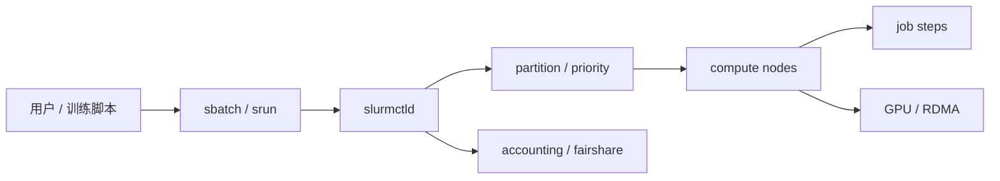

# 第 24 章：Slurm 与 HPC 调度

## 本章回答的问题

- Slurm 为什么在大模型训练集群中仍然重要？
- partition、node、job、step、sbatch、srun 和 GPU 资源如何组织训练任务？
- Slurm 与 Kubernetes 在 AI Factory 中如何分工？

## 一个真实场景

一个研究团队习惯用 Slurm 提交多节点训练，平台团队希望统一到 Kubernetes。迁移后发现，研究人员依赖的 partition、节点独占、拓扑约束、srun 调试和 HPC 网络环境很难直接复制。与此同时，在线推理和 MaaS 控制面又更适合 Kubernetes。最终平台采用分层策略：大规模预训练继续使用 Slurm，在线服务和平台控制面使用 Kubernetes，中间通过模型注册和数据平台衔接。

Slurm 和 Kubernetes 不是简单替代关系。它们来自不同历史背景，擅长不同问题。

## 核心概念

Slurm 是 HPC 领域广泛使用的作业调度系统。它以作业和节点为核心，提供队列、partition、资源分配、作业步骤、优先级、账户和拓扑调度能力。大规模训练与 HPC workload 相似：批式提交、长时间运行、强通信、资源独占和高性能网络。

在 AI Factory 中，Slurm 属于资源编排与作业调度层，常服务于预训练和大型研究任务。

## 系统架构



Slurm 控制器维护资源状态和作业队列，计算节点执行 job step，accounting 记录资源使用。

## 24.1 Slurm 架构

Slurm 典型组件包括 slurmctld、slurmd、slurmdbd 和命令行工具。slurmctld 是控制器，负责调度和状态管理；slurmd 运行在计算节点上，负责执行任务；slurmdbd 负责账户和历史数据。

Slurm 的优势是批式作业语义成熟、HPC 生态丰富、命令行体验稳定。它适合研究人员直接提交复杂训练脚本。

## 24.2 partition

Partition 是 Slurm 中的资源分区，可以按 GPU 型号、网络拓扑、业务用途或优先级划分。例如预训练 partition、调试 partition、推理实验 partition。Partition 决定作业可以使用哪些节点和策略。

Partition 设计不当会导致资源碎片。过多 partition 增强隔离，但降低利用率；过少 partition 简单，但难以表达业务差异。

## 24.3 node

Node 是 Slurm 管理的计算节点。AI 集群节点通常包含多张 GPU、CPU、内存、本地 NVMe 和 RDMA NIC。节点状态包括 idle、alloc、down、drain 等。

节点状态管理是运维关键。发现 GPU Xid、ECC、网络异常或磁盘故障时，应把节点 drain 出队列，避免新任务被调度到问题节点。

## 24.4 job

Job 是用户提交的资源申请和执行单元。它包含资源需求、运行命令、时间限制、输出路径和环境变量。训练任务通常以 job 形式提交，申请多个节点和 GPU。

Job 的资源声明应尽量明确，包括 GPU 数量、节点数、时间限制、partition 和约束。模糊声明会增加排队和资源浪费。

## 24.5 step

Step 是 job 内部的执行阶段。一个 job 可以包含多个 step，例如环境准备、数据检查、训练、评测。`srun` 常用于启动分布式 step。

Step 级别信息对排障很重要。训练失败时，要知道失败发生在初始化、数据读取、NCCL 建连、训练循环还是 checkpoint。

## 24.6 sbatch 与 srun

`sbatch` 用于提交批处理作业，作业进入队列后由 Slurm 调度运行。`srun` 用于启动并行任务，也常用于交互调试。训练脚本通常通过 `sbatch` 提交，在脚本内部用 `srun` 启动多个进程。

平台可以提供标准作业模板，封装环境变量、NCCL 配置、日志目录和 checkpoint 路径，降低用户重复配置成本。

## 24.7 GPU 资源

Slurm 可通过 GRES 等机制管理 GPU 资源。作业可以申请特定数量 GPU，平台也可以按 GPU 类型、节点特征和约束调度。AI 场景还需要结合 MIG、独占、拓扑和健康状态。

GPU 资源管理应和资产系统、监控系统同步。Slurm 看到节点可用，不代表 GPU 适合训练；准入和健康检查结果必须反馈给调度。

## 24.8 topology-aware scheduling

Topology-aware scheduling 让调度器考虑节点间网络和节点内 GPU 拓扑。大规模训练对通信路径敏感，随机放置可能导致 NCCL 性能波动。

Slurm 在 HPC 拓扑调度方面有成熟经验。AI Factory 可以把机架、leaf/spine、rail、GPU 型号和节点健康作为调度约束或权重。

## 24.9 Slurm vs Kubernetes

Slurm 擅长批式 HPC 作业、研究训练、节点独占和命令行工作流。Kubernetes 擅长服务化、控制器生态、在线服务、云原生扩展和平台组件。二者可以共存。

分工的一种常见方式是：Slurm 管大规模预训练和研究集群，Kubernetes 管 MaaS、推理服务、微调平台和控制面。模型注册、数据平台、镜像和身份系统把二者连接起来。

## 工程实现

Slurm 作业模板示例：

```bash
#!/bin/bash
#SBATCH --job-name=pretrain
#SBATCH --partition=training
#SBATCH --nodes=8
#SBATCH --gres=gpu:8
#SBATCH --time=72:00:00

srun --ntasks-per-node=8 bash train.sh
```

生产模板还应注入日志路径、checkpoint 路径、NCCL 环境和故障收集脚本。

## 常见故障

- 节点处于 drain/down，但用户不知道原因。
- 作业申请资源过宽，长时间排队。
- GPU 健康状态未同步给 Slurm，坏卡进入训练。
- 拓扑约束缺失，跨机架通信性能差。
- Slurm 和 Kubernetes 各自维护资产状态，口径不一致。

## 性能指标

- 队列等待时间、作业成功率、失败率。
- GPU 利用率、节点利用率、partition 利用率。
- 作业运行时间、step time、NCCL 通信指标。
- 节点 drain 原因、恢复时间。
- Fairshare 和账户用量。

## 设计取舍

统一 Kubernetes 可以减少平台类型，但可能牺牲 HPC 工作流成熟度。保留 Slurm 能服务研究和预训练，但会增加双平台治理成本。AI Factory 应按 workload 选择工具，而不是按组织偏好强行统一。

## 小结

- Slurm 是大规模训练和 HPC-style job 的成熟调度系统。
- Partition、node、job 和 step 是理解 Slurm 的核心对象。
- Slurm 和 Kubernetes 可以在 AI Factory 中分工协作。
- 拓扑、健康和账户数据需要跨平台统一。

## 延伸阅读

- TODO: Slurm 官方文档
- TODO: Slurm GPU GRES 文档
- TODO: HPC AI 训练集群案例
