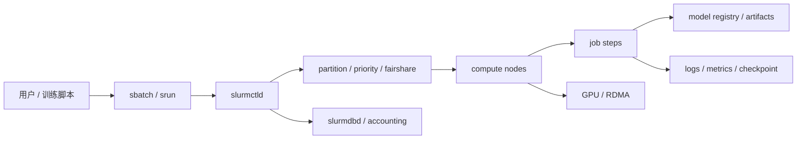

# 第 24 章：Slurm 与 HPC 调度

## 本章回答的问题

- Slurm 为什么在大模型训练集群中仍然重要？
- partition、node、job、step、sbatch、srun 和 GPU 资源如何组织训练任务？
- Slurm 与 Kubernetes 在 AI Factory 中如何分工？

## 一个真实场景

一个研究团队长期使用 Slurm 提交多节点训练，熟悉 `sbatch`、`srun`、partition、节点独占和交互式调试。平台团队希望统一到 Kubernetes，迁移后发现研究人员依赖的节点约束、MPI/NCCL 启动方式、作业日志、拓扑控制和账户 fairshare 很难直接复制。与此同时，在线推理、MaaS 控制面和 API Gateway 又明显更适合 Kubernetes 的服务化模型。

最终，平台没有强行二选一，而是采用分工：大规模预训练、研究训练和强 HPC 风格作业继续运行在 Slurm；在线推理、平台控制面、微调产品化入口和模型服务运行在 Kubernetes；数据平台、模型注册、镜像仓库、身份系统、观测和成本系统把二者连接起来。这样既保留研究训练效率，也让模型产物能进入服务化链路。

这个场景说明，Slurm 和 Kubernetes 不是简单替代关系。二者来自不同历史背景，擅长不同问题。Slurm 以批式作业、节点、队列和 HPC 网络为核心；Kubernetes 以声明式 API、服务、控制器和容器生态为核心。AI Factory 应按 workload 选择工具，而不是按组织口号统一所有系统。

真正困难的不是同时存在两套系统，而是两套系统缺少共同治理。若 Slurm 的账户、节点、日志、模型产物和成本与 Kubernetes 平台断裂，组织就会得到两个孤岛；若为了统一强行丢掉 Slurm 的 HPC 能力，大规模训练效率又会下降。AI Factory 的目标是分工清晰、事实统一，而不是形式统一。

评估这类平台时，要看训练成果能否顺利流向后续环节。一个 Slurm 作业训练出 checkpoint 后，是否能自动触发评测，是否能注册模型，是否能被 Kubernetes 推理服务加载，是否能计算训练成本，这些问题比“用了哪个调度器”更关键。

## 核心概念

Slurm 是 HPC 领域广泛使用的作业调度系统，以 job、node、partition、step、account 和 fairshare 为核心。用户提交作业，Slurm 根据资源、队列、优先级、账户和拓扑选择节点并启动任务。大规模训练与 HPC workload 很相似：批式提交、长时间运行、强通信、资源独占、多节点同步、依赖高速网络和 checkpoint。

在 AI Factory 中，Slurm 属于资源编排与作业调度层，而不是传统 IaaS 或 AI PaaS。它管理的是作业如何使用 GPU 节点，不负责模型 API、AI Gateway、租户计费产品化入口，也不负责裸金属交付。它向上服务训练团队和研究工作流，向下依赖 GPU IaaS、网络、存储和节点健康。

Slurm 的优势是批式作业语义成熟、命令行体验稳定、HPC 生态丰富、拓扑和账户能力完善。挑战是服务化、多租户产品入口、云原生控制器和在线流量治理不是它的主场。因此，讨论 Slurm 的重点不是“是否过时”，而是它在 AI Factory 中如何与 Kubernetes 和平台层分工协作。

还要理解 Slurm 的用户模型。很多研究团队把作业脚本视为实验的一部分，命令行调试、环境模块、交互节点和日志文件是日常工作方式。平台如果忽视这种工作流，迁移阻力会很大。好的平台不是把研究者从 Slurm 强行拉走，而是让 Slurm 作业自然接入模型、数据、评测和成本系统。

这也意味着 Slurm 治理不能只靠 UI。命令行、脚本模板、模块环境、容器入口和平台 API 都要使用同一套元数据规范。用户可以选择入口，但不能绕过审计、成本和产物规则。灵活入口和统一治理可以同时存在。

因此，判断 Slurm 是否适合某个 AI Factory，不应只看它能否分配 GPU，而要看它能否把训练作业纳入统一事实源。作业、账户、节点、产物和成本若能被平台理解，Slurm 就是训练系统的一部分；若只能在命令行里自成闭环，它就会逐渐变成难以治理的资源孤岛。

## 系统架构

Slurm 架构通常包括 slurmctld、slurmd、slurmdbd、命令行工具和计算节点。slurmctld 是控制器，维护集群状态、队列和调度决策；slurmd 运行在每个计算节点上，负责启动和管理作业步骤；slurmdbd 记录账户、历史和资源使用；用户通过 `sbatch`、`srun`、`squeue`、`sacct` 等命令提交、启动、查询和审计作业。

在 AI 训练中，Slurm 还要与数据、网络、存储和运行时结合。作业脚本加载模块或容器，设置 NCCL、CUDA、RDMA 环境变量，读取数据集，启动多进程训练，周期性写 checkpoint。节点健康、GPU 状态、网络拓扑和存储性能都会影响作业结果。Slurm 负责资源和执行控制，但训练正确性依赖完整运行环境。

架构集成的关键，是把 Slurm 作业状态接入 AI Factory 的统一平台。模型产物应进入 model registry，日志和指标应进入观测系统，账户和 GPU 小时应进入成本系统，节点健康应与 GPU 资源池同步。Slurm 可以保留研究者熟悉的入口，但不能成为孤岛。否则训练产物难以进入 MaaS、评测和模型服务。

这要求在架构中建立映射关系：Slurm account 映射到租户，job id 映射到实验，partition 映射到资源池，node 映射到资产和健康状态，checkpoint 映射到模型产物。没有这些映射，Slurm 仍能运行训练，却无法支撑 AI Factory 的商业化和平台化运营。

架构还要处理数据路径。Slurm 作业常直接访问并行文件系统或对象存储，Kubernetes 服务可能通过不同挂载或网关访问同一模型产物。若路径、权限和生命周期不统一，模型从训练到服务化会卡在文件系统边界。数据和产物规范是跨调度系统集成的基础。

控制面集成还要避免反向耦合。Slurm 不必理解 MaaS 的全部业务语义，Kubernetes 也不必直接接管 Slurm 的调度循环；更稳妥的做法是在二者之间建立事件、元数据和产物接口。这样可以保留 Slurm 的调度稳定性，同时让平台获得足够的可观测和治理信息。



## 24.1 Slurm 架构

Slurm 的核心是控制器和节点代理。slurmctld 负责维护资源状态、接受作业、执行调度、处理节点状态变化；slurmd 运行在计算节点，负责启动 job step、管理进程和汇报状态；slurmdbd 负责账户和历史记录。用户通过命令行工具与系统交互，形成稳定的 HPC 工作流。

这种架构适合长时间批式作业。训练团队可以用 `sbatch` 提交脚本，用 `srun` 启动分布式进程，用 `squeue` 查看排队，用 `sacct` 追踪历史。相比 Kubernetes 的多层对象，Slurm 对研究者更直接。大模型训练中，很多团队仍然重视这种可控、可调试、贴近节点的体验。

工程上，Slurm 架构要关注高可用、状态一致性和外部系统集成。slurmctld 是关键控制面，故障会影响调度；slurmdbd 数据影响成本和审计；节点状态要与硬件健康同步。AI Factory 中，Slurm 不应只由研究团队自己维护，而应纳入平台运维、监控、告警和变更流程。HPC 调度也需要 SRE 化。

Slurm 控制面的变更也要谨慎。升级 Slurm、修改调度参数、调整 accounting 或改变节点配置，都可能影响大量训练作业。平台应提供测试 partition 或灰度节点，先验证典型训练脚本、NCCL、checkpoint 和 accounting，再扩大范围。HPC 系统同样需要变更管理。

Slurm 架构还要考虑 HA 和灾备。控制器故障、数据库不可用或共享配置错误，可能让整个训练集群无法提交或查询作业。AI Factory 应为 Slurm 控制面建立备份、监控和恢复演练，而不是只关注计算节点。

此外，配置管理必须可追踪。`slurm.conf`、GRES 配置、节点特性、账户规则和调度参数的变更，都应进入版本管理和审计流程。很多“训练突然变慢”并不是模型代码变化，而是某个调度或节点配置改变。把 Slurm 配置当作生产代码管理，是降低隐性风险的基础。

## 24.2 partition

Partition 是 Slurm 中的资源分区，定义一组节点和调度策略。AI 集群可以按 GPU 型号、网络拓扑、业务用途、优先级、环境或租户划分 partition，例如 `pretrain-h100`、`debug`、`eval`、`low-priority`。Partition 决定作业可以进入哪些资源池，也决定等待和优先级规则。

Partition 设计会直接影响利用率和用户体验。过多 partition 可以提供强隔离，但容易造成碎片：某个 partition 空闲，另一个 partition 排队。过少 partition 简单，但难以区分生产训练、调试任务和低优先级实验。AI Factory 需要根据 workload 和硬件能力设计 partition，而不是简单按团队划分。

工程上，partition 应有清晰说明：适用 workload、GPU 类型、网络能力、最大作业规模、时间限制、抢占策略、账户规则和维护窗口。用户提交作业时，应知道为什么选择某个 partition。平台也应监控 partition 利用率、等待时间和失败原因，定期调整。Partition 是资源策略，不是静态目录。

Partition 还应与业务 SLA 关联。预训练 partition 可以强调拓扑和长时间稳定，debug partition 可以强调快速启动和短时限，低优先级 partition 可以允许抢占。不同 partition 的规则应写入文档和系统提示。用户选择 partition 时，选择的是资源服务等级。

Partition 还应支持回填策略。短作业可以利用大作业等待期间的空隙，提高利用率；但回填不能影响已承诺的大作业启动窗口。如何设置时间限制和回填规则，会直接影响用户体验。没有时间限制的作业会让调度器难以优化。

在多租户环境中，partition 还承担沟通边界的作用。平台可以把“生产训练”“调试”“评测”“低优先级”做成不同入口，让用户在提交前理解规则。清晰的 partition 策略比事后人工协调更可靠，也能减少团队之间因为排队和抢占产生的摩擦。

## 24.3 node

Node 是 Slurm 管理的计算节点。AI 节点通常包含多张 GPU、CPU、内存、本地 NVMe、RDMA NIC、BMC 和复杂的拓扑。Slurm 需要知道节点可用性、资源数量、GPU GRES、特性标签、状态和健康。节点状态包括 idle、alloc、mix、down、drain、fail 等，直接决定作业能否调度。

节点状态管理是 Slurm 集群运维的核心。发现 GPU Xid、ECC 趋势、NVLink error、RDMA 链路异常、磁盘故障或驱动问题时，应把节点 drain 或标记不可用，避免新任务进入。对于长训练任务，坏节点代价很高。节点看似可调度，不代表适合训练；准入测试和健康检查结果必须反馈给 Slurm。

工程上，节点信息应与资产系统、监控系统和维修流程同步。节点维修后不能直接回到 idle，而要重新跑 GPU、NCCL、存储和网络测试。节点特性也要准确，例如 GPU 型号、NVLink 域、rack、rail、driver baseline。若 Slurm 的节点视图与真实硬件状态不一致，调度决策就会失真。Node 是 Slurm 与 GPU IaaS 的接缝。

节点 drain 原因要结构化。`drain` 只说明节点不可调度，不说明是 GPU Xid、ECC、RDMA、磁盘、维护还是软件栈问题。结构化原因能帮助用户理解等待，也能帮助平台统计故障热点。节点状态管理越细，长训练作业越少踩到坏资源。

节点还要有恢复流程。drain 后谁负责维修，修好后跑哪些验收，何时回到 idle，都应有状态机。手工把节点从 drain 改回 idle，而不做 GPU/NCCL/RDMA 验收，会把隐患重新交给训练任务。

节点标签也不能只描述硬件型号。训练系统需要知道节点属于哪个故障域、连接到哪组交换机、使用哪条软件基线、最近一次验收结果是什么。调度器看到的是节点，平台运营看到的是资产生命周期。二者如果脱节，节点问题会在训练作业中反复暴露。

## 24.4 job

Job 是用户提交的资源申请和执行单元。它包含资源需求、命令、时间限制、partition、账户、输出路径、环境和约束。训练任务通常以 job 形式申请多个节点和 GPU，然后在 job 中启动多进程训练。Job 是 Slurm 调度、审计和计费的基本对象。

Job 的资源声明要尽量明确。节点数、每节点 GPU 数、总任务数、时间限制、partition、约束、账户和输出路径都会影响排队和运行。如果声明过宽，作业可能长期等待；声明过窄，训练可能 OOM 或性能差；时间限制过短，作业可能被杀；时间限制过长，又会影响调度回填。资源声明是用户与调度器之间的契约。

工程上，平台可以提供标准 job 模板，封装 NCCL、CUDA、日志、checkpoint、环境加载和故障收集。用户仍然保留训练脚本自由，但关键运行时参数由模板治理。Job 元数据也应进入模型平台：模型名、数据集、镜像或环境、commit、checkpoint、实验编号和成本标签。否则 Slurm job 完成后，产物很难被后续系统理解。

Job 还要有生命周期状态。提交、排队、分配、运行、失败、取消、超时、完成、产物上传和模型注册应能串起来。Slurm 原生状态是基础，AI Factory 需要在其上增加模型和数据语义。这样训练团队和平台团队才能围绕同一 job 讨论。

Job 失败也要分类。用户脚本错误、环境错误、节点故障、网络故障、存储故障、超时和抢占的处理方式不同。若所有失败都只是 FAILED，平台无法做趋势分析，也无法判断是用户需要修改脚本，还是基础设施需要维护。

因此，生产训练不应只保存退出码。作业应记录关键输入、代码版本、数据版本、镜像或模块、资源申请和失败阶段。这样同一个 job 才能被复现、比较和归因。对 AI Factory 来说，job 既是调度对象，也是实验记录和成本对象。

## 24.5 step

Step 是 job 内部的执行阶段。一个 job 可以包含多个 step，例如环境准备、数据检查、NCCL 自检、训练、评测、checkpoint 转换和产物上传。`srun` 常用于在已分配资源中启动并行 step。Step 让一个 job 内部的多阶段执行可以被 Slurm 管理和记录。

Step 级别信息对排障非常重要。训练失败时，平台需要知道失败发生在环境初始化、数据读取、NCCL 建连、forward/backward、checkpoint 还是评测。只看 job failed 太粗。Step 能帮助把长训练任务拆成可诊断阶段，也便于统计不同阶段耗时和失败原因。

工程上，应在模板中规范 step 命名和日志路径。例如 `precheck`、`prepare-data`、`train`、`evaluate`、`upload-artifacts`。每个 step 产生结构化日志和指标，并与 job id、实验 id 关联。这样 Slurm 的执行阶段可以映射到 AI Factory 的训练生命周期。Step 不是细枝末节，而是长作业可观测性的关键粒度。

Step 还可以作为失败恢复边界。若 precheck 失败，不应消耗长时间训练资源；若 evaluation 失败，不一定需要重跑训练；若 upload-artifacts 失败，可以保留 checkpoint 后重试上传。把作业拆成清晰 step，有助于减少无效重跑。长训练任务的成本决定了这种粒度很有价值。

Step 粒度也能帮助优化模板。若大量作业在 precheck 失败，说明准入前检查不足；若训练 step 正常但 upload 频繁失败，说明产物系统或权限有问题。把失败聚合到 step，比只统计 job 失败更有指导意义。

在大作业中，step 还可以承载保护性检查。正式训练前先用少量 batch 检查数据、通信和 checkpoint 写入，可以避免占用数百张 GPU 后才发现路径或权限错误。Step 的价值不只是记录阶段，更是把昂贵错误尽早暴露。

## 24.6 sbatch 与 srun

`sbatch` 用于提交批处理脚本，作业进入队列后由 Slurm 调度运行。`srun` 用于在分配的资源上启动并行任务，也可用于交互式调试。大模型训练常见模式是用 `sbatch` 提交作业脚本，在脚本中用 `srun` 启动每节点多个训练进程，让框架根据环境变量初始化分布式通信。

`sbatch` 和 `srun` 的优势是直接、可脚本化、符合研究工作流。研究人员可以快速调整参数、查看日志、进入交互节点调试。相比复杂平台 UI，这种方式对底层系统透明。但透明也带来风险：每个人手写 NCCL 环境、日志路径和 checkpoint 规则，容易形成不可复现的脚本碎片。

工程上，平台应提供受控模板，而不是禁止命令行。模板可以封装账户、partition、资源声明、环境模块、容器启动、NCCL 参数、日志、checkpoint 和产物上传。用户只填模型、数据和训练参数。这样既保留 Slurm 的灵活性，也把生产关键路径标准化。命令行体验和平台治理并不冲突。

模板还应支持本地调试和生产提交的一致性。研究者可以在小 partition 用相同模板调试，再扩大到大规模训练。若调试脚本和生产脚本完全不同，问题会在放大后暴露。`sbatch` 和 `srun` 的价值，在于让这种逐步放大过程足够直接。

模板要避免过度封装。研究者仍需要能看到最终命令、环境变量和节点列表，才能定位性能问题。好的模板是可读、可覆盖、可审计的，而不是隐藏所有细节的黑盒。透明性是 Slurm 工作流的重要优势。

同时，模板要有版本。一次训练使用哪个模板版本、哪些默认参数、哪些参数被用户覆盖，都应进入日志和实验元数据。否则同一份训练脚本在不同时间运行，可能因为模板变化得到不同结果。可复现性来自代码，也来自提交入口。

## 24.7 GPU 资源

Slurm 通常通过 GRES 等机制管理 GPU 资源。作业可以申请每节点 GPU 数、特定 GPU 类型或特定节点特性。AI 场景还需要考虑 MIG、GPU 独占、拓扑、健康状态、driver baseline、RDMA 和本地 NVMe。GPU 不只是计数资源，而是带有能力、拓扑和状态的稀缺资源。

GPU 资源管理必须与节点健康联动。Slurm 看到 GRES 可用，不代表 GPU 适合训练。GPU Xid、ECC、NVLink error、降频、RDMA 异常、驱动漂移都应影响节点或 GPU 是否可调度。否则坏卡进入训练任务，会造成长时间失败和昂贵重跑。准入测试结果应能反馈给 Slurm，例如 drain 节点或调整特性标签。

工程上，GPU 资源还要与成本和租户绑定。Slurm accounting 可以记录 GPU 时间，但 AI Factory 还需要知道使用的是哪类 GPU、哪个项目、哪个模型、是否产生有效 checkpoint 或模型产物。单纯 GPU 小时不足以解释训练效率。GPU 资源管理应连接资产、调度、健康、观测和成本。

GPU 资源还应支持独占和共享策略。大规模训练通常需要节点或 GPU 独占，调试任务可能只需要短时资源。Slurm partition、GRES 和约束可以表达这些差异，但平台要把规则说清楚。否则用户会用过大的资源申请来规避不确定性，反而降低整体利用率。

GPU GRES 配置还要和实际设备一致。MIG、整卡、故障 GPU 和维护 GPU 的资源形态不同，Slurm 配置如果不更新，就会错误调度。资源配置应由自动发现或准入系统生成，而不是长期手工维护。

GPU 资源还要避免“数量正确、能力错误”。同样是 8 张 GPU，是否在同一 NVLink 域，是否连接健康 RDMA，是否有足够本地 NVMe，都会改变训练结果。Slurm 的资源表达应尽量把这些能力显式化，减少用户用节点黑名单和经验规则绕路。

## 24.8 topology-aware scheduling

Topology-aware scheduling 让调度器考虑节点之间网络、机架、rail、交换机路径，以及节点内 GPU 拓扑。大规模训练对通信路径敏感，随机放置可能导致 NCCL 性能波动。Slurm 在 HPC 场景中长期处理拓扑和节点约束，因此在大规模 AI 训练中仍然有价值。

拓扑调度需要真实拓扑数据。节点属于哪个 rack、哪个 leaf、哪个 rail，GPU 与 NIC 的关系如何，哪些节点共享故障域，这些信息都要进入调度视图。若拓扑数据不准，调度器的“拓扑感知”只是形式。拓扑还会随维护和扩容变化，因此需要持续更新，而不是一次性配置。

工程上，拓扑策略要与作业规模匹配。小规模调试任务不必占用最优拓扑，大规模预训练则应优先获得连续、高带宽、健康的节点集合。平台可以为不同 partition 设置不同拓扑策略。指标包括 NCCL 带宽、rank skew、跨机架通信比例和拓扑约束失败次数。拓扑调度的目标是让训练性能可预测，而不是追求静态最优图。

拓扑策略还要与维护计划协调。某个 rack 进入维护，相关拓扑域能力下降，调度器和用户都应知道。否则作业可能等待一个暂时不可用的理想拓扑，或被调度到性能较差的替代路径。拓扑感知不是一次性配置，而是持续运营数据。

拓扑调度还要服务成本。为了极致性能保留最优节点集合可能提高训练吞吐，但也可能让其它任务等待；放宽拓扑约束提高利用率，却可能降低训练效率。平台应让用户或队列明确性能优先还是等待时间优先。不同策略适合不同训练阶段。

因此，拓扑策略最好可解释。用户应能看到作业为什么等待，是缺少连续节点、缺少同 rail 节点，还是被高优先级队列占用。可解释的等待比黑盒排队更容易被接受，也便于平台判断是否需要扩容或调整队列规则。

## 24.9 Slurm vs Kubernetes

Slurm 擅长批式 HPC 作业、研究训练、节点独占、命令行工作流、账户 fairshare 和拓扑调度。Kubernetes 擅长服务化、声明式控制器、在线服务、云原生生态、多租户 API 和平台组件。二者的优势不同，来自历史目标不同。把 Slurm 说成“旧”，或把 Kubernetes 说成“一定更现代”，都过于粗糙。

AI Factory 中，一种常见分工是：Slurm 管大规模预训练、研究集群和需要强 HPC 语义的任务；Kubernetes 管 MaaS、推理服务、微调平台、评测服务、AI Gateway 和控制面。Ray、Kubeflow、Argo、Kueue、Volcano 等工具可以在 Kubernetes 侧补充批式语义，但不一定完全替代 Slurm。选择要看 workload、团队习惯和运维能力。

分工的关键是统一治理。身份、数据权限、镜像、模型注册、日志、指标、成本和安全策略不能各做一套。Slurm job 训练出的模型要能进入 Kubernetes 模型服务；Kubernetes 平台的评测结果要能关联 Slurm 训练任务。二者可以共享平台层能力，而不必共享同一个调度器。共存不是妥协，而是按问题选择工具。

边界设计还要考虑用户入口。研究者可以继续从 Slurm CLI 进入，平台用户可以从 Web 或 API 提交训练任务，二者最终都应产生统一实验记录。入口可以不同，元数据和产物规范应一致。这样组织可以同时支持专家工作流和产品化工作流。

Kubernetes 与 Slurm 的关系也可以随时间演进。某些训练任务可能逐步迁到 Kubernetes 批调度，某些超大规模预训练仍留在 Slurm。平台应允许混合阶段长期存在，而不是把迁移看作一次性项目。稳定运行比形式统一更重要。

最终取舍要落到证据。若 Kubernetes 侧能提供相同的启动可靠性、拓扑控制、调试体验和性能稳定性，迁移就有依据；若 Slurm 侧能接入统一模型和成本系统，保留也有依据。工具选择应服务训练产出，而不是服务架构叙事。

## 工程实现

Slurm 作业模板应把资源、环境、日志、checkpoint 和诊断标准化。用户可以继续使用 `sbatch` 提交训练，但平台模板应注入账户、partition、节点数、GPU 数、NCCL 环境、数据路径、checkpoint 路径、实验 id 和故障收集脚本。模板的目标不是限制研究，而是让生产训练可复现、可观测、可恢复。

示例模板如下：

```bash
#!/bin/bash
#SBATCH --job-name=pretrain
#SBATCH --partition=training
#SBATCH --nodes=8
#SBATCH --gres=gpu:8
#SBATCH --time=72:00:00
#SBATCH --output=logs/%x-%j.out

export EXPERIMENT_ID=${SLURM_JOB_ID}
export CHECKPOINT_DIR=/checkpoints/${EXPERIMENT_ID}
srun --ntasks-per-node=8 bash train.sh
```

生产模板还应包含 precheck step，验证 GPU、driver、NCCL、RDMA、数据路径和 checkpoint 目录。训练结束后，应上传指标、产物和模型注册信息。平台可以把 Slurm job id、实验 id、模型版本和成本标签绑定。这样 Slurm 作业不只是命令行任务，而是 AI Factory 训练生命周期的一部分。

工程实现还应提供 Slurm 到平台的同步器。它读取 job、step、node、accounting 和日志信息，写入统一观测和成本系统。同步器不需要改变用户使用 Slurm 的方式，却能让平台看到训练资源消耗和产物状态。这个集成往往比替换 Slurm 更实际。

同步器应产出结构化事件，而不是只做批量日志导入。事件至少覆盖 job submitted、allocated、step started、first effective step、checkpoint committed、failed、completed、artifact registered。这样 Slurm 作业可以和 Kubernetes 训练作业进入同一条模型生命周期。

```yaml
slurm_platform_event:
  event_type: checkpoint_committed
  slurm_job_id: "123456"
  slurm_step_id: "123456.3"
  experiment_id: exp-20260619-001
  tenant: foundation-model-team
  nodes: [gpu-node-001, gpu-node-002]
  checkpoint_id: ckpt-step-120000
  resource_accounting:
    allocated_gpu_hours: measured
    effective_training_gpu_hours: measured
  artifact:
    registry_candidate: true
```

Slurm account、partition 和 job id 还应映射到平台租户、资源池和实验。映射关系不能靠手工表格长期维护，应进入身份和资源管理系统。否则 Slurm accounting 与平台成本系统会长期漂移，同一训练成本在不同报表中出现不同归属。

同步器还应处理失败和延迟。Slurm accounting 可能滞后，日志上传可能失败，模型注册可能需要重试。平台应把同步状态展示出来，避免用户以为训练完成就代表所有产物都已进入平台。工程实现的重点是闭环，而不是单向采集。

提交入口还应加入前置校验。平台可以在 `sbatch` 包装器或 Web/API 入口中检查账户权限、partition 合法性、数据路径、镜像版本、checkpoint 目录和预计资源。能在提交前发现的问题，不应等到作业排队数小时后才失败。前置校验越充分，调度系统越少承受无效作业。

生产环境还需要定义取消和恢复流程。用户取消、管理员抢占、节点故障和时间限制触发的终止，应写出不同事件并驱动不同后续动作。可恢复的训练应自动保留最近 checkpoint，不可恢复的失败应明确标记，避免成本系统把无效重跑误认为正常消耗。

## 常见故障

第一类故障是节点状态不准确。节点实际存在 GPU、网络或磁盘问题，但 Slurm 仍认为可调度，训练任务进入后失败。第二类故障是资源声明不合理。用户申请过宽导致长期排队，申请过窄导致 OOM 或性能差。第三类故障是作业脚本碎片化，每个团队自己设置 NCCL、日志和 checkpoint，失败后难以复现。

第四类故障是拓扑约束缺失。作业拿到足够节点，但跨机架、跨 rail 或包含慢节点，训练性能远低于预期。第五类故障是 Slurm 与 Kubernetes 各自维护资产和成本状态，导致同一 GPU 在不同系统中口径不一致。第六类故障是产物断裂：Slurm 训练完成，但模型没有进入 registry，评测和服务化无法自动衔接。

排障时，应先确认 job、partition、node、step 和环境。查看作业在哪个 partition，分配了哪些节点，哪些 step 失败，节点是否 drain，GPU 和网络指标是否异常，checkpoint 是否写入。Slurm 提供了清晰的作业视角，但 AI Factory 还需要把这些信息与模型、数据、镜像和成本关联起来。

常见故障还包括账户和权限问题。作业排队不是因为没有 GPU，而是账户没有对应 partition 权限，或者数据路径没有访问权限。平台应把这些原因在提交阶段暴露，而不是让作业进入队列后失败。权限与调度同样影响用户体验。

还有一类故障是双平台口径冲突。Slurm 显示节点可用，资产系统显示维护；Slurm accounting 显示某账户用量，成本系统按另一个租户归集。解决方向是统一身份和资产映射，并定期对账。否则多调度系统会放大管理偏差。

排障原则是先收敛事实源。先确认作业 id、节点列表、step、账户、镜像或模块、数据路径和时间线，再判断责任边界。没有统一事实时，训练团队、平台团队和硬件团队会各自看到局部真相，问题解决时间会被沟通成本吞掉。

第七类故障是 Slurm 作业完成但平台生命周期未完成。训练脚本退出 0，checkpoint 留在并行文件系统，但评测没有触发、模型没有注册、成本没有归集、产物权限没有设置。对用户来说训练完成，对 AI Factory 来说模型还不可用。解决方向是把 artifact registration 和 evaluation trigger 作为 job 后置事件，而不是靠人工搬运。

## 性能指标

Slurm 层指标包括队列等待时间、作业准入时间、job 成功率、失败率、运行时长、取消原因、partition 利用率、节点利用率、fairshare 和账户用量。它们回答调度是否公平、资源是否高效、用户是否能获得可预期窗口。仅看 GPU 利用率不够，因为作业可能长时间排队或反复失败。

训练层指标包括 step time、tokens/s、samples/s、NCCL 时间、rank skew、checkpoint 时间、数据读取时间和恢复时间。节点层指标包括 GPU utilization、HBM、Xid、ECC、NVLink、RDMA、温度、功耗和本地 NVMe。Slurm 指标与训练指标结合，才能解释“为什么这个 job 慢”：是排队慢、节点慢、网络慢、存储慢，还是模型配置变化。

运营指标包括 partition 等待分布、资源碎片、drain 原因、平均修复时间、作业重跑成本、账户使用趋势和产物注册成功率。AI Factory 需要用这些指标决定是否调整 partition、增加节点、修改模板、隔离故障域或优化数据路径。Slurm 指标不只是 HPC 管理数据，也是 AI 训练经济性的输入。

指标还应支持跨 Kubernetes 对比。训练产物进入推理后，平台应能看到训练成本、评测成本和推理收益之间的关系。Slurm 只记录训练侧资源，AI Factory 要把它放入完整模型生命周期。这样才能讨论训练 ROI，而不是只讨论 GPU 利用率。

指标也应反馈给用户。研究者需要知道自己的作业排队、运行和失败原因，团队负责人需要看到账户消耗和产物产出，平台负责人需要看到资源池效率。不同角色看不同视图，但底层数据应一致。

指标还要形成改进闭环。若某个 partition 长期排队，应分析是资源不足、时间限制过宽还是拓扑约束过紧；若某类 step 频繁失败，应改模板或准入检查；若某组节点反复进入 drain，应进入硬件或网络维修流程。指标不能只展示，必须能驱动动作。

跨 Slurm 和 Kubernetes 的指标应统一训练链路口径。至少应统一 queue wait、allocated GPU hours、effective GPU hours、checkpoint success、artifact registration、evaluation pass 和 model serving readiness。这样才能比较两条调度路径的真实效率，而不是只比较调度器自身指标。

## 设计取舍

第一个取舍是统一 Kubernetes 与保留 Slurm。统一 Kubernetes 可以减少平台类型和运维表面，但可能牺牲 HPC 工作流、命令行体验和拓扑调度成熟度。保留 Slurm 能服务研究和预训练，但会增加双平台治理成本。选择不应基于偏好，而应基于 workload 特征和团队能力。

第二个取舍是灵活脚本与标准模板。完全自由脚本适合研究探索，但难以复现和治理；严格模板提高稳定性，但可能限制实验速度。可行做法是分层：资源声明、环境、日志、checkpoint 和产物上传标准化，模型代码和训练参数保持灵活。这样既不破坏研究效率，也能满足生产要求。

第三个取舍是独立集群与统一平台。Slurm 集群可以独立运转，但模型、数据、观测和成本如果不统一，就会形成孤岛。统一平台接入会增加集成成本，但能让训练产物进入评测、注册和服务链路。AI Factory 应接受多调度系统共存，但不能接受多套事实源长期割裂。

第四个取舍是迁移与演进。把所有 Slurm 任务迁到 Kubernetes 可能需要重写脚本、改变调试习惯和重新验证性能；保留 Slurm 则需要双平台治理。更务实的路径是先统一元数据、镜像、数据和产物，再逐步评估哪些 workload 适合迁移。迁移应由证据驱动，而不是由平台偏好驱动。

第五个取舍是专家效率与平台自助。Slurm 对专家友好，Web/API 平台对普通用户友好。AI Factory 可以同时支持二者：专家通过 Slurm 快速迭代，平台通过模板和 API 提供标准化训练。关键是产物、指标和成本最终汇入同一系统。入口多样不等于治理分裂。

## 小结

- Slurm 在大规模训练和 HPC-style job 中仍然有重要价值。
- Partition、node、job 和 step 是理解 Slurm 作业模型的核心。
- `sbatch` 和 `srun` 提供稳定命令行工作流，但生产环境需要模板治理。
- Slurm 与 Kubernetes 可以分工协作，关键是统一身份、数据、模型、观测和成本。
- 拓扑、节点健康和产物注册决定 Slurm 能否融入 AI Factory。

## 延伸阅读

- [Slurm documentation](https://slurm.schedmd.com/documentation.html)
- [Slurm GRES documentation](https://slurm.schedmd.com/gres.html)
- [NERSC Perlmutter architecture](https://docs.nersc.gov/systems/perlmutter/architecture/)
